# AI DevOps Incident Commander

> An AI SRE that **investigates** production incidents, **correlates** evidence across the
> whole platform, **recommends** a root cause, **proposes** a fix, **executes** approved
> runbooks behind a human gate, **verifies** recovery, and **writes the postmortem**.
>
> This is **not a chatbot.** It is a **stateful, multi-agent system** built the way a
> distinguished-staff review expects: the **control plane governs the data plane**, and
> observability, safety, and evaluation are designed in from the first line — not promised
> for "later".

---

## Why this exists

When PagerDuty fires `Payment API error rate 2% → 35%`, the on-call engineer today does a
frantic manual tour: Grafana → Prometheus → Kubernetes → GitHub → Slack → Helm → Argo →
Loki. Every hop is a context switch, and the mean-time-to-resolution (MTTR) is dominated by
*navigation*, not by *thinking*. The Incident Commander (IC) collapses that tour into a
single, auditable, parallel investigation.

| Objective | How the IC moves the number |
|---|---|
| ↓ MTTR | Parallel fan-out investigation + ranked root-cause + one-click approved fix |
| ↓ MTTD | Alert-triggered auto-triage; correlates the alert with recent deploys/changes instantly |
| ↓ On-call fatigue | The machine does the log-grepping and dashboard-hopping; humans decide |
| ↓ Manual log searching | 16 read-only investigation agents query sources concurrently |
| ↓ Dashboard hopping | Evidence is collected *to* the incident, not scattered across 8 UIs |
| ↓ False root-cause | Multi-agent debate + Bayesian confidence scoring replaces the first-guess bias |

---

## The 90-second mental model

```mermaid
flowchart LR
  subgraph CP["🛡️ Control Plane — GOVERNS"]
    direction TB
    REG["Incident & Agent Registry"]
    RBAC["AuthZ / RBAC / Blast-radius policy"]
    APPR["Approval Policy Engine"]
    AUD["Audit Log (append-only)"]
    COST["Cost & Budget Governor"]
    EVAL["Evaluator / RCA quality gate"]
  end

  subgraph DP["⚙️ Data Plane — EXECUTES"]
    direction TB
    SM["Incident state machine\nDETECT→…→CLOSE"]
    ORCH["Investigation Planner + fan-out"]
    AGENTS["16 read-only investigation agents"]
    REASON["Evidence→Hypotheses→Debate→Confidence"]
    ACT["Runbook Executor (gated)"]
    PM["Postmortem Generator"]
  end

  CP -. authorizes / prices / scores / records .-> DP
  DP -. emits spans, cost, evidence, decisions .-> CP
```

Every incident is **authorized** and **recorded** (control plane), **executed** as a bounded
state machine over a parallel investigation (data plane), **priced** against per-incident
budgets (control plane), and **traced + scored** end-to-end (both planes). Read
[docs/01-architecture.md](docs/01-architecture.md) for the full picture.

---

## Document map

Start at the top and go down; each doc is self-contained and maps onto one or more of the
eight system-design principles.

| # | Doc | Principle(s) | What it answers |
|---|-----|-------------|-----------------|
| 00 | [Overview & problem framing](docs/00-overview.md) | — | Users, goals, scope, the worked example incident |
| 01 | [High-level architecture](docs/01-architecture.md) | all | Control/data plane split, the full block diagram, planes' contracts |
| 02 | [Agent runtime & execution model](docs/02-agent-runtime.md) | 1 | The incident state machine, budgets, resumability, isolation |
| 03 | [Orchestration & coordination](docs/03-orchestration.md) | 2 | Investigation Planner, bounded parallel fan-out, DAG scheduling |
| 04 | [Memory & context management](docs/04-memory-context.md) | 3 | Incident blackboard, short/long-term memory, incident history recall |
| 05 | [Tool & integration layer](docs/05-tool-integration.md) | 4 | The 16 agents as MCP-style tools, manifests, dynamic selection, error isolation |
| 06 | [Safety & guardrails](docs/06-safety-guardrails.md) | 5 | Human Approval Gateway, blast-radius, dry-run, read/write separation, injection defense |
| 07 | [Evaluation & observability](docs/07-evaluation-observability.md) | 6 | Spans, RCA-quality scoring, offline replay eval, golden incidents |
| 08 | [Governance & lifecycle](docs/08-governance-lifecycle.md) | 7 | Agent registry, RBAC, audit, runbook lifecycle, eval-gated promotion |
| 09 | [Cost & performance](docs/09-cost-performance.md) | 8 | Model tiering/routing, caching, parallelism budgets, latency targets |
| 10 | [Hypotheses, debate & confidence](docs/10-hypothesis-and-debate.md) | 2,5,6 | Hypothesis generation, multi-agent debate loop, Bayesian confidence |
| 11 | [Remediation & verification](docs/11-remediation-and-verification.md) | 1,5 | Runbook model, execution, health verification, auto-rollback |
| 12 | [Postmortem generation](docs/12-postmortem.md) | 6,7 | Blameless postmortem synthesis from the incident trajectory |
| 13 | [Data model & contracts](docs/13-data-model.md) | all | Core schemas: Incident, Evidence, Hypothesis, Runbook, Decision |
| 14 | [End-to-end sequence flows](docs/14-sequence-flows.md) | all | The worked incident, step by step, with sequence diagrams |
| 15 | [Failure modes & resilience](docs/15-failure-modes.md) | 1,5,8 | What breaks, blast-radius containment, degraded modes |
| — | [Design-principle mapping](docs/design-principles.md) | all | Each of the 8 principles → concrete modules (the review cheat-sheet) |

Reference code contracts live in [reference_impl/](reference_impl/) — typed dataclasses and
the state-machine skeleton that the docs refer to.

---

## Non-negotiable design stances (the tl;dr for a reviewer)

1. **Read is not write.** All 16 investigation agents are *read-only*. The only component
   that mutates production is the **Runbook Executor**, and it is unreachable except through
   the **Human Approval Gateway** + control-plane RBAC + blast-radius policy.
2. **The machine proposes, a human disposes.** Confidence is an input to a *human* decision,
   never an auto-execute trigger — except for an explicitly pre-approved, low-blast-radius
   auto-remediation allowlist (see [06](docs/06-safety-guardrails.md)).
3. **Every claim carries a citation.** A hypothesis with no linked evidence is inadmissible.
   RCA is *evidence-based*, and the postmortem reconstructs the exact evidence trail.
4. **Bounded everything.** Steps, tool-calls, wall-clock, fan-out width, and dollars are all
   capped per incident; runaway loops force a `SUSPENDED(BUDGET)` and page a human.
5. **The debate fights the first-guess bias.** A dedicated skeptic agent must try to falsify
   the leading hypothesis before confidence can cross the approval threshold.
6. **Designed-in, not bolted-on.** Audit, RBAC, cost, tracing, and the read/write split are
   structural — you cannot execute a runbook that skips them, by construction.
