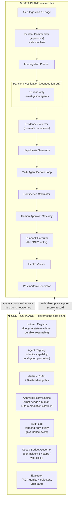
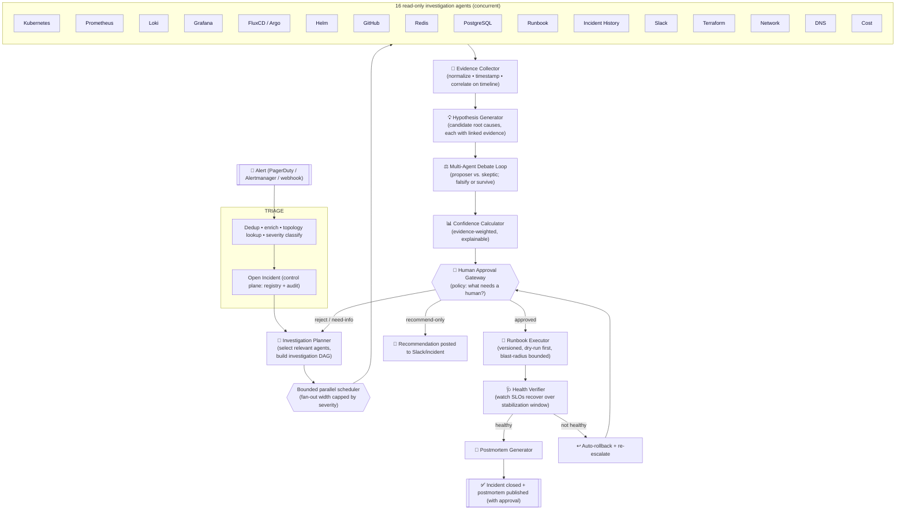
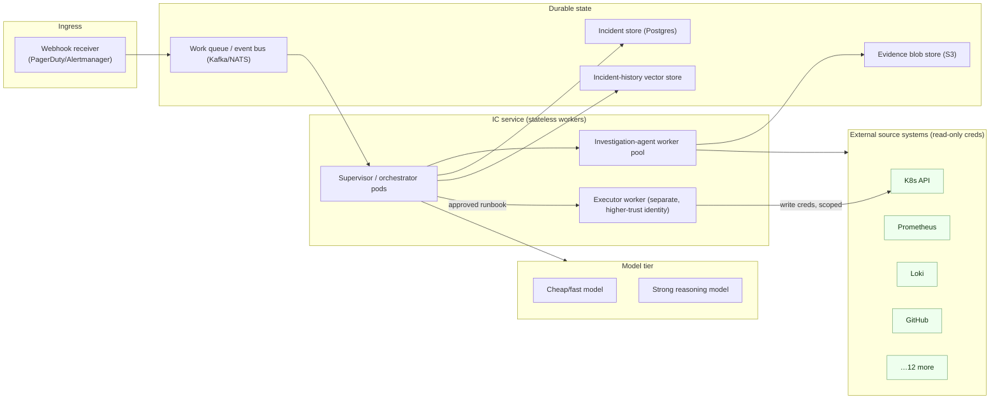

# 01 — High-Level Architecture

The IC is organized as **two planes**. The **control plane** governs *who may do what, at
what cost, and whether it was good*. The **data plane** *executes the investigation and the
remediation*. This separation is the single most important architectural decision: it is why
safety, cost, and auditability are structural rather than aspirational.

---

## 1. The two planes

**Reading the arrows:** solid arrows are the data-plane pipeline (the investigation). Dotted
arrows are the control-plane contract — every data-plane transition asks the control plane
for permission/budget and reports back what happened. The **Runbook Executor is the only
component that can mutate production**, and the only path to it runs through the Human
Approval Gateway, which itself is bound by the Approval Policy Engine, RBAC, and blast-radius
policy.

---

## 2. The full block diagram (data-plane pipeline)

---

## 3. What each plane owns

### Control plane (governs)
| Component | Responsibility | Design principle |
|---|---|---|
| **Incident Registry** | Durable incident state, lifecycle state machine, checkpoints for resumability | 1, 7 |
| **Agent Registry** | Agent identity, owner, capability manifest, eval-gated promotion (`REGISTERED→…→PRODUCTION→RETIRED`) | 4, 7 |
| **AuthZ / RBAC + blast-radius** | Which principal/runbook may touch which resources; caps on blast radius | 5, 7 |
| **Approval Policy Engine** | Decides *what needs a human* vs. the auto-remediation allowlist | 5, 7 |
| **Audit Log** | Append-only record of every access decision, approval, execution, refusal, cost | 5, 7 |
| **Cost & Budget Governor** | Per-incident $ / step / tool-call / wall-clock budgets, enforced live | 8 |
| **Evaluator** | Scores RCA quality + the whole trajectory; gates changes to reasoning logic | 6 |

### Data plane (executes)
| Component | Responsibility | Design principle |
|---|---|---|
| **Triage** | Dedup, enrich, topology lookup, severity classification | 1 |
| **Incident Commander (supervisor)** | The bounded state machine driving `DETECT→…→CLOSE` | 1, 2 |
| **Investigation Planner** | Selects the relevant agent subset, builds the investigation DAG | 2, 4 |
| **Investigation agents (×16)** | Read-only, bounded, per-tool-timeout source queries returning cited evidence | 4 |
| **Evidence Collector** | Normalize, timestamp, correlate everything on one timeline | 2, 3 |
| **Hypothesis Generator** | Candidate root causes, each linked to evidence | 2, 6 |
| **Debate Loop** | Proposer vs. skeptic falsification to fight first-guess bias | 2, 5, 6 |
| **Confidence Calculator** | Evidence-weighted, explainable confidence per hypothesis | 6 |
| **Human Approval Gateway** | Renders the decision; enforces the approval policy | 5 |
| **Runbook Executor** | The *only* writer; versioned runbooks, dry-run, bounded | 1, 5 |
| **Health Verifier** | Confirms recovery over a stabilization window; auto-rollback | 1, 5 |
| **Postmortem Generator** | Blameless writeup from the trajectory | 6, 7 |

---

## 4. Deployment topology (physical view)

Key physical stances:
- **The Executor runs as a separate workload with a separate, higher-trust identity** and
  *write*-scoped credentials. Every other worker holds *read-only* credentials to source
  systems. A compromised investigation agent cannot mutate production — it has no key that
  can.
- **State is durable and event-driven.** The supervisor is a stateless worker over a durable
  incident store + work queue, so a pod crash mid-investigation resumes from the last
  checkpoint (see [02](02-agent-runtime.md)).
- **Evidence bodies live in blob storage**, not the incident row; the incident store keeps
  references + metadata to stay small and fast.

---

## 5. Why this topology (trade-offs a reviewer will ask about)

- **Why a supervisor/orchestrator-worker topology and not a free-form agent swarm?** The
  workload is "consult N sources, correlate, decide" — a shallow one-level fan-out. A deep
  hierarchy of agents-spawning-agents would add latency and make cost/blast-radius
  non-linear and hard to bound. See [03](03-orchestration.md).
- **Why gate before execute instead of after?** Because production mutation is irreversible
  in the general case; the gate is the last cheap moment to stop a wrong action. Confidence
  is an *input* to the gate, not a bypass.
- **Why a separate Executor identity?** Least privilege. It is the blast-radius boundary: the
  set of things that can go wrong on `write` is exactly the set of runbooks the Executor
  identity is authorized to run — a small, reviewable, versioned set.
- **Why correlate on a single timeline instead of feeding raw logs to the LLM?** Bounded
  handoff. Raw evidence is reduced to a precise, timestamped, deduplicated timeline *before*
  the LLM sees it, so context and cost don't grow with the volume of logs. See
  [04](04-memory-context.md).

Continue to [02 — Agent runtime & execution model](02-agent-runtime.md).
