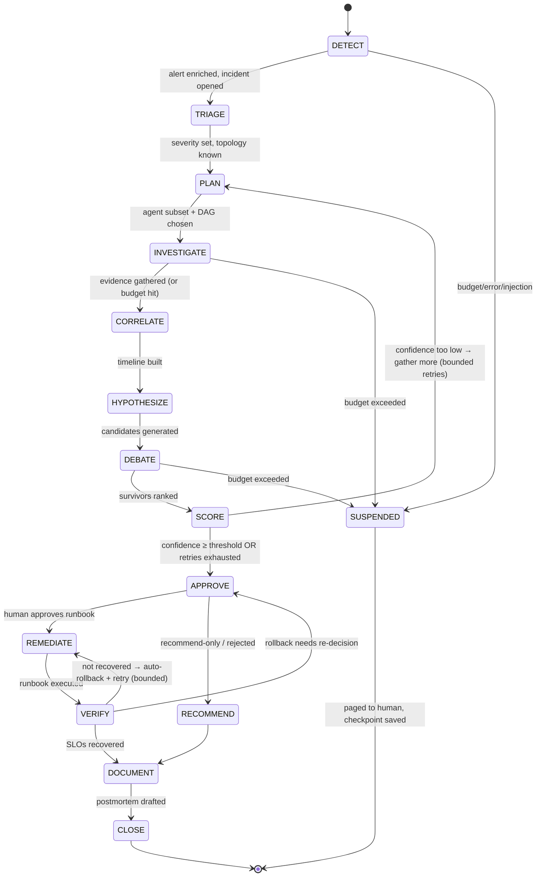
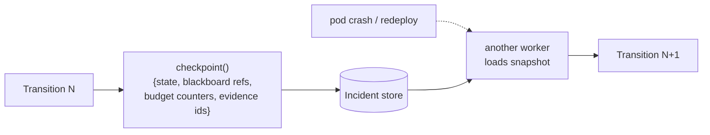

# 02 — Agent Runtime & Execution Model

> **Principle 1.** Explicit state machine, not free-form reasoning. Bounded by budgets.
> Resumable via checkpoints. Isolated per incident/tenant.

The IC supervisor is an **explicit finite state machine** over an incident. This is a
deliberate rejection of "let the LLM decide what to do next in a loop until it feels done."
An incident touches production; the set of legal transitions must be enumerable, auditable,
and terminating.

---

## 1. The incident state machine



Each state has **exactly one concern** and a set of legal exits. Free-form reasoning happens
*inside* a state (e.g. the LLM generates hypotheses in `HYPOTHESIZE`), but the *transitions
between states are code*, not model output. The model can influence which transition fires
(via confidence, via "need more info"), but it cannot invent a new one.

### State responsibilities

| State | Concern | Legal exits |
|---|---|---|
| `DETECT` | Receive + validate the alert | `TRIAGE`, `SUSPENDED` |
| `TRIAGE` | Dedup, enrich, topology, severity, open incident | `PLAN` |
| `PLAN` | Select relevant agents, build investigation DAG | `INVESTIGATE` |
| `INVESTIGATE` | Run the bounded parallel fan-out | `CORRELATE`, `SUSPENDED` |
| `CORRELATE` | Normalize + timeline-align evidence | `HYPOTHESIZE` |
| `HYPOTHESIZE` | Generate candidate root causes with citations | `DEBATE` |
| `DEBATE` | Proposer/skeptic falsification | `SCORE`, `SUSPENDED` |
| `SCORE` | Compute evidence-weighted confidence | `PLAN` (loop), `APPROVE` |
| `APPROVE` | Render decision to human / apply policy | `REMEDIATE`, `RECOMMEND` |
| `REMEDIATE` | Execute approved runbook (dry-run → apply) | `VERIFY` |
| `VERIFY` | Confirm recovery over stabilization window | `DOCUMENT`, `REMEDIATE`, `APPROVE` |
| `RECOMMEND` | Post recommendation, no mutation | `DOCUMENT` |
| `DOCUMENT` | Draft postmortem from trajectory | `CLOSE` |
| `CLOSE` | Finalize, publish (gated), release resources | terminal |
| `SUSPENDED` | Checkpoint + page a human | terminal (resumable) |

---

## 2. Termination conditions (why it always stops)

An incident investigation is guaranteed to terminate because **every loop is bounded**:

- `SCORE → PLAN` re-investigation loop: capped at `max_investigation_rounds` (e.g. 3).
- `VERIFY → REMEDIATE` retry loop: capped at `max_remediation_attempts` (e.g. 1, then human).
- Any state may short-circuit to `SUSPENDED` on: **budget exceeded**, **repeated tool
  failure**, **prompt-injection detected in a source**, or **an internal invariant
  violation**.

```python
# reference_impl/state_machine.py (sketch)
def step(ctx: IncidentContext) -> State:
    ctx.check_budget()          # raises BudgetExceeded -> SUSPENDED(BUDGET)
    ctx.check_deadline()        # wall-clock guard
    handler = HANDLERS[ctx.state]
    next_state = handler(ctx)   # pure-ish; effects go through gated services
    ctx.checkpoint()            # durable snapshot after every transition
    return next_state
```

---

## 3. Budgets & resource limits

The **Cost & Budget Governor** (control plane, [09](09-cost-performance.md)) enforces four
independent caps per incident, scaled by severity:

| Budget | What it bounds | Breach behavior |
|---|---|---|
| **Steps** | State transitions + agent runs | `SUSPENDED(BUDGET)`, page human |
| **Tool-calls** | Total investigation-agent queries | Stop fan-out, proceed with partial evidence |
| **Wall-clock** | End-to-end investigation latency | Proceed with best-so-far, flag as time-boxed |
| **Dollars** | LLM + query cost | Downgrade model tier, then `SUSPENDED` |

A budget breach is **not a crash** — it is a first-class outcome. The IC would rather hand a
human a partial, cited investigation quickly than a complete one too late. For a SEV1, the
wall-clock budget is intentionally short: *speed beats completeness*.

---

## 4. Resumability & durability

The supervisor is **stateless**; all state lives in the durable **Incident Registry**. After
every transition, `ctx.checkpoint()` writes a snapshot:



- **Crash-safety:** a pod dying mid-`INVESTIGATE` loses at most the in-flight agent calls
  (which are idempotent reads); a new worker resumes from the last checkpoint.
- **Idempotency:** investigation reads are naturally idempotent. The **one** dangerous
  transition — `REMEDIATE` — uses an **idempotency key** (`incident_id + runbook_version +
  attempt`) so a resume after a crash cannot double-execute a runbook. See
  [11](11-remediation-and-verification.md).
- **Human-in-the-loop is a durable wait:** `APPROVE` parks the incident (no wall-clock burn
  while waiting on a human) and resumes on the approval webhook.

---

## 5. Isolation & multi-tenancy

Every incident carries a `Principal{tenant, team, service}`. Isolation is enforced along
three axes:

1. **Credential isolation** — investigation agents use *read-only* creds scoped to the
   tenant's source systems; the Executor uses *write* creds scoped to the tenant's runbooks.
2. **State isolation** — incident rows, evidence blobs, memory, and cost counters are all
   tenant-keyed; no cross-tenant read path exists.
3. **Budget isolation** — per-tenant/day cost ceilings prevent one noisy team's alert storm
   from starving another's incident of budget.

This matters in a platform org where one IC deployment serves many teams: a bug or an
injection in team A's log stream must not leak into team B's incident or spend team B's
budget.

---

## 6. Concurrency model

Two levels of concurrency, both bounded:

- **Across incidents:** N incidents run concurrently as independent state machines over the
  work queue; the worker pool size + per-tenant budgets bound total load.
- **Within an incident:** the `INVESTIGATE` state fans out to K agents concurrently
  (`K = fan-out width`, capped by severity), each with its own timeout. This is the *only*
  intra-incident parallelism; everything else is sequential by design so the audit trail is
  a clean linear narrative. See [03](03-orchestration.md).

---

## 7. What a reference implementation stubs (honest limitations)

- The state machine here is single-process for clarity; production runs it over a durable
  workflow engine (Temporal / a home-grown queue+store) for exactly-once transitions.
- `check_budget` prices LLM calls from a static tier table; production reconciles against the
  provider's actual token accounting.
- Checkpoints serialize evidence *references*, not bodies — bodies are in blob storage; the
  reference impl inlines small ones for readability.

Continue to [03 — Orchestration & coordination](03-orchestration.md).
