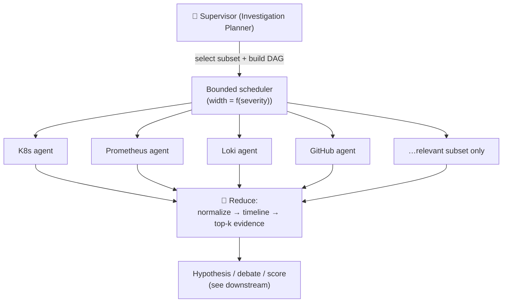
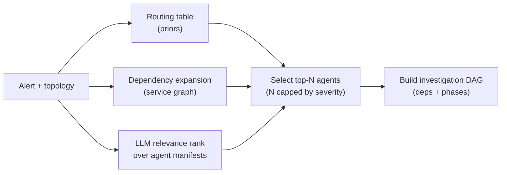
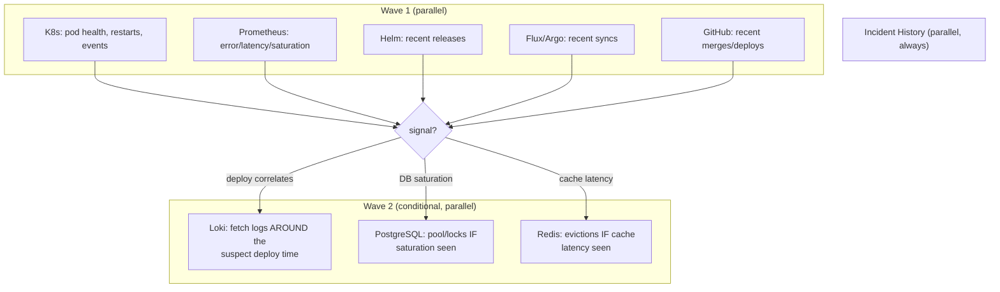
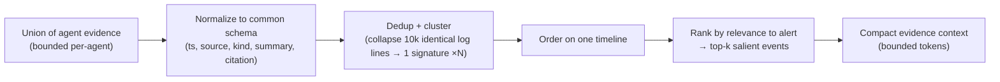
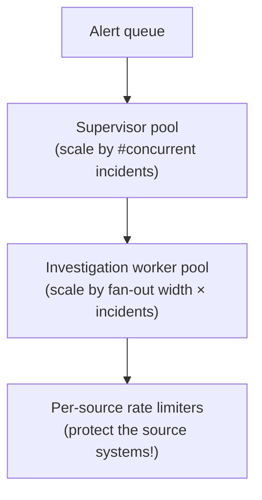

# 03 — Orchestration & Coordination

> **Principle 2.** Topology is a *choice*, not an accident. Bounded handoffs keep context and
> cost from growing non-linearly with the number of sources.

---

## 1. Topology: supervisor / orchestrator-worker with shallow fan-out

The IC uses a **supervisor** (the state machine from [02](02-agent-runtime.md)) that, in the
`INVESTIGATE` state, fans out to a set of **worker agents** (one level deep), then **reduces**
their results into a bounded timeline before anyone downstream sees them.

**Why shallow, not deep?** The workload is *"consult N sources and correlate"*. A deep
hierarchy (agents spawning sub-agents spawning sub-agents) would:
- make **latency** a function of tree depth (bad for MTTR),
- make **cost** and **blast radius** non-linear and hard to bound,
- scatter the **audit trail** across an unpredictable call tree.

A one-level fan-out gives maximum parallelism (all sources at once) with a predictable,
auditable, boundable shape. This is the classic orchestrator-worker pattern, chosen on
purpose.

---

## 2. The Investigation Planner (dynamic agent selection)

Running **all 16 agents on every alert is wasteful and noisy.** The Planner selects a
*relevant subset* and orders them into a DAG. Selection is a hybrid of:

1. **Alert → agent routing table** (deterministic priors). E.g. an HTTP-error-rate alert on
   a service always pulls K8s + Prometheus + Loki + the deploy sources (GitHub/Helm/Flux).
2. **Topology-driven expansion.** From the service graph, add the agents for that service's
   declared dependencies (its Postgres, its Redis, its upstreams).
3. **LLM relevance ranking** over agent manifests (see [05](05-tool-integration.md)) for the
   long tail — "does this alert text/topology suggest DNS? Cost? Network?"

For the worked example, the Planner selects **10 of 16** and *skips* DNS/Network/Cost/Slack
posting until evidence suggests them. This keeps the fan-out precise: you cannot put every
source's full output into the reasoning context, so you choose well up front.

---

## 3. The investigation DAG (not always a flat fan-out)

Most agents run in a single concurrent wave, but some evidence is **conditional** — you only
want it *if* an earlier agent found something. The Planner expresses this as a small DAG:

- **Wave 1** establishes *what changed* and *what's saturated*.
- **Wave 2** is *targeted*: fetch Loki logs *around the suspect deploy timestamp* (not the
  whole firehose), probe Postgres *only if* saturation appeared. This is a bounded handoff —
  wave 1's reduced findings shape wave 2's precise queries, so wave 2 pulls kilobytes, not
  gigabytes.

The DAG depth is capped (2–3 waves); it is not an open-ended reasoning tree.

---

## 4. The bounded reduce (the anti-overflow move)

Each agent returns bounded evidence (per-agent caps on rows/log-lines/bytes). The **Evidence
Collector** ([04](04-memory-context.md)) then reduces the union into a **single correlated
timeline** and a **top-k evidence set** *before* the Hypothesis Generator (an LLM) sees
anything:

This is *the* move that keeps the system's cost and context flat as the number of sources
grows. Ten thousand identical `PoolTimeoutError` lines become one evidence item
(`signature=PoolTimeoutError, count=10412, first_seen=14:31:07`). Without this reduce, the
LLM context (and bill) would scale with log volume — the classic orchestrator-overflow bug.

---

## 5. Coordination guarantees

- **No agent talks to another agent.** Agents are leaves; all coordination is through the
  supervisor and the shared blackboard ([04](04-memory-context.md)). This keeps the
  interaction graph a star, not a mesh — trivially auditable.
- **Partial failure is normal.** If the Redis agent times out, the investigation proceeds
  with a `degraded: redis_unavailable` note on the timeline; it never blocks the pipeline.
  See error isolation in [05](05-tool-integration.md).
- **Ordering is deterministic where it matters.** Fan-out is concurrent, but the reduce
  produces a *deterministically ordered* timeline (by timestamp, then source, then
  stable id) so the same evidence yields the same narrative — important for reproducible
  postmortems and offline eval ([07](07-evaluation-observability.md)).

---

## 6. Scaling & load shape

A subtle but critical constraint: **the IC must not DoS the very systems it queries during an
incident.** Each source connector sits behind a **per-source rate limiter + circuit breaker**
so a storm of concurrent incidents can't hammer the Kubernetes API or Prometheus into
further degradation. Protecting the observability stack during an outage is a first-class
requirement, covered in [15](15-failure-modes.md).

Continue to [04 — Memory & context management](04-memory-context.md).
