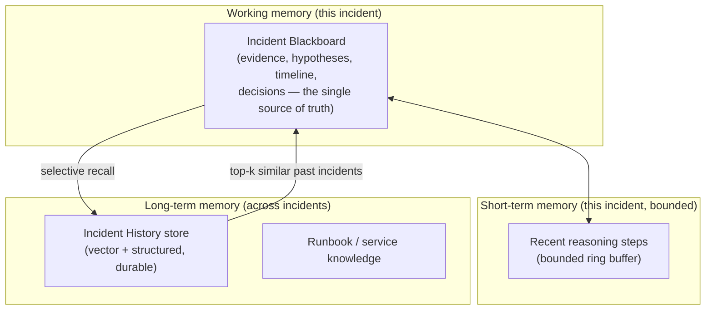
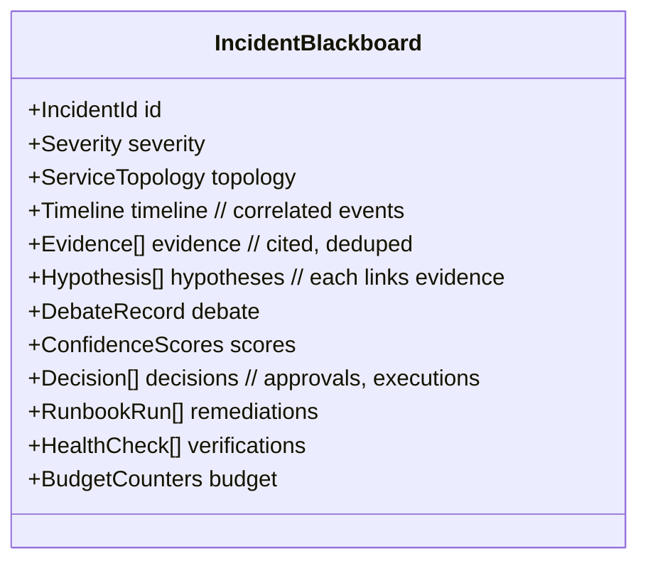
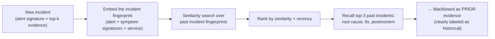

# 04 — Memory & Context Management

> **Principle 3.** Split short-term (this incident) from long-term (across incidents).
> Prefer *selective recall* over context stuffing.

The IC juggles three kinds of memory. Confusing them is how agent systems drown in their own
context.

---

## 1. The incident blackboard (working memory)

The **blackboard** is the shared, structured, durable state of one incident — the single
source of truth every component reads and writes. It is *not* a chat transcript.

Every write to the blackboard is **append-mostly and attributed** (which component/agent,
when, from which evidence). This is what makes the postmortem a *reconstruction* rather than
a *generation*: the story already exists in the blackboard.

**Why structured, not a transcript?** Because downstream stages consume *fields*, not prose:
the Confidence Calculator reads `hypotheses[].evidence[]`, the Approval Gateway reads
`hypotheses[0]` + `proposed_runbook`, the Postmortem reads `timeline` + `decisions`. A
free-text scratchpad would force every stage to re-parse, and re-parsing is where hallucinated
facts sneak in.

---

## 2. Short-term memory (bounded reasoning trace)

Within an incident, the LLM-driven stages (hypothesis, debate) need recent reasoning context.
This is a **bounded ring buffer** of recent steps — enough for coherence, capped so it can't
grow unbounded across long investigations. When it's full, oldest low-salience steps drop;
the durable facts they produced already live on the blackboard, so nothing important is lost.

This is the guard against the "lost in the middle" failure: we do **not** stuff the entire
raw investigation into every prompt. Each LLM stage gets a *purpose-built, compact context*
(the top-k timeline + the specific hypotheses in play), not the whole history.

---

## 3. Long-term memory: the Incident History agent

The **Incident History** store is durable, cross-incident memory — the IC's institutional
knowledge. It powers *"have we seen this before?"*, which is often the fastest path to root
cause.

- **Fingerprint, not full text.** An incident is embedded from its *signature* — alert name,
  symptom signatures (e.g. `PoolTimeoutError` + `db saturation`), affected service — so
  recall matches on *shape of failure*, not incidental log noise.
- **Selective recall, top-k.** It returns the **3** most-similar past incidents, not "all
  Postgres incidents ever." Precision over recall — the reasoning context can't hold 50 past
  incidents and stay coherent.
- **Historical evidence is labeled as such.** A recalled past root cause enters the
  blackboard as a *prior/hint* (`kind=historical`), never as present-tense fact. The debate
  ([10](10-hypothesis-and-debate.md)) must still confirm it against *current* evidence — a
  past cause is a hypothesis lead, not a verdict. This prevents "it was Postgres last time so
  it's Postgres now" bias.

---

## 4. Context assembly per stage (what actually goes in the prompt)

Each LLM-invoking stage assembles a **minimal, purpose-built context** from the blackboard:

| Stage | Context it receives | What it deliberately excludes |
|---|---|---|
| Triage/severity | Alert + topology summary | Raw logs, metrics history |
| Hypothesis Generator | Top-k timeline + saturation signals + recalled priors | Full log dumps, unselected agents' raw output |
| Debate skeptic | The one hypothesis under test + its evidence + contradicting evidence | Other hypotheses' internals |
| Approval rendering | Leading hypothesis + proposed runbook + blast radius | The whole debate transcript |
| Postmortem | Timeline + decisions + outcome | Intermediate discarded hypotheses (summarized, not verbatim) |

This per-stage assembly is the practical expression of "selective recall over stuffing":
context is *composed for the task*, drawn from the structured blackboard, and bounded.

---

## 5. Freshness & staleness (memory can lie)

Two staleness hazards, both handled explicitly:

1. **Stale runbook/service knowledge.** A runbook or service-dependency fact from long ago
   may be wrong. Long-term knowledge carries a `last_verified` timestamp; stale entries are
   flagged in context (`⚠️ knowledge is 8 months old`) so the model — and the human —
   discount them.
2. **Stale historical incidents.** A 2-year-old "fix" may no longer apply (the architecture
   changed). Recall weights by recency, and the postmortem's action items feed back to
   *retire* superseded historical entries — memory is curated, not append-forever.

The governing rule (shared with the KnowledgeAgent design): *a two-year-old runbook must not
quietly override live state.* Current evidence from the read-only agents always outranks
recalled memory when they conflict.

---

## 6. Privacy & tenant scoping of memory

Long-term memory is **tenant/team-scoped**. Team A's incident history is never recalled into
team B's incident. Evidence blobs (which may contain sensitive log data) are stored with the
same tenant ACL as the incident, and PII is redacted at ingestion by the guardrail layer
([06](06-safety-guardrails.md)) *before* anything is embedded or persisted to long-term
memory — you cannot un-embed a leaked secret.

Continue to [05 — Tool & integration layer](05-tool-integration.md).
