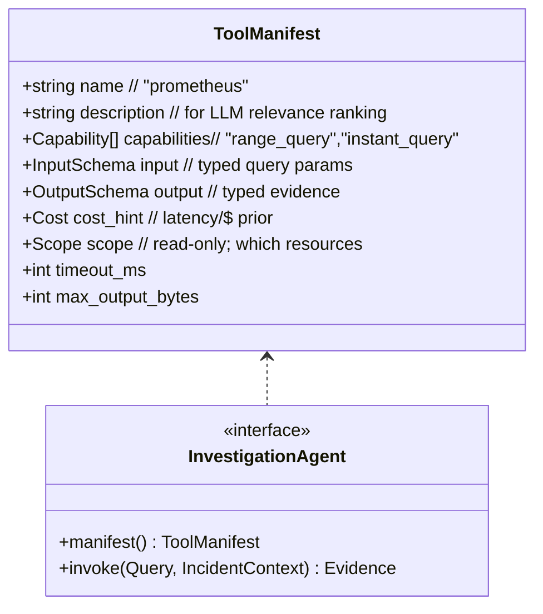
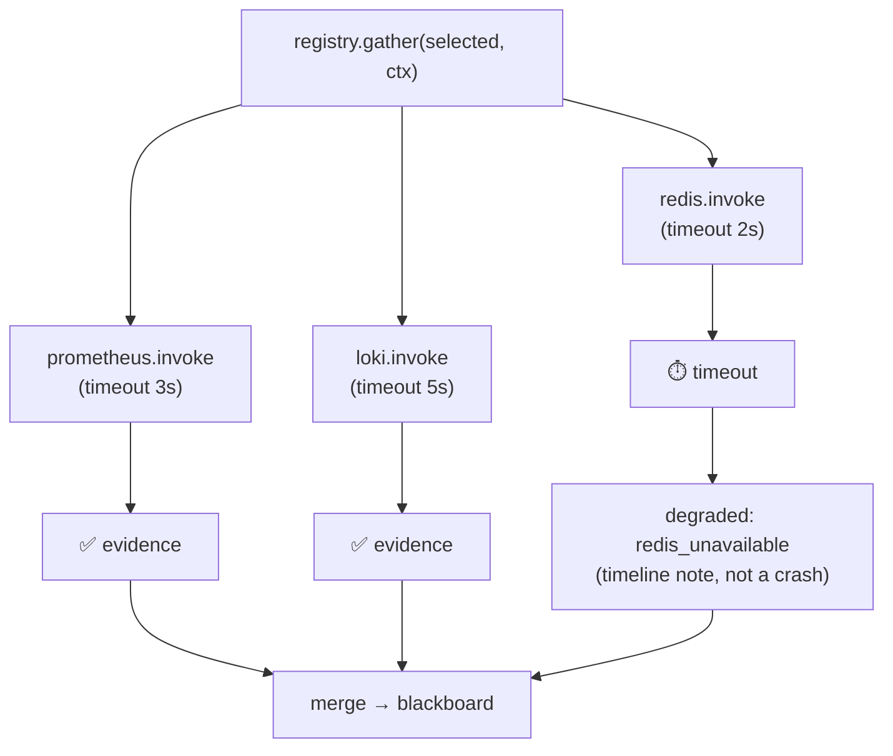
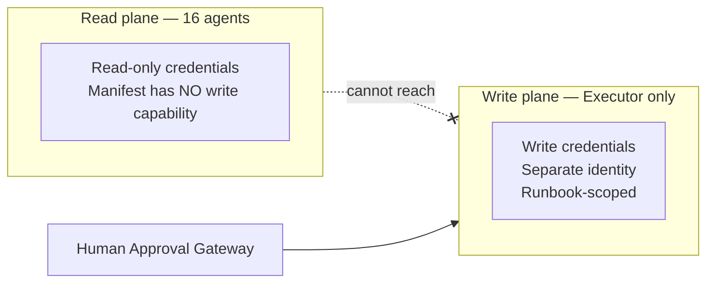

# 05 — Tool & Integration Layer

> **Principle 4.** A standardized, declarative tool interface (MCP-style manifest per
> connector); dynamic selection (you can't put every schema in context); robust error
> handling so one flaky source never cascades.

The 16 investigation agents are the IC's **tools**. Each is a thin, **read-only** connector
to a source system behind a uniform contract. Uniformity is what lets the Planner reason
about them generically and lets the runtime treat failures uniformly.

---

## 1. The tool contract (manifest + invoke)



Every agent:
- declares a **manifest** (name, description, capabilities, typed I/O, cost hint, scope,
  timeout, output cap) — the MCP-style contract used for discovery and selection;
- exposes a single `invoke(query, ctx)` that returns **bounded, typed, cited `Evidence`**;
- holds **read-only credentials only**. There is no `write` capability in the manifest schema
  for investigation agents — it's structurally absent (see §5).

---

## 2. The 16 agents (catalog)

| Agent | Source | Reads (examples) | Typical evidence |
|---|---|---|---|
| **Kubernetes** | K8s API | pods, deployments, events, restarts, OOMKills, HPA | "3 pods CrashLoopBackOff since 14:31; reason=OOMKilled" |
| **Prometheus** | Prometheus | error rate, latency, saturation (conn pools, CPU, mem) | "db_connections_active pinned at 100/100 from 14:31" |
| **Loki** | Loki | log lines, error signatures around a time window | "PoolTimeoutError ×10412, first 14:31:07" |
| **Grafana** | Grafana | dashboard/panel state, annotations | "SLO burn-rate panel: 14× budget burn" |
| **FluxCD / Argo** | GitOps controllers | recent syncs, drift, rollout status | "Argo synced payment-api at 14:29 → 2.3.1" |
| **Helm** | Helm/releases | release history, values diffs | "release 2.3.1 changed db.pool.max 50→5" |
| **GitHub** | GitHub | recent merges, PRs, diffs, CODEOWNERS | "PR #812 merged 14:20 touched db config" |
| **Redis** | Redis | memory, evictions, latency, keyspace | "evicted_keys flat; latency p99 0.4ms (nominal)" |
| **PostgreSQL** | Postgres | active/idle conns, locks, slow queries, replication | "100/100 conns; 400 waiting on pool" |
| **Runbook** | Runbook catalog | matching runbooks for a symptom/root cause | "runbook: rollback-helm-release (matches)" |
| **Incident History** | History store | similar past incidents | "INC-3980 (3mo ago): same signature, fix=rollback" |
| **Slack** | Slack | recent related chatter, ongoing threads | "#payments: 'anyone else seeing 500s?' 14:33" |
| **Terraform** | TF state/Cloud | recent applies, drift, resource state | "no TF apply in last 24h" |
| **Network** | CNI/LB/mesh | connection errors, LB health, mesh policy | "no mesh policy change; LB healthy" |
| **DNS** | DNS/CoreDNS | resolution errors, recent zone changes | "no NXDOMAIN spike; CoreDNS healthy" |
| **Cost** | Billing/FinOps | spend anomalies (a symptom or a consequence) | "no cost anomaly correlated" |

Two of these deserve a note: **Slack** and **Runbook/History** are *read* tools during
investigation. Slack *posting* and runbook *execution* are **not** investigation agents —
they are gated write actions living behind the Approval Gateway ([06](06-safety-guardrails.md)).
Reading Slack ≠ posting to Slack.

---

## 3. Dynamic selection (you can't context-stuff 16 schemas)

The Planner ([03](03-orchestration.md)) uses the manifests — not the full agents — to select
a subset. Only the selected agents' schemas enter any reasoning context. This mirrors the
KnowledgeAgent `ToolRegistry.select`: rank by manifest relevance to the alert/topology,
return top-N.

```python
# registry.select — sketch
def select(alert, topology, k) -> list[ToolManifest]:
    priors   = routing_table(alert)                 # deterministic
    deps     = expand_dependencies(topology)         # graph-driven
    ranked   = llm_rank(manifests, alert, topology)  # long-tail relevance
    return topn(merge(priors, deps, ranked), k)      # k = f(severity)
```

---

## 4. Robust error handling (one flaky source ≠ cascade)

The registry runs selected agents **concurrently with per-agent timeouts**; failures and
timeouts become **warnings on the timeline**, never exceptions that halt the pipeline.



Layered resilience per connector:
- **Timeout** per invoke (from the manifest).
- **Circuit breaker** — if a source is failing repeatedly, stop calling it for a cooldown and
  emit `degraded`; this also protects the *source* from the IC during an outage.
- **Rate limiter** — bound QPS per source across all concurrent incidents.
- **Retry with jitter** for transient errors, capped (idempotent reads only).
- **Graceful degradation** — the investigation continues with partial evidence; the
  confidence calculator ([10](10-hypothesis-and-debate.md)) *knows* which agents were
  unavailable and widens uncertainty accordingly. Missing evidence lowers confidence; it
  doesn't fabricate certainty.

This is directly tested the way KnowledgeAgent tests `FailingConnector` / `SlowConnector`:
inject a failing and a slow agent and assert the pipeline still produces a cited, correctly
*less-confident* result.

---

## 5. The read/write firewall (the most important line in the doc)



Investigation tools and remediation are **different trust domains with different credentials
and different code paths.** An investigation agent physically cannot mutate production —
it holds no credential that can, and its manifest exposes no write capability. The only writer
is the Executor, reachable only through the gate. This is the structural guarantee behind
"safe automation."

---

## 6. Adding a new agent (extensibility)

A 17th source (say, a service mesh tracing backend) is added by implementing the
`InvestigationAgent` interface + a manifest and **registering it in the Agent Registry**
([08](08-governance-lifecycle.md)). It then flows through the eval-gated lifecycle
(`REGISTERED → EVALUATING → STAGED → PRODUCTION`) before the Planner will select it in prod.
No orchestration or state-machine code changes — the tool layer is the extension seam.

Continue to [06 — Safety & guardrails](06-safety-guardrails.md).
