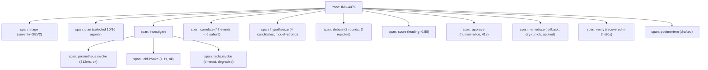
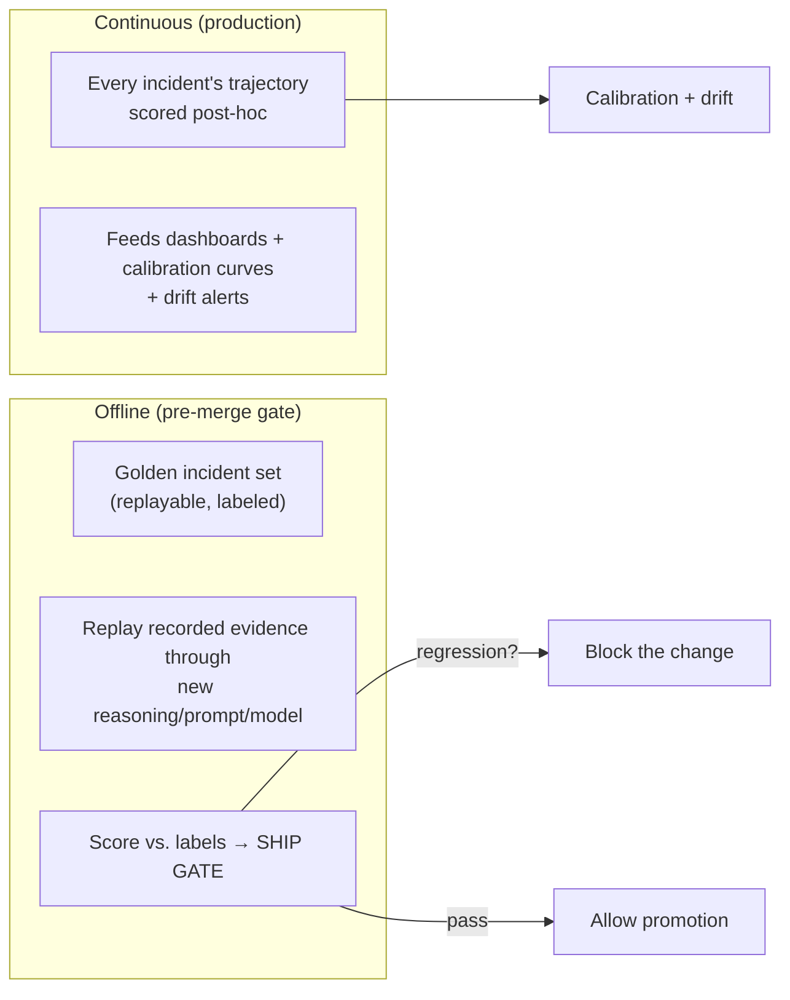

# 07 — Evaluation & Observability

> **Principle 6.** Observability is a foundation, not an add-on. Score the whole *trajectory*,
> not just the final string. Run the same evaluator continuously (live) and offline (gated).

An incident-response system that you cannot *measure* will silently rot: its root-cause
accuracy will drift, its confidence will decouple from reality, and you won't know until it
executes the wrong runbook. This doc makes quality observable and gated.

---

## 1. Observability: a span for everything

Every meaningful action emits a **span** on the incident trace: each agent invocation, each
LLM call, each guardrail check, each state transition, each approval, each runbook step, each
health check.

Each span carries: timing, cost (tokens/$), model tier, inputs/outputs (references, redacted),
and outcome. This trace **is** the raw material for both the postmortem and the evaluator —
the incident narrates itself.

### Golden operational signals (the IC monitors itself)
- **MTTD / MTTR** per incident and trended (the north-star business metrics).
- **Time-to-first-hypothesis**, **time-to-approval**, **time-to-recovery** (funnel).
- **Agent health**: per-agent success rate, p99 latency, circuit-breaker trips.
- **Autonomy metrics**: % recommend-only vs. approved vs. auto-remediated; approval override
  rate (how often humans reject the leading hypothesis — a key trust signal).
- **Cost per incident** by severity ([09](09-cost-performance.md)).

---

## 2. Trajectory-level evaluation (not just "was the RCA right?")

A correct final answer reached by luck is a latent failure. The evaluator scores the **whole
trajectory** along multiple axes, mirroring KnowledgeAgent's trajectory scorer:

| Axis | Question | How scored |
|---|---|---|
| **Investigation coverage** | Did it consult the sources that mattered? | Selected-agent recall vs. the known-relevant set |
| **Groundedness** | Does every hypothesis cite real evidence? | Deterministic: citations resolve to evidence |
| **Correlation quality** | Is the timeline right (deploy→symptom order)? | Checked against ground-truth timeline (offline) |
| **Falsification** | Did the skeptic genuinely try to break the winner? | Debate produced ≥1 real contradiction test |
| **Calibration** | Does confidence match reality? | Confidence vs. outcome over many incidents |
| **Root-cause accuracy** | Was the identified cause the true cause? | Human/label agreement (offline golden set) |
| **Remediation safety** | Did the fix work without collateral damage? | Verify passed, no secondary incident |
| **Efficiency** | Cost/latency vs. value | $ and wall-clock vs. severity budget |

**Calibration** is the subtle, most important one: a system that says `0.9` should be right
~90% of the time. Reliability curves (predicted confidence vs. observed accuracy) are tracked
continuously; systematic over-confidence triggers a review and can *raise* the human-gate
threshold automatically.

---

## 3. Continuous (live) + offline (gated)

The **same evaluator** runs in two modes — this is the KnowledgeAgent stance applied to
incidents:

### Golden incidents (the replay corpus)
The killer capability: **record every incident's evidence bundle** (the raw agent outputs +
timeline) so it can be **replayed deterministically**. This turns real incidents into a
regression suite.

- Any change to hypothesis prompts, the debate logic, the confidence formula, the model tier,
  or a new agent must be **replayed against the golden set** and must not regress root-cause
  accuracy, calibration, or safety before it can be promoted.
- Because the reduce/timeline is deterministically ordered ([03](03-orchestration.md)), a
  replay is reproducible: same evidence → same reasoning inputs → comparable output.
- This is what makes the reasoning safe to iterate on. You do not "hope" the new prompt is
  better; you measure it against 200 labeled past incidents.

---

## 4. Eval as a promotion gate (ties to governance)

Evaluation is not advisory — it is a **gate** in the lifecycle ([08](08-governance-lifecycle.md)):

- A new/changed **investigation agent** must pass an offline eval (does it return correct,
  bounded, cited evidence on golden inputs?) before `STAGED → PRODUCTION`.
- A new/changed **runbook** must pass dry-run + a staged trial before it's eligible for the
  auto-remediation allowlist.
- A change to the **reasoning core** must not regress the golden set.

This closes the loop: observability produces the golden set; the evaluator scores it; the gate
enforces it. Quality is designed in, continuously measured, and structurally required to ship.

---

## 5. What a reference implementation stubs

- The **LLM-as-judge** for root-cause accuracy is defaulted to a deterministic label-match on
  the golden set; the production judge is a strong model with a rubric, run offline (never in
  the hot path).
- **Calibration curves** need volume; early on, confidence thresholds are set conservatively
  (high human-gate bias) and relaxed only as calibration data accumulates.
- Ground-truth labels for golden incidents come from the human-signed postmortem's "root
  cause" field — the postmortem is both an output *and* a labeled training/eval example.

Continue to [08 — Governance & lifecycle](08-governance-lifecycle.md).
