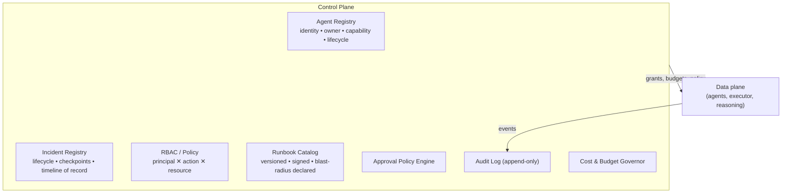
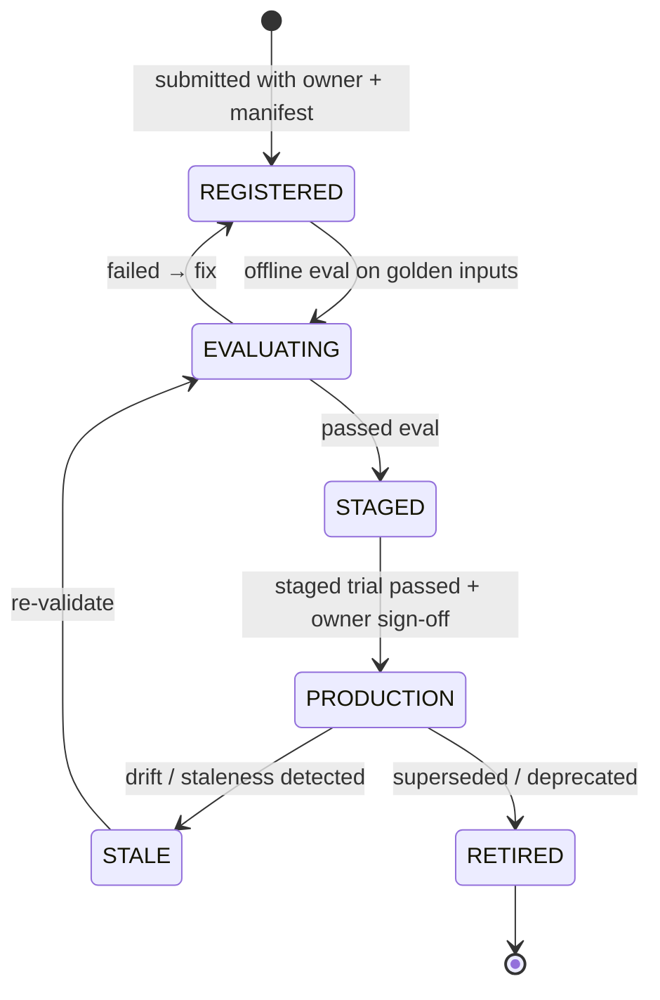
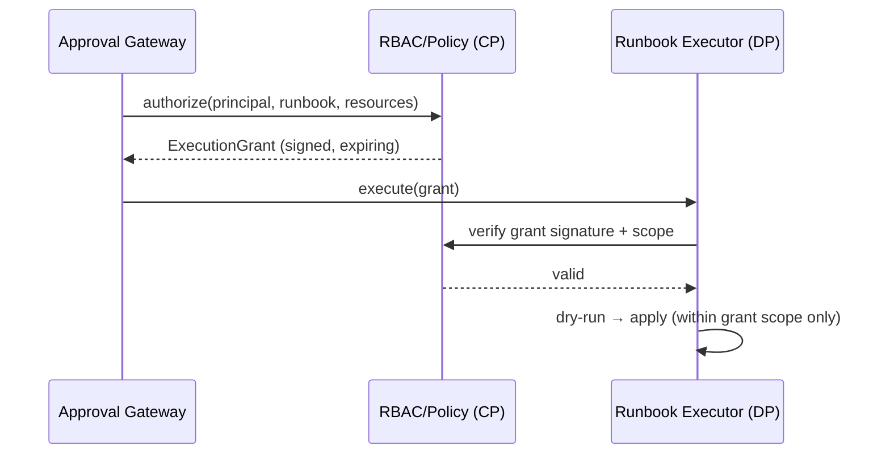

# 08 — Platform Governance & Lifecycle (Control Plane)

> **Principle 7.** The control plane *is* the governance layer: agent registry with identity,
> ownership, and an eval-gated lifecycle; central RBAC/policy; append-only audit.

This is where "the control plane governs the data plane" becomes concrete. Nothing in the
data plane runs, spends, or writes without the control plane's say-so, and every such decision
is recorded.

---

## 1. Control-plane components

---

## 2. Agent registry & eval-gated lifecycle

Every investigation agent and every runbook is a **registered, owned, versioned artifact**
with a lifecycle state machine — you cannot run an unowned or unproven agent in production.

- **Ownership is mandatory.** Registration requires a named owning team; unowned agents/
  runbooks are rejected. When an incident uses an agent, the audit trail names its owner —
  accountability by construction.
- **Eval-gated promotion.** `EVALUATING → STAGED → PRODUCTION` requires passing the offline
  eval ([07](07-evaluation-observability.md)). The Planner only selects `PRODUCTION` agents in
  prod incidents.
- **Staleness detection.** An agent whose success rate drops, whose source API changed, or
  whose manifest drifts is flagged `STALE` and re-validated. Same for runbooks whose target
  resources no longer exist.
- **Versioning.** Agents and runbooks are immutable versions; an incident records exactly
  which versions it used, so a replay ([07](07-evaluation-observability.md)) is faithful.

---

## 3. RBAC & policy (central, not scattered)

Authorization is enforced **centrally** in the control plane and consumed as signed grants by
the data plane. Three question types:

| Question | Enforced where | Example |
|---|---|---|
| May this IC read source X for tenant T? | Agent credential scope + RBAC | payments-IC may read payments' Loki, not billing's |
| May this principal run runbook R on resources? | RBAC + blast-radius policy | on-call may rollback a release; only SRE-lead may DB-failover |
| Does runbook R need a human / senior approver? | Approval Policy Engine | data-affecting → senior; reversible single-service → allowlist-eligible |

The Executor never decides authorization; it receives a signed `ExecutionGrant{principal,
runbook_version, resources, approver, expiry}` from the gate and refuses anything else. This
keeps authorization logic in one auditable place.

---

## 4. The runbook catalog (governed remediation)

Remediation is only ever a **catalog runbook** — never free-form. The catalog is control-plane
governed:

- **Versioned + signed** — each runbook is an immutable, reviewed, code-owned artifact.
- **Declares blast radius + reversibility + data-safety class** ([06](06-safety-guardrails.md),
  [11](11-remediation-and-verification.md)).
- **Declares a verification spec** — which SLOs must recover, over what window, for the run to
  count as successful.
- **Declares a rollback** — its own inverse, so the Health Verifier can undo it.
- **Lifecycle-gated** — a new runbook is `STAGED`, trialed, and only then eligible for
  production / the auto-allowlist.

Runbooks live in git (GitOps), reviewed like code; the catalog is their registered, queryable
index.

---

## 5. Audit log (append-only, everything)

Every governance-relevant event is recorded immutably: incident opened, severity set, agents
selected, each authorization decision (allow/deny), each approval (who, when, what they saw),
each runbook execution (dry-run result, apply result), each verification outcome, each
auto-remediation, each budget breach, each injection quarantine, each postmortem publication.

Why it matters:
- **Forensics** — after a bad remediation you can reconstruct exactly what the IC knew, what it
  proposed, who approved it, and what it did.
- **Compliance** — SOC2/change-management: production changes have an approver, a reason, and a
  reversible plan on record.
- **Trust** — the override rate and denial reasons are auditable signals of whether the IC is
  earning autonomy.

The audit log is **write-only from the data plane's perspective** — components emit events;
they cannot edit or delete history.

---

## 6. Change-management integration

The IC is a change agent, so it lives inside existing change governance:
- **Change-freeze awareness** — during declared freezes, it drops to recommend-only
  ([06](06-safety-guardrails.md)).
- **CMR/ticket linkage** — an executed runbook can open/annotate a change ticket automatically
  (with approval), so the remediation shows up in the org's change record.
- **Ownership routing** — page/notify the owning team of the *suspected* component, using the
  service graph and CODEOWNERS.

Continue to [09 — Cost & performance](09-cost-performance.md).
