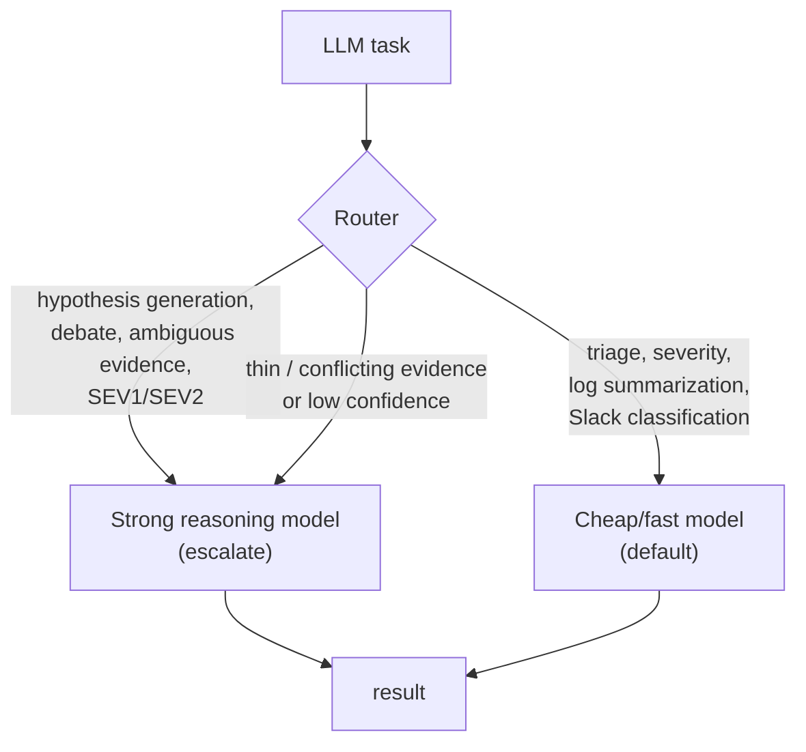
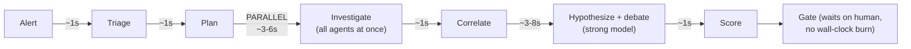

# 09 — Cost & Performance

> **Principle 8.** Model tiering & routing (cheap by default, escalate on hard evidence).
> Caching. Cost visibility and budgets per incident/tenant.

During an outage, **latency is the product** — a perfect RCA delivered 20 minutes late is a
failure. But the IC also runs 24/7 across many teams, so unbounded cost is its own outage. This
doc reconciles the two: fast and cheap by default, expensive only where it buys accuracy on a
real incident.

---

## 1. Model tiering & routing

Not every LLM call needs the strongest model. The IC routes by *task difficulty and stakes*,
mirroring KnowledgeAgent's `ModelRouter`.



Escalation triggers (cheap → strong):
- Severity is SEV1/SEV2 (accuracy matters most).
- Evidence is **thin** (few sources responded) or **conflicting** (hypotheses disagree).
- Confidence after a cheap pass is below threshold — escalate before asking a human.

De-escalation: bulk, mechanical work (summarizing 10k log lines into a signature, classifying
Slack relevance, formatting the postmortem) always uses the cheap tier. The strong model is
spent on *judgment*, not *janitorial* work.

---

## 2. Caching (don't re-pay for the same thought)

```mermaid
flowchart LR
  Q["Reasoning request"] --> C{Semantic/exact cache\n(incident-scoped)}
  C -->|hit| HIT["return cached result"]
  C -->|miss| M["run model → cache (scoped)"]
```

Cache layers:
- **Evidence-query cache** — identical source queries within an incident (or across
  near-simultaneous incidents on the same service) return cached evidence, protecting the
  source systems too ([03](03-orchestration.md)).
- **Reasoning cache** — an alert signature the IC has *recently* diagnosed (a flapping alert)
  can short-circuit to the prior hypothesis for human confirmation instead of re-running the
  full investigation.
- **Historical recall** — the Incident History agent ([04](04-memory-context.md)) is itself a
  cache of *institutional* thought: "we solved this exact signature 3 months ago."

**Safety of caching:** caches are **incident/tenant-scoped** with the same ACL as the
underlying data — a cached hypothesis from team A's incident is never served into team B's.
And a cached diagnosis is always **re-confirmed against current evidence** before it drives a
gate; a stale cache must not auto-approve a remediation.

---

## 3. Budgets & cost visibility (per incident, per tenant)

The **Cost & Budget Governor** ([02](02-agent-runtime.md), [08](08-governance-lifecycle.md))
prices every call and enforces ceilings:

| Scope | Budget | Enforcement |
|---|---|---|
| Per incident | $ / steps / tool-calls / wall-clock (scaled by severity) | Breach → downgrade tier, then `SUSPENDED` + page |
| Per tenant/day | Aggregate $ ceiling | Protects one team from another's alert storm |
| Per source | QPS rate limit | Protects source systems during incidents |

Cost is **attributed**: every span carries its cost, so per-incident and per-team spend are
first-class dashboards ([07](07-evaluation-observability.md)). "What did INC-4471 cost to
diagnose?" is a query, not a mystery. This is what makes the ROI story ("cost per incident vs.
engineer-hours saved") measurable.

---

## 4. Latency budget & how it's met

Target: **time-to-first-hypothesis in the low tens of seconds** for a SEV2, because that is
what shortens MTTR.



Levers that hit the budget:
- **Parallel fan-out** ([03](03-orchestration.md)) — the investigation is `max(agent
  latencies)`, not their sum. This is the single biggest MTTR win.
- **Bounded reduce** ([03](03-orchestration.md)) — the LLM reasons over a compact timeline,
  not gigabytes of logs, so hypothesis latency is stable regardless of log volume.
- **Speculative fetch for SEV1** — for the highest severity, pre-warm the likely wave-2 agents
  (logs around recent deploys) in parallel with wave 1, trading a little cost for latency.
- **The human wait is free.** `APPROVE` parks the incident; wall-clock/dollar budgets don't
  burn while waiting on a human, so a slow approver doesn't blow the budget.

---

## 5. Cost/latency/accuracy trade-off, by severity

The severity knob ([00](00-overview.md)) is really a point on the cost/latency/accuracy
surface:

| Sev | Model tier | Fan-out | Latency stance | Cost stance |
|---|---|---|---|---|
| SEV1 | Strong + speculative fetch | Max | Minimize at all costs | Spend freely |
| SEV2 | Strong for judgment, cheap for bulk | Wide | Balanced | Bounded |
| SEV3 | Cheap, escalate only if stuck | Narrow | Relaxed | Cost-optimized |
| SEV4 | Cheap only | Minimal (dedupe+history) | Batch/lazy | Cheapest; often auto-close |

This makes cost *governed*, not incidental: a flapping SEV4 alert cannot quietly cost as much
as a revenue-critical SEV1.

Continue to [10 — Hypotheses, debate & confidence](10-hypothesis-and-debate.md).
