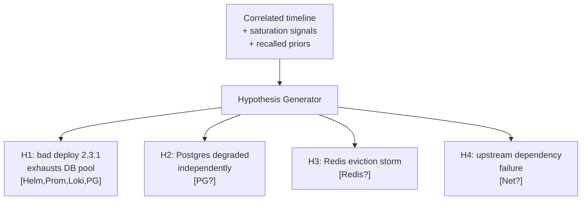
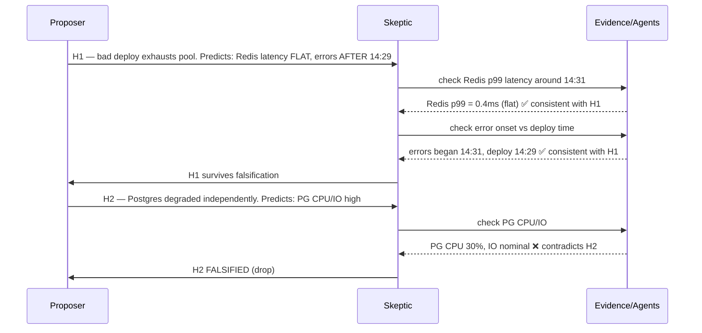
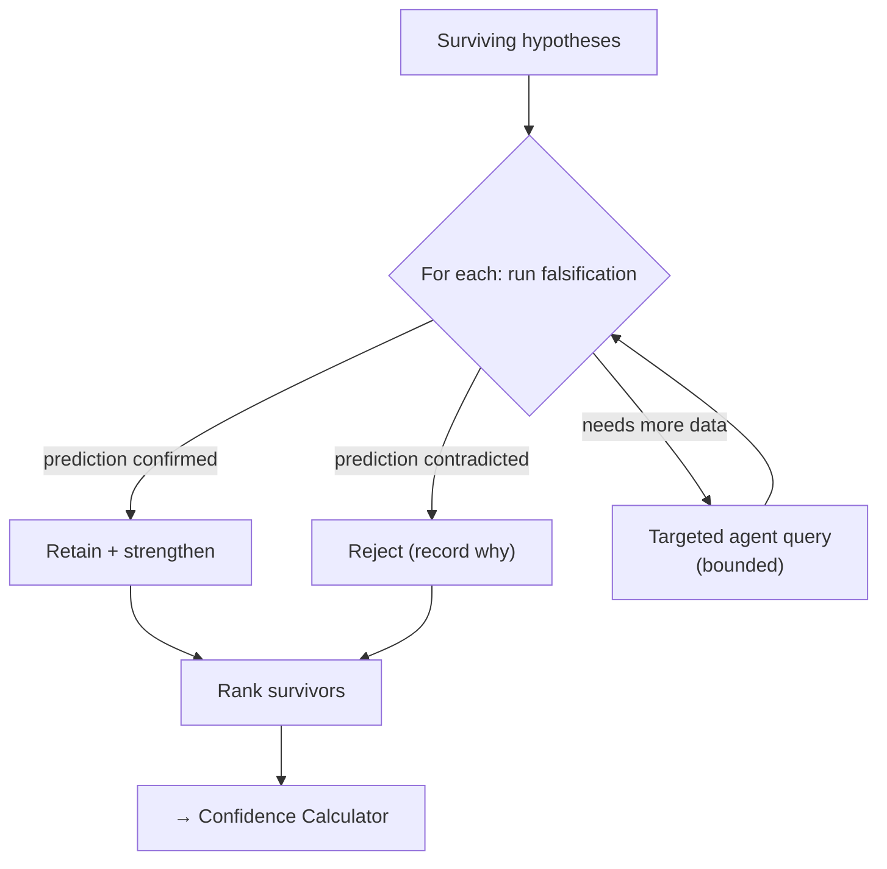
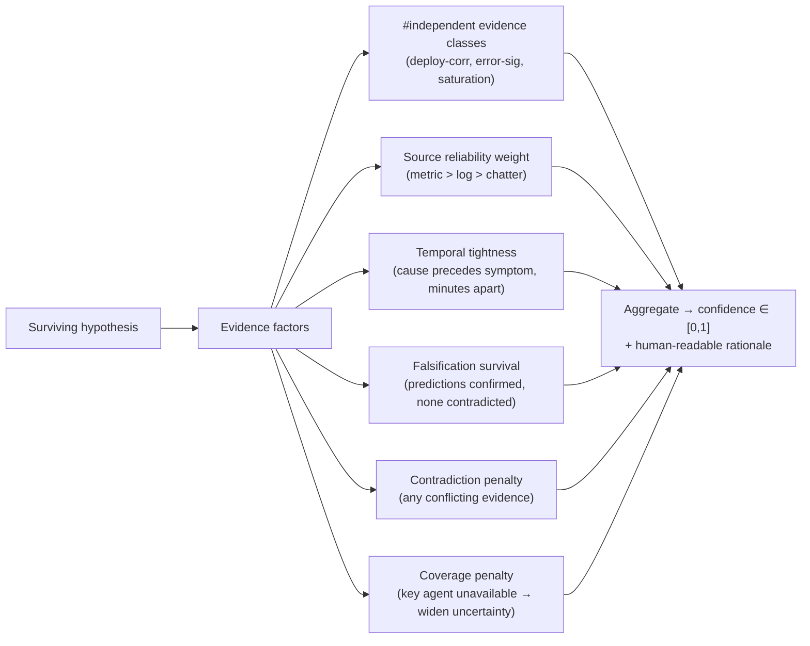

# 10 — Hypotheses, Debate & Confidence

> Spans principles 2 (coordination), 5 (safety), 6 (evaluation). This is the reasoning core —
> the part that fights the single most dangerous failure of an AI SRE: **confidently naming
> the wrong root cause.**

The first plausible explanation is usually the *availability-biased* one ("it's always DNS").
The IC deliberately structures reasoning to resist that: generate multiple candidates, force a
falsification debate, and compute an **explainable, evidence-weighted** confidence.

---

## 1. Hypothesis generation

The Hypothesis Generator (strong model, [09](09-cost-performance.md)) consumes the **correlated
timeline** ([04](04-memory-context.md)) — not raw logs — and emits **multiple** candidate root
causes, each of which **must link concrete evidence**.

Rules enforced structurally:
- **≥2 candidates** (unless one is overwhelmingly supported) — a single-hypothesis output is
  itself a flag for the debate to probe.
- **Every hypothesis cites evidence** — the groundedness invariant ([06](06-safety-guardrails.md)).
  An uncited hypothesis is dropped before debate.
- **Each hypothesis states a *prediction*** — "if H1 is true, we should *also* see X and should
  *not* see Y." These predictions are what the debate tests.

---

## 2. The multi-agent debate loop (falsification, not persuasion)

Debate here is **falsification**, not two bots arguing rhetoric. A **Skeptic** agent tries to
*break* each surviving hypothesis by checking its predictions against evidence — requesting a
targeted extra query if needed (a bounded loop back to the agents).

Debate is **bounded**: capped rounds and a capped number of extra targeted queries
([02](02-agent-runtime.md)). It terminates with a ranked set of survivors and a **recorded
rejection reason** for each killed hypothesis — those reasons are shown to the human
([06](06-safety-guardrails.md)) and written into the postmortem ([12](12-postmortem.md)) as
"alternatives considered."

**Why a separate skeptic and not one model doing both?** Role separation reduces the model's
tendency to rationalize its first answer. The skeptic's *job* is to falsify; it is prompted and
scored ([07](07-evaluation-observability.md)) on whether it produced a *genuine* contradiction
test, not on agreeing.

---

## 3. Confidence calculation (evidence-weighted, explainable)

Confidence is **not** the model's self-reported vibe ("I'm 90% sure"). It is computed from the
*structure and independence of the evidence*, so it can be explained and calibrated.

Design stances:
- **Independence matters most.** Three *independent* evidence classes (a deploy correlation +
  a new error signature + a saturation metric) is far stronger than ten correlated log lines
  saying the same thing. The calculator counts *classes*, not *lines* (the dedup in
  [03](03-orchestration.md) makes this honest).
- **Temporal causality is weighted.** Cause must precede symptom; a tight, ordered gap
  (deploy 14:29 → errors 14:31) scores higher than a loose coincidence.
- **Missing evidence lowers confidence, never fabricates it.** If the Postgres agent timed
  out, the saturation class is *unconfirmed*, so H1's confidence is explicitly *lower* and the
  gate says "confidence would rise if we could confirm DB saturation — retry that agent?"
- **Contradictions are penalized hard.** Any surviving contradicting evidence caps confidence
  well below the auto-remediation threshold.
- **It's explainable.** The output is `0.88 because: 3 independent classes, tight temporal
  correlation, survived falsification, no contradictions, full agent coverage` — that sentence
  is what the human ([06](06-safety-guardrails.md)) and the postmortem see.

### Confidence → action mapping (with the safety gate)
| Confidence | Meaning | Action |
|---|---|---|
| ≥ 0.85 **and** narrow+reversible blast radius **and** allowlisted | Strong, safe | Auto-remediation *eligible* (still audited + verified) |
| ≥ 0.7 | Solid lead | Human gate with a clear recommendation |
| 0.4 – 0.7 | Plausible but uncertain | Human gate as "recommend / investigate"; may loop back to `PLAN` for one more round |
| < 0.4 | Inconclusive | Present *evidence + top candidates*, no proposed fix; page a human to drive |

Confidence is an **input to a human decision**, never a bypass of one (except the explicit,
narrow allowlist). High confidence on a *broad/irreversible* action still gets a human — safety
dominates confidence.

---

## 4. Calibration closes the loop

The whole scheme is worthless if `0.88` doesn't *mean* 88%. Every incident's confidence is
compared to its verified outcome ([07](07-evaluation-observability.md)); systematic
over-confidence automatically **raises** the human-gate threshold until calibration recovers.
The system earns autonomy by being measurably well-calibrated, not by asserting certainty.

Continue to [11 — Remediation & verification](11-remediation-and-verification.md).
