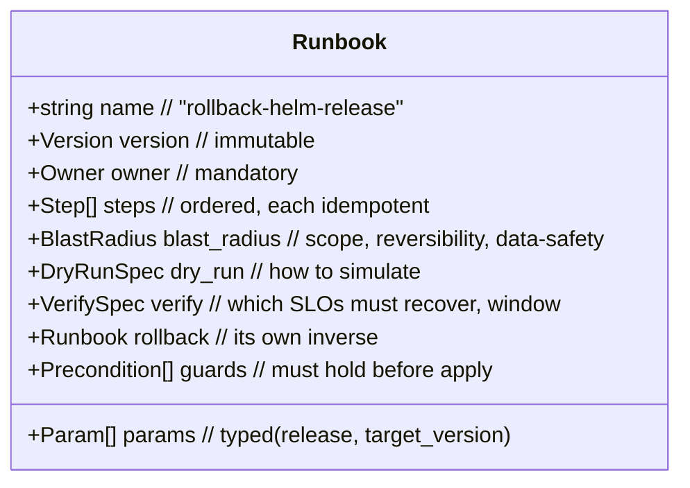
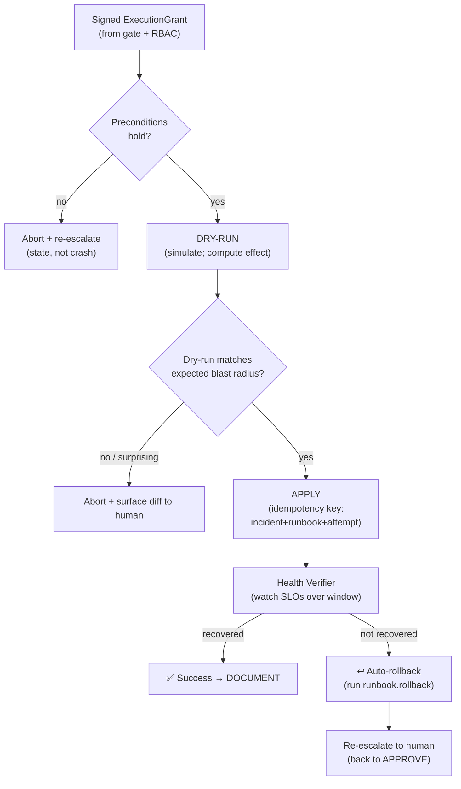
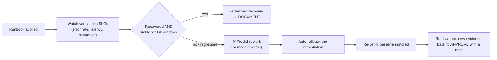

# 11 — Remediation & Verification

> Spans principles 1 (runtime/idempotency) and 5 (safety). This is the only part of the IC
> that *changes production*. Everything here is about making that change **bounded, reversible,
> and self-checking.**

---

## 1. The runbook model

Remediation is **only ever a catalog runbook** ([08](08-governance-lifecycle.md)) — never
free-form commands. A runbook is a versioned, signed, reviewed artifact that declares
everything the safety and verification machinery needs.

Key declared fields:
- **Blast radius** — resource scope (service/namespace/cluster/global), reversibility, and a
  data-safety class ([06](06-safety-guardrails.md)).
- **Dry-run spec** — how to compute the effect *without applying* (e.g. `helm diff`,
  `kubectl --dry-run=server`, a plan).
- **Verify spec** — the SLOs that must recover, thresholds, and the stabilization window.
- **Rollback** — the runbook's own inverse, so the Verifier can undo it automatically.
- **Preconditions/guards** — invariants checked at execution time (e.g. "target version 2.3.0
  still exists", "no other rollout in progress").

---

## 2. Execution pipeline (dry-run → apply → verify)

Guarantees on the apply step:
- **Dry-run is mandatory and shown before approval** ([06](06-safety-guardrails.md)). The
  human approves against the *simulated effect*, not a promise. If the dry-run's blast radius
  differs from the runbook's declared radius, execution aborts — a mismatch means the world
  changed under the plan.
- **Idempotent + keyed.** The apply uses an idempotency key (`incident_id + runbook_version +
  attempt`) so a crash-and-resume ([02](02-agent-runtime.md)) cannot double-apply. Steps are
  individually idempotent where possible.
- **Scoped to the grant.** The Executor may only touch resources named in the signed grant;
  anything outside is refused ([08](08-governance-lifecycle.md)).
- **Stepwise + abortable.** Multi-step runbooks checkpoint between steps; a mid-runbook
  failure stops and triggers rollback of the completed steps.

---

## 3. Health verification (did it actually work?)

Executing the fix is not the end — **confirming recovery is.** The Health Verifier watches the
runbook's declared SLOs over a **stabilization window** before declaring success.

Design stances:
- **Stabilization window, not a single sample.** A momentary dip below threshold isn't
  recovery; the SLOs must hold for the full window (e.g. 3–5 min) to count. This prevents
  premature "resolved" on a flapping metric.
- **The IC rolls back its own remediation.** If the fix doesn't restore SLOs — or makes things
  worse — the Verifier automatically runs the runbook's `rollback` and re-escalates with the
  new information. The IC is accountable for the *outcome*, not just the *action*.
- **"Made it worse" is a first-class outcome.** A remediation that causes a *secondary*
  regression triggers immediate rollback + human page, and the trajectory is flagged for the
  evaluator ([07](07-evaluation-observability.md)) as a remediation-safety failure.
- **Verification feeds confidence.** A runbook that repeatedly verifies-successfully for a
  given signature builds the track record that makes it *eligible* for the auto-remediation
  allowlist ([06](06-safety-guardrails.md)) — autonomy is *earned* by verified outcomes.

---

## 4. Auto-remediation (the narrow, earned exception)

Full human-in-the-loop is the default. The auto-remediation allowlist is the *only* exception
and requires **all** of:

1. Blast radius = narrow + reversible + no data impact.
2. Confidence ≥ high threshold ([10](10-hypothesis-and-debate.md)).
3. The runbook is explicitly allowlisted **for that signature** by the owning team.
4. That runbook has a verified success track record for that signature.
5. No active change-freeze ([06](06-safety-guardrails.md), [08](08-governance-lifecycle.md)).

Even then, auto-remediation is **fully audited, dry-run-first, verified, and auto-rolled-back on
failure** — it removes the *wait for a human*, not the *safety machinery*. Example: automatically
restarting a single pod stuck in `CrashLoopBackOff` due to a known transient, where rollback
(let it crashloop again) is trivially reversible.

---

## 5. What a reference implementation stubs

- **Dry-run** is per-runbook-type (helm diff, k8s server-dry-run, TF plan); the reference impl
  models it as a pure function returning a simulated `EffectSet`.
- **Executor** targets a mock cluster in the reference impl; production uses the scoped write
  credential ([01](01-architecture.md)) against the real API.
- **Verify-spec** thresholds are per-service SLOs pulled from a config; the reference impl
  inlines them.

Continue to [12 — Postmortem generation](12-postmortem.md).
