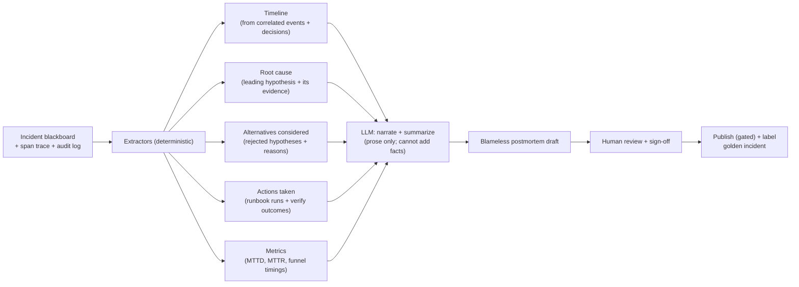

# 12 — Postmortem Generation

> Spans principles 6 (evaluation) and 7 (governance). The postmortem is not a creative-writing
> task — it is a **deterministic reconstruction** of the incident trajectory, made readable.

Because the entire incident lived on a structured blackboard ([04](04-memory-context.md)) and
emitted a complete span trace ([07](07-evaluation-observability.md)), the postmortem is
*assembled from facts already recorded*, not *generated from scratch*. This is what keeps it
accurate and blameless.

---

## 1. Where the content comes from (no new facts invented)



The LLM's job is **narration and summarization of provided facts**, constrained so it cannot
introduce a claim that isn't in the blackboard. Every stated cause, action, and timestamp
traces to a recorded evidence item or audit entry — the same groundedness discipline as the
live reasoning ([06](06-safety-guardrails.md)).

---

## 2. Postmortem structure (standard, blameless)

```
POSTMORTEM · INC-4471 · payment-api · SEV2
──────────────────────────────────────────
SUMMARY
  From 14:32–14:47 UTC, payment-api returned up to 35% 5xx due to
  Postgres connection-pool exhaustion introduced by release 2.3.1.

IMPACT
  15 min degraded; ~X failed payment requests; SLO error budget burned 14×.

DETECTION
  PagerDuty PaymentAPI-HighErrorRate at 14:32 (2 min after onset).
  MTTD: ~2 min.

ROOT CAUSE   (confidence at resolution: 0.88)
  Helm release payment-api-2.3.1 set db.pool.max 50→5 (PR #812).
  Pool exhausted at 14:31 → PoolTimeoutError → 5xx.

TIMELINE
  14:20  PR #812 merged (db config change)          [GitHub]
  14:29  Argo synced → release 2.3.1                 [Argo, Helm]
  14:31  db_connections 100/100; PoolTimeoutError    [Prometheus, Loki, PG]
  14:32  Alert fires                                 [PagerDuty]
  14:41  Root cause identified (conf 0.88)           [IC]
  14:42  Rollback to 2.3.0 approved by @alice        [Audit]
  14:44  Rollback applied; dry-run clean             [Executor]
  14:47  SLOs recovered, stable 3m                   [Verifier]

RESOLUTION
  runbook rollback-helm-release → 2.3.0. MTTR: ~15 min.

ALTERNATIVES CONSIDERED (and why rejected)
  • Postgres degraded independently — CPU/IO nominal.
  • Redis eviction storm — evictions flat.

WHAT WENT WELL / POORLY
  + Parallel investigation gave root cause in ~9 min.
  − The pool-size change had no review guard / canary.

ACTION ITEMS  (owned, tracked)
  [ ] Add a canary + SLO gate to payment-api deploys      — @team-payments
  [ ] Lint rule: flag db.pool.max reductions in PR        — @platform
  [ ] Add pool-saturation alert (earlier MTTD)            — @sre
```

The **blameless** stance is structural: the postmortem attributes causes to *systems and
gaps* (no review guard, no canary), never to individuals. Human names appear only as
*approvers of actions*, from the audit log — a record of process, not blame.

---

## 3. Action items feed the loop

Action items are not prose — they are **tracked work** with owners, optionally auto-filed as
tickets (with approval, [08](08-governance-lifecycle.md)). Crucially, they close two loops:

- **Detection loop:** "add pool-saturation alert" improves future MTTD for this failure class.
- **Learning loop:** the signed postmortem's **root cause** becomes the ground-truth label for
  this incident in the **golden set** ([07](07-evaluation-observability.md)), and the incident's
  evidence bundle becomes a replayable regression case. The postmortem is simultaneously an
  *output* and a *labeled eval example* — the system learns from every incident it documents.

---

## 4. Governance around publication

- **Human sign-off required** before a postmortem is published — the IC drafts, a human owns.
- **Publication is a gated action** ([06](06-safety-guardrails.md)) — posting to a wiki/Slack
  is an outward-facing side effect behind approval.
- **Stored + linked** to the incident record and to the affected services, so the next
  incident on `payment-api` recalls it via the Incident History agent
  ([04](04-memory-context.md)) — institutional memory compounds.

Continue to [13 — Data model & contracts](13-data-model.md).
