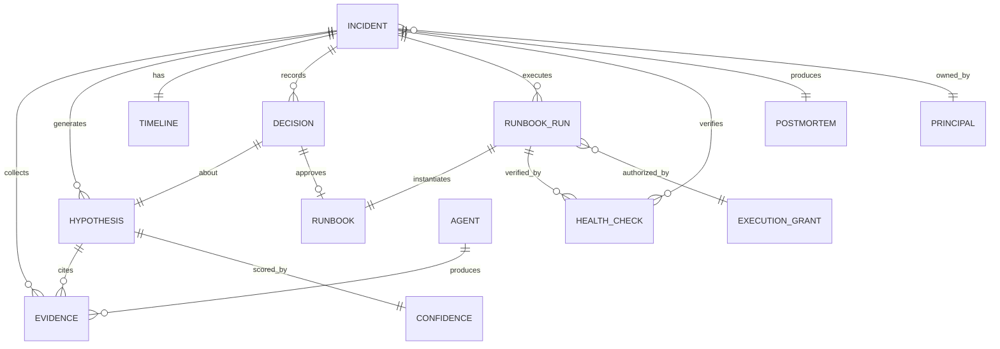

# 13 — Data Model & Contracts

The core schemas the whole system agrees on. These are the *contracts* between stages — the
blackboard ([04](04-memory-context.md)) is a graph of these objects, and the typed reference
versions live in [reference_impl/contracts.py](../reference_impl/contracts.py).

Two invariants run through every schema:
1. **Everything is timestamped and attributed** (which component/agent produced it).
2. **Every claim links its evidence** — a `Hypothesis` with no `Evidence` is invalid by
   construction, which is how "evidence-based" is enforced at the type level.

---

## 1. Entity relationship overview

---

## 2. Core entities

### Incident
The root object; a durable state machine ([02](02-agent-runtime.md)).

| Field | Type | Notes |
|---|---|---|
| `id` | `IncidentId` | e.g. `INC-4471` |
| `principal` | `Principal` | tenant/team/service — isolation key |
| `severity` | `Severity` | SEV1–4; re-evaluated as evidence arrives |
| `state` | `State` | `DETECT…CLOSE`, `SUSPENDED` |
| `alert` | `Alert` | the triggering, enriched alert |
| `topology` | `ServiceTopology` | affected service + dependencies |
| `budget` | `BudgetCounters` | steps/tool-calls/wall-clock/$ used vs. caps |
| `blackboard_refs` | refs | evidence/hypotheses/timeline/decisions |
| `created_at`,`updated_at` | ts | |

### Evidence
The atom of the system — a bounded, cited observation from one agent.

| Field | Type | Notes |
|---|---|---|
| `id` | `EvidenceId` | |
| `agent` | `AgentName` | producer (K8s, Prometheus, …) |
| `kind` | `EvidenceKind` | `metric`,`log_signature`,`deploy`,`config_diff`,`event`,`historical`,`chatter` |
| `observed_at` | ts | *when the observed thing happened*, not when queried |
| `summary` | str | bounded, human-readable |
| `citation` | `Citation` | source system + query + link (reproducible) |
| `payload_ref` | blob ref | full data in blob store, not inline |
| `reliability` | float | source-class weight (metric > log > chatter) |
| `degraded` | bool | true if this stands in for a failed/timed-out agent |

### Hypothesis
A candidate root cause. **Invalid without ≥1 cited evidence.**

| Field | Type | Notes |
|---|---|---|
| `id` | `HypothesisId` | |
| `statement` | str | "release 2.3.1 exhausted the DB pool" |
| `evidence` | `EvidenceId[]` | **required, ≥1** |
| `predictions` | `Prediction[]` | testable claims for the debate |
| `status` | enum | `candidate`,`surviving`,`rejected` |
| `rejected_reason` | str? | set when falsified (shown to human + postmortem) |
| `proposed_runbook` | `RunbookRef?` | mapped fix, if any |

### Confidence
Explainable score for a hypothesis ([10](10-hypothesis-and-debate.md)).

| Field | Type | Notes |
|---|---|---|
| `value` | float `[0,1]` | |
| `independent_classes` | int | # independent evidence classes |
| `temporal_score` | float | cause-precedes-symptom tightness |
| `survived_falsification` | bool | |
| `contradictions` | int | surviving conflicting evidence |
| `coverage` | float | fraction of key agents that responded |
| `rationale` | str | the human-readable "0.88 because…" sentence |

### Runbook & RunbookRun
The only mutation contract ([11](11-remediation-and-verification.md), [08](08-governance-lifecycle.md)).

`Runbook`: `name, version, owner, params, steps, blast_radius, dry_run, verify, rollback, guards`.

`RunbookRun`:

| Field | Type | Notes |
|---|---|---|
| `id` | `RunId` | |
| `runbook` | `RunbookRef` | pinned version |
| `grant` | `ExecutionGrant` | signed authorization (principal, resources, approver, expiry) |
| `idempotency_key` | str | `incident+runbook+attempt` |
| `dry_run_effect` | `EffectSet` | simulated blast radius shown pre-approval |
| `status` | enum | `dry_run`,`applied`,`verified`,`rolled_back`,`failed` |
| `steps_completed` | int | for stepwise rollback |

### Decision
An entry in the human/auto approval record ([06](06-safety-guardrails.md)).

| Field | Type | Notes |
|---|---|---|
| `id` | `DecisionId` | |
| `about` | `HypothesisId` | |
| `verb` | enum | `approve`,`recommend_only`,`reject`,`need_more`,`auto_remediate` |
| `actor` | `Principal` | human approver, or `system` for allowlisted auto |
| `rendered_view` | ref | exactly what the human saw (audit) |
| `at` | ts | |

### ExecutionGrant
The signed capability that unlocks the Executor ([08](08-governance-lifecycle.md)).

| Field | Type | Notes |
|---|---|---|
| `principal` | `Principal` | who |
| `runbook_version` | `RunbookRef` | what |
| `resources` | `ResourceRef[]` | scope — Executor refuses anything outside |
| `approver` | `Principal` | human or policy-engine |
| `expiry` | ts | short-lived |
| `signature` | bytes | verified by Executor |

### HealthCheck
Verification samples ([11](11-remediation-and-verification.md)).

| Field | Type | Notes |
|---|---|---|
| `slo` | str | which SLO (error rate, p99 latency) |
| `value` | float | observed |
| `threshold` | float | recovery bar |
| `in_window` | bool | within stabilization window |
| `passed` | bool | |

### Postmortem
The signed reconstruction ([12](12-postmortem.md)) — carries the ground-truth `root_cause`
label that feeds the golden set.

---

## 3. Why these contracts matter

- **The type system enforces the safety posture.** `Hypothesis.evidence` being non-empty makes
  "no uncited claims" a compile-time-ish guarantee. `RunbookRun.grant` being required makes
  "no unauthorized write" structural.
- **Timeline reconstruction is free.** Because every `Evidence` and `Decision` is timestamped
  and attributed, the timeline ([12](12-postmortem.md)) is a sort, not a synthesis.
- **Replay is faithful.** Because runs pin `runbook_version` and evidence pins `citation` +
  `payload_ref`, an incident replays deterministically for offline eval
  ([07](07-evaluation-observability.md)).

See the typed dataclasses in [reference_impl/contracts.py](../reference_impl/contracts.py).

Continue to [14 — End-to-end sequence flows](14-sequence-flows.md).
