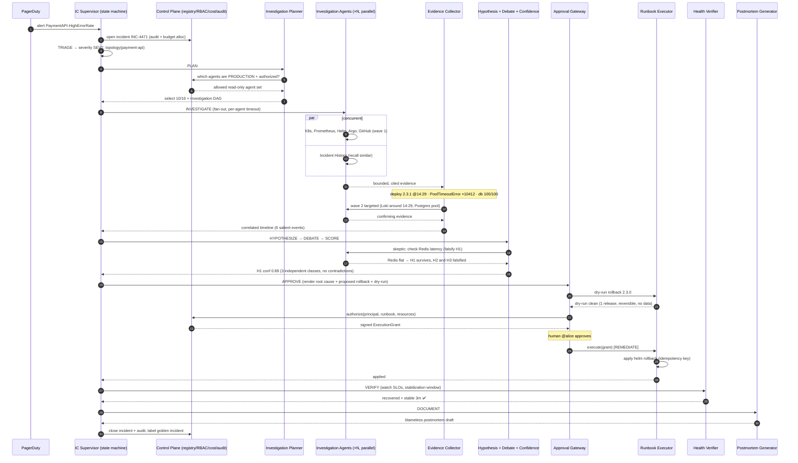
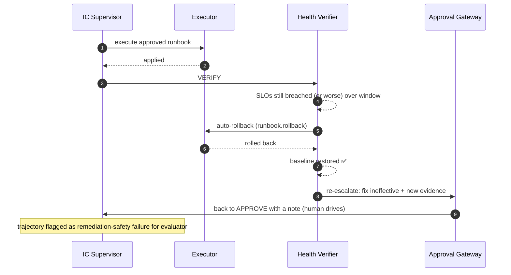
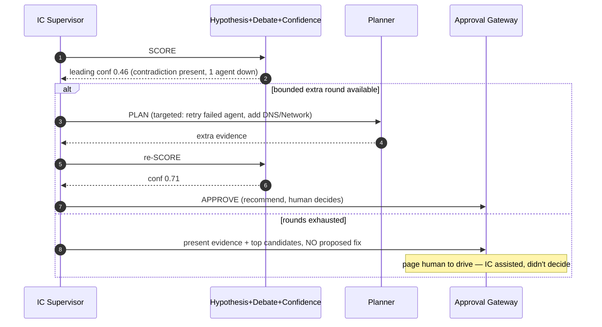
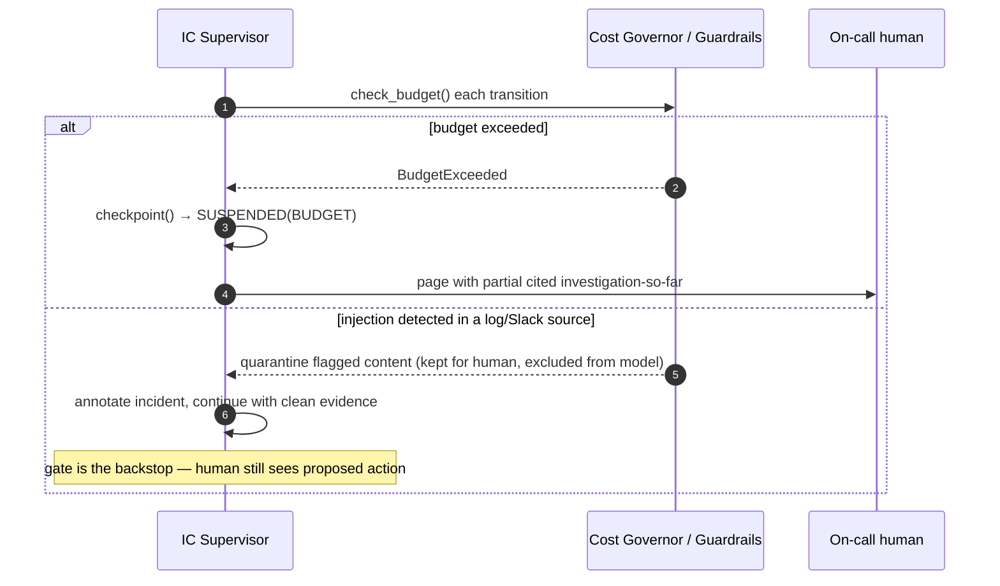
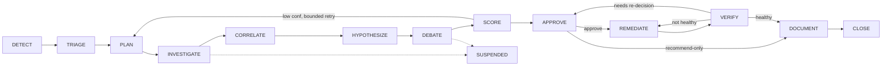

# 14 — End-to-End Sequence Flows

The worked example ([00](00-overview.md)) as concrete sequence diagrams. This is the "watch it
run" view that ties every doc together.

---

## 1. Happy path: detect → diagnose → remediate → verify → document

---

## 2. Unhappy path A — remediation didn't work (auto-rollback)

---

## 3. Unhappy path B — low confidence / inconclusive

---

## 4. Unhappy path C — budget/injection short-circuit

---

## 5. The one-glance lifecycle (recap)

Continue to [15 — Failure modes & resilience](15-failure-modes.md).
