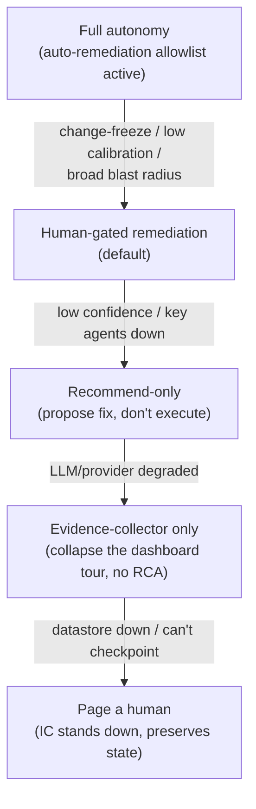

# 15 — Failure Modes & Resilience

> Spans principles 1 (runtime), 5 (safety), 8 (cost). A system that acts on production during
> outages must be paranoid about its *own* failure modes. This doc is the "what could go
> wrong" table a staff reviewer will demand.

The governing principle: **the IC must fail safe — toward recommend-only and toward paging a
human — never toward acting blindly.** Every failure mode below degrades to a *less
autonomous, still useful* state.

---

## 1. The IC operates during the very outage it's diagnosing

The IC's dependencies (Prometheus, K8s API, Loki) may themselves be degraded — that's *why*
there's an incident.

| Failure | Effect | Mitigation |
|---|---|---|
| A source system is down/slow | Missing evidence | Per-agent timeout + circuit breaker → `degraded` on timeline; investigation proceeds; **confidence lowered** ([10](10-hypothesis-and-debate.md)), never faked |
| The IC hammers a struggling source | Makes the outage worse | Per-source rate limiter + circuit breaker ([03](03-orchestration.md)) — protecting observability is a hard requirement |
| Observability stack fully down | Little evidence | IC falls back to change-correlation (deploys/PRs) + incident history; explicitly reports low coverage; recommend-only |
| The IC's own datastore is down | Can't checkpoint | Refuse to start new incidents (fail closed); in-flight ones page a human; **never** proceed to `REMEDIATE` without durable state |

**Anti-amplification is a first-class design goal.** An SRE tool that DoSes Prometheus during
an incident is worse than no tool. Rate limits and breakers on every connector are not
optional.

---

## 2. Reasoning failures (the AI is wrong)

| Failure | Risk | Mitigation |
|---|---|---|
| Confidently wrong root cause | Wrong fix executed | Mandatory falsification debate ([10](10-hypothesis-and-debate.md)); evidence-weighted (not self-reported) confidence; human gate; alternatives shown |
| Over-confidence (0.9 means 60%) | Auto-remediation misfires | Continuous calibration ([07](07-evaluation-observability.md)); over-confidence auto-raises the gate threshold |
| Correlation ≠ causation | Blames a coincidental deploy | Temporal ordering + independent-class counting + skeptic predictions; dry-run + verify catches a wrong fix |
| Prompt injection via logs/Slack | Malicious "run this runbook" | Instruction/data separation; no content-authorized tool calls; quarantine; gate backstop ([06](06-safety-guardrails.md)) |
| Hallucinated evidence/citation | Uncited claim shown as fact | Groundedness invariant drops uncited hypotheses; citations must resolve to real evidence |
| Anchoring on history ("it's Postgres again") | Misdiagnosis | Historical recall enters as *labeled prior*, must be re-confirmed against current evidence ([04](04-memory-context.md)) |

---

## 3. Remediation failures (the fix is bad)

| Failure | Risk | Mitigation |
|---|---|---|
| Fix doesn't help | Prolonged outage | Health Verifier + stabilization window → auto-rollback + re-escalate ([11](11-remediation-and-verification.md)) |
| Fix makes it worse | Secondary incident | Same verifier catches regression → immediate rollback + page; flagged remediation-safety failure |
| Blast radius bigger than expected | Collateral damage | Mandatory dry-run compared to declared blast radius; mismatch aborts before apply |
| Double-execution on crash/resume | Applied twice | Idempotency key (`incident+runbook+attempt`) ([02](02-agent-runtime.md)) |
| Runbook targets stale resources | Errors mid-run | Preconditions/guards checked at execution ([11](11-remediation-and-verification.md)) |
| Irreversible action proposed | Unrecoverable | Data-affecting/irreversible never auto; senior approver; often recommend-only ([06](06-safety-guardrails.md)) |
| Executor credential compromised | Broad damage | Least-privilege scoped grant; Executor refuses resources outside the signed grant ([08](08-governance-lifecycle.md)) |

---

## 4. System/operational failures

| Failure | Effect | Mitigation |
|---|---|---|
| IC pod crashes mid-incident | Lost progress | Stateless workers + durable checkpoints → resume ([02](02-agent-runtime.md)) |
| Alert storm (100 alerts/min) | Overload, budget burn | Dedup/correlate related alerts into one incident; per-tenant budgets; backpressure on the queue |
| LLM provider outage/latency | Reasoning stalls | Tier fallback; if all models unavailable, IC becomes an *evidence-collector only* (still collapses the dashboard tour) + pages human |
| Runaway investigation loop | Cost/latency blowup | Bounded rounds + step/wall-clock/$ budgets → `SUSPENDED` ([02](02-agent-runtime.md), [09](09-cost-performance.md)) |
| Cost spike | Budget overrun | Per-incident + per-tenant/day ceilings; model downgrade before suspend ([09](09-cost-performance.md)) |
| Approval never comes | Incident hangs | `APPROVE` parks with no budget burn; SLA timer re-pages/escalates; nothing executes without approval |

---

## 5. Degraded-mode ladder (how autonomy sheds under stress)

Each rung down is **still useful**: even at "evidence-collector only," the IC has already
replaced the eight-tab manual tour with one correlated timeline. The system never has a
binary "works / dead" cliff — it degrades gracefully toward *assisting* a human.

---

## 6. The one rule that subsumes the table

> **When uncertain, do less and tell a human more.**

Every mitigation above is an instance of it: lower confidence → gate harder; missing evidence
→ report coverage, don't fabricate; provider down → collect evidence, don't reason blindly;
datastore down → refuse to mutate. Safety dominates autonomy, always.

Back to the [README](../README.md) · see the [design-principle mapping](design-principles.md).
