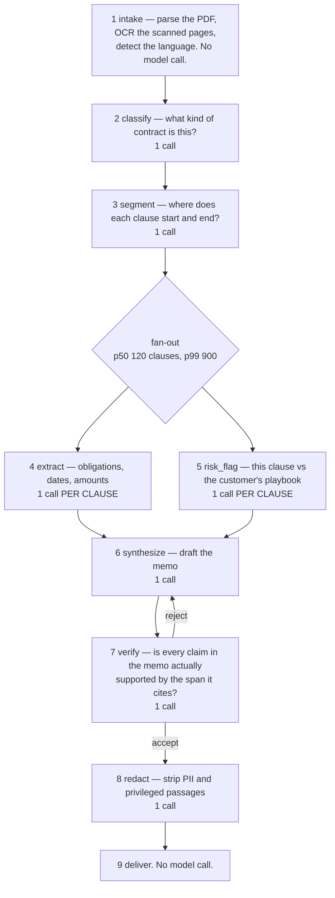
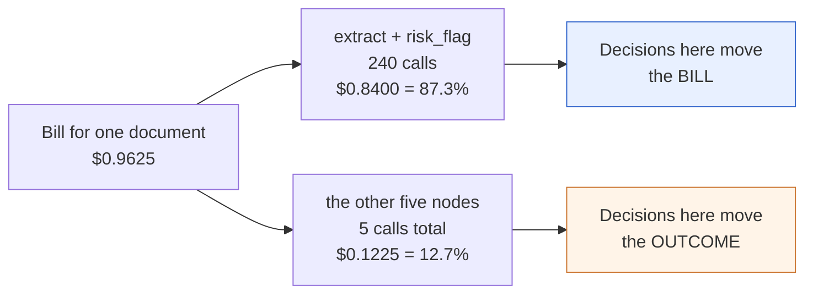
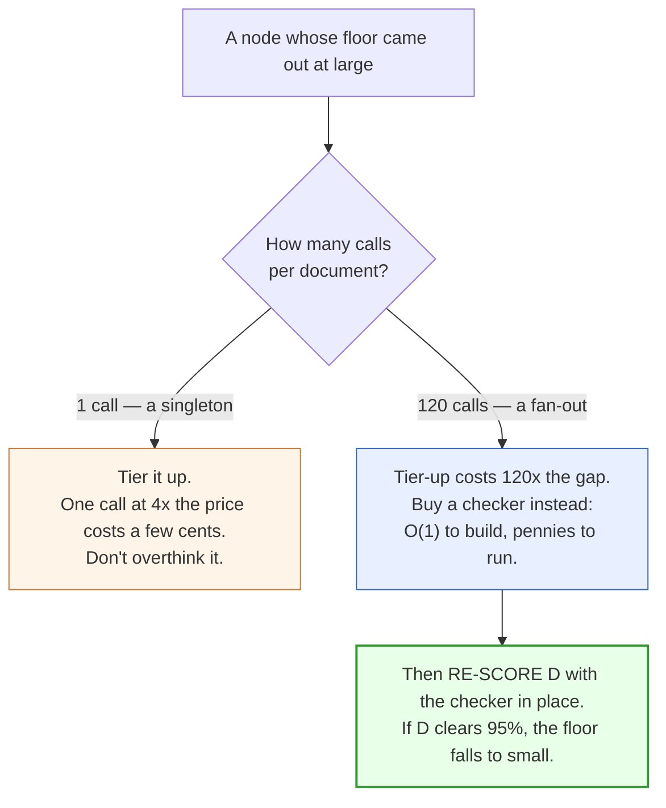
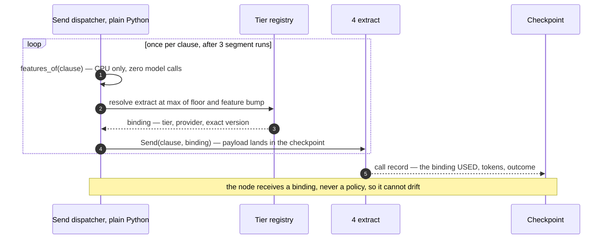

# Model Tiering — Explained From Scratch

This is a walkthrough of one design problem: **you have a pipeline with several LLM calls in it, and
some models are ten times cheaper than others. Which call gets which model?**

It assumes you know Python and have called an LLM API. It assumes you know **nothing** about LangChain
or LangGraph, and nothing about this design. Every term is defined the first time it appears, and
every dollar figure is derived rather than asserted — you can check all of them by running
`python3 reference_impl/economics.py`. Read it top to bottom; each part depends on the one before it.

---

## Part 1 — The problem, concretely

You work on a product called **Ledgerline**. A company sends you a commercial contract — a 50-page
master services agreement, say — and you send back a memo that tells their lawyer what they just
signed up for: every obligation, every deadline, every clause that violates their own internal rules.
You do this **90,000 times a day**. Here is what happens to one document — nine steps, seven of which
call a model.



Two words before the walkthrough. A **node** is one step in that diagram — in code, a Python function
that usually makes one model call. A **fan-out** is a step that runs *many times in parallel*, once per
unit of work; here, once per clause. Nodes 4 and 5 are fan-outs; everything else runs once per document,
and I'll call those **singletons**. Now, step by step, and why a lawyer cares:

**1. intake.** Parse the file, OCR the pages that are photographs of paper, detect the language. No
model — a library call. A lawyer cares because if the OCR mangles "shall not" into "shall", everything
after this point is confidently wrong.

**2. classify.** *What am I looking at?* An NDA, a master services agreement, a SaaS order form, a
commercial lease. Under which state's or country's law. Who the parties are. One model call, and its
answer selects **which questionnaire the rest of the pipeline fills in** — the set of fields an NDA has
is not the set a lease has. Hold onto that sentence; we come back to it.

**3. segment.** Split the document into clauses. Sounds like `text.split()`; it isn't. Real contracts
number clauses inconsistently, nest them four levels deep (`7.2(b)(iii)(A)`), and put definitions in one
place and the obligations they govern eighty pages later. A lawyer cares because a clause boundary in the
wrong place cuts an obligation in half.

**4. extract.** For each clause: what does it *require*, of whom, by when, for how much money? This is
where the memo's actual content comes from. One call per clause.

**5. risk_flag.** For each clause: does it violate the customer's **playbook** — that company's list
of standing rules, like "never accept uncapped liability", "notice periods under 30 days need VP
approval", "no exclusivity in North America"? Every customer has a different one. One call per clause.

**6. synthesize.** Take the extracted obligations and flagged risks, write the memo. One call.

**7. verify.** For every factual claim in the memo, go back to the **span** it cites — the specific
stretch of contract text the claim points at — and check the span actually says that. One call. This is
the quality gate: if verify rejects, the memo goes back to step 6 to be rewritten.

**8. redact.** Strip personal data and legally privileged passages before delivery. One call. A lawyer
cares enormously here, because a privilege leak is not a bug report, it is a malpractice conversation.

**9. deliver.** Send the memo. Then a human lawyer reads it and either uses it or throws it out.

### The clause count is the number that matters

Everything here comes back to one distribution: **how many clauses does a document have?** Because that
number is how many times nodes 4 and 5 run.

| | Clauses | What it means |
|---|--:|---|
| p50 (median) | **120** | half of all documents are smaller than this |
| mean (average) | **174** | 45% higher than the median |
| p90 | **340** | one document in ten is at least this big |
| p99 | **900** | one document in a hundred is at least this big |

("p50" is the value half the documents fall below, "p99" the value 99% fall below — if you haven't met
percentiles before, that's all they are.) Sit with that table, because the skew is the story. The
typical document has 120 clauses, so the fan-out runs 240 times — 120 extracts plus 120 risk flags. But
one in a hundred has 900 clauses and runs it **1,800** times, costing 7.5× what the median one costs.
And because a handful of very large documents drag the average up, **the mean document is 45% bigger
than the median one.** Remember that gap; in Part 7 it is the difference between passing and failing.

At 90,000 documents a day Ledgerline makes roughly **22 million model calls a day** — about 55% of all
calls made by all ~200 pipelines on its platform combined. One pipeline. Which means whatever rule you
use to pick models for *this* DAG becomes the platform's rule, whether anyone decided that or not.

---

## Part 2 — What "model tiering" even means

Model providers sell several models at wildly different prices. Cheap ones are fast and fine at narrow,
well-specified jobs. Expensive ones are better at reading something adversarial, holding a lot of
context at once, and following forty instructions without dropping one. A **tier** is a name for one of
those price/capability bands. Ledgerline's platform defines five:

| Tier | $ per million input tokens | $ per million output tokens | The kind of job it is for |
|---|--:|--:|---|
| `nano` | 0.10 | 0.40 | picking one of five labels, spotting boilerplate |
| `small` | 0.25 | 1.25 | filling in a narrow, fixed schema; one-item judgements |
| `mid` | 1.00 | 5.00 | drafting, multi-document synthesis |
| `large` | 3.00 | 15.00 | choosing a schema, verifying, adversarial reading |
| `frontier` | 10.00 | 40.00 | reserved — nothing here currently needs it |

Note the gaps: `small` → `mid` is 4× on both input and output, `mid` → `large` is 3×. Those gaps are
deliberate, and they matter in Part 8.

**Why a tier and not just a model name?** Because a model name is a string literal, and if 200 pipelines
each hardcode `"vendor-x-3"`, the day the vendor deprecates it you have a 200-repository flag day on
someone else's calendar. If instead each pipeline says "give me `mid`", one team re-points what `mid`
means, once, behind an evaluation gate. The tier is a contract — *this much context window, this much
schema conformance, at most this price* — and nobody in the pipeline code names a vendor.

### Turning tiers into dollars

To reason about cost you need each node's token profile — how much it reads and writes per call:

| # | Node | Calls per doc (median) | Input tokens | Output tokens |
|---|---|--:|--:|--:|
| 2 | classify | 1 | 4,000 | 300 |
| 3 | segment | 1 | 12,000 | 2,000 |
| 4 | extract | 120 | 1,500 | 400 |
| 5 | risk_flag | 120 | 2,000 | 300 |
| 6 | synthesize | 1 | 15,000 | 3,000 |
| 7 | verify | 1 | 25,000 | 2,000 |
| 8 | redact | 1 | 5,000 | 5,000 |

One worked example, so the rest are checkable. An `extract` call reads 1,500 tokens and writes 400:

```
at mid    :  1,500 × $1.00/Mtok  +  400 × $5.00/Mtok  =  $0.0015 + $0.0020  =  $0.003500
at small  :  1,500 × $0.25/Mtok  +  400 × $1.25/Mtok  =  $0.000375 + $0.000500 = $0.000875
```

So `small` is exactly 4× cheaper than `mid` here, as the rate card implies. **And now the obvious idea:**
most of these calls probably don't need an expensive model. Use cheap models where you can, expensive ones
where you must, and the bill goes down. Fine. **Which nodes?** That is the entire question, and the rest
of this document is about the fact that the intuitive answer is wrong.

> **When not to bother.** If your whole model bill is $300 a month, close this document. Tiering is a
> program of work — a registry, per-node evaluation, detectors, a cost ledger — and it pays for itself
> at Ledgerline's $31.6M/year, not at $3,600/year. The rest of this is only interesting when the
> arithmetic is worth more than the engineering.

---

## Part 3 — The obvious answer, and why it's wrong

Here is what almost everybody does, and it is not stupid. **Tier by difficulty.** Look at each node,
ask how hard its job is, and buy accordingly:

- `classify` — pick one of a dozen document types. A labelling problem. **Cheap.**
- `segment` — find clause boundaries. Text processing. **Cheap.**
- `extract` — read a clause, fill in a schema. Middling; also the bulk of the work, so don't
  skimp. **Middle.** And `risk_flag` is the same shape. **Middle.**
- `synthesize` — write a coherent memo from 240 fragments. Hard. **Middle-to-expensive.**
- `verify` — adversarially check every claim. Hardest thing here. **Expensive.**
- `redact` — apply forty redaction rules. Fiddly. **Middle.**

That is coherent, it is what a thoughtful engineer produces in ten minutes, and it is the assignment to
hold in your head while we look at the bill.

### First, the bill

Before optimising anything, price the boring default: **put every node on `mid`** — what most
platforms actually ship, because `mid` is the choice nobody gets fired for. Using Part 2's token
profile:

| Node | Calls | $ per call | $ per doc | Running total |
|---|--:|--:|--:|--:|
| classify | 1 | 0.0055 | **0.0055** | 0.0055 |
| segment | 1 | 0.0220 | **0.0220** | 0.0275 |
| extract | 120 | 0.0035 | **0.4200** | 0.4475 |
| risk_flag | 120 | 0.0035 | **0.4200** | 0.8675 |
| synthesize | 1 | 0.0300 | **0.0300** | 0.8975 |
| verify | 1 | 0.0350 | **0.0350** | 0.9325 |
| redact | 1 | 0.0300 | **0.0300** | **0.9625** |

**$0.9625 per document.** At 90,000 documents a day that is $86,625 a day, or **$31.6 million a
year.** Now look at where it lives.



$0.4200 + $0.4200 = $0.8400, and $0.8400 ÷ $0.9625 = **87.3%**. Two nodes out of seven are seven
eighths of the bill. Five nodes are the remaining eighth.

### What the difficulty heuristic actually bought you

Score the tier-by-difficulty assignment against that table. You made `classify` cheap — $0.0055 of
$0.9625, **0.6% of the bill**, so taking it all the way to free would move the total by half a percent.
You made `segment` cheap: 2.3%. You made `verify` expensive, spending money on 3.6%. And you left
`extract` and `risk_flag` — **87.3% of the bill** — exactly where they were, at `mid`, because they looked
medium-hard and because they're "the bulk of the work." The one decision that could have moved the number,
you didn't make. So the difficulty heuristic is at best financially irrelevant — and that is the *mild*
version of the problem.

### Now the trap

Back to `classify`. One call, $0.0055, 0.6% of the bill, on a cheap model because picking a label is
easy. Now ask what happens when it gets the label wrong — says "NDA" for a document that is actually a
master services agreement. Remember step 2's job: its answer **selects the questionnaire the rest of the
pipeline fills in.** An NDA schema has fields for confidentiality period, permitted disclosures, residual
knowledge. An MSA schema has fields for service levels, payment terms, liability caps, termination
rights.

So all 120 `extract` calls now run against the wrong schema, and all 120 `risk_flag` calls check the
wrong playbook rules. That's **240 model calls, $0.84 of spend**, producing careful, well-formed,
schema-valid answers to a question nobody asked. Then `synthesize` writes a memo from them, and
`verify` — which checks that claims are supported by their cited spans — finds that they *are*, because
every one of those 240 calls did read real contract text. The memo is internally consistent and
completely useless.

One call, costing half a cent, threw away the other 99.4% of the document's spend and shipped a
plausible wrong answer. **That is what the difficulty question cannot see.** It prices the *task* and
never asks about the *position* — and position is where the money is.

---

## Part 4 — The right question, and the three reasons to spend money

Replace the question. Not *"how hard is this task?"* but:

> **"How much does an error here cost — counting the downstream spend it wastes, whether anything
> will catch it, and what happens if it escapes to the customer?"**

That is what "**blast radius**" means: not how hard the node's job is, but how far the damage travels
when the node is wrong. Three separate things go into it, one at a time.

### Reason 1 — Amplification

**Amplification** is: *how much downstream spend does one error here invalidate, measured in
multiples of what this node costs?*

```
A  =  (spend on everything downstream of this node)  ÷  (this node's own cost)
```

Compute it for `classify`. Its own cost is $0.0055, and everything downstream of it is the whole rest
of the pipeline, $0.9625 − $0.0055 = $0.9570:

```
A(classify)  =  $0.9570 ÷ $0.0055  =  174×
```

An error in `classify` wastes **174 times the node's own cost** — the arithmetic behind Part 3's story.

Now one `extract` call, which costs $0.0035. What is downstream of *one clause's extraction*? The memo
gets written, verified and redacted — $0.0300 + $0.0350 + $0.0300 = $0.0950 — but that work is shared
across all 120 clauses, so one clause's share is $0.0950 ÷ 120 = $0.0008:

```
A(one extract call)  =  $0.0008 ÷ $0.0035  =  0.23×
```

An error there wastes **less than a quarter** of what the call itself cost: it spoils one row of the
obligations table, and nothing else. Put those side by side: **174× and 0.23×** — a factor of roughly 750 between the leverage of the
pipeline's cheapest node and its most expensive one. And note the direction: amplification is *highest
at the top of the DAG*, which is exactly where a cheap model looks safest, because there is only one
call and the job looks easy. Turn it into a rule with three bands:

| A | Floor it demands | How to read it |
|---|---|---|
| under 2× | none | an error costs about what the node costs — nobody cares |
| 2× to 20× | `mid` | an error wastes real money |
| over 20× | `large` | **an error wastes the document** |

("Floor" means the *cheapest tier this node is allowed to run on* — not the tier it must run on, the tier
below which it may not go.) The bands are ordinal, so `A = 174` and `A = 42` demand the same thing; don't
build a continuous "risk score" out of this and pretend it was measured. And amplification says nothing
about the bottom of the DAG, where nothing is downstream. Which is the next reason.

### Reason 2 — Detectability

**Detectability** is: *if this node is wrong, will anything notice before the memo reaches the customer?*
Written as `D`, the fraction of this node's errors that get caught.

The obvious candidate for "something that notices" is node 7, `verify`. So be precise about what it
does, because the precision is the whole point: it reads the finished memo, and for every claim in it,
follows the citation to the source span and asks **does this span support this claim?** If any claim
isn't supported, the memo is rejected and goes back to `synthesize`. Read that again and find the hole.

> **`verify` checks that every claim in the memo is supported. Which means it structurally cannot
> notice a claim that is MISSING.**

There is no span to follow, no citation to check, no assertion to falsify. An obligation that never made
it into the memo produces a memo where every claim is perfectly well supported, so `verify` returns
*accept* — correctly, by its own definition. Hence a sentence worth memorising:

> **Any node whose failure mode is leaving things out is unchecked, no matter how good your verifier
> is.**

Which brings us to `segment`, the node that looked like `text.split()`. It fails by
**under-segmentation**: too few boundaries, so two clauses merge and the obligation in the second is
never separately extracted — or a boundary lands mid-clause and the obligation that spanned it is lost.
Either way the failure is an **absence**. `extract` never sees the missing clause, so it never extracts
the missing obligation, so `synthesize` never writes the missing claim, so `verify` has nothing to
check, so it accepts. What ships is a memo in which every claim is true and one indemnity obligation the
customer is now on the hook for simply isn't mentioned. **`segment` needs an expensive model for a
reason that has nothing to do with how hard clause-splitting is:** it is the node whose mistakes are
invisible.

### Reason 3 — Irreversibility

**Irreversibility** is: *what does it cost if the error escapes?* Written as `R`.

| R | Example | What it means |
|---|---|---|
| LOW | a malformed extraction row | re-run the node, done |
| MED | a bad memo caught in review | re-run the document, a few cents and some latency |
| HIGH | an unredacted privileged passage, a missing indemnity obligation | it reached the customer |

`R` is not really a number — "privilege leak reaches the customer" has no dollar value that survives
contact with your legal department. Treat HIGH as a **veto**, not a magnitude.

### Now combine them — and it's two terms, not three

You have three inputs and you need one floor. The tempting move is `max(floor_A, floor_D, floor_R)`,
the highest demand of the three. **That is wrong, and getting it wrong over-tiers every node at the
bottom of your DAG.** `D` and `R` are not independent; they only mean anything *jointly*, because the
question is always "how likely is it to escape, and how bad is it if it does?" So they come off one
table:

| D — caught before delivery | R — cost if it escapes | Floor demanded |
|---|---|---|
| 95% or better | anything | none |
| 60–95% | re-run only | `small` |
| 60–95% | reaches the customer | `large` |
| under 60% | re-run only | `mid` |
| under 60% | reaches the customer | `large` |

And then:

```
floor  =  max( floor_from_amplification,  floor_from_the_D_and_R_table )
```

**Two terms.** And here is why `R` cannot demand a floor on its own: *an irreversible error that is
reliably caught never escapes, so in practice it isn't irreversible.* A HIGH-`R` node with `D = 99%`
has its catastrophes intercepted 99 times out of 100 — which is what the table's top row says, and it
says "none". `max` in a standalone `R = HIGH → large` term and you have counted `R` twice; and since
every terminal node in every pipeline has HIGH `R` by construction (it is the last thing before the
customer), you end up buying `large` for the whole bottom of the graph and wondering why tiering
didn't save any money.

### Scored over the real DAG

Run all seven nodes through it. Amplification uses Part 3's baseline costs; `D` is shown twice, once
for `verify` alone and once for `verify` plus the human lawyer who reads the memo (Part 5 explains why
those differ).

| # | Node | Calls | Node cost | Downstream | **A** | **D** (verify → +review) | **R** | **Floor** | Why |
|---|---|--:|--:|--:|--:|---|---|---|---|
| 2 | classify | 1 | $0.0055 | $0.9570 | **174×** | ~50% → ~55% | HIGH | **large** | amplification *and* detectability |
| 3 | segment | 1 | $0.0220 | $0.9350 | **42.5×** | **under 60% → under 60%** | HIGH | **large** | omission is invisible to *both* checks |
| 4 | extract | 120 | $0.0035 | $0.0008 | 0.23× | 92% → **99%+** | MED | **small** | contained, detected, cheap to redo |
| 5 | risk_flag | 120 | $0.0035 | $0.0008 | 0.23× | *contested* → ~97% | HIGH | **small\*** | see Part 6 |
| 6 | synthesize | 1 | $0.0300 | $0.0650 | 2.2× | 95% → ~98% | MED | **mid** | modest amplification, well checked |
| 7 | verify | 1 | $0.0350 | $0.0300 | 0.86× | **~0% → ~0%** | HIGH | **large** | nothing checks the checker |
| 8 | redact | 1 | $0.0300 | $0 | 0× | ~40% → ~40% | HIGH | **large** | terminal and irreversible |

Look at the two columns that decide things — `A` and `D` — and notice they **disagree everywhere it
matters.** Amplification argues for `large` at the *top* of the DAG, detectability argues for `large` at
the *bottom*, and neither argues for the middle. The middle is where all the money is. That is the shape
of the whole result, and it generalises to any pipeline with a fan-out in the middle and a quality gate
at the end.

Two rows show why you need both terms. **`verify` has `A = 0.86×` and still lands on `large`**:
amplification says it barely matters financially, detectability says nothing checks the checker, and
`max()` of the two is `large` — any single-variable rule misses that. And **`redact` has `A = 0` exactly**,
since nothing is downstream of the last model call, so its amplification term contributes nothing and the
floor comes entirely from the other one.

---

## Part 5 — Human review is a detector, but only for some mistakes

You'll have noticed the `D` column had two values. Here's why, and it's the most contested judgement in
the whole design. `verify` is not the last check: **a lawyer reads the memo.** So it is very tempting to
say "a human checks it, therefore detectability is high, therefore we can use cheap models" — and that
sentence is the single most abused justification for tiering down that exists. So don't say it in
general. Say it per failure mode. Here are the six ways this pipeline produces a bad memo, and whether a
lawyer reading it catches each one:

| Failure mode | Caught in review? | Why |
|---|---|---|
| A wrong obligation **value** (node 4) | **Yes** | the memo cites the span, the reviewer reads both, they don't match |
| A **spurious** risk flag (node 5, false positive) | **Yes** | obviously wrong on inspection — the clause plainly doesn't say that |
| A **missing** obligation (node 3) | **No** | you cannot notice an absence without re-reading the whole source contract |
| A **missing** risk flag (node 5, false negative) | **No** | same — absence is invisible |
| An unredacted privileged passage (node 8) | **Mostly no** | subtle by nature, and review is aimed at the memo, not at the redaction diff |
| A wrong `verify` verdict (node 7) | **No** | the reviewer trusts the gate. That is what a gate is for |

**Two out of six.** Human review is a real detector and a narrow one, and the pattern is exact:

> **Mistakes of commission are reviewable. Mistakes of omission are not.**

If the system says something wrong, a human comparing the claim to the cited span sees it. If the system
fails to say something, there is nothing on the page to compare against anything, and the only way to
catch it is to redo the work the system was hired to do.

**This is the whole reason `extract` gets a cheap model and `segment` gets an expensive one.** Compare
those two rows of the scored table:

|  | `extract` | `segment` |
|---|---|---|
| Amplification | 0.23× | 42.5× |
| Irreversibility | MED | HIGH |
| Failure shape | says the wrong thing | **doesn't say the thing** |
| Caught by `verify`? | yes — the claim contradicts its span | no — there is no claim |
| Caught by the lawyer? | yes | no |
| Floor | **`small`** | **`large`** |

They both fail in ways a customer would care about; only one fails *visibly*. That single difference is
worth four times the price per call.

A discipline goes with it: claiming "a human catches it" obliges you to prove it, so the design carries
an independent measurement — the **human rejection rate** must stay at or under 6%. If reviewers stop
rejecting things, either the pipeline got better or they stopped reading, and you need a number to tell
which.

> **Never claim human review as a detector without doing the mode-by-mode breakdown.** Here the
> claim is valid for exactly two of six failure modes, and the four it doesn't cover include every
> failure that silently reaches a customer.

---

## Part 6 — Buy a checker, not a bigger model

Suppose the rubric hands you a node with poor detectability and therefore an expensive floor. There are
two ways to satisfy it, and everyone reaches for the wrong one. **Option A: buy capability** — move the
node up a tier so it makes fewer mistakes. **Option B: buy detectability** — leave the node cheap and *add
something that catches its mistakes*, so `D` goes up and the floor comes back down.

Notice the rubric never asked for a better model. It asked for a floor, and the floor was a function of
`D`. **`D` is a design variable, not a fact about the universe** — and treating it as fixed is what forces
teams into a cost/quality tradeoff that doesn't have to exist.

Now price the two options, and notice the answer depends entirely on **how many times the node
runs.** Upgrading from `small` to `mid` costs the price difference *on every call*, while a
deterministic checker — plain Python, or at worst a `nano`-tier assist at about $0.0002 a clause —
costs engineering time once and then pennies:

```
tier-up  :  120 calls × ($0.0035 − $0.000875)  =  120 × $0.002625  =  $0.315 / doc, forever
detector :  120 clauses × $0.0002                                  =  $0.024 / doc
```

**Thirteen to one.** And the ratio gets *worse* for the upgrade as the fan-out widens, because both terms
scale with N but only one carries a 4× price gap. Which gives the rubric a preferred remedy that depends
on volume:



Run that over Ledgerline. The **four singletons** (`classify`, `segment`, `verify`, `redact`) are 12.7%
of the bill, so tiering all four up to `large` costs $0.185 a document — affordable without a meeting.
The **two fan-outs** are 87.3% of the bill, and buying them a checker rather than a bigger model saves
$0.63 a document.

### The vivid case: `risk_flag`

`extract` was an easy call and so was `verify`. **`risk_flag` is the one where a reviewer should push
back**, and where the rubric produces an argument rather than an answer, because its two failure modes
score completely differently:

- **False positive** — flags a clause that isn't a risk. Caught in human review (row 2 of Part 5's
  table). `D` high, `R` low. Floor: `small`. Fine.
- **False negative** — misses a real risk. An **omission**. `verify` can't see it, the lawyer can't
  see it. `D` low, `R` HIGH. Floor: **`large`**.

Take the `max` and `risk_flag` needs `large`. On 120 calls a document:

```
risk_flag at small :  120 × $0.000875  =  $0.1050 / doc
risk_flag at large :  120 × $0.0105    =  $1.2600 / doc
```

A **$1.155 per document** difference on one node — more than the entire baseline bill.

So buy detectability instead. Here is what makes it possible: **the playbook is a rule list.** It's not
a vibe; it is a finite, enumerated set of the customer's standing rules. So you can write a
deterministic check — plain code — that asserts *every rule was evaluated against every clause*. Not
"was the judgement right", just "was the judgement made". That closes the omission hole, because the
omission hole was "a rule silently never got applied". Measured `D` rises to about 97%, the joint
table's top row applies, and the floor drops back to `small`. The whole pipeline, both ways:

| | `risk_flag` node | Whole pipeline per doc |
|---|--:|--:|
| With the coverage check → `small` | $0.1050 | **$0.6237** |
| Without it → honest floor is `large` | $1.2600 | **$1.7283** |
| Delta | **+$1.1550** | **+$1.1046** |

At 90,000 documents a day the node-level delta is $1.1550 × 90,000 × 365 = **$37.9 million a year** —
*larger than the entire $31.6M baseline the whole exercise was meant to improve on.* **A
$0.024-per-document detector is what stands between this pipeline and $1.73 a document.** One line of a
detector manifest.

Two footnotes, both of which matter. First, the pipeline delta ($1.1046) is slightly *smaller* than the
node delta ($1.1550), because at `large` there is no rung above `risk_flag`, so its retry budget ($0.0504
a document, derived in Part 8) disappears. **A tier-up quietly refunds its own retry budget**, which
flatters the expensive option whenever someone prices one.

Second, **the conditional has to be enforced, not documented.** `risk_flag` sits at `small` *only because*
the coverage check exists, so make the floor a function of the *declared* detectors in code: delete the
detector and the floor mechanically rises. Otherwise, eighteen months from now, someone deletes a flaky
check, leaves a stale comment behind, and the pipeline runs a cheap model on an undetectable node with a
document somewhere claiming it's fine. And be honest about the residual: the coverage check proves the
*process* ran, not that the *judgement* was right — which is why the ≤6% human-rejection SLO exists as a
signal independent of the checks.

---

## Part 7 — The result, and the honest gap

Put all of it together — the final assignment, with the reason for each:

| Node | Baseline | Blast-radius tier | $/doc | Δ | Why |
|---|---|---|--:|--:|---|
| classify | mid | **large** ↑ | 0.0165 | +0.0110 | A = 174×, and it picks the schema for 240 calls |
| segment | mid | **large** ↑ | 0.0660 | +0.0440 | fails by omission — invisible to verify *and* to the lawyer |
| extract | mid | **small** ↓ | 0.1050 | −0.3150 | contained, detected, cheap to redo |
| risk_flag | mid | **small** ↓ | 0.1050 | −0.3150 | `small` *only* because the coverage check exists |
| synthesize | mid | mid — | 0.0300 | — | A = 2.2×, and verify checks it well |
| verify | mid | **large** ↑ | 0.1050 | +0.0700 | nothing checks the checker |
| redact | mid | **large** ↑ | 0.0900 | +0.0600 | terminal, irreversible, review doesn't cover it |
| | | **subtotal** | **0.5175** | **−0.4450** | |

The subtotal, added up so you can check it: 0.0165 + 0.0660 = 0.0825, + 0.1050 = 0.1875, + 0.1050 =
0.2925, + 0.0300 = 0.3225, + 0.1050 = 0.4275, + 0.0900 = **0.5175**.

Two more lines belong in that total, and they are exactly the two that tiering proposals leave out.
**Line one: the cost of retrying the cheap tier's failures.** `extract` and `risk_flag` sit on `small`,
and about 12% of clauses fail their in-node check and get re-run on `mid`; plus about 4% of memos get
rejected by `verify` and have to be re-synthesised and re-verified:

```
clause retries  :  0.12 × 120 clauses × $0.0035 × 2 fan-out nodes    =  $0.1008 / doc
memo loop       :  0.04 × ($0.0300 synthesize + $0.1050 verify)      =  $0.0054 / doc
```

(The `× 2` catches people out. Both fan-out nodes run 120 times and both cost exactly $0.0035 at `mid`
despite different token profiles — 1,500/400 and 2,000/300 price identically. So $0.0504 per node,
doubled.) That brings the pipeline to $0.5175 + $0.1008 + $0.0054 = **$0.6237 per document**, a
**35.2%** reduction from $0.9625.

**Line two: the detector that authorised the tier-down.** `risk_flag`'s coverage check costs $0.024 a
document, and counting the saving while excluding the control that made it legal is the same error as
omitting the retry cost. So $0.6237 + $0.0240 = **$0.6477 per document, a 32.7% reduction** — the honest
headline, and $10.3 million a year at 90,000 documents a day.

### The part that should feel like a paradox and isn't

Count the tier changes. **Four nodes got a *more expensive* model** — `classify`, `segment`, `verify`,
`redact`. Two got a cheaper one. And the bill fell by a third. That reads like magic until you put
the two facts side by side:

```
the four tier-UPS   cost   $0.0110 + $0.0440 + $0.0700 + $0.0600  =  $0.185 / doc
the two tier-DOWNS  save   $0.3150 + $0.3150                      =  $0.630 / doc
```

The upgrades landed on nodes that run **once**; the downgrades on nodes that run **120 times**. No tradeoff
is being made, because **the leverage and the volume live on different nodes.** Every node that could
invalidate a document got a *better* model than the baseline and the bill still fell by a third, because
those nodes are five calls out of 245. The tradeoff teams agonise over — cost versus quality — is, in a
pipeline shaped like this, largely an artefact of tiering by the wrong variable.

### And now the honest part: it misses its own target

Ledgerline has a cost objective: **no more than $0.70 per accepted memo, on a mean-width basis.** Two
phrases in there need unpacking.

**"Per accepted memo", not "per document."** Some documents produce nothing usable — the lawyer reads
the memo and throws it out — and you still paid for those, so the metric divides *all* spend by only
the *accepted* memos. Here's the sting: tiering down costs acceptance. The baseline's rate is 97%; the
tiered configuration's is 91%. **Six points of the apparent saving were bought with quality**, and only
a per-outcome metric would ever have found it, because per-call reporting shows nothing but a smaller
number.

**"Mean-width basis."** Every figure so far was computed at the *median* document, 120 clauses. But the
mean is 174, 45% higher, because the p99 tail drags the average up. **A bill is a mean, not a median.**
Your invoice at month end is the sum of every document's cost, which is the count times the *mean*. The
median tells you what a typical document costs; it does not tell you what you owe. So the SLO is stated
on the mean, and it has to be.

Recompute on the mean. Singletons don't change with width; only the fan-out and its retries do:

```
baseline, 174 clauses  :  $0.1225 singletons  +  174 × $0.0035 × 2 ($1.2180)   =  $1.3405 / doc

tiered all-in, 174     :  $0.3075 singletons at their new tiers
                       +  $0.3045 fan-out       174 × $0.000875 × 2
                       +  $0.1462 retries       0.12 × 174 × $0.0035 × 2
                       +  $0.0054 memo loop
                       +  $0.0348 coverage detector   174 × $0.0002
                       =  $0.7984 / doc
```

Divide each by its own acceptance rate:

| | p50 width (120) | **Mean width (174)** |
|---|--:|--:|
| Baseline all-`mid`, 97% accepted | $0.9923 | $1.3820 |
| **Blast-radius tiered all-in, 91% accepted** | **$0.7118** | **$0.8773** |
| The SLO | ≤ $0.7000 | ≤ $0.7000 |
| **Gap** | **+1.7%** | **+25.3%** |

**The design misses its own cost SLO on both bases** — narrowly at the median, by a quarter on the mean.
On the mean basis, tiering takes cost per accepted memo from $1.3820 to $0.8773, a **36.5%** cut, and
the target is still $0.70.

### How much acceptance could you afford to lose?

Missing an SLO is not the same as the recommendation being wrong. The recommendation is *"tiered beats
all-`mid`"*, and that comparison holds independently of where the SLO was set. So ask the sharper
question: **how far would acceptance have to fall before tiering stopped being better than not
tiering?**

Solve for the acceptance rate `x` at which the tiered pipeline costs the same per accepted memo as the
baseline does:

```
  $0.6237 ÷ x  =  $0.9923          the baseline's cost per accepted memo, at 97%
             x  =  0.6237 ÷ 0.9923
             x  =  62.9%
```

Acceptance would have to collapse from 91% to **62.9%** — losing 28 more points — before tiering down
became the wrong call. That is a wide margin, and it is the single most reassuring number in this
document. Two things make it more so:

- **It barely moves with the basis.** Redo it on mean width and the break-even is 57.8% — *lower*,
  meaning the mean basis is if anything more forgiving. The break-even is a ratio, so the width term
  largely cancels.
- **You would notice long before that.** The human-rejection SLO is ≤ 6%, so a slide toward 63%
  acceptance breaches an alarm you already have at roughly 94% — around 28 points early.

So: the recommendation is robust and the *target* is unmet. Those are separate findings, and conflating
them is how a good change gets rejected for missing a number somebody picked before the work started —
which is why [docs/00-overview.md](docs/00-overview.md) §7 tells a reviewer to ask where $0.70 came from.

Note what makes the miss visible. At $0.6237 per document against the *baseline's* 97% acceptance this
looks like a comfortable pass — and it is neither of those things: it excludes the detector, and it
credits the tiered configuration with an acceptance rate it doesn't have. Put both omissions back and
the p50 result flips from pass to fail. **The number that looked fine was the number computed on the
wrong basis with the enabling control left out.** Saying so is more useful than tuning an assumption
until the table agrees. Three things follow:

1. **Tiering is one lever, not the lever.** The remaining gap belongs to work this design explicitly
   doesn't do: a distilled (purpose-trained, much smaller) extractor, a better prompt-cache hit rate,
   and — the biggest one — **reducing mean fan-out width through better segmentation.** Width
   multiplies the 87.3% of spend living in the fan-out, so a segmentation improvement is worth more
   than any tier change available.
2. **Acceptance rate is interchangeable with cost.** Each point of acceptance is worth roughly $0.009
   a memo here, so recovering the six points tiering cost you is as good as a spending cut — which is
   precisely why the metric is cost per *accepted* outcome.
3. **Ask where $0.70 came from.** If it was set as "the all-`mid` baseline minus a nice-sounding
   percentage", the gap is an artefact of an arbitrary starting point, not a finding. Say which it is
   before treating the miss as news.

---

## Part 8 — Cheap-first, and when to retry

Part 7 slipped a $0.1008 line into the bill labelled "retries". That mechanism deserves its own
treatment: it is what makes `small` viable on 87% of the bill, and the way people justify it is wrong.

**Escalation** — cheap-first — is: run the cheap model, run a checker on its output, and if the checker
says it failed, re-run the same work unit on the expensive model and use that answer instead.

### The dollar break-even is easy, which is the problem

Let `C_c` be the cheap call's cost, `C_e` the expensive one's, and `p` the fraction of work the cheap
model gets right first time.

```
always-expensive :  C_e
cheap-first      :  C_c  +  (1 − p) · C_e

cheap-first wins  ⟺  C_c + (1 − p)·C_e  <  C_e   ⟺   C_c  <  p · C_e   ⟺   p  >  C_c / C_e
```

For Ledgerline's fan-out, `small` is $0.000875 and `mid` is $0.0035 — exactly 4× — so
`p > 0.000875 / 0.0035 =` **25%**. The cheap tier only has to be right a quarter of the time, and
measured `p` on `extract` is **0.88**. Not close.

And the break-even is easy *by construction*: the tier registry requires at least a 3× price gap between
adjacent tiers, so `C_c/C_e ≤ 1/3` always and the bar is never above about 35%. **The tier ladder's own
design guarantees the dollar test passes** — so passing it proves nothing, and it is the only test most
teams run.

### The latency bar is 75 points higher

Same calculation in seconds. Per clause: `small` 1.8s, the detector 0.2s, `mid` 4.0s.

```
cheap-first per clause :  1.8 + 0.2 + 0.12 × 4.0  =  2.48 s
always-mid per clause  :                             4.00 s
```

38% faster. Ship it? No — that arithmetic is per *clause*, and a document is a fan-out. **Cost sums over
branches. Latency maxes over them.** The document isn't finished until its slowest clause is, so the
`(1 − p)` discount that applies to money does not apply to time: the document pays the retry latency if
**any** of its 120 branches retries:

```
P(no branch retries)  =  0.88 ^ 120  =  0.00000022
```

Two in ten million. **Escalation is not a tail event at the document level. It is a certainty.** So
the fan-out stage's wall clock is `1.8 + 0.2 + 4.0 = 6.0s`, not 2.48s — 50% *slower* than just always
using `mid`. For escalation to be genuinely rare at document scope you'd need `p^120 ≥ 0.95`, i.e.
**`p ≥ 99.96%`** — and a cheap tier that's right 99.96% of the time doesn't need a ladder at all.

> **The dollar bar is 25%. The document-latency bar is 99.96%. Those are 75 percentage points apart,
> and only one of them ever gets computed.**

### Why this pipeline can afford it and a chat turn cannot

Ledgerline's latency objectives are **p95 under 4 minutes, p99 under 15 minutes**, because it is
asynchronous: a document is submitted and the memo arrives later, and nobody is watching a cursor blink.
So the honest cost of the ladder is +2 seconds on a 240-second budget — **0.8%.** Even the p99 900-clause
document at 60-way concurrency goes from about 60s to 90s of fan-out, 30 extra seconds out of 900.
Absorbed without noticing.

Now the case where none of this works.

> **You cannot retry after you have started streaming to a user.**

That is a hard rule, not a tradeoff to price. Once token 1 is on someone's screen the only available
"retry" is the agent contradicting itself in public, which means **a streaming node's detectability must
be scored on pre-emission detection only — and that is `D = 0` by construction**, because the thing you
would detect has already left. Price it: suppose Ledgerline added a live clause explainer streaming
`extract`-shaped output to a lawyer's screen.

| | Cost/doc |
|---|--:|
| `extract` buffered, `small` + escalation at `p = 0.88` | $0.1554 |
| `extract` streaming, `mid`, no escalation credit | $0.4200 |
| | **+$0.2646 — a 2.7× tax** |

(That $0.1554 is `120 × $0.000875 + 0.12 × 120 × $0.0035` = $0.1050 + $0.0504.) **Streaming is a 2.7× tax
on the fan-out**, normally decided by a designer who has never seen the price table. It is not a discount
on the available saving; it disqualifies the saving.

> **Before importing any of this into your own system, check the latency budget, not the price table.**
> The question is whether you have room for a second serial call on the widest branch of your fan-out.
> If you're streaming, you don't — Parts 4 to 7 still apply, but Part 8 does not.

### The failure mode that makes tiering worse than never having tiered

Escalation has positive feedback in it, and it fires at exactly the wrong moment. Something degrades — the
provider slows down, a prompt change regresses, a re-point moved a threshold — and detector rejections
spike from 12% to 60%. Escalation fires broadly. Now you have double the call volume, aimed at the
**higher** tier, which typically has the *tighter* rate limit, on the **same degraded provider**. More
timeouts, more 429s, your own concurrency quotas trip — which produces more failures, which produces more
escalations.

**Escalation is a load amplifier pointed at the dependency that is already hurting**, and it spends
money fastest at the moment the system is least healthy. Price a full storm — both fan-out nodes
escalating 100% of the time:

```
fixed nodes                            $0.5175
escalation at 100%: 2 × 120 × $0.0035  $0.8400
memo re-synthesis loop                 $0.0054
                                       -------
                                       $1.3629 / doc
```

That's **2.19× the healthy tiered cost, and 41.6% worse than the all-`mid` baseline you started
from** — +$66,528 a day at 90,000 documents.

> **A storm makes tiering worse than never having tiered at all.** That sentence, not the daily
> dollar figure, is what gets the fix funded.

The fix is a circuit breaker — but on the **escalation rate**, not on spend.

```
if escalation_rate(node, binding, last_5_min) > 0.25:   # ~2x the 12% baseline
    queue_the_work_unit()      # do NOT escalate
    page_on_call(cause=f"{node} · {binding}")
```

Three reasons rate and not spend. **Spend confounds the storm with the workload:** a p99 document costs
7.5× a p50 one, so a tenant filing a 900-clause contract raises spend 7.5× at a perfectly healthy 12%
escalation rate — a spend breaker trips on legitimate load and stays silent during a real storm that
lands in a quiet hour. **Spend lags, rate leads:** spend is measurable only once spent and provider
usage feeds arrive late, while escalation rate is two counters in the current window. And **rate
survives a re-point:** change what `mid` resolves to and every dollar threshold silently recalibrates,
while a ratio doesn't move with the price list.

When it trips, **queue the work unit — don't escalate, and don't silently accept the cheap answer.**
For an async pipeline with 11 minutes of slack, delay is far cheaper than a 4× bill. And trip eagerly:
a false trip costs minutes of latency, a missed trip costs $66,528 a day.

One last counterintuitive one: **a *falling* escalation rate is an alert, not a win.** Two things produce
it — the cheap tier got better, or the detector broke — and the cost ledger cannot tell them apart. In fact
the cost model *rewards* a broken detector: with `D = 0` the ladder never fires, the retry line vanishes
from the bill, and "cheap-first" becomes "be wrong cheaply, with a great dashboard." Only the
shipped-defect rate can distinguish them, which is why the unsupported-claim and human-rejection SLOs
exist as signals independent of the checks.

---

## Part 9 — Where the LangGraph fits

This pipeline runs on LangGraph. You didn't need the framework to follow Parts 1–8, but four
implementation facts are load-bearing.

**The fan-out is `Send`.** In LangGraph you describe your program as a graph of nodes, and
`Send("node_name", payload)` starts one copy of a node with its own input. Returning a list of them
from an edge function fans out — 120 copies of `extract`, running in parallel:

```python
def fan_out(state) -> list[Send]:
    """Runs on the EDGE after `segment`, not inside `extract`."""
    return [
        Send("extract", {
            "clause":  c,
            "binding": resolve_tier(EXTRACT, features_of(c, state), REGISTRY),
        })
        for c in state["clauses"]
    ]
```

**The tier is resolved at dispatch time, and travels in the payload.** That's the second line in the dict
above, and it is deliberate: the node does not decide its own tier, it *receives* a binding. So it has no
policy to get out of date, and — more importantly — the decision lands in the **checkpoint**, the snapshot
of graph state LangGraph saves after every step. "What tier did clause 47 of document X actually run at?"
is then answerable from stored data months later, which is what makes the cost analysis in Parts 6 to 8
possible at all. If the node resolved its own tier, that decision would exist only in a log line and
every counterfactual about it would be unrecoverable.



**The verifier is a node with a conditional edge back to the drafting node** — the `verify → synthesize`
arrow in Part 1's diagram. In LangGraph a conditional edge is a function that reads state and names the
next node:

```python
def after_verify(state) -> str:
    if state["verdict"] == "accept":
        return "redact"
    if state["retries"] < 1:
        return "synthesize"          # the $0.0054 loop from Part 7
    return "verifier_rejected"       # retry spent, terminal
```

Note the retry counter. A loop in a graph is a loop, and an unbounded `verify → synthesize → verify`
cycle is an unbounded bill. Bound it, and make "retry exhausted" a real terminal outcome rather than
something that quietly falls through to delivery.

**The routing decision itself must be plain Python.** `features_of()` reads things already in state —
clause token count, cross-reference count, OCR confidence, language, and the `classify` label you already
paid for. Cheap CPU work, no inference.

> **Never spend an inference call to decide which inference call to make.**

The direct cost is bad enough: a `mid` router reading a 1,500-token clause costs $0.00155, **1.77× the
`small` call it is routing** — $0.186 a document, more than the entire tiered `extract` node. And it
makes all 120 clause decisions from one prompt, converting 120 independent decisions into one
correlated one and destroying the containment property that justified the cheap tier.

But the reason the rule is absolute rather than a judgement call is that **it recurses.** A router is a
model call on the hot path, so Part 4's rubric applies to it. A `nano` router costs $0.000154 and
decides a call worth up to $0.0035, so `A = 22.7×` — over the 20× band, floor `large`. Its over-routing
failures (paying 4× more than needed) are caught **0% of the time**, since nothing anywhere flags "you
overspent", so `D ≈ 0` keeps the floor there. And a `large` router costs $0.00465 a call, *more* than
the $0.0035 you'd pay by just always using `mid`. **The router is strictly dominated by not having a
router** — and making it cheaper than `large` means justifying tiering *it* down, which needs a router
for the router. That regress has exactly one fixed point: a decision procedure costing **$0**, because
a node that costs nothing has no amplification ratio and the rubric demands nothing of it. A
deterministic router isn't a preference — it's the only assignment stable under the rubric that
motivated routing at all.

For the framework mechanics themselves — `Send`, conditional edges, loops, and how state gets merged
after a fan-out — see [`../../LangChain/primer/02-control-flow.md`](../../LangChain/primer/02-control-flow.md);
for checkpoints and what durability buys you, see
[`../../LangChain/primer/03-persistence.md`](../../LangChain/primer/03-persistence.md).

---

## Part 10 — What to take away

**1. Tier by blast radius, not by difficulty.** The question is never "how hard is this task?" but
"how much downstream spend does an error here invalidate, and will anything catch it?" Difficulty
prices the task and ignores the position, and position is where the money is.

**2. The cheapest node is often the most dangerous to tier down.** `classify` is 0.6% of the bill and
selects the schema for 240 downstream calls — `A = 174×`. Tiering it down saves nothing measurable and
risks the whole document. Compute amplification from your DAG before touching anything; it's division,
and the costs are already known.

**3. Find the nodes that fail by omission, because nothing will catch them.** A verifier that checks
whether claims are *supported* cannot notice a claim that is *missing*, and human reviewers can't
either — here, review catches two of six failure modes and both are mistakes of commission. Anything
that fails by leaving things out is unchecked no matter what you spend downstream.

**4. On a fan-out node, buy a checker rather than a bigger model.** A tier-up costs the price gap on
every one of N calls forever; a deterministic check costs O(1) engineering and pennies to run — here
$0.024 versus $0.315 a document. Detectability is a **design variable**, and treating it as fixed is
what manufactures the cost/quality tradeoff.

**5. Make a conditional tier floor enforceable in code.** `risk_flag` sits on `small` only because a
coverage check exists; without it the honest floor is `large` and the pipeline costs $1.73 instead of
$0.62 a document — a $37.9M/year swing. Compute floors from the *declared* detectors, so deleting a
detector mechanically raises the floor instead of leaving a stale comment behind.

**6. Justify cheap-first on the constraint that binds, which is not dollars.** The price-gap rule
guarantees the dollar break-even passes (25% here), so passing it tells you nothing. The bars that
bind are latency — `0.88^120 ≈ 0`, so on a fan-out escalation is a certainty, not a tail event — and
streaming, where retry doesn't exist at any price. And breaker on the escalation *rate*, because a
storm makes tiering worse than never having tiered.

**7. State the basis, or your cost number is not a metric.** Cost per *accepted* outcome, on the
*mean* fan-out width, with enabling controls inside the numerator. This design reads $0.7118 on the
p50 basis and $0.8773 on the mean — a 23% move from nothing but the basis, and the difference between
missing the SLO by 1.7% and missing it by 25.3%. A bill is a mean, not a median.

---

## Where to go next

The dense reference version of this material lives in [docs/](docs/) — the full rubric, the tier
registry contract, the routing layer, per-tenant attribution, the failure-mode catalogue, and the
migration plan. Start with [00-overview.md](docs/00-overview.md) and
[02-blast-radius-tiering.md](docs/02-blast-radius-tiering.md), which is the core. Those docs assume
the vocabulary this one just taught, so read this first.

Every number above is computed rather than asserted, and you can check them all:

```bash
python3 reference_impl/economics.py
```

That prints the baseline table, the tiered table, the long tail, the cost-per-outcome arithmetic, both
width bases, and the `risk_flag` detector's $37.9M — and asserts each figure against what the docs
claim, so if a doc and the arithmetic ever disagree it fails loudly.
