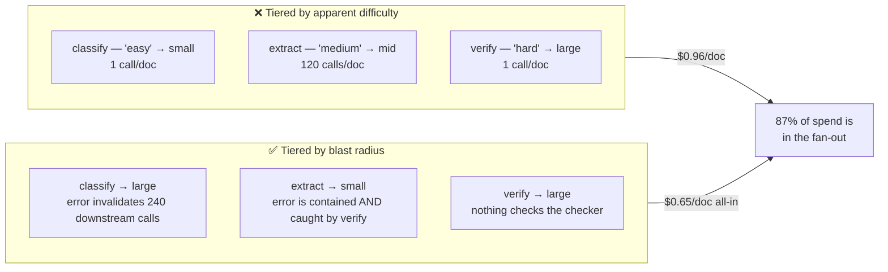

# Ledgerline — Model Tiering Across a Multi-Agent Pipeline

> Which model runs on which node, decided by **blast radius** rather than by apparent difficulty;
> measured in **cost per accepted outcome** rather than cost per call; and attributed **per tenant**
> even when the nodes doing the work are shared platform subgraphs.
>
> The result is not a cost/quality tradeoff. On the worked pipeline, tiering by blast radius is
> **33% cheaper *and* higher quality on the nodes that matter** — because the money and the
> leverage live on different nodes.

---

## The counterintuitive finding, up front

Most teams tier by difficulty: cheap models on the easy steps, expensive models on the hard step.
That gets it backwards at both ends.

Two facts drive it:

1. **The cheapest node is the most dangerous to tier down.** `classify` is one call per document,
   0.4% of pipeline volume — so tiering it down saves nothing — but it selects the extraction
   schema for 240 downstream calls. An error there invalidates the entire document's spend.
2. **The highest-volume node is the safest to tier down.** `extract` is 87% of the bill, but each
   error affects one row, and the verifier catches it. Contained + detected + cheap to redo is
   exactly the profile that tolerates a small model.

Because the leverage and the volume sit on **different nodes**, tiering down where the money is
and tiering up where the leverage is are not in tension. **The tradeoff most teams agonise over
is largely an artefact of tiering by the wrong variable.**

---

## Scope, and how this differs from the sibling design

[`AISystemDesign/SupportAgent/docs/10-cost-governance.md`](../SupportAgent/docs/10-cost-governance.md)
tiers **one** pipeline's nodes and stops there. This design treats tiering as **platform
capability**: a tier registry, a routing layer, an attribution system, and an eval-gated
re-pointing process serving ~200 pipelines across ~30 teams and ~500 tenants.

| This design answers | It does not answer |
|---|---|
| What *is* a tier, such that a pipeline can bind to it without naming a model | How to build the agent pipeline itself |
| Which node gets which tier, and by what rule | Prompt engineering per node |
| What a tier re-point breaks across 200 dependent pipelines | Provider selection or contract negotiation |
| Who pays when a shared subgraph's prompt cache is warmed by another tenant | Model training or fine-tuning economics |

---

## The 90-second mental model

```mermaid
flowchart LR
  subgraph CP["🛡️ Control Plane — GOVERNS"]
    direction TB
    REG["Tier Registry\ncapability contracts, not model names"]
    BIND["Binding Resolver\nper-pipeline pins + fleet default"]
    RUBRIC["Blast-Radius Rubric\ntier floors per node"]
    GATE["Eval Gate\nre-point requires dependents green"]
    ATTR["Attribution Engine\nper-tenant, through shared subgraphs"]
    BUD["Budget & Quota Governor"]
  end

  subgraph DP["⚙️ Data Plane — EXECUTES"]
    direction TB
    ROUTE["Deterministic feature router\n⚙️ no inference"]
    NODES["Pipeline nodes\nclassify · segment · extract · risk · synth · verify · redact"]
    ESC["Escalation ladder\ncheap → expensive on detected failure"]
    SHARED["Shared subgraphs\nretrieval · verify · redact"]
  end

  CP -. resolves tier / caps spend / prices .-> DP
  DP -. emits call records, outcomes, cache facts .-> CP
```

**A tier is a capability contract, not a model name.** Pipelines bind to `mid`, not to a model ID;
the control plane resolves the binding. That indirection is the entire point — and re-pointing it
is a fleet-wide behavioural change, which is why [07](docs/07-eval-gated-repointing.md) exists.

---

## Document map

| # | Doc | Principle(s) | What it answers |
|---|-----|-------------|-----------------|
| 00 | [Overview & the worked pipeline](docs/00-overview.md) | — | Ledgerline's DAG, volumes, the full cost baseline |
| 01 | [A tier is a contract](docs/01-tier-as-contract.md) | 7 | Capability contracts, the registry, pins vs. fleet default, pin expiry |
| 02 | [Blast-radius tiering](docs/02-blast-radius-tiering.md) | 8 | **The core rubric.** Amplification, detectability, reversibility → tier floors |
| 03 | [The routing layer](docs/03-routing-layer.md) | 2,8 | Static floor + deterministic feature routing; why a router *model* is a mistake |
| 04 | [The escalation ladder](docs/04-escalation-ladder.md) | 1,8 | Cheap-first math, dollar vs. latency break-even, the streaming constraint |
| 05 | [Cost per outcome](docs/05-cost-per-outcome.md) | 6,8 | Outcome ledger, trajectory attribution, why intermediate metrics mislead |
| 06 | [Per-tenant attribution](docs/06-tenant-attribution.md) | 7,8 | Shared subgraphs, prompt-cache fairness, the batching you must refuse |
| 07 | [Eval-gated re-pointing](docs/07-eval-gated-repointing.md) | 6,7 | A re-point is a fleet-wide change: dependency graph, canary, deprecation pressure |
| 08 | [Observability](docs/08-observability.md) | 6 | Spans, the attribution queries that matter, tier-drift detection |
| 09 | [Governance & budgets](docs/09-governance-and-budgets.md) | 7,8 | Per-tenant budgets, quotas, chargeback, shedding order |
| 10 | [Failure modes](docs/10-failure-modes.md) | 1,5,8 | The ratchet, tier drift, escalation storms, cache stampedes |
| 11 | [Migration & rollout](docs/11-migration-and-rollout.md) | 7 | From hardcoded model names to a tier registry, across 200 pipelines |
| — | [Design-principle mapping](docs/design-principles.md) | all | Each of the 8 principles → concrete modules |

Executable contracts live in [reference_impl/](reference_impl/) — the tier registry, the
blast-radius rubric scored over the real DAG, the router, and the attribution engine.

---

## Non-negotiable design stances (the tl;dr for a reviewer)

1. **Tier by blast radius, not by difficulty.** The question is never "how hard is this task?" It
   is "how much downstream spend does an error here invalidate, and does anything catch it?"
2. **Never spend an inference call to decide an inference call.** Routing above the tier floor is
   deterministic and feature-based. A router *model* on the hot path is a tax that also introduces
   a new failure mode, and it recurses — the router needs a tier too.
3. **Cheap-first is only valid where failure is detectable.** Without a detector, escalation never
   fires and "cheap-first" is just "be wrong cheaply." Detectability gates both the tier floor and
   the escalation policy.
4. **Cost per accepted outcome is the only metric that decides anything.** Cost per call and
   intermediate quality scores both routinely point the wrong way; [05](docs/05-cost-per-outcome.md)
   shows a case where a 2% F1 drop costs 30% more.
5. **Bind to tiers, pin to versions, expire the pins.** Provider aliases that move underneath you
   are tier drift you did not authorise. Pins that never expire are a 3-year-old model in
   production.
6. **The burden of proof runs downhill.** Tiers ratchet up after incidents and never come back
   down unless keeping a high tier requires evidence. Scheduled downward-pressure review, with
   eval evidence needed to *retain* an expensive tier — not to leave it.
7. **Some cost optimisations must be refused.** Batching several tenants' content into one request
   is cheaper and is a data-isolation violation. It is not on the table at any price.
