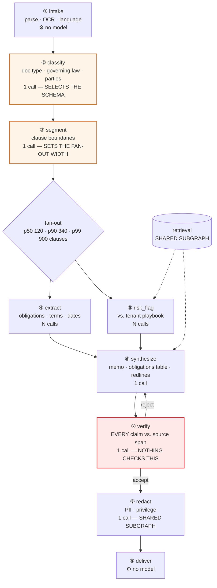
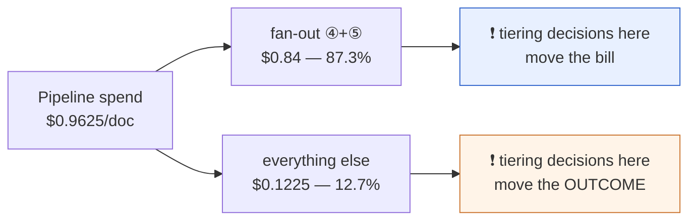

# 00 — Overview & The Worked Pipeline

> You cannot argue about tiering without a DAG and a bill. This doc establishes both, so
> [02](02-blast-radius-tiering.md) becomes arithmetic rather than opinion.
>
> ⚠️ **Rates and token counts here are illustrative.** Every assumption is named so you can
> substitute your own. The *ratios* are the durable finding.

---

## 1. The platform context

| Dimension | Value |
|---|---|
| Pipelines on the platform | ~200 LangGraph deployments, ~30 owning teams |
| Tenants | ~500 enterprise customers, isolated indices |
| Model calls/day, platform-wide | ~40 M |
| Shared subgraphs | `retrieval`, `verify`, `redact` — each bound into 10–40 pipelines |
| Flagship pipeline | **Ledgerline** — contract intelligence, ~90 k documents/day |

Ledgerline alone is **~22 M model calls/day — roughly 55% of the entire platform** — which makes it
both the largest line item on the bill and the natural place to derive the tiering rules the rest of
the platform inherits. That concentration is itself a finding: on most agent platforms a single
fan-out pipeline dominates spend, so **platform-wide tiering policy is usually decided by one
pipeline's DAG whether anyone intends it or not.**

---

## 2. Ledgerline: the DAG

Ingest a commercial contract → extract obligations → flag risk against the tenant's playbook →
draft a memo → **verify every claim against its source span** → redact → deliver.

Three structural facts to hold onto, because the whole design turns on them:

- **② `classify` picks the extraction schema.** Misclassify an MSA as an NDA and all 240 fan-out
  calls run against the wrong schema. One cheap call, 240 calls of consequence.
- **③ `segment` sets the fan-out width.** Over-segment and you pay for 400 calls where 120 would
  do. Under-segment and obligations spanning a boundary are silently lost.
- **⑦ `verify` is the only quality gate, and nothing gates the gate.** A false *reject* costs a
  re-run. A false *accept* ships an unsupported legal claim to a customer.

---

## 3. Tier vocabulary and illustrative rates

A tier is a capability contract ([01](01-tier-as-contract.md)); these are its price points.

| Tier | $/Mtok in | $/Mtok out | Rough role |
|---|--:|--:|---|
| `nano` | 0.10 | 0.40 | Classification with ≤ 5 labels, boilerplate detection |
| `small` | 0.25 | 1.25 | Narrow schema-constrained extraction, single-item judgements |
| `mid` | 1.00 | 5.00 | Multi-document synthesis, general drafting |
| `large` | 3.00 | 15.00 | Schema selection, verification, adversarial reading |
| `frontier` | 10.00 | 40.00 | Reserved — nothing in Ledgerline currently justifies it |

---

## 4. The per-document token profile

| # | Node | Calls/doc (p50) | In/call | Out/call |
|---|---|--:|--:|--:|
| ② | classify | 1 | 4,000 | 300 |
| ③ | segment | 1 | 12,000 | 2,000 |
| ④ | extract | 120 | 1,500 | 400 |
| ⑤ | risk_flag | 120 | 2,000 | 300 |
| ⑥ | synthesize | 1 | 15,000 | 3,000 |
| ⑦ | verify | 1 | 25,000 | 2,000 |
| ⑧ | redact | 1 | 5,000 | 5,000 |

---

## 5. Baseline — "everything on `mid`"

The default that almost every platform actually ships, because `mid` is the safe-looking choice.

| Node | Calls | Cost/call | **Cost/doc** | Share |
|---|--:|--:|--:|--:|
| classify | 1 | $0.0055 | $0.0055 | 0.6% |
| segment | 1 | $0.0220 | $0.0220 | 2.3% |
| **extract** | 120 | $0.0035 | **$0.4200** | **43.6%** |
| **risk_flag** | 120 | $0.0035 | **$0.4200** | **43.6%** |
| synthesize | 1 | $0.0300 | $0.0300 | 3.1% |
| verify | 1 | $0.0350 | $0.0350 | 3.6% |
| redact | 1 | $0.0300 | $0.0300 | 3.1% |
| | | | **$0.9625** | 100% |

**87.3% of the bill is two nodes; 12.7% of the bill contains every decision that can invalidate
the other 87.3%.** That asymmetry is the whole design.

At 90 k docs/day: **$86,625/day → $31.6 M/year.**

---

## 6. What blast-radius tiering does to that bill

Derived in [02](02-blast-radius-tiering.md); shown here so the target is visible from the start.

| Node | Baseline tier | Blast-radius tier | Cost/doc | Δ |
|---|---|---|--:|--:|
| classify | mid | **large** ↑ | $0.0165 | +$0.0110 |
| segment | mid | **large** ↑ | $0.0660 | +$0.0440 |
| extract | mid | **small** ↓ | $0.1050 | −$0.3150 |
| risk_flag | mid | **small** ↓ | $0.1050 | −$0.3150 |
| synthesize | mid | mid — | $0.0300 | — |
| verify | mid | **large** ↑ | $0.1050 | +$0.0700 |
| redact | mid | **large** ↑ | $0.0900 | +$0.0600 |
| | | | **$0.5175** | −$0.4450 |
| *+ escalation: 12% of clauses re-run at `mid`* | | | +$0.1008 | |
| *+ 4% of memos re-synthesised and re-verified* | | | +$0.0054 | |
| | | | **$0.6237** | **−35.2%** |
| *+ the `risk_flag` coverage detector that authorises its tier-down ([02](02-blast-radius-tiering.md) §6)* | | | +$0.0240 | |
| | | | **$0.6477 all-in** | **−32.7%** |

**Four nodes were tiered *up* and the bill fell by a third.** At 90 k docs/day that is
**$10.3 M/year**, while `classify`, `segment`, `verify`, and `redact` — every node whose errors
are amplified or undetected — got a *better* model than the baseline.

Two adjustments in that table are the ones proposals usually omit, and both make the result worse:

> **Escalation cost is inside the number.** A tiering proposal that omits the cost of retrying the
> cheap tier's failures is not a proposal, it is a wish ([04](04-escalation-ladder.md)).
>
> **The enabling detector is inside the number too.** `risk_flag` may only sit at `small` because a
> coverage check exists ([02](02-blast-radius-tiering.md) §6). Counting the saving while excluding
> the control that authorises it is the same error one line up. **$0.6477 all-in, −32.7%** is the
> honest headline; the $0.6237 figure that the rest of these docs cite is the *pipeline* cost at
> p50 width, exclusive of that detector.

### The basis matters: p50 width vs. mean width

Every figure above is computed at **p50 fan-out width (120 clauses)**. Fan-out width is
right-skewed (§8), so the *mean* document costs materially more than the median one:

| Basis | Baseline | Tiered all-in | Reduction |
|---|--:|--:|--:|
| p50 width (120 clauses) | $0.9625 | $0.6477 | −32.7% |
| **Mean width (174 clauses)** | **$1.3405** | **$0.7984** | **−40.4%** |

**A bill is a mean, not a median.** Tiering looks *better* on the mean basis in percentage terms —
because the savings concentrate in the fan-out, which is exactly what the tail inflates — but the
absolute number is what the SLO in §7 must be measured against. See §7 for the honest consequence.

---

## 7. Service objectives

| SLO | Target | Why it constrains tiering |
|---|---|---|
| **Cost per accepted memo, mean-width basis** | ≤ $0.70 | The governing metric — not cost/call ([05](05-cost-per-outcome.md)) |
| **Unsupported-claim rate** (shipped) | ≤ 0.05% | Forces `verify` up regardless of its cost share |
| **Human rejection rate** | ≤ 6% | The check on tiering down `extract`/`risk_flag` too far |
| p95 document latency | ≤ 4 min | Async pipeline — buys room for an escalation retry that a chat turn would not have |
| p99 document latency | ≤ 15 min | The p99 900-clause document is the constraint, not the p50 |
| **Per-tenant bill forecast accuracy** | ±15% monthly | Forces amortised cache pricing ([06](06-tenant-attribution.md)) |
| Tier re-point blast radius | 0 unreviewed dependents | Forces the dependency graph ([07](07-eval-gated-repointing.md)) |

Note the latency SLO's role: **because Ledgerline is asynchronous, cheap-first-then-escalate is
viable here in a way it is not on a streaming chat turn.** That is a property of the workload, not
of the tiering scheme, and it is the first thing to check before importing this design elsewhere
([04](04-escalation-ladder.md) §4).

### The design does not meet its own cost SLO, and says so

| | p50 width | **Mean width** |
|---|--:|--:|
| Baseline all-`mid`, 97% acceptance | $0.9923 | $1.3820 |
| **Blast-radius tiered all-in, 91% acceptance** | **$0.7118** | **$0.8773** |
| SLO | ≤ $0.7000 | ≤ $0.7000 |
| **Gap** | **+1.7%** | **+25.3%** |

**The design misses its own cost SLO on both bases** — narrowly at p50, by a quarter on the mean.
Tiering closes **36.5%** of the distance from the baseline and leaves the rest unmet. Note that the
p50 miss only appears once the two omissions from §6 are put back: at $0.6237 and the baseline's 97%
acceptance it looks like a comfortable pass, and it is neither. This is the honest position, and
stating it is more useful than tuning an assumption until the table agrees:

- **Tiering is one lever, not the lever.** The remaining gap belongs to levers this design
  deliberately excludes (§9): a distilled extractor, prompt-cache hit-rate improvement
  ([06](06-tenant-attribution.md)), and reducing *mean fan-out width* through better segmentation —
  which is worth more than any tier change, because width multiplies the 87.3% of spend that lives
  in the fan-out.
- **The acceptance-rate term is doing real damage.** Tiering down costs 6 points of acceptance
  (97% → 91%), and each point is worth roughly $0.009/memo at this spend level. Recovering
  acceptance is interchangeable with reducing cost, which is precisely why
  [05](05-cost-per-outcome.md) insists the metric is cost *per accepted outcome*.
- **A reviewer should ask why the SLO was set at $0.70.** If it was set from the all-`mid`
  baseline minus a target percentage, it was set from an arbitrary starting point and the gap is an
  artefact. Say which it is before treating the gap as a finding.

---

## 8. The long tail that breaks naive budgeting

Fan-out width is heavily skewed, so per-document cost is too.

| Percentile | Clauses | Fan-out cost @ `mid` | Fan-out cost @ `small` |
|---|--:|--:|--:|
| p50 | 120 | $0.84 | $0.21 |
| **mean** | **174** | **$1.22** | **$0.30** |
| p90 | 340 | $2.38 | $0.60 |
| p99 | 900 | $6.30 | $1.58 |

The **mean of 174 clauses** is a stated assumption, not an observation: it is the mean of a
lognormal fitted to the three percentiles above (median 120, σ ≈ 0.86). It is called out explicitly
because **the mean is not derivable from percentiles alone**, and every cost figure that claims to
be a bill rather than a median depends on it. Substitute your measured mean; the p50-basis figures
elsewhere in these docs do not move, but every §6/§7 mean-basis figure does.

A single p99 document costs **7.5× the p50**. Consequences that recur throughout this design:

- **Mean cost per document is a useless planning number.** Budget on the distribution.
- **One tenant's 900-clause filing is a noisy-neighbour event** — per-tenant fan-out concurrency
  quotas, not just spend caps ([09](09-governance-and-budgets.md)).
- **Tiering down the fan-out compresses the tail**, which is worth more operationally than the
  mean saving suggests: the p99 document drops from $6.30 to $1.58.

---

## 9. Explicit non-goals

- **Fine-tuning or distillation.** A distilled extractor would likely beat `small` here, but that
  is a different project with different lifecycle economics.
- **Provider selection and negotiation.** Tiers are provider-agnostic by construction
  ([01](01-tier-as-contract.md)); which vendor fills a tier is a procurement question.
- **Prompt optimisation.** Assumed already done per node. Tiering and prompting are separable, and
  conflating them is how tier evaluations get contaminated ([07](07-eval-gated-repointing.md)).
- **Latency-first designs.** Ledgerline is asynchronous. A streaming, user-facing pipeline inverts
  several conclusions here — flagged at each point where it does.

Continue to [01 — A tier is a contract](01-tier-as-contract.md).
