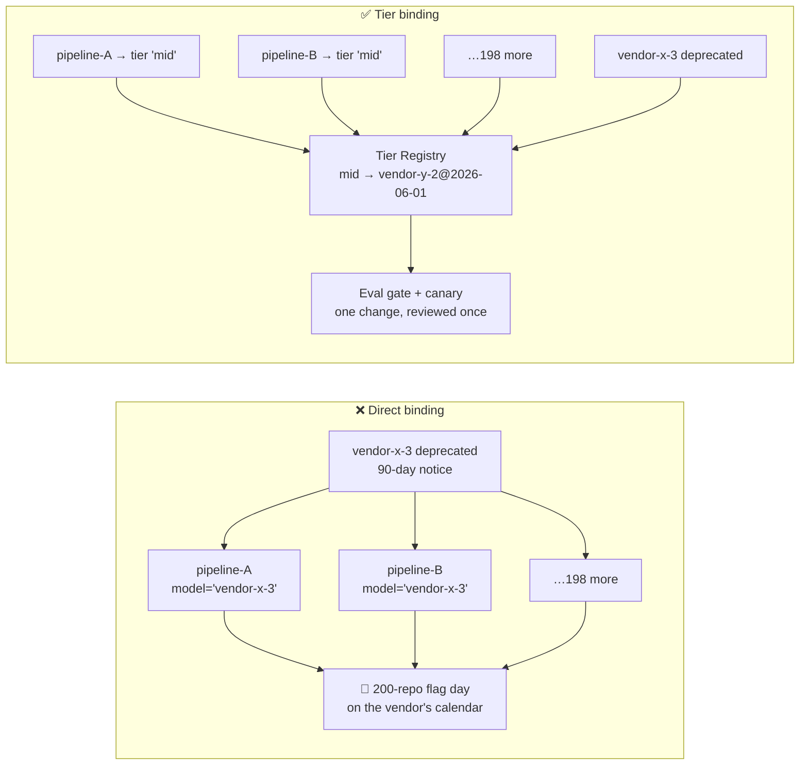
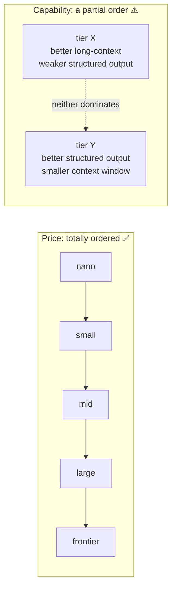
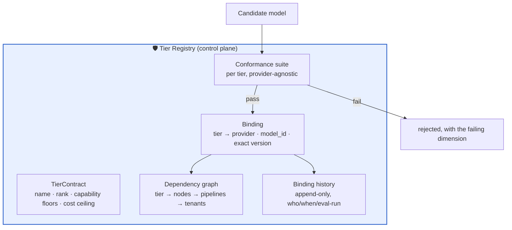
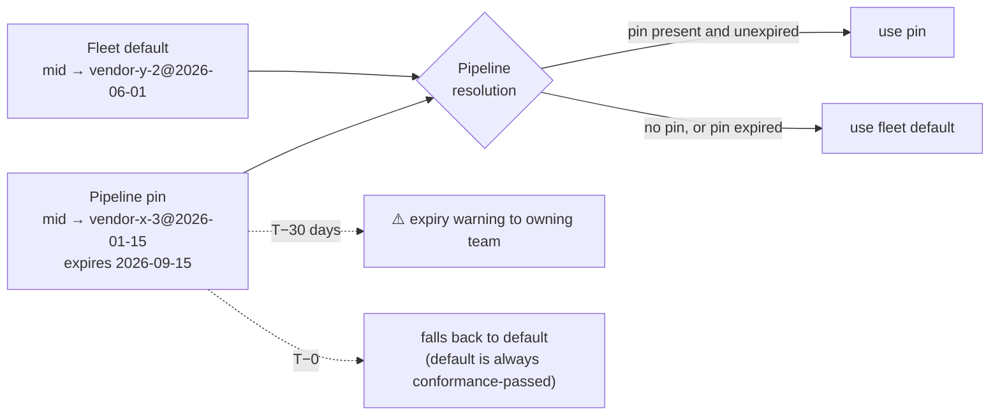

# 01 — A Tier Is a Contract

> **Principle 7.** A tier is a **capability contract** that a node binds to, not a model name a
> node hardcodes. Every property of this design — routing, escalation, re-pointing, attribution —
> depends on that indirection existing.

---

## 1. The problem the indirection solves

Without tiers, a model identifier is a string literal in 200 repositories.



The deprecation still happens. What changes is **who sets the schedule and how many eval suites
have to be green** — which is the subject of [07](07-eval-gated-repointing.md).

**Corollary that is easy to miss:** the indirection is only worth having if it is *actually*
indirect. A codebase where 40 pipelines bind to `mid` and 160 still hardcode identifiers has the
cost of both schemes and the benefit of neither. Migration is therefore a completion problem, not
an adoption problem ([11](11-migration-and-rollout.md)).

---

## 2. What the contract contains

A tier declares **floors on capability and ceilings on price**. It does not name a vendor.

| Contract field | Example (`large`) | Why a node cares |
|---|---|---|
| `context_floor` | 200 k tokens | `verify` reads the memo plus every cited span |
| `structured_output_conformance` | ≥ 99.5% schema-valid | `extract` writes into a typed obligations table |
| `tool_call_conformance` | ≥ 99% well-formed | shared `retrieval` subgraph calls tools |
| `long_prompt_instruction_following` | ≥ 97% on the conformance suite | `redact` must apply 40 rules without dropping one |
| `latency_envelope` | p95 TTFT ≤ 3 s, ≥ 40 tok/s | async pipeline — loose, but not unbounded |
| `language_coverage` | 24 languages at ≥ 95% parity | contracts arrive in the tenant's governing language |
| `cost_ceiling` | ≤ $3.00 / $15.00 per Mtok | the budget model in [00](00-overview.md) assumes it |
| `determinism_profile` | temperature-0 reproducible within tolerance | golden-replay eval depends on it |
| `refusal_profile` | does not refuse adversarial-clause reading | a model that declines to read an indemnity clause is unusable here |

The last row is not padding. **A refusal profile is a capability**, and it is the failure that
most often surprises teams tiering *up*: a more cautious model reads an aggressive limitation-of-
liability clause and declines to summarise it. Higher tier, worse outcome.

---

## 3. Tiers are ordered on price, not on capability

This is the subtlety that breaks naive escalation ladders.



A node does not need "a better model." It needs **its own required capabilities satisfied at the
lowest price**. So resolution is a *satisfies-check*, not an ordinal step:

```python
def resolve(node: NodeSpec, registry: TierRegistry) -> Binding:
    """Cheapest tier that satisfies every requirement AND meets the node's floor."""
    candidates = [t for t in registry.tiers
                  if t.rank >= node.tier_floor          # blast-radius floor (doc 02)
                  and t.satisfies(node.requires)]        # capability vector, not rank
    if not candidates:
        raise NoSatisfyingTier(node, node.requires)
    return min(candidates, key=lambda t: t.expected_cost(node.token_profile))
```

**Two consequences the reference implementation enforces:**

1. **"Escalate to the next tier up" can fail.** If `small` fails a clause because the clause is
   1,200 tokens of nested cross-references and `mid` has a smaller effective structured-output
   conformance, escalation makes it worse. The ladder in [04](04-escalation-ladder.md) escalates
   to the next tier that *satisfies*, which is not always the next tier by rank.
2. **A node with unstated requirements gets silently mis-resolved.** `requires` is mandatory, and
   an empty `requires` is a validation error, not a default.

---

## 4. The registry



### The conformance suite is the load-bearing part

Each tier owns a **provider-agnostic conformance suite** that answers one question: *does this
candidate model satisfy this contract?* It is deliberately **not** any pipeline's eval set.

| | Tier conformance suite | Pipeline eval suite |
|---|---|---|
| Asks | "Does the model meet the contract?" | "Does the pipeline produce good memos?" |
| Owned by | Platform | The pipeline's team |
| Changes when | The contract changes | The pipeline changes |
| Run when | A candidate is proposed | Any pipeline change, plus every re-point |
| Failure means | The candidate cannot fill this tier | This pipeline cannot adopt this binding |

Keeping them separate is what makes a re-point reviewable: conformance failure is a **platform**
decision made once, while eval failure is a **per-pipeline** decision made by the owning team.
Collapse them and every model evaluation becomes a 200-team negotiation.

---

## 5. Pins, defaults, and expiry

If all 200 pipelines resolve `mid` dynamically, a re-point needs 200 eval suites green
simultaneously — which means it never happens. If all 200 pin exact versions forever, you have
re-created direct binding with extra steps.

**Resolution: per-pipeline pins over a moving fleet default, with mandatory pin expiry.**



| Mechanism | Purpose | Failure it prevents |
|---|---|---|
| Fleet default moves on a schedule | Platform can act on deprecations | Vendor's calendar becoming your calendar |
| Pipelines may pin behind it | A team with a failing eval is not blocked | A platform re-point breaking prod |
| **Pins expire (90 days, renewable once)** | Forces the team to fix or justify | A 3-year-old model in production that nobody owns |
| Expiry falls back to *default*, never to nothing | Fail-safe | A pipeline with no resolvable binding at runtime |

**Pin expiry is the single most contested item in this design and the one to defend hardest.** A
pin without an expiry is not a pin, it is a fork; teams pin during an incident and never revisit
it. Renewal requires naming the failing eval, which converts silent debt into a tracked item.

---

## 6. How many tiers?

Five. Each additional tier costs a conformance suite to maintain, a candidate-evaluation budget,
and a decision every node author must now make.

| Tier count | Symptom |
|---|---|
| 2–3 | Nodes are systematically over- or under-provisioned; the fan-out saving in [00](00-overview.md) is unreachable |
| **5** | Each tier maps to a distinguishable capability profile with a ≥ 3× price gap to its neighbour |
| 10+ | Adjacent tiers are within noise of each other; conformance suites cannot distinguish them, so bindings drift on vibes |

**Rule of thumb: adjacent tiers need a ≥ 3× price gap and a conformance dimension that separates
them.** If you cannot state which conformance test distinguishes two tiers, they are one tier.

---

## 7. Anti-patterns

| Anti-pattern | Why it breaks |
|---|---|
| Tiers named after models (`the-vendor-x-tier`) | Leaks the implementation into the abstraction; re-pointing renames your API |
| Binding to a provider alias (`…-latest`) | **The provider re-points your tier without your consent** — tier drift you cannot detect ([10](10-failure-modes.md)) |
| Tier floors chosen by "what feels right" | The floor is derivable — see [02](02-blast-radius-tiering.md) |
| Conformance suite reused as pipeline eval | Every model change becomes a 200-team negotiation |
| Empty `requires` defaulting to permissive | Silent mis-resolution; make it a validation error |
| One tier for the whole platform | Every re-point needs universal consent, so nothing ever moves |
| Pins without expiry | A fork wearing a pin's clothing |

---

## 8. Design-review questions

1. For each tier, which conformance test distinguishes it from the tier below?
2. Which pipelines are pinned behind the fleet default right now, and what is each pin's stated
   reason and expiry?
3. Is any binding an alias rather than an exact version? How would we detect it if it moved?
4. Can a node's `requires` be satisfied by a *lower*-ranked tier? If so, why is the floor higher?
5. When escalation moves "up a tier," is it verified that the target satisfies the node's
   requirements, or is it assumed from the rank?
6. Who owns the fleet default's schedule, and what happens if they are on leave during a
   deprecation window?

Continue to [02 — Blast-radius tiering](02-blast-radius-tiering.md).
