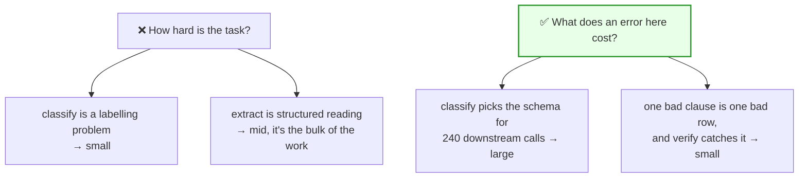
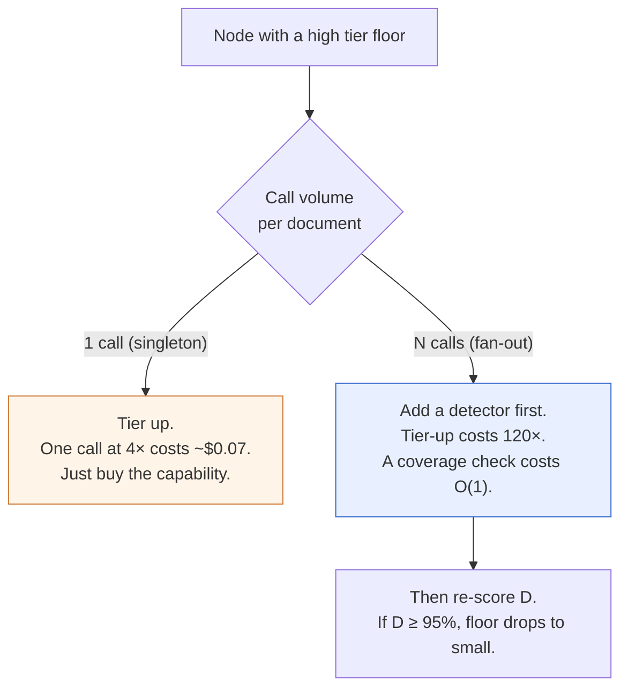
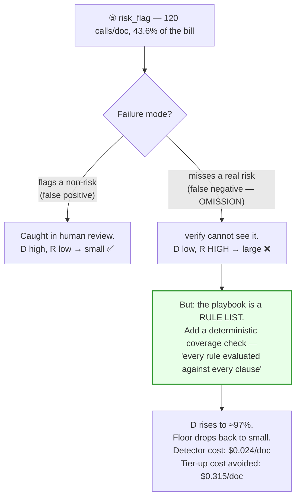
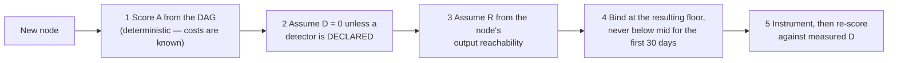

# 02 — Blast-Radius Tiering

> **Principle 8.** The tier floor for a node is not a function of how hard its task looks. It is a
> function of **how much downstream spend an error there invalidates**, **whether anything catches
> it**, and **what it costs if it escapes**.

---

## 1. The wrong question

> ❌ *"How hard is this task? Hard tasks get better models."*

This fails at both ends of a pipeline, and it fails for the same reason: it prices the *task* and
ignores the *position*.



The right question has three parts. A node's floor is the **maximum** of what each part demands —
they are independent reasons, not weights to be averaged.

---

## 2. The three reasons to tier up

### A — Amplification: how much downstream spend does an error invalidate?

```
A  =  (pipeline spend downstream of this node)  ÷  (this node's own cost)
```

| A | Floor demanded | Reading |
|---|---|---|
| < 2× | none | An error costs about what the node costs |
| 2–20× | `mid` | An error wastes real money |
| > 20× | `large` | **An error wastes the document** |

Amplification is a property of *position in the DAG*, and it is highest at the top — which is
precisely where cheap models look safest.

### B — Detectability: will anything catch the error before delivery?

| D (caught before delivery) | R (cost if it escapes) | Floor demanded |
|---|---|---|
| ≥ 95% | anything | none |
| 60–95% | re-run only | `small` |
| 60–95% | reaches the customer | `large` |
| < 60% | re-run only | `mid` |
| < 60% | reaches the customer | `large` |

**The trap in Ledgerline: `verify` checks precision, not recall.** It confirms that every claim in
the memo is supported by a cited span. It cannot confirm that every obligation *in the contract*
made it into the memo. So:

> **Every node whose failure mode is omission is undetected, no matter how good the verifier is.**

That single sentence is why `segment` — which looks like mechanical text processing — carries a
`large` floor. Under-segmentation silently drops obligations that span a boundary, and nothing
downstream notices, because what remains is perfectly well-supported.

### C — Irreversibility: what does escape cost?

| R | Example | Floor demanded |
|---|---|---|
| LOW — re-run the node | a malformed extraction row | none |
| MED — re-run the document | a bad memo caught in review | `mid` |
| HIGH — reaches the customer | a privilege leak, a missing indemnity obligation | `large` |

> **R is not scored independently — it is scored jointly with D, in table B.** R alone cannot
> demand a floor, because an irreversible error that is reliably *caught* is not irreversible in
> practice: it never escapes. Reading this table standalone and taking a three-way
> `max(floor_A, floor_D, floor_R)` double-counts R and over-tiers every terminal node. **The floor
> is `max(floor_A, floor_from_table_B)`** — two terms, not three. Table C exists to define R's
> bands for use *inside* table B.

---

## 3. The reason to tier down

Exactly one profile tolerates aggressive tiering down, and it is the profile of the highest-volume
node in the pipeline:

**contained (A < 2×) + detected (D ≥ 95%) + cheap to redo (R = LOW)**

`extract` has all three. It is also 43.6% of the bill. That coincidence is not luck — it is
structural. **Fan-out nodes are high-volume *because* their work is decomposed into small
independent units, and small independent units are exactly what makes errors contained and
detectable.** Volume and safety come from the same property.

---

## 4. The insight that changes the arithmetic

When a node's detectability is poor, there are two ways to raise the floor's demand:

| Move | Cost shape | Cost on a 120-wide fan-out node |
|---|---|---|
| **Tier up** the node | O(N) × price multiple | 120 calls × 4× price = **+$0.315/doc, forever** |
| **Add a detector** downstream | O(1) engineering, then O(N) at `nano` or free | 120 × $0.0002 = **+$0.024/doc** |

> **Buying detectability is almost always cheaper than buying capability — and the gap scales with
> fan-out width.**

So the rubric has a preferred remedy that depends on the node's volume:



This is the mirror image of the naive approach, and it is why blast-radius tiering is not a
cost/quality tradeoff:

- **Singleton nodes** (`classify`, `segment`, `verify`, `redact`) are 12.7% of the bill. Tiering
  all four up costs $0.185/doc — trivially affordable.
- **Fan-out nodes** (`extract`, `risk_flag`) are 87.3% of the bill. Buying them a detector instead
  of a bigger model saves $0.63/doc.

**Detectability is a design variable, not a measurement.** Treating it as fixed is what forces
teams into the false tradeoff.

---

## 5. Scored over the Ledgerline DAG

Costs are the baseline all-`mid` figures from [00](00-overview.md) §5.

| # | Node | Calls | Node cost | Downstream | **A** | **D** (verify → +review) | **R** | Floor | Binding reason |
|---|---|--:|--:|--:|--:|---|---|---|---|
| ② | classify | 1 | $0.0055 | $0.9570 | **174×** | ~50% → ~55% | HIGH | **large** | amplification *and* detectability |
| ③ | segment | 1 | $0.0220 | $0.9350 | **42.5×** | **< 60% → < 60%** | HIGH | **large** | omission is invisible to *both* checks |
| ④ | extract | 120 | $0.0035 | $0.0008 | 0.23× | 92% → **≥ 99%** | MED | **small** | contained + detected + cheap |
| ⑤ | risk_flag | 120 | $0.0035 | $0.0008 | 0.23× | *contested* → ~97%\* | HIGH | **small\*** | see §6 |
| ⑥ | synthesize | 1 | $0.0300 | $0.0650 | 2.2× | 95% → ~98% | MED | **mid** | modest amplification, well checked |
| ⑦ | verify | 1 | $0.0350 | $0.0300 | 0.86× | **~0% → ~0%** | HIGH | **large** | nothing checks the checker |
| ⑧ | redact | 1 | $0.0300 | $0 | 0× | ~40% → ~40% | HIGH | **large** | terminal + irreversible |

Note how the two columns disagree everywhere it matters. **Amplification argues for `large` at the
top of the DAG; detectability argues for `large` at the bottom. Neither argues for the middle,
which is where all the money is.** That is the shape of the result, and it generalises to any
pipeline with a fan-out and a terminal quality gate.

### Human review is a detector — for some failure modes and not others

The `D` column has two values because **`verify` is not the last check: a lawyer reads the memo.**
Whether that counts toward D is the single most consequential judgement in this table, and it is
*failure-mode-specific*:

| Failure mode | Does human review catch it? | Why |
|---|---|---|
| A wrong obligation *value* (④ extract) | **Yes** — reads as wrong against the cited span | The reviewer has the citation in front of them |
| A spurious risk flag (⑤ false positive) | **Yes** | Obviously wrong on inspection |
| A **missing** obligation (③ segment) | **No** | You cannot notice an absence without re-reading the source contract |
| A missing risk flag (⑤ false negative) | **No** | Same — absence is invisible |
| An unredacted privilege passage (⑧) | **Mostly no** | Subtle by nature, and review focuses on the memo, not the redaction diff |
| A wrong `verify` verdict (⑦) | **No** | The reviewer trusts the gate, which is what a gate is for |

**This table is why `extract` is `small` and `segment` is `large` despite near-identical A and R.**
Both fail in ways a customer would care about; only one of them fails *visibly*. Errors of
commission are reviewable; errors of omission are not — and the human-rejection-rate SLO
(≤ 6%, [00](00-overview.md) §7) is the measurement that keeps this claim honest rather than
convenient.

> **Do not claim review as a detector without the mode-by-mode breakdown.** "A human checks it" is
> the most commonly abused justification for tiering down, and in this pipeline it is valid for
> exactly two of the six failure modes.

This reproduces the tier assignment in [00](00-overview.md) §6: **$0.9625 → $0.6237 per document at
p50 width, or $0.6477 all-in once `risk_flag`'s enabling detector is counted — −32.7%, with four
nodes upgraded.**

---

## 6. The contested node — `risk_flag`

`extract` is a clean call. `verify` is a clean call. `risk_flag` is where a reviewer should push,
and where the rubric produces a *decision* rather than an answer.



**The decision:** `small` **conditional on shipping the coverage check first.** Price both sides —
the asymmetry is larger than it looks, because the floor lands on a 120-wide node:

| | `risk_flag` node cost | Pipeline cost/doc |
|---|--:|--:|
| With the coverage check → `small` | $0.1050 | **$0.6237** |
| Without it → honest floor is `large` | $1.2600 | **$1.7283** |
| Delta | **+$1.1550** | **+$1.1046** |

**A $0.0240/doc detector is what stands between this pipeline and $1.73/doc.** At 90 k docs/day the
node-level delta is **$37.9 M/year** — larger than the entire $31.6 M all-`mid` baseline it was
supposed to improve on. One line of a detector manifest.

(Note the pipeline delta is slightly *smaller* than the node delta: at `large` there is no rung
above it, so `risk_flag`'s $0.0504 escalation line disappears. A tier-up quietly refunds its own
escalation budget — worth remembering when pricing one, because it flatters the comparison.)

Two things a reviewer should hold the design to:

1. **The conditional must be enforced, not documented.** The reference implementation makes the
   tier floor a function of the declared detectors, so removing the coverage check
   *mechanically* raises the floor rather than leaving a stale comment behind.
2. **The coverage check verifies process, not judgement.** It proves every rule was evaluated. It
   cannot prove the evaluation was right. That residual is real, and it is why the human rejection
   rate SLO (≤ 6%) exists as an independent signal ([05](05-cost-per-outcome.md)).

---

## 7. Amplification runs both ways

The rubric measures the blast radius of an *error*. The same arithmetic governs the blast radius
of a *decision*.

| Change | Calls affected/day | Cost delta |
|---|--:|--:|
| `verify` mid → large | 90 k | +$6.3 k/day |
| `extract` small → mid | 10.8 M | **+$28.4 k/day** |

**A one-line tier change on a fan-out node is a $10.3 M/year decision.** Change control must
therefore be asymmetric:

| Node class | Tier change requires |
|---|---|
| Singleton (1 call/doc) | Owning team review + pipeline eval green |
| **Fan-out (N calls/doc)** | **Owning team + platform review + cost forecast + canary at 1% + explicit budget sign-off** |

This is the same principle as the rubric itself, applied to the change process: gate on blast
radius, not on the apparent size of the diff. A one-character diff can be the largest change in
the quarter.

---

## 8. Honest limitations

1. **The bands are ordinal, not cardinal.** `A = 174×` and `A = 42×` land in the same band and
   demand the same floor. The rubric is a *communication and triage* device; do not compute a
   continuous "risk score" and pretend it is measured.
2. **D is estimated before it can be measured, which is circular.** You need production data to
   estimate detectability, and a tier binding to get production data. Resolution: the cold-start
   policy in §9 — start at `mid` everywhere, instrument, then move. The rubric's real first job is
   telling you **which nodes to measure first**, not what to set them to.
3. **R is unbounded and therefore not really a number.** "Privilege leak reaches the customer" has
   no dollar value that survives contact with legal. Treat HIGH as a veto, not a magnitude.
4. **The rubric says nothing about latency.** Ledgerline is asynchronous. A streaming pipeline
   cannot escalate after the first token, which changes the detectability calculus entirely
   ([04](04-escalation-ladder.md) §4).
5. **It assumes the DAG is stable.** A pipeline whose topology changes monthly will have stale
   floors. Re-score on any topology change — the reference implementation recomputes floors from
   the DAG rather than storing them.

---

## 9. Cold-start policy

For a node with no production data:



**Assume `D = 0` until a detector is declared.** This is deliberately pessimistic and produces
expensive first bindings — which is correct, because the alternative failure (a cheap binding on
an undetectable node) is the one that ships bad output silently. Cost is recoverable; a shipped
unsupported claim is not.

---

## 10. Design-review questions

1. For each node, what is A, and was it computed from the DAG or guessed?
2. For each node with a low D: have we priced *adding a detector* against *tiering up*? On any
   fan-out node, why is tiering up the answer?
3. Which nodes fail by **omission**? What catches those, given that the verifier checks precision?
4. Is any node's floor conditional on a detector that exists only in a document?
5. What is the daily cost delta of a one-tier change on each fan-out node, and who signs it off?
6. When did we last re-score the floors, and has the DAG changed since?

Continue to [03 — The routing layer](03-routing-layer.md).
