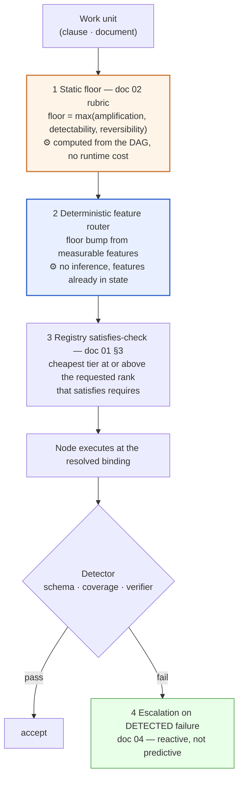
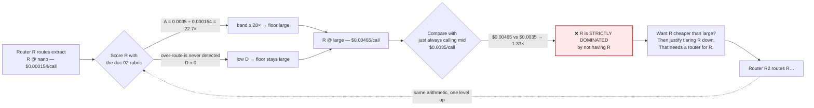
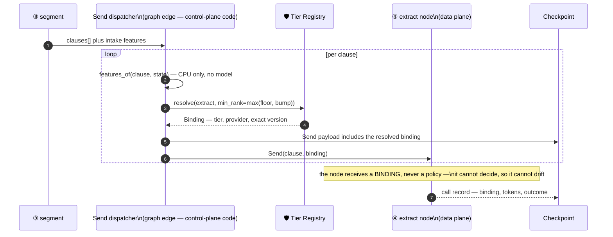
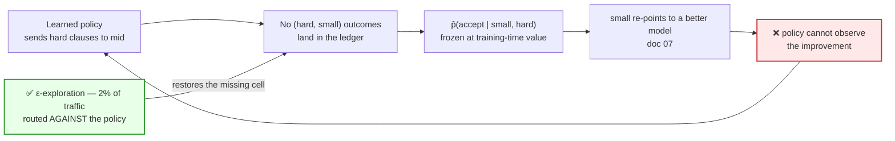

# 03 — The Routing Layer

> **Principles 2 and 8.** [02](02-blast-radius-tiering.md) sets a *floor* per node. This doc is
> about deciding, per input, where to sit above that floor — and the one rule that governs the whole
> layer: **never spend an inference call to decide an inference call.**

---

## 1. Four ways to decide a tier at runtime

| | Mechanism | Runtime cost | Adapts to the input | Auditable / replayable | New failure mode | Verdict |
|---|---|---|---|---|---|---|
| **a** | **Static annotation** — the node declares its tier | **$0** | ❌ never | ✅ it is in the code | none | **Use for the floor. Always.** |
| **b** | **Deterministic feature routing** — thresholds on measured input features | **$0** (µs of CPU) | ✅ on cheap features | ✅ features are in state, so the decision replays | a config bug — bounded, unit-testable | **Use above the floor. Recommended.** |
| **c** | **Router model** — an LLM reads the input and names a tier | **1 inference call** | ✅ on anything | ⚠️ prompt + sampling + binding | ✅ a new node with A ≈ 23× and D ≈ 0 | ❌ **Reject on the hot path.** §3 |
| **d** | **Learned router** — small classifier over the same features | ~1 ms CPU | ✅ on measured features | ⚠️ model version + feature snapshot | distribution shift, **feedback loop** | ⏳ Endgame. Needs [05](05-cost-per-outcome.md). §8 |

Note that (b) and (d) route on the **same features**. The difference is who sets the thresholds — a
human reading the ledger, or a fit. That is a much smaller step than (b) → (c), which changes the
*cost class* of the decision from free to metered.

### The recommendation: three layers, in this order



Each layer exists because the one before it cannot do its job:

| Layer | Answers | Fails at |
|---|---|---|
| Static floor | "how bad is an error *here*, regardless of input?" | a 4,000-token clause and a 40-token clause get the same tier |
| Feature router | "is *this* input harder than the node's typical input?" | features that predict difficulty do not enumerate every hard input |
| Escalation | "was the cheap attempt actually wrong?" | it is the only layer that observes ground truth — and it costs a second call |

**The ordering is not arbitrary: it is monotone in information and monotone in cost.** The floor
knows nothing about the input and costs nothing. The features know something and cost nothing. The
outcome knows everything and costs a full call. Spend in that order.

---

## 2. Why a router *model* is the wrong answer on the hot path

Three independent arguments. Any one of them is disqualifying.

### Argument 1 — it costs an inference call to save one

Price a router that reads `extract`'s 1,500-token clause and emits a 10-token tier label, against
the `extract` call it is routing. Rates from [00](00-overview.md) §3.

| Router tier | Router $/call | `extract` @ `small` | Router as % of the call it routes | Router cost/doc (120 clauses) | % of the $0.315 saving it protects |
|---|--:|--:|--:|--:|--:|
| Deterministic (b) | **$0** | $0.000875 | **0%** | **$0** | 0% |
| `nano` | $0.000154 | $0.000875 | 18% | $0.0185 | 5.9% |
| `small` | $0.000388 | $0.000875 | 44% | $0.0465 | 14.8% |
| `mid` | $0.001550 | $0.000875 | **177%** | $0.186 | **59%** |
| `large` | $0.004650 | $0.000875 | 531% | $0.558 | 177% |

**On a `small`-tier node, a `mid` router costs 1.77× the call it is routing** — and $0.186/doc is
more than the entire tiered `extract` node ($0.105/doc). A `large` router costs $0.558/doc, more
than `extract` cost in the all-`mid` baseline. Only `nano` looks survivable, and a `nano` router is
being asked to make a judgement the rubric would never let a `nano` node make.

> The router's cost scales with **N, the fan-out width** — exactly like the spend it is trying to
> optimise. It is a fixed percentage tax on the saving, forever.

### Argument 2 — it is a new node, so it has its own blast radius

A router is not infrastructure. It is a model call on the hot path, and [02](02-blast-radius-tiering.md)'s
rubric applies to it.

- **Amplification.** A `nano` router costing $0.000154 decides a call worth up to $0.0035.
  `A = 0.0035 / 0.000154 =` **22.7×** → the `> 20×` band → floor **`large`**.
- **Detectability.** The router has two failure modes with wildly different detectability.
  *Under-routing* (chose `small` for a hard clause) is caught — but the verifier attributes the
  failure to `extract`, not to the router, so you pay for it and learn nothing.
  *Over-routing* (chose `mid` for an easy clause) is caught **0% of the time**. Nothing anywhere in
  the system flags "you paid 4× more than necessary." → `D ≈ 0` on the cost-side failure.
- **Correlation.** This is the one that actually kills it. [02](02-blast-radius-tiering.md) §3 put
  `extract` on `small` *because* its errors are independent and contained. A shared router makes
  all 120 clause decisions from one prompt and one binding, so a router prompt regression re-tiers
  the whole fan-out at once. **The router converts 120 independent decisions into one correlated
  decision, destroying the containment property that justified the cheap tier in the first place.**

### Argument 3 — it recurses



The regress terminates in exactly one place. A node whose cost is **$0** has undefined
amplification — there is no ratio, so the rubric demands nothing, and nothing needs to route it.

> **The router recursion has a single fixed point, and it is a deterministic router.** That is not
> a preference; it is the only assignment that is stable under the rubric that motivated routing.

---

## 3. The features that actually predict difficulty

Every feature below is a property of state that **already exists before the call**, and none of
them costs an inference call.

| Feature | How it is measured | Source | Cost | Routes |
|---|---|---|---|---|
| Clause token length | tokenizer over the span | ③ `segment` output | CPU, µs | ④ ⑤ |
| Cross-reference count | regex over the clause: `Section \d+`, `Exhibit [A-Z]`, `as defined in` | clause text | CPU | ④ |
| Nesting depth | max depth of enumerated markers `(a)(i)(A)` in the clause outline | ③ `segment` output | CPU | ④ |
| Language | already detected during parse | ① `intake` | **free — in state** | ② ③ ④ ⑤ |
| OCR confidence, min over span | per-token confidence from the OCR engine | ① `intake` | **free — in state** | ③ ④ |
| Scanned vs. native PDF | presence of a text layer | ① `intake` | **free — in state** | ③ |
| Page count | parser | ① `intake` | **free — in state** | ③ ⑥ |
| Doc type **and classifier margin** | the label, plus the top-2 confidence gap | ② `classify` @ `large` | **already paid for** | ③ ④ ⑤ |
| Tenant playbook rule count | `len(playbook.rules)` | control-plane config | config read | ⑤ |
| Historical failure rate for this clause type | `escalation_rate[(doc_type, clause_type)]` | [05](05-cost-per-outcome.md) ledger, cached | one k/v read | ④ ⑤ |

Three things in that table are worth more than the rest of it:

1. **The best router in the pipeline is a node you already tiered up.** ② `classify` runs at
   `large` for blast-radius reasons ([02](02-blast-radius-tiering.md) §5) and you pay for it
   regardless. Its label *and its top-2 margin* are a strong, calibrated difficulty signal that is
   already sitting in state. A router model would be spending money to reproduce a signal you own.
   **A low classifier margin is the single most useful "this document is unusual" feature available,
   and it is free.**
2. **OCR confidence is doing two different jobs.** It is a difficulty proxy *and* a hard constraint:
   schema-valid extraction from garbage input is still garbage, so a low-confidence span can fail
   `small`'s `structured_output_conformance` requirement outright. See §5.
3. **Exactly one feature closes a loop with the ledger**, and it is therefore the only one that can
   go stale silently. `escalation_rate[(doc_type, clause_type)]` needs a TTL, a re-derivation
   schedule, and a named owner, or it becomes a frozen snapshot of last quarter's model.

Features that look tempting and are not allowed: anything a model has to produce (a "clause
complexity score" is a router model wearing a feature's clothes), and `tenant_id` as a difficulty
proxy — it correlates, and it makes a tenant's bill depend on the platform's guess about them, which
[06](06-tenant-attribution.md) will not accept.

---

## 4. Pre-emptive escalation, and the precision bar it has to clear

A clause that is going to fail `small` should skip the doomed cheap attempt and go straight to
`mid`. Call this **pre-emptive escalation**. It is usually described as strictly better than
reactive escalation because it avoids paying twice. Derive the condition and that turns out to be
conditional.

For a clause matching a pre-emption predicate, with `q = P(fails small | predicate matched)`:

```
pre-emptive cost  =  C_e
reactive cost     =  C_c + q · C_e
pre-emption wins  ⟺  C_e  <  C_c + q · C_e   ⟺   q  >  1 − C_c/C_e
```

With `small` at $0.000875 and `mid` at $0.0035 — exactly a **4× gap** —

> **`q` must exceed 75%** before pre-emption is cheaper than letting the clause try and fail.

And the direction of that bar is counterintuitive: **the wider the price gap, the *higher* the
precision bar.** A cheap tier at 1/4 the price wastes very little when the flyer fails, so a
75%-precise predicate is enough to justify skipping it; on a `small` → `large` ladder (12×) the
wasted flyer is proportionally even cheaper and the bar **rises to 92%**. A very cheap cheap-tier is
an argument for *taking* the flyer, not for pre-empting it — the opposite of the usual intuition
that a big price gap makes it more urgent to route correctly.

| Pre-emption predicate | Match rate | `q` | Pre-empt? | Reason |
|---|--:|--:|---|---|
| Clause exceeds `small`'s usable context | 0.3% | **1.00** | ✅ | **hard constraint** — the cheap call cannot succeed |
| Language outside `small`'s `language_coverage` | 1.2% | **1.00** | ✅ | **hard constraint** ([01](01-tier-as-contract.md) §2) |
| min OCR confidence ≤ 0.70 | 0.9% | 0.86 | ✅ | above the 75% bar |
| Cross-references ≥ 5 | 2.1% | 0.79 | ✅ | above the 75% bar |
| Nesting depth ≥ 4 | 3.4% | 0.61 | ⚠️ | below the bar on dollars — latency only |
| Clause tokens ≥ 900 | 9.0% | 0.34 | ❌ | **let it try.** 66% of these pass `small` |

*(`q` values are illustrative, per [00](00-overview.md)'s standing disclaimer, and are the
quantities the ledger in [05](05-cost-per-outcome.md) exists to measure.)*

Worked, on the `cross-refs ≥ 5` predicate — 2.1% of 120 clauses ≈ 2.52 clauses/doc:

| | Arithmetic | Cost/doc |
|---|---|--:|
| Reactive | `2.52 × ($0.000875 + 0.79 × $0.0035)` | $0.009173 |
| Pre-emptive | `2.52 × $0.0035` | $0.008820 |
| | | **−$0.000353** |

Thirty-five hundredths of a cent. The honest conclusion:

> **Pre-emptive escalation is a latency optimisation that happens to be roughly cost-neutral — not
> a cost optimisation.** Its real value is removing clauses from the two-call critical path, which
> matters because fan-out latency is a *max* over branches ([04](04-escalation-ladder.md) §2). The
> exception is the `q = 1` hard constraints, where it is unambiguously both.

A design that presents pre-emptive routing as a cost lever will be measured on cost, miss, and get
ripped out — taking the latency benefit with it.

---

## 5. Routing is partly a hard constraint, not a preference

[01](01-tier-as-contract.md) §3 resolves a node to the cheapest tier that satisfies `requires`.
Feature routing composes with that rule rather than overriding it, and the composition has one
direction that must be impossible.

```python
def resolve_tier(node: NodeSpec, feats: Features, reg: TierRegistry) -> Binding:
    floor = node.tier_floor                       # doc 02 — recomputed from the DAG, never stored
    bump  = feature_policy(node, feats)           # table-driven, deterministic, returns a RANK
    want  = max(floor, bump)                      # a bump can only ever raise
    assert want >= floor, "feature policy may not route below the blast-radius floor"
    return reg.resolve(node, min_rank=want)       # satisfies-check — may return HIGHER, never lower
```

Three properties this pins down:

1. **`feature_policy` returns a floor bump, never a tier.** Only the registry names tiers. If the
   policy could name a tier it could name one below the floor, silently defeating
   [02](02-blast-radius-tiering.md) with a config change and no code review. That assertion is the
   most important line in the routing layer.
2. **The registry can overrule the router upward.** A 5,000-token clause may fail `small`'s
   `context_floor` outright. The router asked for `small`; the satisfies-check returns `mid`. The
   router's request is a *lower bound on a preference*, not a decision.
3. **`NoSatisfyingTier` is a real outcome and needs a route.** A clause in an unsupported language
   at a size no tier's context admits has no binding. It must fail to the review queue as a
   first-class outcome, not be silently coerced into the nearest tier.

**Consequence for the ladder:** because resolution is a satisfies-check over a partial order,
"route up one rank" and "route to the next satisfying tier" are different operations, and only the
second is correct — see [04](04-escalation-ladder.md) §5.

---

## 6. Where the router lives

The routing decision is **resolved in the control plane and materialised into the node's runtime
config**. The data plane does no thinking.



```python
def fan_out(state) -> list[Send]:
    """Resolution happens on the EDGE, at dispatch time — not inside the node."""
    return [
        Send("extract", {
            "clause":  c,
            "binding": resolve_tier(EXTRACT, features_of(c, state), REGISTRY),
        })
        for c in state["clauses"]
    ]
```

Two design points that are easy to get wrong:

- **There are two resolution times, not one.** Singleton nodes (`classify`, `segment`, `verify`,
  `redact`) resolve at **graph-build time** — their features come from ① `intake` and are known
  before the run starts. Fan-out nodes resolve at **`Send`-dispatch time**, because per-clause
  features do not exist until ③ `segment` has run. A design with only one resolution point either
  cannot route the fan-out or re-resolves singletons pointlessly on every call.
- **The binding travels in the `Send` payload, so it lands in the checkpoint.** That is not
  incidental bookkeeping — it is what makes the routing decision *durable and replayable*, and
  therefore what makes [05](05-cost-per-outcome.md)'s counterfactual question ("what would this
  document have cost, and scored, at the other tier?") answerable at all. **If the node resolves
  its own tier, the decision exists only in a log line, and the counterfactual is unrecoverable.**

The same property is what lets [09](09-governance-and-budgets.md)'s budget governor forecast a
document's cost *before* the fan-out executes: all 120 bindings are known at dispatch.

---

## 7. The learned-router endgame

A learned router (mechanism **d**) is the right long-term answer and cannot be built yet.

### What blocks it

You cannot train it until [05](05-cost-per-outcome.md)'s outcome ledger exists, because the training
row is `(features, tier, verified outcome, cost)` and three of those four fields are exactly what
the ledger is for.

### What the target is — and what it is not

Not "difficulty." Difficulty is unobservable and unactionable. The target is **predicted
verification outcome per tier**:

```python
# p_hat[t] = P(verifier accepts | tier=t, features=x)   — one head per tier
def choose(x, tiers, p_hat, C, C_escalate):
    return min(tiers, key=lambda t: C[t] + (1 - p_hat(t, x)) * C_escalate[t])
```

The decision is a cost-weighted expected-cost minimisation, not a classification. That has an
immediate and uncomfortable consequence: **the label matrix is counterfactual.** To learn
`p̂(accept | small, x)` for hard `x`, you need outcomes from `small` on hard inputs — inputs the
current policy deliberately routes away from `small`.

### The feedback loop, and why it is a ratchet



> **A learned router with no exploration budget freezes your tiering at the capability frontier of
> the day it was trained.** It is the same ratchet as README stance 6 and
> [10](10-failure-modes.md)'s tier drift, arriving through a model artifact instead of an incident
> review — and it is worse, because a ratchet in a policy file has no changelog.

### Pricing the fix

Route **2% of fan-out traffic against the policy** and log it as exploration. Worst case, that
forces 2% of clauses from `small` to `mid` on both fan-out nodes:

```
0.02 × 120 clauses × 2 nodes × ($0.0035 − $0.000875)  =  $0.0126 / doc      (2.0% of $0.6237)
```

At 90 k docs/day: **$1,134/day buys 432,000 counterfactual labels/day.** That is the cheapest line
item in this design and the one most likely to be cut in a cost review, so name it as a *data
acquisition* cost, not an efficiency loss.

Two implementation details that are not optional:

- **Randomise on a stable hash of the work unit**, not per call. If a retry re-randomises, the
  exploration arm is not reproducible and the label is unattributable.
- **Exploration must not be charged to the tenant.** A tenant should not pay for the platform's
  learning. That is a [06](06-tenant-attribution.md) attribution rule, and it is the reason the
  exploration flag has to be on the call record rather than inferred later.

---

## 8. Anti-patterns

| Anti-pattern | Why it breaks |
|---|---|
| A router model on the hot path | §2 — costs a call to save a call, adds a correlated failure mode, and recurses |
| `feature_policy` allowed to return a tier rather than a floor bump | It can route *below* the blast-radius floor, defeating [02](02-blast-radius-tiering.md) via config |
| The node resolves its own tier | Decision is invisible to the budget forecaster, absent from the checkpoint, and the counterfactual in [05](05-cost-per-outcome.md) is unrecoverable |
| Routing on a feature a model must produce ("complexity score") | A router model in disguise, with all of §2's problems and none of its honesty |
| Routing on `tenant_id` as a difficulty proxy | A tenant's bill becomes a function of the platform's guess about them ([06](06-tenant-attribution.md)) |
| Pre-emption predicates with `q` below `1 − C_c/C_e` | Pays the expensive tier for clauses that would have passed cheaply — §4 |
| Self-reported confidence thresholds, never recalibrated | Confidence is not comparable across bindings — a re-point silently moves your routing ([07](07-eval-gated-repointing.md)) |
| Thresholds as magic numbers with no owner | The 900-token cut-off is a measurement with a half-life, not a constant |
| Learned router with no ε-exploration | §7 — a ratchet with no changelog |
| `NoSatisfyingTier` handled by coercing to the nearest tier | Converts a routed failure into a silent quality regression |

---

## 9. Design-review questions

1. For every routing decision in the pipeline, what does it cost to *make*? If the answer is not
   $0, why is that call cheaper than the call it is avoiding?
2. Can any routing input cause a node to run **below** its blast-radius floor? Show the assertion
   that makes it impossible, not the convention that discourages it.
3. Which features are read from state versus computed, and which of them is a model output you are
   already paying for? (If ② `classify`'s margin is not being used, why not?)
4. For each pre-emption predicate, what is the measured `q`, and does it clear `1 − C_c/C_e`?
5. Where is the binding resolved, and is it in the checkpoint? Can you answer "what tier did clause
   47 of document X run at, and what would the other tier have cost?" from stored data alone?
6. If a `requires` check fails at every tier, what happens to that work unit — and has anyone seen
   that path fire in production?
7. If a learned router is proposed: where do the counterfactual labels come from, what is the
   exploration budget in dollars, and who pays for it?

Continue to [04 — The escalation ladder](04-escalation-ladder.md).
