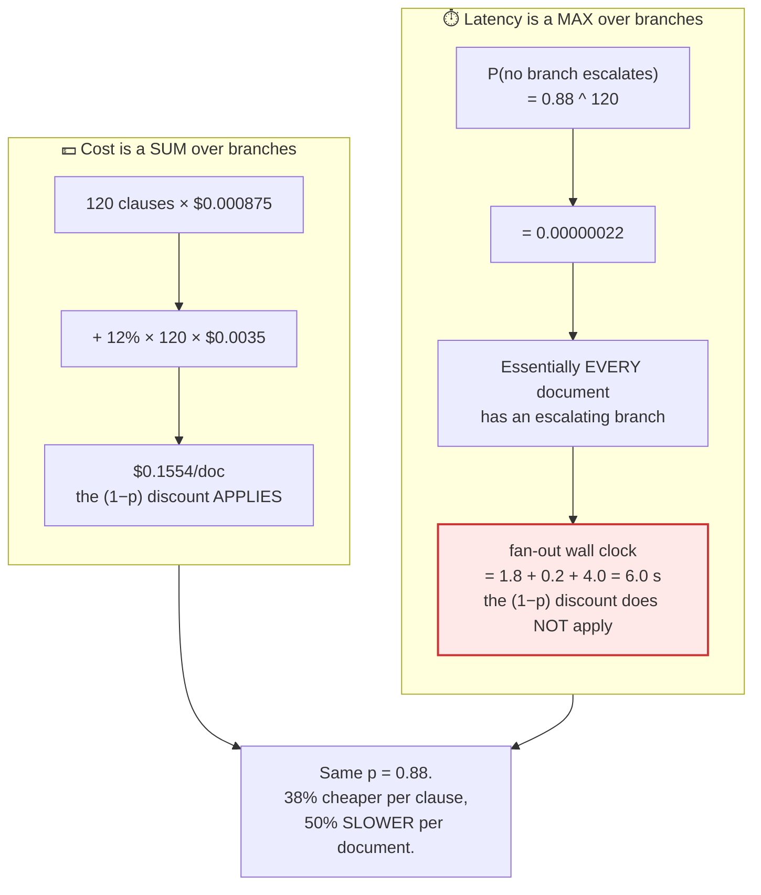
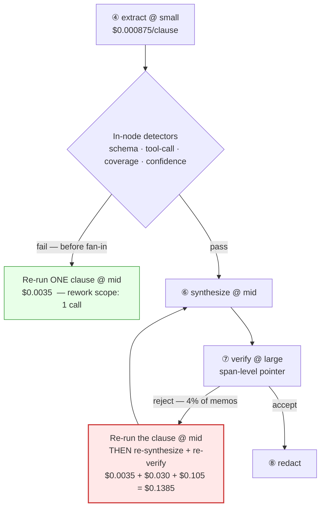
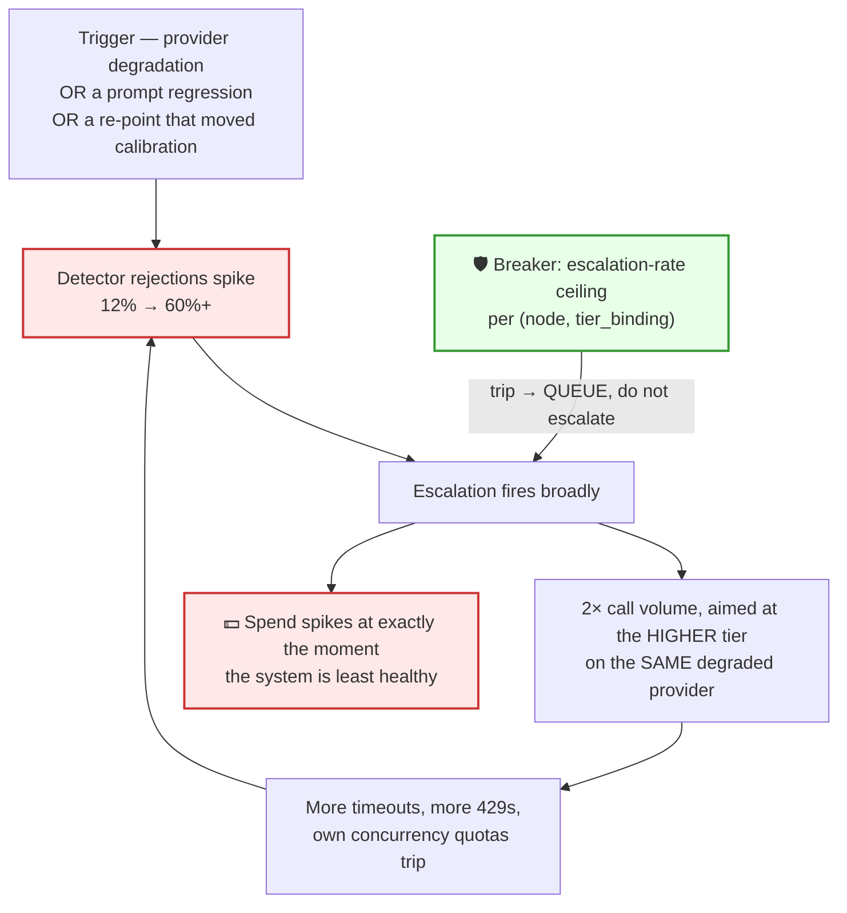
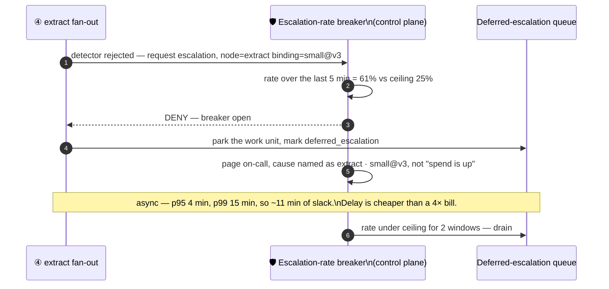

# 04 — The Escalation Ladder

> **Principles 1 and 8.** Cheap-first-then-escalate is the mechanism that lets
> [02](02-blast-radius-tiering.md) put `small` on 87% of the bill. It is valid only where failure is
> **detectable** — and the constraint that actually binds it is **latency, not dollars.**

---

## 1. The dollar break-even, and why it is the wrong thing to look at

Let `C_c` and `C_e` be the cheap and expensive tier's cost for the same call, and `p` the cheap
tier's first-pass success rate.

```
always-expensive :  C_e
cheap-first      :  C_c + (1 − p) · C_e
cheap-first wins ⟺  C_c + (1 − p) · C_e  <  C_e   ⟺   p  >  C_c / C_e
```

For Ledgerline's fan-out, `small` and `mid` price identically on both nodes — `extract` at
1,500/400 tokens and `risk_flag` at 2,000/300 tokens both come to **$0.000875 at `small` and
$0.0035 at `mid`** ([00](00-overview.md) §3–4). That is exactly a **4×** gap, so:

> **`p > 25%`.** Any configuration a sane team would ship clears that by a mile. Measured `p` on
> `extract` is **0.88**.

Priced on `extract`'s 1,500-in / 400-out profile:

| Tier pair | Effective gap | Break-even on `p` | Rate-card gap, in / out |
|---|--:|--:|---|
| `small` → `mid` | 4.0× | **25.0%** | 4× / 4× — uniform |
| `small` → `large` | 12.0× | 8.3% | 12× / 12× — uniform |
| `mid` → `large` | 3.0× | 33.3% | 3× / 3× — uniform |
| `nano` → `small` | **2.8×** | **35.4%** | 2.5× / 3.125× — **not uniform** |

Every gap breaks even at or under ~35%, because [01](01-tier-as-contract.md) §6 *requires* a ≥ 3×
price gap between adjacent tiers. **The tier ladder's own design guarantees the dollar test is easy
to pass.** The last row is worth stealing: the ≥ 3× rule is stated on the *rate card*, but the gap a
node experiences is a **token-mix-weighted blend of the input and output ratios** — so on
`extract`'s input-heavy profile `nano` → `small` is 2.8×, below the registry's own floor. **Check
the effective gap per node, not the rate card.**

> **This is why teams adopt cheap-first, and it is why they then get burned by something else.** The
> dollar break-even is the only one that is trivially satisfiable, so it is the only one that gets
> computed. Sections 2, 3 and 4 are the three that bind.

---

## 2. The latency break-even, and the max-versus-sum inversion

Cheap-first latency per call is `t_c + t_d + (1 − p) · t_e`. Using illustrative per-call figures for
`extract` — `small` 1.8 s, detector 0.2 s, `mid` 4.0 s:

```
per clause:  1.8 + 0.2 + 0.12 × 4.0  =  2.48 s        vs. always-mid 4.0 s   →  38% FASTER
```

Cheap-first looks like a latency *win*. It is not, and the reason is the shape of a fan-out.



> **On a fan-out node the `(1 − p)` discount applies to cost and not to latency, because cost sums
> over branches and latency maxes over them.** At `p = 0.88` per clause, the per-*document*
> probability of avoiding escalation is `0.88¹²⁰ ≈ 2.2 × 10⁻⁷`. Escalation is not a tail event at
> the document level. **It is a certainty.**

For escalation to be genuinely tail-only at document scope you would need
`p^120 ≥ 0.95`, i.e. **`p ≥ 99.96%`** — and a cheap tier with 99.96% first-pass success does not
need a ladder. The dollar bar is 25%; the document-latency bar is 99.96%. **Those two numbers are
75 percentage points apart, and only one of them ever gets computed.**

### Why Ledgerline survives it and a chat turn does not

| | Ledgerline | Streaming chat turn |
|---|---|---|
| Budget | p95 **4 min** / p99 **15 min** ([00](00-overview.md) §7) | p95 TTFT ~1.5 s |
| Fan-out stage: always-`mid` → cheap-first | ~4.0 s → ~6.0 s | n/a |
| Cost of the ladder | **+2 s of a 240 s budget — 0.8%** | `t_c + t_d` alone blows the budget |
| p99, 900 clauses at 60-way concurrency | 15 waves: 60 s → 90 s, **+30 s of 900 s — 3.3%** | n/a |
| Verdict | ✅ absorbed | ❌ no cheap-first path exists |

[00](00-overview.md) §7 flags this as **a property of the workload, not of the tiering scheme.** The
first thing to check before importing this design is not the price table — it is whether the
latency budget has room for a second serial call on the widest branch of the fan-out.

---

## 3. Undetectable failure makes escalation a no-op — and worse

The ladder fires on *detected* failure. Write the model honestly, with `f` the true failure rate and
`D` the detector's recall:

```
escalated fraction       =  f · D
shipped-defect fraction  =  f · (1 − D)
cheap-first cost         =  C_c  +  f · D · C_e
```

As `D → 0` the cost converges to `C_c` exactly, and cheap-first looks **perfect**.

> **The cost model rewards a broken detector.** At `D = 0` the ladder never fires, the escalation
> line vanishes from the bill, and "cheap-first" is just "be wrong cheaply" with a great dashboard.

Two counterintuitive operational rules fall straight out:

1. **Compute the escalation term as `f · D · C_e`, never as `(1 − p) · C_e`.** The second form
   silently assumes `D = 1`. If you cannot measure `D` you cannot claim the credit —
   [02](02-blast-radius-tiering.md) §2 sets the bar at **`D ≥ 60%`**, below which the credit is an
   accounting fiction, because the bill looks good precisely *because* failures are escaping.
2. **A falling escalation rate is an alert, not a win.** Two causes — the cheap tier improved, or the
   detector broke — and the cost ledger cannot tell them apart. Only the shipped-defect rate can,
   which is why the ≤ 0.05% unsupported-claim and ≤ 6% human-rejection SLOs
   ([00](00-overview.md) §7) exist as independent signals.

**Ledgerline's residual.** `extract` has `D = 92%` ([02](02-blast-radius-tiering.md) §5) and an
observed 12% escalation rate ([00](00-overview.md) §6), so the *true* failure rate is
`f = 0.12 / 0.92 =` **13.04%**, not 12%, and the undetected share is `0.1304 × 0.08 =` **1.04% of
clauses — about 1.25 per document shipping an undetected extraction error.** That residual is
exactly what the ≤ 6% human-rejection SLO measures, and why
[02](02-blast-radius-tiering.md) §6 keeps it independent of the verifier.

---

## 4. You cannot retry after a token has streamed

§3 assumed the detector runs *before* emission. Where it cannot, the ladder does not merely weaken —
it ceases to exist. This is a hard rule, not a tradeoff to be priced. **Any user-facing streaming
node is escalation-ineligible, full stop**: once token 1 is on screen the only available "retry" is
an agent contradicting itself in public. **On a streaming node the tier floor must therefore be set
as if `p = 1` — no escalation credit in the cost model.**

**The consequence is a floor change, and it is expensive.** [02](02-blast-radius-tiering.md) put
`extract` on `small` partly on the strength of `D = 92%`, but detectability is worthless once the
output has left. On a streaming node the rubric's `D` must be scored on **pre-emission detection
only**, which is `D = 0` by construction. Price it: if Ledgerline shipped a live clause-explainer
streaming `extract`'s profile to a lawyer's screen, that node loses its escalation credit and its
floor rises to `mid`.

| | Cost/doc |
|---|--:|
| `extract` buffered, `small` + escalation at `p = 0.88` | $0.1554 |
| `extract` streaming, `mid`, no escalation credit | $0.4200 |
| | **+$0.2646 — a 2.7× tax** |

> **Streaming is a 2.7× tax on the fan-out.** It is the single most expensive product decision in
> this document, and it is normally made by a designer who has never seen the price table. It is
> also why [11](11-migration-and-rollout.md) treats a streaming turn as disqualifying rather than
> as a discount on the available saving.

---

## 5. Ladder mechanics

### What fires a rung — ranked by robustness, and by what the rung costs



| Trigger | Detector | Runs | Rework scope | Cost per fire | Survives a re-point? |
|---|---|---|---|--:|---|
| Schema-validation failure, tool-call malformation | schema / tool-call conformance validate ([01](01-tier-as-contract.md) §2) | in-node | 1 clause | $0.0035 | ✅ deterministic |
| Coverage-check gap | the deterministic rule-coverage check ([02](02-blast-radius-tiering.md) §6) | after ⑤, pre-fan-in | 1 clause | $0.0035 | ✅ deterministic |
| Confidence below threshold | self-report or logprob | in-node | 1 clause | $0.0035 | ❌ **see below** |
| **Verifier rejection with a span pointer** | ⑦ `verify` @ `large` | **after ⑥** | 1 clause **+ re-synthesise + re-verify** | **$0.1385** | ✅ but expensive |

> **The same failure costs 40× more to fix when it is detected at ⑦ instead of in-node**
> ($0.1385 vs $0.0035). A detector's own cost is O(1). The cost of the **rework it triggers** scales
> with how much of the DAG runs between the error and its detection. **Push detectors upstream** —
> that, and not detector accuracy, is where the money is.

The confidence trigger is the weak one: **self-reported confidence is not calibrated across
bindings.** A threshold tuned on one `small` binding changes meaning at the next re-point
([07](07-eval-gated-repointing.md)), moving your escalation rate — and your bill — with no code
change. That is tier drift ([10](10-failure-modes.md)) arriving through a constant. Make any
confidence threshold a **gated artefact of the binding**, re-derived on every re-point, or drop it.

### How many rungs — two

`extract` at `large` costs $0.0105/clause. Suppose `mid` resolves 80% of the clauses `small` failed,
leaving `0.12 × 0.20 =` 2.4% for a third rung:

| Ladder | Expected cost/clause | Δ |
|---|--:|--:|
| 2 rungs, `small` → `mid` | $0.001295 | — |
| 3 rungs, `small` → `mid` → `large` | $0.001547 | **+19.5%** |

Across both fan-out nodes that third rung is `2 × 120 × $0.000252 =` **+$0.0605/doc, 9.7% of the
$0.6237 tiered bill, to address 2.4% of clauses.** Four reasons it rarely pays:

1. **Adverse selection.** The rung-3 population failed `small` *and* `mid`, so it is enriched for
   failures capability cannot fix — unrecoverable OCR, a genuinely ambiguous clause, a prompt bug, a
   schema mismatch. **The marginal return on capability is lowest exactly where the ladder sends the
   most capable tier.**
2. **Cost.** A tenth of the bill for a fortieth of the work units.
3. **Latency, again as a max.** `P(some branch reaches rung 3) = 1 − 0.976¹²⁰ =` **94.6%** — so
   essentially every document also pays the *three*-call wall clock.
4. **Coverage.** A path exercised on 2.4% of production traffic and ~0% of eval traffic is where the
   storm bug in §7 will live, undiscovered.

> **The right third rung is a human, not a bigger model.** Route the 2.4% to the review queue that
> the ≤ 6% human-rejection SLO already provisions — which is where they end up anyway.

### The ladder walks to the next *satisfying* tier, not the next rank

[01](01-tier-as-contract.md) §3: capability is a partial order, so "up one rank" can be *worse*.

```python
def next_rung(node: NodeSpec, cur: Binding, reg: TierRegistry) -> Binding | None:
    """Next SATISFYING tier by price — not the next tier by rank."""
    cands = [t for t in reg.tiers
             if t.rank > cur.tier.rank and t.satisfies(node.requires)]   # may skip a rank entirely
    if not cands:
        return None                            # → review queue. NEVER a silent accept.
    return min(cands, key=lambda t: t.expected_cost(node.token_profile))
```

Two consequences: the ladder may jump `small` → `large`, moving that rung's dollar break-even from
25% to 8.3% while leaving §2's and §3's bars untouched — and `None` is a real outcome that must route
to the queue. **A ladder that reads "no satisfying tier above me" as "accept what I have" converts a
routed failure into a silent quality regression.**

---

## 6. Idempotency and cost accounting on retry

### The correctness half

`extract` writes into a typed obligations table. If the escalated retry **appends** rather than
upserting on `(doc_id, clause_id)`, the document ends up with a duplicated obligation — and:

> A duplicated obligation is **perfectly supported by its cited span**, so `verify` accepts it.
> [02](02-blast-radius-tiering.md) §2 established that the verifier checks precision, not recall.
> **Escalation without idempotency manufactures exactly the class of defect the verifier is
> structurally incapable of catching.**

Hard rule: **an escalation-eligible node must be side-effect-free, or every side effect must be keyed
on the work unit and idempotent.** Escalation-eligibility is a property of the node's *write*
behaviour, not only of its detectability.

### The accounting half

The ledger row must be the **work unit**, not the call.

```python
WorkUnit = tuple[str, str, str]      # (doc_id, node, unit_id) — clause_id, or "-" for a singleton

@dataclass(frozen=True)
class CallRecord:
    work_unit: WorkUnit              # ← the join key. `attempt` is a FIELD, not a new unit.
    attempt: int
    binding: Binding                 # emitted by the CALL SITE, never the resolver's config
    tokens_in: int
    tokens_out: int
    exploration: bool                # doc 03 §7 — never charged to the tenant
    outcome: Literal["accepted", "escalated", "failed", "queued"]
```

Why it matters, with the numbers. `extract` at `p = 0.88`: 134.4 calls/doc, $0.1554/doc.

| Metric | All-`mid` | Cheap-first with escalation | Δ |
|---|--:|--:|--:|
| Calls/doc | 120 | 134.4 | +12% |
| Spend/doc | $0.4200 | $0.1554 | −63% |
| **Mean cost per call** | $0.003500 | $0.001156 | **−67%** |
| **Cost per accepted clause** | $0.003500 | $0.001295 | vs. $0.000875 no-ladder: **+48%** |

> **Turning on escalation drops mean cost per *call* by 67% and raises cost per accepted *outcome*
> by 48% — from the same event.** A per-call ledger reports only the first number, so escalation
> looks free: every individual call in it *is* cheap. This is the concrete mechanism behind
> [05](05-cost-per-outcome.md)'s thesis, and why `attempt` must be a field on a work unit rather
> than a row of its own.

---

## 7. The escalation storm

The most important failure mode in this document, because it is **positive feedback** and it fires
at exactly the wrong moment.



**Escalation is a load amplifier pointed at the degraded dependency** — and it aims the amplified
load at the *higher* tier, which typically has the tighter rate limit. Price a full storm, both
fan-out nodes at a 100% escalation rate:

| | Cost/doc |
|---|--:|
| Tiered pipeline, healthy | $0.6237 |
| Escalation term at 100% (`2 × 120 × $0.0035`) | $0.8400 |
| Storm total (`$0.5175 + $0.8400 + $0.0054`) | **$1.3629** |
| vs. tiered | **2.19×** |
| vs. the all-`mid` baseline of $0.9625 | **+41.6%** |
| At 90 k docs/day | **+$66,528/day** |

> **A storm makes tiering worse than never having tiered at all.** That line, not the daily dollar
> figure, is what gets the breaker funded. ([10](10-failure-modes.md) §4 prices the milder 60% point
> on the same curve — +$0.4032/doc, $36 k/day.)

### The circuit breaker



| Property | Setting | Why |
|---|---|---|
| Signal | escalation rate per **(node, tier_binding)** | the trip *names the cause* — "`small@v3` since the 14th" is [07](07-eval-gated-repointing.md)'s rollback signal, where "spend is up" is not |
| Window | 5 min sliding, min 500 work units | short enough to catch a regression, long enough not to trip on one p99 document |
| Ceiling | **25%**, ≈2× the 12% baseline | derived from the measured baseline, **re-derived on every re-point** |
| Scope | **three: per node, per tenant, per platform — never per document** | a storm is a *correlated* failure. 12 escalations in one document is normal, so a per-document breaker never trips. The three scopes separate one node's drift from one tenant's document mix from a provider event ([10](10-failure-modes.md) §4) |
| On trip | **queue the unit and alert. Do not escalate.** | for an async pipeline, delay is cheaper than a 4× bill |
| Release | under ceiling for 2 consecutive windows, or manual | anti-flap |
| Bias | trip eagerly | a false trip costs minutes of latency, a missed trip costs $66.5 k/day |

### Why the breaker must be on escalation *rate*, not on absolute spend

1. **Spend confounds the storm with the workload.** [00](00-overview.md) §8: the p99 document is
   **7.5× the p50**. A tenant filing a 900-clause contract raises spend 7.5× at a perfectly healthy
   12% escalation rate — so a spend breaker trips on legitimate load, and is *silent* during a storm
   that lands in a quiet hour. **Rate de-confounds the ratio from the volume.**
2. **Spend is lagging, rate is leading.** Spend is measurable only once spent, and provider usage
   feeds arrive late. Escalation rate is two counters in the current window.
3. **Rate survives a re-point.** A re-point changes prices, so every spend threshold silently
   recalibrates and needs re-tuning nobody schedules. A ratio does not move with the price list.
4. **A ratio needs one threshold per scope.** Spend needs a per-tenant, per-node baseline that goes
   stale — and the rate counters feed [08](08-observability.md)'s tier-drift detection for free.

**Keep a spend ceiling anyway — as the budget governor in [09](09-governance-and-budgets.md), not as
the storm breaker.** Different signal, different time constant, different action (throttle new work
versus stop escalating). Conflated, you get one control too slow to stop a storm and too twitchy to
govern a budget.

---

## 8. Worked: reproducing the escalation line, and its sensitivity

[00](00-overview.md) §6's two escalation lines, in full:

```
fan-out escalation
  = P(escalate) × calls/doc × cost per `mid` call × fan-out nodes
  = 0.12        × 120       × $0.0035             × 2              = $0.1008 / doc

document-scope loop  (⑦ verify reject → ⑥ re-synthesise → ⑦ re-verify)
  = 0.04 × ( $0.0300 synthesize @ mid  +  $0.1050 verify @ large )  = $0.0054 / doc
```

The `× 2` is the part a reader will trip over: **both** `extract` and `risk_flag` sit on `small`,
both are 120 calls/doc, and both price to exactly $0.0035 at `mid` despite different token profiles.
`0.12 × 120 × $0.0035 = $0.0504` per fan-out node, doubled.

### Sensitivity on the p50 pipeline basis

Fixed: $0.5175 for all seven nodes at their blast-radius tiers, plus $0.0054 for the document loop.
This is the `$0.6237` basis — p50 width, exclusive of the `risk_flag` detector
([00](00-overview.md) §6).

| `p` | Escalation term | Fan-out total | Pipeline total | vs. all-`mid` $0.9625 |
|--:|--:|--:|--:|--:|
| 1.00 | $0.0000 | $0.2100 | $0.5229 | −45.7% |
| **0.88** | **$0.1008** | **$0.3108** | **$0.6237** | **−35.2%** |
| 0.80 | $0.1680 | $0.3780 | $0.6909 | −28.2% |
| 0.70 | $0.2520 | $0.4620 | $0.7749 | −19.5% |
| 0.4767 | $0.4396 | $0.6496 | $0.9625 | **0.0%** |
| 0.25 | $0.6300 | $0.8400 | $1.1529 | +19.8% |

**Sensitivity: $0.0084/doc per point of `p`.** At `p = 0.4767` the blast-radius design has given
back its whole advantage over the untiered baseline — 23 points above the textbook `C_c/C_e`
break-even, because the design also carries $0.185/doc of deliberate tier-*ups*. **Cheap-first is
still winning on the fan-out long after the pipeline has stopped winning overall.**

### The basis the SLO uses, and why no `p` satisfies it

The cost SLO is **≤ $0.70 per accepted memo at *mean* width** ([00](00-overview.md) §7), not the p50
pipeline cost above. Mean width is **174 clauses**, so the escalation term is
`(1 − p) × 174 × $0.0035 × 2 = (1 − p) × $1.218` — **$0.01218 per point of `p`, 1.45× the p50
sensitivity**, because the mean is 45% wider than the median.

| Mean width, all-in, per accepted memo | Value |
|---|--:|
| At `p = 0.88`, 91% acceptance ([00](00-overview.md) §7) | **$0.8762** vs. a $0.70 target |
| **At `p = 1.00` — a perfect cheap tier, zero escalation** | **≈$0.7167** |
| Share of the SLO gap that eliminating escalation closes | **90.6%** |
| Acceptance needed to reach $0.70 at `p = 0.88` / at `p = 1.00` | **114% — unreachable** / **93.2%** |

> **No achievable `p` satisfies the cost SLO.** Eliminating escalation entirely closes 90.6% of the
> gap and still misses by 2.4%. First-pass rate is simultaneously **the largest single term in the
> gap and insufficient to close it** — [00](00-overview.md) §7's "tiering is one lever, not the
> lever," derived from the ladder's side rather than asserted.

**Five thresholds spanning 75 percentage points, and the one that binds is not a threshold at all:**

| Break-even | Condition | Threshold on `p` |
|---|---|--:|
| Fan-out dollars — cheap-first beats always-`mid` on the fan-out | `p > C_c/C_e` | **25%** |
| Pipeline dollars — the tiered design beats the all-`mid` baseline | absorbs $0.185/doc of tier-*ups* | **48%** |
| p50 pipeline cost reaches $0.70 — a **canary, not the SLO** | leading indicator, narrower basis | **79%** |
| Document latency — escalation is a tail event, not a certainty | `p¹²⁰ ≥ 0.95` | **99.96%** |
| **Cost per accepted memo ≤ $0.70, mean width** | the real SLO | **∅ — no `p` works** |

Measured `p = 0.88` sits **9 points above the 79% canary**, and a 9-point regression — one re-point,
one prompt change — consumes all of it while *widening* a gap `p` was never going to close.
**Track the canary for regressions, and take the SLO gap to the levers in
[00](00-overview.md) §9, not to the ladder.**

---

## 9. Anti-patterns

| Anti-pattern | Why it breaks |
|---|---|
| Justifying cheap-first on the dollar break-even alone | §1 — the tier registry's ≥ 3× gap rule guarantees that test passes. It proves nothing |
| Applying the `(1 − p)` discount to a fan-out node's latency | §2 — latency is a max, cost is a sum. `0.88¹²⁰ ≈ 0` |
| Claiming escalation credit without a measured `D` | §3 — `(1 − p)·C_e` assumes `D = 1`. Use `f·D·C_e` |
| Celebrating a falling escalation rate | §3 — indistinguishable from a detector that broke |
| An escalation path on a streaming node | §4 — the only retry is contradicting yourself in public |
| A three-rung ladder | §5 — +9.7% of the bill for 2.4% of units, adversely selected against capability |
| "Escalate one rank up" | §5 — capability is a partial order ([01](01-tier-as-contract.md) §3). Walk to the next *satisfying* tier |
| `next_rung() → None` treated as accept | §5 — turns a routed failure into a silent quality regression |
| Non-idempotent writes on an escalation-eligible node | §6 — manufactures duplicates that `verify` accepts by construction |
| Per-call cost ledger | §6 — escalation looks free because every call in it is cheap |
| Confidence thresholds not re-derived on re-point | §5 — moves your escalation rate and your bill with no code change |
| Spend-based, or per-document, storm breaker | §7 — confounds the storm with the p99 document, lags, and is invisible one document at a time |
| Unbounded retries on provider 5xx *plus* an escalation ladder | Two retry layers multiply into the storm in §7 |

---

## 10. Design-review questions

1. What is the measured `p` per escalating node, and on what basis is the cost target stated —
   p50 or mean width, per call or per accepted outcome? How many points of headroom are there, and
   is any achievable `p` sufficient? (§8: here, no.)
2. On each fan-out node, what is `p^N` for `N` at p50 and p99? If it is near zero, is the fan-out
   stage's wall clock budgeted at `t_c + t_d + t_e` rather than the expected value?
3. Which nodes stream to a user? Are their floors set with `D = 0` and no escalation credit, and
   does anyone own that constraint when a designer asks for streaming?
4. For every rung trigger, what is the measured detector recall `D`, and is the escalation term in
   the cost model computed as `f·D·C_e`?
5. Has the escalation rate *fallen* recently, and was that investigated as a possible detector
   regression rather than filed as a saving?
6. Where in the DAG does each detector run, and what is the rework cost per fire? Which detector
   could be moved upstream, and what would that save?
7. Is every escalation-eligible node's write path idempotent on the work-unit key? Show the key. And
   can you answer "what did `(doc, extract, clause_47)` cost across all attempts?" in one query?
8. What is the escalation-rate ceiling, at what scope, and what does the system *do* when it trips?
   If the answer is "alert", the storm still costs $66.5 k/day — and does anyone above you know that
   a full storm is +41.6% against the *untiered* baseline?

Continue to [05 — Cost per outcome](05-cost-per-outcome.md).
