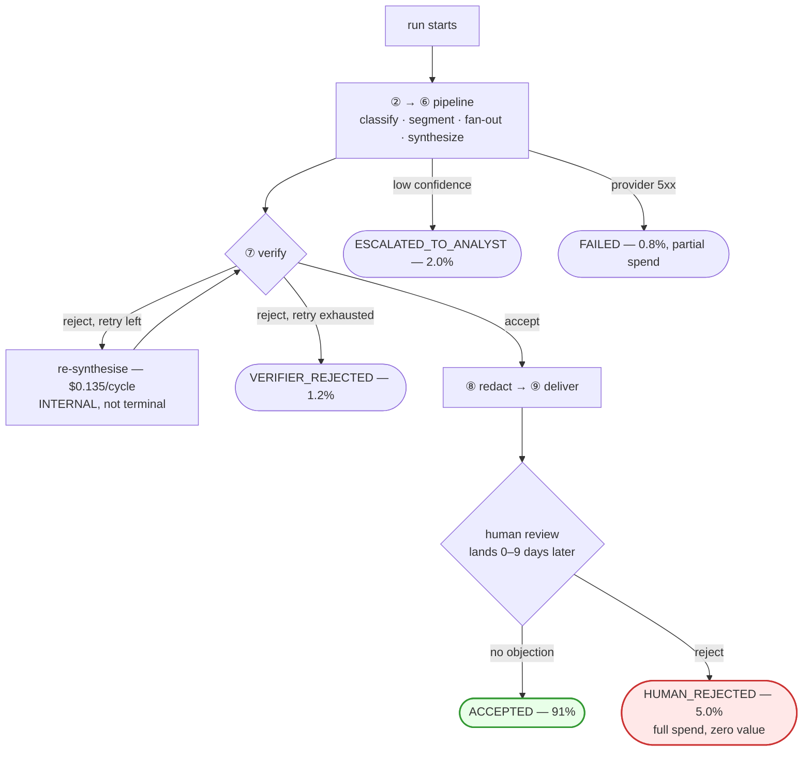
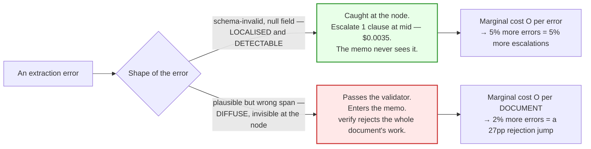
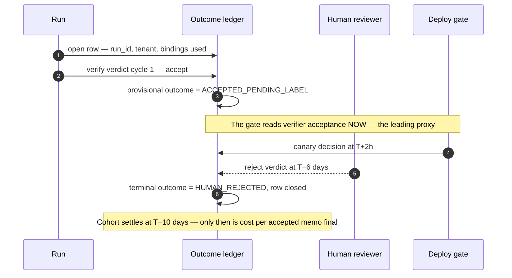

# 05 — Cost per Outcome

> **Principles 6 and 8.** Cost per call and intermediate quality scores both routinely point the
> wrong way. **Only cost per accepted outcome decides anything** — and because the outcome is
> measured five nodes downstream of the call being priced, measuring it is a systems-design problem,
> not a dashboard problem.

---

## 1. The outcome taxonomy

A metric denominated in "successful runs" is worthless until *success* is a closed set. Every
Ledgerline run terminates in **exactly one** of five states.

| Terminal outcome | Definition | Spend | Value |
|---|---|---|---|
| `ACCEPTED` | Passed `verify`, delivered, reviewer did not reject | full | full |
| `VERIFIER_REJECTED` | Retry budget exhausted — `verify` rejected the re-synthesised memo too | **full + 2 cycles** | none |
| `HUMAN_REJECTED` | Delivered, then rejected in review | full | **none** |
| `ESCALATED_TO_ANALYST` | Routed to a human analyst before delivery | full to escalation | partial |
| `FAILED` | Infrastructure — provider outage, timeout, parse failure | partial | none |

**The `verify → synthesize` loop in [00](00-overview.md) §2 is not a terminal state.** One rejection
is an internal retry, already priced in [00](00-overview.md) §6 as *"4% of memos re-synthesised and
re-verified, +$0.0054"*. Terminal `VERIFIER_REJECTED` means the retry was spent and the memo still
failed. Conflating the two is the most common instrumentation error here: it makes a healthy retry
look like a failure and hides the retry-exhausted runs that are the real loss.



---

## 2. The governing metric, worked

```
cost_per_accepted_memo  =  total_pipeline_spend  ÷  accepted_memos
```

The denominator is **accepted memos**, not runs. The numerator is **all** spend, including spend on
runs that produced nothing. And the ratio is meaningless until the **basis** is stated — see below.

On the **p50 pipeline basis** ([00](00-overview.md) §5–6: 120 clauses, excluding the `risk_flag`
coverage detector):

| Config | Spend/doc | `ACCEPTED` | **Cost per accepted memo** |
|---|--:|--:|--:|
| Baseline — everything on `mid` | $0.9625 | 97% | **$0.9923** |
| Blast-radius tiered ([02](02-blast-radius-tiering.md)) | $0.6237 | 91% | **$0.6854** |
| | | | **−30.9%** |

The per-call saving was 35.2%; the per-outcome saving is 30.9%. **Six points of the apparent win
were bought with acceptance rate** — the exact leak cost-per-call reporting hides, and small enough
that only the outcome metric would ever have found it.

### The sensitivity that is the actual recommendation

Hold the baseline fixed and ask how far acceptance can fall before tiering stops paying:
`break-even acceptance = 0.6237 ÷ 0.9923 = 62.9%`.

> **The tiered configuration survives down to a ~63% acceptance rate before it stops beating the
> baseline** — a 28-point margin below the modelled 91%. **This, not the 35% headline, is the real
> safety margin on [02](02-blast-radius-tiering.md)'s recommendation**, and it is the answer to "but
> what if the small model is worse than you think?" It can be *much* worse than we think.

**That margin is basis-independent, which is why it is the durable claim.** Recomputed on
[00](00-overview.md) §6's mean-width all-in basis it is 57.8% (`0.7974 ÷ 1.3794`). ~58% or ~63% —
either way, tiering wins unless the cheap tiers are catastrophic.

### The basis is part of the metric

The same configuration, measured three defensible ways:

| Basis | Baseline | Tiered | vs. SLO ≤ $0.70 |
|---|--:|--:|---|
| p50 pipeline ([00](00-overview.md) §5–6) | $0.9923 | **$0.6854** | appears to pass, 1.9pp of acceptance headroom |
| p50 all-in, incl. the enabling detector | — | $0.7118 | already fails |
| **Mean width, all-in — the SLO's stated basis** ([00](00-overview.md) §7) | $1.3794 | **$0.8762** | **fails by +25.2%** |

> **Changing basis moves this metric by 27.8% and flips the compliance verdict.** So a cost-per-
> outcome figure quoted without its basis and denominator is not a metric, it is a number — the same
> failure this document diagnoses in F1, one level up. **Do not report cost per accepted memo without
> naming the width basis and whether enabling controls are inside it.**

And the consequence [00](00-overview.md) §7 states plainly: **the design misses its cost SLO.** Two
things follow that a reviewer must not confuse:

1. **The gap cannot be closed by acceptance rate.** Meeting $0.70 on the mean-width basis would need
   `0.7974 ÷ 0.70 = 113.9%` acceptance — impossible. **The remaining gap is a spend problem, not a
   quality problem**, which is why [00](00-overview.md) §7 assigns it to levers outside tiering
   (distillation, cache hit rate, and reducing mean fan-out width). Tiering closes 36.5% of it and
   then stops.
2. **The naive division is an approximation whose error can point either way.** It charges every run
   the mean. Weighting each terminal state by actual spend (retry-exhausted runs cost $0.8937,
   `FAILED` ~40% of a run) gives **$0.6857** tiered and **$0.9903** baseline on the p50 basis —
   tiered understated by 0.04%, baseline *overstated* by 0.2%. Direction depends on whether
   expensive-retry or cheap-abort failures dominate: harmless at 1.2% retry-exhaustion, materially
   wrong at 10%.

---

## 3. Why intermediate metrics mislead

Two candidate replacements for the `extract` binding, both cheaper per call, both worse on
extraction F1. **The one barely worse on F1 is the disaster; the one much worse is the win.**

### Case B — 2% worse on F1, 30% more expensive per outcome

A `nano`-class extractor whose errors are **plausible span mis-attributions**: schema-valid, the
cited span exists, the quoted text is real — it is attached to the wrong obligation. Nothing at the
node can see this. It reaches the memo, and `verify` rejects **the whole memo** for one bad claim.

| | `small` (recommended) | Candidate B (`nano`) | Δ |
|---|--:|--:|---|
| extraction F1 | 0.918 | 0.900 | **−2.0%** — "acceptable" |
| cost per extract call | $0.000875 | $0.000310 | **−65%** — "obvious win" |
| extract node / doc | $0.1050 | $0.0372 | −65% |
| clause escalation rate → cost | 12% → $0.1008 | 34% → $0.1932 | +22pp — first warning |
| **whole-memo verify rejection → cost** | **4% → $0.0054** | **31% → $0.0636** | **+27pp — the mechanism** |
| unchanged: risk_flag + singletons | $0.4125 | $0.4125 | — |
| **pipeline spend/doc** | **$0.6237** | **$0.7065** | **+13.3%** — already a loss |
| `ACCEPTED` rate | 91% | 79% | −12pp |
| `HUMAN_REJECTED` rate | 5.0% | 10.0% | +5pp — **breaches the ≤ 6% SLO** |
| **cost per accepted memo** | **$0.6854** | **$0.8943** | **+30.5%** — **reject** |

Three metrics, three answers, in increasing order of correctness: −65% per call, +13.3% per
document, **+30.5% per accepted outcome.** A team reporting either of the first two ships this.

### Case C — 5% worse on F1, a clear win

2.5× worse than B on the node metric. Its errors are **schema violations and null required fields** —
caught by the structured-output validator, escalated per clause, never reaching the memo.

| | `small` | Candidate C | Δ |
|---|--:|--:|--:|
| extraction F1 | 0.918 | 0.872 | **−5.0%** |
| extract node → clause escalation | $0.1050 → $0.1008 | $0.0372 → $0.1512 | −65% / +50% |
| whole-memo verify rejection | 4% → $0.0054 | 4% → $0.0054 | **unmoved** |
| pipeline spend/doc, `ACCEPTED` rate | $0.6237, 91% | $0.6063, 91% | −2.8%, — |
| **cost per accepted memo** | **$0.6854** | **$0.6663** | **−2.8%** |



> **The distribution and detectability of errors matters more than the error rate.** Node-level
> quality scores capture neither. F1 is a scalar over independent predictions; the cost function is
> not — it carries a per-document term one error can trigger. Two models with identical F1 can
> differ 30% on cost per outcome, and nothing in F1 hints at it.

**The corollary that breaks eval sets.** Candidate B's penalty is the per-document term:
$0.0582/doc, **9.3% of a p50 document but 2.2% of a p99 document** ([00](00-overview.md) §8).
Candidate C's penalty is entirely per-clause and scales with fan-out width. **A test set skewed to
wide documents flatters B; one skewed to narrow documents flatters C.** The fan-out distribution of
your eval set silently decides the answer — match it to production or the comparison is meaningless.

---

## 4. The attribution problem

The `extract` call being priced sits **five nodes upstream** of the outcome being measured, behind a
fan-out, a synthesis, a verifier, a retry loop, and a human.

| | ❌ Per-node A/B | ✅ Run-level randomised assignment |
|---|---|---|
| Randomisation unit | one call, within a run | **the whole run, at admission** |
| Can measure | F1, schema validity, cost/call | terminal outcome, total spend, label verdict |
| Fatal flaw | both arms share one memo, one `verify` verdict, one reviewer — **the outcome cannot be assigned to either arm** | none — one run, one arm, one outcome |
| Denominator | undefined | well defined |

**Why naive per-node A/B is invalid:** the outcome is a single observation belonging to both arms.
You *can* measure per-call quality this way — which is the trap, because §3 just showed per-call
quality to be the misleading metric. **The measurement that is easy is the measurement that lies.**

Run-level assignment draws the binding once per run, stamps it into the outcome ledger, and applies
it to every call in the run. Stratify on fan-out band and tenant, since both shift the outcome
distribution.

Two-proportion test, α = 0.05 two-sided, 80% power, from a 91% baseline:

| Δ to detect | n per arm | docs total | at 50/50 of 90 k/day | at 2%-per-arm canary |
|---|--:|--:|--:|--:|
| 5pp (91 → 86%) | ~640 | ~1,300 | ~20 min | ~8.5 h |
| **2pp (91 → 89%)** | **~3,530** | **~7,060** | **~1.9 h** | **~2.0 days** |
| 1pp (91 → 90%) | ~13,500 | ~27,000 | ~7.2 h | ~7.5 days |

**What sets the required resolution is the nearest SLO cliff, not the size of the cost effect.** The
binding one is human rejection: §1's modelled 5.0% against a ≤ 6% target leaves **~1pp of headroom**,
so a re-point that moves rejection by a point is a contract breach the experiment must be able to
see. That argues for the 1pp row and ~7 hours of full-traffic canary; **2pp is the pragmatic floor**
most teams can actually afford, and choosing it is an explicit decision to be blind to a 1pp breach.

Then the punchline: those 3,530 runs per arm contain roughly **850,000 model calls**. A call-level
A/B would have declared significance on any per-call metric within seconds and been confidently
wrong. **Outcome rates make the run the unit of observation — thousands of runs are required, and
millions of calls do not help.**

---

## 5. The outcome ledger

Append-only, one row per run, written incrementally and closed by the terminal outcome.

| Field | Notes |
|---|---|
| `run_id`, `tenant_id`, `pipeline_id`, `pipeline_version` | join keys for [06](06-tenant-attribution.md) |
| `fan_out_width`, `doc_type`, `experiment_arm` | the §3–4 stratification variables and the run-level assignment |
| `tier_binding_used[node]` | **the binding that executed**, per node |
| `escalations[]` | node, trigger, from-tier, to-tier, retry index |
| `spend_usd[node]` | broken out per node, never only a total |
| `terminal_outcome`, `verifier_verdicts[]` | one of the five, exactly one — plus every cycle, so retries are distinguishable from exhaustion |
| `human_verdict`, `human_verdict_at` | **null until it arrives** — see §6 |

> **The ledger records the binding that was *used*, not the binding that was *configured*.**

Three mechanisms guarantee those differ: **escalation** ([04](04-escalation-ladder.md)) re-runs a
clause on a higher tier mid-run; **pins** ([01](01-tier-as-contract.md) §5) resolve a declared tier to
a different model, and an expired pin changes that silently mid-week; **canaries**
([07](07-eval-gated-repointing.md)) route a fraction of runs elsewhere. A ledger that logs intent
yields a table where canary and control are indistinguishable, escalation appears free, and pinned
pipelines are credited to the wrong model. **None of this document's analysis survives that, and the
defect is undetectable by inspection** — the rows look perfectly reasonable. Emit the binding from
the call site that made the call, never from the resolver's configuration snapshot.

---

## 6. Late-arriving labels

`HUMAN_REJECTED` is decided by a reviewer. Median verdict latency ~2 days, p95 ~9 days. So
`cost_per_accepted_memo` is **a lagging metric with a settling window**, and a last-24-hours query
reports an acceptance rate that is structurally too high.



**You cannot gate a deploy on cost per accepted memo.** A 10-day settling window against a canary
that runs for hours is not a gate, it is a post-mortem.

| Signal | Latency | Role |
|---|---|---|
| Whole-memo `verify` rejection rate | seconds | **the leading proxy** — gates the canary |
| Clause escalation rate | seconds | secondary — catches §3's Case C shape |
| Retry-exhaustion rate | minutes | catches terminal `VERIFIER_REJECTED` |
| `HUMAN_REJECTED` rate | 2–9 days | **the lagging truth** — reconciles the gate |
| `cost_per_accepted_memo` | 10 days | the contract metric, never a gate |

**The proxy fails in exactly the scenario it guards.** Verifier acceptance measures whether claims
are *supported*, not whether the judgement is *right* ([02](02-blast-radius-tiering.md) §2B: `verify`
checks precision, not recall). A tiered-down `risk_flag` produces memos that are verifiably supported
and wrong — proxy green, lagging label red. So the proxy is trustworthy only while its **correlation
with the human verdict** holds, which makes that correlation a monitored metric, alarmed on decay.

Reconciling when the lagging label disagrees: **keep rollback authority for the full settling
window**, not just the canary; **shrink the window on the canary arm only** by routing ~1% of canary
runs to a same-day annotation queue, which turns a 9-day p95 into ~8 hours for the one decision that
needs it; and treat every disagreement as **a proxy defect, not just a bad re-point** — each becomes
a new detector requirement, the same "buy detectability, not capability" move as
[02](02-blast-radius-tiering.md) §4.

---

## 7. Counterfactual and shadow measurement

Dual-run a 1–2% sample of calls on a cheaper tier, discard the shadow output, compare. It answers one
question well — *would the cheap tier have produced a node-acceptable output here?* — which estimates
the escalation rate, a real input to the cost model.

| Question | Shadow a node? | Why |
|---|---|---|
| Would `small` have passed the schema validator? | ✅ | Local, deterministic check |
| What is the clause escalation rate at `nano`? | ✅ | Local detector, no downstream needed |
| Would `verify` have rejected the memo? | ❌ | `synthesize` consumed the *real* output |
| Would the reviewer have rejected — and at what cost per accepted memo? | ❌ | No memo was produced from the shadow path, so the denominator does not exist |

> **You can dual-run a node. You cannot dual-run the rest of the pipeline's reaction to that node
> without dual-running the whole pipeline** — at which point it is not shadow measurement, it is
> §4's run-level experiment at 2× cost.

This is why §3's Case B is invisible to shadowing: its outputs are schema-valid and locally
indistinguishable from good ones, so the comparison shows a 2% F1 gap and no escalation alarm.
**The entire failure lives in the reaction, which shadowing cannot see.** Shadow measurement is a
cost-model input, never a tiering decision.

---

## 8. The metric table

| Metric | Definition | Target ([00](00-overview.md) §7) | What it falsifies about [02](02-blast-radius-tiering.md) |
|---|---|---|---|
| `cost_per_accepted_memo` | spend ÷ `ACCEPTED`, **basis declared** | **≤ $0.70 at mean width, all-in** | **currently $0.8762 — already missed by 25.2%**, so tiering is necessary but not sufficient |
| `ACCEPTED` rate | `ACCEPTED` ÷ all terminal | ≥ 91% *(modelled)* | < 62.9% loses to baseline on the p50 basis, < 57.8% on the mean basis — **no acceptance rate reaches the $0.70 SLO** |
| `HUMAN_REJECTED` rate | human rejects ÷ all terminal | **≤ 6%** | the independent check on `risk_flag` at `small` ([02](02-blast-radius-tiering.md) §6) |
| Unsupported-claim rate, shipped | claims lacking a valid span ÷ shipped | **≤ 0.05%** | `verify` or `redact` below `large` |
| Whole-memo verify rejection | rejection cycles ÷ memos | 4% *(assumed)* | > 4% falsifies the +$0.0054 line in [00](00-overview.md) §6 |
| Clause escalation rate | escalated clauses ÷ clauses | 12% *(assumed)* | > 12% falsifies the +$0.1008 line — the largest single assumption |
| Retry-exhaustion rate | `VERIFIER_REJECTED` ÷ all terminal | ≤ 1.5% | rising means `synthesize` at `mid` is the constraint, not `extract` |
| p95 / p99 doc latency | admission → deliver | ≤ 4 min / ≤ 15 min | breach kills cheap-first ([04](04-escalation-ladder.md) §4) |
| Proxy–label correlation | verify-accept vs. human-accept agreement | alarmed on decay | decay invalidates every gate in §6 |

The two `(assumed)` rows carry the most risk: together they are $0.1062 of the $0.6237, and neither
was measured before the tiering decision was made. **They are the first things to instrument and the
first things a reviewer should ask for.**

---

## 9. Anti-patterns

| Anti-pattern | Why it breaks |
|---|---|
| Reporting cost per call or per token | §3: three metrics, and this one had the wrong sign |
| Quoting cost per accepted memo without its width basis, or with enabling controls left out of the numerator | §2: the basis alone moves it 27.8% and flips the compliance verdict |
| Denominator = runs instead of accepted outcomes | Makes `HUMAN_REJECTED` free |
| Gating a re-point on cost per accepted memo | 10-day settling window — a post-mortem, not a gate |
| Per-node A/B on tier changes | The outcome belongs to the run — invalid by construction |
| Miscounting the taxonomy — a `verify` retry booked as terminal, or `FAILED` runs left out of spend | Hides retry-exhausted runs and real money that bought zero memos |
| Ledger records the *configured* binding | Canary and control become indistinguishable, silently |
| Eval set whose fan-out distribution differs from production | Decides B-vs-C for you, invisibly |
| Shadow-running a node and calling it an outcome estimate | The failure lives in the reaction |
| Treating the verifier proxy as ground truth | It goes green in the exact failure it guards |

---

## 10. Design-review questions

1. What is cost per accepted memo now — **on which width basis, and with which enabling controls
   inside the numerator?** How much of the denominator is still `PENDING_LABEL`?
2. What acceptance rate makes the tiered config lose to baseline (~63% p50, ~58% mean), and does
   anyone still believe an acceptance improvement can reach the $0.70 SLO?
3. For every model comparison last quarter: node metric or terminal outcome? If a node metric, would
   the sign have flipped?
4. Does the ledger record the binding that executed or the one configured? Show the code path for an
   escalated clause.
5. What are the measured clause-escalation and whole-memo rejection rates against the assumed 12% and
   4%?
6. What are the settling and rollback windows, and is the second at least as long as the first?
7. What is current agreement between verifier acceptance and the human verdict, and does the eval
   set's fan-out distribution match production's p50/p90/p99 ([00](00-overview.md) §8)?

Continue to [06 — Per-tenant attribution](06-tenant-attribution.md).
