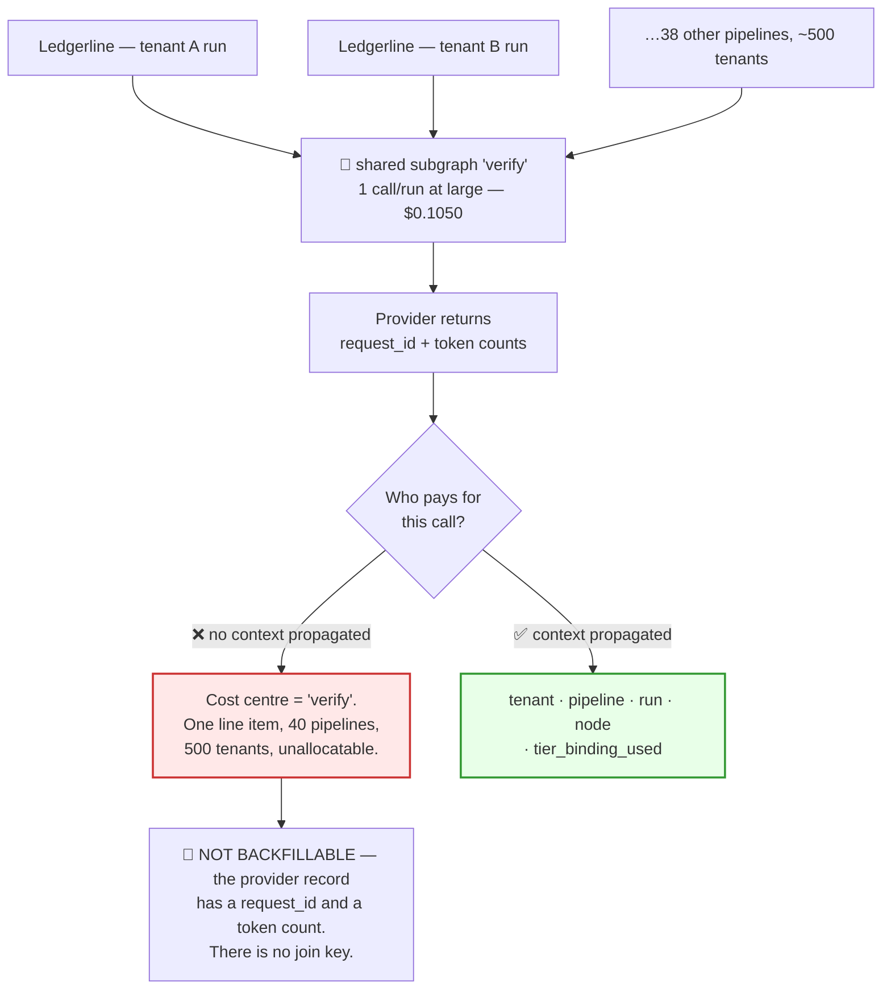
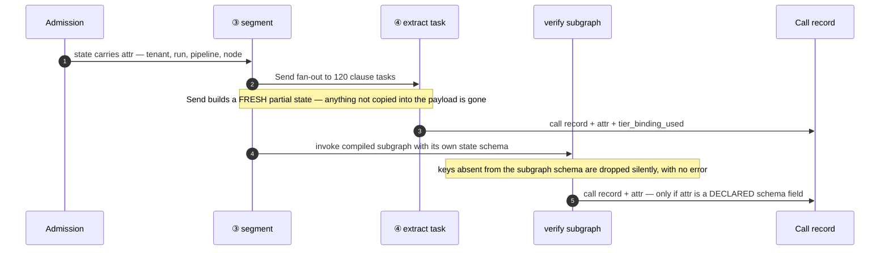
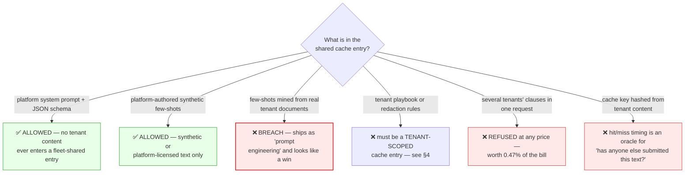

# 06 — Per-Tenant Attribution

> **Principles 7 and 8.** Attribution through shared subgraphs is an **accounting design**, not an
> instrumentation task. And the prompt cache turns it into a **fairness question with no purely
> correct answer** — identical work costs two tenants 12× different amounts, and someone must absorb
> that.

---

## 1. The problem shape

[00](00-overview.md) §1: `retrieval`, `verify`, and `redact` are shared subgraphs, each bound into
**10–40 pipelines**, serving **~500 tenants** across ~200 deployments. A single model call inside
`verify` must be simultaneously attributable to a **tenant**, a **pipeline**, a **run**, and a
**node** — four axes, all required, all lost by default.

**The irreversibility is why this is a design problem rather than a backlog item.** A missing latency
metric can be added tomorrow at a cost of one day of data. A missing tenant tag means the identity
was never recorded anywhere. **You cannot reconstruct a bill you did not tag at call time.**

---

## 2. Tag propagation

Five fields, mandatory on every model call:

| Field | Source | Why it cannot be inferred later |
|---|---|---|
| `tenant_id` | run admission | The shared subgraph has no other way to know |
| `run_id` | run admission | Join key to the outcome ledger ([05](05-cost-per-outcome.md) §5) |
| `pipeline_id` + `pipeline_version` | deployment | 40 pipelines share this subgraph |
| `node_id` | call site | Per-node spend breakout in [05](05-cost-per-outcome.md) |
| `tier_binding_used` | the resolver, at the call site | Pins and escalations make config ≠ fact |

**Failure 1 — fan-out.** LangGraph's `Send` constructs a fresh partial state per task. A hand-built
payload carrying `clause` and forgetting `attr` produces 120 untagged calls, and **the node where
this happens is the node that is 87% of the bill** ([00](00-overview.md) §5).

**Failure 2 — the subgraph boundary.** A compiled subgraph has its own state schema; keys outside it
are dropped with no error. The attribution context must be a **declared, required field of every
shared subgraph's schema**, validated at compile time rather than by convention.

**Failure 3 — the distributed one, which defeats the obvious fix.** Passing context via contextvars
or `RunnableConfig` works in-process and evaporates the moment a fan-out task is picked up by a
*different worker*: that worker rehydrates from the checkpoint, not from the parent's call stack.

> **The attribution context must live in checkpointed state** (durable, survives the queue) **and be
> mirrored into trace metadata** (so spans are sliceable). Each covers the other's gap: state
> survives the worker boundary but never reaches the trace backend; config metadata reaches the
> trace backend but does not survive the queue.

**One hard rule: a shared subgraph must never start a new trace root.** A subgraph that opens its own
root emits spans with no parent `run_id` — which is the one recovery path you would otherwise have
had when a tag goes missing. That single mistake converts a recoverable gap into a permanent one.

---

## 3. Prompt-cache fairness

`extract`'s system prompt plus schema is **byte-identical across all 500 tenants** for a given doc
type; so is `classify`'s taxonomy. The provider prices a cache window asymmetrically.

| | Multiple on the cached prefix | `extract` prefix (1,100 tok @ `small`) | `classify` prefix (3,500 tok @ `large`) |
|---|--:|--:|--:|
| Cache **write** — first call in the window | **1.25×** | $0.000344 | $0.013125 |
| Cache **read** — every later call | **0.1×** | $0.000028 | $0.001050 |
| Ratio | **12.5×** | 12.5× | 12.5× |

The 12.5× is on the **prefix line item**. Translated to whole calls it is 1.5× on `extract` and
**2.71× on `classify`** ($0.019125 write vs. $0.00705 read) — for identical work on identical input,
decided by whose call arrived first after the window opened. Three ways to bill it:

| | (a) Actual cost | **(b) Amortised blended rate** | (c) List price, platform keeps the saving |
|---|---|---|---|
| Bill for identical work | varies up to **12.5×** on the prefix line | identical | identical |
| Forecastable | **no** | yes | yes |
| Gameable | **yes** — delay 200 ms, let a neighbour pay the write | no | no |
| Platform carries | nothing | **cache-miss risk** | nothing |
| Platform incentive on hit rate | **none** — cost passes straight through | **maximise it** | maximise it |
| Supports a cost-plus claim | technically | yes | **no** |
| Verdict | ruled out by SLO | **recommended** | ruled out by contract |

**(a) fails for a worse reason than expense — it is unexplainable.** At 90 k docs/day the platform
prefix is warm essentially always, so writes are rare and arbitrarily incident. The worst case is
concrete: **every prompt deploy re-warms every cache, so the tenants whose calls land in the first
seconds after a platform deploy pay the fleet's entire re-warming cost.** A tenant's invoice comes
to depend on the platform's release schedule. The amounts are small in aggregate and arbitrary in
incidence — too small to engineer around, large enough to blow a small tenant's forecast, and
impossible to defend in a support ticket.

**[00](00-overview.md) §7's ±15% monthly forecast-accuracy SLO rules out (a) by construction.** A
30-document/month tenant sees `redact` land anywhere between $2.38 (all warm) and $2.79 (all cold)
with nothing it did changing; compound that with `classify`, `segment`, and `verify` write luck and
forecast error exceeds ±15% structurally.

**(c) fails on audit, not on ethics.** Simple, profitable, and incompatible with any cost-plus or
pass-through language in an enterprise contract. A large tenant will eventually model the provider's
public rate card against its own volume, find the gap, and be right.

**Recommendation: (b), with a published amortisation window and a periodic true-up.** Publish the
window (30 days), publish the blended rate, reconcile actuals quarterly, refund or carry forward the
delta. The deliberate side effect is the best part:

> **Under (b) the platform's margin is a direct function of cache hit rate while every tenant's price
> is independent of it.** The platform now has a strong incentive to keep prefixes stable, order
> prompts correctly, and avoid needless re-warming — none of which is in tension with any tenant's
> interest. **(a) has the opposite property: under pass-through pricing nobody at the platform is
> paid to care about the cache.**

---

## 4. Hit rate is a per-segment fact

There are two prefix classes and they behave nothing alike:

| Prefix class | Example | Cache scope | Hit rate driven by |
|---|---|---|---|
| **Platform prefix** | `extract` schema, `classify` taxonomy | fleet-shared | total platform volume — always warm |
| **Tenant prefix** | `risk_flag` playbook, `redact` rule set | **per tenant** | **that tenant's own arrival rate** |

Tenant prefixes are where the fairness trap lives, and it hides where nobody looks. On a **fan-out**
node it barely matters: within one document `risk_flag`'s 120 calls share the tenant's playbook, so
even a 1-document/day tenant pays 1 write + 119 reads and lands within 0.7% of a permanently-warm
tenant. On a **singleton** node with a tenant prefix there is nothing to amortise against.

`redact` — 1 call/doc, `large`, 4,000-token tenant rule set — read $0.0792, write $0.0930:

| Segment | Docs/day | Prefix hit rate | Blended cost/doc | vs. list $0.0900 |
|---|--:|--:|--:|--:|
| Micro | 1–4 | ~5% | **$0.0923** | +2.6% |
| Small | 5–50 | ~55% | $0.0854 | −5.1% |
| Mid | 50–500 | ~92% | $0.0803 | −10.8% |
| Large | > 500 | ~99.5% | **$0.0793** | −11.9% |
| *Volume-weighted global* | | ~97% | *$0.0796* | *−11.5%* |

**Spread between micro and large: 16.5%, systematic, on the identical node doing identical work.**

1. **The fairness problem lives on the singleton nodes — 12.7% of the bill** ([00](00-overview.md)
   §5). Anyone auditing cache economics where the money is, the 87.3% in the fan-out, correctly
   concludes the cache is working and there is no problem to solve.
2. **It is systematic, not noise.** It does not average out across months; it surfaces as a permanent
   per-tenant margin difference, which is why it arrives as a commercial dispute rather than an
   engineering ticket.
3. **A single global blended rate is not stable.** It prices everyone at ~$0.0796 while micro tenants
   cost ~$0.0923, so large tenants subsidise micro ones. A large tenant that audits will demand its
   own rate and has the leverage to get one; the published rate then re-prices to the residual and
   **rises**. **An unsegmented blend decomposes into segments anyway — in the order set by
   negotiating leverage rather than by cost.**

**So segment explicitly and publish the boundaries.** Beyond fairness, that makes it **actionable**: a
micro tenant told *"submit in a daily batch window and you move to the Small band"* can act, and the
action raises the platform's hit rate. Same alignment as §3.

**The honest residual:** a 2-document/day tenant cannot reach the Large band whatever it does — there
is a floor on the unfairness. Cap it: publish a maximum spread (micro price ≤ 1.15 × large price, so
$0.0912 against a $0.0923 cost) and absorb the ~$0.0012/doc, which on a 4-doc/day tenant is
$0.0047/day. **Buy the fairness — at this price the argument costs more than the subsidy.**

---

## 5. The optimisation you must refuse

Batch several tenants' clauses into one `extract` request. The platform prefix is shared, so
amortising it over 10 clauses instead of 1 looks like free money.

> **It is a data-isolation violation. It is off the table at any price.** Not "requires a DPIA," not
> "acceptable for tenants on the same plan." Off the table.

And here is the argument that ends the discussion without appealing to policy at all:

| Configuration | Cost for 10 `extract` clauses | vs. previous |
|---|--:|--:|
| Uncached, 10 separate calls | $0.008750 | — |
| **Cached shared prefix, 10 separate calls** ✅ | **$0.006275** | **−28.3%** |
| Cross-tenant batch, 1 call ❌ | $0.006028 | −3.9% |

**Once the legitimate prompt-cache optimisation is in place, cross-tenant batching is worth 3.9% of
the `extract` node — 0.47% of the pipeline bill.** The legal optimisation is worth 4.7% of the
pipeline. **The optimisation you must refuse is worth one tenth of the one you are allowed to have**,
and teams reach for it only because they benchmarked against the uncached baseline.

**The line: a fleet-shared cache entry may contain only content the platform authored.** Two branches
above are the ones that actually ship a breach, because neither looks like a data decision:

- **Few-shots mined from tenant documents.** A quality engineer improves `extract` by adding three
  real, well-drafted clauses as examples. Those clauses now sit in a cache entry read by 499 other
  tenants. Enforce this on the prompt-build path with a check, not with review.
- **Content-derived cache keys.** For contract intelligence, *"has anyone else submitted this exact
  text?"* is meaningful — think M&A drafts circulating between counterparties. A cache-hit latency
  difference answers it. **Scoping shared entries to platform-authored content closes this too**,
  which is the same rule reached from an independent direction. That is the signal it is right.

---

## 6. Fan-out attribution and the noisy neighbour

Within a tenant, fan-out attribution is trivial: 240 tagged calls, one `run_id`, sum them. The
problem is not accounting — it is that **the p99 900-clause document from [00](00-overview.md) §8 is
1,800 fan-out calls and $1.58 of fan-out spend in a single run**, 7.5× the p50.

**A spend cap does not contain it.** A $500/day cap is checked in dollars; the damage is done in
*concurrency*. One tenant's p99 filing can hold the worker pool and the tenant's share of the
provider rate limit for minutes, and the victims are other tenants' p95 latency SLOs.

| Control | Contains | Misses |
|---|---|---|
| Per-tenant daily spend cap | runaway cost | **the 20-minute pool occupancy** |
| **Per-tenant in-flight fan-out concurrency quota** | pool occupancy, rate-limit share | sustained cost |
| Both, plus a queue-priority class | both | — |

> **Attribute the resource, not only the dollar.** A run delayed because another tenant consumed the
> shared concurrency budget shows up as *your* latency breach and *their* spend. Unless quota
> consumption is itself attributed per tenant, that incident is undiagnosable — the spend records
> exonerate the tenant that caused it. Shedding order is in [09](09-governance-and-budgets.md).

---

## 7. Chargeback mechanics

**What appears on a tenant's bill: a per-document unit price within a disclosed size band. Never
tokens.**

| Why token-level billing fails | Detail |
|---|---|
| The tenant cannot compute it, even in principle | Cost depends on clause count, and clause count comes from ③ `segment` — **a model call**. The tenant cannot predict its own bill. |
| It leaks your architecture | Per-document call counts disclose the DAG shape, node count, fan-out strategy, and every re-point. A competitor with an account reads your design off an invoice. |
| Every deploy becomes a billing event | A prompt edit changes token counts, so routine changes generate disputes. |
| **It bills the tenant for your failed bet** | Under token pricing a tenant pays *more* when the cheap tier fails and escalation fires ([04](04-escalation-ladder.md)) — charged for the platform's cost optimisation not working. Indefensible. |

That last row and §3's recommendation are **the same principle**: *whoever makes the choice carries the
variance.* The platform chose the tier, so it carries escalation cost; it chose the caching strategy,
so it carries cache-miss variance. State it once, it resolves both.

One unit price cannot span a 7.5× cost range, so price in bands by clause count — ≤ 200, 201–500,
and 500+. But:

> **The billing dimension must be computable without a model call.** Clause count from ① `intake` —
> the deterministic parse, `⚙️ no model` in [00](00-overview.md) §2 — is billable. Clause count from
> ③ `segment` is not, because a non-deterministic band assignment produces a non-deterministic invoice
> for the same document. The intake estimate will disagree with `segment`'s true count; **bill the
> deterministic one and eat the difference.**

**Communicating tier changes: you don't.** The tier is not in the contract — that is the point of
[01](01-tier-as-contract.md)'s indirection. The contract holds the unit price and the quality SLOs
(unsupported-claim rate ≤ 0.05%, human rejection ≤ 6%). A re-point that holds those is invisible and
needs no notice; one that moves them is a contract change that does. **The quality SLOs are therefore
the tenant-facing surface of every tiering decision**, and the eval gate in
[07](07-eval-gated-repointing.md) is exactly the machinery that lets you re-point 200 pipelines
without writing 500 customer letters.

---

## 8. Reconciliation

The provider invoice and the sum of attributed costs will not match. Enumerate the gap; do not
explain it away.

| Gap source | Sign | Typical | Charged to |
|---|---|--:|---|
| Cache write/read variance vs. the published blend (§3) | ± | ±2% | platform |
| Provider-side retries — 429, 5xx | + | 0.5–1.5% | platform |
| `FAILED` runs ([05](05-cost-per-outcome.md) §1) | + | ~0.3% | **platform, never the tenant** |
| **Evaluation traffic** — conformance + pipeline suites | + | 2–4% | **platform R&D** |
| **Canary and shadow dual-running** | + | 0.5–2% | **platform R&D** |
| Unit-price rounding | ± | < 0.1% | platform |
| **Lost tags** | + | **should be 0** | ⚠️ **nobody — this is the alert** |

> **Evaluation and canary traffic is never charged to a tenant.** It is platform R&D. A tenant did
> not ask you to evaluate a candidate model, and a tenant enrolled in a canary is doing you a favour.
> Enforce it in the tag — an `attribution_class` of `eval` or `canary` that makes the cost record
> structurally unbillable — because at 2–4% of a $31.6 M/year bill ([00](00-overview.md) §5) the
> temptation is a real line item.

**The rule that makes reconciliation work: every named category needs its own independent counter.**
Expected total gap is roughly 4–8%. If eval spend is *derived as the residual*, lost tags hide inside
it and the gap becomes self-justifying. Measure each category directly, subtract, and **alert when
the unexplained residual exceeds 1% of the invoice** — a residual is almost always a propagation
defect from §2, most often a new `Send` payload on a fan-out node. It is also the *only* alert that
catches that defect, because untagged calls do not error; they quietly stop appearing in anyone's
bill. Query shapes in [08](08-observability.md).

---

## 9. Anti-patterns

| Anti-pattern | Why it breaks |
|---|---|
| Shared subgraph logs its own name as the cost centre | One unallocatable line item, 40 pipelines, and **not backfillable** |
| Shared subgraph starts its own trace root | Destroys the only recovery path for a missing tag |
| Attribution context passed only via contextvars or config | Evaporates when a fan-out task lands on another worker |
| `Send` payloads assembled by hand per call site | The 87%-of-the-bill node is the one that drops the tag |
| Passing actual cache cost through to tenants | 12.5× prefix swings, gameable, breaches the ±15% forecast SLO |
| One global blended rate | Micro tenants cost more than they are charged; it decomposes under audit anyway |
| Billing per token, or banding on ③ `segment` | Unpredictable for the tenant, leaks the DAG, bills them for your escalations, and makes the same document produce two invoices |
| Cross-tenant batching for the cache win | A breach worth 0.47% of the bill |
| Few-shot examples mined from tenant documents | Tenant content in a fleet-shared cache entry, shipped as a quality win |
| Spend caps without concurrency quotas | The p99 document is a latency incident, not a cost incident |
| Eval or canary spend charged to tenants | Billing customers for your own R&D |
| Reconciliation gap explained as "eval traffic" with no counter | Lost tags hide inside it forever |

---

## 10. Design-review questions

1. Take one call inside the shared `verify` subgraph from yesterday. Can you name its tenant,
   pipeline, run, node, and the tier binding that actually executed?
2. What fraction of yesterday's spend is unattributed, and if it is not ~0, which node?
3. Is the attribution context a declared required field of every shared subgraph's state schema, and
   is that validated at compile time or by convention?
4. Which cache-pricing policy are we on, and is it written where a customer could read it?
5. What is the measured prefix hit rate for the smallest 50 tenants versus the largest 10, and what
   per-document price spread does that imply?
6. Which cache entries are fleet-shared, can we prove no tenant content is in any of them, and what
   check enforces that on the prompt-build path?
7. What is a tenant's fan-out concurrency quota, and what happened the last time a p99 900-clause
   document arrived?
8. What was last month's reconciliation gap, how much has an independent counter, and is eval and
   canary traffic structurally unbillable or merely excluded by a query someone remembers to write?

Continue to [07 — Eval-gated re-pointing](07-eval-gated-repointing.md).
