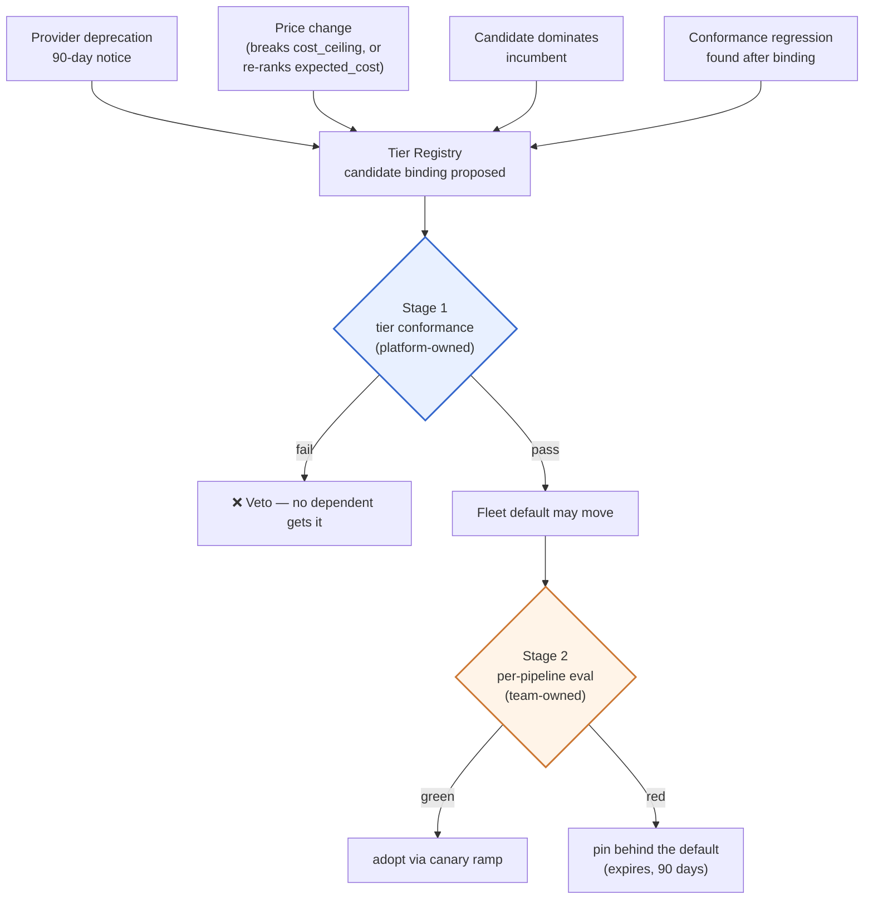
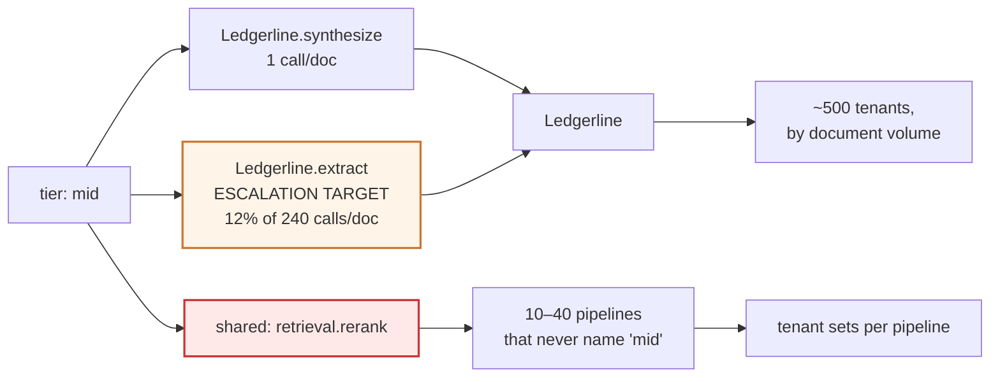
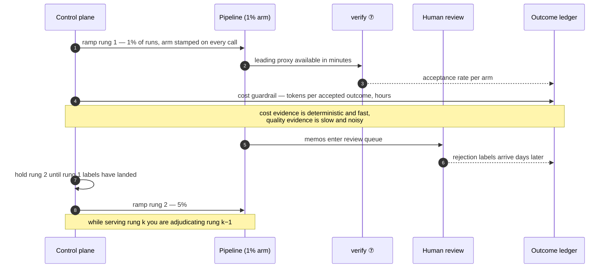
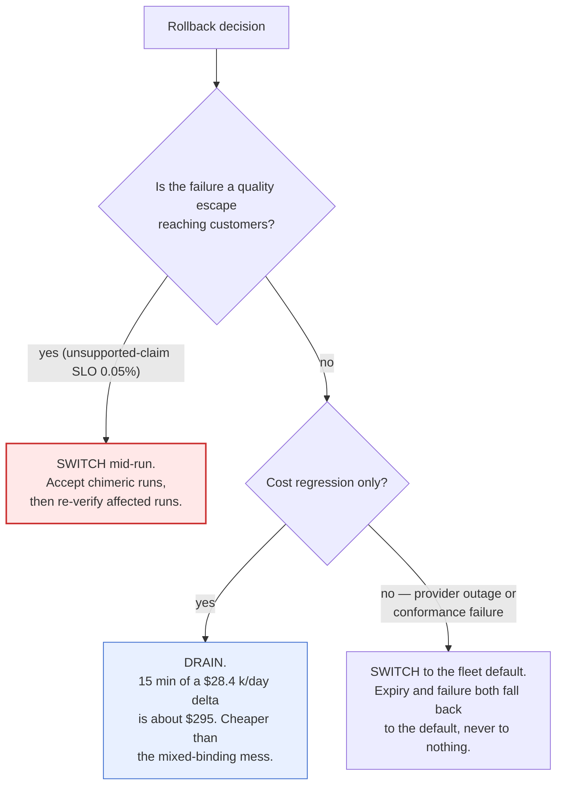
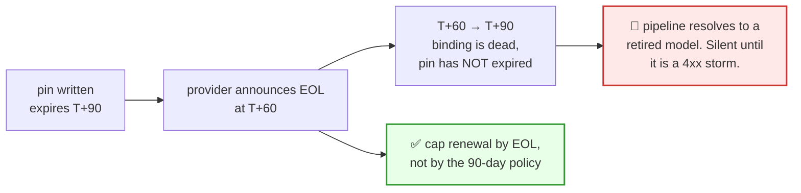

# 07 — Eval-Gated Re-pointing

> **Principles 6 and 7.** A tier is an indirection whose whole value is that you can re-point it —
> and every re-point is a fleet-wide behavioural change. The question a gate answers is never "is
> the candidate better?" It is "which of the ~200 dependents may adopt it, and who is allowed to
> stay behind?"

---

## 1. Re-pointing is unavoidable, and mostly not your idea

| Trigger | Whose calendar | What actually broke | Elective? |
|---|---|---|---|
| Provider deprecation | The provider's — 90-day notice ([01](01-tier-as-contract.md) §1) | Nothing. The model still works, briefly | No |
| List-price rise past a tier's `cost_ceiling` | The provider's | **The contract, not the model** | No |
| A candidate dominates the incumbent on the conformance suite | Yours | Nothing | Yes |
| Conformance regression found *after* binding | Nobody's — it is already broken | The incumbent | No, and you cannot ramp slowly |

**The price trigger surprises people.** `large` declares `cost_ceiling ≤ $3.00 / $15.00 per Mtok`
([01](01-tier-as-contract.md) §2), so a list-price rise makes a conformance-passing binding
**non-conformant with no behavioural change at all**. Conformance is not a property of the model; it
is a property of the model *and* the rate card — and only one of those is under version control.

**Worse, a price *cut* can re-point a node with no registry edit and no review.** Doc 01 §3 resolves
to `min(candidates, key=lambda t: t.expected_cost(node.token_profile))`, so price is a live input to
resolution: re-rank `expected_cost` and resolution flips to a different satisfying tier while every
config file is unchanged. Either resolution *results* are recorded and diffed
([08](08-observability.md) §2) or a rate-card change is an unreviewed fleet-wide behavioural change.

**Three of the four triggers arrive on someone else's clock, so re-point capacity is a standing
operational capability, not a project.** Five tiers ([01](01-tier-as-contract.md) §6), each holding a
live binding, plus the extra bindings pinned pipelines keep alive (§4), means the platform is always
mid-transition on something. A process that takes a quarter per re-point against a 90-day notice
period absorbs exactly one forced move at a time — and deprecations do not queue politely.

---

## 2. The dependency graph is a control-plane object

The graph must answer one question **in a single hop**: *who breaks if `mid` moves?*

A code search cannot answer it. Three ways `grep 'tier="mid"'` under-reports:

| Missed dependency | Why a search misses it | Scale of the miss |
|---|---|---|
| **Escalation targets** | A node with floor `small` escalates *into* `mid` ([04](04-escalation-ladder.md)) and never names it statically | 12% of 240 fan-out calls/doc land on the escalation target ([00](00-overview.md) §6) |
| **Shared subgraphs** | A pipeline binds `retrieval`, and `retrieval`'s nodes bind tiers transitively | `retrieval`, `verify`, `redact` are each bound into **10–40 pipelines** ([00](00-overview.md) §1) |
| **Expired pins** | A pinned pipeline falls back to the default *on a date*, not on a commit ([01](01-tier-as-contract.md) §5) | up to 180 days after the pin was written |

**Transitive through escalation edges and shared subgraphs, or the graph under-reports by an order
of magnitude** — one shared subgraph turns a single edge into up to 40 dependents.

Edges also carry a **cost weight**, not just existence. From [02](02-blast-radius-tiering.md) §7:

| Edge | Calls/day | Cost of moving it one tier |
|---|--:|--:|
| `large → Ledgerline.verify` | 90 k | +$6.3 k/day |
| `mid → Ledgerline.extract` | 10.8 M | **+$28.4 k/day — $10.3 M/year** |

Same graph shape, **5.4× the consequence**, a one-line diff in both cases. Which is why
[00](00-overview.md) §7's SLO — *tier re-point blast radius: 0 unreviewed dependents* — is really
**an SLO on the graph's completeness**. A complete graph with a sloppy review is recoverable; a
clean review over an incomplete graph is the outage.

---

## 3. The two-stage gate

| | Stage 1 — tier conformance | Stage 2 — per-pipeline eval |
|---|---|---|
| Asks | May this candidate fill the tier at all? | May *this* pipeline adopt it? |
| Owner | Platform tier owner | The pipeline's team |
| Count | 1 decision for all dependents | up to ~200 independent decisions |
| Failure means | **Veto** — nobody gets the candidate | **Pin** — one pipeline stays behind, the fleet moves |
| Cost of getting it wrong | Fleet stuck on a deprecated model | One pipeline carries pin debt for ≤ 180 days |

[01](01-tier-as-contract.md) §4 names the outcome of collapsing them — every model evaluation becomes
a 200-team negotiation — but the mechanism is worth stating precisely: **with one merged suite, any
single pipeline's regression is a veto, so veto power is distributed across ~30 teams and the fleet
default can never move.** Under the split, no pipeline can veto; the strongest move available to a
dissenting team is to pin, and pins expire.

**The corollary that keeps the split alive: stage 1 must stay strictly narrower than the union of
stage-2 suites, and it decays in exactly one direction.** After every incident there is pressure to
add the failing case to the *conformance* suite, because that is where it protects everyone. Do that
four times and you have a suite no candidate passes — the ratchet of [10](10-failure-modes.md)
applied to the gate instead of the tier. Enforcement: **every conformance test must name the contract
field from [01](01-tier-as-contract.md) §2 that it tests.** A test mapping to no field is a pipeline
eval wearing a conformance badge, and it belongs in the pipeline's repo.

The fleet default is always conformance-passed ([01](01-tier-as-contract.md) §5), so stage 1 gates
the default and stage 2 never does. That is precisely what makes expiry-fallback safe.

---

## 4. The N-dependents problem, honestly

With ~200 pipelines across ~30 teams ([00](00-overview.md) §1) **you will never see 200 green eval
suites at one instant** — not mainly because models regress, but because 200 suites have 200
maintenance states. Some are stale, some fail for unrelated reasons, some have no owner on call.

The design's answer is [01](01-tier-as-contract.md) §5: a moving fleet default plus pins that expire
at 90 days, renewable once. **The re-point is not blocked on universal consent.** The consequences
are the part usually skipped, so:

**1. The fleet runs more than one live binding per tier for up to 180 days.** Every live binding
needs its own drift monitoring ([08](08-observability.md) §4), not just the default. The monitoring
surface is a function of pin inventory, which nobody budgets for.

**2. Cross-pipeline cost comparison stops working unless the binding is on the record.**
[05](05-cost-per-outcome.md)'s outcome ledger must store `binding_resolved`, not `tier_requested`.
Otherwise "why is team B's `extract` cheaper than ours?" has an invisible answer, and every
cross-pipeline benchmark taken during a transition window is nonsense.

**3. `cost_ceiling` bounds price per token. It does not bound tokens.** The output-token half of the
fan-out at `small` is `extract` 120 × 400 × $1.25/Mtok = **$0.060/doc** plus `risk_flag`
120 × 300 × $1.25/Mtok = **$0.045/doc** → **$0.105/doc**. A candidate that passes every field in
[01](01-tier-as-contract.md) §2, is quality-neutral, and is simply **twice as verbose** adds all of it:

| | Cost/doc |
|---|--:|
| Blast-radius tiering ([00](00-overview.md) §6) | $0.6237 |
| Same, candidate 2× as verbose on the fan-out | **$0.7287** |
| Cost-per-accepted-memo SLO ([00](00-overview.md) §7) | ≤ $0.70 |

**+$3.45 M/year and a breached headline SLO, from a conformance-passing, quality-neutral re-point.**
Nothing in the tier contract as written constrains output length. **Fix the contract: the
conformance suite must record the output-token distribution per fixture, and the tier must carry a
verbosity envelope.** Cost conformance is a capability, on the same footing as
`structured_output_conformance`.

**4. Pin expiry is a pricing event.** A tenant's bill can step at expiry with nothing changing on
the tenant's side — a [09](09-governance-and-budgets.md) chargeback conversation, scheduled by
[01](01-tier-as-contract.md) §5's calendar rather than by anyone's intent.

---

## 5. Canary mechanics: two guardrails on two clocks

[02](02-blast-radius-tiering.md) §7 already mandates a **1% canary** for any fan-out tier change,
plus platform review, a cost forecast, and explicit budget sign-off.

| Metric | Role | Available after |
|---|---|---|
| Verifier acceptance rate — node ⑦ | **Leading proxy** | minutes: p95 4 min, p99 15 min ([00](00-overview.md) §7) |
| Tokens per accepted outcome | **Cost guardrail** | hours |
| Cost per accepted outcome ([05](05-cost-per-outcome.md)) | **Governing, lagging** | days — waits on human labels |
| Human rejection rate, SLO ≤ 6% | Truth | days to weeks |

**Ramp on the leading proxy; hold at each rung until the lagging metric for the previous rung has
landed.** The ramp is a pipeline, not a schedule.

**Duration is arithmetic, not taste.** To detect the human rejection rate moving 6% → 8% at
conventional power, `n ≈ 16·p̄(1−p̄)/Δ² ≈ 16 × 0.0651 / 0.0004 ≈ 2,600 documents per arm`. At 1% of
90 k docs/day = 900 docs/day, that is **~3 days of accrual before the label lag even starts.** A 1%
canary on a fan-out node is a multi-week instrument.

Name the tension rather than hiding it: **doc 02 §7 mandates 1% precisely because the cost risk is
$28.4 k/day, and 1% is also the slowest possible place to gather quality evidence.** The resolution is
not a bigger canary. It is two guardrails on two clocks — a cost breaker that can trip in hours at
1%, and a quality gate that takes weeks and is *allowed* to.

The cost guardrail measures **tokens per accepted outcome, never tokens per call.** A candidate that
is terser per call but escalates more is cheaper per call and dearer per document: escalation costs
$0.1008/doc at 12% ([00](00-overview.md) §6), so **$0.0084/doc per point of escalation rate** —
twelve extra points costs about the same as doubling output verbosity. **A fan-out canary needs a
cost guardrail as well as a quality one, because a quality-neutral re-point can still move the bill
by millions** (§4); a quality-only canary passes the verbose candidate cleanly. And canary traffic
must never reach a tenant invoice ([06](06-tenant-attribution.md)), which requires the arm on the
call record ([08](08-observability.md) §2).

---

## 6. Contamination hazards that invalidate a tier evaluation

| Hazard | Symptom | What it fakes | Control |
|---|---|---|---|
| Prompt change bundled with the re-point | Quality moves, attribution ambiguous | A better *or* worse model, uniformly | Sequence them — see below |
| Eval-set leakage into the candidate's training data | Large lift on the suite, absent on fresh traffic | Capability | Rotating unpublished holdout, date-stamped fixtures, compare lift pre- vs post-cutoff |
| Traffic-mix drift between baseline and canary windows | Cost/doc moves, per-call cost flat | A cost regression, or a win | Concurrent arms, stratified by fan-out width |
| Cached-warm incumbent vs cold-cache candidate | Candidate's input-token cost high for hours | A cost regression | Four-way token split, one full cache-TTL cycle, compare cold-normalised |

**Prompting and tiering are separable ([00](00-overview.md) §9) — but the prompt was tuned for the
incumbent.** So "change nothing but the binding" is often the *wrong* experiment rather than the pure
one: the candidate underperforms against a prompt shaped for someone else. The achievable rule is not
separation but **ordering** — land the prompt change on the incumbent first, prove it
neutral-or-better there, freeze it, then re-point. Two clean experiments instead of one confounded one.

**Traffic-mix drift is the hazard with no cheap fix.** [00](00-overview.md) §8: p50 120 clauses, p99
900, and one p99 document costs **7.5× the p50** — so a single large-filing tenant onboarding
mid-canary moves mean cost/doc with no model involved. Doc 00 §8 already calls the mean a useless
*planning* number; it is a useless *canary* number for the same reason. **You cannot hold a
500-tenant traffic mix still for three weeks, so concurrent arms are the only real defence.**
Before/after windows are not a canary, they are a coincidence.

**Cold cache is not purely an artefact, and that is the trap.** The transient part is real: a
re-point invalidates every warm prefix on the affected nodes, so the candidate pays full price on
input tokens for a while and looks like a regression. But a candidate with a smaller cacheable prefix
or a shorter cache TTL is dearer *forever*, and it feeds [06](06-tenant-attribution.md)'s blended
rate. Telling the two apart needs the four-way token split ([08](08-observability.md) §1) plus at
least one full TTL cycle — the real reason the cost guardrail's clock is hours, not minutes.

---

## 7. Rollback

**Resolve the binding once per run and stamp it into run state.** Resolve per call and a document
that ran ② `classify` on the candidate and ④ `extract` on the incumbent is a chimera — and
`verify`'s reject loop back to ⑥ ([00](00-overview.md) §2) can re-enter a node *after* the switch.
Stamping makes rollback a change to **new runs only**, with a bounded latency: p99 document latency,
15 min.

**The drain option exists only because the binding is stamped per run.** Without stamping, drain and
switch are the same operation and every rollback manufactures chimeras.

Two things rollback does *not* undo:

- **The ledger now contains mixed bindings.** You cannot compare "the week after the rollback" to
  "the week before the canary", because the middle is mixed *and* the human labels for the middle
  arrive after the rollback. The fields are the audit trail: slice by `binding_resolved` and
  `canary_arm` ([08](08-observability.md) §2). If the arm was never stamped, the experiment is
  permanently un-mixable.
- **Invoices.** On cost-plus, a re-point that raised cost mid-month is already invoiced and the
  correction is a credit — a finance workflow, not an engineering one. On a fixed unit price, **the
  platform ate the delta and the re-point was a margin event, not a billing event.** Which is why
  [02](02-blast-radius-tiering.md) §7's "explicit budget sign-off" needs a finance owner and not
  only an engineering one.

---

## 8. Deprecation pressure is a schedule, not an event

Two calendars run against each other: provider EOL dates, and pin expiries (90 days, renewable
once, so 180 days maximum — [01](01-tier-as-contract.md) §5).

**The fail-safe in doc 01 §5 fires on *expiry*, not on EOL.** Between EOL and expiry the pipeline
resolves to a retired model and nothing has expired yet, so no mechanism engages.

| Control | Rule |
|---|---|
| Registry field | Every binding carries `eol_date`, populated from the provider's notice |
| Validation | `pin.expires_at ≤ binding.eol_date − drain_window`, checked at pin **write** *and* **renewal** |
| Daily sweep | Mandatory, because **EOL dates are announced after pins are written** — the constraint is not checkable once |
| Renewal length | **Capped by EOL, not by the 90-day policy.** A pin may be renewed for less than 90 days, and often must be |
| Aggregate alert | Count of pipelines pinned to any binding with EOL under 120 days, rising |

**Renewal is the dangerous moment**: a routine 90-day renewal granted 30 days before EOL manufactures
the conflict out of nothing. And the aggregate view matters more than the individual one — if 40
pipelines are pinned to a binding retiring in 60 days, you owe 40 eval-and-migrate efforts in 60
days while **no single pin looks urgent.**

---

## 9. Anti-patterns

| Anti-pattern | Why it breaks |
|---|---|
| Re-point and prompt change in one diff | The experiment answers nothing — you learn only that the pair moved |
| Dependency graph built from code search | Misses escalation targets and shared-subgraph transitivity; "0 unreviewed dependents" becomes a claim, not a measurement |
| Waiting for all dependents green | The re-point never ships, so the provider's EOL ships instead |
| Canary judged on quality alone | A verbose, quality-neutral candidate passes at $3.45 M/year |
| Canary judged on cost **per call** | Rewards a terser model that escalates more, which is dearer per document |
| Before/after windows instead of concurrent arms | Measures the traffic mix, not the model |
| Binding resolved per call, not per run | Rollback produces chimeric runs and the ledger cannot be sliced |
| Pins renewed on policy without checking EOL | A scheduled outage that no alarm is watching |
| Every post-incident regression added to the *conformance* suite | A suite no candidate passes, so the fleet freezes on a deprecated model |
| Billing canary traffic to the tenant whose document was in the arm | Direct [06](06-tenant-attribution.md) violation |

---

## 10. Design-review questions

1. Show the one-hop query that lists every dependent of a tier — **including** escalation targets
   and shared-subgraph transitivity. When was its output last reconciled against a code search?
2. What is the cost weight on the heaviest edge in the graph today, and who signs that edge off?
3. Which stage-1 conformance tests do not map to a field in [01](01-tier-as-contract.md) §2, and why
   are they not pipeline evals?
4. On the last re-point, was the prompt frozen? If not, what did the eval actually measure?
5. What is the canary's cost guardrail, in what units, and what is its trip window relative to the
   quality gate's?
6. Is the binding resolved per run or per call? Demonstrate a rollback with a document mid-fan-out.
7. Which pins currently expire *after* their binding's EOL? What is the alert, and has it fired?
8. If a provider cuts a price tomorrow, which nodes change tier with no registry edit and no review?
9. How many live bindings does each tier currently have, and is drift monitoring running against
   every one of them or only the default?

Continue to [08 — Observability](08-observability.md).
