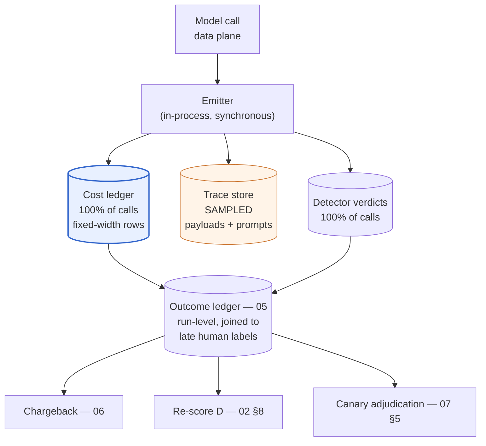
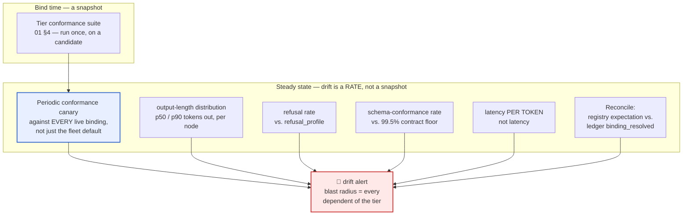
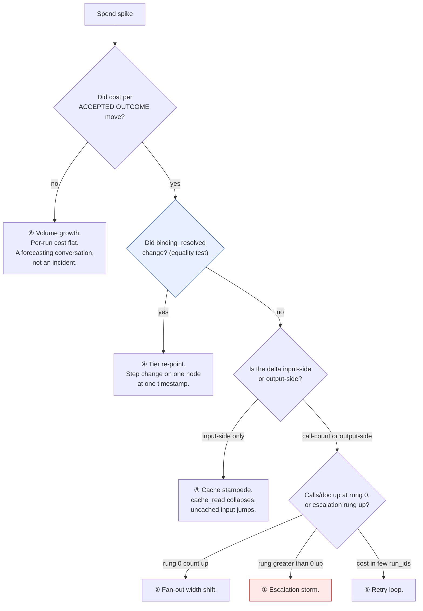
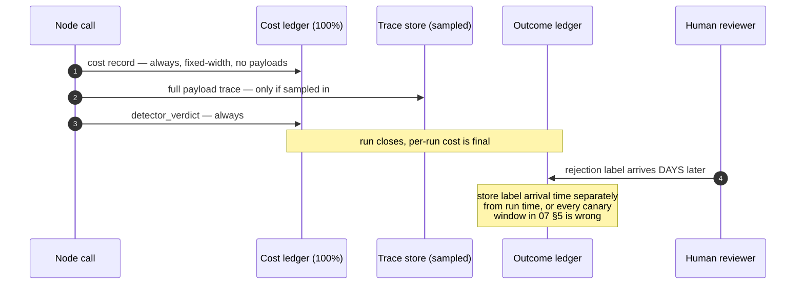

# 08 — Observability

> **Principle 6.** The attribution facts you fail to capture at call time are **not backfillable**,
> and tier drift is invisible unless you look for it explicitly. Both failures are silent, and both
> are only preventable *before* the call — never after it.

---

## 1. The record for a single model call

One row per model call, emitted synchronously with the call, never reconstructed later.

```
run_id · tenant_id · pipeline_id · node_id
tier_requested · binding_resolved   ← provider + EXACT model version
escalation_rung · pin_applied · canary_arm · attribution_class
input_tokens · output_tokens · cache_read_tokens · cache_write_tokens
cost_usd (at the rate card in force) · latency_ms · detector_verdict
```



What each non-obvious field buys, and what dies without it:

| Field | Analysis it enables | Impossible without it |
|---|---|---|
| `run_id` | Sum a document's calls into one trajectory | **Cost per accepted outcome** ([05](05-cost-per-outcome.md)) — the governing metric — cannot be computed at all |
| `tenant_id`, stamped at the **call**, not inferred from the pipeline | Chargeback through shared subgraphs | Attribution for `retrieval`/`verify`/`redact`, each bound into 10–40 pipelines ([00](00-overview.md) §1) |
| `node_id`, **logical and stable across refactors** | Spend by node | The 87.3% concentration series ([00](00-overview.md) §5) breaks at every rename, silently re-baselining |
| `tier_requested` **and** `binding_resolved` | Intent vs. reality | You cannot detect that a pin, an expiry, or a price-driven re-resolution changed what ran ([07](07-eval-gated-repointing.md) §1) |
| `escalation_rung` | The 12% escalation rate and its $0.1008/doc ([00](00-overview.md) §6) | A `mid` call on a `small`-floored node is indistinguishable from a mis-set floor; [04](04-escalation-ladder.md)'s breaker has no rate to trip on |
| Four-way token split | Cache economics | [06](06-tenant-attribution.md)'s blended rate, and the cache-stampede signature in §5 — one collapsed `input_tokens` field destroys both |
| `cost_usd` **stored, not derived** | Billable spend at the rate in force | A rate-card change silently **restates last quarter's bill**. Store tokens (auditable) *and* cost (billable) |
| `latency_ms` | The p99 document ([00](00-overview.md) §7, ≤ 15 min) | Nothing — but note document latency is the **max over ~120 concurrent fan-out calls plus queueing**, not a sum, so a p99 call regression can breach the 15-min SLO without moving mean call latency |
| `detector_verdict` | Measured **D**, the column that sets tier floors ([02](02-blast-radius-tiering.md) §5) | Doc 02 §8's circularity ("D is estimated before it can be measured") never resolves. **This field is how the rubric stops being a guess** |
| `pin_applied` | Which pipelines are behind the fleet default *right now* | [01](01-tier-as-contract.md) §8 Q2 requires reconstructing pin state from config history — a guess |
| `canary_arm`, `attribution_class` | Separating experiment from production, and eval spend from billable spend | Canary and eval cost lands in a tenant invoice — [06](06-tenant-attribution.md) §8 makes an `attribution_class` of `eval`/`canary` **structurally unbillable**, which only works if the field is written at call time |

---

## 2. The three fields that are not backfillable

Everything else can be re-derived from a trace or a config diff. These three cannot.

| Field | Why reconstruction fails |
|---|---|
| **`binding_resolved`** | Config history tells you what the registry *said*, not what the resolver *returned*. The resolver is a function of pins, of expiry (a wall-clock event), and of price ([07](07-eval-gated-repointing.md) §1). Replaying three time-varying inputs a quarter later is guessing, and during a transition window the fleet answer is wrong for an unknown subset of runs |
| **The cache split** | Cache state is not a property of the request. It is a property of the fleet's recent history, which is stored nowhere. So **you cannot reconstruct what a call would have cost cold** — which kills both [06](06-tenant-attribution.md)'s fairness question and [07](07-eval-gated-repointing.md) §6's warm-vs-cold contamination control |
| **`canary_arm`** | An unstamped experiment is permanently interleaved. And because human labels lag by days ([07](07-eval-gated-repointing.md) §5), you discover the omission *after* the outcomes you needed have already been written unlabelled |

**The unifying property: all three are facts about the *resolution*, not about the request or the
response.** A request and a response are artefacts that exist in the world and can be re-read. A
resolution is a control-plane decision that leaves no trace unless it writes one. That is the whole
reason this section exists, and it is the test to apply to any field you are tempted to drop:
*is this an artefact, or a decision?*

---

## 3. The queries that matter

| Question | Grouping that answers it | Depends on |
|---|---|---|
| Cost per accepted memo, by tenant | `sum(cost_usd)` per `run_id`, joined to `outcome = accepted`, grouped by `tenant_id` | `run_id` + late-label join |
| Is [00](00-overview.md) §5's **87.3% fan-out concentration** still true? | `sum(cost_usd)` by `node_id`, normalised per run | stable `node_id` |
| Escalation rate per node, and what it costs | `count(escalation_rung > 0) / count(*)` by `node_id`; `sum(cost_usd)` where rung > 0 | `escalation_rung` |
| Cache hit rate by tenant segment | `sum(cache_read) / (sum(cache_read) + sum(input))` by segment — feeds [06](06-tenant-attribution.md)'s blended rate | four-way split |
| **The p99 document** | percentile over **per-run** sums, never per-call | `run_id`. Note the p99 cost document and the p99 latency document are usually the *same* document, and it is a fan-out-width artefact ([00](00-overview.md) §8), not a model artefact |
| Which binding is actually serving each pipeline right now | latest `binding_resolved` by `(pipeline_id, node_id)` over the last 5 min | `binding_resolved` |
| Cost attributable to canary and eval traffic | `sum(cost_usd)` where `attribution_class in ('eval','canary')`, **counted directly and never derived as a residual** | `canary_arm`, `attribution_class` |

Two of these carry more weight than they look.

**"Which binding is serving?" is answered from the data plane, not trusted from the registry.** The
registry says what *should* be serving; the ledger says what *is*. **Reconciling the two is drift
detection** (§4), and it is also the empirical version of
[07](07-eval-gated-repointing.md) §2's one-hop dependency query — which is the only version that can
satisfy doc 00 §7's *0 unreviewed dependents*.

**Canary and eval spend must be counted directly, never inferred.** [06](06-tenant-attribution.md) §8
puts it at 2–4% plus 0.5–2% of the bill and forbids charging it to a tenant — but forbidding is not
the same as routing it somewhere, and unattributed spend never stays unattributed. The sharper trap is
the inverse: **if eval spend is derived as the reconciliation residual, lost tags hide inside it and
the gap becomes self-justifying.** Each category needs its own independent counter, which means
`attribution_class` on the record and not a rule in the billing job.

---

## 4. Tier-drift detection

A provider changing behaviour behind a pinned version, or an alias moving
([01](01-tier-as-contract.md) §7), is **the failure with no natural alarm.** Nothing errors, no
latency spikes, no request fails. Quality moves, slowly, everywhere at once.



**Bind-time conformance is a snapshot; drift is a rate.** So the suite runs periodically against the
**live** binding — daily for each fleet default, weekly for every pinned binding still in service.
The sweep is over *live bindings*, not over tiers, because
[07](07-eval-gated-repointing.md) §4 leaves more than one binding live per tier for up to 180 days.

The cost objection is not real: five tiers' conformance suites, run daily, against a baseline spend
of **$86,625/day** ([00](00-overview.md) §5) is a rounding error. "We cannot afford to run it daily"
is always a scheduling problem wearing a budget costume.

The four statistical monitors are computed **for free** from records you already keep:

| Monitor | Catches | Contract field it is bound to |
|---|---|---|
| Output-length distribution | Quantisation and serving changes move verbosity before they move accuracy — and this *is* the cost hazard of [07](07-eval-gated-repointing.md) §4 | *none yet* — the gap doc 07 §4 says to close |
| Refusal rate | A provider safety-policy update with no version bump. Acute here: `risk_flag` and `synthesize` read adversarial indemnity clauses ([01](01-tier-as-contract.md) §2) | `refusal_profile` |
| Schema-conformance rate | Structured-output degradation on `extract`, where D = 92% is load-bearing | `structured_output_conformance ≥ 99.5%` |
| **Latency per token**, not latency | Provider-side routing, pool, or accelerator changes — normalises out prompt-length drift | `latency_envelope` — p95 TTFT ≤ 3 s, ≥ 40 tok/s |

**The non-obvious payoff: the tier contract doubles as the alert-threshold table.** The monitors do
not need empirically tuned thresholds, because [01](01-tier-as-contract.md) §2 already states them.
And the rule runs both ways — **a monitor with no corresponding contract field means either the
contract is incomplete or the monitor is noise.** Output length is currently the former.

**Why behavioural monitors are still required under exact version pinning:** a version string names
weights. It does not name the serving stack. Quantisation changes, speculative decoding, tokeniser
updates, default sampling parameters, safety-filter updates, and routing to a different accelerator
pool all sit *outside* the version. **You can pin the model; you cannot pin the inference.**

One procurement consequence: **whether the provider echoes the exact served version in the response
is not a nice-to-have.** With it, an alias move is a single equality test on `binding_resolved`.
Without it, you are inferring a version change from output distributions over weeks.

---

## 5. Cost anomaly detection: a diagnostic tree

A spend spike in this architecture has six causes with six distinguishable signatures. The tree
orders them by how cheap the test is.



| Cause | Signature | The distinguishing tell |
|---|---|---|
| ① **Escalation storm** ([04](04-escalation-ladder.md)) | `escalation_rung > 0` rate jumps; rung-0 calls flat; **detector failures rise *first*** | Cost rises *with detector failures leading*. Concrete: baseline 12% costs $0.1008/doc, so **$0.0084/doc per point**; 12% → 30% is +$0.1512/doc = **+$13.6 k/day** |
| ② **Fan-out width shift** ([00](00-overview.md) §8) | Calls/doc up at rung 0, cost/call flat, detector rate flat | Group by `tenant_id`: **tenant-concentrated = traffic** (a 900-clause filing, 7.5× the p50); **fleet-wide after a deploy = a `segment` regression** over-segmenting ([00](00-overview.md) §2) |
| ③ **Cache stampede after a prompt change** | `cache_read_tokens` collapses, uncached input jumps, output flat, calls flat | The delta is **input-side only and self-heals over one cache TTL**. If it does not self-heal, the new prefix is not cacheable — a real regression, not a stampede |
| ④ **A tier re-point** | Cost/call steps on one node at one timestamp | A step change in `binding_resolved`. **Cheapest test in the tree, so check it first** |
| ⑤ **Retry loop** | Repeated `(run_id, node_id)` with no rung change | Cost concentrated in **a few `run_id`s** — the *distribution* is the signature, not the mean. Note `verify → synthesize` reject is a *designed* loop: 4% of memos, +$0.0054/doc ([00](00-overview.md) §6). Distinguish by bounding iterations per run |
| ⑥ **Genuine volume growth** | Run count up, everything per-run flat | **The only cause where cost per accepted outcome does not move.** Which is why it sits at the top of the tree |

---

## 6. Alerting

The test for an alert, applied honestly: **a named owner can take a bounded action inside the
window, and waiting costs more than the interruption.** Everything else is a dashboard.

| Alert | Threshold | Owner | Why an alert, not a dashboard |
|---|---|---|---|
| **Escalation-rate breaker** ([04](04-escalation-ladder.md)) | Fan-out node's escalation rate > 2× its 7-day baseline, sustained 15 min | Pipeline on-call | Runaway with a **per-minute** cost — 12% → 30% is $13.6 k/day. The breaker caps escalation automatically, but a human must decide whether to hold the cap and accept the rejection-rate trade |
| **Unsupported-claim rate** | Shipped rate > **0.05%** ([00](00-overview.md) §7) over 1 h | Pipeline on-call + platform | The veto SLO. A false accept ships an unsupported legal claim ([00](00-overview.md) §2) — the only metric where the correct action is *stop the line* |
| **Cost per accepted memo** | > **$0.70** ([00](00-overview.md) §7) sustained 6 h | Pipeline owner | The governing metric — a breach means a tier decision is wrong *now*. The 6-hour window is set by the cost tail: the p99 document is 7.5× the p50, so shorter windows fire on the distribution |
| **Attribution-gap reconciliation** ([06](06-tenant-attribution.md) §8) | **Unexplained residual > 1% of the invoice**, after subtracting each independently counted gap category — not the raw gap, which is expected to run 4–8% | Platform cost owner | The ±15%-monthly forecast SLO depends on it, and **every unfixed day is a day of spend you can never reconstruct** (§2). A residual is almost always a tag-propagation defect, and lost tags are unrecoverable by tomorrow |
| **Live-binding drift** (§4) | Any contract dimension fails on a live binding, **or** ledger `binding_resolved` ≠ registry expectation | Platform tier owner | No natural alarm exists, and the blast radius is every dependent of the tier — doc 00 §7's *0 unreviewed dependents* is violated the instant it happens |
| **Pin/EOL scheduling conflict** ([07](07-eval-gated-repointing.md) §8) | Any pin expiring at or after its binding's EOL; or the count of pipelines pinned to a binding with EOL < 120 days, rising | Platform tier owner | Silent until it is an outage, and the fix takes weeks — so it must fire **months** before the failure. **The one alert whose threshold is a date, not a rate** — which is exactly the kind monitoring systems handle worst, and why it usually lives nowhere |

---

## 7. Alert, weekly, quarterly — and the review that can have no alarm

| Cadence | Contents | Why this cadence |
|---|---|---|
| **Alert** | The six above | Bounded action, bounded window, named owner |
| **Weekly review** | Escalation rate per node vs. the 12% assumption; cache hit rate by tenant segment; top-10 tenants by cost per accepted memo; canary rung advancement; pins added and expired | These move on the timescale of human labels. [07](07-eval-gated-repointing.md) §5's "hold rung k until rung k−1's labels land" **is** a weekly decision, by construction of the label lag |
| **Quarterly review** | Re-score blast-radius floors against **measured** D ([02](02-blast-radius-tiering.md) §8, §10 Q6); tier count and whether adjacent tiers still separate at ≥ 3× ([01](01-tier-as-contract.md) §6); conformance-suite bloat audit ([07](07-eval-gated-repointing.md) §3); **the tiering ratchet's downward-pressure review** | Structural questions whose answers only change on the timescale of DAG and contract changes |

The last item is the one that gets dropped, and the reason it gets dropped is instructive.

**The tiering ratchet ([10](10-failure-modes.md), README stance 6) cannot be an alert.** An alert
fires on a deviation from expected state — but an over-provisioned tier **is** the expected state
after the incident that raised it. Nothing is deviating. The money is being spent exactly as
configured, by a decision that was correct when it was made. There is no signal to threshold.

**Ratchets are invisible to monitoring by construction, so they need a calendar.** The mechanism is
the one from README stance 6: **eval evidence is required to *retain* an expensive tier, not to leave
it.** Absent that inversion, the review produces a list and no changes, because nobody is accountable
for the absence of a saving.

---

## 8. Sampling policy



| Stream | Coverage | Rationale |
|---|---|---|
| **Cost records** | **100%** | A fixed-width structured row with no payloads — cheap even at Ledgerline's ~22 M calls/day ([00](00-overview.md) §1). And it is the **basis of billing**: a sampled billing record is an estimate, and [06](06-tenant-attribution.md) chargeback cannot be an estimate |
| **Full traces** (prompts, completions) | **Sampled**, with 100% floors: every detector failure, every escalation, every canary arm, every run for a designated canary tenant | Payload-heavy *and* PII-bearing — Ledgerline traces contain tenant contract text. Sampling here is a privacy control as much as a cost control |
| **Detector verdicts** | **100%** | D is a *rate* that sets tier floors ([02](02-blast-radius-tiering.md) §5). A sampled D is a floor set on an estimate. And doc 02 §6's coverage check is per-clause — sampling it defeats the point of a coverage check |
| **Human labels** | 100% of what arrives, with **arrival time recorded separately from run time** | Otherwise canary windows and weekly reviews silently mis-attribute outcomes to the wrong arm |

**The asymmetry is the design, not an accident: the cheap, structured, billing-critical stream is
unsampled, and the expensive, payload-heavy, PII-bearing stream is sampled.** Teams that sample
uniformly get both wrong at once — billing becomes an estimate *and* traces are still expensive.

One consequence: at 100%, the cost-record schema is a published contract. Adding a field is free;
changing the meaning of one **restates history**. Version the schema.

---

## 9. Anti-patterns

| Anti-pattern | Why it breaks |
|---|---|
| Recording `tier_requested` without `binding_resolved` | The single most expensive omission in this design — every re-point becomes unauditable and no cross-pipeline cost comparison is valid |
| One `input_tokens` field instead of the four-way split | Kills [06](06-tenant-attribution.md)'s blended rate *and* the cache-stampede signature |
| Deriving `cost_usd` at query time from the current rate card | Silently restates last quarter's bill on every price change |
| Sampling cost records to save money | Billing becomes an estimate; the saving is the cheapest part of the pipeline |
| `node_id` derived from the code symbol | A refactor re-baselines the spend-by-node series with no diff to review |
| Conformance run only at bind time | Drift is a rate; a snapshot cannot measure it |
| Drift monitoring against the fleet default only | Misses every pinned binding — up to 180 days of unmonitored surface ([07](07-eval-gated-repointing.md) §4) |
| Alerting on mean cost per document | The p99 is 7.5× the p50 ([00](00-overview.md) §8); the mean fires on traffic mix |
| Expecting the ratchet to show up in monitoring | It is the configured state. It needs a calendar and an inverted burden of proof |
| Eval and canary spend derived as the reconciliation residual | Lost tags hide inside it and the gap becomes self-justifying ([06](06-tenant-attribution.md) §8) |

---

## 10. Design-review questions

1. Point at a call record from 30 days ago and name the exact model version that served it. If you
   cannot, which of §2's three fields is missing?
2. Can we compute what any given call would have cost with a cold cache? Show the query.
3. Which monitors in §4 have no corresponding field in [01](01-tier-as-contract.md) §2 — and is the
   contract incomplete, or is the monitor noise?
4. Does the provider echo the exact served version? If not, what is our detection latency for an
   alias move, in weeks?
5. How many live bindings exist right now, and is the conformance canary running against all of them?
6. For each of the six alerts: who is paged, and what is the bounded action they take?
7. Walk the §5 tree against the last spend spike. Which branch was it, and how long did the
   diagnosis take?
8. What is `node_id` derived from, and what happened to the spend-by-node series at the last refactor?
9. When is the next scheduled downward-pressure review, who chairs it, and what evidence is required
   to *retain* each expensive tier?
10. Is human-label **arrival time** stored separately from run time? Which canary conclusions would
    change if it were not?

Continue to [09 — Governance & budgets](09-governance-and-budgets.md).
