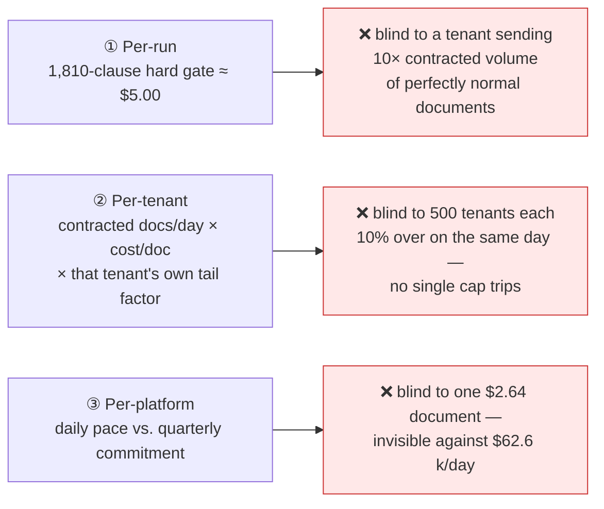
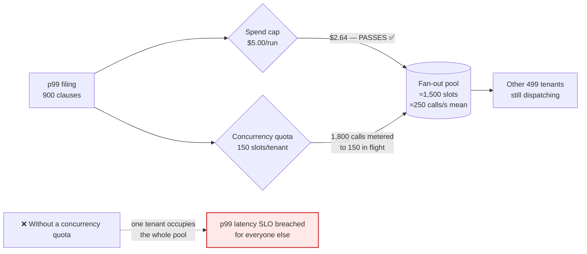
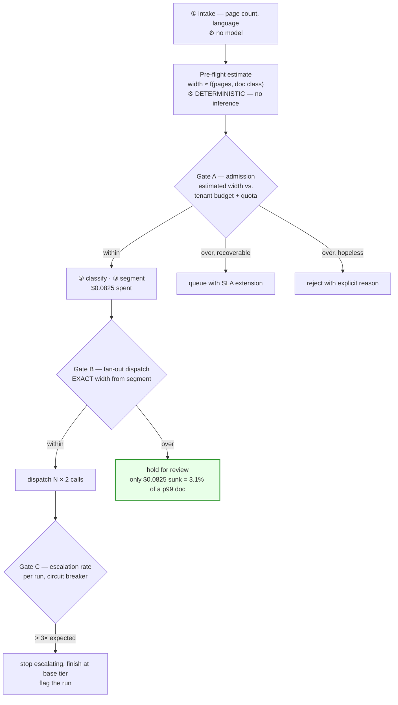
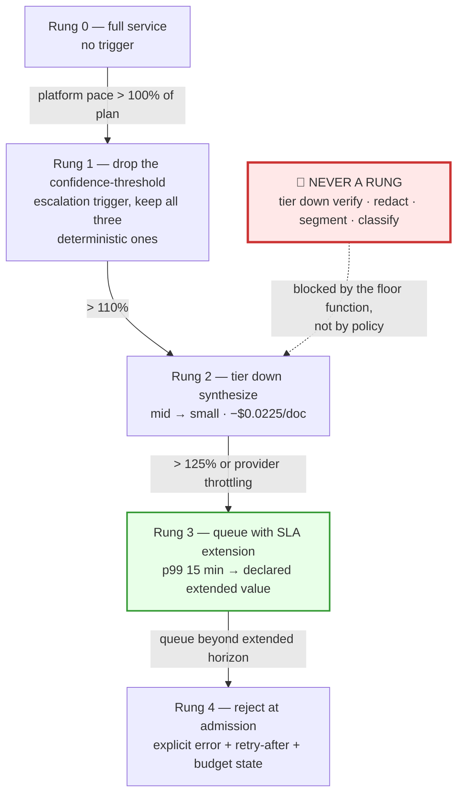
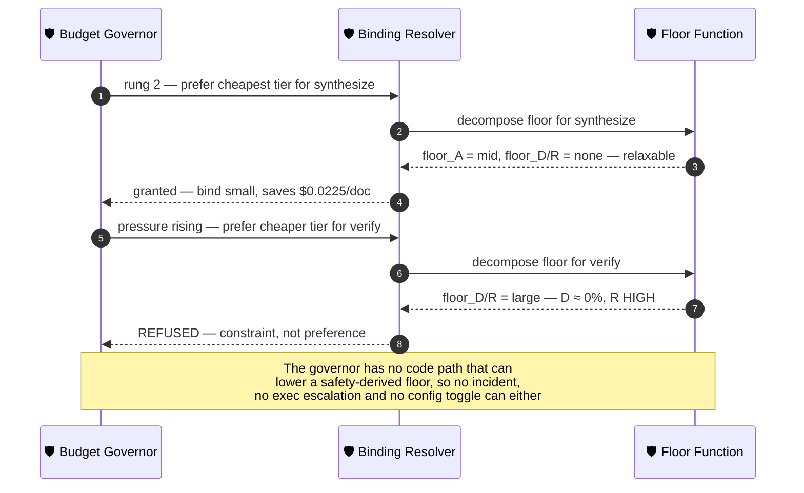
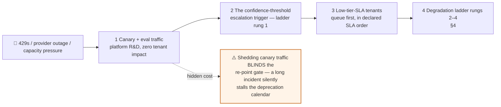

# 09 — Governance & Budgets

> **Principles 7, 8.** Tiering decides what a run *should* cost. Governance is what happens when it
> costs something else — and the one thing it must never be able to do is lower a floor that exists
> for a safety reason.

---

## 1. Three budget scopes, and the gap each one leaves

A single budget scope always fails, and it fails differently depending on which one you picked.

| Scope | Catches | Cannot catch |
|---|---|---|
| **Per-run** | Segmentation regressions, prompt loops, one pathological filing | Volume abuse; correlated overspend |
| **Per-tenant** | Contract breach, volume abuse, one noisy tenant | Anything correlated across tenants |
| **Per-platform** | Re-points, cache stampedes, fleet-wide regressions — every correlated cause | Individual abuse below the noise floor |

**The load-bearing case for scope ③:** at the mean document cost of **$0.6957** (§7), Ledgerline runs
**$62,613/day**. If all 500 tenants land 10% over on the same day — exactly what a re-point, a
shared-prompt edit, or a segmenter regression produces — the overspend is **$6,261/day, $2.29 M/year,
and not one per-tenant cap has tripped.** Per-tenant caps are structurally incapable of seeing a
common cause. Conversely, scope ③ cannot see a runaway document: $2.64 against $62,613 is four decimal
places down. **The scopes are not defence in depth against the same failure — they are three different
failures.**

---

## 2. Quotas are not budgets

Spend caps do not prevent the noisy-neighbour failure from [00](00-overview.md) §8, because spend is
not the resource being exhausted. A p99 900-clause document costs **$2.64** — comfortably inside any
sane per-run budget — while consuming **1,800 fan-out calls** (900 clauses × `extract` + `risk_flag`),
which is **7.5× the p50 document's slice of the shared fan-out pool.**

| Limit | Resource | Ledgerline value | Derivation |
|---|---|---|---|
| **Spend** | Dollars | Soft $2.00/run, hard $5.00/run; per-tenant daily cap per §1 | p99 doc ≈ $2.64, so the hard cap must sit *above* p99 |
| **Concurrency** | Fan-out call slots | **150 in-flight calls/tenant** of a ~1,500-slot pool | 10% ceiling — no tenant can starve the other 499 |

Sizing: 21.6 M fan-out calls/day is **~250 calls/s** mean; at ~2 s per `small` call that is ~500 in
flight, ×3 for business-hours concentration → ~1,500 slots. A p99 document metered to 150 slots
finishes its fan-out in ~24 s, and **twenty simultaneous p99 filings from one tenant take ~8 min —
still inside the p99 ≤ 15 min SLO.** That derivation is the tell: **the quota is sized against the
latency SLO, so it is a latency control, and no amount of spend-cap tuning substitutes for it.**

---

## 3. Admission control, not mid-run termination

The asymmetry: **killing a run at 80% completion wastes everything already spent and delivers
nothing.** A p99 document abandoned after its fan-out has spent ~$2.1 and produced no memo. Budget
enforcement therefore lives at two gates, and neither is a step boundary.

**Gate B is the one that matters, and it is cheap to fail at.** `classify` + `segment` cost
$0.0165 + $0.0660 = **$0.0825 — 3.1% of a p99 document and 13.2% of a p50** — and after `segment`
returns you know the *exact* fan-out width rather than an estimate. Everything expensive is
downstream of the moment the width becomes known, which is a property of this DAG worth exploiting
deliberately rather than by accident.

**Express the cap in clauses, not dollars.** Width-independent cost is $0.3129/doc; marginal cost is
$0.00175/clause plus $0.00084 of expected escalation = **$0.00259/clause**. So a $5.00 cap *is* a
1,810-clause document — 2× the p99 width, 15× the p50. Publishing the cap in the unit the gate can
actually measure before spending is what makes it enforceable at Gate B.

**When the estimate is wrong.** The pre-flight estimator is a regression on page count, not a model —
per README stance #2, spending an inference call to decide whether to spend inference calls
recurses.

| Estimate error | Consequence | Handling |
|---|---|---|
| **Under**-estimate (200 est., 900 actual) | Admitted, then caught at Gate B | Abandon 3.1% of spend, not 80%. Requeue at extended SLA |
| **Over**-estimate (900 est., 120 actual) | A good document is refused | **Over-estimates route to *queue*, never to reject** (§5) |
| Systematic bias per tenant | Chronic mis-gating for one document mix | Estimator is fitted **per tenant**, and its residual is a monitored metric |
| Neither gate sees it | Mid-fan-out escalation storm | Gate C: per-run escalation-rate breaker ([10](10-failure-modes.md) §4) |

---

## 4. The degradation ladder — and the floor it may never cross

| Rung | Trigger | Tenant-visible behaviour | Saving |
|---|---|---|--:|
| 1 | pace > 100% | none — no contractual guarantee moves | the confidence trigger's share of the 12% clause escalation rate |
| 2 | pace > 110% | memo prose is terser; `verify` still gates correctness | **$0.0225/doc — $2,025/day** |
| 3 | pace > 125%, or 429s | documents complete later, against a *declared* extended SLA | defers spend, does not remove it |
| 4 | queue past the extended horizon | explicit rejection with reason and retry-after | all of it |

**Rung 1 is deliberately narrow, and the reason generalises.** [04](04-escalation-ladder.md) §5 lists
four escalation triggers: three deterministic (schema validation, tool-call conformance, rule
coverage) and one not (confidence below threshold). Only the confidence trigger has a *tunable* fire
rate — and [04](04-escalation-ladder.md) already distrusts it, because a threshold calibrated on one
binding changes meaning at the next re-point. So it is the one rung that reduces spend while leaving
every guarantee intact. **The three deterministic triggers are not available to the governor at any
pressure, because they are the inputs to `floor_D`: switching one off raises the node's floor and
therefore *raises* cost** ([10](10-failure-modes.md) §7). A budget control that makes the bill go up
is the clearest possible proof that detectors are not a discretionary expense.

### 4.1 Why `verify` and `redact` can never be a rung — decompose the floor

[02](02-blast-radius-tiering.md) §2 derives a floor as `max(floor_A, floor_D, floor_R)`. Those three
components are **not interchangeable**, and the distinction is what makes this rule principled rather
than arbitrary:

- `floor_A` is **denominated in dollars** — an error wastes downstream *spend*.
- `floor_D` and `floor_R` are **denominated in shipped legal claims** — an error escapes.

> **The budget governor may relax an amplification-derived floor, because both sides of that trade
> are money. It may never touch a detectability- or irreversibility-derived floor, because one side
> is a privilege leak.**

Decomposing [02](02-blast-radius-tiering.md) §5 over the real DAG produces a result worth sitting
with:

| Node | `floor_A` | `floor_D` / `floor_R` | Floor | Governor may relax? |
|---|---|---|---|---|
| classify | large — A = 174× | **large** — D ≈ 50%, R HIGH | large | No — D/R binds |
| segment | large — A = 42× | **large** — D < 60%, R HIGH | large | No — D/R binds |
| extract | none — A = 0.23× | **small** — D = 92%, R LOW | small | No, and already at floor |
| risk_flag | none | **small\*** — conditional on the coverage check | small | No |
| **synthesize** | **mid — A = 2.2×** | none — D = 95%, R LOW | mid | **Yes — one band, to `small`** |
| verify | none — A = 0.86× | **large** — D ≈ 0%, R HIGH | large | No |
| redact | none — A = 0× | **large** — R HIGH, terminal | large | No |

**Exactly one node in the pipeline is relaxable, and the entire budget-pressure tier-down headroom is
$0.0225/doc — 3.2% of the mean document.** That is not a gap to be fixed. It is the correct answer,
and it has two consequences most designs discover the hard way:

1. **A well-tiered platform has a weak degradation ladder by construction.** The 35.2% saving in
   [00](00-overview.md) §6 was banked at design time; the ladder is left with one-tenth of it.
   A governor handed a "save 20%" objective will fail closed and look broken — **feasible savings
   must be computed against the floors before the objective is set.**
2. **Because the trade on `synthesize` is dollars against dollars, it is computable.** Saving
   $0.0225/doc risks a `verify` rejection that costs $0.0075 + $0.1050 = $0.1125 to redo. Baseline
   expected cost is $0.0354/doc at a 4% reject rate, so **rung 2 stops paying once `verify`'s reject
   rate passes ~24.8%.** Ample headroom from 4% — but it must be *watched*, because the rung is only
   ever pulled while other things are also degrading ([10](10-failure-modes.md) §4).

Mechanically, the guarantee is structural, not procedural: the governor emits a *preference*, and
the resolver's `rank >= node.tier_floor` check ([01](01-tier-as-contract.md) §3) rejects anything
below the floor.

---

## 5. The counterintuitive trap: delay is nearly free, rejection is not

For a synchronous service the ladder ends in a slow response. For **this** pipeline the terminal rung
is *not serving the document at all* — and Ledgerline has no cheap human fallback to absorb that.
So the ladder must **exhaust queueing before it rejects**, which inverts the sibling design.

| | Ledgerline — async, no human fallback | SupportAgent sibling — sync chat, `H` = $6.00 |
|---|---|---|
| Latency headroom | p95 ≤ 4 min, p99 ≤ 15 min — **hours available** | p95 in seconds — **none** |
| Tier-down headroom | **3.2%** (§4.1) | large — most nodes above their floor |
| Most expensive terminal | **rejection** — an unreviewed contract, R unbounded | **human escalation** — ~70× the mean conversation's model spend |
| Cheapest relief | **queue** | **tier down + trim context** |
| Ladder order | tier down (small), then queue *hard*, reject last | trim and tier down hard, queue new sessions, escalate last |
| Governor's own failure mode | rejecting work it could have deferred | turning a cheap conversation into an expensive human contact |

The sibling's ladder must escape a human contact; ours must escape a rejection. **Same shape, opposite
direction, because the expensive terminal is different — and the ladder's order is a property of the
workload, not of the tiering scheme.**

Two qualifications against the "delay is free" slogan. **Deferral is cheap, not free** — a queued
document misses the warm cross-tenant prompt cache ([06](06-tenant-attribution.md)) and so costs
slightly *more* per token than one served in the stream. And **queue depth is bounded by the extended
SLA, not by memory**: "queue forever" is rejection with worse ergonomics, because the tenant learns
their document was refused by watching it never finish. Rung 3 publishes the extended horizon; rung 4
fires when the queue exceeds it.

---

## 6. RBAC on the control plane

Because [02](02-blast-radius-tiering.md) makes floors *derived*, "change a tier floor" is not a
config action that exists. Changing a floor means changing a detector declaration or the DAG — an
engineering change, reviewed as code, with the recomputed floor diffed in CI.

| Action | Role | Approval | Why |
|---|---|---|---|
| Change a node's tier **floor** | — | **not a config action** | Floors are computed. Change the DAG or a detector instead |
| **Declare** a detector | Node owner | PR + floor recomputation in CI | Lowers the floor mechanically |
| **Remove** a detector on a fan-out node | Node owner | **+ platform + budget sign-off** | Removing `risk_flag`'s coverage check raises its floor `small` → `large`: **+$1.155/doc, +$103,950/day, +$37.9 M/year — larger than the entire all-`mid` baseline of $31.6 M/year** |
| Re-parent a node in the DAG | Node owner | PR + re-score all downstream floors | Amplification is positional ([02](02-blast-radius-tiering.md) §8.5) |
| Tier change, **singleton** node | Owning team | Team review + pipeline eval green | [02](02-blast-radius-tiering.md) §7 |
| Tier change, **fan-out** node | Owning team | **+ platform + cost forecast + 1% canary + explicit budget sign-off** | `extract` small → mid is **+$28.4 k/day**; `verify` mid → large is +$6.3 k/day |
| **Pin** a pipeline to a version | Owning team | Self-service, 90-day expiry | The tier's `cost_ceiling` ([01](01-tier-as-contract.md) §2) bounds the financial blast radius, which is *why* pinning can be self-service |
| Pin during an incident | On-call | Self-service, **7-day** expiry | An incident pin is not a considered decision |
| **Renew** a pin | Owning team | + platform; must name the failing eval | Converts silent debt into a tracked item |
| **Re-point** the fleet default | Platform | Eval gate green across dependents + cost forecast ([07](07-eval-gated-repointing.md)) | Fleet-wide behavioural change |
| Re-point that strands a capacity commitment | Platform | **+ finance sign-off** | Same class as a fan-out tier change (§7) |
| **Raise a tenant budget** | Commercial / account owner | Contract amendment | A tenant budget is a *contract* term, not a platform setting |
| Change the shedding order | Platform | Pre-declared, change-controlled (§8) | It is effectively a contract term |

**Two separations to enforce in opposite directions.** Engineering must not be able to raise a tenant
budget — that is selling. Commercial must not be able to lower a tier floor — that is shipping an
unsupported legal claim to hit a margin target. Most orgs get the first half and skip the second.

---

## 7. Forecasting and commitments

### 7.1 Forecast from the distribution, never from the headline number

[00](00-overview.md) §6's **$0.6237/doc is a p50 document, not a mean.** Re-weighting the fan-out
over §8's width distribution — 90% at p50, 9% between p90 and p99, 1% above:

| Term | p50-based | Distribution-weighted |
|---|--:|--:|
| Fan-out @ `small` | $0.2100 | **$0.2587** |
| Escalation (12% of clauses at `mid`) | $0.1008 | **$0.1240** (mean width 148, not 120) |
| Width-independent nodes + re-synthesis | $0.3129 | $0.3129 |
| **Cost per document** | **$0.6237** | **$0.6957** |
| Annualised at 90 k/day | $20.49 M | **$22.85 M** |

**A forecast built on the headline per-document figure under-states the annual bill by ~$2.4 M —
10.3% — and this is a lower bound**, because it prices the entire 0–90th band at the p50. The width
distribution it is computed from is not a modelling assumption: it comes off the fan-out spans in
[08](08-observability.md), so the forecast is only ever as good as the instrumentation.

**Now carry it into the governing metric, and the headroom disappears.**
[05](05-cost-per-outcome.md) divides spend by *accepted* memos at a 91% acceptance rate, giving
**$0.6854 per accepted memo** against the ≤ $0.70 SLO — 2.1% of margin. Re-run that division on the
distribution-weighted mean instead of the p50:

`$0.6957 ÷ 0.91 =` **$0.7645 per accepted memo — a 9.2% SLO breach, at today's acceptance rate, with
nothing whatsoever having gone wrong.**

> **The design does not have 2.1% of headroom on its governing SLO. It has none.** The apparent
> margin is an artefact of pricing every document at the p50, and the fan-out tail eats all of it.
> This is the single most important consequence of budgeting on the distribution, and it changes what
> the ladder in §4 is *for*: it is not an optimisation, it is how a design that is already at its
> cost SLO absorbs a bad week.

**Corollary that the ±15% per-tenant forecast SLO forces:** a 10.3% understatement is inside ±15%
*for the platform* and nowhere near it for a tenant whose mix is tail-heavy — a tenant filing mostly
large agreements has a mean nearer $2. **Forecast each tenant from that tenant's own width
distribution; the platform's distribution is only valid for the platform.**

### 7.2 A capacity commitment is a pin that procurement bought

A commitment of N tokens/quarter to one provider is a **fleet-wide soft pin**, and it fights the
registry's "cheapest tier that satisfies" independence directly. Name the tension plainly: **a
capacity commitment is a financial pin with no expiry date and no eval gate** — the exact
anti-pattern [01](01-tier-as-contract.md) §7 lists, imported through procurement rather than
engineering. It is still often the right deal, under three conditions: its term is **shorter than the
90-day pin horizon**, so it can never outlive the engineering escape hatch it constrains; it is
**recorded in the registry** as an explicit expiring preference, so a re-point review sees it; and it
is **never grounds to pass a failed conformance suite.** Size it against a *tier's* floor volume,
not a model's.

### 7.3 A re-point mid-quarter invalidates the forecast twice

Price per token moves, and *consumption* moves — tokenisation, output verbosity, and above all the
escalation rate, which is the largest variable term in §7.1 ($0.1240/doc). So the forecast is
**re-baselined from the 1% canary** ([07](07-eval-gated-repointing.md)), before full rollout, not
after. And the commitment interacts: re-pointing away from a committed provider strands the
commitment, which is why that case carries finance sign-off in §6.

---

## 8. Shedding order under throttling or an outage

- **Shed work that has not started before work that has.** A document mid-fan-out has real sunk cost
  and produces nothing if abandoned (§3). New documents queue; in-flight documents finish.
- **The order must be pre-declared.** Deciding during an incident means deciding *which tenant to
  disappoint* under time pressure — a commercial decision made by whoever is on call. Worse, the
  first incident's improvised order becomes the de facto contract, because tenants remember it.
  Pre-declaration also makes the shed auditable against the SLA tiers afterwards.
- **The hidden cost of rung 1:** canary traffic is the cheapest thing to shed and the only thing that
  proves a candidate binding is safe. A multi-day throttling event with canary shed to zero quietly
  pushes every pin expiry and deprecation deadline ([01](01-tier-as-contract.md) §5) to the right.
  Track canary debt as a backlog item, not as a dashboard that went flat.

---

## 9. Chargeback governance

| Question | Answer |
|---|---|
| Who owns the **cost** per document? | Platform. It publishes cost/doc and its distribution (§7.1) |
| Who owns the **price** per document? | Commercial. Price is a contract term; margin is theirs to set |
| Can the platform change published cost/doc mid-quarter? | Only with notice — commercial has already priced against it |
| Who pays for a tier change that alters cost? | **The platform, 100%** — see below |
| Who pays for canary and eval traffic? | Platform R&D. **Never billed to a tenant** ([06](06-tenant-attribution.md)) |

**The crux: the Ledgerline contract is per document, so the tenant's price does not move when a tier
does. The platform absorbs 100% of tier-change cost variance.** Two things follow.

1. **That is the right allocation** — a tenant cannot evaluate a tier decision and should not be
   asked to. But it converts every tiering decision into a *margin* decision, which is precisely why
   fan-out tier changes need budget sign-off ([02](02-blast-radius-tiering.md) §7): `extract`
   small → mid is a $28.4 k/day margin event with no invoice line anywhere.
2. **The ≤ $0.70 cost-per-accepted-memo SLO is a margin guarantee wearing a cost SLO's clothes.** It
   is the number the per-document price was set against. Breaching it does not degrade the product;
   it degrades the P&L, silently, which is the hardest kind of breach to get attention for.

**Separate the two communication channels.** A tier change that alters *cost* goes to finance. A tier
change that alters *behaviour* goes to tenants, through the eval gate
([07](07-eval-gated-repointing.md)). Conflating them is how a routine cost optimisation becomes a
customer escalation — and how a genuine behavioural change gets announced as a cost note nobody reads.

Finally, on unbilled traffic: **"never billed" must not become "never budgeted."** Canary and eval
spend needs a named owner and a cap, and it must be *taggable as R&D at call time* — otherwise it
lands in a tenant's bill and takes the ±15% forecast SLO with it
([10](10-failure-modes.md) §10).

---

## 10. Design-review questions

1. Which of the three budget scopes do we actually have, and for each one we lack, what correlated
   failure is currently invisible?
2. Is there a per-tenant **concurrency** quota, or only a spend cap? What happens to the p99 latency
   SLO when one tenant submits twenty 900-clause filings at once?
3. Where is the budget enforced? If the answer includes a step boundary inside the fan-out, what
   fraction of a p99 document's spend does a kill there waste? Is the cap expressed in dollars or in
   fan-out width — and can Gate B evaluate it *before* dispatching?
4. Decompose every node's floor into `floor_A` and `floor_D/R`. How many nodes can the governor
   legally tier down, and what is the total feasible saving? If nobody has computed it, the governor
   has an infeasible objective.
5. Is there any code path — config, feature flag, incident runbook, exec override — by which budget
   pressure can lower `verify`'s or `redact`'s tier? That must be a hard no, enforced by the
   resolver, not by a policy document.
6. Does the ladder reject before it has exhausted queueing? On an async pipeline that is strictly
   worse than delaying.
7. Is the quarterly forecast built on the mean or on the p50 — and is any *tenant* forecast built on
   the platform's width distribution rather than its own?
8. Do we hold provider capacity commitments that outlive the 90-day pin horizon, and are they
   recorded in the registry where a re-point review would see them?
9. Is the shedding order written down and agreed with commercial *before* the next incident, and what
   is unallocated spend as a share of the bill?

Continue to [10 — Failure modes](10-failure-modes.md).
