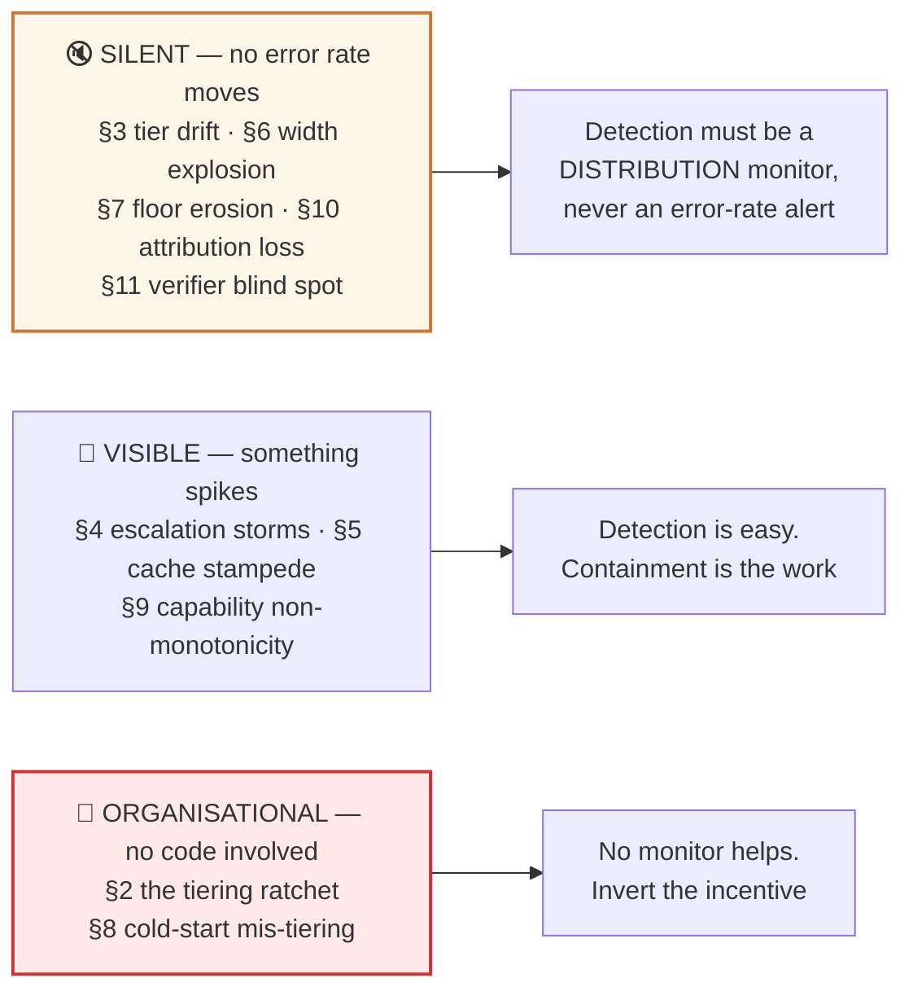
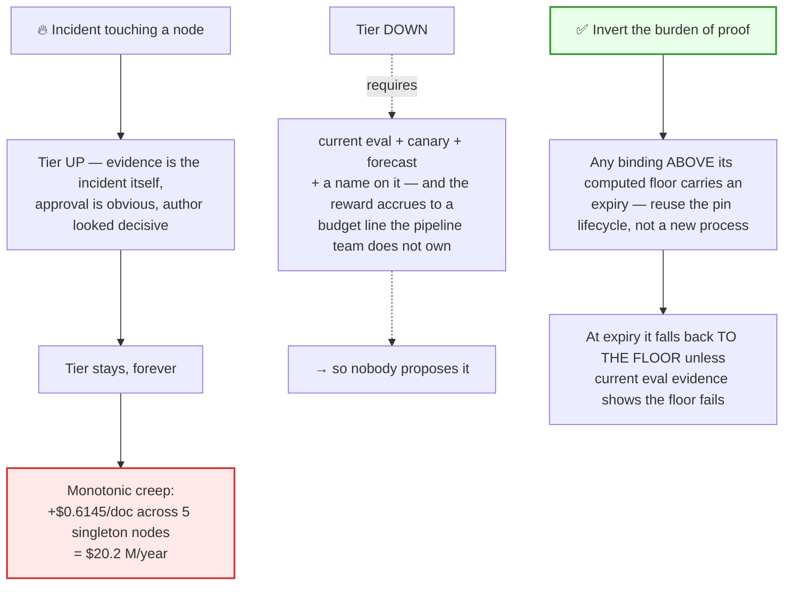
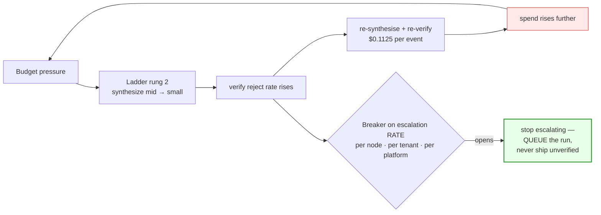
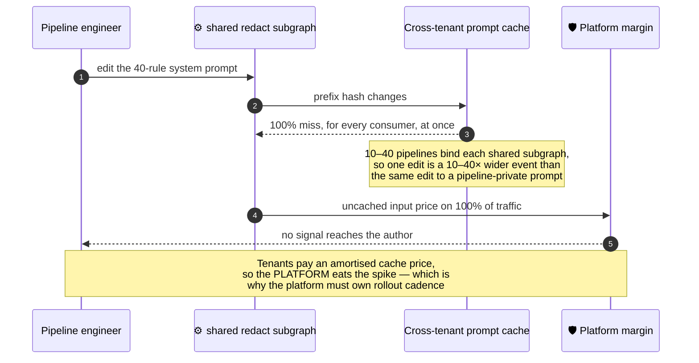

# 10 — Failure Modes & Resilience

> **Principles 1, 5, 8.** Most tiering failures do not raise an error rate. The expensive ones are
> silent by construction, and the most expensive one is organisational — a process that only ever
> moves tiers in one direction.

---

## 1. The map

Classify by *how it announces itself*, because that determines what kind of monitor can catch it.

**Every cost failure in this document is invisible to quality metrics, and several of them make
quality slightly *better* while doubling the bill.** A platform whose only tiering alerts are
error-rate alerts is unmonitored.

---

## 2. The tiering ratchet — the most expensive failure here

**Symptom.** Tiers go up after every incident and never come back down. No single decision looks
wrong. Cost creeps monotonically, quarter over quarter, with a defensible incident postmortem behind
each step.

**Quantified.** One unnecessary tier-up on each singleton node, from the blast-radius assignment in
[00](00-overview.md) §6:

| Node | Ratcheted | Δ/doc |
|---|---|--:|
| classify | large → frontier | +$0.0355 |
| segment | large → frontier | +$0.1340 |
| synthesize | mid → large | +$0.0600 |
| verify | large → frontier | +$0.2250 |
| redact | large → frontier | +$0.1600 |
| | | **+$0.6145** |

**$0.6237 → $1.2382/doc — the document almost doubles.** At 90 k docs/day that is **$55,305/day,
$20.2 M/year**, and the endpoint is *28.6% worse than the all-`mid` baseline the design set out to
beat* ($0.9625). It also quietly falsifies [00](00-overview.md) §3's "frontier — reserved, nothing in
Ledgerline currently justifies it": the ratchet is the process by which that sentence stops being true
without anyone deciding it should.

**The non-obvious part: governance displaces the ratchet, it does not stop it.**
[02](02-blast-radius-tiering.md) §7 gates fan-out tier changes behind budget sign-off — so the ratchet
climbs the **ungated singletons** instead. They are 12.7% of the bill, so each step looks like $0.03
to $0.22 and passes without argument. Five of them sum to more than the entire pipeline.

**Detection.** Not a cost alert — by the time cost moves, the argument is lost. Track **floor
headroom**: the distribution of `bound_tier_rank − computed_floor_rank` across every node on the
platform. It should sit near zero and it should not trend, so **alert on the drift, not the level.**
Secondary signal: tier changes per quarter *by direction* — 40 up and 2 down is a ratchet regardless
of how each one read on the day.

**Containment.** README stance #6, made mechanical: an over-floor binding is the *same object* as a
pin ([01](01-tier-as-contract.md) §5), with the same 90-day expiry and the same fallback. At expiry it
drops to the floor unless the owning team produces a current eval showing the floor fails. Reusing the
pin lifecycle matters — a second bespoke review process is a process nobody runs.

**Cost.** $20.2 M/year, accrued in increments too small to review. **SLO at risk:** cost per accepted memo ≤ $0.70.

---

## 3. Tier drift

**Symptom.** Same `model_id`, same version string, different behaviour. The provider changed a serving
stack, quantisation, or routing tier; or the binding was an alias
([01](01-tier-as-contract.md) §7) and it moved. **Silent by construction** — there is no event,
because from your side nothing changed.

**Detection.** Two layers, and the second is the one that fires first in practice.

| Layer | Mechanism | Latency to detect |
|---|---|---|
| Periodic conformance re-run | Run the tier's conformance suite ([01](01-tier-as-contract.md) §4) against the **live binding**, on a schedule — not only against candidates | Hours to days |
| Behavioural monitors | **Escalation rate per node** (already instrumented for cost), structured-output conformance rate, output-length distribution, refusal rate, cache-hit rate | Minutes to hours |

**Escalation rate is the best single drift monitor on this pipeline**, because it is a
quality-sensitive signal that is *already* a cost signal, so it is already on a dashboard somebody
looks at.

**Containment.** Binding history is append-only ([01](01-tier-as-contract.md) §4), so you can diff
what changed and roll back; the previous fleet default is always conformance-passed, so the rollback
target is guaranteed valid. Structurally: **never bind an alias**, which turns this class from
undetectable into merely silent.

**Cost.** Drift that makes clauses marginally harder shows up as escalation, not as errors. Escalation
rising from 12% to 25% on the fan-out costs **+$0.1092/doc, $9,828/day, $3.59 M/year — with every
quality metric flat or improved**, because escalation *fixed* the outputs. This is the canonical
quality-preserving cost regression, and it is why cost-per-outcome ([05](05-cost-per-outcome.md)) is
the metric that catches it. **SLO at risk:** cost per accepted memo; per-tenant forecast ±15%.

---

## 4. Escalation storms

**Symptom.** Positive feedback. Degradation raises the rejection rate, which raises escalation, which
raises spend — at precisely the moment spend is already the problem. **The degradation ladder in
[09](09-governance-and-budgets.md) §4 closes the loop itself.**

**Detection.** Escalation **rate** over a window, not escalation count — count rises with volume and
tells you nothing. Three scopes, because a storm can be one tenant's document mix, one node's drift,
or a fleet-wide re-point. The per-hop spans that make this measurable are
[08](08-observability.md)'s; the ladder being measured is [04](04-escalation-ladder.md)'s.

**Containment.** A circuit breaker per node, plus per-run Gate C
([09](09-governance-and-budgets.md) §3). Two design rules. **The breaker's fallback is `queue`, never
`ship at the base tier`** — the safety-floor argument applies to the breaker too, since a breaker that
can ship unverified output is a code path that lowers a `floor_D/R` under load, which
[09](09-governance-and-budgets.md) §4.1 forbids. And **the breaker converts a cost event into a
latency event**, which the async SLO absorbs — a trade that exists only because the workload is
asynchronous. On a streaming pipeline the same breaker is a visible outage.

**Cost.** Fan-out escalation at 60% instead of 12% costs **+$0.4032/doc, $36,288/day.** The ladder's
own loop is cheaper but sharper: rung 2 saves $0.0225/doc and stops paying once `verify`'s reject rate
passes **24.8%** (up from 4%) — ample headroom, but the rung is only ever pulled while other things
are degrading, which is exactly when that headroom is being spent. **SLO at risk:** cost per accepted memo; p99 latency ≤ 15 min.

---

## 5. Cache stampede

**Symptom.** Cost spikes with **no traffic change and no quality change.** Someone edited a shared
system prompt, so the cross-tenant prompt cache for that prefix went to 100% miss for every consumer
simultaneously.

**Detection.** Cache-hit rate **per prefix**, not blended — a blended figure hides a single prefix
going to zero. The alert signature is the diagnostic: **cost up, volume flat, quality flat.** Any
monitor that requires two of those three to move will miss it.

**Containment.** Staged prompt rollout: version the prefix and roll 5% → 25% → 100% so the cache
refills in tranches and the spike is amortised rather than instantaneous. Never *edit* a shared prefix
in place — append a new versioned prefix and migrate consumers, which also makes rollback a routing
change rather than a second stampede.

**The incentive problem is the real finding.** Because [06](06-tenant-attribution.md) prices cache
warmth as a blended, amortised rate, the tenant's bill does not move and the platform absorbs the
spike — so a pipeline team's prompt edit costs the platform money and costs the team nothing.
**Prompt-rollout cadence on a *shared* subgraph is therefore a platform-controlled change, in the same
class as a fleet re-point ([07](07-eval-gated-repointing.md)), not a team's deploy.**

**Cost.** Scales with the number of pipelines bound to the subgraph — **10–40× the blast radius of an
identical edit to a private prompt** — for the duration of the refill window. **SLO at risk:** cost per accepted memo; per-tenant forecast ±15%.

---

## 6. Fan-out width explosion

**Symptom.** A segmentation regression turns a 120-clause document into 900 segments. **Nothing
breaks.** Each of the 900 segments extracts correctly, `verify` passes because every claim is
supported by a cited span, the memo may even read *better* for being more granular — and the bill
multiplies.

**Cost.** At $0.00175/clause plus $0.00084 of expected escalation: 120 → 900 clauses across the fleet
is **+$2.0202/doc, $181,818/day — more than double the entire all-`mid` baseline of $86,625/day.**
Error rate movement: zero.

**Detection.** On the **width distribution**, never on error rates — this is the cleanest example in
the design of a cost failure that quality metrics cannot see. Three refinements that matter:

1. **Alert on segments *per page*, not raw width.** Raw width fires every time a tenant onboards
   large filings; segments-per-page survives a genuine change in the document mix. Raw width is the
   metric everybody builds first and then mutes.
2. **Alert per tenant and per document class**, because the platform p99 (900 clauses) is a *normal*
   document for some tenants and a red flag for others.
3. **Make the monitor two-sided.** Under-segmentation is the *cheaper* direction and the dangerous
   one: it silently drops obligations spanning a boundary ([02](02-blast-radius-tiering.md) §2), which
   `verify` cannot see. **A width monitor that only alarms upward is a cost monitor masquerading as a
   quality monitor.**

**Containment.** Gate B in [09](09-governance-and-budgets.md) §3 — a width above the tenant's declared
p99 does not dispatch, it holds for review, with only $0.0825 sunk. **SLO at risk:** cost per accepted memo; unsupported-claim rate ≤ 0.05% (downward direction);
p99 latency.

---

## 7. Floor erosion

**Symptom.** A detector is removed or silently disabled, so a node's real detectability collapses
while its tier stays low. This is [02](02-blast-radius-tiering.md) §6's conditional coming due:
`risk_flag` is `small` **only** because a deterministic coverage check raises D to ≈97%.

**Detection.** Two distinct cases, and the second is much harder.

| Case | Detection |
|---|---|
| Detector **removed** from the declaration | Free — floors are *computed* from declared detectors, so CI shows the floor moving in the PR diff |
| Detector declared and deployed but **silently no-oping** — empty rule list, flag off, exception swallowed | **Detector fire rate.** A coverage check that has caught nothing in 7 days is either perfect or dead, and the base rate says dead |

The second case is why a declared detector must emit a heartbeat carrying a **non-zero evaluation
count**, and why zero evaluations for N hours must fail the pipeline's readiness check — which raises
the floor at runtime rather than waiting for someone to notice.

**Containment.** The floor is a function of the declared detector set, recomputed on every deploy
([02](02-blast-radius-tiering.md) §6.1). Removal is mechanically expensive rather than quietly free.

**Cost.** Removing `risk_flag`'s coverage check raises its floor `small` → `large`: **+$1.155/doc,
$103,950/day, $37.9 M/year — larger than the entire all-`mid` baseline bill of $31.6 M/year, from
deleting one line of a detector manifest.** That is the cost when the floor rises *correctly*. The
cost when it does not rise is a silent collapse of the omission-detection story: the ≤ 6% human
rejection rate is the only remaining signal, and it is lagging and low-powered (§11). **SLO at risk:** unsupported-claim rate ≤ 0.05%; human rejection rate ≤ 6%.

---

## 8. Cold-start mis-tiering, and the circularity

**Symptom.** A new node has no production data, so D cannot be measured — but you need a binding to
get production data. [02](02-blast-radius-tiering.md) §8.2 names the circularity; §9 resolves it with
"assume D = 0 unless a detector is declared, never below `mid` for 30 days."

**The failure is not the expensive first binding — it is that the 30-day re-score never happens.**
`mid` becomes permanent, and the cold-start policy has become an entrance for the ratchet (§2).

**Detection.** A binding whose `cold_start_expires_at` has passed without a re-score is a hard CI
failure, not a dashboard row. And within the window, the node must be *instrumented for D*: shadow-run
the intended detector and measure its catch rate. Honest caveat — **a detector's catch rate bounds D
from below only**; failures the detector cannot represent are not in the measurement at all.

**Containment.** The 30-day `mid` floor, plus one addition: a cold-start node in a **fan-out** position
must not launch at full volume. Canary at 1% ([02](02-blast-radius-tiering.md) §7), because the
observation window on a fan-out node is not free.

**Cost.** An `extract`-shaped node observed at `mid` instead of `small` for 30 days costs
**$28.4 k/day × 30 = ~$0.85 M** — the price of resolving the circularity. Worth paying **once per node**,
which is the entire argument for enforcing the re-score. **SLO at risk:** cost per accepted memo.

---

## 9. Capability non-monotonicity

**Symptom.** Escalating "up" lands on a tier that is *worse* on the dimension the node needs
([01](01-tier-as-contract.md) §3 — capability is a partial order, only price is totally ordered). The
sharpest instance is the refusal profile from [01](01-tier-as-contract.md) §2: **a more cautious model
declines to summarise an aggressive limitation-of-liability clause.** Higher tier, worse outcome,
higher bill.

**Detection.** Two signals, both of which most platforms lack.

- **Post-escalation failure rate per `(source_tier, target_tier)` pair.** A pair whose post-escalation
  failure rate exceeds its *pre*-escalation rate is non-monotonic on that node's requirements. Blended
  across pairs, this is invisible.
- **Refusal rate as a first-class metric, tagged by tier.** Refusals arrive as *empty or hedged
  outputs*, not as errors — they land in the success bucket of every naive counter.

**Containment.** Escalate to the next tier that **satisfies** the node's `requires`, not the next tier
by rank ([01](01-tier-as-contract.md) §3). And bound the ladder depth: **on a refusal, terminate into
a human queue rather than climbing** — otherwise the ladder spends `large` and then `frontier` on
exactly the clauses a human will read anyway.

**Cost.** A clause escalated `small` → `mid` costs $0.00175 + $0.0070 = **$0.00875 and yields
nothing.** The uncontained version is worse than the double charge: if the run silently drops the
refused clause, the failure converts from cost into **omission**, which §11 cannot see. **SLO at risk:** unsupported-claim rate; human rejection rate; cost per accepted memo.

---

## 10. Attribution loss

**Symptom.** A shared subgraph (`retrieval`, `verify`, `redact`) drops the tenant tag. The bill is
correct in total and unallocatable in detail.

**It is not backfillable, and that is the whole problem.** The call record is the only place the
tenant was ever known at that point in the graph; the subgraph has no tenant context of its own to
reconstruct from, and the join key is gone. There is no repair job to write.

**Detection.** Unallocated spend as a share of the bill — **alerted at a fraction of one percent**,
because the ±15% per-tenant forecast SLO is consumed by it directly, and because nobody ever
complains about a bill they did not receive.

**Containment.** Reuse the pattern from [01](01-tier-as-contract.md) §3's empty-`requires` rule:
**a model call with no `tenant_id` is a validation error at the client boundary, not a warning.** Fail
the call, not the tag. Where the tag is genuinely absent — canary and eval traffic — it must be
positively tagged as platform R&D ([09](09-governance-and-budgets.md) §9), so "unallocated" means
"bug" and never "R&D".

**Cost.** 100% platform margin, silently. **SLO at risk:** per-tenant bill forecast accuracy ±15%.

---

## 11. The verifier blind spot, and the honest residual

`verify` checks **precision, not recall** ([02](02-blast-radius-tiering.md) §2): it confirms every
claim in the memo is supported by a cited span. It cannot confirm every obligation *in the contract*
reached the memo. **Every omission failure in this pipeline is invisible to its only quality gate.**

| What covers it | What it actually proves | Residual |
|---|---|---|
| Deterministic coverage checks ([02](02-blast-radius-tiering.md) §6) | Every rule was **evaluated** against every clause | Proves process, not judgement |
| Two-sided width monitor (§6) | Segmentation did not *under*-segment abnormally | Blind to a uniformly slightly-coarse segmenter |
| Human rejection rate ≤ 6% ([00](00-overview.md) §7) | An independent, out-of-band signal | Lagging, sampled, low-powered |
| `large` floors on `segment` and `redact` | Insurance, not detection | Costs money and proves nothing |

The human-rejection signal deserves an honest read. At ≤ 6% over 90 k docs/day that is **~5,400
rejections/day**, which sounds like abundant signal until you ask how many were rejected *for an
omission* rather than for prose — a distinction nobody records unless the rejection UI asks for it.
**Make the rejection reason a required, enumerated field, or the only independent check on the
system's blind spot is uncategorised.**

> **The residual, stated plainly: omissions that are individually plausible and collectively rare are
> undetected by construction.** No detector proposed here changes that. It is the reason `segment`
> and `redact` carry `large` floors as insurance against a failure the system cannot observe — and
> therefore the reason budget pressure must never be able to lower them
> ([09](09-governance-and-budgets.md) §4.1). The two docs close on each other: the blind spot is what
> makes the floor invariant load-bearing rather than fussy.

---

## 12. Resilience summary

| Failure | Detection signal | Containment | Cost impact | SLO at risk |
|---|---|---|--:|---|
| **Tiering ratchet** | Floor-headroom drift; tier changes by direction | Over-floor bindings expire to the floor; eval needed to *retain* | **$20.2 M/yr** | cost/memo ≤ $0.70 |
| **Tier drift** | Scheduled conformance re-run vs. live binding; escalation rate | Roll back via binding history; never bind an alias | $3.59 M/yr at 12→25% escalation | cost/memo; forecast ±15% |
| **Escalation storm** | Escalation *rate* per node/tenant/platform | Breaker → queue, never ship unverified | $36 k/day at 60% escalation | cost/memo; p99 ≤ 15 min |
| **Cache stampede** | Per-prefix cache-hit rate; cost↑ volume flat quality flat | Staged prefix rollout, platform-owned cadence | 10–40× a private-prompt edit | cost/memo; forecast ±15% |
| **Width explosion** | Segments **per page**, per tenant, two-sided | Gate B refuses dispatch above declared p99 | **$181.8 k/day** | cost/memo; unsupported-claim |
| **Floor erosion** | Floor recomputed in CI; **detector fire rate** | Floor is a function of declared detectors | $37.9 M/yr if the floor rises | unsupported-claim; rejection ≤ 6% |
| **Cold-start mis-tiering** | Expired `cold_start` re-score = CI failure | 30-day `mid` floor + 1% canary on fan-out | ~$0.85 M per fan-out node | cost/memo |
| **Non-monotonicity** | Post-escalation failure rate per tier *pair*; refusal rate | Escalate to a tier that *satisfies*; bound the depth | double charge, or an omission | unsupported-claim; rejection |
| **Attribution loss** | Unallocated spend share, alerted sub-1% | Missing `tenant_id` = validation error at the edge | 100% platform margin | forecast ±15% |
| **Verifier blind spot** | Coverage checks + enumerated human rejection reasons | `large` floors as insurance; floors never relaxable | unbounded (R HIGH) | unsupported-claim ≤ 0.05% |

---

## 13. Design-review questions

1. How many tier changes did we make last quarter, and how many were **downward**? What is the
   floor-headroom distribution, and is it trending?
2. Is any over-floor binding permanent? If so, what current eval evidence justifies *retaining* it —
   not what justified adopting it.
3. When did we last run each tier's conformance suite against the **live** binding rather than a
   candidate? If the answer is "at adoption", tier drift is undetectable. Is any binding an alias?
4. Is the escalation breaker's fallback `queue` or `ship`? If `ship`, we have a code path that lowers
   a safety floor under load.
5. Who can edit a shared subgraph's system prompt, does the rollout stage, and do the people paying
   for the stampede know they are paying?
6. Do we alert on fan-out width **per page** and in **both directions**? A one-sided width alert
   cannot see the omission failure.
7. For every conditional floor, what is the detector's **fire rate** over the last 7 days? A silent
   detector and a working one look identical in the declaration.
8. Which cold-start bindings are past their re-score date? Each is a permanent `mid` waiting to happen.
9. Does the escalation ladder verify its target *satisfies* the node's `requires`, or does it step by
   rank? What is our refusal rate by tier?
10. What share of spend is unallocated, and would a missing `tenant_id` fail the call or just log?
11. Are human rejections recorded with an enumerated reason? If not, name the signal that covers the
    verifier's recall blind spot.

Continue to [11 — Migration & rollout](11-migration-and-rollout.md).
