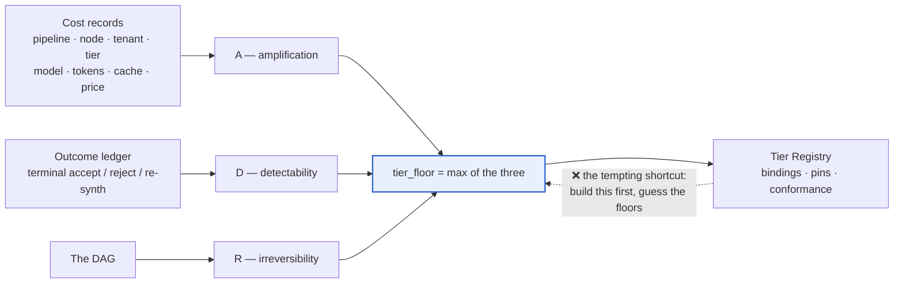
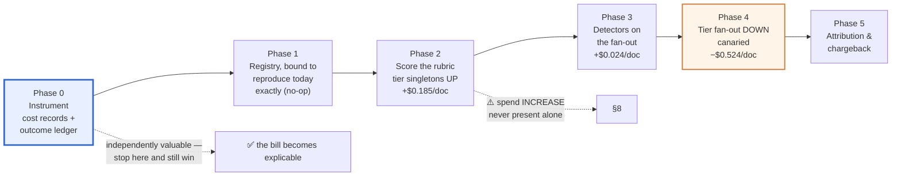
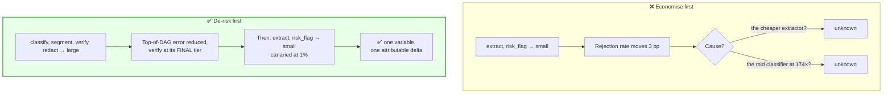
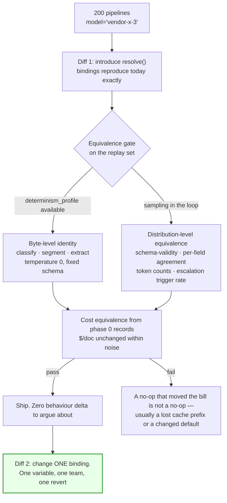

# 11 — Migration & Rollout

> **Principle 7.** Nobody starts here. The starting position is ~200 pipelines with a model identifier
> as a string literal, no per-node cost attribution, and no evidence about which nodes carry the blast
> radius. This doc is the path from there to here, with an entry criterion, an exit criterion, and a
> rollback for every phase.
>
> The counterintuitive part of the sequence: **the first tier change you ship should raise the bill.**
> §3 and §8 are why, and §8 decides whether the programme survives its second review.

---

## 1. Do not start with the registry

The registry is the visible artifact, so it is the natural place to begin, and it is the wrong one.
**Two of the three inputs to the [02](02-blast-radius-tiering.md) rubric are measurements**, and you
cannot take them without call records.

| Rubric input | Definition | Where the number comes from | Available on day one? |
|---|---|---|:--:|
| **A** — amplification | downstream pipeline spend ÷ this node's own cost | per-node cost records summed over real traffic | ❌ |
| **D** — detectability | share of this node's errors caught before delivery | detector outcomes joined to the terminal accept/reject | ❌ |
| **R** — irreversibility | what an escaped error costs | output reachability, readable straight off the DAG | ✅ |

Build the registry first and you set floors from DAG shape and intuition — the *"what feels right"*
anti-pattern [01](01-tier-as-contract.md) §7 rules out — except now the registry's authority is
attached to the guess, and the guess is expensive to revisit.

### Phase 0 in detail

**Entry criterion.** Calls are reaching a provider and "which node spent last month's bill" cannot
be answered without a spreadsheet.

| Exit criterion | Threshold | Why the bar is there |
|---|---|---|
| Cost records emitted | **≥ 99% of platform calls**, in the [08](08-observability.md) schema | A is a *ratio* — a node instrumented at 90% has an A estimate wrong by an unknown amount in both terms |
| A computed, not guessed | ≥ 30 days of traffic including a p99 900-clause document ([00](00-overview.md) §8); aggregate reconciles to the provider invoice | The ±15% per-tenant forecast SLO is unreachable if the aggregate does not reconcile first |
| Outcome ledger live | Each terminal outcome linked to every call that produced it ([05](05-cost-per-outcome.md)) | Makes *cost per accepted memo* (≤ $0.70) a query rather than an estimate |
| D measured or zeroed | Measured where a detector exists, **recorded as 0 where none does** | An undeclared detector is a fact about the node, not a missing measurement ([02](02-blast-radius-tiering.md) §9) |

**Rollback: none required**, which is the argument for going first. Phase 0 adds emission and storage,
changes no model on any node, and reverts by disabling an emitter. **It is the only phase here with no
behavioural surface** — hence the only one that ships without a negotiation.

**Independently valuable before any tiering decision.** Cost records find spend no tier change would
have touched: retries at the same tier with the same prompt, duplicated shared-subgraph calls in one
document, cache prefixes that churn between calls, a node shipping 25 k tokens of context where 5 k is
read. None of it is a tiering question and none of it has a quality surface. **The size of that saving
is unknown until you measure — which is itself the argument for measuring** — and §8 depends on it
arriving first.

---

## 2. The phase ladder

| Phase | Entry criterion | Exit criterion | Rollback |
|---|---|---|---|
| **0** Instrument | Calls in production, bill unexplained | §1's four criteria | Disable the emitter — no behavioural surface |
| **1** Registry + no-op re-point | Phase 0 exit met | Zero literal model identifiers outside the registry across all ~200 pipelines; every call resolves through the binding resolver; replay equivalence proven (§4); dependency graph populated for all 200 | Revert the binding to the prior `model_id`. **Config, not a deploy** — and provably a no-op in both directions |
| **2** Score rubric, tier singletons **UP** | Phase 1 exit; A computed from records, not guessed | Every singleton node bound at its derived floor — on Ledgerline `classify`, `segment`, `verify`, `redact` → `large`, **+$0.185/doc**; unsupported-claim rate held ≤ 0.05%; every derivation audited | Revert per node. **The only rollback here that makes the system less safe** — so it carries the same sign-off as the change did |
| **3** Detectors on the fan-out | Phase 2 stable 30 d | Every fan-out node has a *declared* detector with a *measured* catch rate — on Ledgerline the playbook coverage check takes `risk_flag` from contested to D ≈ 97% at **+$0.024/doc** | Remove the detector and the floor **mechanically** rises to `large` ([02](02-blast-radius-tiering.md) §6). Rolling back a detector is automatically rolling back the tier-down it authorised |
| **4** Tier fan-out **DOWN** | Phase 3 exit; catch rate measured ≥ 30 d; cost forecast + budget sign-off ([02](02-blast-radius-tiering.md) §7) | `extract`, `risk_flag` at `small` at 100%; human rejection ≤ 6%; measured escalation ≤ 12% of clauses; cost/accepted memo ≤ $0.70 | Re-point two bindings. Ramp **1% → 5% → 25% → 100%**, each step held a full weekly cycle |
| **5** Attribution & chargeback | Phase 4 stable; cache facts emitted per call | Per-tenant forecast within ±15% monthly; cache amortisation policy published and defended; statements reconcile | **Chargeback → showback.** Stop billing teams, keep reporting. Config, not code |

**Phase 3's rollback is the elegant one, and it is not an accident.** Because the floor is a function
of the declared detectors rather than a stored number, deleting the coverage check raises
`risk_flag`'s floor without anyone remembering to. **Design phases so that undoing the enabler undoes
the thing it enabled.**

**Phase 5 comes last for a reason that is easy to get wrong.** Chargeback changes incentives: ship it
before floors are structural and you have created budget pressure on teams who can relieve it by
lowering a floor — the one thing this design forbids at any price. Attribution is safe only once the
floor is a derived property that a budget conversation cannot reach.

---

## 3. Why tiering UP comes before tiering DOWN

Four reasons, in ascending order of how hard they are to argue with:

1. **It is the phase that gets approved.** The four singleton nodes are 12.7% of the bill
   ([00](00-overview.md) §5), and no reviewer will argue that `verify` — the only quality gate, with
   **nothing checking it** — should stay on `mid` to save $0.07/doc.
2. **It removes an error source before adding one.** Tier the fan-out down first and you have added
   error mass at the bottom of a DAG whose top still misclassifies at 174× amplification.
3. **It makes phase 4's canary measurable** — a methodology argument, not a safety one. A canary
   compares human rejection rate before and after; move `classify` and `segment` inside the same
   window and a 3 pp regression has two candidate causes and no way to separate them.
4. **Tier the detector before you tier the thing it detects.** `verify` *is* the detector that gives
   `extract` its D = 92% and that fires escalation. An escalation rate measured while `verify` sits on
   `mid` is measured against a weaker checker and **will not survive `verify` moving to `large`**, so
   [00](00-overview.md) §6's "12% of clauses re-run at `mid`" is only meaningful once `verify` is final.
   Run phase 4 first and you build the cost model twice — and the programme's first shipped change is a
   −$17.2 M/yr cut, which is read as cost-cutting forever after (§8).

---

## 4. The no-op re-point — a technique worth naming

Phase 1 ships the indirection with **byte-identical behaviour**: `resolve(node, registry)` replaces
every string literal, and every binding resolves to exactly the `(provider, model_id, version)` the
literal named.

**Splitting it into two diffs is a review-scope argument.** One diff that both introduces the registry
and changes a model forces every reviewer to answer two questions at once — *do I trust this
indirection?* and *do I trust this model?* — and the review becomes unbounded. Split them and the
second diff is a **one-variable change**: one config value, one owning team, one revert with no deploy.

**Why "it looks the same" is not enough.** Spot-checking 20 documents catches none of the deltas this
gate exists to catch:

| Silent delta | Why eyeballing misses it | Where it surfaces |
|---|---|---|
| Bound to a provider **alias** instead of an exact version | Identical today, different next Tuesday ([01](01-tier-as-contract.md) §7) | Tier drift you cannot detect after the fact |
| A different default `max_tokens` | p50 outputs are well inside it | The p99 900-clause document, truncated |
| System-prompt field reordering | Same text, same output | Cache prefix breaks — **cost moves, quality does not**, so only the cost record sees it |
| Slightly different structured-output coercion | 99.4% vs 99.5% schema-valid is invisible at n = 20 | 10.8 M fan-out calls/day |

Two details the diagram compresses. The distribution-level arm is a **two-sided equivalence test
against a pre-declared tolerance**, not a t-test — *absence of a significant difference is not
equivalence*. And the replay set must include a p99 document, because that is where context and
token-limit deltas live. The second-order payoff: if a regression appears in phase 2 or later you need
to be *certain* it was not phase 1, and **an unverified no-op leaves the indirection permanently under
suspicion — a suspected control plane gets bypassed.**

---

## 5. Partial adoption is worse than either extreme

[01](01-tier-as-contract.md) §1 states it: 40 pipelines on tiers and 160 hardcoded has the cost of both
schemes and the benefit of neither. The last column is why it is not merely a waste.

| Fleet state | A deprecation costs | Registry cost paid | Dependency graph |
|---|---|---|---|
| 200 hardcoded | 200-repo flag day on the vendor's calendar | none | n/a |
| **40 tiered, 160 hardcoded** | **still a 160-repo flag day** | **in full** | **wrong — reports 40 dependents where there are 200** |
| 200 tiered | one binding change, one eval gate | in full | complete |

The dependency graph is the input to the re-point gate in [07](07-eval-gated-repointing.md), and
[00](00-overview.md) §7's SLO is *0 unreviewed dependents*. A partially-populated graph does not
report **unknown** — it reports **zero**. **Partial adoption converts a known flag day into a green
dashboard**, which is strictly worse than the flag day.

Migration is therefore a **completion problem**, needing all three parts of a forcing function because
each covers the others' gap:

1. **A CI lint that fails on a literal model identifier**, matching the provider's ID grammar, with an
   allowlist whose **entries carry an owner and an expiry exactly as pins do**
   ([01](01-tier-as-contract.md) §5) — an allowlist without expiry is the old hardcoding with a config
   file around it.
2. **A deadline whose enforcement point is not the linter.** A lint is bypassable, a gateway is not: on
   date D the shared gateway stops provisioning credentials for calls carrying no resolved binding.
3. **A weekly report of remaining offenders by owning team**, naming all 30. A platform-wide count is
   nobody's number, and nobody's number does not move.

The tracked metric is `literal_identifiers_remaining`, target **0**. **The programme is not done at
95%** — 95% of 200 is ten repositories, which is still a flag day and still a lying graph.

---

## 6. Per-pipeline onboarding checklist

| # | Step | Artifact | Owner | Validated by | If skipped |
|---|---|---|---|---|---|
| 1 | Declare `requires` per node | capability vector, not a rank | Owning team | Schema check — **empty `requires` is a validation error** ([01](01-tier-as-contract.md) §3) | Silent mis-resolution to a tier that does not satisfy the node |
| 2 | Compute **A** per node | ratio, from phase-0 records over the DAG | Owning team | Platform recomputes from the same records | Floors set on DAG shape and intuition |
| 3 | Declare detectors | detector id + measured catch rate per node | Owning team | Catch rate must come from the outcome ledger, not a design doc | **D defaults to 0** ([02](02-blast-radius-tiering.md) §9) — expensive, and correct |
| 4 | Derive floors | `max(A-demand, D×R-demand, R-demand)` | Owning team computes | Platform **audits the derivation**, never substitutes the number (§7) | A floor nobody can reproduce is a floor nobody will defend |
| 5 | Classify each node singleton vs. fan-out | calls/doc | Owning team | Cost records | Wrong change-control class — a $10.3 M/yr diff reviewed as a typo ([02](02-blast-radius-tiering.md) §7) |
| 6 | Register node → pipeline → tenants | dependency-graph entry | CI, on merge | Graph completeness check (§5) | A re-point cannot find you, and the gate reports zero |
| 7 | Bind, then wait | binding + 30-day floor of `mid` | Owning team | Cold-start policy ([02](02-blast-radius-tiering.md) §9) | A cheap binding on a node whose D is still unmeasured |

**Steps 1–4 take about a day per pipeline once phase 0 exists, and are unbounded before it.** That
asymmetry is the practical case for §1.

---

## 7. Organisational rollout

| Artifact | Owner | Why there |
|---|---|---|
| Tier contracts, the five conformance suites | **Platform** | Provider-agnostic and shared; per-team suites would make every candidate model a 30-team negotiation ([01](01-tier-as-contract.md) §4) |
| Fleet-default schedule and its deputy | **Platform**, named individuals | A deprecation window that lands on someone's leave is the failure mode ([01](01-tier-as-contract.md) §8) |
| `requires`, detectors, **floors** | **Owning team** | All three are facts about a DAG the platform does not own |
| **Audit of the floor derivation** | **Platform** | Rejects a derivation; does not substitute a value |
| Pipeline eval suites | **Owning team** | Eval failure is a per-pipeline decision ([01](01-tier-as-contract.md) §4) |
| Dependency graph | **Platform**-operated, **CI**-populated | A hand-maintained graph is an incomplete graph |
| Budgets, quotas, chargeback | **Platform + Finance** | [09](09-governance-and-budgets.md) |

### The anti-pattern: a central team setting other teams' floors

It is the obvious operating model and it fails predictably. A floor is a function of amplification
(the team's DAG), detectability (the team's detectors), and reachability (the team's outputs), and a
central team holds none of the three. So a central floor is a guess wearing policy's clothing, and it
will be **systematically too high** — the platform carries the risk and pays none of the bill. Teams
then file exceptions, exceptions get granted, and **the floor becomes advisory**, which is the exact
failure the design exists to prevent.

The correct split: **the team computes the floor, the platform owns the rule and audits the
arithmetic.** Because the [02](02-blast-radius-tiering.md) rubric *is* arithmetic, that audit is
"re-run the rubric against the declared DAG and detectors, and check it produces the declared floor"
— **a CI job, not a review board.** If floors were vibes the audit would need a standing committee,
and that is the real cost of an unfalsifiable rubric.

---

## 8. The credibility sequencing argument

State it plainly, because the arithmetic is unflattering:

| Phase | Δ cost/doc | Δ/year at 90 k docs/day | How it reads **presented alone** |
|---|--:|--:|---|
| 0 instrument | negative, unknown | — | "telemetry" — uncontroversial, and the only saving with no quality surface |
| 1 no-op re-point | **$0.0000 by construction** | — | "indirection, no benefit yet" — which is the honest description |
| 2 tier singletons **UP** | **+$0.1850** | **+$6.1 M** | **a 19% cost increase** with a safety story attached |
| 3 detectors | +$0.0240 | +$0.8 M | more cost, no visible benefit — the payoff is unlocked in phase 4 |
| 4 tier fan-out **DOWN** | **−$0.5238** | **−$17.2 M** | cheaper models on 87.3% of calls — read as cost-cutting, and alone it *is* |
| **2 + 3 + 4 together** | **−$0.3148** | **−$10.3 M, −32.7%** | **four nodes upgraded and the bill down a third** |

> The −35.2% headline in [00](00-overview.md) §6 is the tier-change arithmetic with escalation
> included but **without** phase 3's detector line. All-in with the detector it is $0.6477/doc,
> −32.7% — still inside the ≤ $0.70 SLO, with ~$0.05 of headroom rather than $0.08. **Budget the
> detector explicitly.** Quoting the headline and forgetting the enabler is the same error as quoting
> a tier-down without its escalation cost.

Two rules follow. They are political rather than technical, which is why they are the part that
usually goes wrong. **Never present phase 2 alone** — +$6.1 M/yr with a safety justification is a
request for money, it competes with every other request for money, and it loses. **Never present
phase 4 alone** — −$17.2 M/yr by putting cheaper models on 87.3% of the calls will be fought by
everyone with a quality stake, correctly, because in isolation that is what it is. Present 2 + 3 + 4
as one commitment with one cost number and one quality claim: **−32.7% all-in, every node whose
errors are amplified or undetected upgraded, unsupported-claim SLO held at ≤ 0.05%.**

Underneath both: **the first thing this programme ships must be a cost reduction with no quality
risk** — and that saving comes out of phase 0, from retries, duplicated calls, cache churn and
over-sized contexts, none of which changes a model on any node. It establishes once, before anyone is
asked to approve a tier-down, that **this programme does not pay for savings with quality.** And **if
phase 0 finds no waste, say so out loud and fund phase 2 on the safety argument alone**: promising a
saving you have not measured is how a programme spends the credibility it was trying to build.

---

## 9. When to walk this back

The fixed costs — a registry, five conformance suites, a dependency graph, an eval gate, an
attribution engine — do not shrink with the fleet. Be specific about when they stop being worth it.

| Signal | Threshold | Why it stops earning its complexity |
|---|---|---|
| **Pipeline count** | < ~20 | [01](01-tier-as-contract.md) §1's argument is about a 200-repo flag day. At 20 repos, a 90-day deprecation is a sprint. Hardcode, and revisit at 10× |
| **Provider count** | 1, long support windows, no deprecation pressure | The registry's primary product is deprecation absorption. You are paying for optionality you will not exercise |
| **No fan-out node** | max calls/doc = 1 everywhere | **The central finding does not apply.** Money and leverage sit on the *same* nodes, so tiering is a genuine cost/quality tradeoff and the rubric degenerates to "buy what you can afford" |
| **Spend** | ≲ 1% of [00](00-overview.md) §5's $31.6 M/yr — call it $300 k/yr | A 35% saving is ~$105 k/yr, less than the loaded cost of the engineer who keeps five conformance suites current. The registry costs more than it returns |
| **DAG churn** | topology changes monthly | Floors recompute from the DAG ([02](02-blast-radius-tiering.md) §8), but `requires` and detector declarations do not. Floors will be stale on arrival |
| **Latency profile** | streaming or user-facing turn | Cheap-first needs a retry window; a streaming turn cannot escalate after the first token ([04](04-escalation-ladder.md) §4). **The 35% is not available at any tier assignment** |
| **Measured escalation** | > ~18% of clauses | Each point of escalation costs $0.0084/doc, so with the detector budgeted, ~18% puts cost/accepted memo above $0.70 — derived in [design-principles.md](design-principles.md) §8. The tier-down has stopped paying: re-point `extract`/`risk_flag` to `mid` and re-open the detector question |

**What is never walked back: the cost records and the outcome ledger.** They are not tiering machinery
— they are the ability to answer *what did this cost, and did it work*, which is the input to every
decision in this table. **A platform that deletes phase 0 has deleted its ability to notice that it
should walk anything back.**

---

## 10. Design-review questions

1. Which phase are we in, and what is the *measured* value of the exit criterion we claim to have met?
2. Was phase 1's equivalence proven byte-level or distribution-level, on which replay set, and did
   that set include a p99-width document?
3. How many literal model identifiers remain, in which repos, owned by which of the 30 teams — and
   what is the gateway cutover date? How many allowlist entries have an owner and an expiry?
4. For each onboarded pipeline: who computed its floors, and can the audit job reproduce them from
   the declared DAG and detectors?
5. Is any declared detector *verified to have run* on recent traffic, or only declared? (The hole
   named in [design-principles.md](design-principles.md) §7.)
6. Are we about to present phase 2 or phase 4 to a budget owner **in isolation**?
7. If the programme were cancelled today, which artifacts do we keep — and does that list start with
   the cost records?

Continue to [Design-principle mapping](design-principles.md).
