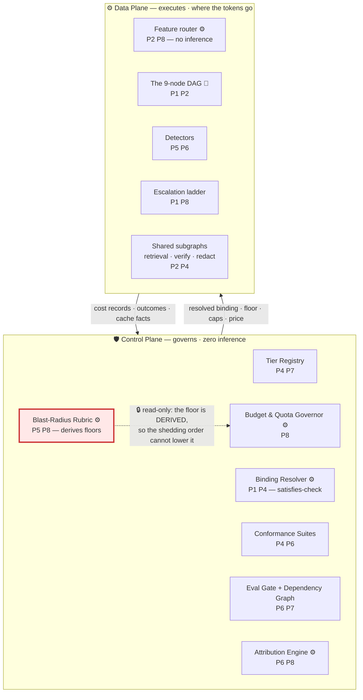
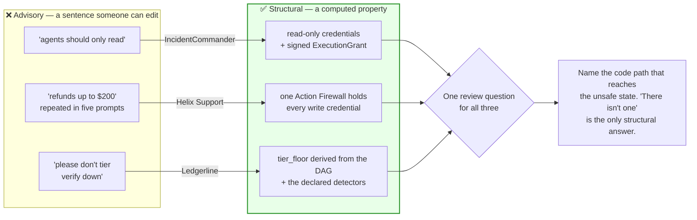

# Design-Principle Mapping

> **The control plane governs the data plane.** A node declares what it *needs* — a capability
> vector and a set of detectors. The control plane decides what *runs*. No node names a model, and
> no node sets its own floor: the floor is **computed** from the DAG and the declared detectors, so
> **budget pressure has no code path to a safety-derived tier**.
>
> This doc is the reviewer cheat-sheet. For each of the eight principles: what it demands, the
> concrete module here that satisfies it, where to read it, and **the honest gap**. Two of the eight
> are thin — §3 and §5 say so plainly rather than inventing coverage, because a mapping that claims
> full marks on all eight has not been reviewed.

---

## 0. The governing picture

Three facts to take from this before reading further:

1. **Nothing in the control plane thinks.** Rubric, resolver, attribution engine, governor — all plain
   code; and by [03](03-routing-layer.md) there is no model in the routing layer either, so **the only
   inference on the platform happens inside the nine DAG nodes.**
2. **The dotted arrow points one way on purpose.** The budget governor *reads* the floor and cannot
   write it. That is this design's single structural safety property (§5, §9).
3. **The upward arrow is what phase 0 of [11](11-migration-and-rollout.md) builds, and every box above
   depends on it.** Without cost records the rubric guesses, the attribution engine has nothing to
   attribute, and the eval gate has nothing to compare.

---

## 1. Agent runtime & execution model

| The principle demands | This design's answer | Doc |
|---|---|---|
| Explicit execution model, not free-form reasoning | Fixed 9-node DAG; the only branch is `verify` accept/reject. **Nothing selects the next node with a model call** | [00](00-overview.md) §2 |
| Bounded execution | The escalation ladder is bounded by tier count *and* by the satisfies-check — "next tier up" means the next tier that **satisfies `requires`**, not the next by rank, so a ladder cannot climb into a tier that is worse for the node | [04](04-escalation-ladder.md), [01](01-tier-as-contract.md) §3 |
| Isolation & multi-tenancy | ~500 tenants with isolated indices; **cross-tenant request batching is refused at any price** | [00](00-overview.md) §1, [06](06-tenant-attribution.md) |
| Independently retryable units of work | The fan-out decomposes into 120–900 single-clause calls, each retryable alone — which is why escalation costs O(failures), not O(N) | [04](04-escalation-ladder.md), [00](00-overview.md) §8 |
| Conservative defaults for new work | Cold start assumes `D = 0` unless a detector is declared, and never binds below `mid` for the first 30 days | [02](02-blast-radius-tiering.md) §9 |

**Gap.** `verify → synthesize` is a **cycle in an otherwise acyclic graph, and the design budgets it
rather than bounding it** — "4% of memos re-synthesised and re-verified" is a rate, not a cap. It also
composes multiplicatively with escalation: a re-synthesised memo re-runs `verify` at `large` and can
re-trigger clause-level escalation, and the p99 900-clause document is where that lands against the
≤ 15 min p99 SLO. More broadly, this is a document pipeline, so most of what principle 1 interrogates
— resumability across long pauses, tool-choice loops, agent-loop termination proofs — is trivial here
or absent, and this design earns no credit for it.

---

## 2. Orchestration & coordination

| The principle demands | This design's answer | Doc |
|---|---|---|
| Topology as an explicit, defended choice | The DAG's shape *is* the argument: a fan-out plus a terminal quality gate puts the money and the leverage on **different nodes**, which is why the tradeoff dissolves | [README](../README.md), [02](02-blast-radius-tiering.md) §5 |
| Coordination that does not tax the hot path | Static floor + **deterministic feature routing** above it. A router model is a tax, a new failure mode, and it recurses — the router would need a tier of its own | [03](03-routing-layer.md) |
| Failure-driven coordination, priced | Escalation ladder fires on a detector, cheap → expensive, and its cost is **inside** the headline number: 12% of clauses re-run at `mid`, 4% of memos re-synthesised | [04](04-escalation-ladder.md), [00](00-overview.md) §6 |
| Cross-team composition | Three shared subgraphs — `retrieval`, `verify`, `redact` — each bound into 10–40 pipelines, with contracts and attribution consequences | [00](00-overview.md) §1, [06](06-tenant-attribution.md) |
| Load coordination under skew | Fan-out width is data-dependent (p50 120 · p90 340 · p99 900) and is **set by a model call**, which is why `segment` carries a `large` floor; per-tenant fan-out **concurrency** quotas, not just spend caps | [00](00-overview.md) §2, §8, [09](09-governance-and-budgets.md) |

**Gap.** Deterministic routing is the right stance and it relocates a cost into a place nobody measures.
Routing rules are hand-maintained per node across ~200 pipelines and **nothing here bounds their
growth**: a feature router with 40 conditions is a small, unversioned, untested model with worse
observability than a real one, and unlike a real one it has no conformance suite. Separately, fan-out
concurrency quotas and the escalation ladder compete for the same capacity under independent
governance — a p99 document arriving during an escalation spike is a queueing problem this design does
not model.

---

## 3. Memory & context management

**This is the thinnest of the eight, and the honest reason is the workload.** Ledgerline is a
**stateless per-document pipeline**: no conversation, no cross-document state, no accumulating
scratchpad. A trajectory begins and ends inside one run.

| The principle demands | This design's answer | Doc |
|---|---|---|
| Short- vs. long-term split | **Not exercised.** There is no long-term store that the pipeline writes | [00](00-overview.md) §2 |
| Context sizing as an explicit budget | Per-node token profile is fixed and priced; `context_floor` is a tier contract term — 200 k for `large`, because `verify` reads the memo plus every cited span | [00](00-overview.md) §4, [01](01-tier-as-contract.md) §2 |
| Selective recall over stuffing | The retrieval subgraph and the tenant playbook are the only durable stores, and both are **inputs**, not memory | [00](00-overview.md) §2 |
| Cache as a first-class object | Prompt-cache prefixes are tracked per call — but as an **attribution** problem, not a memory problem | [06](06-tenant-attribution.md) |

**Gap — and it is a hole in the design's generalisation, not only in this mapping.** The rubric
computes **A over the current run's downstream spend.** Add durable memory and "downstream" silently
includes every future run: a node that writes to memory has effectively unbounded amplification, and
**the rubric as written will under-tier it.** Anyone importing this design into a workload with
conversational or cross-document state must add that term before scoring a single node. Naming it is
the only mitigation on offer here.

---

## 4. Tool & integration layer

| The principle demands | This design's answer | Doc |
|---|---|---|
| Standardised, typed manifest | The `TierContract` **is** the manifest for models: nine typed capability floors plus a cost ceiling, provider-agnostic by construction | [01](01-tier-as-contract.md) §2 |
| Admission control | A per-tier, provider-agnostic **conformance suite** is the only route to a binding; failure returns the failing dimension, not a verdict | [01](01-tier-as-contract.md) §4 |
| Tool-call reliability as a contract term | `tool_call_conformance ≥ 99%` exists specifically because the shared retrieval subgraph calls tools | [01](01-tier-as-contract.md) §2 |
| Exact versions, never aliases | Binding to `…-latest` lets the **provider re-point your tier without your consent** — tier drift you cannot detect | [01](01-tier-as-contract.md) §7, [10](10-failure-modes.md) |
| Robust error handling | A detected failure escalates rather than fails, and escalation targets the next tier that *satisfies* | [04](04-escalation-ladder.md), [01](01-tier-as-contract.md) §3 |
| Interface discipline across teams | Append-only binding history with who/when/eval-run; pins expire at 90 days, renewable once, and renewal requires naming the failing eval | [01](01-tier-as-contract.md) §4, §5 |

**Gap.** A conformance suite is a fixed test set against a moving target, and its dimensions are a
**list of the capabilities you have already been burned by.** `refusal_profile` is in the contract
because a more cautious model declining to summarise an aggressive limitation-of-liability clause is a
real regression no other dimension catches — higher tier, worse outcome. Nothing here finds the *next*
such dimension before production does; the suite grows by incident. And it is pass/fail against
thresholds whose margins are unmodelled: candidates at 99.5% and 99.9% schema-validity fill the same
tier, which at 10.8 M fan-out calls/day is **~43 k malformed rows per day of difference, both fully
inside contract.**

---

## 5. Safety & guardrails

| The principle demands | This design's answer | Doc |
|---|---|---|
| Constraints that budget pressure cannot reach | **`verify` and `redact` floors are non-negotiable**, and the floor is *derived* from the DAG and the declared detectors rather than configured — [09](09-governance-and-budgets.md)'s shedding order has no code path to it | [02](02-blast-radius-tiering.md) §5, [09](09-governance-and-budgets.md) |
| Structural, not advisory | Removing `risk_flag`'s coverage check **mechanically** raises its floor to `large`, rather than leaving a stale comment behind | [02](02-blast-radius-tiering.md) §6 |
| A cost optimisation refused outright | Batching several tenants' content into one request is cheaper **and is a data-isolation violation. Not on the table at any price** | [README](../README.md), [06](06-tenant-attribution.md) |
| A quality floor with a number attached | Unsupported-claim rate ≤ 0.05% forces `verify` up regardless of its 3.6% cost share | [00](00-overview.md) §7 |
| Fail-safe defaults | Cold start assumes `D = 0`; an expired pin falls back to the fleet default — which is always conformance-passed — never to nothing | [02](02-blast-radius-tiering.md) §9, [01](01-tier-as-contract.md) §5 |

**Gap — this is a narrower safety story than either sibling design, and a mapping that implied otherwise
would not be credible.** There is no action authorization, no write path, no approval gate and no
human-in-the-loop here, because the pipeline reads documents and emits a memo: **it does not act.**
Every guardrail above is a *tier floor*, and a tier floor governs how **good** the model is, not what it
is **allowed to do**. `redact` at `large` makes a privilege leak less likely; nothing here makes one
impossible. The only hard structural guarantee is the tenant-batching refusal. And prompt injection
carried in an ingested contract — a live threat when the input is an adversarially-drafted legal
document — is not addressed at all.

---

## 6. Evaluation & observability

| The principle demands | This design's answer | Doc |
|---|---|---|
| Spans everywhere | A cost record per call: pipeline, node, tenant, tier requested, model + exact version, tokens, cached prefix, price at call | [08](08-observability.md) |
| One metric that actually decides | **Cost per accepted outcome**, from the outcome ledger with trajectory attribution. Cost/call and intermediate quality both routinely point the wrong way — a 2% F1 drop that costs 30% more | [05](05-cost-per-outcome.md), [README](../README.md) |
| Continuous **and** offline | Tier-drift detection runs continuously; conformance suites and pipeline evals are offline gates | [08](08-observability.md), [07](07-eval-gated-repointing.md) |
| Change gated on evidence | A re-point requires dependents green at **0 unreviewed dependents**, with a canary before the fleet default moves | [07](07-eval-gated-repointing.md), [00](00-overview.md) §7 |
| Two suites, deliberately not one | Platform conformance vs. per-pipeline eval. Collapsing them makes every candidate model a 30-team negotiation | [01](01-tier-as-contract.md) §4 |
| Reproducibility as a contract term | `determinism_profile` exists so that golden replay is possible at all — including the equivalence gate in [11](11-migration-and-rollout.md) §4 | [01](01-tier-as-contract.md) §2 |
| An independent check on the tier-down | Human rejection rate ≤ 6% — a signal that does **not** come from the verifier | [00](00-overview.md) §7, [05](05-cost-per-outcome.md) |

**Gap. Detectability is the rubric's load-bearing input and the hardest number here to trust.**
`extract`'s D = 92% is measured against `verify`'s judgement — a component whose own error rate is
unmeasured, because nothing checks the checker (`verify` has D ≈ 0%). **The most important number in the
design is calibrated against an uncalibrated instrument.** The only independent ground truth is the human
rejection rate, a *document*-level signal at 6% granularity being used to validate *node*-level
decisions; a 2 pp shift in one fan-out node's true error rate is not detectable in it.

---

## 7. Platform governance & lifecycle

| The principle demands | This design's answer | Doc |
|---|---|---|
| A registry as the control plane | `TierContract`, conformance suites, bindings, the dependency graph, and an **append-only binding history** with who/when/eval-run | [01](01-tier-as-contract.md) §4 |
| An explicit central/federated split | **Central:** contracts, conformance suites, fleet default, dependency graph, floor *audit*. **Federated:** `requires`, detectors, floor *derivation*, pipeline evals | [11](11-migration-and-rollout.md) §7 |
| Eval-gated lifecycle | candidate → conformance → binding → canary → fleet default; nothing skips a stage | [07](07-eval-gated-repointing.md), [01](01-tier-as-contract.md) §4 |
| Lifecycle hygiene against silent debt | Pins expire at 90 days, renewable once; renewal requires naming the failing eval, which converts silent debt into a tracked item | [01](01-tier-as-contract.md) §5 |
| The burden of proof runs downhill | Scheduled downward-pressure review: evidence is needed to **retain** an expensive tier, not to leave it | [README](../README.md) |
| Change control keyed to blast radius, not diff size | A one-line tier change on `extract` is 10.8 M calls/day and **+$28.4 k/day**. Fan-out changes require platform review, a cost forecast, a 1% canary, and budget sign-off | [02](02-blast-radius-tiering.md) §7 |
| Migration treated as completion, not adoption | CI lint + gateway cutover + per-team offender report; `literal_identifiers_remaining` target **0** | [11](11-migration-and-rollout.md) §5 |
| A stated retirement path | Explicit walk-back thresholds with numbers attached | [11](11-migration-and-rollout.md) §9 |

**Gap.** The governance model audits the *derivation* of a floor, not the *existence* of the detector
the derivation depends on. Floors recompute from the DAG, correctly — but **detector declarations are
stored.** A detector disabled in code and left declared in config produces a floor that is too low
**and an audit that is green**, and on `risk_flag` that silently returns a `large` node to `small`
across 43.6% of the bill. There is no runtime probe asserting a declared detector actually ran on the
last N documents — the most exploitable hole in the governance story, and the cheapest to close.

---

## 8. Cost & performance

| The principle demands | This design's answer | Doc |
|---|---|---|
| Tier per node, derived rather than chosen | The rubric: A, D, R → floor. **$0.9625 → $0.6237 per document, −35.2%, $11.1 M/yr** at 90 k docs/day, with four nodes upgraded | [02](02-blast-radius-tiering.md), [00](00-overview.md) §6 |
| Buy the cheaper remedy | On a 120-wide fan-out, a detector costs **$0.024/doc** against **$0.315/doc** for the tier-up. Detectability is a design variable, not a measurement | [02](02-blast-radius-tiering.md) §4 |
| Do not run a model where code will do | Deterministic feature routing above the floor; the whole control plane is inference-free | [03](03-routing-layer.md) |
| Price the retry, not just the call | Escalation is inside the headline number, not a footnote to it | [00](00-overview.md) §6, [04](04-escalation-ladder.md) |
| Per-tenant visibility through shared components | Attribution across `retrieval`/`verify`/`redact`, amortised cache pricing, **±15% monthly forecast accuracy** as an SLO | [06](06-tenant-attribution.md), [00](00-overview.md) §7 |
| Budget on the distribution, not the mean | p99 is **7.5× p50**; per-tenant fan-out concurrency quotas; tiering the fan-out down compresses the tail from **$6.30 → $1.58** | [00](00-overview.md) §8, [09](09-governance-and-budgets.md) |
| Budgets enforced, not observed | Budgets, quotas and a shedding order — which **cannot lower a safety-derived floor** (§5) | [09](09-governance-and-budgets.md) |

**Gap, with the arithmetic, because this is the assumption most likely to be wrong.** Every rate in
[00](00-overview.md) §3 is illustrative, and the single most load-bearing estimate is the escalation
rate. One percentage point of clause escalation costs
`120 clauses × 1% × 2 fan-out nodes × $0.0035 = $0.0084/doc`. On [00](00-overview.md) §6's own table
the fixed part is $0.5229/doc, so the ≤ $0.70 cost-per-accepted-memo SLO breaks at
`(0.70 − 0.5229) / 0.0084 ≈ 21%` of clauses escalating. Budget phase 3's detector as well
(+$0.024/doc, [11](11-migration-and-rollout.md) §8) and the fixed part is $0.5469, so it breaks at
**≈ 18%**. **The headline result survives escalation at 12% and does not survive 20% — and 12% is an
estimate.** That is the design's cleanest falsification signal, which is why it appears as a
walk-back trigger in [11](11-migration-and-rollout.md) §9.

---

## 9. Shared lineage with the sibling designs

[IncidentCommander](../../IncidentCommander/docs/design-principles.md),
[Helix Support](../../SupportAgent/docs/design-principles.md), and
[KnowledgeAgent](../../../KnowledgeAgent/docs/design_principles.md) map onto these same eight
principles. Two stances are shared deliberately.

**Stance 1 — the control plane governs the data plane.** In all four designs the component that
*reasons* is not the component that *decides what is permitted*. Here that split is unusually clean:
the control plane contains no inference at all, so "the governor cannot be talked out of it" is a
property of the implementation rather than of a prompt.

**Stance 2 — a safety-relevant floor is made structural, not advisory.**

| Design | The advisory version that fails | The structural version shipped | Enforcing object |
|---|---|---|---|
| **KnowledgeAgent** | "the agent should only advise" | no write path exists at all | — |
| **IncidentCommander** | "investigation agents should only read" | read-only credentials, separate Executor identity, RBAC + blast-radius + approval gates | signed `ExecutionGrant` |
| **Helix Support** | "refunds up to $200" repeated in five prompts | one Action Firewall holding every write credential | `ActionGrant` in the ledger |
| **Ledgerline** (this) | "please don't tier `verify` down" in a design doc | floor **computed** from the DAG and the declared detectors, recomputed rather than stored; the shedding order cannot reach it | the derived `tier_floor` |

**Where this design is weaker than its siblings, and it is worth stating.** Their structural constraint
governs an *action*, so its guarantee is binary — the refund executes or it does not. Here it governs a
*model choice*, and the outcome is probabilistic: a structural floor on `redact` guarantees that a
`large` model ran and guarantees nothing about what it emitted. **Making a floor structural removes the
human error, not the model error** — the difference between the firewall's guarantee and this one's, and
conflating them would overstate the design.

---

## 10. Honest limitations

1. **The rubric's bands are ordinal, not cardinal.** `A = 174×` and `A = 42×` land in the same band and
   demand the same floor. It is a triage and communication device — do not compute a continuous risk
   score and present it as a measurement.
2. **Detectability is estimated before it is measured, which is circular.** You need production data to
   estimate D and a binding to get production data. The cold-start policy (assume `D = 0`, never below
   `mid` for 30 days) *mitigates* this; it does not resolve it.
3. **R is unbounded and therefore not a number.** "Privilege leak reaches the customer" has no dollar
   value that survives contact with legal. **Treat HIGH as a veto, not a magnitude**, and never average
   it with A.
4. **It assumes a stable DAG.** Floors recompute from the DAG, but `requires` and detector declarations
   are stored. A topology that changes monthly has floors that are stale on arrival.
5. **The conclusions invert for streaming and latency-sensitive pipelines.** Cheap-first needs a retry
   window and a streaming turn cannot escalate after the first token, so the 35% is unavailable at *any*
   tier assignment — the first thing to check before importing this design.
6. **It assumes enough scale to amortise the machinery.** ~200 pipelines and ~$31.6 M/yr on one pipeline
   pay for a registry, five conformance suites, a dependency graph, an eval gate and an attribution
   engine. At ~$300 k/yr of spend a 35% saving is ~$105 k/yr, and the registry costs more than it returns
   ([11](11-migration-and-rollout.md) §9).
7. **Cache fairness has no purely-correct answer, only a defensible one.** When tenant A's request warms
   a prefix that tenant B then hits, every rule — first-mover pays, amortise across hitters, charge list
   price to all — is defensible and none is correct. The design picks one and commits, because the ±15%
   forecast SLO requires *a* rule rather than the right rule.
8. **The escalation rate is the assumption that breaks it.** §8: the SLO fails at ≈ 18% of clauses
   escalating against a 12% estimate. Nothing else in the model has that little margin.
9. **The memory term is missing from the rubric.** §3: A is computed over one run, so a node that writes
   durable state is systematically under-tiered. Do not port the rubric to a stateful workload without
   adding it.
10. **Distillation is a non-goal and probably beats this.** A fine-tuned extractor would likely outperform
    `small` on the fan-out, so the 35% may be leaving money on the table — and the rubric has nothing to
    say about a model you trained yourself, because "tier" presumes a purchased capability with a
    conformance suite behind it.

Every item has a threshold, an owner, or an explicit "check this before importing." **A design that
cannot state the conditions under which it is wrong has not been reviewed** — the walk-back table in
[11](11-migration-and-rollout.md) §9 is the operational form of that claim.
