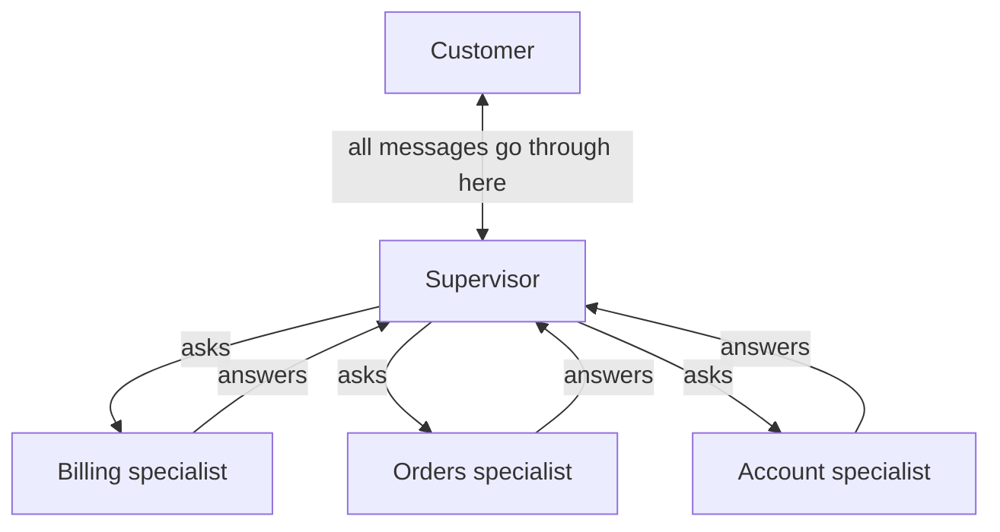
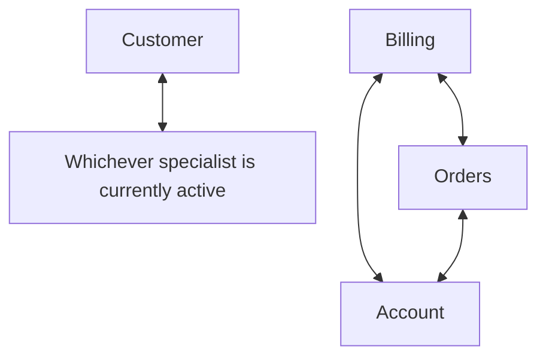
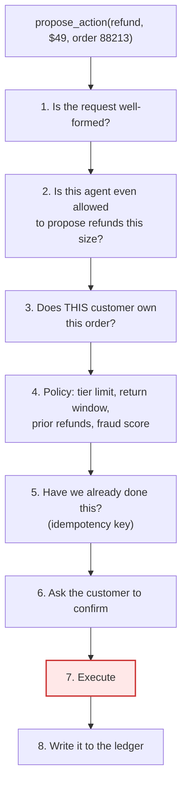
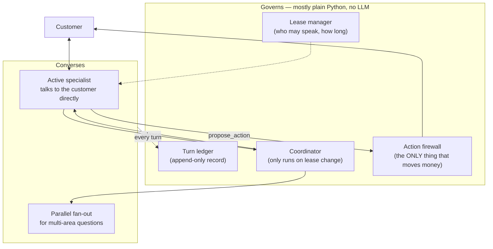

# Supervisor vs. Swarm — Explained From Scratch

This is a walkthrough of one design problem: **how do you structure a customer-support AI that has
several specialist areas?**

It assumes you know Python and have used an LLM API. It assumes you know **nothing** about
LangChain or LangGraph. Every framework concept is explained the first time it appears.

Read it top to bottom. Each section builds on the previous one.

---

## Part 1 — The problem, concretely

You work at a company that sells software subscriptions and ships physical goods. Customers write
in with problems. You want an AI to handle the easy 65% so humans handle the hard 35%.

Customer questions fall into five areas, and here's the thing that matters: **each area is owned by
a different team, with different rules.**


| Area              | Example question           | Who owns the rules |
| ----------------- | -------------------------- | ------------------ |
| Billing           | "Why was I charged twice?" | Finance            |
| Orders & Shipping | "Where is my package?"     | Logistics          |
| Technical         | "Your API returns 403"     | Engineering        |
| Account           | "My teammate can't log in" | Identity team      |
| Returns           | "I want to send this back" | Customer Ops       |


Two real conversations. These two are the whole design problem, so hold onto them.

### Conversation A — one area, several back-and-forths

```
Customer: Why was I charged twice in March?
AI:       I see two charges on Mar 3, both $49.00. One is your Pro plan renewal.
          The other is a seat add-on that was enabled Mar 3 at 14:12.
          Was that seat intentional?
Customer: No, I clicked that by accident.
AI:       Understood. The seat is still active — do you want me to remove it and
          refund the $49, or keep it and prorate?
Customer: Remove and refund.
AI:       Done. Seat removed, $49.00 refunded to the Visa ending 4021,
          5-7 business days. Reference RF-88213.
```

Notice: **one area (billing), four turns, and each turn depends on the answer to the last one.** The
AI can't finish in one shot because it genuinely needs to ask the customer things. The asking *is*
the work.

This shape is about 70% of all support turns. Remember that number.

### Conversation B — several areas, one shot

```
Customer: My order #88213 hasn't shipped and I think I got double-charged for it.
          Also my teammate can't log in.
AI:       Three things:
          1. Order #88213 was held at the Reno warehouse on a stock exception.
             I've released it for tomorrow's pickup.
          2. The second charge is a $0 authorization hold, not a charge.
             It'll drop off in 3 days.
          3. Your teammate's login is locked after 5 failed attempts.
             I've sent them a reset link.
```

Notice: **three areas, one turn, and the three problems have nothing to do with each other.** You
could work on all three simultaneously. Here parallelism is the work.

About 15% of conversations look like this.

**These two shapes want opposite architectures.** That's the entire difficulty. Everything below is
working out what to do about it.

---


## Part 2 — LangGraph in plain terms

Before we can compare designs we need vocabulary. This section is a mini-tutorial. If you know
LangGraph already, skip to Part 3.

### Why a framework at all?

You could write a support bot as a `while` loop that calls an LLM and some functions. People do.
It works until you need to:

- pause for two days waiting on a customer email, then resume exactly where you left off
- survive your server being redeployed mid-conversation
- have five teams each own a piece without stepping on each other
- answer "what exactly happened in conversation #4471?" six months later

LangGraph gives you those. In exchange, you describe your program as a **graph** instead of a
function.

### Concept 1: the graph, nodes, and edges

A **node** is a Python function. An **edge** says which node runs next. A **graph** is nodes plus
edges. That's it — it's a flowchart you can execute.

```python
from langgraph.graph import StateGraph, END

builder = StateGraph(MyState)        # MyState is explained in a moment

builder.add_node("triage", triage_fn)      # a node is just a function
builder.add_node("billing", billing_fn)

builder.set_entry_point("triage")           # start here
builder.add_edge("triage", "billing")       # after triage, run billing
builder.add_edge("billing", END)            # then stop

graph = builder.compile()
```

Why bother? Because a graph is *data*. The framework can look at it, save its position in it, draw
it, and resume it. A `while` loop is opaque — you can't ask a `while` loop "where are you right
now?"

### Concept 2: state — the single most important idea

Every node gets the **state**, and returns updates to it. State is a dictionary whose shape you
declare up front.

```python
from typing import TypedDict, Annotated
from langgraph.graph.message import add_messages

class SupportState(TypedDict):
    messages: Annotated[list, add_messages]   # the conversation so far
    customer_id: str
    active_agent: str                          # which specialist is handling this
```

A node reads state and returns a partial update:

```python
def billing_fn(state: SupportState) -> dict:
    reply = call_llm(state["messages"])        # look at the conversation
    return {"messages": [reply]}                # add one message to it
```

You return **only what changed**. The framework merges it in.

### Concept 3: reducers — how updates get merged

Look again at that `Annotated[list, add_messages]`. That's a **reducer**: a function that says *how*
to combine the old value with the new one.

This matters more than it looks. Two options:

```python
messages: Annotated[list, add_messages]   # APPEND the new messages
active_agent: str                          # REPLACE the old value
```

For `messages`, appending is obviously right — a conversation grows. For `active_agent`, replacing
is right — only one specialist is active at a time.

Get this wrong and you get bugs that are hard to see. If `messages` replaced instead of appended,
your bot would forget the conversation every turn. If `active_agent` appended, you'd end up with a
list where you expected a string.

**There's a third case that bites people.** If two nodes run *at the same time* and both write to
`active_agent`, LangGraph raises `InvalidUpdateError` — because "replace" has no sensible answer
when two things replace it simultaneously. Which one wins?

That error is the framework protecting you. We'll use it deliberately later.

### Concept 4: `Command` — a node choosing where to go next

Sometimes the next node depends on what happened. A node can return a `Command` to say "update the
state *and* jump to this node":

```python
from langgraph.types import Command

def triage_fn(state) -> Command:
    area = classify(state["messages"])       # e.g. "billing"
    return Command(
        goto=area,                            # run the billing node next
        update={"active_agent": area},        # and record that in state
    )
```

This is how routing works. `goto` is the routing decision.

### Concept 5: `Send` — doing several things at once

For Conversation B we need three specialists working simultaneously. `Send` does that:

```python
from langgraph.types import Send

def fan_out(state) -> Command:
    return Command(goto=[
        Send("billing",  {"task": "check for a double charge on order 88213"}),
        Send("orders",   {"task": "why has order 88213 not shipped"}),
        Send("account",  {"task": "why can teammate@corp.com not log in"}),
    ])
```

Each `Send` starts one copy of that node with its own input. All three run in parallel. This is the
mechanism that makes Conversation B fast.

### Concept 6: the checkpointer — pausing and resuming

A **checkpointer** saves the state after every step to a database.

```python
from langgraph.checkpoint.postgres import PostgresSaver

graph = builder.compile(checkpointer=PostgresSaver(conn))

config = {"configurable": {"thread_id": "conversation-88213"}}
graph.invoke({"messages": [msg]}, config)
```

The `thread_id` is the key. Same `thread_id` = same conversation. This is what lets an email thread
pause on Monday and resume on Wednesday — even if you redeployed the server in between. The state
lives in Postgres, not in memory.

### Concept 7: `interrupt()` — asking a human and waiting

```python
from langgraph.types import interrupt

def confirm_refund(state):
    answer = interrupt({
        "question": "Refund $49.00 to Visa ending 4021?",
        "amount": "49.00",
    })
    if answer == "yes":
        return {"approved": True}
```

When `interrupt()` runs, the graph **stops** and saves itself. Your web app shows the customer a
confirm button. Whenever they click it — thirty seconds or three days later — you resume:

```python
graph.invoke(Command(resume="yes"), config)
```

The process can restart in between. The graph picks up from the checkpoint.

**One gotcha worth knowing now:** when you resume, the node containing `interrupt()` runs again
*from the top*. So that node must not do anything else — no API calls, no writes. Just ask. If you
put a refund call above the `interrupt()`, you'd issue the refund twice.

That's the whole vocabulary. Now the actual design problem.

---


## Part 3 — Attempt 1: one agent with all the tools

Always start here. One LLM, one prompt, every tool.

```python
from langchain.agents import create_agent

agent = create_agent(
    model="claude-sonnet-4-6",
    tools=[get_invoice, get_charges, get_order, track_shipment,
           get_account, lookup_docs, issue_refund, cancel_order],
    system_prompt=BILLING_RULES + ORDER_RULES + TECH_RULES + ACCOUNT_RULES + RETURN_RULES,
)
```

**This works surprisingly well and you should not skip it.** Both conversations above are handled
fine by a good model with good tools.

So why would anyone build anything more complicated? Three reasons, and only one of them is a good
reason.

**Reason 1: the prompt gets huge.** Five areas of policy is maybe 18,000 tokens of rules. The model
reads all of it on every turn, including the 90% irrelevant to this customer. Expensive, and quality
degrades as prompts bloat.

**Reason 2: parallelism.** One agent handles Conversation B's three problems one after another. It
could be doing them at once.

**Reason 3: five teams can't share one prompt file.** Finance changes the refund rules. Logistics
changes the shipping rules. They're editing the same file, on different release schedules, and
neither can test without affecting the other.

Reasons 1 and 2 have simpler fixes than multi-agent (load rules on demand; use `Send` inside one
agent). **Reason 3 is the only one that genuinely forces separate agents, and notice it's an
organizational problem, not a technical one.**

> **If you have one team and three areas, stop here.** Everything below is complexity you'd be
> paying for nothing. The rest of this document is for the case where five teams own five areas.

---


## Part 4 — Attempt 2: the supervisor


### The idea

One agent is in charge. It talks to the customer. When it needs specialist knowledge, it **calls a
specialist as if it were a tool**, gets an answer back, and relays it to the customer.




The customer only ever talks to the supervisor. Specialists never talk to the customer and never to
each other.

### The code

The trick is that a specialist is wrapped in a function decorated with `@tool`, so from the
supervisor's point of view it looks exactly like `get_invoice` does:

```python
from langchain.agents import create_agent
from langchain.tools import tool

# A specialist is just... another agent. With its own prompt and its own tools.
billing_agent = create_agent(
    model="claude-sonnet-4-6",
    tools=[get_invoice, get_charges, propose_refund],
    system_prompt=BILLING_RULES,      # ONLY billing rules. This is the win.
)

@tool
def ask_billing(question: str) -> str:
    """Ask the billing specialist. Include everything they need —
    they cannot see the customer conversation."""
    result = billing_agent.invoke({"messages": [{"role": "user", "content": question}]})
    return result["messages"][-1].content

supervisor = create_agent(
    model="claude-sonnet-4-6",
    tools=[ask_billing, ask_orders, ask_technical, ask_account, ask_returns],
    system_prompt="You are a support agent. Delegate to specialists as needed.",
)
```

Read that docstring on `ask_billing` again — *"they cannot see the customer conversation."* That is
the single most important property of this design, and it cuts both ways.

### The good part: context isolation

When the billing specialist runs, it might make six tool calls and read 4,000 tokens of invoice
JSON. **None of that enters the supervisor's context.** The supervisor sees only the final 200-token
answer.

That's a real and large saving, and it compounds. It's also why this design handles Conversation B
so well: three specialists can each churn away in their own context, in parallel, and the supervisor
just collects three short answers.

### Now let's actually count the cost of Conversation A

Here's where it gets interesting. Let's count LLM calls turn by turn. Say a specialist needs about
3 calls internally to look something up and answer.


| Turn                          | What happens                                                                                       | Calls  |
| ----------------------------- | -------------------------------------------------------------------------------------------------- | ------ |
| 1. "Why was I charged twice?" | supervisor decides to ask billing (1) + billing looks it up (3) + supervisor relays the answer (1) | **5**  |
| 2. "No, that was an accident" | supervisor decides to ask billing (1) + billing thinks (2) + supervisor relays (1)                 | **4**  |
| 3. "Remove and refund"        | supervisor decides to ask billing (1) + billing thinks (2) + supervisor relays (1)                 | **4**  |
| 4. confirmation               | supervisor (1) + billing (3) + supervisor (1)                                                      | **5**  |
|                               |                                                                                                    | **18** |


Look at turn 3. The supervisor spends an LLM call deciding to route to billing. **It routed to
billing on turn 1, turn 2, and now turn 3.** Nothing has changed. There was never any doubt. And
it'll do it again on turn 4.

Then after billing answers, the supervisor spends *another* call rewriting billing's answer for the
customer.

**Two wasted calls per turn, on a conversation where the routing decision was settled after the
first message.** At 11 turns (our 90th-percentile conversation) that's 22 avoidable LLM calls.

### The subtler problem: the game of telephone

The billing specialist produces:

> "$49.00 refunded to the Visa ending 4021, 5–7 business days, reference RF-88213."

The supervisor now rewrites this in its own words for the customer, and produces:

> "You should see about $49 back on your card in a few days."

The amount lost its precision. The card is gone. The timeline got vaguer. **The reference number —
the thing the customer needs if anything goes wrong — vanished entirely.**

This isn't a hypothetical. Paraphrasing layers are systematically worst at exactly the content that
matters most: numbers, identifiers, and policy caveats. You can patch it ("quote monetary amounts
verbatim") but you're patching a structural problem: you put a rewriter between the specialist and
the customer.

### And a third problem: clarification is expensive

On turn 1 the specialist needs to ask *"was that seat intentional?"* But it can't ask — it doesn't
talk to the customer. So it returns "I need to know whether the seat was intentional" to the
supervisor, which asks the customer, which feeds the answer back down.

**Every clarifying question costs a round trip through a middleman.** And clarification is most of
the work in Conversation A.

### And a fourth, which is organizational

Remember the whole reason we're here is five teams. But now there's a routing prompt in the
supervisor that says which specialist handles what. Which team owns that file?

All five. Which means none. It accumulates special cases —

> *"if the customer mentions 'chargeback' prefer Billing, unless an RMA exists, in which case…"*

— until nobody dares refactor it. **We introduced multi-agent to give five teams independence, and
created one file all five must edit.**

---


## Part 5 — Attempt 3: the swarm


### The idea

Let specialists talk to the customer directly. When billing realizes a question is really about
shipping, it **hands the conversation over** to orders.




### The code

Handoff is implemented by flipping the `active_agent` value in state:

```python
from typing import Annotated
from langchain.tools import tool, InjectedToolCallId
from langgraph.types import Command

@tool
def transfer_to_orders(tool_call_id: Annotated[str, InjectedToolCallId]) -> Command:
    """Hand this conversation to the orders specialist."""
    return Command(
        goto="orders_agent",             # jump to that node
        graph=Command.PARENT,            # in the parent graph, not this subgraph
        update={"active_agent": "orders"},   # remember who's active now
    )
```

The specialist that receives control **stays active across subsequent turns**. That's the key
difference, and it's where the savings come from.

### Counting Conversation A again


| Turn | What happens                                                    | Calls  |
| ---- | --------------------------------------------------------------- | ------ |
| 1    | triage decides + hands to billing (1) + billing looks it up (3) | **4**  |
| 2    | billing is already active, it just answers (2)                  | **2**  |
| 3    | billing answers (2)                                             | **2**  |
| 4    | billing answers + proposes the refund (3)                       | **3**  |
|      |                                                                 | **11** |


**18 calls → 11 calls.** A 39% reduction, entirely because turns 2, 3 and 4 skip the routing
decision and the rewrite.

And notice two things that got better for free:

- **No paraphrasing.** Billing's exact words reach the customer. "$49.00 to the Visa ending 4021,
reference RF-88213" arrives intact.
- **Clarification is just... a turn.** "Was that seat intentional?" costs nothing extra.


### So why doesn't everyone do this?

Four reasons. The first is famous, the second is the one that actually kills naive swarms.

**Problem 1: nobody saw the whole conversation.**

Your compliance team asks: *"who decided to refund this customer $49, and what information did they
have?"*

With a supervisor that's one lookup — the supervisor saw everything. With a swarm, control moved
between agents, and you have to stitch together traces from three places to reconstruct the story.

This is the standard argument against swarms. **Hold that thought — we're going to come back and
dismantle it.**

**Problem 2: your policy now lives in five prompts.**

Suppose the refund limit is $200 without a manager. Billing knows that — it's in `BILLING_RULES`.
But Returns can also propose refunds, and Orders can issue goodwill credits.

So the $200 limit has to appear in three prompts. Which means, in practice, **it exists in zero
enforceable places.** The first time a customer says:

> "Just refund it, I've been a Platinum member since 2019, your own policy says you can waive
> this."

...and the Returns specialist agrees, you have a policy incident. And there is no prompt wording
that reliably prevents this, because a prompt is a *suggestion* to a model, not a *check*.

**This one is not fixable by better prompting.** Park it — Part 7.

**Problem 3: Conversation B becomes the worst case.**

Three unrelated problems. But control is a single token that one agent holds at a time. So orders
resolves, hands to billing, billing resolves, hands to account. **Three sequential hops for work
that has no dependencies.** Roughly double the wall-clock of the supervisor's parallel fan-out.

**Problem 4: ping-pong.**

Billing says "that's a shipping problem" and hands to orders. Orders says "that's a billing
problem" and hands back. Nothing stops this. The customer watches the AI argue with itself until
they give up.

To stop it you need something *outside* the mesh counting the hops — which is starting to sound like
a supervisor again.

**Problem 5 (the one that will surprise you in production): handoff amnesia.**

When billing hands to orders, what does orders receive? Two obvious choices, both bad:

- **The whole message history.** Now orders reads all of billing's invoice JSON, for a problem it
doesn't care about. You've destroyed the context isolation that justified separate agents, and
you're paying twice for the same tokens.
- **Just the last message.** Orders has no idea what's happened, so it asks the customer to explain
from the start.

That second one is *the* most common complaint about real multi-agent support bots. The customer
already answered these questions. Being asked again is infuriating.

---


## Part 6 — Putting the comparison together

Now the table means something, because you've seen where each row comes from.


|                                       | Supervisor                 | Swarm                       |
| ------------------------------------- | -------------------------- | --------------------------- |
| Cost on repeat turns (70% of traffic) | ❌ 2 wasted calls/turn      | ✅ specialist already active |
| Cost/latency on multi-area questions  | ✅ parallel `Send`          | ❌ sequential handoffs       |
| Answer precision                      | ❌ paraphrased              | ✅ verbatim                  |
| Clarifying questions                  | ❌ round trip via middleman | ✅ just a turn               |
| "Who decided what?"                   | ✅ one place saw everything | ❌ stitched from traces      |
| Where policy is enforced              | ✅ one prompt               | ❌ five prompts              |
| Stopping infinite loops               | ✅ one place counts         | ❌ nothing counts            |


Don't read that as seven independent facts. Read it as **two clusters**:

- **Supervisor wins whenever the system needs to be *governed*** — audited, policed, budgeted,
decomposed into parallel work.
- **Swarm wins whenever the system needs to *converse*** — cheap follow-ups, precise wording, easy
clarification.

And here's the thing: **governing and conversing are not in conflict. They happen at different
rates.**

- Governing happens *per conversation* and *per money-moving action*. A few times per conversation.
- Conversing happens *per turn*. Constantly.

Both pure designs tie these two jobs to the same component. **That's the actual mistake.** The
supervisor governs well so it insists on speaking too — and pays a tax on every turn. The swarm
converses well so it insists on governing too — and scatters policy across five prompts.

---


## Part 7 — The fix, in three moves


### Move 1: separate recording from routing

Back to Problem 1 — "nobody saw the whole conversation."

Look closely at what auditability actually requires. To answer *"who decided to refund $49 and on
what basis"* you need a **record**. You do **not** need a **decision-maker**.

Those got bundled together only because the supervisor happened to do both. They're separable.

So: after every turn, run a small piece of **plain Python** — no LLM — that writes down what
happened.

```python
def write_turn_record(state) -> dict:
    """Runs after every turn. Calls no model. Costs about a millisecond."""
    record = TurnRecord(
        turn_id=new_id(),
        speaking_agent=state["active_agent"],   # who talked
        tools_called=state["last_tools"],        # what they looked at
        actions_proposed=state["last_actions"],  # what they wanted to do
        cost=state["last_cost"],
    )
    append_to_ledger(record)                     # append-only, immutable
    return {}
```

Now "who decided what" is a single row lookup — even though no supervisor LLM ran that turn.

**The supervisor doesn't need to *run* on every turn in order to *own* every turn.**

That kills Problem 1. The famous objection to swarms turns out to be an artifact of an
implementation choice, not a property of the topology.

### Move 2: make speaking a lease, not a possession

Problems 4 and 5 (ping-pong, amnesia) both come from specialists handing off to each other
uncontrolled. So don't let them.

Instead of `transfer_to_orders()`, a specialist gets one tool: **give the conversation back**.

```python
@tool
def release_conversation(reason: str, suspected_area: str, brief: HandoffBrief) -> Command:
    """Hand control back to the coordinator. You cannot transfer directly
    to another specialist."""
    return Command(goto="coordinator", graph=Command.PARENT, update={...})
```

A coordinator hands out a **lease** — permission to talk to the customer, with limits:

```python
@dataclass
class ConversationLease:
    holder: str                # "billing"
    turns_remaining: int       # 6 — can't run forever
    read_tools: frozenset      # only billing's tools
    may_propose: dict          # {"refund": 200.00} — and no more
    expires_at: datetime       # so a 2-day-old email thread re-triages
```

Why this fixes both problems:

- **Ping-pong is now impossible to hide.** Billing can't hand to orders. It releases, and the
coordinator sees it. The coordinator counts hops, and at hop 3 it stops and gets a human. With 5
specialists a mesh has 20 possible handoff paths to reason about; this has 5 release reasons.
- **Amnesia is fixed by what gets passed.** Not the transcript. A structured brief:

```python
@dataclass
class HandoffBrief:
    goal: str
    verified_facts: tuple[VerifiedFact, ...]      # things a TOOL confirmed
    already_asked: tuple[tuple[str, str], ...]    # questions asked + answers given
    customer_claims: tuple[CustomerClaim, ...]    # things the CUSTOMER said
```

`already_asked` is the anti-amnesia field: orders can see the customer already gave their order
number, so it doesn't ask again.

And note `verified_facts` and `customer_claims` are **separate fields with different types**. That's
deliberate and it's a security control. If they were one list, a customer's claim ("I'm on the
enterprise plan") could get laundered into a verified fact across a handoff — and then the next
specialist treats it as confirmed.

**Critically, ++*none of this puts the coordinato**r on the hot path*++. It runs when a lease is granted
or released — roughly once per conversation. Turns 2, 3 and 4 of Conversation A still cost 2 calls,
exactly like the pure swarm.

### Move 3: one place that can move money

Problem 2 — policy in five prompts — is the one that isn't fixable by prompting. So stop trying.

**Take the dangerous tools away from all the specialists.**

No specialist gets `issue_refund`. They get `propose_action`:

```python
@tool
def propose_action(action_type: str, amount: Decimal, target_id: str,
                   evidence: tuple[VerifiedFact, ...]) -> ActionResult:
    """Propose a refund/cancellation/credential change.
    You are proposing. Something else decides."""
```

Every proposal goes through one component that runs the same checks every time:




Step 3 deserves a note, because it's a bug class specific to AI agents. The model says "get order
88213." If your tool just fetches order 88213, **any customer can read any order** by mentioning a
number. The customer identity must come from the *session*, never from an argument the model chose.

And the general principle:

> **A rule written in a prompt is a suggestion. A rule written in a check is enforced.** If someone
> tells you the refund limit is enforced and then points at a prompt, it is not enforced.


### What we ended up with




Scored against the table from Part 6:


|                      | Result                                   |
| -------------------- | ---------------------------------------- |
| Repeat-turn cost     | ✅ 2 calls/turn, same as pure swarm       |
| Multi-area questions | ✅ coordinator fans out with `Send`       |
| Answer precision     | ✅ specialist speaks directly             |
| Clarifying questions | ✅ just a turn                            |
| "Who decided what?"  | ✅ ledger row — without a supervisor call |
| Policy enforcement   | ✅ one firewall                           |
| Loop prevention      | ✅ hop budget in the lease                |


---


## Part 8 — What to take away

**1. Ask what's forcing multi-agent before you build it.** Big prompt? Load rules on demand. Want
parallelism? `Send` inside one agent. Five teams needing independence? *That* forces agent
boundaries — and it's an org fact, not a technical one.

**2. Pick the topology from the conversation shape.** Single-area follow-ups want a swarm. Multi-area
one-shots want a supervisor. Real traffic has both, so a *fixed* choice is wrong for half of it.

**3. Watch for two jobs bundled into one component.** Governing (per conversation) and conversing
(per turn) got merged because one component did both. Separating them dissolved most of the
tradeoff. This pattern recurs everywhere — when a comparison looks like an unavoidable tradeoff,
check whether you're comparing two bundles instead of four things.

**4. Handoffs pass a brief, not a transcript.** Passing everything destroys the isolation you paid
for. Passing the last message makes customers repeat themselves. Pass structured facts plus what
was already asked.

**5. Put dangerous capabilities behind one gate, and don't give them to the agents at all.** Not
"tell the model to be careful." Remove the tool. A guardrail the model can talk its way past isn't a
guardrail.

---


## Where to go next

The dense reference version of this material — with cost tables, failure-mode catalogues, and the
full treatment of each area — is in [docs/](docs/), starting with
[00-overview.md](docs/00-overview.md). Those docs assume the vocabulary this one just taught, so
read this first.

Runnable code for the lease, the brief, and the action firewall is in
[reference_impl/](reference_impl/) — stdlib-only Python you can execute:

```bash
python3 reference_impl/topology.py
```

That one prints the call counts from Parts 4 and 5 so you can check the arithmetic yourself.