# Helix Support — Supervisor vs. Swarm

> A staff-level topology study, worked end to end: **when does a customer-support agent want a
> central supervisor routing to specialists, and when does it want specialists handing off
> directly to each other?**
>
> The honest answer is *neither, purely*. This document derives why, quantifies the crossover,
> and lands on a concrete architecture — **leased supervision** — where the supervisor owns the
> session as a **control plane** while a specialist speaks to the user directly as the **data
> plane**. Every mutating action passes one **Action Firewall** regardless of who is talking.

---

## Why this exists

"Supervisor vs. swarm" gets argued as a matter of taste. It isn't. The two topologies have
*measurably* different cost, latency, and auditability curves, and they cross over depending on
one property of the conversation: **is the user's problem single-domain-and-chatty, or
multi-domain-and-one-shot?**

Support traffic contains both, in the same product, often in the same conversation. Picking one
topology globally means being wrong about half your traffic. This design shows the math, then
builds the thing that is right about both halves.

| Objective | How the architecture moves the number |
|---|---|
| ↓ Cost / conversation | Specialist holds the turn loop — no supervisor tax on every repeat turn |
| ↓ p95 turn latency | Leased turns are 2 model calls, not 5; compound issues fan out in parallel |
| ↑ Containment rate | Specialists clarify *directly*, so multi-turn resolution doesn't degrade through a paraphrasing middleman |
| ↑ Auditability | Supervisor **records** every turn even when it doesn't **run** — one ledger, one place to ask "who decided what" |
| ↓ Policy blast radius | Refund/cancel/credit logic lives in **one** gated executor, not in five specialist prompts |
| ↓ Ping-pong escalations | Hop budgets + a no-progress detector force arbitration instead of infinite handoffs |

---

## The 90-second mental model

```mermaid
flowchart LR
  subgraph CP["🛡️ Control Plane — GOVERNS"]
    direction TB
    SUP["Supervisor / Session Owner"]
    LEASE["Lease Manager\n(who may speak, for how long)"]
    POL["Policy & Entitlement Engine"]
    LEDGER["Turn Ledger (append-only)"]
    BUD["Budget Governor\n(turns · tokens · dollars)"]
    EVAL["Trajectory Evaluator"]
  end

  subgraph DP["⚙️ Data Plane — EXECUTES"]
    direction TB
    TRI["Triage / intent + compound detection"]
    SPEC["Specialists\nbilling · orders · technical · account · returns"]
    FANOUT["Parallel fan-out (compound issues)"]
    FIRE["🔒 Action Firewall\n(the only writer)"]
    HUM["Human escalation"]
  end

  CP -. grants leases / authorizes actions / prices / scores .-> DP
  DP -. emits turn records, action proposals, spans, cost .-> CP
```

The supervisor does **not** need to run on every turn to **own** every turn. That single
observation is what dissolves the classic "swarms aren't auditable" objection, and it is the
hinge of this whole design. See [docs/03-recommended-architecture.md](docs/03-recommended-architecture.md).

---

## The verdict, up front

| Traffic shape | Right topology | Why |
|---|---|---|
| Single-domain, multi-turn ("why was I charged twice?") | **Swarm / handoff** | Specialist is already active; turn 2+ costs ~2 calls instead of ~5 |
| Multi-domain, one-shot ("my order is late *and* I was double-charged") | **Supervisor / router fan-out** | Parallel + context isolation: ~9K tokens vs ~15K, and latency is 1 hop not 2 |
| Regulated mutation (refund, cancel, credential change) | **Neither — a gated executor** | Policy must exist in exactly one place, or it exists in none |
| Everything, in production, at once | **Leased supervision** (this design) | Mode-switch per conversation instead of per company |

**Roughly 70% of support turns are single-domain follow-ups.** A pure supervisor pays a routing
+ synthesis tax on all of them. That is the whole business case for the hybrid — quantified in
[docs/02-cost-and-latency-model.md](docs/02-cost-and-latency-model.md).

---

## Document map

| # | Doc | Principle(s) | What it answers |
|---|-----|-------------|-----------------|
| 00 | [Overview & problem framing](docs/00-overview.md) | — | The product, the SLOs, the two archetypal conversations |
| 01 | [Topology comparison](docs/01-topology-comparison.md) | 2 | Supervisor vs. swarm, dimension by dimension, with the failure curve of each |
| 02 | [Cost & latency model](docs/02-cost-and-latency-model.md) | 8 | Model-call accounting, token math, where the curves cross |
| 03 | [Recommended architecture](docs/03-recommended-architecture.md) | 1,2,5 | Leased supervision: modes, lease object, arbitration |
| 04 | [Agent runtime & execution](docs/04-agent-runtime.md) | 1 | Session state machine, budgets, resumability, durable pauses |
| 05 | [State & memory](docs/05-state-and-memory.md) | 3 | Shared vs. private channels, reducers, long-term customer memory |
| 06 | [The handoff contract](docs/06-handoff-contract.md) | 2,4 | Structured task briefs, hop budgets, the N² problem, anti-amnesia |
| 07 | [Tools & the Action Firewall](docs/07-tools-and-action-firewall.md) | 4,5 | Read/write split, gated mutation, idempotency, entitlement checks |
| 08 | [Safety & guardrails](docs/08-safety-guardrails.md) | 5 | Prompt injection from ticket content, refund limits, PII/PCI, confirmation UX |
| 09 | [Evaluation & observability](docs/09-evaluation-observability.md) | 6 | Routing accuracy, trajectory scoring, containment, per-agent spans |
| 10 | [Cost governance](docs/10-cost-governance.md) | 8 | Model tiering per node, per-agent attribution, budget enforcement |
| 11 | [Failure modes](docs/11-failure-modes.md) | 1,5,8 | Ping-pong, handoff amnesia, telephone game, supervisor bloat, degraded modes |
| 12 | [Sequence flows](docs/12-sequence-flows.md) | all | Both archetypes, step by step, with sequence diagrams |
| 13 | [Migration & rollout](docs/13-migration-and-rollout.md) | 7 | Single agent → leased supervision, shadow mode, eval gates |
| — | [Design-principle mapping](docs/design-principles.md) | all | Each of the 8 principles → concrete modules (the review cheat-sheet) |

Executable contracts live in [reference_impl/](reference_impl/) — the lease, the handoff brief,
and the Action Firewall as dependency-free Python that a reviewer can run.

---

## Non-negotiable design stances (the tl;dr for a reviewer)

1. **Recording is not routing.** The supervisor writes a `TurnRecord` for every turn; it only
   *reasons* when the session needs arbitration. Auditability is decoupled from model calls.
2. **Speaking is leased, not owned.** A specialist talks to the user under a bounded lease
   (turn budget, domain scope, tool grants, revocation conditions). Leases expire; they are not
   forgotten.
3. **There is exactly one writer.** No specialist mutates anything. Refunds, cancellations, and
   credential changes go through the Action Firewall, which is where policy, entitlement,
   idempotency, and confirmation live — by construction, not by convention.
4. **Handoffs carry a brief, not a transcript.** A handoff passes a structured task brief
   (goal, verified facts, what was already asked, expected output). Passing raw history is how
   you get both amnesia *and* context blowup.
5. **Bounded everything.** Hops, turns, tools, tokens, and dollars are capped per conversation;
   exceeding any cap forces arbitration or human escalation — never a silent loop.
6. **Compound issues break the lease.** The moment a second domain appears, the session returns
   to the supervisor for parallel fan-out. Sequential handoff chains are the worst possible
   shape for multi-domain work and this design refuses to produce them.
