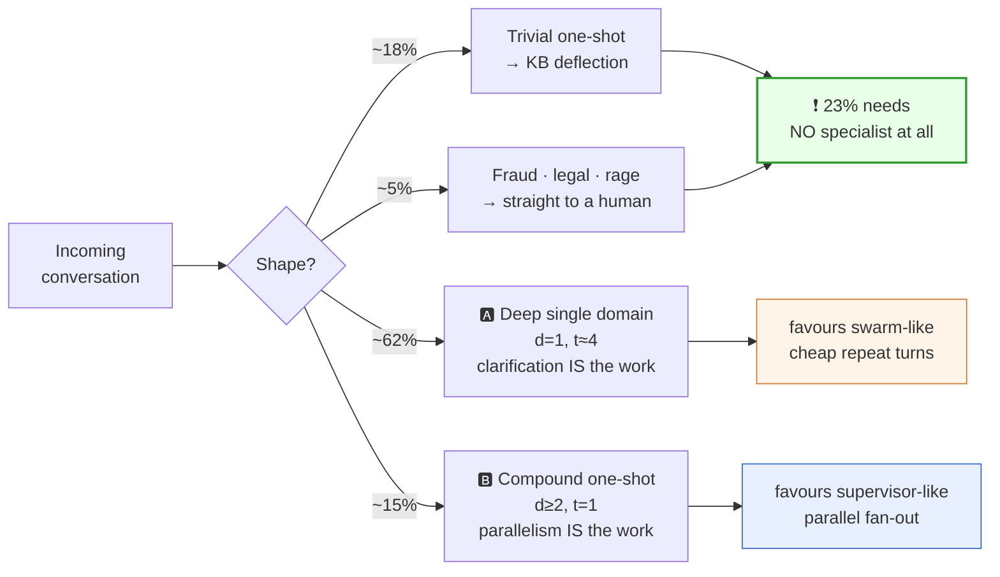

# 00 — Overview & Problem Framing

> You cannot choose a topology without a workload. This doc pins down the workload precisely
> enough that the choice in [01](01-topology-comparison.md) becomes an argument about numbers
> rather than an argument about aesthetics.

---

## 1. The product

**Helix Support** — the AI first line of support for a mid-size commerce + subscription
business. It answers in-app chat, web chat, and email; it resolves what it can; it escalates
what it can't with a complete brief attached.

| Dimension | Value |
|---|---|
| Volume | ~40,000 conversations/day; ~180 concurrent live chats at peak |
| Channels | Live chat (synchronous), email (asynchronous), in-app widget |
| Turns per conversation | p50 = 4, p90 = 11, p99 = 30+ |
| Domains | Billing · Orders & Shipping · Technical/Product · Account & Identity · Returns & Refunds |
| Languages | 9, with a shared policy corpus |
| Compliance | SOC 2 (full audit trail), PCI-DSS (never handle raw PAN), GDPR (residency + erasure) |

### The five specialist domains

| Specialist | Owns | Reads | May *propose* writes |
|---|---|---|---|
| **Billing** | Invoices, charges, proration, tax, dunning | Billing API, invoice store, payment-processor events | Refund, credit, retry charge, plan change |
| **Orders & Shipping** | Order status, carrier tracking, delivery exceptions | OMS, WMS, carrier APIs | Reship, cancel order, address change |
| **Technical** | Product behaviour, integrations, API errors | Docs, KB, customer's error logs, status page | Nothing (advisory) + create bug ticket |
| **Account & Identity** | Login, MFA, SSO, seats, ownership | Identity service, audit log | Reset MFA, change email, transfer ownership |
| **Returns** | RMA eligibility, return windows, condition rules | Returns service, order history, policy corpus | Issue RMA, approve return, restock credit |

**"Propose" is load-bearing.** No specialist executes anything; see
[07](07-tools-and-action-firewall.md).

---

## 2. Service objectives

These are the numbers every design decision gets graded against.

| SLO | Target | Why it constrains topology |
|---|---|---|
| **Containment rate** (resolved without human) | ≥ 65% | Multi-turn clarification must be cheap and high-fidelity → argues *against* a paraphrasing middleman |
| **p50 time-to-first-token** | ≤ 1.5 s | A routing model call before *any* output is a visible latency tax |
| **p95 turn latency** | ≤ 6 s | Caps how many sequential model calls a single turn may contain (~3) |
| **Cost / conversation** | ≤ $0.11 blended | At p90 = 11 turns, that is <$0.01/turn — a supervisor tax on every turn does not fit |
| **CSAT** | ≥ 4.3 / 5 | Correlates with *not* making the user repeat themselves → handoff fidelity |
| **Wrong-action rate** (refund/cancel executed in error) | ≤ 0.02% | Forces a single audited mutation path |
| **Audit completeness** | 100% of actions attributable to a turn, agent, and policy decision | Forces a ledger independent of who was speaking |

The wrong-action SLO is the one that most people under-weight. A support agent with tool access
is a system that can **move money**. At 40k conversations/day, a 0.5% wrong-refund rate is 200
erroneous refunds *per day*.

---

## 3. The two archetypal conversations

Every topology argument in this design reduces to how each shape performs on these two.

### Archetype A — "Deep single domain" (~70% of turns)

> **U:** Why was I charged twice in March?
> **A:** I see two charges on Mar 3 — $49.00 and $49.00. One is your Pro plan renewal, the other is a seat add-on you enabled Mar 3 at 14:12. Was the seat add-on intentional?
> **U:** No, I clicked that by accident.
> **A:** Understood. The seat is still active — do you want me to remove it and refund the $49, or keep it and prorate?
> **U:** Remove and refund.
> **A:** Done — seat removed, $49.00 refunded to the Visa •4021, 5–7 business days. Reference RF-88213.

**Properties:** one domain, 4 turns, each turn depends on the previous, the specialist needs to
*ask* the user things. Clarification is the work.

### Archetype B — "Compound one-shot" (~15% of conversations, disproportionate pain)

> **U:** My order #88213 hasn't shipped and I think I got double-charged for it. Also my
> teammate can't log in.
> **A:** Three things, handled: (1) Order #88213 is held at the Reno warehouse on a stock
> exception — I've released it for tomorrow's pickup. (2) The second charge is a $0 authorization
> hold, not a charge; it will drop off in 3 days. (3) Your teammate's MFA is locked after 5
> failed attempts — I've sent them a reset link.

**Properties:** three domains, one turn, independent sub-problems. Parallelism is the work.

### The rest

| Shape | Share of conversations | Notes |
|---|---|---|
| Deep single domain (A) | ~62% | The volume driver |
| Compound (B) | ~15% | The latency and quality driver |
| Trivial one-shot ("where's my invoice") | ~18% | Should never reach a specialist at all |
| Escalate immediately (angry, legal, fraud) | ~5% | Should never reach a specialist at all |

**Read the two bottom-right boxes carefully — they point in opposite directions, and together they
are 77% of traffic.** That is the entire topology problem in one picture, and it is why
[01](01-topology-comparison.md) cannot end with a single winner.

**Design consequence:** ~23% of traffic should be resolved or ejected *before* any specialist is
invoked. A topology that routes everything into an agent mesh is already wrong for a quarter of
its traffic. See the fast paths in [03](03-recommended-architecture.md).

---

## 4. What makes this hard (the non-obvious constraints)

1. **The user is a participant, not a spec.** Unlike a research or coding agent, this system
   cannot "figure it out from context" — it must *ask*, and every ask is a round trip through a
   human with a 4-second attention span. Topologies that add a hop between the specialist and
   the user pay for it in both latency and CSAT.

2. **Domain boundaries are fuzzy and the user doesn't know them.** "I was charged for an order
   that never arrived" is billing *or* orders *or* returns depending on facts nobody has looked
   up yet. Routing decisions made on the first message are made on the *least* information the
   system will ever have.

3. **The transcript is the product.** The user-visible message history must read as one coherent
   agent. Any topology where the seams show ("Transferring you to Billing…" three times) fails
   CSAT regardless of its technical merits.

4. **Actions are irreversible and adversarial.** Refunds can't be un-issued. Ticket bodies,
   uploaded files, and order notes are attacker-controllable text that flows straight into a
   model's context ([08](08-safety-guardrails.md)).

5. **Support conversations resume.** An email thread pauses for two days. A chat drops and the
   user returns. The system must durably remember not just the transcript but *who was speaking
   and under what authority* ([04](04-agent-runtime.md)).

---

## 5. Explicit non-goals

- **Voice.** Adds turn-taking and barge-in concerns orthogonal to topology.
- **Proactive outreach.** This system is reactive; campaign logic lives elsewhere.
- **Full autonomy on high-value actions.** Refunds above the policy ceiling always involve a
  human. This is a product stance, not a technical limitation.
- **Replacing the human tier.** Target is containment of 65%, not 100%. The escalation path is a
  first-class feature, not an admission of failure.

Continue to [01 — Topology comparison](01-topology-comparison.md).
