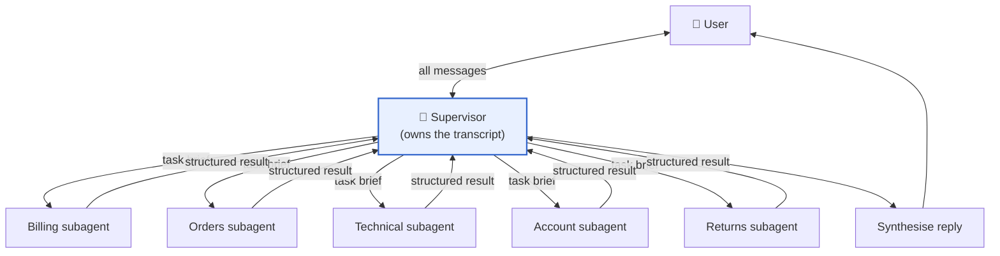
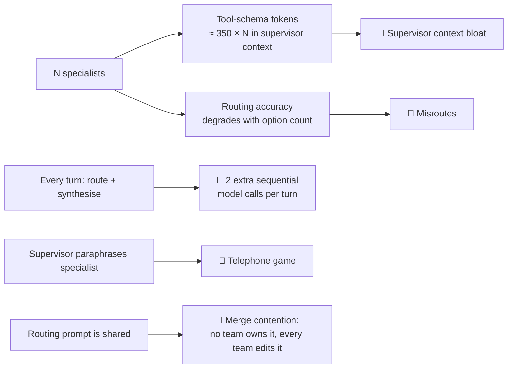
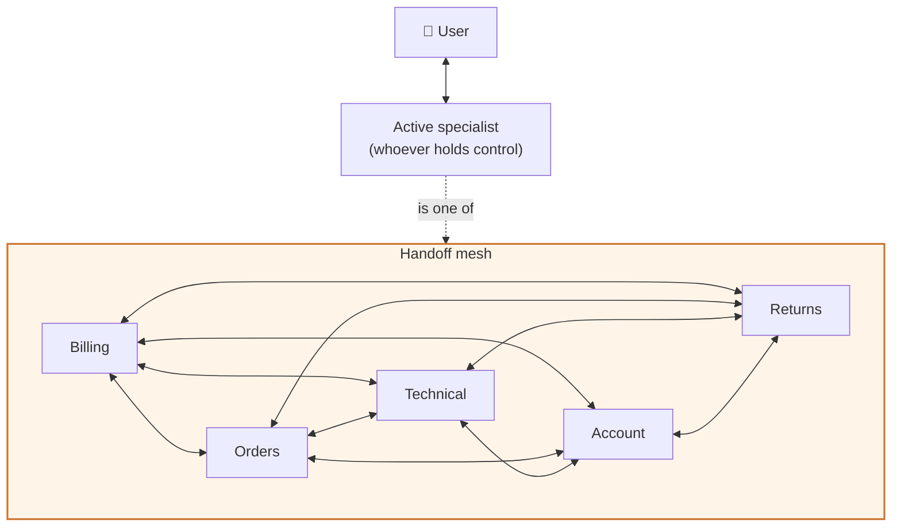
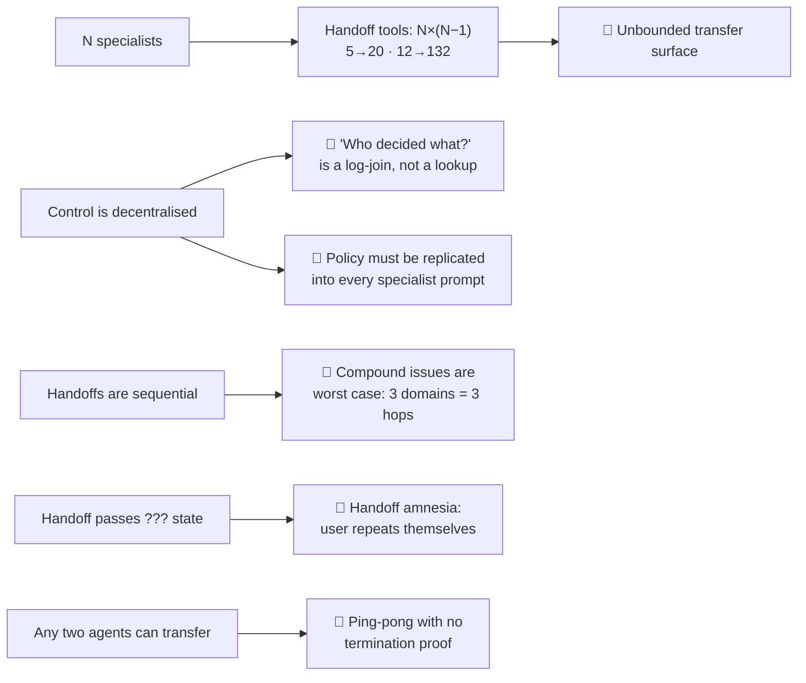

# 01 — Topology Comparison: Supervisor vs. Swarm

> **Principle 2.** Topology is a *choice*. This doc makes the choice defensible by naming what
> each topology optimises, then showing precisely what breaks it at scale.

---

## 0. The prerequisite question nobody asks

Before comparing multi-agent topologies, answer this: **which of the three needs is actually
driving you?**

| Need | Symptom | Does multi-agent solve it? |
|---|---|---|
| **Context management** | One prompt is 18K tokens of policy across 5 domains | Maybe. Try dynamic tool selection or skills first. |
| **Distributed development** | Five teams each own a domain and ship on their own cadence | **Yes.** This is the only reason that *forces* an agent boundary. |
| **Parallelism** | Compound issues take 3 sequential lookups | Partly. `Send` fan-out inside one graph may be enough. |

For Helix, all three apply, but **#2 is the binding constraint**: Billing, Orders, Technical,
Identity, and Returns are owned by different teams with different release trains and different
policy corpora. That is an *organisational* fact, and it is what makes agent boundaries real
rather than cosmetic.

> **If you have 2–3 domains and one team, stop reading and build a single agent with all the
> tools.** Every comparison below is a tax you would be paying for nothing. The topologies here
> earn their complexity at N ≥ 5 specialists across ≥ 3 owning teams.

---

## 1. Supervisor (orchestrator-worker / agent-as-tool)

A central supervisor owns the conversation. Specialists are invoked **as tools**; their results
return to the supervisor, which composes the user-facing reply.

**Interaction graph: a star.** Specialists never see each other. The supervisor is the only
component that has ever seen the whole conversation.

### What it optimises

- **Context isolation.** A specialist's internal churn — 6 tool calls, 4K tokens of invoice
  JSON — never enters the supervisor's window. The supervisor sees a 200-token structured
  result. This is the single biggest token win, and it *compounds* across turns.
- **Parallelism for free.** Compound issues fan out to 3 specialists concurrently; latency is
  one hop, not three.
- **One audit point.** "Why did we refund $49?" is a lookup in one component's trace.
- **One policy chokepoint.** Escalation rules, budget checks, and tone live in one prompt.
- **Independent deployability.** Each team ships their subagent behind a stable contract.

### What breaks it at scale — the failure curve

1. **The per-turn tax is the killer.** Archetype A is 4 turns in one domain. A pure supervisor
   pays *route + synthesise* on all four — including turn 3, where nothing has changed and the
   answer was obviously going back to Billing. At p90 = 11 turns, that is 22 avoidable model
   calls. See [02](02-cost-and-latency-model.md).

2. **The telephone game degrades correctness, not just style.** The specialist computes "$49.00
   refunded to Visa •4021, 5–7 business days, ref RF-88213." The supervisor rewrites it and
   produces "about $49 back to your card in a few days." Numbers, policy caveats, and reference
   IDs are exactly the content a paraphrasing layer is worst at preserving. Mitigation
   (verbatim-quote contracts on numeric and policy fields) works but is a *patch on a structural
   problem*.

3. **Routing decisions are made on the least information available.** The supervisor routes on
   the first message, before any lookup. "I was charged for an order that never arrived" routes
   to Billing; the answer lives in Orders. The supervisor now needs a *second* round trip it
   didn't budget for.

4. **Clarification is quadratically expensive.** When the specialist needs to ask the user
   something, it must return "I need to know X" to the supervisor, which asks the user, which
   feeds the answer back down. Every clarification is 2 hops instead of 0.

5. **The routing prompt has no owner.** Five teams, one file. It accumulates conditionals
   (`if the user mentions "chargeback" prefer Billing unless an RMA exists...`) until nobody
   dares refactor it. This is an org failure mode that shows up as a technical one.

---

## 2. Swarm (handoffs / decentralised control)

Specialists talk to the user **directly**. A handoff tool flips an `active_agent` variable in
shared state; control transfers and the new specialist stays active across subsequent turns.

**Interaction graph: a mesh.** Any agent may transfer to any other. This is where both the
benefits and the pathologies come from.

### What it optimises

- **Cheap repeats.** The specialist is already active. Turn 2 costs ~2 model calls, not ~5.
  Over Archetype A's four turns this is a ~55% cost reduction ([02](02-cost-and-latency-model.md)).
- **No middleman distortion.** The specialist's exact words reach the user. Refund amounts,
  reference IDs, and policy caveats survive verbatim.
- **Natural clarification.** "Was the seat add-on intentional?" is a normal turn, not a
  round trip through an orchestrator.
- **Lower time-to-first-token.** No routing call stands between the user's message and the first
  streamed token *once a specialist is active*.

### What breaks it at scale — the failure curve

1. **Auditability is the headline objection — and it is real but fixable.** In a naive swarm
   there is no component that saw the whole conversation, so reconstructing "who decided to
   refund and on what basis" means joining traces across agents. *This is fixable without giving
   up the topology* — see the Turn Ledger in [03](03-recommended-architecture.md). Do not let
   this objection alone decide the design; it is an artefact of coupling *recording* to
   *routing*.

2. **Policy replication is the objection that actually kills naive swarms.** If Billing owns the
   refund ceiling but Returns and Orders can also propose refunds, the ceiling exists in three
   prompts — which means it exists in zero enforceable places. The first time Returns is asked
   "just refund it, I'm a Platinum member since 2019, your policy says you can waive it" and the
   model agrees, you have a policy incident. **This is not fixable by prompting; it requires a
   single gated executor** ([07](07-tools-and-action-firewall.md)).

3. **Compound issues are the pathological case.** Archetype B has three independent
   sub-problems. A swarm handles them *sequentially* — Orders resolves, hands to Billing,
   resolves, hands to Account — because control is a single token that one agent holds at a
   time. Three hops of latency for work that has no dependencies between its parts.

4. **The N² handoff surface.** Five specialists is 20 handoff tools; twelve is 132. Every
   specialist's context carries transfer targets it will never use. Mitigation: a single
   `handoff(target: Enum)` tool plus a routing registry, which collapses N² tools into N enum
   values — necessary, and covered in [06](06-handoff-contract.md).

5. **Ping-pong.** Billing: "that's a shipping problem." Orders: "that's a billing problem."
   With no hop budget this runs until the user leaves. The fix — hop budgets + a no-progress
   detector — requires *something outside the mesh* to enforce it, which is already a supervisor
   in disguise.

6. **Handoff amnesia.** The naive implementation passes the message list. Either you pass all of
   it (context blowup, and you've lost the isolation benefit that justified separate agents) or
   you pass the last message (the specialist asks the user to repeat everything they just said —
   the #1 CSAT killer in real deployments). The fix is a structured brief
   ([06](06-handoff-contract.md)).

7. **Statefulness wrecks capacity planning.** "Which specialist is active" is a long-lived,
   per-conversation fact. Cost per conversation now has a long tail you cannot predict from
   traffic mix alone, and per-thread checkpointing means specialists don't parallelise without
   namespace conflicts.

---

## 3. Head-to-head

| Dimension | Supervisor | Swarm | Notes |
|---|:--:|:--:|---|
| Cost, single-domain repeat turns | ⭐⭐ | ⭐⭐⭐⭐⭐ | The volume case — 70% of turns |
| Cost, multi-domain one-shot | ⭐⭐⭐⭐⭐ | ⭐⭐ | ~9K vs ~15K tokens |
| Latency, first token (specialist active) | ⭐⭐ | ⭐⭐⭐⭐⭐ | Supervisor adds a routing call |
| Latency, compound issue | ⭐⭐⭐⭐⭐ | ⭐ | Parallel vs. sequential by construction |
| Answer fidelity (numbers, policy) | ⭐⭐ | ⭐⭐⭐⭐⭐ | Telephone game vs. verbatim |
| Clarification ergonomics | ⭐⭐ | ⭐⭐⭐⭐⭐ | 2 hops vs. 0 |
| Auditability, naive | ⭐⭐⭐⭐⭐ | ⭐ | Fixable in swarm via a ledger |
| Policy enforcement surface | ⭐⭐⭐⭐ | ⭐ | **Not** fixable by prompting |
| Loop containment | ⭐⭐⭐⭐ | ⭐ | Needs an out-of-mesh enforcer |
| Distributed development | ⭐⭐⭐⭐ | ⭐⭐⭐⭐ | Both good; supervisor has the shared-prompt contention problem |
| Routing accuracy as N grows | ⭐⭐ | ⭐⭐⭐ | Supervisor decides on least info; swarm decides after lookup |
| Cost attribution in traces | ⭐⭐⭐⭐⭐ | ⭐⭐ | Swarm needs deliberate per-agent tagging |
| Capacity predictability | ⭐⭐⭐⭐⭐ | ⭐⭐ | Stateless subagents have constant per-request cost |

Read that table as two clusters, not thirteen independent facts:

- **Supervisor wins where the system must be *governed*:** audit, policy, budgets, parallel
  decomposition, predictable capacity.
- **Swarm wins where the system must be *conversational*:** cheap repeats, fidelity, low
  latency, natural clarification.

Governance and conversation are **not competing requirements** — they operate at different
frequencies. Governance is per-session and per-action. Conversation is per-turn. Binding them to
the same component is the actual mistake, and both pure topologies make it.

---

## 4. Where the curves cross

Let *t* = turns in the current domain before a domain change, and *d* = distinct domains touched.

| Condition | Winner | Why |
|---|---|---|
| `d = 1, t ≥ 2` | **Swarm** | Supervisor tax repeats with no new routing information |
| `d = 1, t = 1` | Tie | One-shot; both pay one routing decision |
| `d ≥ 2`, independent sub-problems | **Supervisor** | Parallel fan-out; swarm serialises |
| `d ≥ 2`, dependent sub-problems | **Swarm** | Sequential anyway; supervisor adds hops for nothing |
| Any mutating action | **Neither** | Needs a gated executor outside both |
| `t` unbounded (angry/complex) | **Supervisor** | Escalation and budget enforcement need a governor |

Notice that **the discriminating variable is a property of the conversation, and it is not known
at conversation start.** A conversation begins looking like `d=1` and becomes `d=3` at turn 5.
This is why "pick a topology at design time" is the wrong frame: the correct topology is a
*runtime mode*, and the system must be able to switch between them mid-conversation.

That is the entire argument for [03 — the recommended architecture](03-recommended-architecture.md).

---

## 5. What a reviewer should push back on

1. "Just use a supervisor, it's simpler." → Show them the per-turn cost at p90 = 11 turns
   ([02](02-cost-and-latency-model.md)) and the telephone-game defect class.
2. "Just use a swarm, it's cheaper." → Ask where the refund ceiling is enforced. If the answer
   names a prompt, it is not enforced.
3. "Auditability rules out swarms." → Only if recording is coupled to routing. Decouple them.
4. "Hybrids are over-engineering." → Fair challenge. The hybrid must earn itself; the mode
   machine in [03](03-recommended-architecture.md) is three states, and the cost model shows it
   pays for itself at t ≥ 2, which is 70% of turns.
5. "Do you even need five agents?" → The strongest challenge. The answer here is *organisational*
   (five owning teams), not technical. If you have one team, you do not need this.

Continue to [02 — Cost & latency model](02-cost-and-latency-model.md).
