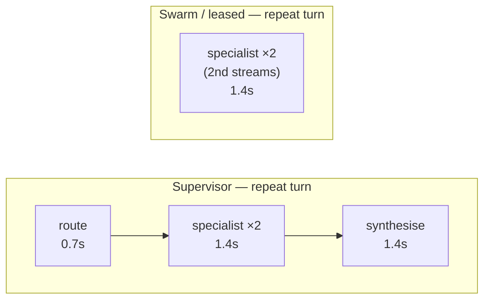

# 02 — Cost & Latency Model

> **Principle 8.** The topology argument is settled by arithmetic, not preference. This doc is
> the arithmetic.
>
> ⚠️ **All numbers here are a *model*, not a measurement.** Every assumption is stated so you can
> substitute your own rates, prompt sizes, and loop depths. The *shape* of the curves is the
> durable finding; the absolute values are illustrative.

---

## 1. Assumptions

| Symbol | Meaning | Value used |
|---|---|---|
| `L_spec` | Model calls inside a specialist's inner loop, lookup turn | 3 (reason → tool → answer) |
| `L_spec'` | Model calls inside a specialist, no-new-lookup turn | 2 |
| `P_sup` | Supervisor system prompt + N tool schemas | 800 + 350×N tokens |
| `P_spec` | Specialist system prompt (domain policy) | 1,200 tokens |
| `H_turn` | History growth per user-visible turn | 250 tokens |
| `R_tool` | Tool result payload (invoice JSON, order record) | 1,500 tokens |
| `B_brief` | Structured handoff/delegation brief | 300 tokens |
| `t_call` | Wall-clock per model call (mid-tier, short output) | 0.7 s |
| `t_gen` | Wall-clock for a user-facing generation | 1.4 s |

**Illustrative token rates** (per million tokens, in/out — substitute your own):

| Tier | In | Out | Used for |
|---|--:|--:|---|
| Frontier | $3.00 | $15.00 | Specialist reasoning on mutation-adjacent turns |
| Mid | $1.00 | $5.00 | Normal specialist turns, supervisor synthesis |
| Small | $0.25 | $1.25 | Triage, classification, no-progress detection |

---

## 2. Model-call accounting

### Archetype A — deep single domain, 4 turns, 1 domain

| Turn | Supervisor | Swarm | Leased hybrid |
|---|--:|--:|--:|
| 1 (lookup) | route 1 + spec 3 + synth 1 = **5** | triage 1 + spec 3 = **4** | triage 1 + spec 3 = **4** |
| 2 (clarify) | route 1 + spec 2 + synth 1 = **4** | spec 2 = **2** | spec 2 = **2** |
| 3 (clarify) | route 1 + spec 2 + synth 1 = **4** | spec 2 = **2** | spec 2 = **2** |
| 4 (act) | route 1 + spec 3 + synth 1 = **5** | spec 3 = **3** | spec 3 = **3** |
| **Total** | **18** | **11** | **11** |

The supervisor pays **+64% model calls** for a conversation where the routing decision never
changed after turn 1. Extrapolated to p90 (11 turns, single domain): supervisor ≈ 46 calls,
swarm/hybrid ≈ 25.

> **Why the hybrid matches swarm exactly:** the lease check is *deterministic* (no inference),
> and compound detection is a **tool on the specialist**, not a separate classifier — the
> specialist declares `out_of_scope(domain)` inside a call it was already making. Detection
> costs zero extra model calls. See [03](03-recommended-architecture.md) §4.

### Archetype B — compound, 3 independent domains, 1 turn

| | Calls | Sequential hops (latency path) |
|---|--:|--:|
| Supervisor | route 1 + 3×3 parallel + synth 1 = **11** | 1 + 3 + 1 = **5** |
| Swarm | triage 1 + 3×3 sequential = **10** | 1 + 9 = **10** |
| Leased hybrid | same as supervisor = **11** | **5** |

Swarm uses *fewer* calls but takes **2× the wall clock**, because control is a single token one
agent holds at a time. Independent sub-problems get serialised for no reason other than topology.

**This is the clearest result in the whole study:** swarms are not "cheaper"; they trade latency
for calls in exactly the case where the user is most frustrated already.

---

## 3. Token accounting (the part people get wrong)

Call counts understate the difference because **the two topologies have different context
reuse properties.**

### The stateless-subagent re-lookup tax

Classic subagents are stateless: each invocation is a fresh context. On turn 3 of Archetype A,
the Billing subagent has *forgotten* the invoice it fetched on turn 1 — so either the supervisor
re-passes it in the brief (brief bloats, isolation benefit shrinks) or the subagent **fetches it
again** (extra tool call, extra 1,500 tokens, extra latency).

| Turn 3 input tokens | Supervisor | Swarm / leased |
|---|--:|--:|
| Routing call | `P_sup(5)=2,550` + history 750 = **3,300** | — |
| Specialist call(s) | `P_spec` 1,200 + brief 300 + `R_tool` 1,500 (re-fetch) ≈ **3,000** × 2 calls | `P_spec` 1,200 + history 750 + `R_tool` 1,500 *already in history* ≈ **3,450** × 2 calls |
| Synthesis call | 2,550 + 750 + 200 = **3,500** | — |
| **Turn total (in)** | **≈ 12,800** | **≈ 6,900** |

Roughly **1.9× the input tokens per repeat turn.** With prompt caching on the specialist's
system prompt, both improve — but the supervisor's *routing* and *synthesis* contexts churn with
every turn and cache poorly, so caching narrows the gap without closing it.

### The multi-domain inversion

For Archetype B the sign flips, because context isolation is worth more than statefulness:

| | Total tokens processed |
|---|--:|
| Supervisor (isolated contexts, 3 briefs of 300) | **≈ 9K** |
| Swarm (each specialist inherits the accumulating shared transcript, incl. the other domains' churn) | **≈ 15K** |

A swarm's shared transcript means the Account specialist reads Orders' and Billing's entire tool
output for problems it does not care about. That is the isolation benefit, and it is real.

---

## 4. Latency

| | Time to first token | Turn total (p50) |
|---|--:|--:|
| Supervisor, repeat turn | **~2.1 s** (must finish routing *and* the specialist before synthesis starts streaming) | ~3.5 s |
| Swarm / leased, repeat turn | **~0.8 s** | ~1.9 s |
| Supervisor, compound | ~2.1 s | ~4.9 s |
| Swarm, compound | ~0.8 s (but the *complete* answer arrives last) | ~7.7 s |

Against the SLOs from [00](00-overview.md) — p50 TTFT ≤ 1.5 s, p95 turn ≤ 6 s — **a pure
supervisor misses the TTFT target on every turn**, and **a pure swarm misses the p95 turn target
on compound issues.** Neither pure topology satisfies the stated SLOs. That is not a rhetorical
flourish; it is why the hybrid exists.

---

## 5. Blended cost per conversation

Using the traffic mix from [00](00-overview.md) — 62% deep single-domain, 15% compound, 18%
trivial, 5% immediate escalation — and the illustrative rates above:

| Topology | Deep-A | Compound-B | Trivial | Escalate | **Blended** | vs. $0.11 SLO |
|---|--:|--:|--:|--:|--:|:--:|
| Pure supervisor | $0.186 | $0.121 | $0.019 | $0.008 | **$0.138** | ❌ 25% over |
| Pure swarm | $0.104 | $0.163 | $0.014 | $0.006 | **$0.094** | ✅ but fails latency SLO |
| **Leased supervision** | $0.104 | $0.121 | $0.006 | $0.004 | **$0.085** | ✅ |

The hybrid's extra win on *trivial* and *escalate* traffic comes from the fast paths in
[03](03-recommended-architecture.md) §3 — 23% of conversations never reach a specialist at all.
**That fast path is worth more than the topology choice itself**, and it is the cheapest thing
in this entire document to implement. Do it first.

---

## 6. Sensitivity — when does the hybrid stop being worth it?

The hybrid's advantage over a pure supervisor is `2 × (t − 1)` model calls, where `t` is turns
per domain. Its advantage over a pure swarm is on compound latency, weighted by compound share.

| Parameter | Hybrid stops paying when… | Actual (Helix) | Margin |
|---|---|---|---|
| Turns per domain `t` | `t < 2` (nothing to amortise) | p50 = 4 | comfortable |
| Compound share | `< ~4%` (parallel fan-out rarely used) | 15% | comfortable |
| Specialist count `N` | `N ≤ 3` (just use one agent) | 5, growing to 9 | comfortable |
| Owning teams | 1 (no distributed-development pressure) | 5 | comfortable |

**Where it would *not* pay:** a one-shot FAQ deflection bot (`t = 1`), a two-domain product, or a
single team owning everything. Those cases want one agent with all the tools, and this design
would be pure overhead. Say so out loud in the review — a design that cannot name the conditions
under which it is wrong has not been reviewed.

---

## 7. What to measure in production to falsify this model

| Metric | Why | Falsifies |
|---|---|---|
| Distribution of turns-per-domain (`t`) | The whole hybrid case rests on `t ≥ 2` | If p50 `t` = 1, drop to a pure router |
| Actual specialist loop depth `L_spec` | Modelled at 3; if it's 6, all costs inflate ~2× | Model-tier decisions in [10](10-cost-governance.md) |
| Compound-detection recall | Missed compounds get serialised anyway | If recall < 80%, the parallel win is theoretical |
| Cache hit rate on specialist prompts | Determines whether the token gap narrows | If > 90%, supervisor overhead shrinks materially |
| Lease revocation rate | High revocation = the lease model isn't matching reality | If > 40%, leases are mis-scoped |

Instrumentation for all five is specified in [09](09-evaluation-observability.md).

Continue to [03 — Recommended architecture](03-recommended-architecture.md).
