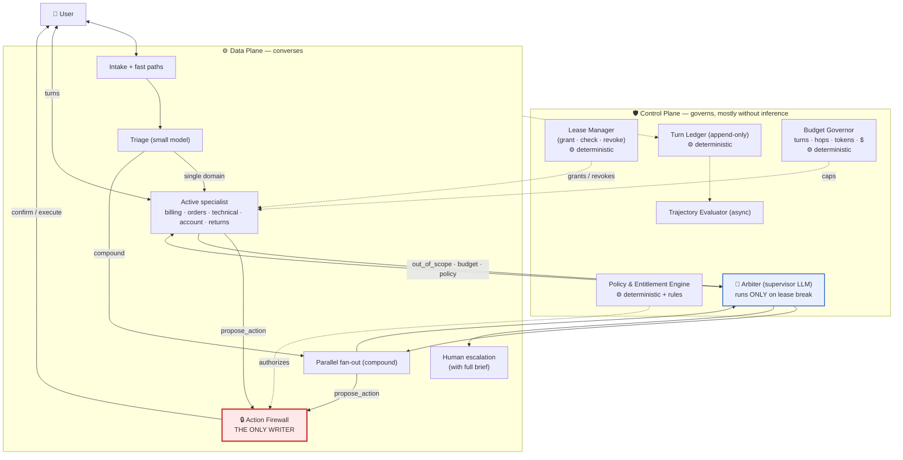
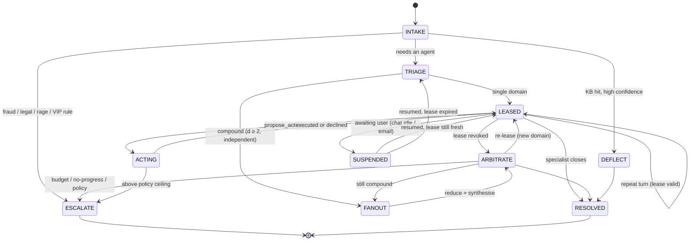
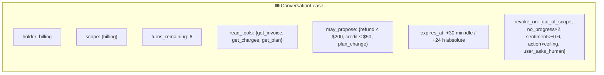
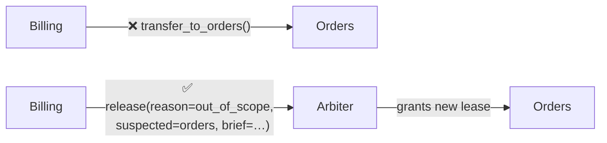
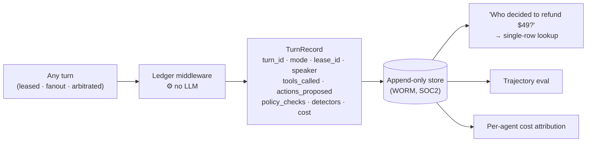
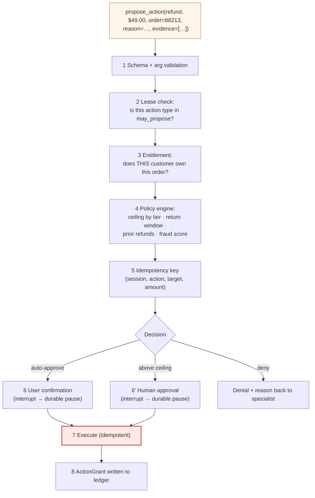
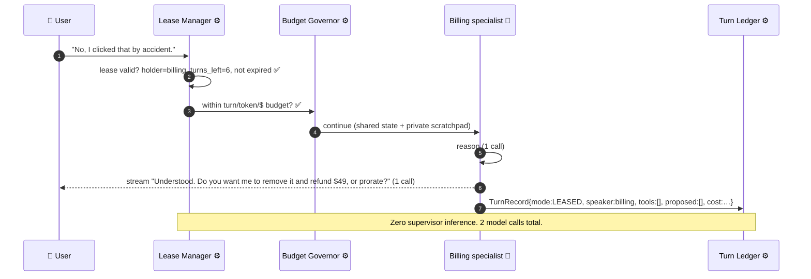

# 03 — Recommended Architecture: Leased Supervision

> **Principles 1, 2, 5.** The supervisor owns the **session**; a specialist owns the **turn**.
> Ownership of the turn is granted as a bounded, revocable **lease**. Every mutation, from every
> agent, in every mode, passes one **Action Firewall**.

---

## 1. The one idea

Both pure topologies make the same mistake: they bind **governance** (per-session, per-action)
and **conversation** (per-turn) to the same component.

- A supervisor governs well, so it also insists on speaking — and pays a routing + synthesis tax
  on every turn.
- A swarm converses well, so it also insists on governing — and scatters policy across five
  prompts.

**Separate the frequencies.** The supervisor governs at session frequency and *records* at turn
frequency; a specialist *speaks* at turn frequency under a lease.

> **The supervisor does not need to run on every turn to own every turn.**
> Recording is deterministic middleware. Routing is a model call. Decouple them and the
> auditability objection to swarms evaporates while the cost objection to supervisors is paid off.

---

## 2. The architecture



Note what is marked ⚙️ **deterministic**: the Lease Manager, Turn Ledger, Budget Governor, and
most of the Policy Engine make **zero model calls**. The control plane is mostly *code*. The only
control-plane component that thinks is the Arbiter, and it runs on lease breaks — roughly once
per conversation, not once per turn.

---

## 3. The mode machine



The **hot path is `LEASED → LEASED`.** That transition costs one Lease Manager check (a
dictionary lookup and two integer comparisons), one ledger append, and the specialist's own
model calls. It is exactly as cheap as a pure swarm turn.

### The fast paths pay for the whole system

23% of conversations (`DEFLECT` + `ESCALATE` from intake) never reach a specialist:

- **DEFLECT** — retrieval over the KB with a calibrated confidence threshold answers "where's my
  invoice" without invoking an agent loop at all.
- **ESCALATE** — deterministic rules (fraud keywords, legal language, chargeback filed, rage
  sentiment, enterprise-tier VIP flag) route straight to a human with a generated brief.

Per [02](02-cost-and-latency-model.md) §5 this is the single largest cost lever in the design and
the cheapest to build. **Build it first, before any of the topology work.**

---

## 4. The Lease

The lease is the control-plane object that makes swarm-style conversation governable.



| Field | Purpose | What goes wrong without it |
|---|---|---|
| `holder` + `scope` | Who speaks, about what | Specialist answers outside its policy corpus, confidently and wrongly |
| `turns_remaining` | Hop/turn budget | Infinite loops; the 40-turn conversation nobody noticed |
| `read_tools` | Least-privilege reads | Billing reading identity records; GDPR surface creep |
| `may_propose` | Which *action types and limits* it may even suggest | Returns proposing a $5,000 refund and the user seeing it before policy says no |
| `expires_at` | Idle + absolute TTL | Email thread resumes after 2 days with a stale specialist and stale facts |
| `revoke_on` | Declarative revocation | Every revocation reason becomes bespoke code in five specialists |

**Leases are granted by the Arbiter, checked deterministically, and revoked by any of six
conditions.** Revocation returns the session to `ARBITRATE`, which is the *only* place a new
lease is minted. There is no agent-to-agent handoff in this design — specialists cannot transfer
to each other, they can only **release** the lease with a reason. This collapses the swarm's
N² handoff mesh into N release reasons, and it is why loop containment is provable here and not
in a pure swarm.



The mesh becomes a star **without** putting the supervisor on the hot path — because the star is
only traversed on *release*, not on every turn.

### Compound detection costs nothing

Every specialist carries one extra tool:

```python
@tool
def release_lease(reason: Literal["out_of_scope", "resolved", "needs_human",
                                  "additional_domain"],
                  suspected_domain: str | None,
                  brief: HandoffBrief) -> Command: ...
```

The specialist is the best-positioned component to notice it is out of scope, and it declares
this **inside a model call it was already making**. No separate classifier, no per-turn routing
call. That is the mechanism behind the hybrid matching pure-swarm cost in
[02](02-cost-and-latency-model.md) §2.

Self-report is not fully reliable, so two deterministic backstops run per turn at zero inference
cost: a **no-progress detector** (no new facts, no tool calls, and high semantic similarity to
the previous agent turn, twice in a row) and the **turn budget**. A cheap small-model
compound-classifier runs only on *sampled* turns for measuring detection recall
([09](09-evaluation-observability.md)) — not on the hot path.

---

## 5. The Turn Ledger — auditability without inference

Every turn, in every mode, a deterministic middleware appends one record:



This is the move that answers the strongest objection to swarm-like topologies. The question
"who decided what, on what evidence, under what authority" is a **single-row lookup joined to
one ActionGrant**, not a cross-agent trace archaeology exercise — even though no supervisor LLM
ran on that turn.

**Corollary for reviewers:** if someone argues "swarms aren't auditable," they are describing an
implementation where recording was coupled to routing. That coupling is optional.

---

## 6. The Action Firewall — the only writer

Regardless of mode, regardless of who is speaking, **no specialist executes anything**. They
call `propose_action(...)`; the firewall decides.



Steps 2–4 are the reason this component exists. In a pure swarm the refund ceiling lives in
whichever prompts happen to mention it; here it lives in one policy engine that every path must
traverse. **Policy that lives in a prompt is not enforced — it is suggested.** Full treatment in
[07](07-tools-and-action-firewall.md) and [08](08-safety-guardrails.md).

---

## 7. What runs on a hot-path turn

Concretely, turn 3 of Archetype A:



Compare to a pure supervisor's five calls on the same turn, with an extra 1.3 s before the first
token reaches the user.

---

## 8. LangGraph mechanics

| Design element | LangGraph construct |
|---|---|
| Mode machine | `StateGraph` with `Command(goto=…, update=…)` returned from nodes |
| Lease check / ledger / budget | Plain Python **middleware nodes** — no model, ~1 ms |
| Specialist owns the turn | Specialist node is the graph's exit point; the graph ends its step with the specialist's message |
| Release, not transfer | `release_lease` tool returns `Command(goto="arbiter", graph=Command.PARENT)` |
| Compound fan-out | `Send("billing", brief)`, `Send("orders", brief)`, … + a reduce node with `defer=True` |
| Durable pause for confirmation | `interrupt()` + checkpointer; survives process restart and multi-day email threads |
| Private specialist scratchpad | Subgraph-local state channel, not merged into the shared `messages` channel |
| Append-only ledger | State channel with an append reducer, mirrored to a WORM store |
| Per-agent cost attribution | `agent_name` + `lease_id` on every model-call metadata tag |

Detail on state channels and reducers in [05](05-state-and-memory.md); runtime and durability in
[04](04-agent-runtime.md).

---

## 9. Honest limitations

1. **It is a third thing to learn.** Two topologies were already hard; this is a mode machine on
   top of both. Justified only at N ≥ 5 specialists across ≥ 3 teams — see
   [02](02-cost-and-latency-model.md) §6.
2. **Lease scoping is a tuning problem.** Too tight and you thrash through the Arbiter; too loose
   and specialists answer outside their competence. Expect two or three iterations; instrument
   revocation rate from day one.
3. **Self-reported out-of-scope has imperfect recall.** A specialist that doesn't know what it
   doesn't know will answer a shipping question badly. The backstops reduce this; they do not
   eliminate it.
4. **Fan-out reduce is still a paraphrasing layer.** Archetype B goes through the Arbiter, which
   means the telephone game from [01](01-topology-comparison.md) §1 applies *to compound issues*.
   Mitigated by verbatim-field contracts, not eliminated.
5. **The ledger is only as good as its writers.** A specialist that calls an external API
   directly, bypassing the tool layer, is invisible to it. Enforced by making tool access the
   only egress path from the sandbox — a deployment concern, not a prompt concern.

Continue to [04 — Agent runtime & execution](04-agent-runtime.md).
