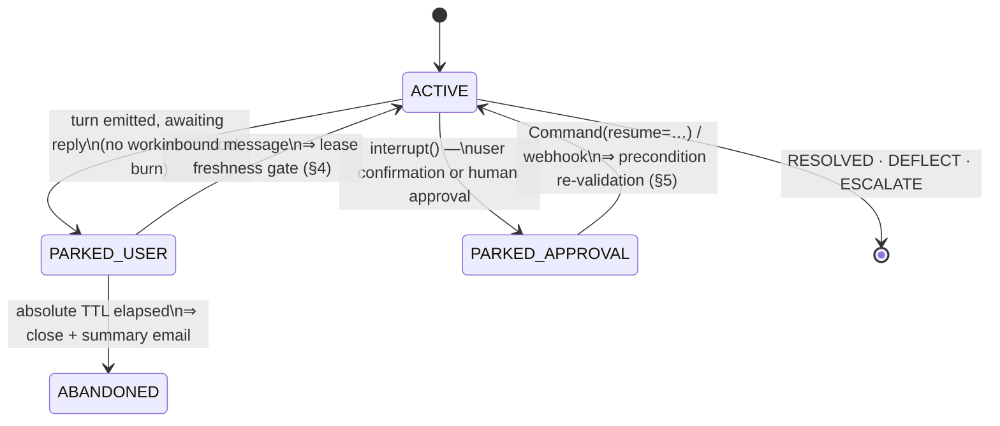
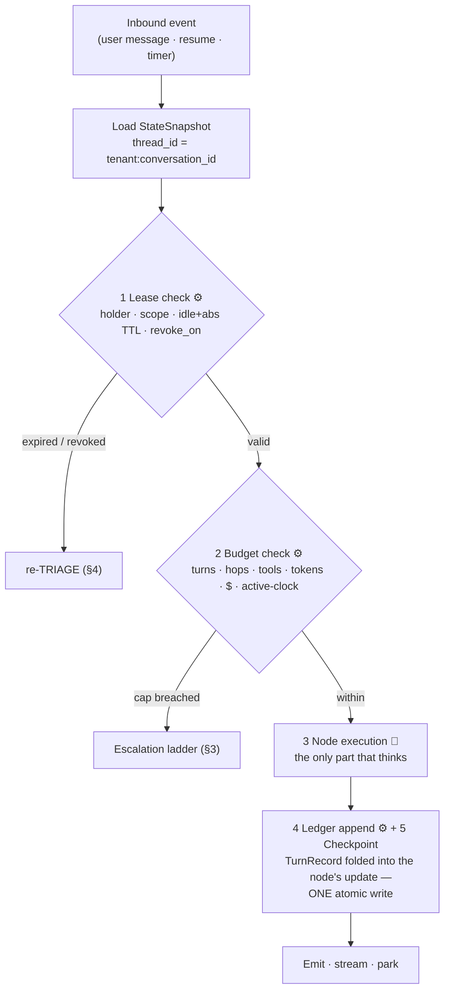
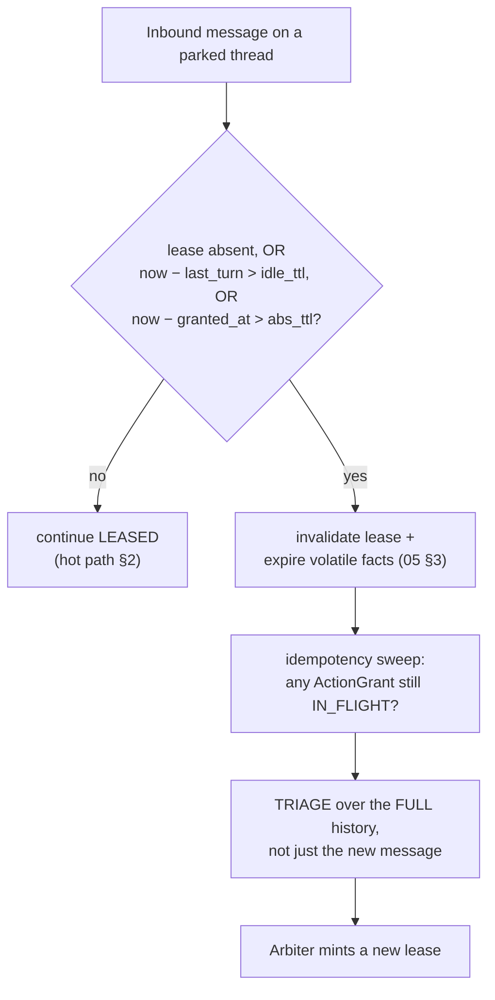
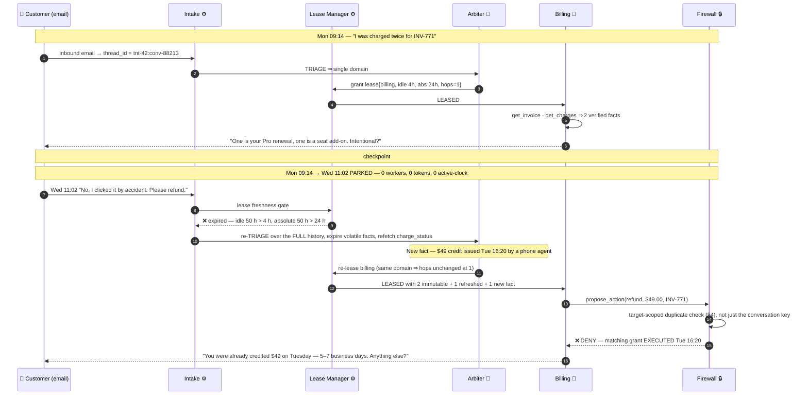

# 04 — Agent Runtime & Execution Model

> **Principle 1.** A conversation is an explicit, resumable **object** — mode, lease, budget,
> ledger cursor — not an LLM loop that runs until it feels finished. Every step is bounded
> *before* it runs and durable *after* it runs, and the gap between those two facts is where the
> interesting bugs live.

---

## 1. The session as a resumable object

[03](03-recommended-architecture.md) §3 gives the legal transitions between `INTAKE`, `TRIAGE`,
`LEASED`, `FANOUT`, `ARBITRATE`, `ACTING`, `SUSPENDED`, `DEFLECT`, `ESCALATE`, `RESOLVED`. The
runtime needs a second view — **who is holding the conversation right now.** There are only two
macro-states, and every edge between them is gated.



**In steady state ~97% of open conversations are PARKED.** At 40k/day and p90 = 11 turns the system
holds tens of thousands of live sessions while running ~180 concurrent steps — the entire reason
the session is a durable object and not a process. Sole-writer rules the runtime enforces
mechanically: only `ARBITRATE` writes `lease` and `case.resolution_state`, only the Action Firewall
writes `actions`, and **`FANOUT` branches write `facts` but never `messages`**
([05](05-state-and-memory.md) §4).

---

## 2. The per-step loop

Every step — leased turn, fan-out branch, arbitration, firewall pass — traverses the same five
stages. Three of them are pure code.



```python
def guarded(node, *, name: str):
    def run(state: SessionState, cfg) -> Command:
        if not (lz := check_lease(state, name)).valid:          # ⚙️ lookup + 2 int compares
            return Command(goto="arbiter", update={"lease": None, **lz.reason})
        if (b := check_budget(state, name)).breached:
            return b.ladder_command()                           # ⚙️ deterministic, §3
        return append_ledger(node(state, cfg), state, name)     # 🧠 then ⚙️
    return run

builder.add_node(n, guarded(fn, name=n))    # ONE call site, every node
```

**Guards are applied at graph-build time, not drawn as edges.** An edge you forgot to draw is a
silent bypass of the Budget Governor that no test catches; a wrapper applied inside the single
`add_node` call site cannot be forgotten. It is also where `agent_name` and `lease_id` get stamped
onto model-call metadata for cost attribution ([10](10-cost-governance.md)).

**The ledger append and the checkpoint are one write, not two.** The `TurnRecord` is folded into the
node's own `Command.update`, so it lands inside the checkpoint transaction; the WORM mirror is fed
by an outbox tail off the checkpoint table. Dual-writing "insert into ledger, then checkpoint"
produces on crash either an audited turn that never happened or an unaudited turn that did — and the
second breaks the 100% audit-completeness SLO in [00](00-overview.md) §2.

---

## 3. Budgets are first-class, not telemetry

Six independent caps per conversation, all counted in state, all checked before the node runs.

| Budget | Cap | Counter | Rung on breach |
|---|---|---|---|
| **Turns** | 30 soft / 40 hard | `budget.turns` | warn → force `ARBITRATE` → `ESCALATE` |
| **Hops** (lease grants) | 4 | `budget.hops` | force `ARBITRATE` at 3 → `ESCALATE` at 4 |
| **Tool calls** | 25 | `budget.tool_calls` | drop to cached reads → `ARBITRATE` |
| **Tokens** | 60K in+out | `budget.tokens` | compaction ([05](05-state-and-memory.md) §7) → degrade tier |
| **Active wall-clock** | 8 min | `budget.active_ms` | `ESCALATE` (chat) / park + retry (email) |
| **Dollars** | $0.35 ≈ 3× the $0.11 blended target | `budget.usd` | degrade tier → `ARBITRATE` → `ESCALATE` |

The ladder is *warn → degrade model tier → force `ARBITRATE` → escalate to a human*, but **which cap
you hit selects the entry rung; there is no universal ladder.** The hop cap is a ping-pong signal and
jumps straight to arbitration; the dollar cap is a verbosity signal and degrades tier first.
Degrading the *Arbiter's* tier is never a rung — it runs once per conversation and it is the thing
deciding whether to spend a human. Three things people get wrong:

1. **Wall-clock must be active-time, not elapsed-time.** Email threads legitimately span days; an
   elapsed-time budget escalates every one of them at the 2-day mark for no reason. The counter
   accumulates only while a worker holds a step, so a conversation parked for six weeks has burned
   **zero** wall-clock — the absolute lease TTL (§4) ends it, not the budget.
2. **Fan-out must pre-debit.** `budget` is an additive channel so parallel writes accumulate
   correctly, but check-then-spend against an additive counter is racy: three `Send`s each read
   `usd = 0.28` against a $0.35 cap, all pass, all spend, conversation lands at $0.52. The fan-out
   node **reserves** `K × worst_case_branch_cost` before dispatch and the reduce node credits back
   the remainder. *Post-hoc accounting cannot enforce a cap it learns about after the money is gone.*
3. **Counters are read from state, never from the metrics pipeline** — metrics backends are
   eventually consistent, and a step reading a lagging counter overspends silently.

---

## 4. Resumability: the pause is the normal case

`thread_id = f"{tenant_id}:{conversation_id}"` against `AsyncPostgresSaver` — one thread per
conversation, forever, tenant-prefixed so no id is guessable across tenants and comfortably under
the 255-char column bound. `durability="async"` on conversational turns, `"sync"` on the `ACTING`
path only (§7). A 20-minute chat idle resumes on a fresh lease; a dropped chat returning a day later
does not; an email thread returning in two days definitely does not.

### Lease TTLs are keyed by domain, not by channel

**The idle TTL is not a measure of user attention — it is a measure of fact half-life.** A lease
bundles *authority* with the implicit assumption that the facts it was granted against still hold,
and an order's shipping status does not care which channel the customer is on.

| Lease holder | Idle TTL | Absolute TTL | Why |
|---|---|---|---|
| Billing | 4 h | 24 h | invoice/charge state is slow-moving |
| Orders & Shipping | 45 min | 12 h | carrier scans and stock exceptions move continuously |
| Technical | 12 h | 48 h | advisory; the "facts" are docs, not mutable state |
| Account & Identity | 30 min | 8 h | a stale identity lease is a security posture, not an inconvenience |
| Returns | 4 h | 24 h | RMA windows move by days |

Consequence: **an email conversation about a shipment almost always re-triages on resume. That is
correct behaviour, not a defect** — track re-triage rate by channel as an expected distribution in
[09](09-evaluation-observability.md), never as an alert.



Re-triage runs over the whole conversation because `"any update?"` is unroutable in isolation. And
it is **free in hops when it re-leases the same domain** — hops exist to bound ping-pong, and
returning to the specialist you were already talking to is not ping-pong. Charging a hop makes long
email threads escalate for the crime of being email.

### Idempotency ≠ duplicate detection

| `ActionGrant` status | Resume behaviour |
|---|---|
| `PROPOSED` | re-validate preconditions (§5), then re-ask |
| `IN_FLIGHT` | **reconcile** — re-query downstream with the same key; never re-issue blind |
| `EXECUTED` | never re-execute; render the confirmation *from the grant* |
| `DENIED` / `EXPIRED` | terminal; do not re-propose without new facts |

`idempotency_key = h(conversation_id, action_type, target_id, amount_cents)` — **derived from state,
never generated at call time.** A `uuid4()` minted inside the node is a fresh key on every replay,
and a replayed refund with a fresh key is a second refund. The grant is written `IN_FLIGHT` *before*
the downstream call, because the window you actually lose is between "sent" and "recorded".

That key is conversation-scoped, so it catches **replays and nothing else** — not a *genuinely new*
intent duplicating an action taken elsewhere (a phone agent, another conversation, the self-serve
portal). That needs a **target-scoped** check against the ActionGrant store plus the customer's
refund history in the long-term Store ([05](05-state-and-memory.md) §5). **A design with only the
conversation-scoped key double-refunds every customer who also called the phone line.**

---

## 5. Durable interrupts and the stale-approval hazard

```python
decision = interrupt({
    "kind": "confirm_action", "grant_id": grant.id,
    "render": "Remove the seat add-on and refund $49.00 to Visa •4021?",
    "preconditions": grant.precondition_hashes,   # ← the point of this section
    "decision_ttl_s": 86_400,
})   # resumed via graph.invoke(Command(resume={"approved": True}), config)
```

**The LangGraph gotcha that costs money:** `interrupt()` resumes by **re-executing the node from the
top**, not by continuing after the interrupt line, so any side effect before the call runs twice.
Therefore **the node containing `interrupt()` must do nothing but ask** — validation in the node
before, execution in the node after. That is precisely why the firewall in
[03](03-recommended-architecture.md) §6 is drawn as eight discrete steps rather than one function.
Related: multiple `interrupt()` calls in one node match resume values **by index**, so their number
and order must not depend on state that can change while parked.

The harder problem is time. A human approves a $180 goodwill credit Monday 17:40; the thread resumes
Wednesday 09:05. In between: a chargeback was filed, a phone agent already refunded it, the order
shipped and lost eligibility, the approver left, or a policy deploy moved the tier ceiling.
**An approval is a decision about facts, not about an action type.**

| Precondition class | Example | Re-checked at resume by |
|---|---|---|
| Fact hashes | `order.88213.status`, `invoice.INV-771.balance` | re-fetch, compare hash |
| Cumulative policy | trailing-90d refund total for this customer | recompute from the Store |
| Entitlement | approver still holds `refund.approve ≤ $500` | identity service, at resume |
| Adversarial | chargeback filed, fraud score moved | re-score |
| Decision freshness | `decision_ttl` — 24 h for money, 7 d for advisory | hard expiry |

If any precondition moved, **invalidate the grant — do not silently re-ask the same human, and
never silently proceed.** The action re-enters the firewall as a *new* proposal against the new
facts, where it may be auto-approvable, denied outright, or need a different approver. Reusing a
stale approval is how you refund an already-refunded order, and it never appears in testing because
no test waits 40 hours. Corollary: **the approval UI must show the human the decision TTL** — an
approval with no expiry is a standing authorization, and standing authorizations are what auditors
ask about.

---

## 6. Isolation and the same-thread concurrency hazard

Isolation runs on three axes: **execution** (one thread, one in-flight step), **state**
(tenant-prefixed `thread_id`, per-tenant `checkpoint_ns`, Store namespaces keyed
`(tenant_id, "customer", customer_id)`), and **blast radius**. **Budgets bound one conversation;
bulkheads bound one conversation's effect on others — you need both,** because a conversation
entirely within its $0.35 budget can still be a noisy neighbour. The bulkheads: per-tenant daily
dollar ceiling, fan-out width cap `K ≤ 4`, and a per-tenant tool concurrency limiter so one
conversation's 25 tool calls cannot saturate the billing API for the other 39,999.

LangGraph serializes at the thread level — a second run never interleaves with an in-flight one.
What happens instead is chosen by a **multitask strategy**, and the default is wrong for support.

| Strategy | Behaviour | Verdict |
|---|---|---|
| `reject` | second request errors | ❌ silently drops the customer's message |
| `enqueue` | run both, in order | ❌ three rapid messages ⇒ three replies; the transcript reads as a broken robot |
| `rollback` | cancel + discard in-flight, restart with the new input | ✅ default for chat |
| `interrupt` | cancel in-flight, keep partial state, start the new run | ✅ when expensive reads already completed |

The real fix is upstream. **Coalesce at the channel adapter:** hold inbound messages for ~800 ms of
user silence and append them as one turn. `"hi"` / `"my order is late"` / `"#88213"` is one thought
and must become one turn; the multitask strategy is the backstop for the race the debounce cannot
win, not the primary mechanism.

**Double-submit** — the user taps *Confirm refund* twice, producing two resumes for one interrupt.
Two guards at different layers, deliberately: (1) the resume payload carries `interrupt_id` and a
resume whose id isn't the pending one is dropped; (2) the idempotency key from §4, which also
absorbs a resume replayed by a retrying webhook. Never rely on one — the first is a client-supplied
id a buggy client can get wrong, the second is derived from state and cannot be.

---

## 7. Streaming vs. durability

Tokens reach the user before the super-step ends; under `durability="async"` the checkpoint lands
after. The window is tens of milliseconds and it is real: **if the process dies mid-stream the
customer has read text that exists in no checkpoint.** On resume the node re-executes, the model
samples differently, and the durable transcript disagrees with the screen.

1. **Only stream messages that are safe to be wrong.** Action confirmations — *"I've refunded
   $49.00, ref RF-88213"* — are **not** generated text; they are rendered from the `ActionGrant` by
   the firewall *after* it is durable, from a template. Streaming is for explanation and
   clarification; commitments belong to the firewall. This one rule deletes the dangerous class.
2. **Provisional-until-committed on the client.** Streamed tokens render as provisional; a
   `turn_committed{checkpoint_id, message_id}` event promotes them, and on reconnect the client
   replaces anything still provisional with the committed transcript. The customer may see a
   sentence change once; they will not see a promise the system does not remember.
3. **Stable message ids generated upstream**, so a replayed turn upserts through `add_messages`
   instead of duplicating ([05](05-state-and-memory.md) §1).
4. **`durability="sync"` on the `ACTING` path only** — paying it on every chat turn adds 2–3× DB
   write latency to the SLO with the least headroom (TTFT ≤ 1.5 s).

Honest residual: with (1) and (2) a mid-stream crash costs a re-generated sentence. Without (1) it
costs a phantom refund promise — and the customer has a screenshot.

---

## 8. Worked timeline: a 2-day email pause



The **target-scoped duplicate check** is the interesting step. A conversation-scoped idempotency key
would have *passed* this proposal, because the phone agent's refund happened in a different
conversation entirely. The duplicate is caught only because the firewall also checks the target —
and the customer is told about a credit this conversation never issued.

---

## 9. Failure & degraded modes

| Failure | Degraded behaviour |
|---|---|
| Checkpointer (Postgres) down | **Fail closed on writes, open on reads.** Answer read-only questions from live tools; refuse to enter `ACTING`; do not admit new conversations to `LEASED`. *A mutation you cannot record is a mutation you cannot audit* — and the audit SLO is 100% |
| Checkpoint won't deserialize after a schema deploy | Tolerant deserialization (additive fields with defaults; never rename or retype a channel in place). On failure, quarantine the thread and escalate with the transcript **from the ledger** — which is exactly why the ledger is a separate store, not a view over checkpoints |
| Graph topology changed while threads sit on `interrupt()` | Pin threads to a **graph version**; drain old versions; never rename a node that can appear in a pending task |
| Two workers resume one thread | Optimistic concurrency on `(thread_id, checkpoint_id)`; the loser retries against the new head, and if it was mid-action the idempotency key absorbs it |
| Model provider 5xx / timeout | Retry once at tier → degrade tier → `ARBITRATE` with `reason=tool_failure`. Never emit a silent empty turn |
| Clock skew across workers | TTLs evaluated against `checkpoint.created_at` from the DB, never worker wall-clock |

Full treatment in [11](11-failure-modes.md).

---

## 10. Design-review questions

1. Show me the code path where a budget is checked. **Is it possible to add a node that skips it?**
   If the answer involves "remember to draw the edge", the design is wrong.
2. Which `durability` mode does each run type use, and who signed off that a chat turn may be lost
   on a hard crash?
3. A grant approved by a human 40 hours ago resumes now. Name **every** precondition re-checked, and
   name the owner of that list.
4. The same refund is initiated in chat and by a phone agent five minutes apart — which check
   catches it, and is it conversation-scoped or target-scoped?
5. What does the customer see if the process dies mid-stream, and what do they see on reconnect?
6. Does the lease TTL table reflect the *measured* half-life of each domain's facts, or a guess made
   at design time? And when we deploy a graph change, what happens to the threads parked on an
   `interrupt()` right now?

Continue to [05 — State & memory](05-state-and-memory.md).
