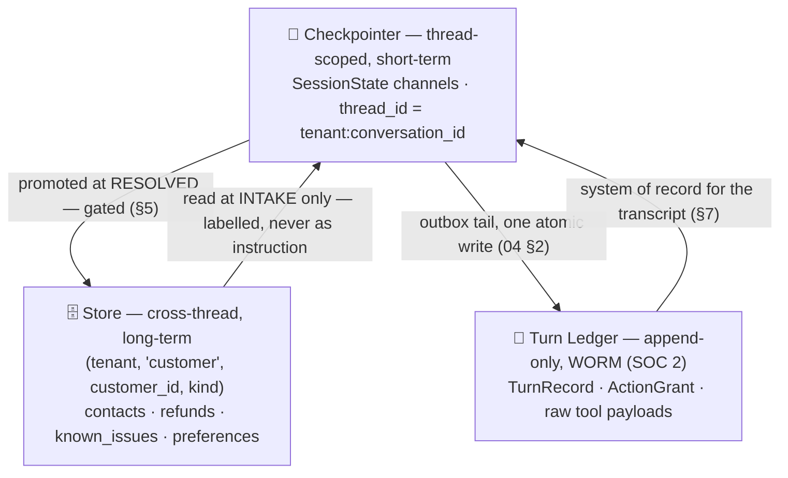
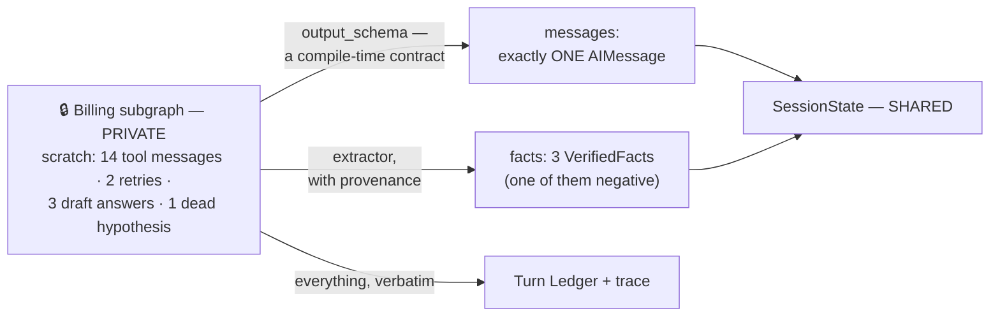
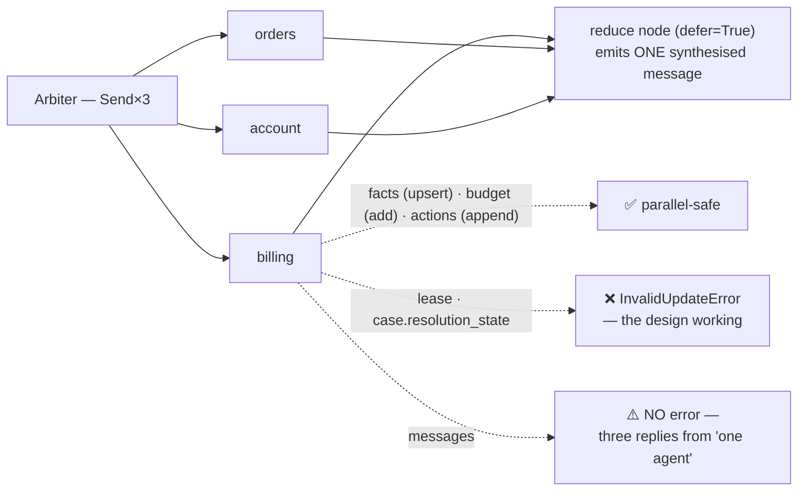
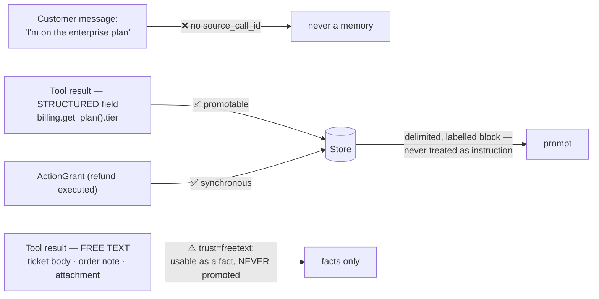
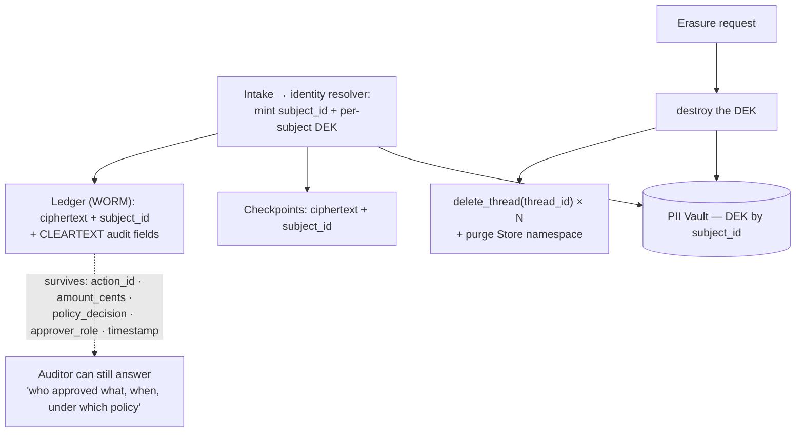

# 05 — State & Memory

> **Principle 3.** Split the conversation's state into channels with explicit owners and explicit
> reducers. The hardest call is not *what* to store — it is **what a specialist is allowed to make
> everyone else look at.**

---

## 1. Three persistence tiers, one conversation



Conflating the checkpointer and the Store is the classic LangGraph mistake; here there is a third
thing to keep separate. **The checkpointer holds what the graph needs to resume, the Store holds
what the customer needs remembered, and the ledger holds what the auditor needs proven.** Different
retention, different write paths, and — critically — different erasure semantics (§6).

### The state schema

| Channel | Type | Reducer | Written by | Read by |
|---|---|---|---|---|
| `messages` | `list[AnyMessage]` | `add_messages` (upsert by id) | Intake (user turns), **the one active specialist** (final message only), Firewall (rendered confirmations) | every prompt builder; the UI |
| `customer` | `CustomerProfile` | `LastValue` | Intake, once, from the identity service | all nodes; the policy engine |
| `case` | `Case` | `LastValue` | Triage (`intents`, `domains`); **Arbiter (`resolution_state`)** | all nodes; the ledger |
| `lease` | `ConversationLease \| None` | `LastValue` | **Arbiter only** | Lease Manager; every guarded node ([04](04-agent-runtime.md) §2) |
| `facts` | `list[VerifiedFact]` | `upsert_facts` (§3) | the tool-result extractor only | prompt builders; handoff briefs ([06](06-handoff-contract.md)) |
| `actions` | `list[ActionGrantRef]` | `operator.add` | **Action Firewall only** ([07](07-tools-and-action-firewall.md)) | policy engine; Arbiter; prompt builders |
| `ledger_cursor` | `int` | `max` | ledger middleware | the outbox tail |
| `budget` | `BudgetCounters` | field-wise `add` | every guarded node; fan-out reservations | Budget Governor |
| `scratch` | `list[AnyMessage]` | `add_messages` | **subgraph-local — absent from this schema entirely** (§2) | that one specialist |

`messages` is the obvious `DeltaChannel` candidate — at p99 = 30 turns a full-value write of the
message list on every super-step dominates checkpoint cost — but adoption is a **one-way door per
thread**, so do the compaction work in §7 first and measure whether you still need it.

---

## 2. Shared vs. private is the central design decision

A specialist's internal churn — tool JSON, retries, abandoned hypotheses, three drafts of an answer
— must **not** enter `messages`. Two reasons, both load-bearing:

1. **Context isolation was the entire justification for having separate agents.** If billing's 14
   tool round-trips land in shared `messages`, then when the Arbiter re-leases to orders, orders
   inherits billing's noise: you have paid the multi-agent tax — extra hops, extra prompt overhead —
   and bought a single-agent context. The multi-domain token inversion in
   [02](02-cost-and-latency-model.md) §3 (~9K vs ~15K) *depends* on isolation.
2. **The transcript is the product** ([00](00-overview.md) §4). `messages` renders in the chat
   window and gets quoted into email replies. Tool JSON in it means either the seams show or you
   filter at render time — and a render-time filter is a second definition of "the transcript" that
   will drift from the first.



The mechanism is **schema, not discipline**: a channel that exists in the subgraph's state and not
in the parent's is never propagated.

```python
billing = StateGraph(BillingScratch,               # scratch lives here and nowhere else
                     input_schema=SpecialistBrief,    # what it may READ
                     output_schema=SpecialistOutput)  # what it may PROMOTE
```

`SpecialistOutput` declares `final_message: AIMessage` — **singular**. A specialist that wants to
emit two user-visible messages in one turn cannot; the type forbids it.

### The projection rule — what gets promoted

| Produced inside the specialist | Promoted? | Lands in |
|---|---|---|
| Tool call requests + raw tool JSON | ❌ | ledger (WORM) + trace |
| Intermediate reasoning, drafts, retries | ❌ | trace only |
| The final user-facing message | ✅ | `messages` — exactly one |
| A verified fact from a tool result | ✅ | `facts`, with provenance |
| A **negative** result — "checked for a duplicate charge, there is none" | ✅ | `facts` with `polarity=absent` |
| A proposed action | ❌ — the *grant* is | `actions`, after the firewall |
| "I already asked the user X" | ✅ implicitly | it is already in `messages` |

**The negative-fact row is the one people miss.** Most designs promote only positive findings, so
the next specialist re-runs the lookup that already came back empty — precisely the re-lookup tax
from [02](02-cost-and-latency-model.md) §3. *"We checked and there is no duplicate charge"* is a
fact, and it costs 20 tokens to carry.

---

## 3. `facts` is the anti-amnesia mechanism

```python
@dataclass(frozen=True)
class VerifiedFact:
    key:            str        # "order.88213.status" — the upsert key
    value:          JSONValue
    polarity:       Literal["present", "absent"]
    source_tool:    str        # "oms.get_order"
    source_call_id: str        # → ledger row → raw response in WORM
    observed_at:    str        # ISO-8601, stamped by the TOOL layer
    ttl_class:      Literal["immutable", "slow", "volatile"]
    trust:          Literal["structured", "freetext"]   # see §5
```

`ttl_class` is the coarse bucket the runtime uses to decide what to expire on resume
([04](04-agent-runtime.md) §4); it resolves to the concrete `ttl_s` carried on the handoff brief in
[06](06-handoff-contract.md) §2.

**Invariant: the only writer of `facts` is the tool-result extractor. There is no code path from a
user message to a fact.** A customer saying *"I'm on the enterprise plan"* is a **claim**, and a
claim is a *different type* — it never enters this channel, and the only promotion path is
`promote(claim, tool_result) -> VerifiedFact` ([06](06-handoff-contract.md) §3).

```python
def upsert_facts(old, new):                      # commutative AND associative
    by_key = {f.key: f for f in old}
    for f in new:
        cur = by_key.get(f.key)
        if cur is None or (f.observed_at, f.source_call_id) > (cur.observed_at, cur.source_call_id):
            by_key[f.key] = f
    return sorted(by_key.values(), key=lambda f: f.key)
```

**"Keep the write with the greater `(observed_at, source_call_id)`" is commutative and associative;
"last write wins" is not.** Under parallel fan-out the order in which two branches' writes are
applied is not guaranteed, so a plain last-wins upsert yields a result that depends on batching —
and under a `DeltaChannel`, where the reducer runs at reconstruction time, that becomes *state that
changes when you replay it*. The `source_call_id` tiebreak is what makes the ordering total. Note
also that `observed_at` is stamped by the tool layer, never computed in the reducer: **reducers must
be pure — no `datetime.now()`, no `uuid4()`** — or replay and forking diverge.

| Handoff payload | Tokens | Amnesia risk | Injection surface | Staleness handling |
|---|---|---|---|---|
| **Full transcript** | 8–15K, growing | none | **high** — attacker-controlled ticket bodies ride along ([08](08-safety-guardrails.md)) | none; the receiver must re-derive, and re-derivation is where hallucinated facts enter |
| **Last message only** | ~150 | **severe** — the receiver re-looks-up, or worse re-asks the customer | low | none |
| **`facts` + brief** | ~400 for 8–20 entries | low | low — structured fields only | per-fact `ttl_class`; volatile facts expire on resume ([04](04-agent-runtime.md) §4) |

Re-asking the customer is the specific failure the CSAT SLO in [00](00-overview.md) §2 measures.
**A fact with provenance can be cited, audited, and expired. A sentence in a transcript can only be
re-read and re-believed.**

---

## 4. Concurrent writes: the fan-out hazard



| Channel | Parallel writes | What actually happens |
|---|---|---|
| `facts` | ✅ safe | `upsert_facts` is commutative and associative (§3) |
| `budget` | ✅ safe | additive — but see the pre-debit rule in [04](04-agent-runtime.md) §3 |
| `actions` | ✅ safe | append-only, and the Firewall is a single node, so writes serialise anyway |
| `lease` | ❌ **bug** | `LastValue` ⇒ `InvalidUpdateError: At key 'lease': Can receive only one value per step` |
| `case.resolution_state` | ❌ **bug** | same — three branches each declaring the case resolved is not a merge, it is a disagreement |
| `messages` | ⚠️ **worse** | `add_messages` accepts all three appends **without error**. The graph is happy; the customer gets three replies |

**`InvalidUpdateError` on `lease` is the design working, not a defect to route around.** The
instinct is to add a reducer so the error goes away. Don't — a reducer on `lease` silently picks one
of two contradictory authority grants. Keep `LastValue`, keep the Arbiter as sole writer, and let
the runtime shout.

**The `messages` case is the dangerous one precisely because it does *not* raise.** You cannot rely
on the runtime to catch it, so catch it in the type system: fan-out branches compile with an
`output_schema` that has no `messages` key at all (§2). Only the reduce node emits a turn.

`case` is a struct, so a dict-merge reducer would "work" as long as branches touched disjoint keys —
which nothing enforces. **A merge reducer is correct only under an assumption you cannot check.**
Decompose the struct or keep a single writer; do not split the difference.

---

## 5. Long-term memory: the Store

Namespaced `(tenant_id, "customer", customer_id, kind)`.

| Kind | Contents | Written by | Why it earns its place |
|---|---|---|---|
| `contacts` | 2-sentence summary + domain + resolution, per past conversation | async promoter, at `RESOLVED` | "as we discussed last week", without re-reading a transcript |
| `refunds` | amount, date, reason, order ref, channel | **the Action Firewall, synchronously at grant time** | **it is a policy input, not a nicety** |
| `known_issues` | open bug tickets linked to this customer | technical specialist, via the tool layer | avoids re-diagnosing a known defect |
| `preferences` | channel, language, name, contact windows | async promoter | not recoverable from any system of record |
| `style` | verbosity, formality, technical level | derived; low stakes | tone matching |

**The refund row is load-bearing.** The firewall's ceiling check is
`sum(refunds over trailing 90 d) + this_refund ≤ tier_ceiling`. If that history lives only in the
current conversation's checkpoint, a customer collects `N × ceiling` by opening `N` conversations.
So refunds take a **different write path from everything else in the Store** — synchronous, in the
same transaction as the `ActionGrant` — because it is the only memory that gates an authorization
decision. Everything else may be eventually consistent.

### Write path and memory poisoning



Three gates, because there are three distinct poisoning vectors:

1. **The customer.** An item is promotable only if its provenance chain terminates in a
   `source_call_id`, and a customer message has none — so *"I'm on the enterprise plan"* can never
   become a stored fact. If billing looked the plan up and it genuinely is enterprise, that fact
   *does* carry a `source_call_id` — but still ask whether to promote it, because **anything you can
   cheaply read live should be read live, not remembered.**
2. **Injected text arriving through a tool.** A ticket body or uploaded file *does* carry a
   `source_call_id`, so gate (1) misses it entirely. Facts extracted from free-text fields carry
   `trust="freetext"` and are **never promotable**; only structured fields of a tool response are
   ([08](08-safety-guardrails.md)).
3. **The read side.** A poisoned memory is the worst outcome available because it is *persistent* —
   it enters every future conversation with that customer. Memories render inside a delimited,
   labelled block never treated as instruction, and carry `written_at` + `source_call_id` so the
   Arbiter can discount them. Every item also carries `last_confirmed`; anything not re-confirmed
   within 12 months is dropped, because **memory that is never retired eventually lies.**

---

## 6. Erasure under a WORM ledger

Right-to-erasure must reach checkpoints, the Store, *and* the ledger — and the ledger is write-once
for SOC 2. Those requirements are irreconcilable if the ledger holds plaintext PII, so the design
ensures it never does.



**Crypto-shredding:** destroy the key, keep the ciphertext. The ledger row still exists, its hash
chain is intact, and its audit-relevant fields — `action_id`, `amount_cents`, `policy_decision`,
`approver_role`, `timestamp`, `idempotency_key` — were never encrypted, because **none of them are
personal data once the customer identifier is a pseudonym.** This only works if the ledger schema
was split that way on day one; you cannot retrofit the split onto a WORM store.

| Location | Mechanism | Residual risk |
|---|---|---|
| Checkpoints | destroy DEK **and** `delete_thread(thread_id)` for every thread of the subject | needs a `subject_id → thread_id[]` index — build it, or erasure becomes a table scan |
| Store | purge namespace prefix `(tenant, "customer", customer_id)` | ids cross-referenced inside *another* customer's memories (shared accounts) |
| Ledger (WORM) | crypto-shred; cleartext audit fields survive | correlation attacks over timestamps + amounts |
| Traces / observability | redact at emit; short retention | the usual leak — a tool payload logged verbatim |
| Warehouse exports | subject-keyed deletion job | the copy someone pulled into a notebook |
| **Embeddings** | delete by subject key | **derived personal data — you cannot un-embed** |

Honest limitation: crypto-shredding is accepted by most supervisory authorities as erasure, but that
is a **legal judgement, not a technical fact.** Get counsel to sign the design and record the
decision — do not let it be made in a PR description.

---

## 7. Context management at p99 = 30 turns

Two invariants that look contradictory and are not:

- **Everything in `messages` is user-visible** (§2).
- **`messages` is not the system of record for the transcript** — the ledger is (§1).

So compaction can shrink the *model's view* without destroying the *archive*. This is the practical
form of the rule that one channel must never serve as both the model's context and the audit log.

At ~40 messages / 14K tokens a compaction node rewrites `messages` to `Overwrite([summary, *last_6])`
— roughly 7 messages / 3K tokens. It returns `Overwrite`, never an append: appending a summary to
the channel you are trying to shrink is the classic self-defeating implementation. The floor —
everything the summariser is *structurally incapable* of reaching:

| Must survive compaction | Why | Where it is protected |
|---|---|---|
| Verified facts | re-derivation costs a lookup and risks a hallucination | `facts` — a separate channel, structurally immune |
| Actions taken | forgetting "$49 refunded, ref RF-88213" risks a duplicate and a furious customer | `actions` |
| Policy decisions, **including denials** | otherwise the agent contradicts its own refusal two turns later | `actions` — a denial is a grant with `decision=DENY` |
| **Active commitments to the customer** | *"I'll email you when it ships"*, *"we'll waive next month's fee"* — an unfulfilled promise is CSAT and legal exposure | ⚠️ **nothing, by default** — needs an explicit `case.commitments` list extracted at turn end |
| The last 6 turns, verbatim | pronoun resolution, conversational coherence | tail-preserving compaction |
| The original problem statement | every summary drifts, and this is what the outcome is graded against | pinned first user message |

**The commitments row is the point of the table.** Four of these six already have a structural home,
which is exactly why they survive; commitments do not, which is exactly why they get summarised
away. The general rule: **anything that must survive compaction needs a channel — if it exists only
as prose in `messages`, it will eventually be deleted.**

Compaction is itself a model call, so it fires on threshold crossing rather than per turn and is
charged to `budget.tokens` ([04](04-agent-runtime.md) §3). And because the summariser is
non-deterministic, forking or replaying a thread yields a *different* summary — fine for a node,
fatal in a reducer, which is why compaction is a node.

---

## 8. Anti-patterns

| Anti-pattern | Consequence |
|---|---|
| Specialist tool churn merged into shared `messages` | You pay the multi-agent tax and get single-agent context — and the seams show in the customer's window |
| A reducer added to `lease` to silence `InvalidUpdateError` | Two contradictory authority grants; one silently wins |
| Promoting customer assertions to the Store | Memory poisoning — a plan tier the customer invented becomes a policy input forever |
| Refund history written by the async promoter | `N` conversations ⇒ `N × ceiling` in refunds |
| Raw tool payloads in state instead of a `source_call_id` | Checkpoint bloat, PII surface, a GDPR problem in every row |
| Summarising `messages` by appending instead of `Overwrite` | "Compaction" that grows the channel |
| `messages` doubling as the audit log | You can neither compact it nor legally erase it |
| `datetime.now()` or `uuid4()` inside a reducer | Replay and fork diverge; `DeltaChannel` threads become unreadable |

---

## 9. Design-review questions

1. For each channel: who writes it, can two writers collide in one super-step, and is the reducer
   commutative **and** associative?
2. Show me the code path by which a customer's assertion could become a stored memory. If one
   exists, it is a vulnerability, not a feature.
3. What is the p99 serialized checkpoint size, and which channel dominates it?
4. A customer requests erasure. Walk all six locations in §6 and name the owner and SLA for each —
   including embeddings.
5. Which specialist's private scratchpad is enforced by **schema**, and which by convention?
   Convention will fail, and it will fail in the customer's chat window.
6. When compaction runs at turn 24, name everything it is *structurally incapable* of deleting. Is
   `case.commitments` on that list?

Continue to [06 — The handoff contract](06-handoff-contract.md).
