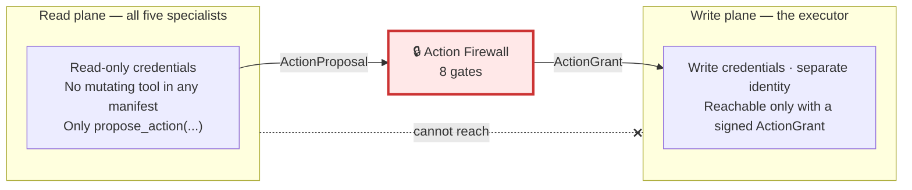
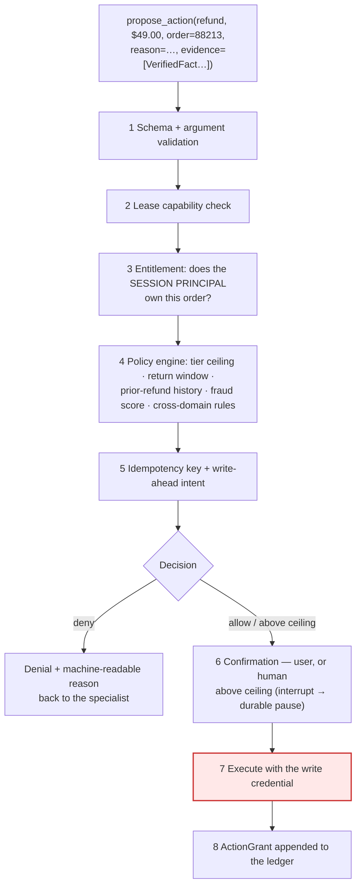
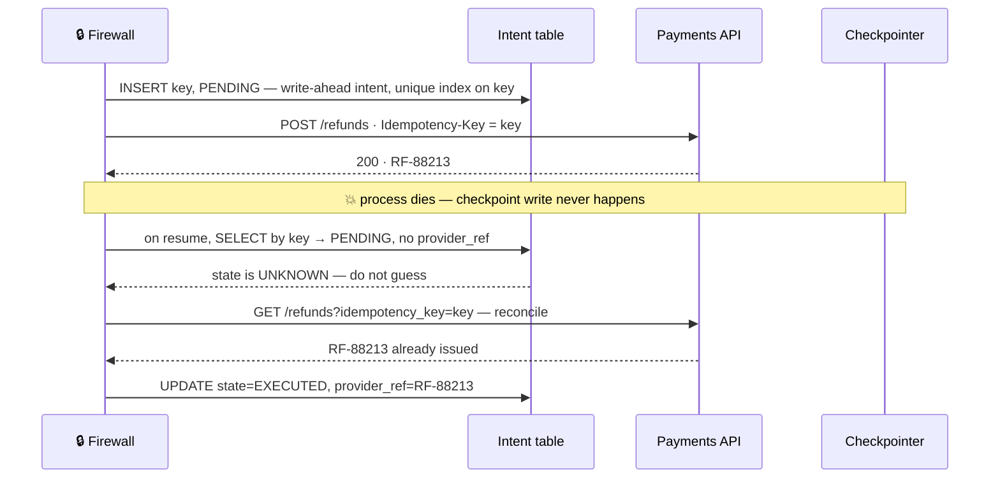
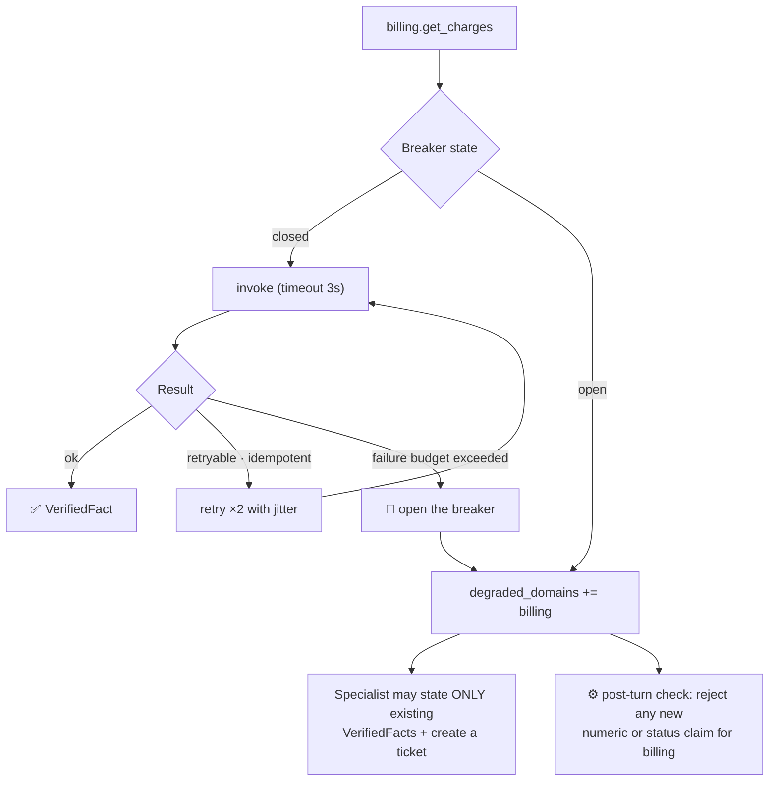

# 07 — Tools & the Action Firewall

> **Principles 4, 5.** There is exactly **one writer**. Specialists hold read-only tools and a
> single `propose_action`; every mutation — refund, cancel, credential change — traverses one gated
> executor where schema, capability, entitlement, policy, idempotency, and confirmation live.

---

## 1. The read/write split is a boundary, not a guardrail



**No specialist has a mutating tool in its manifest** — not a disabled one, not one behind a flag.
The capability does not exist on that side of the line, so it cannot be prompted into existence.
`propose_action` is a write-shaped name for a read-only act: it appends an `ActionProposal` to a
state channel and returns a `ToolMessage`. Nothing moves.

> **The difference between a guardrail and a boundary is whether the dangerous capability exists on
> the other side of it.** "Never refund more than $200" in a system prompt is a suggestion made to a
> process that holds a refund credential. Here the specialist holds no credential that can move
> money, and the tool that could is not bound to it. Read and write are different trust domains
> with different identities and different code paths.

---

## 2. The tool manifest and the Helix inventory

Every tool declares a manifest; the runtime and the control plane consume it without a model call.

| Manifest field | Example | Consumed by |
|---|---|---|
| `name` / `domain` | `billing.get_invoice` / `billing` | Lease scoping; per-agent cost attribution |
| `mode` | `read` — `write` is **unbindable** to a specialist | Tool binder; the boundary in §1 |
| `pii_class` | `PCI_TOKENISED` · `PII_HIGH` · `PII_UNBOUNDED` · `NONE` | Redaction middleware; GDPR residency routing |
| `cost_hint` / `p95_latency_ms` | $0.0004 / 340 ms | Budget Governor ([10](10-cost-governance.md)); turn-latency planning |
| `rate_limit` / `idempotent` | 20 rps global, 3 rps per session / `true` | Protects the source from a fan-out; gates retry-with-jitter |
| `timeout_ms` / `max_output_bytes` | 3000 / 24 KB | Bounded context growth ([05](05-state-and-memory.md)) |
| `requires_entitlement` | `order:read` on the target | Feeds firewall step 3 |

### Reads

| Domain | Read tools | Highest PII class |
|---|---|---|
| **Billing** | `get_invoice` · `get_charges` · `get_plan` · `get_payment_method` · `get_dunning_state` | `PCI_TOKENISED` — last4 + brand only; raw PAN never enters a context window |
| **Orders** | `get_order` · `get_tracking` · `get_warehouse_exception` · `get_carrier_scans` · `get_inventory` | `PII_ADDRESS` |
| **Technical** | `search_kb` · `search_docs` · `get_customer_error_logs` · `get_status_page` · `get_integration_config` | `PII_UNBOUNDED` |
| **Account** | `get_user` · `get_seats` · `get_mfa_state` · `get_sso_config` · `get_identity_audit_log` | `PII_HIGH` — IPs, devices, geo |
| **Returns** | `get_rma` · `get_return_window` · `get_policy` · `get_order_history` · `get_condition_rules` | `PII_ADDRESS` |

`get_customer_error_logs` is the highest-risk read in the inventory: unbounded,
attacker-influenceable text flowing straight into a model context ([08](08-safety-guardrails.md)).

### Proposable actions — no specialist executes any of these

| Action(s) | Proposer | Idempotency target | Policy ceiling | Confirmation |
|---|---|---|---|---|
| `refund` · `credit` | billing, returns | `(order_id, amount)` · `(account_id, amount)` | tier: free $50 / plus $200 / enterprise $2,000; credit $50 | user; **human above ceiling** |
| `retry_charge` · `change_plan` | billing | `(invoice_id)` · `(account_id, plan, effective)` | once per invoice per 24 h; upgrades need consent | user |
| `reship` · `cancel_order` | orders | `(order_id[, line_ids])` | ≤ 1 reship/order, value ≤ $500; cancel pre-fulfilment only | user |
| `change_address` | orders | `(order_id, address_hash)` | pre-label only; **blocked within 24 h of an account email change** | user |
| `create_bug_ticket` | technical | `(session_id, error_signature)` | none — the only non-customer-affecting write | none |
| `reset_mfa` · `change_email` | account | `(user_id, nonce)` · `(user_id, new_email)` | verified identity; no email change in 24 h | user + step-up auth |
| `transfer_ownership` | account | `(account_id, to_user)` | **never automatic** | human approver |
| `issue_rma` · `approve_return` · `restock_credit` | returns | `(order_id, line_ids)` · `(rma_id)` | within window; condition rules; credit ≤ item value | user |

Look at the `change_address` rule. **Account-takeover chains cross domain boundaries**: change the
email, then redirect the parcel. Orders cannot read identity state — it has no
`get_identity_audit_log` — so the only component that can enforce that rule is the one every
proposal traverses. That is the strongest argument for centralising the firewall instead of pushing
checks into the specialists that "own" each action.

---

## 3. Least privilege is enforced at the tool-execution layer

`lease.read_tools` and `lease.may_propose` ([03](03-recommended-architecture.md) §4) are checked in
code, not described in a prompt.

```python
@wrap_tool_call
def enforce_lease(request, handler):
    lease, name = get_runtime().context.lease, request.tool_call["name"]
    if name in ("propose_action", "release_lease"):
        return handler(request)            # always bound; the firewall runs its own gates
    if name not in lease.read_tools:       # ← the security boundary
        return ToolMessage(
            f"{name} is not available under lease {lease.id} (holder={lease.holder}). "
            "Release the lease if this belongs to another domain.",
            tool_call_id=request.tool_call["id"], status="error")
    return handler(request)
```

Two layers, two jobs. `wrap_model_call` + `request.override(tools=...)` filters the schemas the
model *sees* — an ergonomic and token control. The `wrap_tool_call` check above is the *security*
control. **Never rely on schema filtering alone:** a tool name can arrive from a checkpoint replay,
from a crafted message history, or from a model that hallucinated a name it read in a KB article it
just searched. A billing specialist physically cannot call `get_identity_audit_log`.

One level down, the same principle: `customer_id` is injected from `runtime.context`, never
supplied by the model. A model that can pass `customer_id` can be prompt-injected into
cross-customer reads.

---

## 4. The Action Firewall pipeline



| # | Gate | What it stops |
|--:|---|---|
| 1 | Schema + args | `amount_cents=-4900` (a negative refund is a charge); absurd magnitudes; a `CustomerClaim` in `evidence` ([06](06-handoff-contract.md) §3) |
| 2 | Lease capability | Returns proposing `transfer_ownership`; any action outside the holder's `may_propose` |
| 3 | Entitlement | **The IDOR-class bug for agents** — see below |
| 4 | Policy engine | Tier ceilings, return windows, serial-refunder history, fraud score, jurisdiction, and cross-domain rules the proposer cannot see |
| 5 | Idempotency | Double execution from retry, checkpoint replay, or a user double-tap (§5) |
| 6 | Confirmation | The wrong-action SLO (≤ 0.02%); above-ceiling actions reach a human via `interrupt()` |
| 7 | Execute | One write path, one credential, one place to instrument and rate-limit |
| 8 | ActionGrant | The 100% audit-completeness SLO; the join key back to the `TurnRecord` |

**Step 3 deserves its own paragraph.** The order ID in `propose_action` came from the conversation —
text the user typed. If entitlement is not evaluated against the **session principal** established
at authentication, any customer can refund any order by naming its ID. That is insecure direct
object reference transplanted into an agent, it is the single most likely real vulnerability in a
support agent, and no amount of instruction fixes it.

**The ordering is load-bearing:** cheap deterministic checks first, network lookups later, humans
last. Entitlement precedes policy because policy needs tier and refund history — lookups you should
not pay for on a proposal that is not even this customer's. And confirmation comes *after* the
decision:

> **Never ask for confirmation on an action policy will deny.** Beyond the UX failure, the
> confirmation dialog becomes an oracle for the policy ceiling: propose $199, get a confirmation
> prompt; propose $201, get a denial. An attacker binary-searches your refund limit in six turns.

---

## 5. Idempotency, in depth

```python
def idempotency_key(session_id, action_type, target_id, amount_cents, attempt_nonce) -> str:
    material = f"{session_id}|{action_type}|{target_id}|{amount_cents}|{attempt_nonce}"
    return hashlib.sha256(material.encode()).hexdigest()
```

Every component is **durable state**. No `uuid4()`, no `datetime.now()` — a key that changes on
replay is the same as having no key, and replay is not hypothetical: `interrupt()` re-executes the
tool body from the top on every resume ([04](04-agent-runtime.md)), so everything above the
interrupt runs again by design. `session_id` scopes deduplication to the conversation, so the same
customer legitimately refunding $49.00 next week is not deduped into nothing. And `attempt_nonce`
is the escape hatch teams discover too late: two *legitimate* identical partial refunds on one
order — two damaged items, same price — must be distinguishable. **The nonce is minted by the
firewall when a human explicitly approves a duplicate, never by the model.**

### The double-refund window



The **write-ahead intent record** is what makes that recovery possible: insert `(key, PENDING)`
under a unique index *before* the provider call, so a concurrent duplicate is a constraint
violation rather than a race; call the provider with the *same* key as its own idempotency header,
so your layer dedupes replays and theirs dedupes network retries; update to `EXECUTED` with the
provider reference after; and on every resume, look up by key before doing anything.

> **The bug everyone ships: treating `PENDING` as "didn't happen."** The window between the
> provider's 200 and your commit is exactly where `PENDING` means *unknown*, and unknown must be
> resolved by asking the provider, not by guessing. Guess "didn't happen" and you double-refund;
> guess "happened" and you silently drop a refund you already promised the customer.

The checkpointer is not a transaction manager. The graph checkpoint and the payments provider are
two systems that cannot be made atomic — the intent record is what makes them **reconcilable**.

---

## 6. Tool failures: structured errors, breakers, and what the agent says

```python
@dataclass(frozen=True)
class ToolError:
    code: str                  # UPSTREAM_TIMEOUT | NOT_FOUND | FORBIDDEN | RATE_LIMITED | INVALID
    retryable: bool
    user_visible: bool         # may this be described to the customer at all?
    message_for_model: str     # "Billing timed out. Do NOT state a balance."
    suggested_alternative: str | None   # "billing.get_invoice_cached"
    retry_after_s: int | None
```

A raw exception answers none of the three questions the model faces — retry? tell the user? try
something else? — so it guesses at all three. `user_visible=False` on `FORBIDDEN` is not cosmetic:
"you are not entitled to order 88213" turns the agent into an enumeration oracle for order IDs.



Per-tool circuit breakers (closed → open → half-open) bound the damage and protect the *source*:
180 concurrent chats retrying a struggling billing API is a self-inflicted outage amplifier. On
open, the specialist degrades explicitly:

> "I can't reach our billing system right now, so I don't want to guess at your charges. I've
> created ticket BR-4471 with everything we've confirmed — the two Mar 3 charges and order 88213 —
> and a billing specialist will follow up within 4 hours."

That answer names the limitation, carries the brief forward ([06](06-handoff-contract.md)), and
commits to a bounded time. But the script is only half of it: on circuit-open the runtime sets
`degraded_domains`, and a deterministic post-turn check rejects any *new* numeric or status claim
in that domain that has no backing `VerifiedFact`. **Graceful degradation is a policy; "do not
hallucinate around the gap" has to be a check** — a tool that fails silently with an empty result
is strictly worse than one that raises, because the model fills the silence.

---

## 7. When static tool binding stops working

Five specialists and ~25 read tools is comfortably static: each lease binds ~5 schemas, roughly 2K
tokens, cached across the conversation. The growth path to 9 domains and hundreds of tools is not.

| Switch trigger | Threshold | Why it matters |
|---|---|---|
| Schema tokens per specialist | > ~4K, or > 12–15 bound tools | Selection accuracy degrades *and* every model call pays |
| Tools within one domain | > ~10 | Wrong-tool rate rises measurably before anyone notices it visibly |
| Tools conditional on the customer | any | Per-integration tools are not knowable at build time |

The mechanism is retrieval over manifests, not over documents: deterministic priors from
`lease.domain`, embedding similarity between the brief's `goal` and manifest descriptions, top-k,
plus a **mandatory floor set** always bound (`propose_action`, `release_lease`, `search_kb`).

The evaluation question people skip is **"were the right tools even offered?"** Measure **tool
recall@k** (of turns whose gold trajectory used tool T, how often was T in the offered set) and
**distractor rate** (offered-but-unused tools per turn). A selection miss is invisible in a
trajectory eval — the model cannot be judged wrong about a tool it never saw, it simply does
something else plausible. Both need the **offered** set logged on every `TurnRecord`. **Log only
calls and tool-selection quality is unmeasurable forever after** — it is not backfillable
([09](09-evaluation-observability.md)).

---

## 8. Anti-patterns

| Anti-pattern | Consequence |
|---|---|
| A specialist holding a write credential "just for the happy path" | The firewall becomes optional, so policy lives nowhere |
| Refund ceiling enforced in a specialist prompt | Suggested, not enforced ([01](01-topology-comparison.md) §2) |
| Entitlement inferred from the conversation rather than the session principal | IDOR — refund anyone's order by naming its ID |
| Idempotency key built from `uuid4()` or a timestamp | Passes tests, double-charges in production |
| Treating a `PENDING` intent as "didn't happen" | Double refund inside the crash window |
| Raw exception strings returned to the model | Retries on non-retryable failures; invented answers |
| A tool returning `""` on failure | The agent hallucinates around the gap |
| Confirming before policy evaluation | The dialog becomes an oracle for the refund ceiling |
| Logging only the called tool set | Tool-selection quality is permanently unmeasurable |

---

## 9. Design-review questions

1. Show me the credential the specialist process holds. Can it move money? Can it reach the
   payments API at the network level at all?
2. Which gate catches `refund(order=88213)` when 88213 belongs to a different customer? Demonstrate
   it, don't describe it.
3. Derive an idempotency key by hand; replay from the last checkpoint and derive it again.
   Identical?
4. Kill the process between the payments `200` and the checkpoint write. What does the customer end
   up with, and who finds out?
5. Billing is down. Read me the exact sentence the specialist says — and show what prevents it from
   saying more.
6. Do you log the *offered* tool set, or only the called set?

Continue to [08 — Safety & guardrails](08-safety-guardrails.md).
