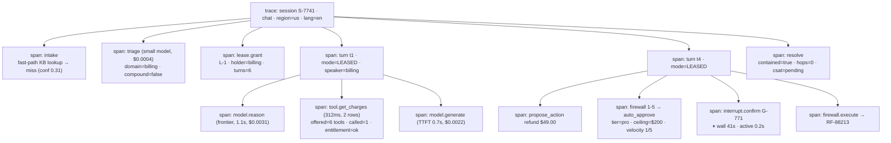
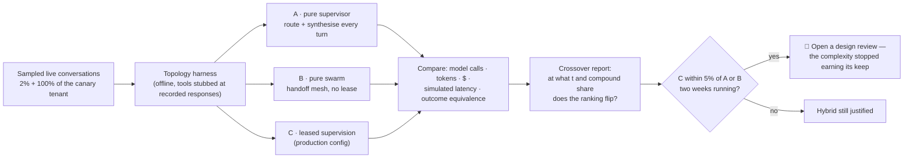
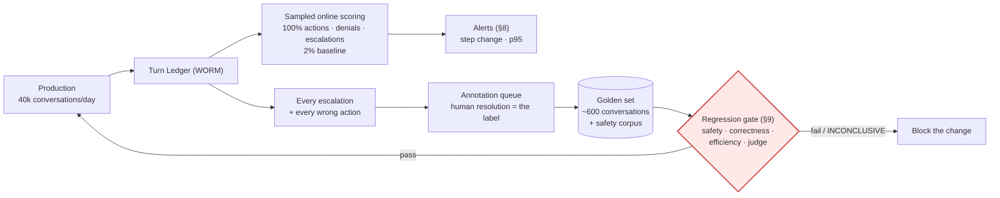
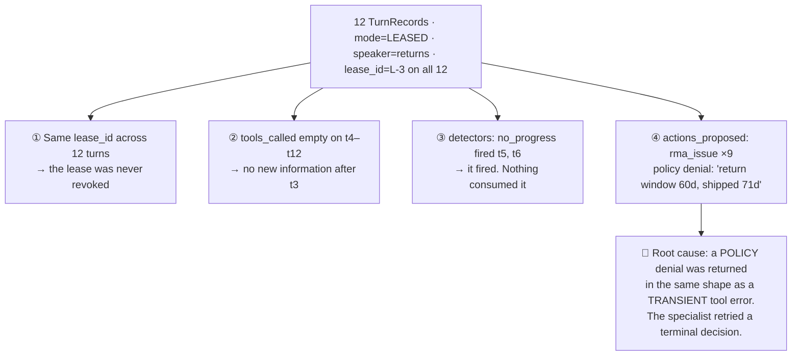

# 09 — Evaluation & Observability

> **Principle 6.** **Single-turn accuracy is the wrong metric for this system.** A support agent is
> graded on what happened to the *conversation* — was it contained, did the customer have to repeat
> themselves, was the right action taken, at what cost. Every one of those is a property of a
> trajectory, and none of them is visible in a per-turn score.

---

## 1. Why per-turn accuracy misleads here

| Per-turn view | Conversation reality |
|---|---|
| Every answer was correct and helpful | It took 14 turns and the customer left at turn 9 |
| The specialist answered the shipping question well | It was the **Billing** specialist, holding a lease it should have released three turns earlier |
| Every clarifying question was reasonable | Two were already answered in the brief — the **amnesia** failure ([06](06-handoff-contract.md) §6) |
| The refund message was clear and correct | The firewall denied it; nothing was refunded ([08](08-safety-guardrails.md) §4) |

The unit of evaluation is the **conversation**; the unit of debugging is the **trajectory** — which
agent held the turn, for how long, on what evidence, with what tools offered.

---

## 2. The span model, and what the Turn Ledger adds

Every turn, every lease grant and revocation, every tool call, every policy decision, and every
executed action is a span, tagged `session_id · turn_id · lease_id · agent_name · mode · model ·
cost` — the same tag set [10](10-cost-governance.md) §7 requires for attribution, because they are
the same tags.

Three things in that trace are **not** logged by default and are not backfillable:

1. **`offered` alongside `called` on every tool span.** Without it, tool-selection quality is
   unmeasurable forever ([07](07-tools-and-action-firewall.md) §7): a model cannot be judged wrong
   about a tool it never saw. Recall@k and distractor rate both need the offered set.
2. **Wall-clock and *active* time as separate fields on a durable pause.** An `interrupt()` for
   confirmation spans a human thinking — 41 s in chat, two days in email ([04](04-agent-runtime.md)).
   Alert on wall time and you page yourself for a customer who went to lunch.
3. **The detector column** — which detectors evaluated, and what they returned, even when they
   returned nothing. A detector that fires into a field nobody reads is §10's root cause.

**The Turn Ledger ([03](03-recommended-architecture.md) §5) is the durable, queryable projection of
this trace**, and the two are not interchangeable. The trace backend is a third-party system with a
retention window and broad read access; the ledger is WORM, joined to money, and is the system of
record. **Build metrics on the ledger, not the trace** — otherwise they expire at retention and
cannot be joined to an `ActionGrant`. Traces are for debugging one conversation; the ledger is for
answering "who decided what" and for every number in §3.

---

## 3. The metrics that actually matter

| Metric | Definition | Target | What a miss falsifies |
|---|---|--:|---|
| **Containment rate** | Conversations with no human involvement, measured **24 h after the last message** — not at close | ≥ 65% | The business case. Low → triage misroutes or specialists can't finish |
| **First-contact resolution** | Contained conversations with no new contact on the same issue within 7 days | ≥ 70% of contained | Containment without FCR is deflection theatre — you hung up and they came back |
| **Routing accuracy** | Triage's domain vs. the domain that produced the resolving `ActionGrant` | ≥ 92% | [01](01-topology-comparison.md) §1's claim that first-message routing is hard but tractable |
| **Compound-detection recall** | Of sampled turns with ≥ 2 domains, the fraction fanned out | ≥ 80% | [02](02-cost-and-latency-model.md) §7 — below this the parallel win exists only on paper |
| **Questions-re-asked rate** | Max semantic similarity of each question to `already_asked[]`, above threshold | **< 2%** | The **amnesia KPI** ([06](06-handoff-contract.md) §6). The CSAT canary, and label-free |
| **Lease revocation rate** | Leases revoked before natural expiry ÷ granted | **10–25%** | Two-sided — see below |
| **Hops per conversation** | Arbiter invocations per conversation | p50 ≤ 1, p95 ≤ 3 | [03](03-recommended-architecture.md)'s "the arbiter runs about once per conversation." p50 = 3 breaks [02](02-cost-and-latency-model.md) |
| **Wrong-action rate** | Executed grants later reversed as erroneous; 100% of reversals human-adjudicated | ≤ 0.02% | [08](08-safety-guardrails.md). The one that ends the project |
| **CSAT** | Post-conversation 1–5, response-rate adjusted | ≥ 4.3 | |
| **Cost / conversation** | Blended model spend ÷ conversations | ≤ $0.11 | [02](02-cost-and-latency-model.md)'s $0.085 model |
| **p50 TTFT** | First user-visible token | ≤ 1.5 s | If it is 2.1 s you built a supervisor by accident ([02](02-cost-and-latency-model.md) §4) |
| **p95 turn latency** | User message → complete response | ≤ 6 s | Sequential model calls crept back into a turn |

**Lease revocation rate is the only two-sided target here, and that is what makes it interesting.**
Above ~40% the leases are mis-scoped and the session is thrashing through the Arbiter
([02](02-cost-and-latency-model.md) §7). Below ~5% they are *too loose* — specialists are answering
outside their competence and nothing is noticing, which produces confident wrong answers with no
error signal at all. A one-sided alert on this metric misses the more dangerous tail.

Five more, all of them promised by sibling docs and all cheap:

- **Turns-per-domain `t` distribution** and **specialist loop depth `L_spec`** — the two inputs the
  whole cost model rests on ([02](02-cost-and-latency-model.md) §7).
- **Prompt cache hit rate** per specialist — determines whether the token gap in §3 of 02 narrows.
- **Re-triage rate by channel** — an email conversation about a shipment *should* re-triage on
  resume. Track it as an expected distribution, **never as an alert** ([04](04-agent-runtime.md) §4).
- **Escalations by triggering control** — if the turn/dollar budget leads, the no-progress and
  repeated-intent detectors are mis-tuned ([11](11-failure-modes.md) §4).

> **Never look at a blended per-language number.** Nine languages share one policy corpus; retrieval
> and claim-checking both degrade off the corpus language, and a 4.4 blended CSAT can hide a 3.1 in
> Japanese ([11](11-failure-modes.md) §7). Containment, CSAT, groundedness, and questions-re-asked
> are all split by language before anyone looks at them.

---

## 4. Trajectory evaluation and golden-conversation replay

Final-answer eval cannot see any of the failures in §1. Trajectory eval can. Using `agentevals`
trajectory-match modes, each maps to a design invariant:

| Mode | Asserts | The invariant it protects |
|---|---|---|
| `subset` | Only tools from the reference were used | **Lease scope containment** — a Billing lease may not call identity tools |
| `superset` | At least the reference tools were used | "Look before you act" — `get_charges` precedes `propose_action` |
| `strict` | Same tools, same order | The firewall pipeline: lease → entitlement → policy → idempotency → confirm → execute |
| `unordered` | Same set, any order | Compound fan-out — three specialists ran; order is meaningless |

Five assertions are specific to this design and have no library equivalent: **routing**
(`triage.domain == resolving_domain`), **lease duration** (revoked when the second domain appeared,
not two turns later), **minimum clarification** (questions asked ≤ reference + 1), **right action**
(executed grant matches the reference on type, target, and amount within $0.01), and **provenance
audit** — sample `verified_facts` from completed briefs and re-resolve each `tool_call_id` against
the recorded tool output. The schema already rejects a fact with *no* source; only a sampled audit
catches one with a **real but wrong** source, which is the residual risk named in
[08](08-safety-guardrails.md) §11.

### Golden-conversation replay

The corpus is **~600 recorded conversations** ([13](13-migration-and-rollout.md) §5), PII-scrubbed,
each with its recorded tool responses keyed by `(tool, hash(args))` and a human-signed outcome
label. A candidate prompt or graph version is replayed against it with the tool layer stubbed at
those recorded responses.

**What replay catches:** phrasing and clarification-count regressions, routing changes, policy-path
changes, cost and call-count deltas, and the entire safety corpus.

**What replay cannot catch — and this is the part that gets glossed over:**

1. **Changes that alter which tool would be called.** The moment the candidate calls a tool with
   arguments that were never recorded, the stub misses and every turn after that point is fiction.
   You either return an error (the trajectory diverges) or hit the live tool (it is no longer a
   replay). So replay is high-fidelity for changes that *don't* move tool selection and close to
   worthless for changes that do — **which are exactly the changes you most want to test.**
   Mitigation: count stub-misses and report a **fidelity score** next to every result. A run above
   10% stub-miss is reported `INCONCLUSIVE`, not `PASS`.
2. **Anything about the user.** The recorded user turns are fixed. If the candidate asks a *better*
   question, the recorded answer doesn't respond to it. Replay is therefore systematically
   **pessimistic about clarification improvements** and blind to conversational repair. For those,
   you need a simulated user (a model playing the customer from a persona plus ground-truth facts)
   or live A/B — not a bigger golden set.

---

## 5. LLM-as-judge, honestly

Use a judge only for what deterministic checks cannot reach: tone and empathy, whether the answer
addressed the question actually asked, whether an escalation brief is complete enough for a human
to act on, and whether the agent over-promised. Then accept the following:

- **Pin the model version string, not the alias.** A hosted model behind `latest` changes under you
  and every historical score becomes incomparable overnight.
- **The judge prompt is a versioned artifact** with its own changelog. Store `judge_version` on every
  score. Comparing across judge versions without a **bridge run** — re-scoring a holdout with both —
  is comparing two different instruments.
- **Measure judge flakiness before trusting it.** Run the judge 5× over 50 examples and report the
  per-item disagreement rate. High variance means the judge is usable in aggregate and **never as a
  per-item gate**.
- **Calibrate against human labels on a 200-example holdout, and report Cohen's κ, not accuracy.**
  Raw accuracy is inflated by class imbalance — ~90% of conversations are fine, so a judge that says
  "fine" always scores 90%. Below κ ≈ 0.6 the judge is a vibe with a number attached.
- **Guard verbosity bias.** Judges prefer longer answers; this system is optimising for shorter ones.
  Put length-matched pairs in the calibration set or the judge will quietly push you toward waffle.
- **A judge never gates a safety decision.** Safety gates are deterministic assertions ([13](13-migration-and-rollout.md) §5).

---

## 6. Evaluating the topology decision itself

This is the part that keeps this design honest, and almost nobody builds it. [02](02-cost-and-latency-model.md)
is a **model with stated assumptions**, and assumptions decay: turns-per-domain drifts with the
product, compound share drifts with the traffic mix, `L_spec` drifts as tools change.

Two honest constraints, both worth stating in review:

- **You cannot run the true counterfactual**, because the user's next message depends on what the
  agent said. A replayed comparison is rigorous only **up to the first divergence point**; past it
  you are comparing to a fiction. The harness therefore reports two numbers — a rigorous
  pre-divergence comparison and a directional full-conversation one, explicitly labelled.
- **The ground truth is a small live interleaved A/B**, split by session (never by turn), sized by
  CSAT sensitivity rather than by cost sensitivity — cost differences reach significance in days,
  CSAT differences in weeks.

This is a *standing* harness, distinct from the one-time shadow mode used to roll a new topology out
([13](13-migration-and-rollout.md) §4). Same machinery, different question: 13 asks "is the new thing
safe to ship", 09 asks "is the thing we shipped still the right thing".

---

## 7. Cost attribution as an eval dimension

[10](10-cost-governance.md) §7 owns the tag set and the production queries. What belongs *here* is
that **every eval run reports cost, and cost regressions are gated like quality regressions** — a
prompt change that improves the judge score 0.1 while adding 40% tokens is a regression.

Finding the specialist burning the budget is one query, and the shape of it matters: **group cost by
*resolving agent* per **contained** conversation, not per call.** Cost per call finds the expensive
model; cost per resolution finds the expensive *behaviour* — a specialist on a cheap model making
nine tool calls a turn beats a frontier model making two. Three diagnostic signatures:

| Signature | Likely cause |
|---|---|
| One specialist at 3× cost per resolution | `L_spec` too high — it re-fetches every turn instead of reading history |
| Cost/conversation flat, tokens/turn rising | Prompt or context creep; someone appended to a system prompt |
| `mode=ARBITRATE` spend > 15% of total | Lease revocation rate is too high; leases are mis-scoped (§3) |
| Triage spend per conversation rising | Resumed sessions re-triaging that should have kept their lease ([04](04-agent-runtime.md) §4) |

---

## 8. Online guardrail monitoring and the feedback loop

Sampled turns scored out-of-band within ~60 s. **Never in the hot path** — the online judge is a
*monitor*, not a gate; the gate is the Action Firewall.

**Sampling policy:** 100% of turns that proposed an action, 100% of firewall denials, 100% of
escalations, 100% of injection-detector hits, 100% of the canary tenant, ~2% of everything else.
At 40k conversations × ~5 turns, 100% judging is its own budget line ([10](10-cost-governance.md) §2);
this policy costs a fraction of it and misses almost nothing that matters.

**The five alerts that catch a bad deploy inside ten minutes:**

| Alert | Threshold | Catches |
|---|---|---|
| Wrong-action rate, rolling 1 h | > 3× the 0.02% baseline | The one that ends the project |
| Firewall denial rate, **step change either direction** | ±40% vs. same hour last week | A **drop** means a guardrail silently stopped running — no errors, only silence |
| Questions-re-asked rate | Step change > 1 pp | Handoff-brief regressions ([06](06-handoff-contract.md)) |
| p50 TTFT sustained 10 min | > 1.5 s | Someone put a model call back on the hot path |
| Containment, same hour day-over-day | Drop > 5 pp | Everything else |

Alert on **step changes and p95**, never on averages — agent latency and cost are long-tailed
([10](10-cost-governance.md) §7 shows a 14× p99 tail), and a mean will absorb a serious regression.

**The feedback loop is the point.** Escalations are the highest-value eval data in the system,
because **they arrive pre-labelled by a human who was obliged to fix them.**

Route escalations through an annotation queue, not a backlog. **A golden set that does not grow from
production failures is a snapshot of last quarter's traffic**, and it will pass every change that
breaks this quarter's.

---

## 9. Regression gates — the mechanics

[13](13-migration-and-rollout.md) §5 owns the gate table and the thresholds. What it does not answer
is the question that actually breaks eval programmes: **what happens on a borderline result.** A
stochastic suite produces borderline results constantly, and a gate overridden weekly is not a gate.

1. **Every gate reports a confidence interval, not a point estimate.** Run the golden set 3× and use
   the CI. A single run of a stochastic suite is an anecdote.
2. **A result whose CI straddles the threshold is `INCONCLUSIVE`, not a judgement call.** It
   auto-triggers a 10× run. This removes the human from the borderline decision, which is precisely
   where social pressure to ship lives.
3. **Fidelity gates the gate.** A golden run above 10% stub-miss (§4) is `INCONCLUSIVE` regardless of
   its score.
4. **Only the safety suite is un-overridable.** Zero failures, no exceptions, no expiry. Every other
   override is recorded with a named owner and expires in 30 days — an override that cannot expire
   is a threshold change in disguise, and should be argued as one.

---

## 10. Debugging: "the agent looped 12 times and the customer left"

Start at the ledger, not the trace. `SELECT * FROM turn_ledger WHERE session_id='S-9912' ORDER BY
turn_id` returns twelve rows, and four columns tell the whole story:

Two guardrails should have caught it before the customer did:

- **The turn budget.** `turns_remaining` never reached zero because it was decremented in the tool
  path rather than in the ledger middleware, so nine tool-free turns cost nothing. Generalisable
  rule: **a budget must be decremented by the middleware that observes the turn, not by the code
  path that does the work** — otherwise the counter and the thing it bounds are different things.
- **The no-progress detector.** It fired twice and its output went to a column nobody read. **A
  detector whose result terminates in a ledger field instead of a state transition is a metric, not
  a guardrail.** Every detector must terminate in a transition.

This is exactly the refusal loop [11](11-failure-modes.md) §7 names, and the trace shows the missing
wire: **the Action Firewall is the only component that saw all nine identical denials, and it was not
a source of lease revocation.** Making repeated-identical-denial a revocation condition on the lease
([03](03-recommended-architecture.md) §4) closes it in one place instead of in five specialists —
an architectural finding produced by a debugging exercise, which is the whole reason to do them.

---

## 11. Anti-patterns and design-review questions

| Anti-pattern | Consequence |
|---|---|
| Containment measured at close | You optimise for hanging up on people |
| Metrics built on the trace backend | They expire at retention and cannot join to an `ActionGrant` |
| Logging `called` tools without `offered` | Tool-selection quality is unmeasurable and not backfillable |
| One-sided alert on lease revocation rate | Misses the dangerous tail — leases too loose, no error signal |
| Blended per-language quality numbers | A 3.1 CSAT hides inside a 4.4 |
| Judge score as a per-item gate | Judge variance becomes ship/no-ship noise |
| Replay results reported without a stub-miss fidelity score | Confident PASS on a run that went off the rails at turn 2 |
| Alerting on averages | The p99 conversation is where the loops live |
| A golden set that does not grow from escalations | You regression-test last quarter's traffic |

**Ask in review:**

1. Is routing accuracy computable today, and from what join? (It has no ground truth at inference
   time — the label comes retroactively from the resolving `ActionGrant`, so it is only computable
   for *resolved* conversations and is biased toward easy ones. How is that corrected?)
2. Show the `offered` tool set on a real `TurnRecord` from production.
3. What is the current stub-miss rate on the golden set, and when was it last checked?
4. What is judge–human κ, on what holdout, measured when?
5. Which alert would have fired first in §10's incident, and how long after turn 4?
6. When did the topology harness last run, and what was the crossover margin?
7. Every detector in the system: name the state transition it terminates in.
8. How many golden-set cases were added from production escalations last month?

Continue to [10 — Cost governance](10-cost-governance.md).
