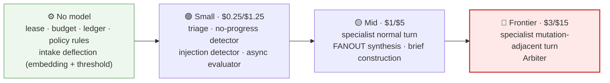
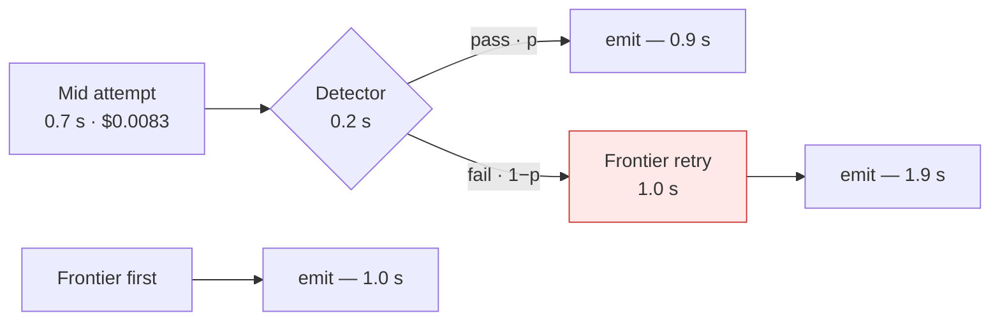
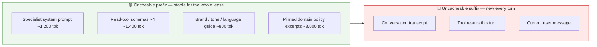
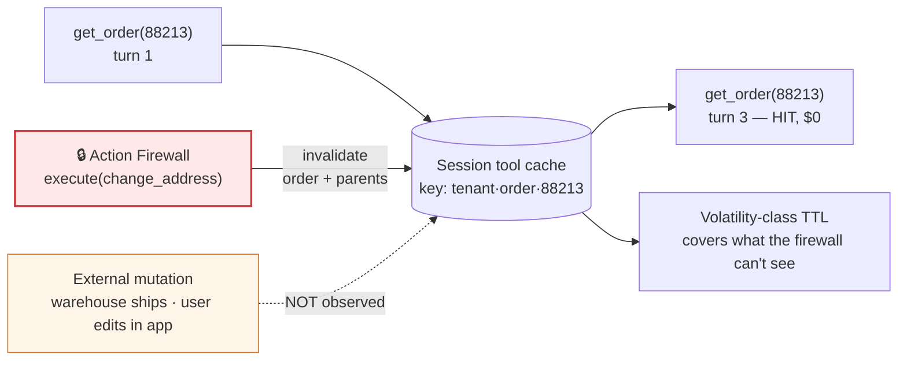
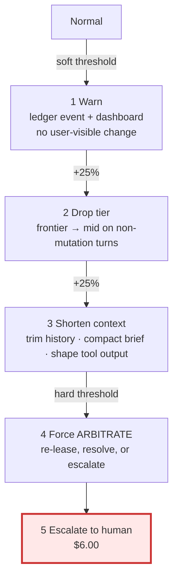
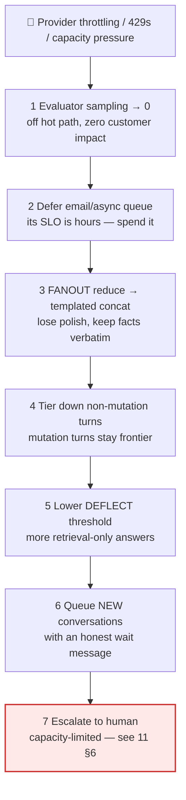

# 10 — Cost Governance

> **Principle 8.** [02](02-cost-and-latency-model.md) worked out what the system *costs*. This doc
> is what stops it costing something else next Tuesday — tiering, caching, budgets, attribution
> and shedding, all governed by one metric that is not cost per call.

---

## 1. What 02 settled, and the one assumption this doc adds

[02](02-cost-and-latency-model.md) landed on a blended **$0.085 / conversation** against a $0.11
SLO, with fast-path deflection (§5 there) as the largest lever. Those are *design-time* numbers
and they are not self-enforcing: a prompt reorder, a sixth specialist, or a chattier tool response
moves them 40% with no code review catching it. Governance is the three things people conflate —
**pricing** (tiering, caching, output shaping), **enforcement** (budgets, ladders), and
**attribution** (tags joined to outcomes). Skip attribution and you optimise the wrong node.

One assumption on top of [02](02-cost-and-latency-model.md)'s table dominates everything below:

| Symbol | Meaning | Value used |
|---|---|---|
| `H` | Fully-loaded cost of **one human contact** | **$6.00** (≈8 min AHT at ~$45/hr loaded, plus tooling + QA) |

At 40k conversations/day and 65% containment, the model bill is ~$3,400/day and the human tier is
~$84,000/day. **The entire LLM spend is under 4% of the human cost it partially displaces.** That
ratio inverts most cost instincts; hold it through every section.

---

## 2. Model tiering per node

Tiering is per **node**, not per conversation, because the cost of being wrong differs by two
orders of magnitude across nodes.

| Node | Tier | The failure a downgrade buys you |
|---|---|---|
| Lease / budget / ledger | none | Already deterministic ([03](03-recommended-architecture.md) §2) |
| Intake deflection | embedding only | A generative model here re-prices 18% of traffic at 20× |
| Triage classifier | small | Misroute → one extra arbitration hop, ~$0.02 and 2 s. **Cheap failure, so cheap model** |
| Specialist, normal turn | mid | Small-tier vagueness and re-asked questions → containment loss, which costs `H` |
| **Specialist, mutation-adjacent** | **frontier** | Wrong refund target, wrong amount, wrong customer. **The turn where a refund is proposed is not the turn to save $0.002** |
| Arbiter | mid→frontier | A bad re-lease sends the user to the wrong specialist *after* they already explained themselves once |
| FANOUT synthesis | mid | Small tier drops or paraphrases numbers — the telephone game ([01](01-topology-comparison.md) §1) with a worse model |
| No-progress / injection detectors | small or none | These run on *every* turn — the most expensive place in the system to be thorough |
| Async evaluator | small, sampled | An LLM-judge suite at 100% sampling is its own line item ([09](09-evaluation-observability.md)) |

**The load-bearing asymmetry: rarity buys quality.** The Arbiter runs ~once per conversation, the
specialist's normal turn ~9 times. Frontier on the Arbiter costs ~$0.025/conversation; frontier on
every specialist turn costs ~$0.15. Anything that runs once per *session* should be as good as you
can afford; per-*turn* nodes are where tiering earns its keep.

"Mutation-adjacent" needs a definition or it becomes "every turn". Concretely: **frontier if the
prior state holds an un-declined action candidate, or the user's message matches a mutation intent**
(refund / cancel / change / reset). That is 1–2 turns of a 4-turn Archetype A conversation — and
it is the pair of turns the ≤ 0.02% wrong-action SLO ([00](00-overview.md)) lives or dies on.

---

## 3. Escalating tiers on retry, not on first attempt

The seductive strategy: run mid, detect failure, retry on frontier. It is seductive because the
*dollar* break-even is trivially easy to clear — which is exactly the trap.

For a specialist call at ~7,000 in / 250 out tokens: frontier = $0.0248; mid = $0.0083; a small
failure detector = $0.0003. Cheap-first expected cost is `0.0086 + (1−p) × 0.0248`, so it wins
when **first-pass success `p` > ~35%.** Any sane configuration clears that.

Now the same decision on latency — mid 0.7 s, detector 0.2 s, frontier retry 1.0 s:

**At a 15% first-pass failure rate the retry path is not the tail — it *is* your p95.** For the
fast path to define p95, `p` must exceed **95%**, not 35%. The dollar and latency break-evens are
60 percentage points apart, and the latency one binds against p95 ≤ 6 s. **Cheap-first is a
latency decision wearing a cost decision's clothes.**

Two conditions collapse the space further. **Failure must be detectable before emission** — once a
token has streamed to the customer there is no retry, only an agent contradicting itself in public,
which disqualifies every user-facing generation call. And **mutation-adjacent turns have no retry
semantics**: the failure is not "a bad paragraph you regenerate", it is "a refund proposed against
the wrong order" — undetectable from the output unless you already knew the answer.

> Cheap-first-then-escalate is legitimate only on **non-streamed, schema-verifiable,
> non-mutation-adjacent** calls: triage, brief construction, tool-argument formatting, detectors,
> the evaluator. That is exactly the small tier in §2. **Retry escalation is not a strategy layered
> on the tiering table; it is the justification for where the table draws its lines.**

A genuine retry ladder belongs to **provider degradation**, not quality: 429 or timeout on mid
falls back to another provider's mid tier, then frontier, then the degraded modes in
[11](11-failure-modes.md) §6.

---

## 4. Prompt caching: what is stable, what churns

`P_spec` in [02](02-cost-and-latency-model.md) counts instructions only; the *deployed* prefix is
~**6,400 tokens** once schemas, tone guide, and pinned policy are included — $0.0064 of input per
call uncached, roughly a tenth of that on a cache read. That is **~$0.0058 saved per specialist
call** against a $0.0083 call, or a **35–45% reduction on the input side** of a $0.104 Archetype A
conversation. Highest ROI in this document after deflection.

**The consequence [02](02-cost-and-latency-model.md) §3 flagged, stated plainly: caching helps a
leased architecture more than a supervisor one.** A leased turn re-presents the same specialist
prefix for the whole lease, so turns 2..n are cache hits by construction. A supervisor's routing
context (N schemas + a grown transcript) and synthesis context (new specialist results every turn)
churn by construction. **Caching widens the hybrid's advantage rather than narrowing it** — the
opposite of the usual "caching evens things out" assumption.

Three hazards, none obvious:

- **Nothing volatile above the prefix.** A `session_id`, timestamp, or "current date" line at the
  top zeroes the hit rate with no other symptom — invisible until the invoice arrives.
- **Cache TTL is a per-channel fact.** Live-chat gaps are 20–40 s and hit warm; email threads
  resume in *days* and never hit. **Model email traffic with zero cache savings** — blending it in
  is how a forecast misses by 30%.
- **Don't re-write the cache on a lease's last turn.** A resume just past TTL pays the ~1.25×
  write premium on a prefix used exactly once more. Gate the write on the lease's own
  `turns_remaining > 1` ([03](03-recommended-architecture.md) §4) — a saving that exists only
  because the architecture happens to hold the right state.

---

## 5. Semantic caching of tool results — and its correctness hazard

The invoice fetched on turn 1 should not be fetched on turn 3. Within a lease it is already in
history — the win looks theoretical until the lease breaks. After arbitration the new specialist
gets a **brief, not a transcript** ([06](06-handoff-contract.md)) and would re-fetch everything the
brief only summarised. **The tool-result cache is what makes a compact brief affordable**; without
it, brief compaction just converts context tokens into tool calls.

Key on `(tenant_id, entity_type, entity_id, projection)`, scoped to the session, storing the shaped
projection rather than the raw payload. This is a correctness surface, not a performance one:

> A cached order status served *after the customer just changed the shipping address* is not a
> stale-cache annoyance. It is the agent telling a customer their package is going to the old
> address — a wrong answer with the confidence of a database read.

**The invalidation rule: any successful mutation invalidates every cached read of that entity and
its parents.** Here the single-writer design pays an unexpected dividend — because the Action
Firewall is the *only* writer ([03](03-recommended-architecture.md) §6,
[07](07-tools-and-action-firewall.md)), it is the only component that must emit invalidations.
**Invalidation completeness is provable from the topology**, which is untrue of any design where
specialists can write.

The firewall cannot see mutations that bypassed it, so entities carry a **volatility class**:
*immutable* (closed-period invoice, order lines, past charges) cached for the session; *slow*
(plan, entitlements, saved addresses) 5 min TTL plus firewall invalidation; *volatile*
(fulfilment status, tracking, MFA lock state) 60 s TTL or never cached. And one rule overrides all
of it: **any read used as *evidence* for a mutation is re-read uncached at firewall time.** Steps
3–4 of the firewall (entitlement, policy) must never evaluate a cached value. **The cache serves
conversation, never authorisation.**

---

## 6. Budget enforcement, and the trap at the bottom of the ladder

| Scope | Soft | Hard | On breach |
|---|--:|--:|---|
| Per conversation | $0.20 | $0.40 | The ladder below |
| Per conversation, turns | 20 | 40 | Force `ARBITRATE` |
| Per tenant / day | 80% of plan | plan | Throttle *new* conversations, never mid-conversation |
| Per tool / minute | — | §9 | Queue or degrade |

**Rung 5 is the trap.** A human contact costs `H` = $6.00 — **15× the entire hard budget the
governor was defending, and 70× the mean conversation's model spend.** A naively optimised governor
will convert a $0.45 conversation into a $6.40 one and report a saving.

Do the expected value instead. At the cap, escalating costs `B + H`; granting another `ΔB` with
marginal containment probability `q` costs `B + ΔB + (1−q)H`. Continuing is cheaper when
`ΔB < q × H` — with `ΔB` = $0.40 and `H` = $6.00, **when `q` > 6.7%.**

> **Spending another $0.40 on a struggling conversation is the cheaper choice if it has better than
> a ~7% chance of containing it.** Nearly every conversation at the cap clears that bar.

Two consequences most designs get backwards. **Derive the ceiling from `H`, not from the mean
conversation cost** — teams set the cap at 3–5× the mean because it looks prudent, but the
economically correct ceiling is on the order of `q × H`, dollars rather than cents; the $0.40 cap
above is **deliberately not a cost control**. And **the budget is a canary, not a wallet**: a
conversation at 5× the mean is a *bug signal* — a tool loop, a sticky lease, an impasse
([11](11-failure-modes.md) §4) — so the response is arbitration plus a dashboard, not termination.

Guardrail so the governor cannot optimise itself into mass escalation: **budget-triggered
escalation rate is itself an SLO (< 0.5% of conversations), alerted.** When it rises, raise the
budget and go find the bug — never tighten the cap.

---

## 7. Cost attribution

Every model call, tool call and cache event carries the same tags. A missing tag is not a gap in a
dashboard; it is a class of question you cannot ask.

| Tag | Enables |
|---|---|
| `agent_name` | Cost per specialist; whose prompt bloated |
| `lease_id` | Cost per lease → the price of a *misroute* (short lease ending `out_of_scope`) |
| `session_id` | **The join key to outcome.** Without it, cost data never meets containment data |
| `tenant_id` | Per-tenant budgets; unit economics per plan tier |
| `mode` | `LEASED` / `FANOUT` / `ARBITRATE` spend split — validates [02](02-cost-and-latency-model.md)'s model |
| `model_tier`, `cache_hit` | Tier drift and cache regressions |
| `channel`, `language` | Email vs. chat economics (§4); per-language cost |

The queries that matter: **cost per specialist** (whose prompt to put on a diet); **cost per
resolved vs. per escalated conversation** (drives §2); **cost per domain among contained
conversations only** (finds specialists that are expensive *and* ineffective); **cost per misroute**
(prices triage accuracy in dollars); and **the p99 conversation**. Expect p50 ≈ $0.06 and
p99 ≈ $0.85 — a **14× tail**. Chase the tail before the mean; the tail is where the loops are.

---

## 8. Cost per *outcome* — the governing metric

Model spend is a rounding error against `H`. Grading on cost per call optimises 4% of the bill
while moving the other 96% the wrong way.

| Segment | Share | Model cost | Containment `c` | **Fully loaded** = model + (1−`c`)×$6.00 |
|---|--:|--:|--:|--:|
| Deep single-domain (A) | 62% | $0.104 | 70% | **$1.90** |
| Compound (B) | 15% | $0.121 | 55% | **$2.82** |
| Trivial / deflected | 18% | $0.006 | 92% | **$0.49** |
| Immediate escalation | 5% | $0.004 | 0% | **$6.00** |
| **Blended** | | **$0.085** | 65% | **≈ $1.99** |

> **A conversation that costs $0.30 and contains the customer is ~4× cheaper than one that costs
> $0.04 and escalates.** `cost_per_contained_conversation` — spend divided by *contained*
> conversations, not by all of them — is what this system is graded on.

Two results fall straight out, both against ordinary cost intuition:

- **A tier-down saving 20% of model spend ($680/day) breaks even at a containment loss of 0.28
  percentage points** — inside the noise floor of most eval suites. Any tiering change that cannot
  be shown *not* to move containment by a quarter point is unmeasurable, therefore risky, not free.
- **Frontier on every specialist turn costs ~+$0.12/conversation and pays for itself at a 2 pp
  containment lift.** One point of containment is worth ~$876k/year — about 70% of the entire
  annual model budget.

The honest reading is not "frontier everywhere". It is that the break-even is **per node**:
frontier plausibly buys 2 pp on mutation-adjacent turns and roughly nothing on "here is your
invoice date". That is why §2 is a table and not a global setting.

---

## 9. Load shape, capacity, and what gets shed

40k conversations/day is a *mean* of 0.46/s; business-hours weighting makes peak ~3×, with 180
concurrent live chats ([00](00-overview.md)). At p50 = 4 turns that is ~160k turns/day, ~5–6
turns/s at peak, ~12–15 model calls/s. **The provider TPM limit binds before your infrastructure
does:** ~7,000 input tokens/turn × 6 turns/s ≈ **2.5M TPM at peak**, above default limits on most
accounts. Track 429 rate per provider as a *capacity* metric alongside queue depth.

**Per-tool rate limits protect downstream systems, and the load correlates in the worst possible
way:** a carrier or billing incident is simultaneously the OMS's worst moment and the moment
support volume triples. An agent retrying `get_order` across thousands of concurrent conversations
turns a degraded dependency into a dead one. Token bucket per `(tool, tenant)`, a circuit breaker
per tool, and **no automatic retry on 5xx from a tool that is already breaking** — degrade the
answer instead ([11](11-failure-modes.md) §6).

Live chat and email are different products and must not share a worker pool: chat has a TTFT ≤
1.5 s SLO, **reserved** capacity sized to peak concurrency, and a warm cache; email has an
hours-long SLO, queued off-peak capacity, and (per §4) no cache savings at all. A nightly email
batch sharing workers with live chat is not a saving, it is an incident.

**The ordering principle: shed work that has not started before work that has.** Abandoning a
conversation mid-flight wastes everything already spent on it *and* produces the worst available
CSAT outcome. New conversations queue; in-flight ones finish.

---

## 10. Optimisation priority, ordered by value ÷ effort

| # | Lever | Value | Effort | Note |
|---|---|:--:|:--:|---|
| 1 | **Fast-path deflection + fast-path escalation** | ⭐⭐⭐⭐⭐ | Low | 23% of traffic never reaches a specialist ([02](02-cost-and-latency-model.md) §5). **Build before any topology work** |
| 2 | **Tool-output shaping** (1,500-tok invoice JSON → ~300-tok projection) | ⭐⭐⭐⭐⭐ | Low | Compounds — `R_tool` sits in history for every remaining turn |
| 3 | Prompt caching on the specialist prefix | ⭐⭐⭐⭐⭐ | Low | §4 — 35–45% off the input side of leased turns |
| 4 | Session tool-result cache | ⭐⭐⭐⭐ | Medium | §5 — and it is what makes compact briefs affordable |
| 5 | Per-node tiering | ⭐⭐⭐⭐ | Medium | §2 — needs eval gates proving containment didn't move |
| 6 | Lease-scope tuning | ⭐⭐⭐ | Medium | Each avoided arbitration saves ~$0.02 + 2 s; also a quality fix |
| 7 | Brief compaction on re-lease | ⭐⭐⭐ | Medium | Depends on #4 to stay correct |
| 8 | Batch API for the async evaluator | ⭐⭐ | Low | Pure win — it has no latency SLO |
| 9 | Checkpoint/infra tuning (durability, delta channels, TTLs) | ⭐ | Medium | Real, but a fraction of token spend. Last |

The ordering is the opposite of where most teams start: **items 1–3 are cheaper to build than item
5 and worth more.** Nobody's first instinct is "shape the tool output"; it is consistently a top-two
lever.

---

## 11. Design-review questions

1. What is `H` for your organisation, and is every threshold derived from it? A cap set as a
   multiple of the mean conversation cost is wrong by an order of magnitude.
2. What share of conversations escalate **because of the budget governor**, and is it alerted?
   Above 0.5% the governor is a cost centre.
3. Which nodes run frontier, and what containment lift would justify each? The break-even is ~2 pp
   — that is measurable, so measure it.
4. What is the prompt cache-hit rate **split by channel**? A blended figure that includes email is
   a wrong forecast.
5. Where is the tool-result cache invalidated, and can you prove the invalidation set is complete?
   (If specialists can write, you cannot.)
6. Is any cached read used as evidence in a firewall policy decision? That must be a hard no.
7. Can you answer "what did the p99 conversation spend it on, and did it contain?" in one query?
   Not if `session_id` is missing from model-call metadata.
8. What is peak TPM against the provider limit, what sheds first, and are chat and email
   capacity-isolated?
9. What is `cost_per_contained_conversation` this month vs. last, and which change moved it?

Continue to [11 — Failure modes](11-failure-modes.md).
