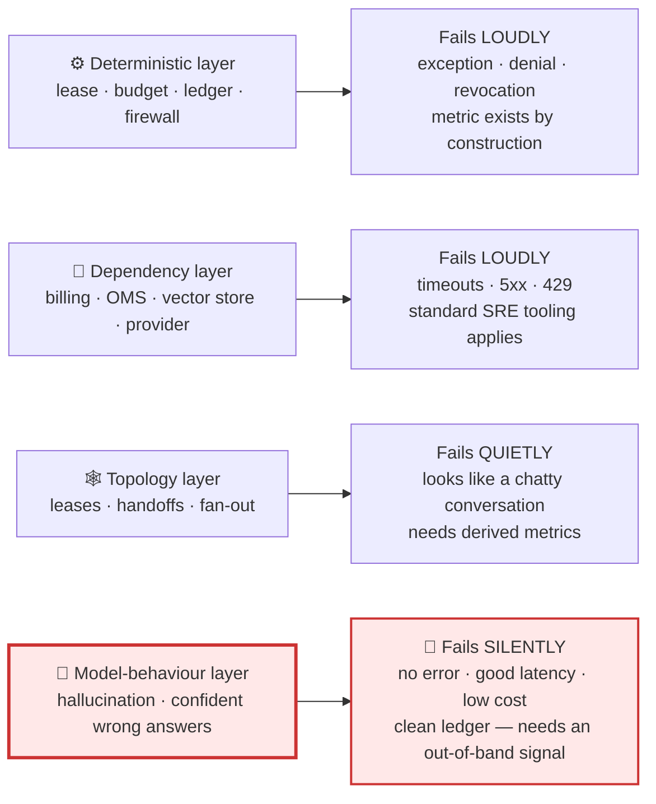
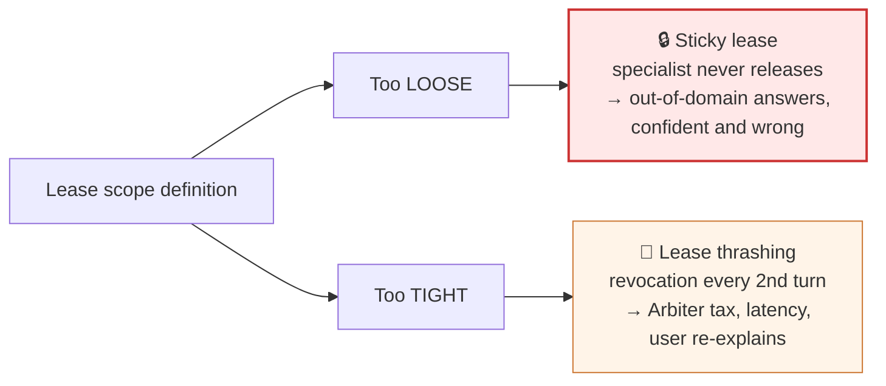
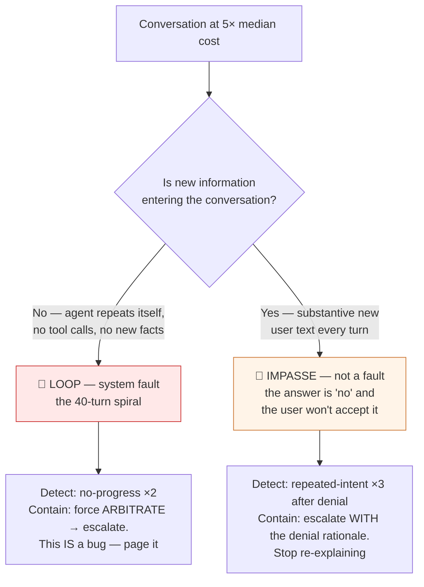
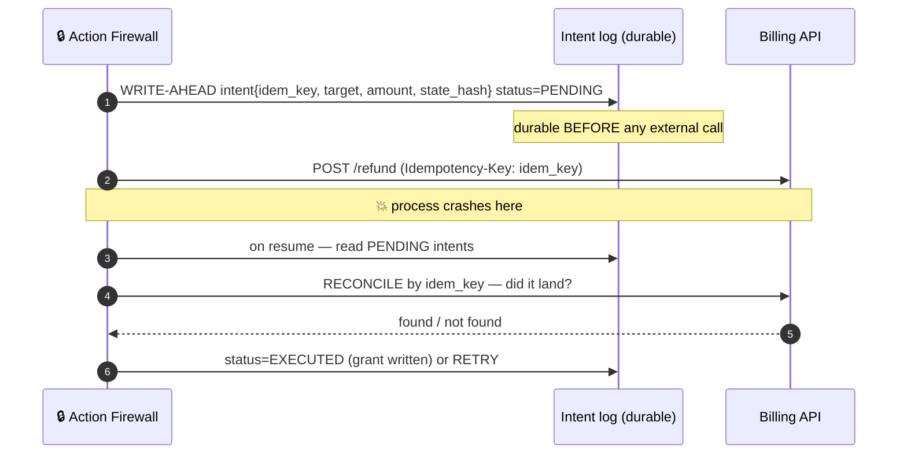
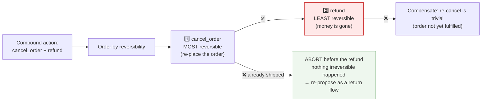
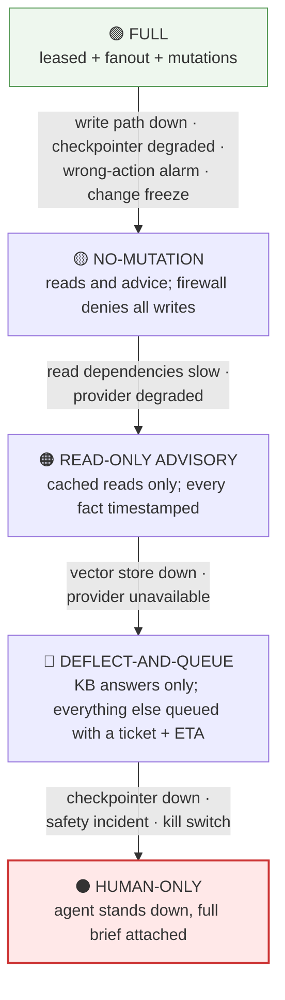
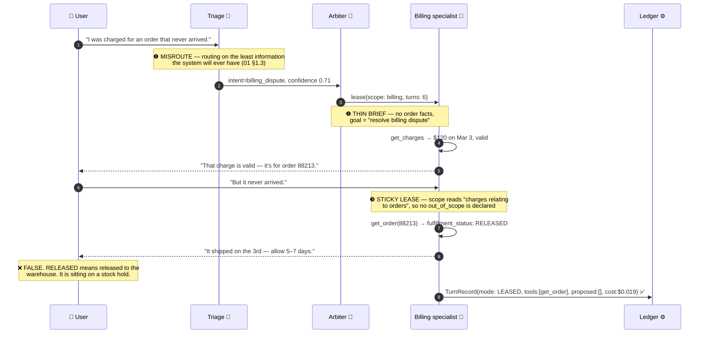

# 11 — Failure Modes & Resilience

> **Principles 1, 5, 8.** The catalogue of what actually breaks, with detection and containment for
> each. The organising claim: **the dangerous failures in this system raise no error.** A tool
> timeout is a monitored event; a confidently wrong answer is a green dashboard and a chargeback in
> six weeks.

---

## 1. How to read this catalogue

Failures sort by *which layer notices*, and the layers get progressively worse at noticing.

Effort is usually spent top-down. **Risk is distributed bottom-up.** §§2–6 cover the loud layers
because they must be handled; §7 and §8 are where the design work actually is.

---

## 2. Topology-specific pathologies

These are the failures you *bought* by choosing a topology. None is visible to a generic APM stack.

| Pathology | Symptom in production | Detection signal | Containment |
|---|---|---|---|
| **Ping-pong / hop thrashing** | Billing: "that's shipping." Orders: "that's billing." User sees three "let me connect you" messages | `hops > 3`; the same `(from,to)` domain pair twice in one session | Hop budget in the lease; the second identical pair forces `ARBITRATE` with a *decision* mandate — the Arbiter must pick an owner, not re-route |
| **Lease thrashing** | Revocation on nearly every turn; the conversation is 60% Arbiter | **Revocation rate > 40%** ([02](02-cost-and-latency-model.md) §7); median `turns_per_lease < 2` | Widen scope; assign overlap domains explicitly (billing owns *reads* of "a charge for an order"). Thrashing is a **config bug, not a model bug** |
| **Sticky lease** | One specialist holds 8 turns and answers a shipping question inside a billing lease | **Not derivable from revocation rate** — see below | Sampled compound-classifier scored as *agreement with the lease holder*; per-lease out-of-domain answer rate |
| **Supervisor context bloat** | Arbiter routing degrades as N grows | Schema tokens ≈ 350×N; at N = 9 that is ~3.2k before any history. Routing accuracy vs. N | Retrieve candidate domains instead of carrying all N schemas — the Arbiter is rare, so it can afford a lookup step |
| **Telephone game in FANOUT** | Specialist: "$49.00 to Visa •4021, ref RF-88213". Synthesis: "about $49 back to your card soon" | Verbatim-field diff — every numeric, currency, date and reference token in a specialist result must appear byte-identical in the reduce output | A deterministic check **after** the reduce call, not an instruction inside its prompt. A prompt cannot enforce string equality |

**The sticky lease is the one most designs miss.** A healthy revocation rate of 15% and a broken one
of 15% are the same number, and low revocation *looks* like success: leases work, arbitration is
rare, cost is down. What you cannot see is Billing answering "has my order shipped?" from a field it
half-understands. **The absence of revocations is not evidence of correct scoping** — only evidence
that specialists are not self-reporting, and self-report has imperfect recall by construction
([03](03-recommended-architecture.md) §9.3). The only way to measure it is a signal the specialist
does not produce: the sampled compound-classifier from [03](03-recommended-architecture.md) §4,
scored against the current lease holder.

---

## 3. Handoff amnesia

The user explains the problem to Billing. The lease breaks. Orders opens with "Hi! Can you give me
your order number?" — which they gave two turns ago. The **#1 CSAT killer** in real deployments, and
fully mechanical.

| Brief quality | What the ledger shows | Consequence |
|---|---|---|
| Good | `verified_facts: [order=88213, charge $49 Mar 3, customer confirmed unintentional]`, `already_asked: [...]`, `expected_output` | New specialist opens with an *answer*, not a question |
| Bad | `verified_facts: []`, `goal: "help the customer"`, `already_asked: []` | Discovery restarts from zero |
| Worse | `raw_transcript: <8k tokens>` | No amnesia — but the isolation benefit that justified separate agents is gone. You now pay supervisor token costs for swarm ergonomics |

**The KPI is `questions_re_asked_rate`**: the fraction of post-handoff turns whose first question is
already answered by an earlier user message. Computable deterministically (embed the question,
compare against prior user turns above a threshold), zero hot-path inference, and the best proxy for
handoff-contract health. Target < 3%.

The lease design already prevents the worst version: there is no agent-to-agent transfer
([03](03-recommended-architecture.md) §4), so a specialist can only `release_lease(reason, brief)`
and the Arbiter mints the next lease. **That gives exactly one place to validate the brief schema**,
reject an empty `verified_facts` when the ledger shows tool calls occurred, and enrich from the
ledger. In a mesh swarm the same validation would have to live in N×(N−1) handoff tools. Contract in
[06](06-handoff-contract.md).

---

## 4. Runaway conversations — and the failure the loop detector cannot see

Two shapes look identical on a cost dashboard and demand opposite responses.

> **The no-progress detector cannot see the impasse.** Its trigger is "no new content", and an angry
> customer produces plenty of new content every turn. A system with only a no-progress detector runs
> a customer who wants an impossible refund until the turn budget expires — 30+ turns of a model
> politely restating policy, ~$0.50, and a guaranteed one star.

| Control | Catches | Misses |
|---|---|---|
| No-progress detector (deterministic, free) | Model loops, tool-retry spirals | Impasses; slow-but-real progress |
| Repeated-intent detector (small model, sampled on denials) | Impasses | Loops with varied phrasing |
| Turn / token / dollar budget | **Everything, eventually** | Nothing — but it is the *last* line, and firing it costs `H` ([10](10-cost-governance.md) §6) |

**Every conversation the budget terminates is one the two detectors should have caught earlier and
cheaper.** Track "escalations by triggering control"; if the budget leads, the detectors are
mis-tuned.

---

## 5. Action-layer failures

The Action Firewall makes mutation *governable*. It does not make it *atomic*. Three failures
survive it.

### 5.1 Double execution on retry or crash

**The intent must be durable before the side effect, and the idempotency key must be derived from
the intent, not minted per attempt** — `hash(session_id, action_type, target_id, amount)` per
[03](03-recommended-architecture.md) §6 step 5; a fresh UUID per retry defeats the whole mechanism.
Where a downstream API does not honour the key (older OMS endpoints), reconciliation must be a
**read against the target system**, never an assumption.

### 5.2 Stale approval after a durable pause

Email approval flows pause for days ([04](04-agent-runtime.md)), and the approval that returns
answers a question about a world that no longer exists.

> Tuesday: "Cancel order 88213 and refund $120?" → sent to a human approver.
> Wednesday: the order ships, and the customer changes the delivery address.
> Thursday: the approver clicks **Approve**.

Idempotency does not help — this is not a duplicate, it is a *correct execution of a stale
decision*. **Bind the approval to a `state_hash` over the exact evidence fields the decision
depended on** (order status, amount, payment method, customer tier). On resume, recompute; a
mismatch voids the approval and the firewall re-proposes with the new facts. Approvals also carry a
TTL: older than the entity's volatility class ([10](10-cost-governance.md) §5) means expired,
regardless of hash.

### 5.3 Partial failure in a compound action

"Cancel my order and refund me." Two writes, two systems, no distributed transaction. The refund
succeeds; the cancel fails because the order already entered fulfilment. **There is no rollback for
a refund** — the money left. The options are compensation (charge the card again: a *new* mutation
needing its own authorisation, which the customer will experience as fraud) or acceptance (eat the
$120 and let the shipment go). Both are bad; the design's job is to make the bad outcome the *cheap*
one.

**The ordering rule: least reversible last.** Then any partial failure leaves only reversible
effects behind and the compensating action is cheap and non-adversarial. Ordering by "what the user
said first" or "what is fastest" is how you end up compensating a refund. A compound action is also
**one** firewall proposal with **one** approval — never two proposals approved separately, which
reintroduces §5.2's pause hazard between the two writes.

---

## 6. Dependency failures and the degraded-mode ladder

| Dependency | Blast radius | Detection | Degraded mode | What the customer is told |
|---|---|---|---|---|
| **Billing API down** | Billing + Returns; all refunds | 5xx rate, breaker open | Read-only from cache with an explicit staleness caveat; **all refund/credit proposals denied at the firewall** | "I can see your March invoice, but I can't process a refund right now — I've queued this for our billing team, you'll hear back within 4 hours." |
| **OMS slow** (not down) | Orders — the worst case | p99 > 3× baseline, **before** errors appear | Hard 2 s per-tool timeout → answer from last-known with a timestamp; **no retries** ([10](10-cost-governance.md) §9) | "As of 11:40 this morning your order was at the Reno facility — live tracking is slow right now, here's the carrier link." |
| **LLM provider throttled / degraded** | Everything | 429 rate, TTFT drift, output-quality canary | Cross-provider failover at the same tier, then the shed ladder in [10](10-cost-governance.md) §9 | Nothing, ideally. If queueing: an honest wait estimate, not a spinner |
| **Checkpointer / DB unavailable** | Everything stateful | Write errors, checkpoint latency | **Fail closed on mutation** — no `ACTING` transitions without durable state; in-flight conversations continue read-only; no new conversations accepted | "I'm having trouble saving our conversation, so I don't want to change anything on your account. Let me get you to a person." |
| **Vector store down** | Deflection + policy grounding | Query errors, empty-result rate | Deflection **off**, specialists refuse policy claims. Must fail *closed* — see below | "I want to give you the exact policy — let me connect you with someone who can confirm it." |

**The vector-store row is the one to argue about in review.** Every other failure degrades a
*capability*; this one, left to fail open, silently degrades *correctness* — deflection falls
through to the specialist path (18% of traffic re-priced from $0.006 to $0.104) and the specialist
keeps answering policy questions, now **ungrounded, from parametric memory**, with every latency and
error metric green. That is §7's hallucinated-policy failure arriving via an infrastructure
incident.

| Mode | Customer-visible behaviour | Containment |
|---|---|--:|
| Full | Normal | 65% |
| No-mutation | Still diagnoses and explains, then queues the action with a reference number | ~45% |
| Read-only advisory | Every fact carries "as of HH:MM"; no commitments made | ~30% |
| Deflect-and-queue | KB answers only; everything else gets a ticket and an ETA | ~18% |
| Human-only | "Let me get you to a person" | 0% |

> **The bottom rung is not a working mode — it is a queue.** The human tier is sized for ~14,000
> contacts/day (35% of 40,000). Failing over to human-only presents it with 40,000: a 2.9× overload
> it cannot absorb, producing hour-long waits. **Deflect-and-queue exists precisely so that "the
> agent is down" does not mean "the contact centre is down."** A ladder whose last two rungs are
> "degraded" and "off" has no useful failure mode; the queueing rung is what makes it real.

---

## 7. Model-behaviour failures — the ones the firewall does not catch

| Failure | Concrete symptom | Firewall catches it? |
|---|---|:--:|
| **Hallucinated policy** | "Yes, we offer a 90-day return window" (it is 30) | ❌ it is text; no action follows |
| **Hallucinated tool result** | Cites an order status it never fetched | ❌ unless it drives a proposal |
| **Confident wrong answer** | Reads `fulfillment_status: RELEASED`, tells the customer "it shipped" | ❌ |
| **Refusal loop** | Injection defences over-fire; a legitimate refund request refused three times | ❌ a refusal proposes nothing |
| **Language / tone drift** | German reply cites the English corpus and drops a qualifier; tone flattens into legalese | ❌ |
| Wrong refund amount / target | `propose_action(refund, $490)` | ✅ ceiling, entitlement, idempotency |
| Action on the wrong customer | Refund against another tenant's order | ✅ entitlement check |

**Say the asymmetry out loud: the Action Firewall protects the company's money. Nothing in the
architecture so far protects the company's *word*.** And the word is not free — a hallucinated
90-day return window becomes a promise the company honours rather than argue with a customer holding
a screenshot. It costs a real refund, it is **not in the ledger as an action**, and it is therefore
absent from the wrong-action SLO entirely.

Three layered controls, because none is sufficient alone:

1. **Grounded generation.** Policy claims must cite a retrieved corpus span; a specialist that
   cannot cite says "let me confirm that" instead of asserting. Removes most of the volume.
2. **Post-output policy check, selectively.** A small-model claim-extraction pass over the draft,
   checked against the retrieved spans. Every turn costs latency the p95 SLO cannot afford — so gate
   it on **policy-shaped output**: a number with a unit, a duration, a currency, or a commitment
   phrase ("we offer", "you can", "our policy is"). Fires on ~20% of turns, which fits the budget.
3. **Sampled online scoring** ([09](09-evaluation-observability.md)) — statistical, lagging, and the
   only thing that catches the residue.

Two specifics that get missed. **Refusal loops are a safety control failing closed too hard** and
read as hostility; detect them (same denial 3× with a falling sentiment gradient) and escalate,
never retry — an over-firing injection detector produces a worse CSAT outcome than the attack it
prevented. And **never look at blended per-language metrics**: nine languages share one policy
corpus ([00](00-overview.md)), retrieval and claim-checking both degrade off the corpus language,
and a 4.4 blended CSAT can conceal a 3.1 in Japanese. Split containment, CSAT and groundedness **by
language** or the failure is structurally invisible.

---

## 8. The compounding failure — the scenario to design against

Individually survivable faults compose into a wrong answer with **no error anywhere in the system.**

**Now audit the instrumentation. Every metric is green.** No tool failed. p95 turn latency 1.9 s ✅.
Cost $0.078 ✅. Hop count 1 ✅ — *the sticky lease suppressed the hop*. No-progress detector: not
triggered, there were new facts every turn. Turn budget: 4 of 20 ✅. Action Firewall: **never ran**,
because nothing was proposed. Ledger: complete and clean — perfect auditability of a wrong answer.
Containment: counted as **contained** ✅.

The conversation improves every dashboard in [10](10-cost-governance.md) — cheap, fast, short and
contained — and it told a customer their missing package shipped.

| Control | Fires? | Note |
|---|:--:|---|
| Turn Ledger | ⚠️ | Records the wrong answer faithfully. **Recording ≠ detecting** |
| Compound-classifier sample vs. lease holder | ✅ | Disagrees with `billing` at turn 3 — **catches ❸**, but only 1-in-N |
| Groundedness / post-output check (§7) | ✅ | "shipped on the 3rd" is a commitment phrase + date unsupported by `RELEASED` — **the strongest available catch** |
| Triage confidence threshold | ⚠️ | 0.71 is low. Below ~0.8 on an ambiguous first message, provisionally `FANOUT` rather than commit a lease — **catches ❶** |
| Brief validator at re-lease | ✅ | Would reject `verified_facts: []` against a ledger showing tool calls — **catches ❷**, but there was no re-lease here |
| **Re-contact within 48 h** | ✅ | The package still doesn't arrive. Lagging, but unambiguous |
| **Human-contradiction rate** | ✅ | The human's first message contradicts the agent's last one |

> **The design consequence: the system needs at least one detector whose input is not produced by
> the system itself.** Every green metric above came from the same pipeline that produced the wrong
> answer, so none of them can disagree with it. **Re-contact rate within 48 h** and
> **human-contradiction rate** are the two signals from outside the loop. The second is the
> cheapest, highest-signal metric in the whole design — one string comparison per escalation — and
> almost nobody instruments it.

There is a cheaper fix hiding in the transcript too: `fulfillment_status: RELEASED` is a field the
model will keep misreading. **Shape tool output into customer-facing semantics at the tool boundary**
(`shipped: false, stage: "at warehouse", carrier_scan: null`) rather than hoping a prompt teaches
domain vocabulary. One line in the read tool removes an entire class of confident wrong answer — and
it is the same lever sitting at #2 in [10](10-cost-governance.md) §10.

---

## 9. Resilience summary

| Failure | Detection signal | Containment | Customer impact | SLO at risk |
|---|---|---|---|---|
| Ping-pong | Repeated `(from,to)` release pair | Hop budget → Arbiter must *decide*, not re-route | "Connecting you…" ×3 | CSAT, cost |
| Lease thrashing | Revocation > 40%; `turns_per_lease < 2` | Widen scope (config change) | Latency, repetition | p95 turn, cost |
| Sticky lease | Sampled classifier disagrees with holder | Narrow scope; force release on domain-term detection | **Silently wrong answers** | Containment (falsely high), CSAT |
| Supervisor bloat | Routing accuracy vs. N; schema tokens | Domain retrieval instead of all-N schemas | Misroutes | Routing accuracy |
| Telephone game | Verbatim-field diff on reduce output | Deterministic post-reduce check | Wrong amounts and refs | Wrong-action, CSAT |
| Handoff amnesia | `questions_re_asked_rate > 3%` | Brief validator at the single re-lease point | User repeats themselves | CSAT, containment |
| Runaway loop | No-progress detector ×2 | Force `ARBITRATE` → escalate; **page it, it's a bug** | Long, useless conversation | Cost p99, CSAT |
| Impasse | Repeated intent ×3 after a denial | Escalate **with** the denial rationale | Frustration | CSAT |
| Double execution | PENDING intent found on resume | Write-ahead intent + derived idempotency key + reconcile | Double refund | Wrong-action |
| Stale approval | `state_hash` mismatch on resume | Void approval, re-propose on new facts | Action taken on stale facts | Wrong-action |
| Partial compound action | One leg failed | Least-reversible-last ordering + compensation | Refund without the cancel | Wrong-action, revenue |
| Billing API down | 5xx / breaker | No-mutation mode | Queued action + reference number | Containment |
| OMS slow | p99 > 3× baseline | 2 s timeout, timestamped cached read, no retry | "As of 11:40…" | p95 turn |
| Provider throttled | 429 rate, TTFT drift | Cross-provider failover → shed ladder | Wait message | p50 TTFT |
| Checkpointer down | Write errors | **Fail closed on mutation**; human-only | Handoff to a person | Containment |
| Vector store down | Empty-result rate | **Fail closed**: deflection off, no ungrounded policy claims | Escalation | Cost, groundedness |
| Hallucinated policy | Groundedness score; post-output check | Grounded generation + selective claim check | A promise you must honour | CSAT, revenue |
| Refusal loop | Same denial ×3, sentiment falling | Escalate, never retry | Feels stonewalled | CSAT |
| Language drift | **Per-language** CSAT / containment split | Language-specific eval gates | Silent and localised | CSAT |
| Compounding failure | Re-contact 48 h; human-contradiction rate | Groundedness + classifier sampling + tool-output shaping | Confidently wrong | **All of them** |

---

## 10. Design-review questions

1. Which failures here produce **no error and no metric change**, and what is each one's out-of-band
   detector? A failure with no detector outside the pipeline that caused it is undetected.
2. What is the lease revocation rate, and how do you distinguish a healthy 15% from a sticky 15%?
3. Is `questions_re_asked_rate` instrumented, and is it under 3%?
4. Which control triggers the most escalations? If it is the budget, the detectors are mis-tuned and
   every miss costs `H` ([10](10-cost-governance.md) §6).
5. Walk a compound action's partial failure. Is the irreversible leg last? Prove it from the code,
   not the prompt.
6. What is bound into the approval `state_hash`, and what happens to a two-day-old approval?
7. When the vector store is down, does deflection fail open or closed? Open is a correctness
   incident wearing an availability costume.
8. Is the human tier sized for the deflect-and-queue rung, or does the ladder end in a cliff?
9. Are CSAT, containment and groundedness split by language, and does any eval gate on the
   non-English splits?
10. Is `human_contradiction_rate` measured — the human's first message disagreeing with the agent's
    last? One string comparison per escalation, and the best wrong-answer signal available.

Continue to [12 — Sequence flows](12-sequence-flows.md).
