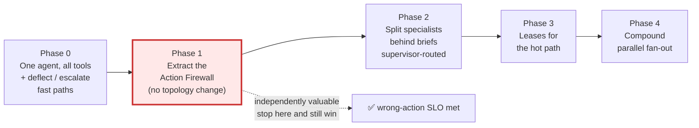
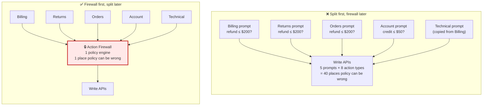
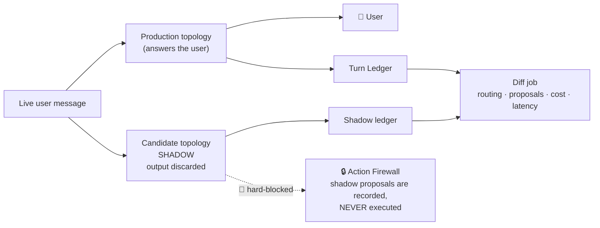
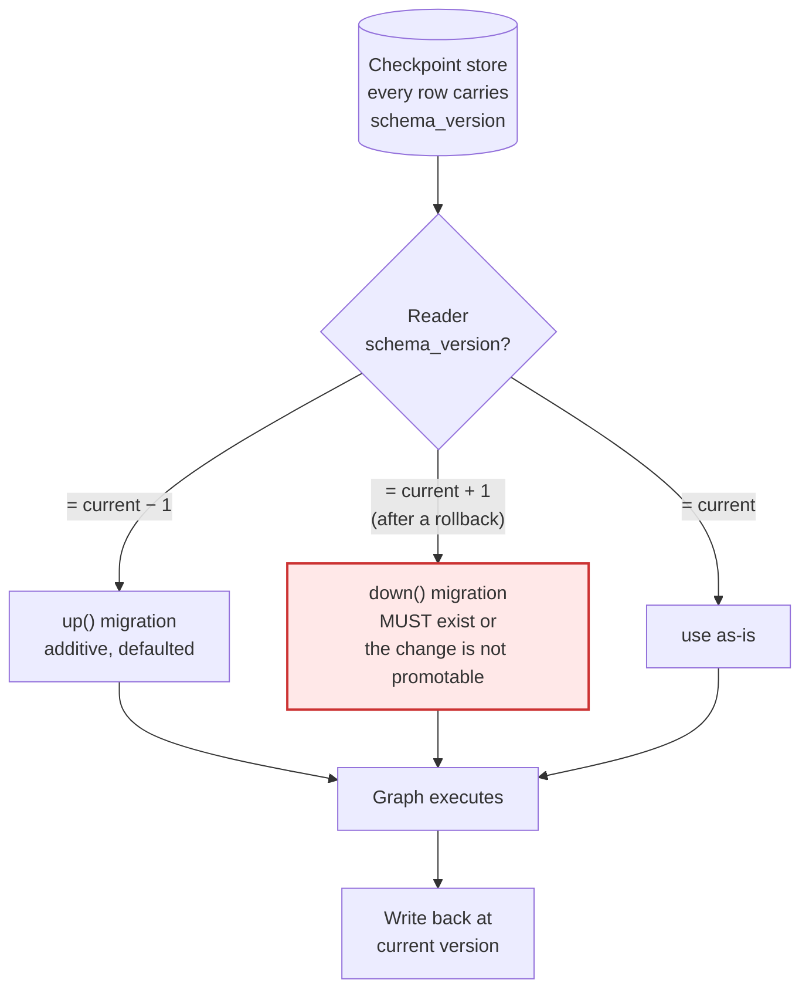
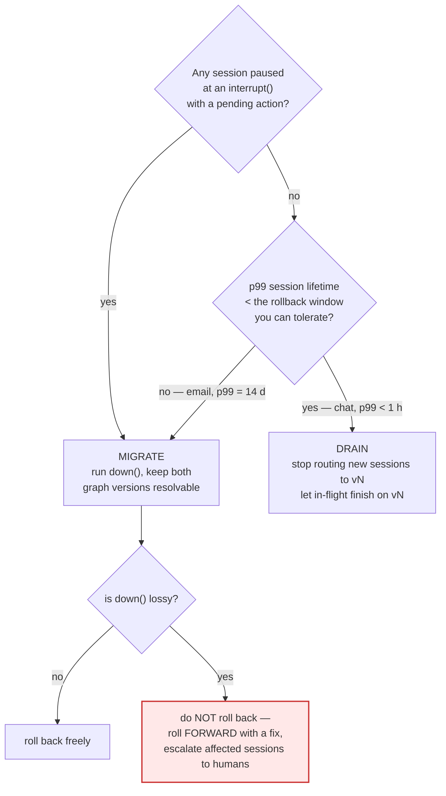
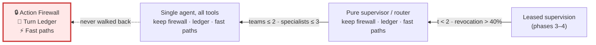

# 13 — Migration & Rollout

> **Principle 7.** Nobody builds this on day one, and anybody who does has skipped the step that
> actually saves the money. This doc is the path from *one agent with all the tools* — or from a
> legacy intent-tree bot — to leased supervision, with an entry criterion, an exit criterion, and
> a rollback for every phase.
>
> The hardest part is not the topology. It is **rolling back a graph change while checkpoints
> written under the old schema are still in flight.** §6 is the part to read twice.

---

## 1. Do not start here

**Phase 0 is one agent with all the tools, plus the deterministic fast paths.** Not a supervisor,
not a swarm, not this. Per [02](02-cost-and-latency-model.md) §5, the fast paths from
[03](03-recommended-architecture.md) §3 — KB deflection with a calibrated confidence threshold,
and rule-based escalation for fraud/legal/rage/VIP — remove **23% of conversations before any
agent runs** and move the blended cost more than the entire topology decision does.

| Lever | What it moves | Build effort | Needs multi-agent? |
|---|---|---|:--:|
| **Deflection + escalation fast paths** | 23% of conversations never reach a specialist — [02](02-cost-and-latency-model.md) §5 calls this the single largest cost lever *and* the cheapest to build | days | **no** |
| **Action Firewall** (Phase 1) | The wrong-action SLO (≤ 0.02%) — the one with money attached | weeks | **no** |
| Topology → leased supervision | Blended $0.138 → $0.085; removes the per-turn tax on ~70% of turns | quarters | yes |

**Read that table honestly.** The two levers that need none of this document are also the two that
ship in under a month. A team that spends two quarters on leases before shipping a KB deflector
has been failed by its design doc, not by its topology.

### Trigger conditions for leaving Phase 0

Move only when **all three** structural conditions hold and at least one pain condition is
*measured*, not anticipated:

| Condition | Threshold | How you know |
|---|---|---|
| **Domains** | N ≥ 5 distinct policy corpora | Count the prompt's conditional branches |
| **Owning teams** | ≥ 3 teams with independent release trains | Org chart, not aspiration |
| **Turns per domain** | measured p50 `t` ≥ 2 | Instrument Phase 0 first ([09](09-evaluation-observability.md)) |
| Pain — context | single prompt > ~15K tokens of policy | Token count |
| Pain — contention | ≥ 2 teams/week editing the same prompt file | `git log --stat` |
| Pain — compound | compound share ≥ 4% | Sampled classifier |

> **If you cannot name which trigger fired, you are refactoring for fashion.** Write the trigger
> and its measured value into the phase-1 design doc. It becomes the walk-back criterion in §9.

---

## 2. The phase ladder

| Phase | Entry criterion | Exit criterion | Rollback |
|---|---|---|---|
| **0** Single agent + fast paths | You have support traffic | Deflection precision ≥ 0.95 at ≥ 15% coverage; escalation rules cover fraud/legal/rage/VIP; `t`, N, team count instrumented | Disable deflector by config flag; all traffic to the agent |
| **1** Action Firewall | Phase 0 exit met | 100% of mutations flow through `propose_action`; zero direct write-tool bindings in any prompt; wrong-action rate ≤ 0.02% over 14 d | Feature-flag firewall to pass-through mode — **keeps logging, stops blocking** |
| **2** Split specialists | Firewall live 30 d; ≥ 3 owning teams have accepted their eval sets | Golden-set routing accuracy ≥ 0.92; per-specialist eval suites green; brief schema v1 frozen | Route 100% back to the monolith prompt; specialists stay deployed but unrouted |
| **3** Leases | Phase 2 stable 30 d; ledger complete; `t` p50 ≥ 2 confirmed in production | Hot-path turns cost 2 calls; revocation rate ≤ 40%; containment not regressed | Lease TTL → 0 turns, which degrades cleanly to **pure supervisor routing per turn** |
| **4** Compound fan-out | Compound share ≥ 4% measured; verbatim-field contract implemented | Compound p95 ≤ 6 s; fidelity eval on numeric/policy fields ≥ 0.98 | Disable `Send` fan-out; compound issues serialise through release/re-lease |

**Phase 3's rollback is the elegant one and it is not an accident.** Setting `turns_remaining = 0`
on every grant means every turn breaks the lease and returns to the Arbiter — which *is* a pure
supervisor. The hybrid degrades to a supervisor by changing one integer, with no graph change.
Design phases so their rollback is a config value, not a deploy.

---

## 3. Why the firewall comes before the split

When policy lives in prompts, **the policy surface is `agents × action types`.** When it lives in
the firewall, it is `1`.

Three reasons the order is non-negotiable:

1. **Splitting multiplies a defect class you have not contained yet.** Every specialist you fork
   copies the refund ceiling into a new prompt. The fifth copy will drift, and you will find out
   via a policy incident, not a test.
2. **The firewall is independently valuable.** It moves the wrong-action SLO — the one with money
   attached ([00](00-overview.md) §2) — on the *existing single agent*, before any topology work.
   A team that stops after Phase 1 has still won.
3. **It de-risks everything after.** Once mutation is behind a typed proposal with an idempotency
   key and a ledger entry, every later phase is a change to *who talks*, never to *what can
   happen*. Topology changes stop being safety changes. That is the whole reason phases 2–4 can be
   rolled forward and back aggressively.

**Corollary:** if a team proposes phase 2 before phase 1, ask where the refund ceiling will live
during the transition. If the answer names a prompt, the answer is "nowhere."

---

## 4. Shadow mode

Run the new topology on live traffic with **user-visible output suppressed**: the old system
answers, the new one produces a would-be answer, both write to the ledger, and a diff job compares
them on the [09](09-evaluation-observability.md) metrics.

| Metric | Shadow can measure it? | Why |
|---|:--:|---|
| Routing / triage accuracy | ✅ | Same input, labelled outcome available from the production trajectory |
| Compound-detection recall | ✅ | Compare against the sampled classifier |
| Model calls, tokens, cost per turn | ✅ | Deterministic given the same input |
| Proposal agreement (would it have proposed the same action, same amount?) | ✅ | **The highest-value shadow signal** — a disagreement here is a latent policy incident |
| p95 turn latency | ⚠️ partial | Shadow runs off the critical path; contention and cache-hit profiles differ |
| **Containment rate** | ❌ | The shadow never got to ask *its own* clarifying question, so turn 2 onward is counterfactual |
| **CSAT** | ❌ | No user ever saw it |

**This is the honest limit of shadow mode and it is routinely overstated.** Shadow validates
*decisions*, not *conversations*. The instant the candidate would have asked a different question,
the traffic diverges and every downstream metric is fiction. Containment, CSAT, and
turns-to-resolution require an **interleaved A/B at low ramp**, not shadow.

### Sample size and duration

To detect a 2-point change in containment (65% → 67%) at 80% power, α = 0.05:

`n ≈ 16 · p(1−p) / δ² = 16 · 0.2275 / 0.0004 ≈ 9,100 conversations per arm`

| Question | Detectable δ | n per arm | Days at 40k/day, 10% ramp |
|---|--:|--:|--:|
| Containment moved? | 2 pp | 9,100 | ~5 |
| Wrong-action rate moved? | 0.02 pp | impractical | use proposal-agreement in shadow instead |
| Cost/conversation moved? | 5% | ~1,500 | ~1 |
| Routing accuracy moved? | 3 pp | ~1,600 | ~1 |

**Floor: 7 days regardless of arithmetic**, to cover a full weekly seasonality cycle — support
traffic on Monday is not support traffic on Saturday. **14 days if the change touches Billing**,
so the window crosses a month-end dunning spike. A statistically significant result from a
Tuesday-to-Thursday run is significantly wrong.

---

## 5. Eval-gated promotion

No phase advances without a green run of both suites, on the candidate build, in the target
environment.

| Gate | Contents | Threshold | Blocking sign-off |
|---|---|---|---|
| **Golden set** | ~600 recorded conversations, replayed deterministically; ≥ 40 per specialist, ≥ 80 compound | No regression > 1 pp on any per-domain resolution score | Owning team of each affected specialist |
| **Safety suite** | Injection corpus, over-ceiling refunds, entitlement violations, PII/PCI leakage, confirmation-bypass attempts | **Zero failures. Not a percentage.** | Trust & Safety |
| **Cost/latency** | Replay with per-turn call counting | Blended ≤ $0.11, compound p95 ≤ 6 s | Platform |
| **Contract conformance** | HandoffBrief + propose_action schema round-trip, both supported versions | 100% | Platform |
| **Rollback rehearsal** | Deploy vN, take checkpoints, deploy vN−1, resume | 100% of in-flight sessions resume | Platform (see §6) |

The last row is the one teams skip and then regret.

---

## 6. Rolling back a graph change with live checkpoints

This is the genuinely hard problem, and it has nothing to do with agents. A checkpoint written by
graph `vN` is a serialized blob of **state channels and a resume point keyed by node name**. Roll
the deployment back to `vN−1` and three things break:

1. Channels that `vN` added are unknown to `vN−1` (tolerable) — or channels `vN−1` requires were
   **renamed** by `vN` (fatal).
2. A session paused at `interrupt()` inside a node that `vN−1` does not have has an **orphaned
   resume point**. In this design that is a *pending confirmed refund* — the worst possible thing
   to orphan.
3. The interrupt **payload shape** changed, so the resume value no longer deserializes into what
   the node expects.

### The versioned-state / dual-read pattern

The rules that make this work:

| Rule | Why |
|---|---|
| Every checkpoint row carries `schema_version` | You cannot migrate what you cannot identify |
| **Additive-only** channel changes within a major version; new channels have defaults | `vN−1` ignoring an unknown channel is safe; a missing required channel is not |
| **Never rename** — add the new channel, dual-write both, delete a release later | Rename is delete + add executed atomically in the worst place |
| Node names are **append-only for one full retention window** (14 d, the email-thread p99) | An orphaned `interrupt()` resume point is an orphaned pending mutation |
| Interrupt payloads are versioned structs, never positional tuples | Resume values must deserialize across versions |
| **A change is promotable only if `down()` exists and the rollback rehearsal passed** | Rollback is a feature you test, not a hope you hold |

### Drain vs. migrate

| | Drain | Migrate |
|---|---|---|
| Mechanism | Both versions serve; router sends only new sessions to the surviving one | `down()` rewrites state on read |
| Cost | Two versions live for one session-lifetime | Migration code per version pair, forever |
| Works when | Synchronous chat, short p99, no pending mutations | Email, multi-day threads, pending confirmations |
| Fails when | An email thread outlives your patience | `down()` is lossy — then neither works |

**Helix runs both channels, so the answer is "drain for chat, migrate for email," and the
migration code is not optional.** The one thing you must never do is roll back a lossy change and
discover it by executing a pending refund against a state the graph misread.

---

## 7. Agent registry and ownership

Every agent is a registered artifact with an owner, a version, an eval set, and an on-call
rotation. Unowned components are how the shared-routing-prompt failure in
[01](01-topology-comparison.md) §1 happens.

| Component | Owner | Cadence | Eval set | On-call |
|---|---|---|---|---|
| Arbiter prompt + lease policy | **Platform** | biweekly | Routing + arbitration golden set | Platform |
| Action Firewall | **Platform** | on demand, 2 reviewers | Safety suite | Platform (paged on deny-rate anomaly) |
| Policy Engine **rules** | **Risk & Finance** | effective-dated config | Policy conformance suite | Risk |
| Lease Manager, Ledger, Budget Governor | **Platform** | with the runtime | Determinism + replay tests | Platform |
| Triage | **Platform** | weekly | Routing accuracy set | Platform |
| Billing / Orders / Technical / Account / Returns **prompts + read tools** | **Owning team** | own train, ≤ daily | Own domain set + shared safety suite | Owning team |
| Intake fast paths (KB, escalation rules) | **Support Ops** | daily | Deflection precision/coverage | Support Ops |

**The split is the load-bearing part: teams own how their specialist *talks*; the platform owns
what any specialist *can do*.** A specialist team can ship a prompt change at 4 pm on a Friday
because the worst outcome is a bad answer, not a bad refund.

### RBAC for policy ceilings

A refund ceiling is a **config artifact**, not a prompt line.

| Action | Support agent | Specialist team | Platform | Risk | Notes |
|---|:--:|:--:|:--:|:--:|---|
| Change a specialist prompt | ❌ | ✅ | ✅ | ❌ | Own eval gate |
| Add a read tool to a lease scope | ❌ | ✅ | ✅ | ❌ | Privacy review if PII |
| Add an **action type** to `may_propose` | ❌ | ❌ | ✅ | ✅ | Two-party |
| Change a **refund/credit ceiling** | ❌ | ❌ | ❌ | ✅ | Risk only, second approver, effective-dated, audit-logged |
| One-off above-ceiling approval | ✅ | ❌ | ❌ | ❌ | Per-action, through the firewall (§5 of [12](12-sequence-flows.md)) |
| Bypass the firewall | ❌ | ❌ | ❌ | ❌ | **No such capability exists** |

---

## 8. Versioning the cross-team contracts

`HandoffBrief` and `propose_action` are **cross-team interfaces**. Every specialist team produces
them; central components consume them. They need API discipline, not prompt discipline.

| Change | Allowed in minor? | Migration |
|---|:--:|---|
| Add an optional field | ✅ | None — consumers tolerate unknown fields |
| Add a required field | ❌ | New major; producers dual-emit for one window |
| Widen an enum (new release reason, new action type) | ✅ | Consumers must have a `default:` branch — tested |
| Narrow an enum / remove a field | ❌ | New major + deprecation window |
| Change a field's semantics at the same name | ❌ | **Rename instead.** Silent semantic drift is unfixable |

Mechanics that avoid a flag day:

- Every payload carries `schema_version`. **Producers emit one version; consumers accept two.**
- The firewall and Arbiter normalize `vN−1` to `vN` at the boundary; internal code sees one shape.
- The registry exposes a dashboard of *which team is still emitting `vN−1`*, and deprecation is a
  ticket against a named owner with a date — not an announcement in a channel.
- Deprecation window = **two release trains of the slowest consuming team**, minimum 30 days.
- The contract-conformance gate in §5 fails the build if a producer emits a version outside the
  supported pair. The window closes by CI, not by memory.

---

## 9. Organisational anti-patterns

| Anti-pattern | Symptom you will actually see | Fix |
|---|---|---|
| **Shared routing prompt with no owner** | 5 teams editing one file; conditionals like *"if the user says chargeback prefer Billing unless an RMA exists"*; nobody dares refactor | Assign the Arbiter to Platform with its own eval set; specialist teams file PRs *against a routing test case*, never against the prose |
| **Specialists shipping policy in prompts** | "Refunds up to $200" appears in three prompts, two of them stale | Firewall first (§3); CI check that fails on currency amounts or policy verbs in specialist prompts |
| **No owner for the Arbiter** | Lease breaks rise, nobody notices; revocation rate is on no dashboard | Arbiter has an on-call and a revocation-rate SLO like any service |
| **Platform owns everything** | Specialist teams file tickets to change their own tone; velocity dies; the platform becomes the bottleneck it was meant to remove | Teams own prompts + read tools outright, with autonomy that stops exactly at `may_propose` |
| **Eval sets owned by the platform** | Domain evals measure what the platform understands, not what the domain requires | Each team owns and grows its own golden set; the platform owns only the *shared* safety suite |
| **Phase-skipping to look advanced** | Leases in a design doc before a firewall exists in production | The trigger table in §1 goes in the design doc, with measured values |

---

## 10. When to walk this back

The hybrid has to keep earning its complexity. These are the falsification signals from
[02](02-cost-and-latency-model.md) §7, restated as decisions:

| Signal | Threshold | Action |
|---|---|---|
| Turns per domain, p50 | `t < 2` for a quarter | Collapse to **pure router** — the amortisation the lease exists for is not happening |
| Lease revocation rate | > 40% sustained after two scoping iterations | Leases are mis-scoped; if re-scoping fails, collapse to pure router |
| Arbiter invocations per conversation | > 1.5 | You are paying supervisor costs *and* lease complexity |
| Compound share | < 4% | Retire Phase 4; serialise compound work |
| Owning teams | dropped to ≤ 2 (reorg, acquisition) | The organisational justification is gone — collapse toward one agent |
| Specialist count | ≤ 3 after consolidation | Collapse to one agent with all the tools |

**The firewall, the ledger, and the fast paths are never walked back.** They are not topology —
they are the safety, audit, and cost properties that any topology needs. Walking back means
deleting *coordination machinery*, and both collapse steps are config changes (lease TTL → 0,
then route-everything-to-one-node) precisely because phases 2–4 were built to be reversible.

A design that cannot describe its own retirement has not been reviewed.

Continue to [Design-principle mapping](design-principles.md).
