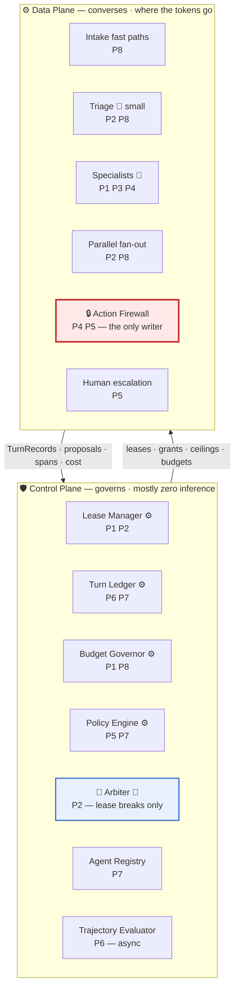

# Design-Principle Mapping

> **The control plane governs the data plane.** The supervisor owns the *session*; a specialist
> owns the *turn*. Governance is per-session and per-action; conversation is per-turn. Binding
> both to one component is the mistake that both pure topologies make
> ([01](01-topology-comparison.md) §3), and separating them is what lets this design be audited
> like a supervisor while costing what a swarm costs.
>
> This doc is the reviewer cheat-sheet: for each of the eight principles — what it demands, the
> concrete module here that satisfies it, where to read it, and **the honest gap**.

---

## 0. The governing picture

Three facts a reviewer should extract from this diagram before reading further:

1. **Almost nothing in the control plane thinks.** Lease Manager, Ledger, Budget Governor, and
   most of the Policy Engine are plain code. The Arbiter is the only control-plane component that
   runs a model, and it runs on lease breaks — roughly once per conversation.
2. **There is exactly one arrow into the write path.** Every mutation, from every agent, in every
   mode, traverses the Action Firewall.
3. **The upward arrow is unconditional.** A `TurnRecord` is written on every turn whether or not a
   supervisor ran. **Recording is decoupled from routing** — that is the hinge of the design.

---

## 1. Agent runtime & execution model

| The principle demands | This design's answer | Doc |
|---|---|---|
| Explicit state machine, not free-form reasoning | Mode machine over `INTAKE · DEFLECT · TRIAGE · LEASED · FANOUT · ACTING · ARBITRATE · SUSPENDED · ESCALATE · RESOLVED`, with enumerated legal transitions and explicit termination | [03](03-recommended-architecture.md) §3, [04](04-agent-runtime.md) |
| Bounded execution | Per-conversation caps on turns, hops, tools, tokens, and dollars; the lease itself carries `turns_remaining`; breach forces `ARBITRATE` or escalation, never a silent loop | [03](03-recommended-architecture.md) §4, [11](11-failure-modes.md) |
| Resumability | `interrupt()` + checkpointer; confirmations are durable pauses that survive process restarts and 2-day email gaps; leases carry idle **and** absolute TTLs | [04](04-agent-runtime.md), [12](12-sequence-flows.md) §7 |
| Isolation | Specialist scratchpads are subgraph-local channels, never merged into shared `messages`; read tools are least-privilege per lease | [05](05-state-and-memory.md), [03](03-recommended-architecture.md) §4 |
| Idempotent dangerous steps | Firewall step 5 keys on `(session, action, target, amount)`; a resumed or retried execution collapses | [07](07-tools-and-action-firewall.md) |

**Gap.** The mode machine is enforced in the graph, but a specialist's *inner* loop is not a state
machine — it is an agent loop with a tool-call budget. `L_spec` is modelled at 3 and measured, not
bounded by construction; a pathological specialist burns its token budget before its turn budget.
The Budget Governor catches this as a *breach*, which is a blunt instrument compared to a
structured inner loop.

---

## 2. Orchestration & coordination

| The principle demands | This design's answer | Doc |
|---|---|---|
| Topology as an explicit, defended choice | The whole study: supervisor vs. swarm compared on 13 dimensions, crossover derived, hybrid justified by arithmetic | [01](01-topology-comparison.md), [02](02-cost-and-latency-model.md) |
| Bounded handoffs | `HandoffBrief` — goal, `verified_facts`, `already_asked`, `expected_output` — never a raw transcript; ~300 tokens | [06](06-handoff-contract.md), [12](12-sequence-flows.md) §4 |
| Loop containment with a termination proof | No agent-to-agent transfer exists. Specialists `release_lease(reason)`; the Arbiter is the only minter. N² mesh → N release reasons + a hop counter outside the mesh | [03](03-recommended-architecture.md) §4 |
| Conditional / parallel decomposition | Triage emits `Send` fan-out for independent multi-domain work; reduce node with `defer=True`; verbatim-field map into composition | [03](03-recommended-architecture.md) §8, [12](12-sequence-flows.md) §3 |
| Coordination that does not tax the hot path | `LEASED → LEASED` costs one dict lookup, two integer comparisons, and one ledger append — **zero supervisor inference** | [03](03-recommended-architecture.md) §7, [12](12-sequence-flows.md) §2.2 |

**Gap.** Compound work is detected either at triage (first message) or by a specialist's
self-report mid-conversation. **A compound issue that emerges at turn 6 and that the specialist
does not notice gets serialised** — the parallel win is contingent on detection recall, which is
measured on sampled turns rather than guaranteed.

---

## 3. Memory & context management

| The principle demands | This design's answer | Doc |
|---|---|---|
| Short- vs. long-term split | Per-conversation state channels vs. a durable customer profile (tier, tenure, prior refunds, prior escalations, language) | [05](05-state-and-memory.md) |
| Selective recall over stuffing | Handoffs pass a brief, not history. Long-term memory is queried for *facts the policy engine needs*, not for narrative colour | [05](05-state-and-memory.md), [06](06-handoff-contract.md) |
| Shared vs. private channels | Shared `messages` + ledger; private specialist scratchpad that never leaks into another specialist's context — the isolation win worth ~6K tokens on compound issues | [05](05-state-and-memory.md), [02](02-cost-and-latency-model.md) §3 |
| Statefulness that avoids re-lookup | The leased specialist keeps its own fetched invoice across turns; a stateless subagent would re-fetch it every turn (the re-lookup tax) | [02](02-cost-and-latency-model.md) §3 |
| Anti-amnesia | `already_asked` + `do_not_ask_again` in the brief; reconstructed from the ledger after a durable pause | [06](06-handoff-contract.md), [12](12-sequence-flows.md) §7 |

**Gap.** Long-lived conversations (p99 = 30+ turns) still grow the shared channel monotonically.
Compaction is summarisation, and **summarising a support transcript is exactly where amounts,
reference IDs, and commitments get quietly dropped** — the same defect class as the telephone
game, moved from the routing layer to the memory layer. There is no cross-conversation *learning*
loop: a resolution pattern that works is not automatically promoted to the KB.

---

## 4. Tool & integration layer

| The principle demands | This design's answer | Doc |
|---|---|---|
| Standardized manifests | Typed tool manifests per specialist — I/O schema, scope, cost hint, timeout, output cap; the lease names which tools are grantable | [07](07-tools-and-action-firewall.md) |
| Dynamic selection | Tool sets are scoped by lease, so no specialist carries schemas for tools it may not call; supervisor tool-schema bloat (`350 × N`) never happens | [03](03-recommended-architecture.md) §4, [01](01-topology-comparison.md) §1 |
| Read/write firewall | **Specialists have read tools and exactly one write-shaped tool: `propose_action`.** The firewall is the only component holding write credentials | [07](07-tools-and-action-firewall.md) |
| Robust errors | Per-tool timeouts and circuit breakers; a failed read becomes a stated uncertainty in the reply, never a fabricated fact | [07](07-tools-and-action-firewall.md), [11](11-failure-modes.md) |
| Provenance | The tool layer tags every free-text field from an external record as untrusted with a span id; the firewall refuses actions whose evidence is untrusted-only | [08](08-safety-guardrails.md), [12](12-sequence-flows.md) §6 |
| Cross-team contracts | `HandoffBrief` and `propose_action` are versioned APIs — additive-only in minors, producers emit one version, consumers accept two | [13](13-migration-and-rollout.md) §8 |

**Gap.** Provenance tagging is only as complete as the tool layer. A specialist that reaches an
external API by any other route produces untagged text, and the untrusted-evidence rule silently
passes. This is enforced by making the tool layer the only network egress from the sandbox — **a
deployment property, not a design property**, and therefore only as strong as the deployment.

---

## 5. Safety & guardrails

| The principle demands | This design's answer | Doc |
|---|---|---|
| Layered pre/post checks | Deterministic in the hot path (schema, lease, entitlement, idempotency, injection tagging, PII/PCI redaction); LLM-judge groundedness deferred to the async evaluator | [08](08-safety-guardrails.md) |
| Action authorization in one place | Firewall steps 1–8; **policy that lives in a prompt is suggested, not enforced** | [03](03-recommended-architecture.md) §6, [07](07-tools-and-action-firewall.md) |
| Least privilege | `may_propose` bounds *action types and amounts* per lease — Orders cannot propose a refund at all, at any size | [03](03-recommended-architecture.md) §4 |
| Human-in-the-loop on high value | Above-ceiling actions become a *change of approver*, not a denial; the human's approval is an **input to** the firewall, not a bypass of it | [12](12-sequence-flows.md) §5 |
| Injection resistance that survives a persuaded model | Untrusted spans cannot authorize actions; the model being fooled is assumed, not defended against | [08](08-safety-guardrails.md), [12](12-sequence-flows.md) §6 |
| Consent scoped to state | Confirmations authorize an action *against the world as described*; preconditions re-validate at execution time | [12](12-sequence-flows.md) §7 |
| Designed in, not retrofitted | Phase 1 of the rollout is the firewall, **before any topology change**, precisely so later phases change who talks and never what can happen | [13](13-migration-and-rollout.md) §3 |

**Gap.** The firewall contains *actions*, not *statements*. A specialist can still tell a customer
"you're eligible for a full refund" when policy says otherwise — no money moves, but a commitment
has been created and a CSAT event is guaranteed. Groundedness checks on policy claims run on
sampled turns asynchronously; **hallucinated policy is only partly contained.** Making it a
blocking hot-path check would cost a model call on every turn and undo the design's central
economic claim.

---

## 6. Evaluation & observability

| The principle demands | This design's answer | Doc |
|---|---|---|
| Spans everywhere | One `TurnRecord` per turn in every mode, plus spans for each model call, tool call, policy decision, and detector; `agent_name` + `lease_id` on every model-call tag | [09](09-evaluation-observability.md), [03](03-recommended-architecture.md) §5 |
| Audit that does not depend on inference | The Turn Ledger is deterministic middleware. "Who decided to refund $49, on what evidence, under what authority" is a **single-row lookup joined to one ActionGrant** | [03](03-recommended-architecture.md) §5 |
| Trajectory scoring, not just final answers | Routing accuracy, compound-detection recall, revocation rate, turns-per-domain, handoff fidelity, containment, no-progress incidence | [09](09-evaluation-observability.md) |
| Continuous + offline | Async evaluator scores live conversations; the same scorer gates releases via golden-set replay (~600 recorded conversations) | [09](09-evaluation-observability.md), [13](13-migration-and-rollout.md) §5 |
| Falsifiability | Five named metrics that would invalidate the cost model, with the action to take if each fires | [02](02-cost-and-latency-model.md) §7, [13](13-migration-and-rollout.md) §10 |

**Gap.** Shadow mode validates *decisions*, not *conversations*. The moment the candidate topology
would have asked a different clarifying question, the traffic diverges and containment, CSAT, and
turns-to-resolution become counterfactual. Those require an interleaved A/B at low ramp and a
7–14-day window. **Wrong-action rate at the 0.02% SLO is not measurable by A/B at all** — the
detectable delta needs impractical sample sizes, so it is governed by proposal-agreement in
shadow plus the zero-failure safety suite, which is a proxy, not the metric.

---

## 7. Platform governance & lifecycle

| The principle demands | This design's answer | Doc |
|---|---|---|
| Agent registry with mandatory ownership | Every specialist has an owning team, a version, an eval set, a release cadence, and an on-call rotation | [13](13-migration-and-rollout.md) §7 |
| Clear central vs. federated split | **Central:** Arbiter, firewall, policy engine, lease manager, ledger, triage. **Federated:** specialist prompts, read tools, domain eval sets | [13](13-migration-and-rollout.md) §7 |
| RBAC on authority | Refund and credit ceilings are effective-dated config owned by Risk with a second approver — not a prompt line a specialist team can edit | [13](13-migration-and-rollout.md) §7 |
| Eval-gated lifecycle | No phase or release advances without golden set + safety suite (zero failures) + cost/latency + contract conformance + **rollback rehearsal** | [13](13-migration-and-rollout.md) §5 |
| Safe rollback of live systems | Versioned checkpoint state with `up()`/`down()` migrations; additive-only channels; append-only node names for one retention window; drain-vs-migrate decision rule | [13](13-migration-and-rollout.md) §6 |
| Audit & compliance | Append-only WORM ledger of every turn, policy decision, denial, escalation, and grant — SOC 2 evidence by construction | [03](03-recommended-architecture.md) §5 |
| A retirement path | Explicit walk-back thresholds and a collapse ladder to router, then to a single agent | [13](13-migration-and-rollout.md) §10 |

**Gap.** The federated model assumes teams will actually maintain their golden sets. In practice
domain eval sets rot faster than prompts do, and a stale eval set is worse than no eval set
because it produces a green build. There is a staleness detector on the registry; there is no
mechanism that makes an under-invested team's specialist *fail* rather than *drift*.

---

## 8. Cost & performance

| The principle demands | This design's answer | Doc |
|---|---|---|
| Model tiering per node | Small for triage and detectors, mid for normal specialist turns and composition, frontier only on mutation-adjacent turns — one turn in four for Archetype A | [10](10-cost-governance.md), [12](12-sequence-flows.md) §2.4 |
| Do not run a model when code will do | Lease check, budget check, ledger append, policy rules, idempotency: all deterministic. The hot path is **2 model calls per turn** | [03](03-recommended-architecture.md) §7 |
| Eliminate work rather than optimise it | Intake fast paths resolve or eject **23% of conversations before any agent runs** — a larger lever than the topology choice itself | [03](03-recommended-architecture.md) §3, [02](02-cost-and-latency-model.md) §5 |
| Caching | Specialist system prompts are cache-stable across a leased conversation; the supervisor's routing and synthesis contexts churn and cache poorly, which is part of why the hybrid wins | [02](02-cost-and-latency-model.md) §3, [10](10-cost-governance.md) |
| Parallelism for latency | Compound issues are `max(specialist)` + compose ≈ 4.9 s, versus a swarm's sequential ≈ 7.7 s | [02](02-cost-and-latency-model.md) §2, [12](12-sequence-flows.md) §3 |
| Per-tenant / per-agent cost visibility | `agent_name` + `lease_id` on every model call; "what did this conversation cost, and which specialist spent it" is a query | [10](10-cost-governance.md) |
| Budgets enforced, not observed | Budget Governor caps turns, tokens, and dollars per conversation; breach forces arbitration or escalation | [03](03-recommended-architecture.md) §2 |

**Gap.** Every number in [02](02-cost-and-latency-model.md) is a *model*, not a measurement, and
the most load-bearing assumption — `L_spec = 3` — is the one most likely to be wrong in
production. If real specialist loop depth is 6, all costs roughly double and the tiering decisions
need revisiting. The blended $0.085 also assumes the traffic mix holds; a shift toward compound
issues moves cost toward the supervisor-shaped end of the curve.

---

## 9. Shared lineage with the sibling designs

[IncidentCommander](../../IncidentCommander/docs/design-principles.md) and
[KnowledgeAgent](../../../KnowledgeAgent/docs/design_principles.md) map onto the same eight
principles, and the **read/write firewall is the stance all three share**:

| Design | Data plane can | Write path | Grant object |
|---|---|---|---|
| **KnowledgeAgent** | read only | none — advisory by construction | — |
| **IncidentCommander** | read only, read-only credentials | separate Executor identity, RBAC + blast radius + approval gates | signed `ExecutionGrant` |
| **Helix Support** (this) | read + `propose_action` | single Action Firewall holding all write credentials | `ActionGrant` in the ledger |

The through-line: **the component that reasons never holds the credential that mutates.** Each
design differs only in how much authority the write path is willing to delegate — none for
KnowledgeAgent, human-gated for IncidentCommander, policy-ceilinged with human overflow here. If
you have read one of these mappings, you can review the other two by asking a single question:
*where does the grant come from, and can any code path reach the write API without one?*

---

## 10. Honest limitations — what this design does **not** solve

1. **No voice channel.** Turn-taking, barge-in, and streaming ASR introduce a latency budget and
   an interruption model orthogonal to everything here. The lease abstraction probably survives
   voice; the confirmation UX in [12](12-sequence-flows.md) §2.3 certainly does not.
2. **Fan-out reduce is still a paraphrasing layer.** Compound issues traverse the Arbiter, so the
   telephone game from [01](01-topology-comparison.md) §1 applies to exactly the traffic shape
   with the most numbers in it. Verbatim-field contracts mitigate; they do not eliminate.
3. **Self-reported out-of-scope has imperfect recall.** A specialist that does not know what it
   does not know will answer a shipping question badly and confidently. The no-progress detector
   and turn budget are backstops with latency, not guarantees.
4. **Lease scoping is empirical.** Too tight and you thrash through the Arbiter; too loose and
   specialists answer outside their competence. Expect two or three tuning iterations, and treat
   sustained revocation above 40% as evidence the model is wrong rather than the traffic.
5. **Hallucinated policy is only partly contained.** The firewall stops the action; it does not
   stop the sentence. Async groundedness sampling catches this after the fact.
6. **It assumes ≥ 5 domains across ≥ 3 owning teams.** Below that this is pure overhead and the
   right answer is one agent with all the tools plus the fast paths
   ([02](02-cost-and-latency-model.md) §6, [13](13-migration-and-rollout.md) §1).
7. **The ledger is only as good as its writers.** Egress control is a deployment guarantee, not a
   prompt guarantee.
8. **Containment and CSAT cannot be shadow-tested.** They need live interleaved traffic and a
   week of it, which slows every phase gate in [13](13-migration-and-rollout.md).
9. **Nine languages, one policy corpus.** Policy rules are language-independent because they live
   in code; specialist *prompts* are not, and per-language eval coverage is uneven by
   construction.
10. **Long-tail conversations degrade.** At p99 = 30+ turns, context compaction becomes the
    dominant fidelity risk, and compaction is summarisation — the one operation this design
    otherwise works hard to keep out of the path of numbers and commitments.

Every one of these is a *stated* limitation with an owner or a threshold attached. **A design that
cannot name the conditions under which it is wrong has not been reviewed** — the walk-back
criteria in [13](13-migration-and-rollout.md) §10 are the operational form of that claim.
