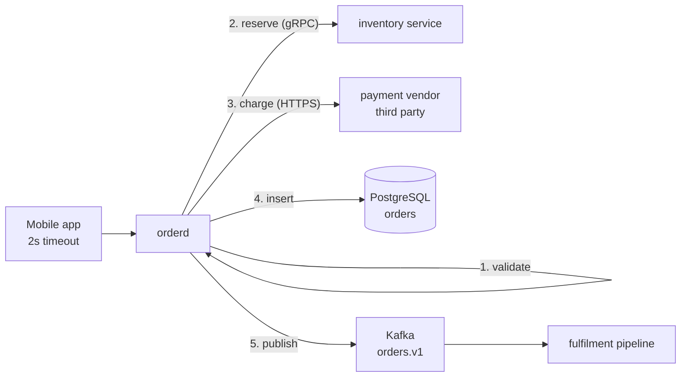

# Error Handling at Staff Level — the nuances that only show up in production

**Language in scope:** Go for every code example, because that is what the rest of this repository
is written in. Part 15 translates the ideas into Java, Python, Rust, and TypeScript, and calls out
where each language's machinery pushes you toward a different mistake. Everything before Part 15 is
about *decisions*, and those decisions are the same in every language.

---

## How to read this document

This is not a style guide and it is not a list of rules. Almost every rule you have read about error
handling ("always wrap", "never ignore an error", "log and return") is correct in some situations and
actively harmful in others, and nobody tells you which is which. That distinction is the entire
content of this document.

The method throughout is the same one used in the other long documents here: show the naive version
first, run it in your head until it breaks, and only then introduce the thing that fixes it. Every
number is derived in small visible steps rather than asserted. Every example uses one concrete
system — described in Part 1 — with real order IDs, real dollar amounts, and real service names, so
that you are always reasoning about a specific request and not about `foo` calling `bar`.

If you are experienced, do not skip Parts 2 and 3. They look elementary and they contain the two
ideas — that an error has three separate audiences, and that retryability is a property of the
*operation*, not of the *failure* — that the later parts are built on. Nearly every expensive
production incident in this document traces back to getting one of those two wrong.

---

## Index

- [Part 0 — What "staff level" means for error handling](#part-0--what-staff-level-means-for-error-handling)
- [Part 1 — The running system: Harbor's order service](#part-1--the-running-system-harbors-order-service)
- [Part 2 — What an error actually is: three audiences, one value](#part-2--what-an-error-actually-is-three-audiences-one-value)
- [Part 3 — The only classification that matters: whose fault, and can I try again](#part-3--the-only-classification-that-matters-whose-fault-and-can-i-try-again)
- [Part 4 — Errors are values: constructing, wrapping, and the wrapping contract](#part-4--errors-are-values-constructing-wrapping-and-the-wrapping-contract)
- [Part 5 — Handle once: where in the call stack a decision belongs](#part-5--handle-once-where-in-the-call-stack-a-decision-belongs)
- [Part 6 — Deadlines and cancellation: the errors that are not failures](#part-6--deadlines-and-cancellation-the-errors-that-are-not-failures)
- [Part 7 — Retries: the most dangerous thing in your codebase](#part-7--retries-the-most-dangerous-thing-in-your-codebase)
- [Part 8 — Partial failure: when half the work succeeded](#part-8--partial-failure-when-half-the-work-succeeded)
- [Part 9 — Panics and invariants: when crashing is the correct handler](#part-9--panics-and-invariants-when-crashing-is-the-correct-handler)
- [Part 10 — Errors across concurrency: first error, all errors, and leaked goroutines](#part-10--errors-across-concurrency-first-error-all-errors-and-leaked-goroutines)
- [Part 11 — Errors as telemetry: logging, metrics, tracing, alerting](#part-11--errors-as-telemetry-logging-metrics-tracing-alerting)
- [Part 12 — The error contract you expose to callers](#part-12--the-error-contract-you-expose-to-callers)
- [Part 13 — Degradation: choosing to fail open or fail closed](#part-13--degradation-choosing-to-fail-open-or-fail-closed)
- [Part 14 — Testing the paths that only run during an outage](#part-14--testing-the-paths-that-only-run-during-an-outage)
- [Part 15 — The same decisions in other languages](#part-15--the-same-decisions-in-other-languages)
- [Part 16 — Rolling this out across a codebase you did not write](#part-16--rolling-this-out-across-a-codebase-you-did-not-write)
- [Part 17 — Anti-pattern catalogue](#part-17--anti-pattern-catalogue)
- [Part 18 — A review checklist you can actually use](#part-18--a-review-checklist-you-can-actually-use)
- [What to take away](#what-to-take-away)

---

## Part 0 — What "staff level" means for error handling

There is a recognisable progression in how engineers think about a failed operation, and it is worth
naming because it tells you what to aim at.

**An early-career engineer asks: did it fail?** The concern is control flow. Did the function return
an error, and did I remember to check it. The output of this level of thinking is code that compiles
and does not silently drop failures. That is genuinely valuable and it is not the topic here.

**A senior engineer asks: what do I return, and what do I log?** The concern is the contract of this
function and the diagnosability of this service. The output is well-wrapped errors, sensible HTTP
status codes, structured logs. This is where most production code tops out, and it is good code.

**A staff engineer asks: what will the caller *do* when they receive this, and what happens when
every caller does it simultaneously?** The concern is the behaviour of the *system* on its worst day.
An error value is not a report about the past; it is an instruction about the future. When you return
`503 Service Unavailable` you are not describing your state, you are telling several thousand clients
to try again, and they will, all at once, in about 100 milliseconds. When you return `400 Bad
Request` you are telling them to stop forever. Choosing between those two is a capacity decision
disguised as a syntax decision.

Four consequences follow, and they shape everything below.

### 0.1 Error handling is interface design, not coding style

The set of errors a function can return is part of its signature in every way that matters, even in
languages where the compiler does not say so. If a caller has to branch on your failures, then adding
a new failure mode is a breaking change to the same degree as adding a required parameter. Removing
one is also a breaking change, because someone is handling it.

This reframes a lot of arguments. "Should I define a sentinel error or just return a string?" is not
a style question; it is "am I promising callers they can detect this specific condition forever."
Answer that first and the syntax follows.

### 0.2 The error path is the path you exercise least and need most

Under normal conditions your success path runs several hundred million times a month and your
error paths run rarely. During an incident that inverts completely: the error path becomes the only
path, at full traffic, while people are awake at 03:00 trying to understand it. The code that has
been executed the fewest times in your entire system is the code that will decide whether a partial
outage becomes a total one.

That asymmetry is the reason experienced engineers seem paranoid about error handling out of
proportion to how often it runs. It is not that failures are frequent. It is that the failure
handling has never been load-tested by reality, and it runs first at the worst moment.

### 0.3 Retryability is a property of the operation, not of the failure

This is the single most commonly missed idea and Part 3 develops it fully. Briefly: a timeout does
not tell you whether retrying is safe. Whether retrying is safe depends on whether the operation is
idempotent, which is a fact about your API design, not about the network. Two services can return the
identical `DEADLINE_EXCEEDED` and one of them is safe to retry sixty times while the other will
double-charge a customer.

### 0.4 Uniformity beats local optimality

A codebase where every package handles errors the same slightly-imperfect way is far easier to
operate than one where six packages each handle errors in a locally optimal but different way. The
reason is that during an incident you are reading code you did not write, in a package you have never
opened, and you need to know without reading it whether the error you are looking at has already been
logged, already been retried, and already been counted in a metric. Convention answers that. Local
cleverness does not.

This is the part of error handling that is specifically a staff responsibility, because it is
enforced by review standards, lint rules, and shared helper packages rather than by any single
change. Part 16 is about doing that in a codebase that currently has none of it.

---

## Part 1 — The running system: Harbor's order service

Every example below refers to one system. It is small enough to hold in your head and it contains
every category of failure that matters.

**Harbor** is a business-to-business food distribution platform. Restaurants place wholesale orders
through Harbor; Harbor reserves stock from suppliers, charges the restaurant's card, and hands the
order to a fulfilment pipeline.

The service in question is **`orderd`**, the order submission service. It is a Go service, deployed
as 12 pods, serving both a JSON/HTTP API used by the web and mobile apps and a gRPC API used by other
internal services.

**The main operation is `SubmitOrder`.** A concrete instance of it, which will be referenced by name
throughout this document:

- Tenant (the restaurant): `acme-foods`
- Order ID: `ord_8f2a91`
- Contents: 40 kg of tomatoes, 12 cases of olive oil
- Total: **$148.20**
- Card on file: Visa ending `4242`
- Idempotency key supplied by the mobile app: `idem_c41d0e77`

**What `SubmitOrder` does, in order:**

1. **Validate the request.** Are the quantities positive, is the delivery date within the supplier's
   window, does `acme-foods` have an active account.
2. **Reserve inventory.** A gRPC call to the in-house `inventory` service: "hold 40 kg of tomatoes
   from warehouse `wh-03` for 15 minutes."
3. **Charge the card.** An HTTPS call to a third-party payment vendor. This call is not in our
   control, takes 300 ms at the median and 4 seconds at the 99th percentile, and moves real money.
4. **Persist the order.** An `INSERT` into PostgreSQL, table `orders`.
5. **Publish an event.** Produce `OrderSubmitted` to the Kafka topic `orders.v1`, which the fulfilment
   pipeline consumes.

**Scale and budget numbers used in the derivations below:**

- Peak traffic: **400 order submissions per second**.
- Client timeout (mobile app): **2 seconds**.
- Availability SLO on `SubmitOrder`: **99.9% of submissions succeed** measured over a rolling 30 days.
- `inventory` is another team's service, in the same cluster, median 8 ms.
- Postgres is a single primary with two read replicas; the primary is the write bottleneck.

**Why this system is a good teaching example:** step 3 moves money and is therefore not safely
retryable without work, step 2 holds a resource that must be released if a later step fails, step 4
and step 5 must either both happen or neither, and steps 2, 3, and 5 are all across a network. That
is four genuinely different failure categories in five steps, which is normal for real code and is
exactly the situation where generic advice stops helping.

Here is the shape of it:



---

## Part 2 — What an error actually is: three audiences, one value

Start with the naive version, which is what most code looks like:

```go
if err != nil {
    return fmt.Errorf("failed to submit order: %v", err)
}
```

Ask what that value is *for*. It turns out there are three completely different consumers of it, they
want different things, and this line serves exactly one of them badly.

### 2.1 Audience one: the calling code

The caller is a program. A program cannot read English. It needs to make a branch decision, and the
only branch decisions that exist are these:

- Should I try this again, and if so, after how long?
- Should I try a different approach — a fallback, a cache, a different backend?
- Should I give up and propagate?
- Should I give up and report to a human?

To make that decision the caller needs a small number of *machine-readable* facts. `fmt.Errorf` with
`%v` destroys all of them: the original error's type is gone, and all that remains is a string. Any
caller wanting to branch is now reduced to `strings.Contains(err.Error(), "duplicate key")`, which is
a real pattern in real code bases and which breaks the day someone upgrades the Postgres driver and
the wording changes.

The fix — using `%w`, so the chain stays inspectable — is in Part 4. The point here is *why* it
matters: the caller is a program, and programs need values, not prose.

### 2.2 Audience two: the operator

Someone is paged at 03:00 with "order submission error rate is 4%." They need to answer one question
as fast as possible: **what changed and what do I do about it?** For that they need:

- Which specific operation failed, with enough identifiers to find it again (`ord_8f2a91`,
  `acme-foods`, the trace ID).
- Where in the chain it failed (step 3, the payment vendor — not "in `SubmitOrder`").
- What the underlying cause was, in its original words (`connection reset by peer`, `duplicate key
  value violates unique constraint "orders_idem_key"`).
- Whether this is one tenant, one pod, one warehouse, or everything.

Notice that "failed to submit order" contains none of this. It tells the operator only the name of
the function they are already looking at.

### 2.3 Audience three: the end user or API consumer

A restaurant manager pressed "Submit" and something did not work. They need to know:

- Did my order go through or not? (This is the only question they actually care about.)
- If not, is it worth pressing the button again?
- If pressing again will not help, what do I change?

They must not be shown the string `pq: duplicate key value violates unique constraint`. Not because
it is ugly, though it is, but because it leaks your schema to the internet and because it does not
answer any of their three questions.

### 2.4 The failure mode that comes from mixing the audiences

Almost every bad error-handling situation is one audience being served with another's data.

- **Operator data shown to users:** stack traces in HTTP responses. Leaks internals, helps nobody.
- **User data given to the operator:** the log line says `"could not complete your order, please try
  again"`. The operator now knows less than the customer does.
- **Prose given to the calling code:** string matching to detect a condition, which silently breaks
  on a dependency upgrade.
- **Machine data given to the user:** the mobile app shows `FAILED_PRECONDITION: reservation
  wh-03/tomatoes exceeded`, which a restaurant manager cannot act on.

The design rule that follows is worth stating plainly, because it drives the structure of everything
in Parts 4, 11, and 12:

> **One error value should carry all three audiences' information in separate, structured fields —
> and each boundary in your system should render only the fields for the audience on the other side
> of it.**

Concretely for `orderd`, one error value carries: a machine-readable kind (`kind: Unavailable`), the
identifiers (`order_id`, `tenant`, `step`), the original underlying error (wrapped, inspectable), and
a safe user-facing message plus a stable public code. The logging middleware renders the operator
fields. The HTTP middleware renders the user fields. The caller branches on the kind. Nobody
reformats anybody else's data.

### 2.5 What that looks like as a type

Here is the error type `orderd` uses. Read it as the concrete expression of the previous paragraph
rather than as a template to copy — the field list is the interesting part, not the syntax.

```go
package errs

// Kind is the machine-readable classification. It is a small, closed set:
// adding a Kind is a deliberate act, not something a package does casually.
type Kind int

const (
    KindInvalid      Kind = iota // caller sent something wrong; retrying is pointless
    KindUnauthorized             // caller is not who they claim
    KindForbidden                // caller is authenticated but not allowed
    KindNotFound
    KindConflict                 // state has moved under the caller; may retry after re-reading
    KindExhausted                // rate limit or quota; retry later, with backoff
    KindUnavailable              // transient dependency failure; retry with backoff
    KindTimeout                  // we ran out of time
    KindInternal                 // our bug; retrying will not help
)

// Error carries all three audiences in separate fields.
type Error struct {
    Kind Kind

    // Operator-facing.
    Op     string            // "orderd.SubmitOrder" — the logical operation
    Step   string            // "charge_card" — where in the pipeline
    Fields map[string]string // {"order_id": "ord_8f2a91", "tenant": "acme-foods"}
    Err    error             // the wrapped cause, kept inspectable

    // User-facing.
    PublicCode string // "payment_declined" — stable, documented, never changes meaning
    PublicMsg  string // "Your card was declined. Try a different payment method."
}

func (e *Error) Error() string { return e.Op + ": " + e.Err.Error() }
func (e *Error) Unwrap() error { return e.Err }
```

Two details in there are doing real work and are easy to skip past.

`Unwrap` is what keeps `errors.Is` and `errors.As` working through your wrapper, so a caller can
still ask "is the root cause `context.DeadlineExceeded`?" even though three layers have added
context. Without it your rich type is a wall that hides everything beneath it.

`PublicCode` being a *string constant you document* rather than the `Kind` is deliberate. `Kind` is
an internal implementation detail you will want to refactor. `PublicCode` is an API surface with the
same compatibility obligations as a JSON field name. Conflating them means you cannot rename an
internal enum without breaking a mobile app that shipped eight months ago. Part 12 goes into this.

---

## Part 3 — The only classification that matters: whose fault, and can I try again

Engineers love error taxonomies and most of them are useless. `SeverityError` versus
`SeverityWarning` on an error value tells the caller nothing it can act on. What a caller can act on
reduces to two axes.

### 3.1 Axis one: whose fault is it

There are exactly three answers, and the reason this matters is that each one implies a different
*owner* and a different *response*:

**The caller's fault.** The request is malformed, unauthorised, or asks for something that does not
exist. The defining test is: *would an identical retry ever succeed?* If no, it is the caller's fault.
For `orderd`, a delivery date in the past is the caller's fault. Retrying the identical request in
five minutes still has a date in the past.

**Our fault.** An invariant in `orderd` is broken. A nil dereference, a state machine reaching an
impossible transition, a config value we failed to validate at start-up. The defining test: *does
this indicate a bug that a human on our team must fix?* If yes, it is our fault. Nothing the caller
does helps, and — crucially — this class should page someone, whereas the other two classes usually
should not.

**The world's fault.** A dependency is down, the network dropped a packet, Postgres hit its
connection limit, the payment vendor is having an incident. Nobody's code is wrong. The defining
test: *is the same request likely to succeed later without anyone changing anything?* If yes, it is
the world's fault.

That third category is the interesting one, because it is the only one where retrying is even
potentially the right answer, and because it is the one people most often mislabel. Two very common
mislabels:

- **Marking our fault as the world's fault.** A nil map write panics, the recovery middleware turns
  it into `503 Service Unavailable`, and now every client retries a request that will panic again
  every single time. You have converted a bug into a traffic multiplier. It should have been a `500`
  that clients do not retry, and it should have paged you.
- **Marking the caller's fault as our fault.** A client sends `quantity: -5`, an unchecked
  subtraction produces a negative total, Postgres rejects it on a `CHECK` constraint, and the
  resulting database error is mapped to `500`. Your error-rate dashboard now shows *your* service
  failing when in fact your service is correctly refusing bad input. This one corrupts your SLO,
  which Part 11 covers, and it is the reason your availability number and your customers' experience
  can disagree.

### 3.2 Axis two: is retrying safe

Here is the naive rule that nearly everyone starts with, and it is wrong:

> "Timeouts and 503s are retryable. 4xx errors are not."

Run it against `orderd`, step 3. The service calls the payment vendor to charge $148.20 with a
2-second timeout. At 2.0 seconds no response has arrived, so the HTTP client returns a timeout error.
By the naive rule this is retryable, so `orderd` calls the vendor again.

**What actually happened at the vendor?** You do not know, and this is the whole point. There are
three possibilities and the error value cannot distinguish them:

1. The request never arrived. No charge. Retrying is correct.
2. The request arrived, the vendor charged the card, and the *response* was lost or slow. The card
   has been charged $148.20. Retrying charges it again — `acme-foods` is now out $296.40.
3. The request arrived and the vendor is still processing it. Retrying may produce two concurrent
   charges.

A timeout is not information about the server's state. It is the absence of information about the
server's state. This is why the naive rule is dangerous: it treats "I do not know what happened" as
"nothing happened."

**The correct rule:**

> Retry safety is determined by whether the operation is **idempotent**, which is a property you
> designed in or failed to design in. The error tells you whether retrying might *help*. Idempotency
> tells you whether retrying is *allowed*. You need both to be true.

So the decision is a two-part test:

| | Operation is idempotent | Operation is not idempotent |
|---|---|---|
| **Error suggests transience** (unavailable, timeout, exhausted) | Retry with backoff | You may not retry. Fix this by making it idempotent. |
| **Error suggests permanence** (invalid, forbidden, not found, internal) | Do not retry | Do not retry |

That table is one of the few tables in this document, because it genuinely is a two-by-two
comparison rather than a substitute for an explanation.

### 3.3 Making step 3 idempotent, concretely

The way `orderd` moves the payment call from the bottom-right cell (may not retry) to the top-left
cell (retry with backoff) is with an **idempotency key**: a caller-supplied unique token that the
vendor stores alongside the result of the operation.

`orderd` sends `Idempotency-Key: idem_c41d0e77` with the charge request. The vendor's contract is: if
it has already seen `idem_c41d0e77`, it does not charge again — it returns the stored result of the
first attempt. Now the timeout scenario resolves:

- Case 1, request never arrived: the retry with the same key performs the charge. One charge total.
- Case 2, charged but response lost: the retry with the same key returns the stored result. One
  charge total.
- Case 3, still processing: the vendor returns a `409 Conflict` meaning "a request with this key is
  in flight." `orderd` waits and asks again. One charge total.

In all three cases, exactly one charge. Notice that the *error handling code did not change*. What
changed was the contract with the vendor. This is what "error handling is interface design" means in
practice, and it is why a design review is a better place to prevent double-charges than a code
review.

**Where does the key come from?** It must be generated by whoever can regenerate the *same* key on a
retry of the *same logical operation*. If `orderd` generated a fresh UUID on each attempt, the key
would be different every time and would accomplish nothing. In Harbor, the mobile app generates
`idem_c41d0e77` when the user presses Submit and reuses it if the user presses Submit again after a
spinner times out. `orderd` derives its vendor-facing key deterministically from it, for example
`sha256("charge:" + idem_c41d0e77)`. The chain of keys has to be stable all the way down or the
property is lost at the first link that regenerates.

### 3.4 The three kinds of idempotency, because they are not equivalent

People say "make it idempotent" as if it is one thing. It is three, with different costs.

**Naturally idempotent.** The operation has no additional effect when repeated because of what it
is. `SET status = 'cancelled' WHERE id = 'ord_8f2a91'` is naturally idempotent. So is a `PUT` of a
complete resource, and so is a delete-if-exists. This is free and you should prefer designing
operations into this shape whenever you have the choice.

**Idempotent by key.** The operation has effects, but a stored key deduplicates repeats. This is the
payment case. It costs you a durable store of keys with a retention window, and you must decide what
happens after the window expires — typically the key falls out after 24 hours and a retry after that
point is treated as a new operation, which is acceptable because no client retries for a day.

**Idempotent by version, or compare-and-swap.** The caller supplies the version it believes is
current: `UPDATE orders SET qty = 60 WHERE id = 'ord_8f2a91' AND version = 7`. A repeat updates zero
rows because the version has moved to 8, and the caller can tell the difference between "my update
applied" and "someone else got there first." This costs you a version column and forces callers to
read before they write, which is a real ergonomic cost, but it gives you conflict detection for free
and that is often worth more than the idempotency.

Choosing among these is a design decision made per operation. `orderd` uses all three: cancellation
is naturally idempotent, charging uses a key, and quantity edits use a version.

### 3.5 The classification in code

```go
// Retryable reports whether it is worth trying this operation again, assuming
// the caller has separately established that the operation is safe to repeat.
// Those are two different questions and this function only answers one of them.
func Retryable(err error) bool {
    var e *Error
    if errors.As(err, &e) {
        switch e.Kind {
        case KindUnavailable, KindExhausted, KindTimeout:
            return true
        case KindConflict:
            // Conflict is retryable only after re-reading state, which is the
            // caller's job. Returning false here is the safe default: a caller
            // that knows better can handle KindConflict explicitly.
            return false
        default:
            return false
        }
    }
    // An error we do not recognise is by definition one we have not reasoned
    // about. Do not retry it. Unknown errors defaulting to retryable is how a
    // single bad deploy turns into a traffic multiplier.
    return false
}
```

The comment on the default case is the load-bearing part. Defaulting unknown errors to
non-retryable is the conservative choice, and the asymmetry is deliberate: failing to retry something
retryable costs you one failed request, while retrying something that can never succeed costs you a
sustained traffic multiplier against a service that is already unhappy.

---

## Part 4 — Errors are values: constructing, wrapping, and the wrapping contract

Now the mechanics. Everything here follows from Part 2's requirement that the machine-readable facts
survive the trip up the stack.

### 4.1 What `%w` actually buys you

```go
// Loses everything. The caller receives a string.
return fmt.Errorf("charging card: %v", err)

// Keeps the chain. The caller can still inspect the original.
return fmt.Errorf("charging card: %w", err)
```

With `%w`, `errors.Is(err, context.DeadlineExceeded)` still returns true at the top of the stack even
though four layers have prepended context. With `%v`, it does not, and no amount of care further up
can recover the information — it was destroyed at the point of formatting.

The rule most teams settle on: **use `%w` by default, use `%v` deliberately.** The deliberate case is
Part 4.4, where you specifically want to *stop* the chain from leaking.

### 4.2 Sentinels versus typed errors versus opaque errors

Three ways to let a caller detect a specific condition, in increasing order of power and cost.

**A sentinel** is a package-level error value that callers compare against:

```go
var ErrReservationExpired = errors.New("reservation expired")

// caller
if errors.Is(err, inventory.ErrReservationExpired) {
    // re-reserve and try again
}
```

Cheap, readable, and it carries no data. Use it when the *fact* of the condition is all the caller
needs. The cost is that a sentinel is a permanent public API — once callers depend on
`ErrReservationExpired`, you cannot stop returning it without breaking them.

**A typed error** carries data:

```go
type InsufficientStockError struct {
    SKU       string // "tomatoes-40kg"
    Warehouse string // "wh-03"
    Requested int    // 40
    Available int    // 18
}

func (e *InsufficientStockError) Error() string {
    return fmt.Sprintf("insufficient stock for %s at %s: requested %d, available %d",
        e.SKU, e.Warehouse, e.Requested, e.Available)
}

// caller
var ise *inventory.InsufficientStockError
if errors.As(err, &ise) {
    // Offer the customer the 18 kg that are actually there.
    return offerPartial(ise.Available)
}
```

This is the right choice when the caller needs to *do arithmetic* with the failure, as here. It is
overkill when the caller only branches.

**An opaque error** is one where you deliberately expose no way to detect the specific condition —
callers can only see that it failed. This is the correct default for most internal errors, and it is
under-used. Every sentinel and every exported error type is a promise. Making an error opaque keeps
your options open, and you can always make it detectable later; you can never make it opaque again.

The staff-level heuristic: **export an error only when you can name the caller and the branch they
will write.** If you cannot, do not export it.

### 4.3 The message composition rules, and why they are not pedantry

Go convention says error strings are lowercase and have no trailing punctuation. The reason is
concatenation: your string will be embedded in someone else's. Follow that and the chain reads as one
sentence:

```
orderd.SubmitOrder: charging card: post https://api.payments.example/v1/charges: context deadline exceeded
```

Now the rule people miss. **Do not repeat information the wrapped error already contains.** The bad
version:

```go
return fmt.Errorf("failed to charge card for order %s: %w", orderID, err)
```

applied at four layers produces:

```
failed to submit order ord_8f2a91: failed to process payment for order ord_8f2a91: failed to charge
card for order ord_8f2a91: failed to call payment vendor for order ord_8f2a91: context deadline exceeded
```

Four repetitions of "failed to" and four of the order ID, and the one useful token is at the end. The
information density of that line is roughly one word in twenty. During an incident you are reading
hundreds of these.

Three rules fix it:

1. **Never start a wrap with "failed to" or "error".** The value is already an error; the word adds
   nothing. Wrap with what you were *doing*: `charging card`, `reserving inventory`.
2. **Add identifiers exactly once, at the layer that first knows them.** In `orderd` the order ID
   goes into the structured `Fields` map at the handler boundary and nowhere else.
3. **Only wrap when you are adding information the reader does not have.** If a function's only
   statement is `return fmt.Errorf("calling inventory.Reserve: %w", err)` and the wrapped error
   already says `inventory.Reserve`, the wrap is noise. Return `err` unchanged.

Rule 3 is the one that surprises people, because "always wrap" is common advice. Wrapping is not
free — it costs a line in every log message forever. Wrap at boundaries and at branch points, not at
every return.

### 4.4 The wrapping contract, and where the abstraction leaks

Here is a real and subtle failure. `orderd` has a repository layer:

```go
func (r *OrderRepo) Insert(ctx context.Context, o *Order) error {
    _, err := r.db.ExecContext(ctx, `INSERT INTO orders ...`, ...)
    if err != nil {
        return fmt.Errorf("inserting order: %w", err)
    }
    return nil
}
```

That looks fine, and it silently makes the caller depend on Postgres. Because `%w` preserves the
chain, a caller can now write:

```go
var pqErr *pq.Error
if errors.As(err, &pqErr) && pqErr.Code == "23505" { // unique_violation
    return handleDuplicate()
}
```

and it will work. So somebody writes it, in the handler package, which now imports the Postgres
driver. Six months later you migrate to a different driver, or add a caching layer, or move the table
to a different store — and the handler breaks in a way the compiler may not catch.

**The rule: your package's error contract includes everything reachable through `Unwrap`.** If you
wrap with `%w`, you are publishing the wrapped error as part of your interface.

The fix is to translate at the layer boundary. The repository owns the knowledge that `23505` means
"duplicate", and it converts:

```go
func (r *OrderRepo) Insert(ctx context.Context, o *Order) error {
    _, err := r.db.ExecContext(ctx, `INSERT INTO orders ...`, ...)
    if err == nil {
        return nil
    }
    var pqErr *pq.Error
    if errors.As(err, &pqErr) && pqErr.Code == "23505" {
        // Translate to this package's vocabulary. Note %v, not %w: the driver
        // error is deliberately NOT part of our contract. Its text is preserved
        // for the operator; its type is not exposed to the caller.
        return &errs.Error{
            Kind:  errs.KindConflict,
            Op:    "OrderRepo.Insert",
            Err:   fmt.Errorf("duplicate order: %v", err),
            Fields: map[string]string{"order_id": o.ID},
        }
    }
    return &errs.Error{Kind: errs.KindUnavailable, Op: "OrderRepo.Insert", Err: err}
}
```

Now the handler branches on `errs.KindConflict` and has never heard of Postgres. This is the one
place where `%v` is the right call, and the comment explaining why is mandatory — otherwise a future
reader will "fix" it to `%w`.

Where do you draw the boundary? A workable answer: **at every package that would appear in an
architecture diagram.** Inside the storage package, driver errors flow freely. Crossing out of it,
they get translated. The same applies to a client wrapper around the payment vendor and to your gRPC
client stubs.

### 4.5 When *not* to wrap: sentinel checks by the immediate caller

One exception worth knowing. Some sentinels are meant to be consumed by the immediate caller and
never propagated:

```go
row := r.db.QueryRowContext(ctx, `SELECT ... WHERE id = $1`, id)
if err := row.Scan(&o.ID, &o.Total); err != nil {
    if errors.Is(err, sql.ErrNoRows) {
        return nil, &errs.Error{Kind: errs.KindNotFound, Op: "OrderRepo.Get"}
    }
    return nil, &errs.Error{Kind: errs.KindUnavailable, Op: "OrderRepo.Get", Err: err}
}
```

`sql.ErrNoRows` is not an error condition in any meaningful sense — it is a result. It should never
travel more than one function call from where it was produced. The same is true of `io.EOF`, which is
a normal loop-termination signal, and of `redis.Nil`, and of the "key not found" error from most
caches. Treating these as errors to be propagated is a common source of logs that scream about
nothing.

---

## Part 5 — Handle once: where in the call stack a decision belongs

### 5.1 The duplicated-handling problem, with real output

Here is code that every reviewer has seen and few reject:

```go
// storage layer
if err != nil {
    log.Printf("failed to insert order: %v", err)
    return err
}

// service layer
if err != nil {
    log.Printf("failed to save order: %v", err)
    metrics.OrderErrors.Inc()
    return err
}

// handler
if err != nil {
    log.Printf("order submission failed: %v", err)
    metrics.HTTPErrors.Inc()
    http.Error(w, "internal error", 500)
}
```

Every layer is being responsible. The result is not responsible at all. Count what one failed
`INSERT` for `ord_8f2a91` produces:

- **3 log lines** for one event. At 400 requests per second with a 4% error rate, that is
  400 × 0.04 = 16 failures per second, and 16 × 3 = **48 log lines per second** describing 16 events.
  Anyone reading the log now has to mentally deduplicate, during an incident, under pressure.
- **2 metric increments**, in two different metrics, so your two dashboards disagree about how many
  errors there were and nobody can tell which is right.
- **One decision made in the wrong place.** The handler decided `500`. But the underlying error was a
  unique-key violation on the idempotency key, which means *the order already exists* and the correct
  response is `200 OK` with the existing order. The handler could not know that, because the storage
  layer's translation (Part 4.4) never happened.

### 5.2 The rule

> **Each error is handled exactly once, at the highest layer that has enough context to decide, and
> every layer below it only adds information and returns.**

"Handled" means any of: logging it, incrementing a metric, deciding a response, retrying, swallowing
it, or triggering a fallback. Adding context via wrapping is not handling.

For `orderd` that resolves to:

- **Storage layer:** translates driver errors into `errs.Kind` values. Logs nothing. Counts nothing.
- **Service layer:** adds `order_id`, `tenant`, and `step` to `Fields`. May *decide* things that are
  genuinely its business — for example, if the charge succeeded but the insert failed, it triggers a
  refund. That is handling, and it belongs there because it is the only layer that knows both
  happened. Still logs nothing.
- **Handler / middleware:** the single place that logs, increments the error metric, sets the span
  status, and maps `Kind` to an HTTP status. One error, one log line, one metric, one response.

### 5.3 The one middleware that does it all

```go
func ErrorMiddleware(next HandlerFunc) http.HandlerFunc {
    return func(w http.ResponseWriter, r *http.Request) {
        err := next(w, r)
        if err == nil {
            return
        }

        var e *errs.Error
        if !errors.As(err, &e) {
            // An error that never went through translation. This is itself a
            // bug — some path is returning raw errors — so treat it as ours.
            e = &errs.Error{Kind: errs.KindInternal, Op: "unknown", Err: err}
        }

        status, publicCode, publicMsg := render(e)

        // Exactly one log line, with structured fields, at a level chosen by
        // fault ownership rather than by how bad it feels.
        lg := logger.With(
            "op", e.Op, "step", e.Step, "kind", e.Kind.String(),
            "trace_id", trace.FromContext(r.Context()),
        )
        for k, v := range e.Fields {
            lg = lg.With(k, v)
        }
        switch {
        case e.Kind == errs.KindInternal:
            lg.Error("request failed", "err", e.Err) // our bug: page-worthy
        case status >= 500:
            lg.Warn("request failed", "err", e.Err)  // world's fault: SLO-worthy
        default:
            lg.Info("request rejected", "err", e.Err) // caller's fault: not our problem
        }

        // Exactly one metric, with bounded label cardinality (see Part 11.2).
        metrics.Requests.WithLabelValues(e.Op, e.Kind.String()).Inc()

        writeJSON(w, status, errorBody{Code: publicCode, Message: publicMsg,
            TraceID: trace.FromContext(r.Context())})
    }
}
```

The log-level switch deserves attention because it encodes Part 3.1 directly. A malformed request is
logged at `Info`, not `Error`, because nothing is wrong with your service. Teams that log every 4xx
at `Error` end up with error dashboards driven entirely by a misconfigured client somewhere, and then
they stop looking at the dashboard, and then they miss the real outage. Log level should track *who
must act*, not how the failure feels.

### 5.4 The legitimate exception: log-and-continue

There is one case where a lower layer logs: when it is *swallowing* the error, and therefore no
higher layer will ever see it.

```go
// Step 5: publishing to Kafka. The order is already committed. Failing to
// publish must not fail the request — the reconciler will pick up any order
// that has no corresponding event within 60 seconds.
if err := p.Publish(ctx, evt); err != nil {
    logger.Warn("publishing OrderSubmitted failed; reconciler will recover",
        "order_id", o.ID, "err", err)
    metrics.PublishFailures.Inc()
}
```

This is handling — the decision is "ignore it, we have a compensating process" — so logging here is
correct and required. The comment naming the compensating process is what makes this acceptable
rather than negligent. An ignored error with no named recovery mechanism is a bug wearing a comment.

---

## Part 6 — Deadlines and cancellation: the errors that are not failures

### 6.1 Two errors that look identical and mean opposite things

```go
if errors.Is(err, context.Canceled)         { /* ... */ }
if errors.Is(err, context.DeadlineExceeded) { /* ... */ }
```

**`context.Canceled`** almost always means *the client went away*. The restaurant manager closed the
app, or the upstream service gave up, or a load balancer dropped the connection. Nothing is wrong
with `orderd`.

**`context.DeadlineExceeded`** means *time ran out*. Something was too slow. Something may well be
wrong.

Now the operational consequence. Suppose the mobile network in a region degrades and 8% of app users
abandon requests mid-flight. If `orderd` counts `context.Canceled` as a server error, then:

- 400 requests per second × 8% = **32 cancellations per second**.
- Against a 99.9% SLO, your error budget allows 0.1% of requests to fail. At 400 requests per second
  that is 0.4 failures per second.
- You are now recording 32 failures per second against a budget of 0.4, which is **80 times the
  allowed rate**, and your burn-rate alert fires within minutes.

Someone is paged for a mobile carrier's problem, finds nothing wrong with the service, and learns to
distrust the alert. That is a worse outcome than not having the alert.

**The rule:** `context.Canceled` where the cancellation came from the client is not a failure of
yours. Record it in a separate counter, return `499` (the nginx convention for "client closed
request") or gRPC `CANCELLED`, and exclude it from the SLI. `context.DeadlineExceeded` is a failure —
count it.

The subtlety: you must distinguish *client* cancellation from *your own* cancellation. If `orderd`
uses `errgroup` and one branch fails, the other branches see `context.Canceled` — caused by you, not
by the client. Check whether the request context is done as well:

```go
func isClientGone(reqCtx context.Context, err error) bool {
    return errors.Is(err, context.Canceled) && reqCtx.Err() != nil
}
```

### 6.2 Deadline budgeting: the arithmetic nobody does

The mobile app's timeout is 2 seconds. `SubmitOrder` makes three network calls. The naive
configuration gives each call a 2-second timeout, because 2 seconds is the number everyone
remembers.

Work through the worst case:

- Step 2, reserve inventory: takes up to 2.0 s before timing out.
- Step 3, charge card: starts at t = 2.0 s, takes up to 2.0 s, ends at t = 4.0 s.
- Step 4, insert: starts at t = 4.0 s.

The client gave up at t = 2.0 s. Everything from that point is work nobody will see. Worse, the
charge at step 3 is initiated *after* the client has already been told the request failed — so
`acme-foods` sees "order failed" and gets charged $148.20 anyway.

**Deadline propagation fixes the wasted work.** Derive a context from the inbound request deadline
and pass it down, so every downstream call inherits the *remaining* time:

```go
// The inbound deadline arrives from the client (gRPC propagates it natively;
// over HTTP, orderd reads an X-Request-Timeout header and applies it).
ctx, cancel := context.WithTimeout(r.Context(), inboundBudget)
defer cancel()
```

Now at t = 2.0 s every in-flight call is cancelled at once, and step 3 never starts. Wasted work is
eliminated, and this matters more than it sounds: during an overload, a large fraction of a service's
capacity can be spent computing responses for clients that have already left, which deepens the
overload. Cancellation propagation is a load-shedding mechanism, not just a tidiness feature.

**Budget allocation fixes the second problem** — a slow first step consuming the whole budget. Divide
the deadline explicitly:

```
Total client budget:                    2000 ms
Reserve network + safety margin:        - 100 ms   (leave room to write a response)
Available for the three calls:          1900 ms

  step 2, inventory (p99 = 25 ms):        200 ms
  step 3, charge    (p99 = 4000 ms):     1400 ms
  step 4, insert    (p99 = 40 ms):        300 ms
                                        --------
                                         1900 ms
```

Note what that allocation reveals: the payment vendor's p99 is 4000 ms and you have 1400 ms to give
it. **The budget does not fit.** Roughly speaking, some percentage of charge attempts between the
p95 and the p99 will be cut off by your own deadline even when the vendor is healthy.

This is exactly the kind of finding that is invisible until you do the arithmetic, and it forces a
real design decision rather than a coding one. The options for Harbor:

1. Negotiate a longer client timeout — 6 seconds, with a progress indicator in the app.
2. Make the charge asynchronous: accept the order as `pending_payment`, return `202` immediately,
   charge in a worker, notify by push. This decouples your latency from the vendor's entirely.
3. Accept the truncation, but only because step 3 is idempotent, so a cut-off charge can be safely
   retried by a background reconciler using the same idempotency key.

Harbor chose option 2 for the mobile app and option 3 for the internal gRPC API, which has a
20-second budget. The point is not which is right; it is that the deadline arithmetic is what
surfaced the choice.

### 6.3 The interaction that bites: retries inside a shrinking budget

If step 3 has 1400 ms and you configure "3 retries with exponential backoff", trace what happens when
the vendor is slow:

- Attempt 1 starts at t = 0 within the sub-budget, times out at 1400 ms.
- The retry logic waits 100 ms, then attempts again — but the context deadline has already passed.
  The call fails instantly with `context.DeadlineExceeded`.
- Attempt 3, same. Attempt 4, same.

You performed four attempts, three of which could not possibly have succeeded, and your metrics now
show four failures for one logical operation, inflating your error rate by 4× on this path.

**The fix is to make the retry loop deadline-aware:** before each attempt, check that the remaining
time exceeds the expected duration of an attempt, and stop early if not.

```go
func withRetries(ctx context.Context, minPerAttempt time.Duration, fn func(context.Context) error) error {
    var lastErr error
    for attempt := 0; attempt < maxAttempts; attempt++ {
        // Do not start an attempt we cannot finish.
        if dl, ok := ctx.Deadline(); ok && time.Until(dl) < minPerAttempt {
            if lastErr != nil {
                return fmt.Errorf("giving up with %v left: %w", time.Until(dl), lastErr)
            }
            return ctx.Err()
        }
        if err := fn(ctx); err == nil {
            return nil
        } else if !Retryable(err) {
            return err
        } else {
            lastErr = err
        }
        if err := sleepCtx(ctx, backoff(attempt)); err != nil {
            return fmt.Errorf("cancelled during backoff: %w", lastErr)
        }
    }
    return lastErr
}
```

Two details: `sleepCtx` must be cancellable (a bare `time.Sleep` in a retry loop makes your service
unable to shut down promptly and ignores client cancellation), and the non-retryable check comes
*before* the backoff so you exit immediately on a permanent failure rather than sleeping first.

---

## Part 7 — Retries: the most dangerous thing in your codebase

Retries are the only error-handling mechanism that can turn a small problem into an outage. Everything
else fails closed; retries fail loud.

### 7.1 Retry amplification, derived

Harbor's call chain for a mobile order:

```
mobile app  →  api-gateway  →  orderd  →  inventory  →  inventory-db
```

Suppose each hop is configured with a reasonable-looking "retry up to 3 times", meaning up to 4
total attempts per hop (1 initial + 3 retries).

`inventory-db` becomes slow. Count the requests that reach it from **one** user tap:

- The app makes 1 request to the gateway.
- The gateway retries: up to **4** requests to `orderd`.
- Each of those, inside `orderd`, retries: 4 × 4 = **16** requests to `inventory`.
- Each of those, inside `inventory`, retries: 16 × 4 = **64** requests to `inventory-db`.

**One user tap becomes 64 database queries.** Multiply by normal traffic: 400 requests per second
becomes 400 × 64 = **25,600 queries per second** against a database that was already struggling
enough to cause the first timeout.

The general form is that with *n* hops each making *a* attempts, the load multiplier is a<sup>n</sup>.
It is exponential in the depth of your call graph, and your call graph is deeper than you think.

This is a **metastable failure**: the retries are caused by the overload and also cause the overload,
so the system stays down after the original trigger is removed. Restarting the database does not
help, because 25,600 queries per second arrive the instant it comes up. Harbor's actual recovery in
this scenario is to shed load at the gateway until the retry storm drains, which means a deliberate,
larger outage to end a smaller one.

### 7.2 Rule one: retry at exactly one layer

The fix for amplification is not "fewer retries per layer." With 3 hops at 2 attempts each you still
get 2³ = 8×, and you have also weakened each layer's resilience. The fix is structural:

> **Exactly one layer in a call chain retries. Every other layer fails fast and propagates.**

Which layer? The one that is closest to the failure while still knowing whether the operation is safe
to repeat. For Harbor's chain, that is `orderd`, because `orderd` owns the idempotency keys. The
gateway is configured with zero retries, and `inventory` does not retry its own database calls at the
request path (it retries only in background jobs, which are a different chain).

Making this stick requires it to be visible. Harbor's convention is that every outbound client is
constructed through a shared factory that takes an explicit retry policy, and `RetryPolicy{}` — the
zero value — means none. A reviewer can see at a glance which clients retry, and a service that
retries in two places shows up as two non-zero policies in one file.

### 7.3 Rule two: exponential backoff with full jitter

Retrying immediately is close to useless: the dependency that was overloaded 5 ms ago is still
overloaded. Retrying on a fixed schedule is actively harmful, because it synchronises.

Consider what happens without jitter. `inventory` restarts. All 12 `orderd` pods, holding 400
requests per second of in-flight work, fail at nearly the same instant. All of them wait exactly
100 ms and retry together. That burst knocks `inventory` over again, all fail together, all wait
exactly 200 ms, and retry together. The retries arrive in synchronised waves that are strictly worse
than uniform load, because peak instantaneous rate is what breaks things.

**Full jitter** spreads them out:

```go
func backoff(attempt int) time.Duration {
    const base, max = 50 * time.Millisecond, 5 * time.Second
    exp := base << attempt          // 50ms, 100ms, 200ms, 400ms, ...
    if exp > max {
        exp = max
    }
    // Full jitter: uniform in [0, exp). This is the variant that minimises
    // both completion time and server-side contention in practice.
    return time.Duration(rand.Int63n(int64(exp)))
}
```

Concretely for attempt 3, the exponential value is 50 × 2³ = 400 ms, and full jitter picks uniformly
somewhere in 0–400 ms. Across 800 waiting requests that spreads the retry arrivals over a 400 ms
window at an average of 2 per millisecond, instead of 800 arriving in the same millisecond.

Two variants you will see: "equal jitter" waits `exp/2 + rand(exp/2)`, which guarantees some minimum
delay; and "decorrelated jitter" bases each delay on the previous one. Full jitter is the usual
default and the differences only matter under heavy contention.

### 7.4 Rule three: a retry budget, because per-request limits do not bound total load

"3 retries per request" bounds one request's behaviour and bounds nothing about the system. If every
request fails, your outbound traffic is 4× your inbound traffic, precisely when the dependency can
least afford it.

A **retry budget** bounds retries as a fraction of total traffic. The common implementation is a token
bucket: successful requests add tokens, retries spend them.

```go
// Budget: retries may be at most 10% of successful requests, with a small
// burst allowance so that low-traffic endpoints can still retry at all.
type Budget struct {
    mu     sync.Mutex
    tokens float64
    ratio  float64 // 0.1
    max    float64 // 100
}

func (b *Budget) OnSuccess() {
    b.mu.Lock()
    defer b.mu.Unlock()
    if b.tokens += b.ratio; b.tokens > b.max {
        b.tokens = b.max
    }
}

func (b *Budget) AllowRetry() bool {
    b.mu.Lock()
    defer b.mu.Unlock()
    if b.tokens < 1 {
        return false
    }
    b.tokens--
    return true
}
```

Work the numbers for `orderd` at 400 requests per second:

- **Healthy:** 400 successes per second × 0.1 tokens = 40 tokens per second earned. Occasional
  retries cost far less than that, so the bucket sits at its 100-token maximum and retries always
  proceed.
- **Dependency fully down:** zero successes, so zero tokens earned. The bucket drains from 100 to 0
  after 100 retries, which at 400 failures per second takes 0.25 seconds. After that, retries stop
  entirely and every request fails fast.

The outbound load during a total outage is therefore **1.0× inbound, not 4×**. The failing dependency
gets a chance to recover instead of being held down. And the transition is automatic — nobody has to
notice and flip a flag.

This is the single highest-value retry control and it is the one most often missing, because
per-request retry limits *feel* like they bound the problem.

### 7.5 Rule four: a circuit breaker for the case where retrying cannot help

A retry budget limits the *rate* of retries. A circuit breaker eliminates the *attempt* when you have
strong evidence it will fail.

The breaker has three states. **Closed** is normal: requests pass through and failures are counted.
When the failure rate over a rolling window crosses a threshold, it goes **open**: all requests fail
immediately with a local error, without touching the network. After a cooling period it goes
**half-open**: a small number of trial requests are allowed through, and their outcome decides
whether to close (recovered) or re-open (still broken).

The benefit is not primarily protecting the dependency — the budget does that. It is protecting
*yourself*. If the payment vendor is timing out at 2 seconds and you have 200 worker goroutines,
then 200 goroutines are each blocked for 2 seconds, which caps you at 200 ÷ 2 = **100 requests per
second of throughput** against an inbound rate of 400. The queue grows without bound, latency climbs
for every endpoint including healthy ones, and memory grows with the queue. The vendor's outage has
become your outage on unrelated endpoints. An open breaker returns in microseconds, so those
goroutines stay free and everything else in `orderd` keeps working.

Two configuration mistakes worth naming:

- **Counting non-server errors toward the breaker.** If the vendor returns "card declined" for 60% of
  a fraud-testing tenant's requests, that is the vendor working correctly. Trip only on
  `KindUnavailable`, `KindTimeout`, and `KindExhausted`.
- **One breaker for everything behind one client.** If the vendor has separate endpoints for charges
  and refunds and only refunds are broken, a single breaker blocks charges too. Key the breaker per
  logical operation, not per host.

### 7.6 Retries change what your latency metric means

When `orderd` retries the charge twice before succeeding, the client observes one request that took
1.4 seconds. Your outbound metric records three payment-vendor calls at 400 ms each. Neither view is
wrong, and if you only have one of them you will misdiagnose.

Record both, deliberately:

- `orderd_request_duration_seconds` — end to end, what the user felt, retries included.
- `orderd_dependency_call_duration_seconds{dep="payments"}` — per attempt.
- `orderd_request_attempts` — a histogram of attempts per logical request.

The third one is the one teams forget, and it is the early warning. A shift in the attempts histogram
from "99% of requests take 1 attempt" to "12% take 2 or more" tells you a dependency is degrading
*while your success rate is still 100%*, because the retries are hiding it. Retries convert
availability problems into latency problems and cost problems, and if you do not measure attempts you
cannot see the conversion happening.

---

## Part 8 — Partial failure: when half the work succeeded

### 8.1 The problem, stated concretely

`SubmitOrder` for `ord_8f2a91` does five things. Suppose steps 1 through 4 succeed and step 5 — the
Kafka publish — fails.

State of the world: inventory is reserved, the card is charged $148.20, a row exists in `orders`, and
the fulfilment pipeline has never heard of this order. The customer's money is gone and no food is
coming. This is worse than a total failure, because a total failure is at least consistent.

Return an error to the client and they will retry, creating a second reservation and — if you skipped
Part 3 — a second charge. Return success and the order silently never ships. Neither is acceptable,
which tells you the problem cannot be fixed in the error-handling code. It has to be fixed in the
design.

### 8.2 The three tools, and when each applies

**Tool one: make the multi-step operation atomic where you can.** Steps 4 and 5 can be made atomic
with the **transactional outbox**. Instead of publishing to Kafka directly, insert the event into an
`outbox` table *in the same database transaction* as the order:

```go
tx, err := db.BeginTx(ctx, nil)
if err != nil { return err }
defer tx.Rollback() // no-op after a successful Commit

if err := insertOrder(ctx, tx, o); err != nil { return err }
if err := insertOutbox(ctx, tx, evt); err != nil { return err }
return tx.Commit()
```

Now either both rows exist or neither does. A separate relay process reads unpublished outbox rows
and produces them to Kafka, marking them published. If the relay crashes mid-publish it republishes
on restart, so delivery is **at-least-once**, which means consumers must be idempotent — the same
requirement as Part 3, now on the consumer side.

The outbox is the standard answer to "write to a database and publish an event atomically" and it is
worth recognising on sight. Its cost is real: a table that grows, a relay to operate, and end-to-end
latency that now includes the relay's polling interval.

**Tool two: compensate for what cannot be made atomic.** Steps 2 and 3 cross service and company
boundaries; no transaction spans them. If step 4 fails after the card is charged, the only correct
action is to undo step 3 — issue a refund — and release the reservation from step 2.

```go
charge, err := payments.Charge(ctx, req)
if err != nil {
    return err
}
if err := repo.Insert(ctx, o); err != nil {
    // The charge succeeded and the order did not. Undo the charge.
    // A refund is itself a network call that can fail, so it goes on a durable
    // queue rather than being attempted inline — an inline refund that fails
    // leaves us exactly where we started, with money taken and no record.
    if qErr := refunds.Enqueue(ctx, charge.ID, "order_insert_failed"); qErr != nil {
        // Now we genuinely cannot recover automatically. This must page.
        logger.Error("STRANDED CHARGE: refund could not be enqueued",
            "charge_id", charge.ID, "order_id", o.ID, "amount_cents", 14820,
            "err", qErr)
        metrics.StrandedCharges.Inc()
    }
    return err
}
```

Three things in that snippet are the actual lesson. The compensation is **enqueued, not executed**,
because a compensating action that can itself fail must be durable. The failure of the compensation
is treated as a distinct, page-worthy condition with its own metric, because it is the case where
money is stranded. And the log message is written to be findable — `STRANDED CHARGE` in capitals
exists so that a human can grep for it at 03:00 and so an alert can match on it.

Compensations are not rollbacks. A refund is a new visible event: the customer sees a charge and a
refund on their statement, and may call support. Design the compensation as a real business
operation, not as a technical undo.

**Tool three: make the operation resumable rather than atomic.** For longer workflows, record the
state after each step so a retry resumes rather than restarting:

```
ord_8f2a91  state=reserved      updated=10:14:02
ord_8f2a91  state=charged       updated=10:14:03
ord_8f2a91  state=persisted     updated=10:14:03
ord_8f2a91  state=published     updated=10:14:04
```

A retry reads the state and skips completed steps. This is what a workflow engine does for you, and
building it by hand is reasonable for a five-step process and unreasonable for a fifty-step one. The
trap: writing the state transition is itself a step that can fail, so you still need to decide
whether you record intent before acting ("about to charge") or record completion after ("charged").
Recording intent first plus idempotent execution is the combination that survives a crash between the
two, because on restart you see "about to charge", retry the charge with the same key, and get the
original result rather than a second charge.

### 8.3 Errors inside batches: do not let one bad item fail ninety-nine good ones

Harbor has a bulk endpoint: a distributor uploads 500 orders in one call. The naive implementation:

```go
for _, o := range orders {
    if err := submit(ctx, o); err != nil {
        return err // abandons the remaining orders
    }
}
```

Order 7 has an invalid delivery date. Orders 1 through 6 have been submitted and charged, orders 8
through 500 have not been attempted, and the caller receives one error. The caller cannot tell which
orders went through, so their only safe option is to re-upload all 500, which double-submits the
first six unless every one is idempotent.

**A batch operation must return a per-item result, not a single error.**

```go
type ItemResult struct {
    Index int
    ID    string        // "ord_8f2a91" when it succeeded
    Err   *PublicError  // nil on success
}

func SubmitBatch(ctx context.Context, orders []Order) ([]ItemResult, error) {
    results := make([]ItemResult, len(orders))
    for i, o := range orders {
        // Respect cancellation: on a cancelled context, stop and report the
        // rest as unattempted rather than churning through 400 doomed calls.
        if ctx.Err() != nil {
            for j := i; j < len(orders); j++ {
                results[j] = ItemResult{Index: j, Err: unattempted()}
            }
            return results, nil
        }
        id, err := submit(ctx, o)
        results[i] = ItemResult{Index: i, ID: id, Err: toPublic(err)}
    }
    return results, nil
}
```

The function's own error return is now reserved for failures of the *batch mechanism* — a malformed
envelope, an oversized payload, the context expiring before anything ran. Per-item failures are data,
not errors. That distinction is the whole design.

Two follow-on decisions the caller needs you to document explicitly:

- **Is the batch all-or-nothing or best-effort?** Both are valid; silence is not. Harbor's bulk
  endpoint is best-effort and the response includes `succeeded: 498, failed: 2`.
- **What HTTP status does a partially-successful batch return?** `200` with per-item errors in the
  body is the usual choice, and `207 Multi-Status` exists for this. Whatever you pick, a client that
  only checks the status code must not conclude that everything worked. Harbor returns `200` and
  documents in bold that clients must read the per-item results, and the client SDK enforces it by
  making the results the only return value.

### 8.4 Poison messages and dead-letter queues

The fulfilment consumer reads `orders.v1`. One message has a malformed field that causes a panic
during deserialisation. Kafka's at-least-once delivery means the message is redelivered. It panics
again. Forever.

The consumer is now stuck: partition lag grows without bound, every order behind the poison message
is delayed, and the pod restart loop looks like a deployment problem rather than a data problem.

The fix is to bound how many times a single message may fail, then move it aside:

```go
if err := handle(ctx, msg); err != nil {
    if Retryable(err) && msg.Attempt < 5 {
        return requeueWithDelay(msg, backoff(msg.Attempt))
    }
    // Either permanently broken, or retried enough. Move it out of the way so
    // the partition can make progress, and keep everything needed to replay it
    // after a human or a fix has dealt with the cause.
    return dlq.Publish(ctx, DeadLetter{
        Original: msg, Attempts: msg.Attempt, Err: err.Error(),
        FirstSeen: msg.FirstSeen, Topic: "orders.v1",
    })
}
```

Three operational points that matter more than the code:

- **A dead-letter queue with no alert on its depth is a place where data goes to be forgotten.** Alert
  on any non-zero depth for a topic like `orders.v1`, where every message is an order somebody paid
  for.
- **You need a replay path**, and it must be tested. A DLQ you cannot drain back into the main flow
  is a data-loss mechanism with extra steps.
- **Distinguish poison from outage.** If the downstream store is down, *every* message fails and the
  correct behaviour is to stop consuming and wait, not to dead-letter the entire topic. Route to the
  DLQ only on non-retryable errors or on a per-message attempt limit — never on a plain failure
  count, or a five-minute dependency outage will empty your topic into the DLQ.

---

## Part 9 — Panics and invariants: when crashing is the correct handler

### 9.1 The decision rule

Go's `panic` and other languages' unchecked exceptions exist for one situation: **a condition that
cannot be handled by the caller because it indicates the program is not in a state its own author
anticipated.**

The test that works in practice: *could a caller write meaningful code in response to this?*

- `inventory` returned "insufficient stock" — the caller can offer a partial order. **Return an
  error.**
- The config loader produced a `MaxWorkers` of 0 and the worker pool is about to spin forever — no
  caller can fix this. **Panic at start-up.**
- A `switch` over an enum reached a `default` case that the type system says is impossible — the
  program's assumptions are violated. **Panic**, because continuing means operating on state you do
  not understand.

The strong version of this, and the one people resist: **for a genuine invariant violation, crashing
is safer than continuing.** A process that has detected impossible state cannot reason about what
else is corrupted. Continuing risks writing incorrect data to durable storage, and incorrect durable
data outlives every process restart. Crash, let the orchestrator restart you, and lose the in-flight
requests. That trade is almost always right when correctness of stored data is at stake.

### 9.2 Where to recover, and the case where you must not

The standard advice is to recover at the top of every request handler so one bad request does not
take down a pod serving hundreds of others. That is right for a stateless read path.

```go
func RecoverMiddleware(next http.Handler) http.Handler {
    return http.HandlerFunc(func(w http.ResponseWriter, r *http.Request) {
        defer func() {
            if p := recover(); p != nil {
                // Capture the stack HERE. By the time this value reaches any
                // other code, the stack that produced it is gone.
                stack := debug.Stack()
                logger.Error("panic in handler",
                    "panic", p, "stack", string(stack),
                    "path", r.URL.Path, "trace_id", trace.FromContext(r.Context()))
                metrics.Panics.WithLabelValues(routeName(r)).Inc()
                // 500, not 503: this is our bug, and clients must not retry it.
                http.Error(w, `{"code":"internal","message":"Something went wrong."}`, 500)
            }
        }()
        next.ServeHTTP(w, r)
    })
}
```

Two decisions embedded there. The stack is captured inside the `recover`, because it is the only
place it still exists. And the status is `500` rather than `503`, which is the point from Part 3.1: a
panic is our bug, an identical retry panics identically, and returning a retryable status turns one
bug into a retry storm.

**Now the case where recovering is wrong.** Suppose the panic happens midway through the multi-step
`SubmitOrder`, after the charge and before the insert. The recovery middleware catches it, logs, and
returns `500`. The card is charged, no order exists, and no compensation ran — because the
compensation logic in Part 8.2 lives in the code path that the panic jumped over.

Recovering restored the *process*. It did not restore the *invariant*. The rule:

> **Recover at boundaries where the only state at risk is the in-flight request. Where a panic can
> leave durable state inconsistent, either make the state machine recoverable (Part 8.2's resumable
> pattern) or do not recover.**

Practically, Harbor does both: the middleware recovers so the pod survives, and the reconciler
described next catches the wreckage. A charge with no order, older than 60 seconds, is detected by a
job that runs every minute and issues a refund. The panic handler cannot fix the invariant; a process
that reasons about durable state can.

### 9.3 The panic that actually kills the pod

```go
go func() {
    if err := publishEvent(ctx, evt); err != nil {
        logger.Warn("publish failed", "err", err)
    }
}()
```

If `publishEvent` panics, **the entire process dies**. A panic in a goroutine cannot be recovered by
its parent — `recover` only works in the same goroutine's defer stack. Your request middleware's
`recover` is on a different goroutine and will never see it.

This is the most common way a Go service dies unexpectedly, and it is invisible in review because the
goroutine looks harmless. Every goroutine you start needs its own recovery at its top:

```go
func Go(ctx context.Context, name string, fn func()) {
    go func() {
        defer func() {
            if p := recover(); p != nil {
                logger.Error("panic in background goroutine",
                    "goroutine", name, "panic", p, "stack", string(debug.Stack()))
                metrics.Panics.WithLabelValues(name).Inc()
            }
        }()
        fn()
    }()
}
```

Then ban bare `go` statements outside this helper by lint rule, because "remember to add a defer
recover" is not a control that survives contact with a growing team.

### 9.4 Fail fast at start-up, not lazily at request time

A configuration problem should kill the process during start-up, not surface as a 500 an hour later
when a rare code path first runs.

```go
func NewPaymentClient(cfg Config) *Client {
    // These are programmer/deployment errors. There is no runtime handling for
    // "the API key is empty" that is better than refusing to start.
    if cfg.APIKey == "" {
        panic("payments: APIKey is required")
    }
    if cfg.Timeout <= 0 {
        panic("payments: Timeout must be positive")
    }
    ...
}
```

The reason this is worth being strict about is deployment mechanics. A process that panics at
start-up fails its readiness probe, so the rolling deploy halts with the old pods still serving. A
process that starts successfully and returns 500s on one code path passes readiness, the deploy
completes, and you have a partial outage that looks healthy to the orchestrator. Validating
everything at construction time converts a subtle production incident into a failed deployment, which
is the cheapest place for a mistake to land.

---

## Part 10 — Errors across concurrency: first error, all errors, and leaked goroutines

### 10.1 Two failures at once, and what to return

`orderd` has a read path that assembles an order summary from three services in parallel: the order
itself, the customer's credit status, and the delivery estimate. Suppose credit and delivery both
fail. What do you return?

**Option A, first error wins** (`errgroup.Group`): whichever failed first is returned; the other is
discarded. Simple, and it is right when any failure means the whole thing fails and one example is
enough to explain why.

**Option B, all errors** (`errors.Join`): the caller receives both. Right when the caller — or the
operator reading the log — needs the full picture.

```go
var (
    mu   sync.Mutex
    errs []error
    wg   sync.WaitGroup
)
for _, task := range tasks {
    wg.Add(1)
    go func(t Task) {
        defer wg.Done()
        if err := t.Run(ctx); err != nil {
            mu.Lock()
            errs = append(errs, fmt.Errorf("%s: %w", t.Name, err))
            mu.Unlock()
        }
    }(task)
}
wg.Wait()
// errors.Join returns nil if every element is nil, so this is safe as-is.
// errors.Is and errors.As both traverse a joined error, so a caller can still
// ask "did any of these time out?"
return errors.Join(errs...)
```

The choice matters more than it appears during an incident. With first-error-wins, a failure where
*every* dependency is broken looks identical to one where a single dependency is broken, and you will
spend twenty minutes investigating the wrong service because it happened to lose the race. Harbor's
rule: fan-out paths join their errors for logging, and reduce to a single `Kind` for the response.

### 10.2 `errgroup`, and the cancellation side effect people miss

```go
g, ctx := errgroup.WithContext(ctx)
g.Go(func() error { return fetchOrder(ctx) })
g.Go(func() error { return fetchCredit(ctx) })
g.Go(func() error { return fetchDelivery(ctx) })
if err := g.Wait(); err != nil {
    return err
}
```

`errgroup.WithContext` returns a context that is **cancelled as soon as any goroutine returns a
non-nil error**. That is usually what you want on a read path: one failure dooms the response, so
stop the others and free their resources.

It is not what you want when the parallel operations have side effects. If those three calls were
*writes*, then a failure in the first cancels the other two mid-flight — and a cancelled write is
exactly the ambiguous state from Part 3.2, where you do not know whether it applied. You have
manufactured the hardest failure mode on purpose.

**Rule: `errgroup.WithContext` for parallel reads; a plain `WaitGroup` with collected errors for
parallel writes**, so every write gets to finish and report its own outcome, and you know the true
state of the world afterwards.

There is a second subtlety: `g.Wait()` returns only the *first* error even though the others also
ran. If you need all of them for logging, collect them yourself alongside the group, because
`errgroup` will not give them to you.

### 10.3 Goroutine leaks on error paths

The leak that survives code review:

```go
func fanOut(ctx context.Context, items []Item) error {
    results := make(chan Result) // unbuffered
    for _, it := range items {
        go func(i Item) {
            results <- process(i) // blocks until someone receives
        }(it)
    }
    for range items {
        r := <-results
        if r.Err != nil {
            return r.Err // ← returns early; nobody drains the rest
        }
    }
    return nil
}
```

With 50 items, if item 3 fails, the function returns while 47 goroutines are blocked forever on
`results <-`. They are never garbage collected because a blocked goroutine holds references to
everything it can reach. Call this endpoint 1,000 times during an incident and you have 47,000
permanently blocked goroutines and a memory graph that only goes up. The symptom presented to you is
"memory leak after the outage", and the cause is an error path.

Two fixes, and the choice between them is about what you want to happen to the in-flight work:

```go
// Fix 1 — buffer the channel so senders never block.
// Use when you want the remaining work to finish (its side effects matter).
results := make(chan Result, len(items))

// Fix 2 — make the sends cancellable, and cancel on the way out.
// Use when the remaining work is pointless once you have failed.
ctx, cancel := context.WithCancel(ctx)
defer cancel()
go func(i Item) {
    select {
    case results <- process(i):
    case <-ctx.Done():
    }
}(it)
```

The general principle: **every goroutine needs a defined way to exit on the error path, and that path
must be as obvious as the success path.** When you write `go`, immediately answer "how does this
return if the caller gives up?" If you cannot, you have written a leak.

`go test -race` will not catch this. `goleak` in your tests will, which is why `MetricsProcessor` in
this repository gates on it.

---

## Part 11 — Errors as telemetry: logging, metrics, tracing, alerting

### 11.1 Structured fields, not formatted strings

```go
// Unqueryable. To count failures for acme-foods you are writing a regex.
log.Printf("order %s for tenant %s failed at step %s: %v", o.ID, o.Tenant, step, err)

// Queryable. tenant="acme-foods" AND kind="unavailable" is a filter, not a regex.
logger.Error("order submission failed",
    "order_id", o.ID, "tenant", o.Tenant, "step", step,
    "kind", e.Kind.String(), "trace_id", traceID, "err", err)
```

The practical test for whether your logging is good enough: **can you answer "how many distinct
tenants hit this error in the last hour" without writing a regular expression?** If not, the
information is in the string rather than in a field.

### 11.2 Metric cardinality: the mistake that takes down your monitoring

Metrics are the aggregate view, and the rule is different from logging: **metrics must have bounded
label cardinality.**

```go
// Catastrophic.
metrics.Errors.WithLabelValues(orderID, err.Error()).Inc()
```

Work out what that creates. Harbor processes roughly 400 orders per second, so over 30 days that is
400 × 86,400 × 30 ≈ **1.04 billion distinct order IDs**. Each distinct label combination is a
separate time series in Prometheus, each series costs a few kilobytes of resident memory, and 1
billion series is far beyond what any single Prometheus instance can hold. In practice your
monitoring dies before your service does, which means you lose observability precisely when an
incident starts.

The `err.Error()` label is nearly as bad, because error strings embed IDs, addresses, and port
numbers: `dial tcp 10.4.2.7:5432: connect: connection refused` is a different series for every pod IP
you have ever had.

**Bounded labels only:**

```go
metrics.Errors.WithLabelValues(
    e.Op,             // "SubmitOrder"        — ~40 values, fixed at compile time
    e.Kind.String(),  // "unavailable"        — 9 values, a closed enum
    e.Step,           // "charge_card"        — ~6 values, fixed
).Inc()
```

That is 40 × 9 × 6 = 2,160 series at most, which is nothing. The unbounded identifiers go in the log
line and on the trace span, both of which are designed for high cardinality. Tenant is the borderline
case: with 800 tenants, adding it multiplies to 1.7 million series, which is too many. Harbor's
compromise is a `tenant_tier` label with three values, plus the exact tenant in logs and traces.

**The division of labour, stated once:** metrics answer "how much, and is it getting worse"; traces
answer "what happened to this one request"; logs answer "what exactly went wrong, in detail." Trying
to answer all three with one signal is how both your monitoring bill and your incident time grow.

### 11.3 Log levels are about who must act

Restating Part 5.3 as a table, because this genuinely is a mapping:

| Situation | Level | Reason |
|---|---|---|
| Malformed request from a client | `Info` | Nothing is wrong here. Your service correctly refused. |
| Authentication failure | `Info` (plus a security counter) | Normal background noise; spikes matter, individuals do not. |
| Dependency unavailable, request retried and succeeded | `Debug` | It worked. Keep it for diagnosis; do not raise it. |
| Dependency unavailable, request failed | `Warn` | Real user impact, but not your bug. Belongs in the SLO. |
| Invariant violated, panic, impossible state | `Error` | Your bug. A human must change code. |
| Compensating action failed, money stranded | `Error` + dedicated alert | Requires manual intervention right now. |

The failure mode to avoid is `Error` inflation. If 4xx responses are logged at `Error`, then a single
misconfigured client generating 50 bad requests per second produces 4.3 million `Error` lines a day,
your `Error` volume no longer correlates with anything, and the team stops treating the level as
meaningful. At that point you have lost a signal you cannot cheaply rebuild.

### 11.4 Stack traces: capture once, at the origin

A stack trace is expensive — capturing one costs on the order of tens of microseconds and produces a
few kilobytes — and it is only useful when it points at the origin.

- **Capture at the point of first creation** for internal errors and panics, not at the point of
  logging. By the time the error has been returned through six frames, the interesting stack is gone.
- **Never capture on expected errors.** A `KindNotFound` does not need a stack trace; you know exactly
  where it came from. Capturing on every error at 400 requests per second with a 4% error rate is
  16 traces per second and tens of megabytes of log volume per hour for no diagnostic value.
- **Attach it once.** If three layers each attach a stack, your log line is 12 kB and unreadable.

Practically: capture stacks only for `KindInternal` and for recovered panics.

### 11.5 What to alert on

The rule is to alert on **symptoms with user impact**, and to page based on **error budget burn
rate**, not on raw error counts.

Derive Harbor's budget. The SLO is 99.9% of `SubmitOrder` requests succeeding over 30 days:

- Total requests in 30 days at 400 per second: 400 × 86,400 × 30 = **1,036,800,000**.
- Allowed failures: 0.1% of that = **1,036,800**.
- As time: 0.1% of 30 days = 0.001 × 43,200 minutes = **43.2 minutes** of complete unavailability.

Now the point of burn rate. A "1× burn" is failing at exactly the rate that consumes the whole budget
over exactly 30 days. Alert thresholds are multiples of that:

- **14.4× burn sustained for 5 minutes** consumes 2% of the 30-day budget in an hour. This is a fast,
  serious failure. **Page immediately.**
- **6× burn sustained for 1 hour** consumes 10% of the budget in a day. Serious but not instant.
  **Page during working hours, or open a ticket.**
- **1× burn sustained for 3 days** is a slow leak that will exhaust the budget by the end of the
  month. **Ticket, no page.**

Compare that with the naive alert, "more than 100 errors in 5 minutes." At 400 requests per second,
five minutes is 120,000 requests, so 100 errors is an error rate of 100 ÷ 120,000 = 0.083%, which is
*within* your SLO. You would be paging people for healthy operation. Meanwhile the same absolute
threshold on a low-traffic endpoint doing 2 requests per second would require a 100% outage lasting
eight minutes before firing. Absolute thresholds are wrong at both ends of the traffic range; rates
against a budget are correct at both.

Two more things that belong in this section:

- **Exclude client errors from the SLI.** A 400 is your service working. If you count 4xx in your
  availability number, a client's bad deploy burns *your* budget and can page *your* team for a bug
  in code you do not own.
- **Alert on the absence of errors too.** If `orderd` normally rejects 30 invalid requests per minute
  and that number goes to zero, something upstream has stopped sending traffic. A zero-error alert on
  a normally-noisy path catches whole classes of "the service is fine, nobody can reach it" outages
  that error-rate alerting is structurally blind to.

---

## Part 12 — The error contract you expose to callers

### 12.1 Error codes are API, with the same compatibility rules as field names

The mobile app contains this, shipped nine months ago and running on phones you cannot update:

```swift
if error.code == "payment_declined" {
    showCardUpdateFlow()
}
```

If you rename that code to `card_declined` in a refactor, every one of those installs stops showing
the card-update flow and shows a generic error instead. Nothing breaks loudly; conversions just drop,
and nobody connects it to your rename for weeks.

**Treat error codes exactly as you treat JSON field names:**

- Adding a new code is a **minor** change — but only if clients are written to handle unknown codes
  gracefully, which you should state in your API documentation and enforce in your generated SDKs.
- Renaming or removing a code is a **breaking** change.
- Changing the *meaning* of an existing code while keeping the name is the worst of the three,
  because no client-side error will ever surface it.

This is the reason Part 2.5 separated `Kind` (internal, refactorable) from `PublicCode` (external,
frozen). The mapping between them is the versioned boundary.

### 12.2 The shape of an error response

```json
{
  "code": "payment_declined",
  "message": "Your card ending in 4242 was declined by the issuing bank.",
  "retryable": false,
  "details": {
    "decline_reason": "insufficient_funds",
    "suggested_action": "use_different_card"
  },
  "trace_id": "4bf92f3577b34da6a3ce929d0e0e4736"
}
```

Each field is there for a reason worth stating:

- **`code`** is for the client program. Stable, documented, machine-readable.
- **`message`** is for a human, and it is safe to display. It contains no schema names, no internal
  hostnames, no stack.
- **`retryable`** is an explicit answer to the question every client asks. Without it, clients infer
  retryability from the status code, and they infer it wrong — this field lets you say "this is a
  503 but do not retry it" when that is the truth.
- **`details`** is structured supplementary data. Note that `suggested_action` is a machine-readable
  hint, which is far more useful to a client than prose telling a user the same thing.
- **`trace_id`** is the link between the three audiences. The customer reads it to support, support
  pastes it into a search, the operator sees the full internal error. This single field removes most
  of the reason people are tempted to leak internal details to users, so it is worth adding first if
  you add nothing else from this document.

### 12.3 What never crosses the boundary

```go
// Leaks the schema, the driver, and the fact that you have a table called orders.
http.Error(w, err.Error(), 500)
```

Beyond the obvious information disclosure, error text is a real reconnaissance channel. Different
messages for "user not found" and "wrong password" turn a login endpoint into a tool for
enumerating valid accounts. Different timing between the two does the same thing more slowly. For
authentication paths specifically, the external message must be identical across every failure mode,
while the internal log records precisely which one occurred.

The general rule: **the external message is generated from the `Kind` and the `PublicCode`, never
from the internal error text.** If a code path can put the underlying `err.Error()` into a response
body, that path is a bug regardless of what the error happens to contain today.

### 12.4 A single point that decides mapping

One function, one table test, no per-handler decisions:

```go
func render(e *errs.Error) (status int, code, msg string) {
    switch e.Kind {
    case errs.KindInvalid:      return 400, or(e.PublicCode, "invalid_request"),  or(e.PublicMsg, "The request was not valid.")
    case errs.KindUnauthorized: return 401, "unauthenticated", "Sign in and try again."
    case errs.KindForbidden:    return 403, "forbidden",       "You do not have access to this."
    case errs.KindNotFound:     return 404, "not_found",       "That item does not exist."
    case errs.KindConflict:     return 409, or(e.PublicCode, "conflict"), "The item changed. Reload and try again."
    case errs.KindExhausted:    return 429, "rate_limited",    "Too many requests. Try again shortly."
    case errs.KindTimeout:      return 504, "timeout",         "The request took too long. Try again."
    case errs.KindUnavailable:  return 503, "unavailable",     "Temporarily unavailable. Try again shortly."
    default:                    return 500, "internal",        "Something went wrong on our side."
    }
}
```

The gRPC equivalent maps the same `Kind` to `codes.InvalidArgument`, `codes.NotFound`, and so on. Two
protocols, one classification, and if you change the classification of an error you change it in one
place for both. See `grpcConcepts/04-error-handling.md` in this repository for the status-code
semantics on the gRPC side.

---

## Part 13 — Degradation: choosing to fail open or fail closed

### 13.1 The question

When a dependency fails, you have a choice that error-handling advice rarely mentions: **proceed
without it, or refuse.**

- **Fail open** — continue with reduced functionality. Availability over correctness.
- **Fail closed** — refuse the operation. Correctness over availability.

Neither is the default. Choosing wrongly in either direction is how a dependency outage becomes
either a security incident or a total outage.

### 13.2 Worked through Harbor's dependencies

**Authorisation service is down.** Fail **closed**. If you fail open, every request is treated as
authorised and any restaurant can read every other restaurant's order history. The cost of failing
closed is that nobody can order for ten minutes. The cost of failing open is a data breach that is
permanent, reportable, and possibly ends the company's contracts. Availability is recoverable;
disclosure is not.

**The recommendations service ("customers who bought tomatoes also bought…") is down.** Fail
**open**. Return the order page without the recommendations panel. Nobody notices, and taking down
checkout because a recommendation engine is unhealthy would be an obviously bad trade.

**The fraud-scoring service is down.** This is the genuinely hard one, and it is why the rule cannot
be mechanical. Failing closed blocks all orders and costs, at Harbor's volume, roughly 400 orders per
second × $148 average = **$59,200 per second in blocked orders**. Failing open lets fraudulent orders
through at whatever the base rate is.

Harbor's answer is neither, and this is the pattern worth taking away: **degrade by risk tier.**
Orders below $500 from tenants with more than 90 days of clean history proceed with the score marked
`unavailable` (fail open). Everything else is queued for manual review (fail closed). The vast
majority of value keeps flowing and the actual risk is contained. Getting to that answer requires
knowing the value distribution of your traffic, which is why this is a design conversation and not a
coding one.

**The pricing service is down.** Fail closed, but for a reason worth naming separately: a cached
price could be stale, and charging a customer the wrong amount creates a financial and legal problem
that no amount of subsequent availability repairs. Cached data is safe to serve when it is *stale but
harmless* and unsafe when it is *stale and binding*.

### 13.3 The decision rule, and the discipline around it

> **Fail closed when proceeding without the dependency could produce a wrong result that is expensive
> or impossible to reverse. Fail open when the dependency only improves the result.**

Two disciplines make this real rather than aspirational:

**Make the degraded state visible in the response.** If the recommendations are missing, the response
says so:

```json
{ "order": { }, "recommendations": null, "degraded": ["recommendations"] }
```

Silent degradation is how a service runs in a broken mode for three weeks. Harbor alerts when the
`degraded` array is non-empty for more than 5% of responses over 10 minutes, which catches the
failure that no error metric would ever show — because from the error metric's point of view,
everything succeeded.

**Test the degraded path, and test it as a deliberate configuration.** A fallback that has never run
is not a fallback. Part 14.3 covers how.

---

## Part 14 — Testing the paths that only run during an outage

### 14.1 Assert on kinds and sentinels, never on strings

```go
// Breaks when anyone rewords a message, which teaches the team that changing
// error text breaks tests, which teaches them never to improve error text.
if err.Error() != "failed to charge card: timeout" { t.Fatal(...) }

// Asserts the contract instead of the prose.
var e *errs.Error
if !errors.As(err, &e) || e.Kind != errs.KindTimeout {
    t.Fatalf("want KindTimeout, got %#v", err)
}
```

The second form also documents the contract. A reader of the test learns that this path returns
`KindTimeout`, which is the thing callers actually depend on.

### 14.2 Table-test the mapping, because it is a pure function and it is where mistakes hide

```go
func TestRender(t *testing.T) {
    cases := []struct {
        name       string
        err        *errs.Error
        wantStatus int
        wantCode   string
    }{
        {"invalid quantity", &errs.Error{Kind: errs.KindInvalid}, 400, "invalid_request"},
        {"unknown order",    &errs.Error{Kind: errs.KindNotFound}, 404, "not_found"},
        {"vendor down",      &errs.Error{Kind: errs.KindUnavailable}, 503, "unavailable"},
        {"our bug",          &errs.Error{Kind: errs.KindInternal}, 500, "internal"},
        {"declined card", &errs.Error{
            Kind: errs.KindInvalid, PublicCode: "payment_declined",
        }, 400, "payment_declined"},
    }
    for _, tc := range cases {
        t.Run(tc.name, func(t *testing.T) {
            gotStatus, gotCode, gotMsg := render(tc.err)
            if gotStatus != tc.wantStatus || gotCode != tc.wantCode {
                t.Errorf("got (%d, %q), want (%d, %q)",
                    gotStatus, gotCode, tc.wantStatus, tc.wantCode)
            }
            if strings.Contains(gotMsg, "sql:") || strings.Contains(gotMsg, "pq:") {
                t.Errorf("internal detail leaked into public message: %q", gotMsg)
            }
        })
    }
}
```

The leak assertion at the end is worth copying. It is a cheap, permanent guard against the single
most common security regression in error handling, and it catches the case where someone adds a new
branch that passes the internal text through.

### 14.3 Fault injection: make the dependency fail on purpose

Every dependency gets a test double that can be told to fail in each specific way:

```go
type FakePayments struct {
    ChargeFn func(context.Context, ChargeReq) (*Charge, error)
}

func TestSubmitOrder_RefundsWhenInsertFails(t *testing.T) {
    var refunded []string
    svc := New(
        &FakePayments{ChargeFn: func(context.Context, ChargeReq) (*Charge, error) {
            return &Charge{ID: "ch_77a1"}, nil // the charge succeeds
        }},
        &FakeRepo{InsertErr: errors.New("connection reset")}, // the insert does not
        &FakeRefunds{EnqueueFn: func(_ context.Context, id, _ string) error {
            refunded = append(refunded, id)
            return nil
        }},
    )

    _, err := svc.SubmitOrder(ctx, order148)
    if err == nil {
        t.Fatal("want error when insert fails")
    }
    if len(refunded) != 1 || refunded[0] != "ch_77a1" {
        t.Fatalf("charge must be refunded when the order cannot be saved, got %v", refunded)
    }
}
```

That test encodes a business invariant — *money taken must be given back if the order does not
exist* — as a compile-checked, always-run assertion. It is the highest-value test in the whole
service and it exercises a path that will run perhaps twice a year in production.

### 14.4 Testing timeouts without sleeping

Tests that call `time.Sleep(2 * time.Second)` are slow and flaky. Use short contexts and controllable
fakes:

```go
func TestSubmitOrder_TimeoutIsNotRetriedIntoTheVoid(t *testing.T) {
    ctx, cancel := context.WithTimeout(context.Background(), 50*time.Millisecond)
    defer cancel()

    var attempts int
    svc := New(&FakePayments{ChargeFn: func(ctx context.Context, _ ChargeReq) (*Charge, error) {
        attempts++
        <-ctx.Done()           // never returns until the deadline fires
        return nil, ctx.Err()
    }}, ...)

    _, err := svc.SubmitOrder(ctx, order148)
    if !errors.Is(err, context.DeadlineExceeded) {
        t.Fatalf("want DeadlineExceeded, got %v", err)
    }
    // The deadline-aware retry loop from Part 6.3 must not start attempts it
    // cannot finish. More than one attempt here is the bug that inflates the
    // error rate 4x during a slow-dependency incident.
    if attempts != 1 {
        t.Fatalf("want 1 attempt inside a 50ms budget, got %d", attempts)
    }
}
```

For anything genuinely time-dependent, inject a clock interface rather than using the wall clock.
Retry backoff, circuit-breaker windows, and reservation expiry all become deterministic and
instantaneous once the clock is a parameter.

### 14.5 The four checks that catch most error-handling regressions in CI

1. **`errcheck`** (or `errcheck` via `golangci-lint`): fails the build on an unchecked error return.
   The `_ = f()` escape hatch stays available, which is correct — ignoring an error should be
   possible but should be *visible in the diff*.
2. **`go test -race`**: error paths are where locking is least exercised, and the recovery path in a
   panic handler touching shared state is a classic race.
3. **`goleak`**: catches Part 10.3's leaked goroutines, which no other tool will.
4. **A test that every exported error type and sentinel appears in the public documentation**, if you
   have a public API. This is the cheapest way to stop the error contract from drifting away from
   what you promised.

---

## Part 15 — The same decisions in other languages

The decisions do not change. What changes is which mistake the language makes easy.

### 15.1 Java and C#: exceptions make the control flow invisible

The specific hazard is that any line can throw and nothing in the signature tells you which. Three
consequences:

**Catching too broadly.** `catch (Exception e)` catches `NullPointerException` — your bug — along
with `SocketTimeoutException` — the world's fault. The Part 3.1 distinction, which drives your log
level, your retry decision, and your status code, is erased in a single line. Catch specific types,
and if you must catch broadly, re-classify inside the block.

**Swallowing.** `catch (Exception e) { }` or, marginally better, `catch (Exception e) {
log.error(e); }` followed by continuing as though nothing happened. Go's explicit `if err != nil`
makes swallowing visible in review; a `catch` block that returns normally does not.

**Exceptions for control flow.** Throwing `UserNotFoundException` for a routine lookup miss is
expensive — filling in a stack trace costs on the order of microseconds, and at 400 lookups per
second with a 10% miss rate that is 40 stack captures per second for a non-event — and it is
semantically wrong, because a miss is a result (see Part 4.5). Return an `Optional<User>`.

The direct translations: the `errs.Error` type becomes a small exception hierarchy rooted at a
`ServiceException` carrying `kind`, `publicCode`, and a fields map; `%w` becomes the `cause`
constructor argument, and dropping the cause is the equivalent of `%v`; Part 5's single handler
becomes one `@ControllerAdvice` / exception filter.

### 15.2 Python: the bare `except` and the lost traceback

```python
# Catches KeyboardInterrupt and SystemExit too. Your service now ignores Ctrl-C
# and refuses to shut down cleanly, which shows up as pods stuck terminating.
try:
    charge(order)
except:
    pass

# Loses the original traceback: the exception you see points at this line, and
# the line that actually failed is gone.
except PaymentError as e:
    raise OrderError("charge failed")

# Preserves it. `from e` is Python's %w.
except PaymentError as e:
    raise OrderError("charge failed") from e
```

Also specific to Python: `except Exception` in an `asyncio` task does not catch anything in *other*
tasks, and an exception in a task nobody awaits is reported only when the task object is garbage
collected — often long after, sometimes never. This is the direct analogue of Part 9.3's goroutine
panic. Wrap every task body, or use a `TaskGroup` (3.11+), which propagates child failures to the
parent and gives you `ExceptionGroup` — Python's `errors.Join`.

### 15.3 Rust: the type system enforces Part 4, and then you fight the ergonomics

`Result<T, E>` makes ignoring an error a compile error, which is the strongest version of everything
in Part 4. The remaining decisions are the interesting ones:

- **`thiserror` for libraries, `anyhow` for applications.** A library defines a precise error enum
  because callers must match on it (Part 4.2's typed errors). An application usually only propagates
  and reports, so a single opaque type with context is right. Using `anyhow` in a library removes the
  caller's ability to branch, which is exactly the "opaque by default" trade made in the wrong place.
- **`?` is `%w` with the wrapping done by `From`.** The conversion is where translation between layer
  vocabularies (Part 4.4) belongs.
- **`.unwrap()` is `panic`**, and Part 9's rule applies unchanged: acceptable for a violated
  invariant, not acceptable for an expected failure. `expect("...")` with a message describing the
  *invariant*, not the operation, is the reviewable form.

### 15.4 TypeScript and JavaScript: `catch (e: unknown)` and the floating promise

Two hazards dominate.

**Anything can be thrown.** `throw "oops"` is legal, so in a `catch` block `e` is `unknown` and you
must narrow it before touching `.message`. Code that does `catch (e) { log(e.message) }` throws a
second error inside the error handler when someone throws a string, which is a genuinely
hard-to-debug production failure.

**Floating promises.** An `async` function whose promise is never awaited and has no `.catch()`
produces an unhandled rejection. In Node this terminates the process by default in recent versions,
which is Part 9.3 again in a different costume. Turn on the `no-floating-promises` lint rule; it is
the single highest-value error-handling configuration change available in a TypeScript codebase.

For the equivalent of `errs.Error`, a discriminated union used as a return type gives you Rust-like
exhaustiveness checking without exceptions:

```ts
type Result<T> =
  | { ok: true; value: T }
  | { ok: false; kind: 'invalid' | 'unavailable' | 'internal'; code: string };
```

This is worth it at boundaries where callers must branch, and usually not worth it internally, where
exceptions plus one top-level handler are less ceremony for the same outcome.

---

## Part 16 — Rolling this out across a codebase you did not write

Everything above describes a destination. Most real work starts somewhere else: 200,000 lines with
`fmt.Errorf("%v")` everywhere, four different error types, logging at every layer, and retries in
three. A rewrite is not available. Here is a sequencing that works, ordered by value per unit of
disruption.

**Step 1 — Add the vocabulary without changing any behaviour.** Introduce the `errs` package with
`Kind`, `Error`, and helper constructors. Change nothing else. This is a purely additive change that
cannot break anything, and it means every subsequent discussion has words to use.

**Step 2 — Own the boundary first.** Add the single error middleware from Part 5.3 at the HTTP and
gRPC edges. Unrecognised errors fall through to `KindInternal` / `500`, which is exactly what the
existing code already does, so behaviour is unchanged. Now you have one place that logs, one metric,
and one mapping — before touching a single call site. This step alone typically cuts log volume by
half, and it is the step to point at when someone asks whether this work is worth doing.

**Step 3 — Delete redundant logging, from the bottom up.** With the middleware in place, every
`log.Printf` in a function that also returns the error is provably redundant. This is mechanical,
low-risk, and immediately visible to anyone on call.

**Step 4 — Translate at the storage and client boundaries.** Convert driver errors, gRPC statuses,
and HTTP responses into `Kind` values at the packages that own them (Part 4.4). Do the highest-traffic
path first, because it produces the most signal. Each package converted makes its callers' branching
correct and removes one `strings.Contains`.

**Step 5 — Consolidate retries to one layer.** This is the highest-risk step and it goes last,
because it changes behaviour under failure. Inventory every retry in the call chain first — Harbor
found seven, in four services, three of which nobody knew about because they were defaults inside a
client library. Delete all but one. Add the budget from Part 7.4 to the survivor. Verify with a load
test that induces failure, not with reasoning.

**Making it stick.** Three mechanisms, in descending order of effectiveness:

1. **Lint rules**, because they act at the moment the code is written: `errcheck` for unchecked
   errors, a custom rule banning `fmt.Errorf` with `%v` on an error value, and a rule banning bare
   `go` statements outside the recovery helper (Part 9.3).
2. **A shared client factory** that requires an explicit retry policy and an explicit timeout. Making
   the safe thing the default and the unsafe thing verbose is more durable than any document.
3. **A short review checklist** — Part 18 — pinned in the pull request template.

**How to argue for it.** The argument that works is not "this is cleaner." It is a number from your
own incident history. Harbor's version: of the last twelve incidents, five had a *mean time to
detection or recovery* extended by error handling — three where the true cause was buried under
redundant log lines, one where a retry storm turned a slow dependency into an outage, and one where a
misclassified client error hid a real failure inside a healthy-looking SLO. That is a concrete cost
in minutes of downtime, and it is the form of argument that gets the work scheduled.

---

## Part 17 — Anti-pattern catalogue

A reference list. Each entry is the pattern, why it is harmful, and the replacement.

**1. `if err != nil { return err }` at every layer with no context.**
The top-level log says `connection reset by peer` and nothing else. You cannot tell which of the
eleven network calls in the request produced it.
*Fix:* wrap at package boundaries with the operation name (Part 4.3), while not wrapping at every
single return.

**2. `fmt.Errorf("...: %v", err)`.**
Silently destroys `errors.Is` and `errors.As` for every caller above you.
*Fix:* `%w`, except at deliberate abstraction boundaries where you document why (Part 4.4).

**3. Log and return.**
Produces N log lines and N metrics for one event, and makes it impossible to know whether an error
you are looking at has already been counted.
*Fix:* handle once, at the top (Part 5).

**4. `if err != nil { return nil }` — swallowing without a comment.**
The most expensive line in this list, because the failure is invisible: no log, no metric, no
error. Data is silently not written and you find out from a customer.
*Fix:* if ignoring is correct, log it and name the compensating mechanism (Part 5.4). If there is no
compensating mechanism, you are not ignoring the error, you are hiding a bug.

**5. `panic` for expected conditions.**
A missing user is not an invariant violation.
*Fix:* return an error. Reserve `panic` for states the code's author declared impossible (Part 9.1).

**6. Retrying non-idempotent operations.**
Double charges, duplicate orders, duplicate emails.
*Fix:* establish idempotency first, then retry (Part 3.3).

**7. Retrying at every layer.**
a<sup>n</sup> amplification; 64× load from four hops (Part 7.1).
*Fix:* one retrying layer, plus a budget.

**8. Retrying without jitter.**
Synchronised retry waves that are worse than uniform load.
*Fix:* full jitter (Part 7.3).

**9. Unbounded metric label cardinality.**
Order IDs or error strings as labels take down your monitoring before your service fails.
*Fix:* bounded enums as labels; identifiers in logs and traces (Part 11.2).

**10. Counting client errors in your availability SLO.**
One client's bad deploy pages your team and burns your error budget.
*Fix:* SLI counts server-fault failures only (Part 11.5).

**11. Counting client cancellations as failures.**
A mobile network problem looks like an 80× budget burn (Part 6.1).
*Fix:* separate counter, `499` / `CANCELLED`, excluded from the SLI.

**12. Returning `503` for your own bugs.**
Tells clients to retry something that can never succeed; converts a bug into a load multiplier.
*Fix:* `500` for `KindInternal`, and page on it (Part 3.1).

**13. Leaking internal errors to users.**
Schema disclosure, and account enumeration on auth endpoints.
*Fix:* public message generated from `Kind` and `PublicCode` only; `trace_id` for correlation
(Part 12.3).

**14. Batch operations that abort on the first bad item.**
Callers cannot tell what succeeded and must re-submit everything.
*Fix:* per-item results (Part 8.3).

**15. `go func()` with no `recover`.**
One panic in a background goroutine kills the whole process (Part 9.3).
*Fix:* a wrapper helper, enforced by lint.

**16. Early return from a fan-out loop, leaving senders blocked.**
Permanent goroutine leak on the error path; presents as a post-incident memory leak (Part 10.3).
*Fix:* buffered channel, or cancellable sends plus `defer cancel()`.

**17. Timeouts that do not compose.**
Three 2-second timeouts inside a 2-second client budget means work continues after the client left,
and money moves after the user was told it failed (Part 6.2).
*Fix:* propagate the deadline and allocate a budget explicitly.

**18. Asserting on error strings in tests.**
Improving an error message breaks the build, so error messages stop improving.
*Fix:* assert on `Kind`, sentinels, or types (Part 14.1).

**19. Silent degradation.**
A fallback engages and stays engaged for weeks because nothing reports it.
*Fix:* a `degraded` field in the response and an alert on its rate (Part 13.3).

**20. An untested fallback path.**
The cache-miss branch of your cache fallback has never executed and does not compile-time-obviously
work.
*Fix:* fault injection tests (Part 14.3).

---

## Part 18 — A review checklist you can actually use

Short enough to hold in your head during a pull request review.

**On any new error return:**
- Is the `Kind` correct — specifically, is this genuinely our fault, the caller's, or the world's?
- Would a caller ever need to detect this specific condition? If yes, is there a `Kind`, sentinel, or
  type for it? If no, is it opaque?
- Does the wrap add information the reader does not already have?
- Is it `%w`, or is it `%v` with a comment explaining the deliberate boundary?

**On any error that is handled:**
- Is this the highest layer with enough context to decide?
- Is it logged exactly once, in the whole stack?
- Is the log level chosen by who must act, rather than by how bad it feels?

**On any retry:**
- Is the operation idempotent? By what mechanism — naturally, by key, or by version?
- Is this the only layer in the chain that retries?
- Is there backoff with jitter, a cap, and a budget?
- Is the loop deadline-aware, so it does not start attempts it cannot finish?

**On any new outbound call:**
- Does it take a `context.Context` and is the deadline propagated?
- Does its timeout fit inside the inbound budget alongside everything else?
- What is the behaviour when it fails — fail open or fail closed — and is that written down?

**On any `go` statement:**
- Is there a `recover`?
- How does this goroutine exit if the caller gives up?

**On anything that changes external behaviour:**
- Is a public error code being renamed or repurposed? That is a breaking change.
- Can any internal text reach the response body?
- Is a partial success representable in the response shape?

---

## What to take away

1. **An error value is an instruction to the caller about the future, not a report about the past.**
   Choosing `503` over `500` is a capacity decision, because it tells thousands of clients to try
   again at once.

2. **Every error has three audiences — the calling code, the operator, and the end user — and each
   needs different data.** Carry all three in separate structured fields on one value, and render only
   the right ones at each boundary. Almost every bad error-handling situation is one audience being
   served with another's data.

3. **Classify by whose fault it is: the caller's, ours, or the world's.** That one distinction
   determines the status code, the log level, whether it pages, and whether it counts against your
   SLO. Getting it wrong is why availability dashboards and customer experience disagree.

4. **Retryability is a property of the operation, not of the failure.** A timeout is the absence of
   information about what happened, not evidence that nothing happened. Establish idempotency first —
   naturally, by key, or by version — and only then retry.

5. **Retries are the only error-handling mechanism that can cause an outage.** Four hops each making
   four attempts is a 64× load multiplier against a dependency that is already failing. Retry at
   exactly one layer, with full jitter, under a budget that caps retries as a fraction of successful
   traffic.

6. **Handle each error exactly once, at the highest layer with enough context to decide.** Everything
   below adds information and returns. The one exception is a layer that swallows an error, which must
   log it and name the compensating mechanism.

7. **Propagate deadlines and allocate the budget explicitly.** Doing the arithmetic — 2000 ms of
   client budget across three calls whose p99s sum to more than that — surfaces design problems that
   are invisible in the code.

8. **Partial failure is a design problem, not an error-handling problem.** Use a transactional outbox
   where atomicity is achievable, durable compensations where it is not, and per-item results for
   batches. A compensating action that can itself fail must be enqueued, not executed inline.

9. **Panic only for violated invariants, and recover only where the in-flight request is the only
   thing at risk.** A panic in a bare goroutine kills the whole process, and recovering mid-workflow
   restores the process while leaving durable state inconsistent.

10. **Metrics need bounded label cardinality; logs and traces carry the identifiers.** An order ID as
    a metric label is a billion time series and takes down your monitoring at the start of an incident.

11. **Alert on error-budget burn rate, never on absolute error counts.** At 400 requests per second,
    "100 errors in 5 minutes" is 0.083% — inside a 99.9% SLO — so the naive alert pages you for
    healthy operation and stays silent on a small endpoint's total outage.

12. **Public error codes are API surface with the same compatibility rules as field names.** Keep the
    internal classification separate from the external code so you can refactor one without breaking
    clients you cannot update.

13. **Decide fail-open versus fail-closed per dependency, write it down, make the degraded state
    visible in the response, and alert on it.** Silent degradation runs for weeks because every metric
    says the request succeeded.

14. **Test the error paths deliberately** — assert on kinds rather than strings, table-test the
    mapping including a leak assertion, inject faults to prove compensations run, and gate on
    `errcheck`, `-race`, and `goleak`.

15. **Consistency across the codebase beats local cleverness**, because during an incident you are
    reading unfamiliar code and need to know without reading it whether this error has already been
    logged, retried, and counted. Convention answers that; individual good judgement does not.
