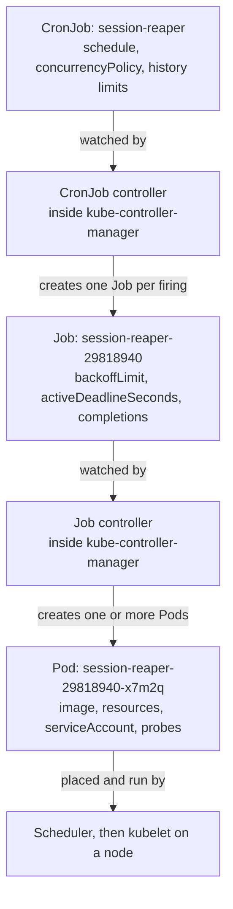

# A Primer on Kubernetes CronJobs

This doc builds the mental model everything else depends on. If you take one idea away, take
this one: **a CronJob does almost nothing.** It is a small object whose entire job is to create
*other* objects on a timetable. Nearly everything you think of as "CronJob behaviour" —
retries, timeouts, parallelism, pod placement — is not CronJob behaviour at all. It belongs to
the Job or the Pod underneath. Most confusing CronJob problems are really someone looking for a
knob on the wrong object.

## The problem CronJobs solve, and the naive approaches that fail

Riverbend needs to delete expired login sessions every five minutes. Three obvious approaches
exist before you reach for a CronJob, and it is worth seeing why each one disappoints, because
that tells you what the CronJob is actually buying you.

**Approach 1: a line in a server's crontab.** Someone SSHes into a machine and adds
`*/5 * * * * /usr/local/bin/session-reaper`. This works on day one. It fails on day 200 when
that machine is replaced during an OS upgrade and nobody remembers the crontab existed. The
schedule was not in version control, it was not part of any deployment, and its existence
depended on one host staying alive.

**Approach 2: a sleep loop inside the application.** You add a goroutine to the identity service
that wakes every five minutes and reaps sessions. Now it is in version control and it deploys
with the app. But the identity service runs **six replicas**, so the reaper now runs six times
every five minutes. You add leader election to fix that, and now you own a distributed-systems
component you did not set out to build. You also cannot change the schedule without a redeploy,
and you cannot run the reaper on demand without adding an endpoint for it.

**Approach 3: a long-running Deployment that sleeps between runs.** A one-replica Deployment
whose container sleeps 300 seconds and then does the work. This is closer, but the pod is
running (and consuming its memory request) 100% of the time to do 20 seconds of work per
five-minute cycle — roughly **6.7% duty cycle, 93.3% waste**. Worse, if the work crashes, the
container restarts and the timing drifts: the schedule is now "roughly every five minutes plus
however long the last failure took", not "at :00, :05, :10".

A CronJob fixes all three problems at once. The schedule lives in the API server (so it survives
any node), it is declared once regardless of how many replicas anything else has, and compute is
consumed only while work is happening. What it gives up in exchange is precision and
guarantees — and the rest of this collection is largely about that trade.

## The three-object chain

When a CronJob fires, three distinct objects exist, each created by a different controller, each
with its own spec and its own failure semantics.



Read that chain twice, because the ownership boundaries are exactly where the confusion lives:

- **The CronJob controller only decides *when* to create a Job.** It knows the schedule, the
  time zone, whether a previous run is still going, and how many finished Jobs to keep around.
  It has no idea whether your code succeeded. It does not retry anything.
- **The Job controller decides *whether the work is done*.** It creates pods, counts successes
  and failures, applies the retry budget, and enforces the wall-clock deadline. It has no idea
  there is a schedule.
- **The kubelet decides whether a container is healthy**, restarts it if the pod's
  `restartPolicy` says to, and kills it if it exceeds its memory limit.

So: "my CronJob retried four times" is imprecise. The Job retried, by creating replacement pods,
because its `backoffLimit` allowed it. "My CronJob timed out" is also imprecise — either the Job
hit `activeDeadlineSeconds`, or nothing timed out and it is still running.

Each object owns its own object in etcd, which matters for a later doc: one `session-reaper`
firing writes a Job object, at least one Pod object, and several Events. At 288 firings a day
that is real control-plane traffic. Doc 11 works out what 412 CronJobs cost.

## How the CronJob controller actually decides to fire

The controller runs a reconcile loop. Roughly, for each CronJob, on each pass:

1. Read `.status.lastScheduleTime` — the time of the most recent firing it knows about. If the
   CronJob has never fired, use its `creationTimestamp` instead.
2. Parse `.spec.schedule` and compute every scheduled time between that point and *now*.
3. If there are none, requeue and sleep until the next scheduled time. Done.
4. If there are several, that means firings were missed. Take **the most recent one only** —
   the controller never backfills. (What happens when there are *many* missed firings is a
   notorious trap; doc 01 covers it in detail.)
5. Check `.spec.startingDeadlineSeconds`. If the chosen firing time is already older than that
   deadline, skip it entirely rather than starting late.
6. Check `.spec.concurrencyPolicy` against the Jobs listed in `.status.active`. Depending on the
   policy, it may skip this firing, or delete the running Job first.
7. Create the Job, named deterministically from the CronJob name and the scheduled time.
8. Update `.status.lastScheduleTime` and emit a `SuccessfulCreate` event.

Two consequences of step 7 deserve emphasis now and get a full treatment in doc 05.

The Job's name is `<cronjob-name>-<scheduled-unix-time-in-minutes>`. For `session-reaper` firing
at 2026-09-11T14:20:00Z, whose Unix timestamp is 1789136400 seconds, that is 1789136400 / 60 =
29818940, so the Job is `session-reaper-29818940`. This is not cosmetic. **It is the deduplication
mechanism.** If the controller crashes between creating the Job and updating the status, the
next pass recomputes the same scheduled time, derives the same name, tries to create it, and
gets `AlreadyExists` from the API server — so the firing is not duplicated. The API server's
uniqueness constraint on names is doing the work that would otherwise need a distributed lock.

It also explains a hard naming limit. A Job name must be a valid DNS label (63 characters), and
the controller appends up to 11 characters, so **a CronJob name must be 52 characters or
fewer.** Exceed it and creation is rejected at admission time with a message about the generated
name being invalid — confusing, because your CronJob name looked legal.

### About the "checks roughly every minute" folklore

You will read that the controller polls every ten seconds, or checks once a minute. Both
statements described real implementations at different times: the original controller listed all
CronJobs every 10 seconds, and the current one (default since 1.21) is queue-driven and requeues
each CronJob for its next scheduled time. What you should take from this is behavioural, not
architectural: **firing is prompt but not instant, and you should not design anything that needs
sub-minute precision.** A firing typically lands within a couple of seconds of its scheduled
time on a healthy cluster, but a busy or degraded control plane can delay it, and there is no
SLO on it. If you need "exactly at 09:00:00.000", a CronJob is the wrong tool — see doc 11.

⚠️ One directly practical consequence: setting `startingDeadlineSeconds` below about 10 seconds
can cause firings to be dropped rather than run late, because the deadline can expire before the
controller next looks at the object. Treat 10 seconds as a floor, and prefer values in the tens
or hundreds of seconds.

## A complete manifest, field by field

Here is `session-reaper` as Riverbend actually runs it. Every field is annotated, and the ones
that need real explanation get their own doc.

```yaml
apiVersion: batch/v1
kind: CronJob
metadata:
  name: session-reaper            # <= 52 chars, because 11 get appended to the Job name
  namespace: identity
spec:
  # ---- Timing: owned by the CronJob controller. See doc 01. ----
  schedule: "*/5 * * * *"         # standard 5-field cron. No seconds field exists.
  timeZone: "Etc/UTC"             # GA in 1.27. If omitted, the controller's own zone is used.
  startingDeadlineSeconds: 200    # if we cannot start within 200s of the scheduled time, skip
                                  # this firing. Also bounds the missed-schedule count (doc 01).

  # ---- Overlap: owned by the CronJob controller. See doc 02. ----
  concurrencyPolicy: Forbid       # never two reapers at once. Allow is the default.

  # ---- Retention: owned by the CronJob controller. See doc 03. ----
  successfulJobsHistoryLimit: 3   # default 3. Keep 3 finished Jobs for inspection.
  failedJobsHistoryLimit: 3       # default 1. Raised, because failures are what you debug.

  suspend: false                  # true stops future firings without deleting anything (doc 09)

  jobTemplate:
    spec:
      # ---- Work definition: owned by the Job controller. See doc 03. ----
      backoffLimit: 2             # at most 3 attempts total: the first plus 2 retries
      activeDeadlineSeconds: 240  # hard wall-clock cap across all attempts. Job is failed at 240s.
      ttlSecondsAfterFinished: 3600   # the TTL controller deletes the Job 1h after it finishes
      completions: 1              # single unit of work (the default)
      parallelism: 1              # one pod at a time (the default)

      template:
        metadata:
          labels:
            app: session-reaper
        spec:
          # ---- Pod behaviour: owned by kubelet and the scheduler. ----
          restartPolicy: Never    # must be Never or OnFailure for Job pods. Never is preferred;
                                  # doc 03 explains why in terms of retained logs.
          serviceAccountName: session-reaper   # its own identity, not "default" (doc 07)
          terminationGracePeriodSeconds: 30    # time to finish in-flight work on SIGTERM
          containers:
            - name: reaper
              image: registry.riverbend.internal/identity/session-reaper@sha256:9f2c...  # digest-pinned (doc 07)
              args: ["--older-than=24h", "--batch-size=500"]
              env:
                - name: SCHEDULED_FOR          # the idempotency key. See doc 05.
                  valueFrom:
                    fieldRef:
                      fieldPath: metadata.annotations['batch.kubernetes.io/cronjob-scheduled-timestamp']
              resources:
                requests:
                  cpu: "100m"
                  memory: "128Mi"
                limits:
                  memory: "256Mi"              # memory limit yes, CPU limit deliberately absent (doc 06)
              securityContext:
                allowPrivilegeEscalation: false
                readOnlyRootFilesystem: true
                runAsNonRoot: true
                capabilities:
                  drop: ["ALL"]
```

That is roughly 40 lines to express "run this every five minutes", and every one of those lines
exists because of a failure mode documented later in this collection. Doc 10 turns this into a
reusable golden template with a tiering model, so that a low-stakes job does not need all of it.

Two field placements trip people up constantly, so note them now:

⚠️ **`ttlSecondsAfterFinished` goes on the Job spec, not the pod spec and not the CronJob spec.**
Put it in the wrong place and it is silently ignored as an unknown field in some tooling, or
rejected in others.

⚠️ **`restartPolicy` goes on the pod template and must be `Never` or `OnFailure`.** The default
`Always` is invalid for a Job and the manifest will be rejected. This is the single most common
first-time CronJob error.

## What the status tells you

The CronJob's status is small but load-bearing. Read it directly rather than guessing from pod
lists:

```bash
kubectl -n identity get cronjob session-reaper -o jsonpath='{.status}' | jq
```

```json
{
  "active": [
    { "apiVersion": "batch/v1", "kind": "Job", "name": "session-reaper-29818940",
      "namespace": "identity", "uid": "3f0e..." }
  ],
  "lastScheduleTime": "2026-09-11T14:20:00Z",
  "lastSuccessfulTime": "2026-09-11T14:15:23Z"
}
```

- **`active`** — Jobs the controller believes are still running. This is what `concurrencyPolicy`
  is evaluated against, which makes it important out of proportion to its size (doc 02).
- **`lastScheduleTime`** — when it last *created a Job*. This says nothing about success.
- **`lastSuccessfulTime`** — when a Job it created last *completed successfully*. This is the
  field your alerting should be built on, and doc 08 builds exactly that alert.

The gap between those last two fields is the single most informative number about a CronJob's
health. `lastScheduleTime` advancing while `lastSuccessfulTime` stands still means the schedule
is fine and the work is broken. Both standing still means the schedule is broken. Doc 09 turns
that observation into a triage table.

The default `kubectl get` output is a compressed view of the same thing:

```bash
kubectl -n identity get cronjob session-reaper
# NAME             SCHEDULE      TIMEZONE   SUSPEND   ACTIVE   LAST SCHEDULE   AGE
# session-reaper   */5 * * * *   Etc/UTC    False     1        42s             84d
```

⚠️ There is no "healthy" column, and there never will be, because the CronJob controller does
not know. A CronJob that has failed every run for three weeks looks identical here to one that
has never failed. That absence is the reason doc 08 exists.

## Events worth knowing by name

`kubectl -n $NS describe cronjob $CJ` ends with events emitted by the controller. Their names are
precise and worth recognising on sight:

| Event | Meaning |
|---|---|
| `SuccessfulCreate` | A Job was created for a firing. The normal case. |
| `FailedCreate` | The controller tried to create the Job and the API server refused — quota exhausted, an admission webhook rejected it, the namespace is terminating. The schedule is working; creation is not. |
| `JobAlreadyActive` | `concurrencyPolicy: Forbid` skipped this firing because the previous Job is still running. |
| `SawCompletedJob` | A Job it owns finished; the controller is updating status and applying history limits. |
| `MissingJob` | A Job listed in `.status.active` no longer exists — someone or something deleted it out from under the controller. |
| `UnexpectedJob` | A Job exists that claims this CronJob as owner but the controller did not expect it. |
| `TooManyMissedTimes` | The controller gave up counting missed firings. **This CronJob has stopped scheduling and will not restart on its own.** The most dangerous event in the list; doc 01 explains exactly how it happens and doc 04 has the recovery procedure. |

## When a CronJob is the wrong choice

Worth saying early, because the rest of this collection is a long argument for using them
carefully:

- **You need sub-minute precision or sub-minute intervals.** The schedule field has no seconds
  and the controller has no latency guarantee. Use an in-process ticker.
- **Your work has steps with dependencies** — extract, then transform, then publish, with
  retries per step and a re-run of just step 3 after a fix. That is a workflow, not a schedule.
  Argo Workflows or Temporal, per doc 11.
- **A missed run is unacceptable and must be backfilled automatically.** CronJobs deliberately
  do not backfill. You would be reimplementing that on top, badly.
- **The trigger is an event, not a time** — "when a file lands in the bucket" is not a schedule
  even if you can approximate it by polling every minute. Doc 11 covers the polling-CronJob
  anti-pattern and what to do instead.

## What to take away

1. A CronJob creates Jobs. A Job creates Pods. Three objects, three controllers, three separate
   sets of knobs — and looking for a knob on the wrong object is the most common source of
   confusion.
2. The CronJob controller decides *when*; the Job controller decides *whether the work
   completed*; the kubelet decides *whether the container lives*. Retries and timeouts are Job
   concerns, not CronJob concerns.
3. Job names are derived deterministically from the scheduled time. That is what prevents
   duplicate firings, and it is why CronJob names must be 52 characters or fewer.
4. Firing is prompt but has no latency guarantee. Do not design for sub-minute precision, and do
   not set `startingDeadlineSeconds` below ~10 seconds.
5. `lastScheduleTime` tells you the schedule is working. `lastSuccessfulTime` tells you the work
   is working. Alert on the second one.
6. Nothing in the CronJob object or in `kubectl get` will ever tell you a CronJob is unhealthy.
   You have to build that yourself — doc 08.
