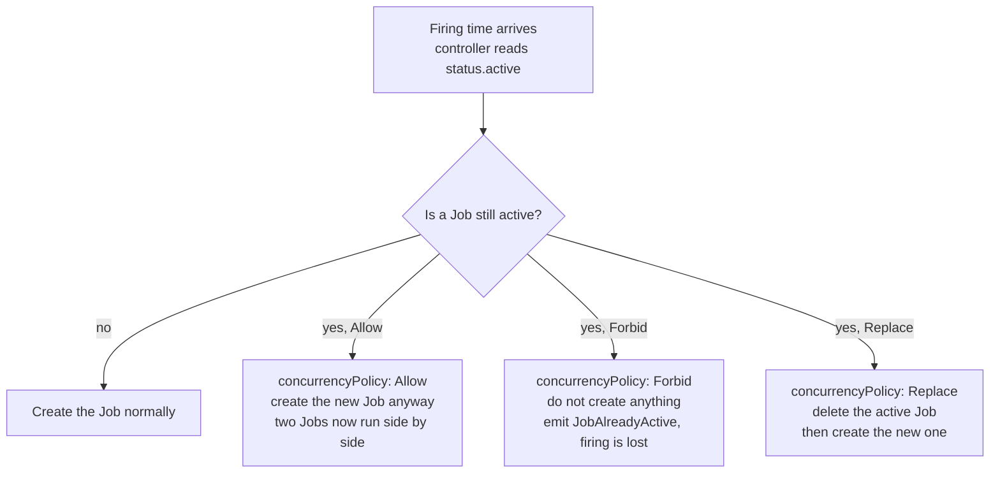

# Concurrency, Overlap, and Mutual Exclusion

`concurrencyPolicy` is one field with three values, and choosing the wrong one is how scheduled
work either double-processes data or silently stops running. This doc explains what each value
actually does to the objects involved, why the default is the riskiest choice for most real
work, and why even the right policy is not a lock.

## Why overlap happens at all

If a job takes 7 minutes and runs hourly, overlap seems impossible. Riverbend thought so too.
Three mechanisms produce it anyway:

**1. The runtime distribution has a tail.** `invoice-rollup` aggregates the previous hour's
orders. Measured over a month, its duration is 7 minutes at the median and 34 minutes at the
99th percentile — the tail is driven by order volume, so it is worst exactly when the business
is busiest. On the Friday of a promotion, a run took **70 minutes**. The schedule fires hourly.
The 15:10 run was still going when the 16:10 firing arrived.

Note what the ratio tells you. Typical utilisation is 7/60 ≈ 11.7% of the interval, which feels
enormously safe. At p99 it is 34/60 ≈ 57%. The distance between "feels safe" and "overlaps" is
one bad day, and it is the *tail* that decides, not the median.

**2. A late start compresses the gap.** A firing delayed by the control plane, or by pods waiting
on autoscaler capacity, starts late but the next firing is still on schedule. A 20-minute late
start turns a 40-minute budget into 40 minutes of work in 40 minutes of space.

**3. Retries extend the Job, not just the pod.** A Job with `backoffLimit: 6` that fails at
minute 9 and retries is still *active* while it backs off and runs again. Total Job duration can
be several times the duration of a single successful attempt. Doc 03 works out the arithmetic.

So the question is not "can my job overlap?" — assume yes — but "what should happen when it
does?"

## The three policies, mechanically



Everything hinges on `.status.active`, the list of Jobs the CronJob controller believes are still
running. That list is the controller's entire notion of "is something already going", which is
why doc 04 spends time on what happens when the list is wrong.

### `Allow` — the default, and usually wrong

No check is performed. The new Job is created and both run. Two pods, two connections to the
database, two attempts to write the same rows.

This is the default, which means every CronJob written without thinking about the field has it.
`Allow` is correct in exactly one situation: **the work is genuinely safe to run concurrently
with itself.** That is a strong claim. It requires that two simultaneous instances do not
conflict on any shared resource, do not both claim the same work items, and that duplicate
writes are harmless.

`session-reaper` qualifies — deleting an already-deleted session is a no-op, and two reapers
racing on the same batch means one deletes 500 rows and the other deletes 0. `invoice-rollup`
emphatically does not: two instances reading the same hour of orders and appending invoice lines
produces **double-billed customers**, and Riverbend found out from a customer-support ticket
rather than from a monitor.

The useful test before leaving `Allow` in place: *if I ran this job twice right now by hand, on
purpose, would I be comfortable?* If the answer needs a paragraph of qualification, do not use
`Allow`.

### `Forbid` — skip the firing

If any Job is active, the controller creates nothing, emits a `JobAlreadyActive` event, and
waits for the next firing.

This is the right default for most non-idempotent work, and it has two properties people
consistently get wrong.

⚠️ **`Forbid` skips; it does not queue.** There is no backlog. If `invoice-rollup` takes 70
minutes, the 16:10 firing is not deferred to 17:20 — it is **discarded**, and the next attempt
is the 17:10 firing. You did not get a late rollup for hour 15; you got no rollup for hour 15.
For work that processes a specific time window, that is data loss, not a delay, and the job
itself needs to notice and catch up — doc 05's watermark pattern is the answer.

⚠️ **`Forbid` plus a job that hangs forever means the CronJob never runs again.** This is the
scenario that scares me most about scheduled work, because every layer of it looks healthy. The
Job is `active`, so Kubernetes is content. The pod is `Running`, so the kubelet is content. The
CronJob is not suspended and its schedule is valid, so `kubectl get cronjob` looks normal. And
every subsequent firing is skipped, forever, with only a Normal-severity event to show for it.
Riverbend hit this when `invoice-rollup` blocked on a Postgres lock held by a stuck migration:
the job sat there for 31 hours and 31 hourly rollups were skipped.

There are two defences and you want both:

1. **`activeDeadlineSeconds` on every job using `Forbid`.** This is not optional. It converts
   "hangs forever" into "fails after N seconds", which frees the next firing and produces a
   failure your alerting can see. Doc 03 covers how to size it.
2. **Alert on `lastSuccessfulTime` staleness**, not on failures. A skipped firing is not a
   failure; nothing fails, so a failure-based alert stays silent. Doc 08 builds the staleness
   alert, and this scenario is its main justification.

There is a subtler consequence of a long stall worth checking on your own cluster. In the current
controller, `.status.lastScheduleTime` is updated when a Job is actually *created*, so a `Forbid`
skip appears not to advance it. If that holds on your version, skipped firings keep accumulating
in the missed-schedule count from doc 01 — which means a job hung long enough can also hit the
100-missed wall and stay stopped even after you kill the hung Job. Verify it on your version
before you rely on either behaviour: suspend nothing, deliberately hang a test job with
`sleep 7200`, and watch whether the `LAST SCHEDULE` column advances while firings are skipped.
Either way, the remedy is the same and already recommended: set both `activeDeadlineSeconds` and
`startingDeadlineSeconds`.

### `Replace` — kill the old run, start the new one

The controller deletes the active Job and creates the new one. Deleting the Job cascades to its
pods, so the running pod receives SIGTERM and then SIGKILL after
`terminationGracePeriodSeconds`.

`Replace` is right when **only the latest result matters and a partial run costs nothing.**
`catalog-reindex` is the canonical fit: it rebuilds a search index from scratch, so an
interrupted rebuild produces nothing of value, and a rebuild that started 90 minutes ago is
strictly less useful than one starting now with fresher data. Throwing the old one away is
exactly what you want.

Three cautions:

⚠️ **`Replace` does not eliminate overlap; it shortens it.** Deletion is asynchronous. The
controller issues the delete and creates the replacement, but the old pod still has its
termination grace period to finish — 30 seconds by default, and however long you configured if
the job does cleanup. During that window **both pods exist and both may be writing.** If your
work cannot tolerate even a few seconds of overlap, `Replace` is not sufficient; you need a
real lock (below).

⚠️ **Your work must be interruptible.** `Replace` means your pod can be killed at any moment,
mid-transaction. That is a design constraint on the code, not just a config choice. If the job
writes incrementally without transactions, `Replace` will eventually leave half-written state.
Either wrap the work in a transaction that commits atomically, write to a staging location and
swap at the end, or do not use `Replace`.

⚠️ **Handle SIGTERM, or the grace period is dead time.** A process that ignores SIGTERM runs
until SIGKILL at the end of the grace period. It gets no chance to release locks, flush, or mark
the run aborted in your ledger — so the *next* run starts by cleaning up a mess.

### Choosing, for the running example

| CronJob | Policy | Reasoning |
|---|---|---|
| `session-reaper` | `Forbid` | Genuinely idempotent, so `Allow` would be safe — but `Forbid` costs nothing here and prevents a pile-up if the database slows down and 20-second runs become 6-minute runs. Defaulting to `Forbid` and justifying exceptions is a better habit than the reverse. |
| `invoice-rollup` | `Forbid` + `activeDeadlineSeconds: 2700` | Double-running double-bills. The deadline is mandatory, not decorative — without it a hang stops all future rollups. |
| `payout-settlement` | `Forbid` + `activeDeadlineSeconds: 5400` + an application-level lock | Moves money. `Forbid` is necessary but not sufficient; see the locking section. |
| `catalog-reindex` | `Replace` | Only the newest index matters, and it writes to a staging index then swaps aliases, so interruption is clean. |
| `partner-sftp-export` | `Forbid` | The partner rejects duplicate files for the same day, and two concurrent uploads to the same SFTP path corrupt each other. |
| `db-vacuum` | `Forbid` | Two vacuums would fight for I/O and make everything worse. |

Notice that five of six are `Forbid`. That is representative: **`Forbid` with a deadline is the
right default, and `Allow` should require a written justification.**

## Detecting overlap risk before it bites

You do not need to wait for an incident. The signal is the ratio of run duration to schedule
interval, and it is available from metrics.

Job duration is not exported directly, but it is derivable from the Job's start and completion
timestamps, which kube-state-metrics exposes:

```promql
# Duration in seconds of each completed Job, by owning CronJob.
(
  kube_job_status_completion_time - kube_job_status_start_time
)
* on(job_name, namespace) group_left(owner_name)
  kube_job_owner{owner_kind="CronJob"}
```

Graph that per CronJob against the interval and watch the headroom shrink over months as data
volume grows. The threshold worth alerting on is well before 100%:

> Alert when the p95 run duration exceeds **50% of the schedule interval.** At 50% you still
> have a full run's worth of slack for a bad day; past 50% a single slow run causes a skip (under
> `Forbid`) or an overlap (under `Allow`). Treat crossing 50% as a capacity signal — either the
> job needs to get faster or the schedule needs to get sparser.

`invoice-rollup` at p99 = 34 minutes on a 60-minute interval was already at 57% and therefore
already broken; the 70-minute run was the confirmation, not the cause.

For direct evidence of current overlap, count active Jobs per CronJob:

```promql
# More than one active Job for the same CronJob = overlap happening right now.
sum by (owner_name, namespace) (
  kube_job_status_active
  * on(job_name, namespace) group_left(owner_name)
    kube_job_owner{owner_kind="CronJob"}
) > 1
```

And to see skips, count the events:

```bash
kubectl -n billing get events --field-selector reason=JobAlreadyActive \
  --sort-by=.lastTimestamp | tail -20
```

⚠️ Events expire (one hour by default), so this is a live-debugging tool, not a history. If you
care about skip counts over time — and for `Forbid` jobs you should, because skips are invisible
otherwise — export events into your logging system, or have the job itself record every run in a
ledger table (doc 05) so gaps are queryable in SQL.

## When the policy is not enough: real mutual exclusion

`concurrencyPolicy` protects against exactly one thing: **the same CronJob object in the same
cluster firing again while its own previous Job is active.** Everything else is out of scope,
and for `payout-settlement`, everything else is the risk:

- **A human runs it manually.** `kubectl create job --from=cronjob/payout-settlement manual-fix`
  creates a Job with no owner reference to the CronJob. It is not in `.status.active`, so
  `Forbid` does not see it, and it runs happily alongside the scheduled run. This is not a
  hypothetical — manual triggering during an incident is exactly when someone does it, and
  exactly when the scheduled run is also about to fire.
- **Two clusters.** A warm standby or an active/active region with the same GitOps repo applied
  means two CronJob objects on two control planes. Neither knows about the other. Riverbend's DR
  cluster was intended to be passive, but the CronJobs were not suspended there.
- **Staging pointed at the wrong database.** A misconfigured non-production environment running
  the same job against the production database. No amount of `concurrencyPolicy` helps.
- **A stale `.status.active` list.** If a Job is force-deleted, or the controller's view drifts,
  `Forbid` can be evaluated against an empty list while a pod is still running.

For anything where a second concurrent execution is a correctness or money problem, the mutual
exclusion has to live **where the shared state lives**, which usually means in the database the
job writes to. Three workable patterns:

**1. A database advisory lock (best, when there is one database).** In Postgres:

```sql
-- Returns immediately: true if we got the lock, false if someone else holds it.
SELECT pg_try_advisory_lock(hashtext('payout-settlement'));
```

The lock is held by the session and released automatically when the connection dies — including
when the pod is SIGKILLed, which is the property that makes it safe. No lease renewal, no
expiry tuning, no split brain. If it returns false, log clearly and exit 0 (a skip, not a
failure) or exit non-zero if a skip should page someone.

**2. A Kubernetes Lease.** If there is no shared database, `coordination.k8s.io/v1` Lease objects
give you the same primitive using the API server you already have:

```yaml
apiVersion: coordination.k8s.io/v1
kind: Lease
metadata:
  name: payout-settlement-lock
  namespace: billing
spec:
  holderIdentity: payout-settlement-29818940-x7m2q   # the pod name
  leaseDurationSeconds: 120
  acquireTime: "2026-09-11T02:00:04.000000Z"
  renewTime: "2026-09-11T02:00:04.000000Z"
```

The job creates or takes over the Lease at start, renews it every 30 seconds while working, and
deletes it at the end. A stale Lease whose `renewTime` is older than `leaseDurationSeconds` can
be taken over. This works across clusters **only if they share an API server**, which they do
not — so a Lease solves the manual-trigger and stale-status cases, not the two-cluster case.
Note that it needs RBAC on leases in that namespace (doc 07) and it means your job code now
talks to the Kubernetes API, which is a dependency you should be deliberate about.

**3. A conditional write on the work itself (best of all, when possible).** Instead of locking,
make the first write claim the work:

```sql
-- Only one runner can succeed for a given period; the unique constraint decides.
INSERT INTO settlement_runs (period, status, started_at, runner)
VALUES ('2026-09-11', 'running', now(), $1);
-- 23505 unique_violation => someone else owns this period. Exit.
```

This is not a lock at all — it is idempotency, and it removes the need for mutual exclusion by
making a second run a no-op rather than a hazard. It is the most robust of the three because it
does not depend on liveness detection, lease timing, or anything noticing a crash. Doc 05 builds
this out properly, and it is the pattern to reach for first.

⚠️ Do not use a plain Redis `SETNX` lock for money movement without a fencing token. A pod that
loses its lock through expiry (because it was paused, or the network partitioned) and keeps
working is the classic distributed-locking failure, and the consequence here is paying a seller
twice. If the state you are protecting cannot check a fencing token, use pattern 1 or 3.

## What to take away

1. Assume your job will overlap. The tail of the runtime distribution, late starts, and retries
   all produce it, and the median duration tells you nothing about the risk.
2. `Allow` is the default and is safe only for work you would happily run twice by hand right
   now. Make `Forbid` your default and require a justification for `Allow`.
3. `Forbid` **skips, it does not queue.** For window-based work a skip is missing data, and the
   job itself must be able to catch up.
4. `Forbid` without `activeDeadlineSeconds` is a trap: one hung run stops every future run
   indefinitely, with no failure and no obvious symptom. Always set both.
5. `Replace` shortens overlap rather than removing it, because deletion is asynchronous — and it
   requires the work to be genuinely interruptible.
6. Watch p95 duration against the schedule interval and treat 50% as the action threshold.
7. `concurrencyPolicy` only guards one CronJob against its own previous Job in one cluster. It
   does not stop manual runs, a second cluster, or a stale status. Where concurrency is a
   correctness problem, enforce exclusion at the data — ideally by making the work claim itself
   idempotently.
