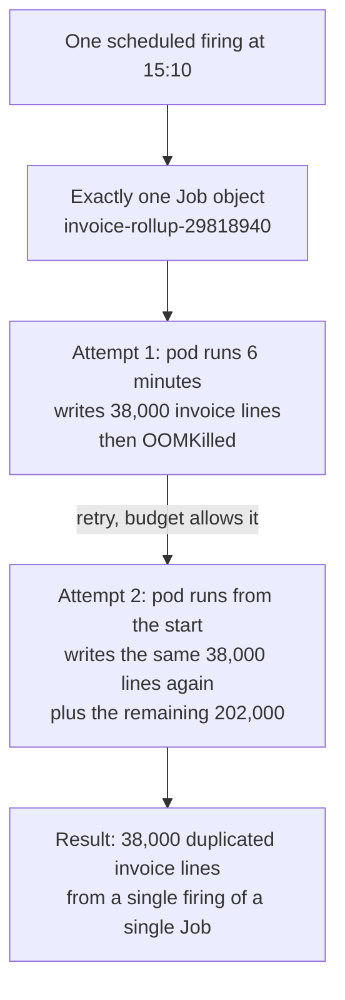

# Idempotency, Catch-Up, and Data Correctness

The previous docs were about Kubernetes objects. This one is about your code, and it is the most
important doc in the collection — because every configuration knob so far reduces the
*probability* of a duplicate or a gap, and only your code can make them *harmless*.

The core claim, stated plainly up front: **Kubernetes gives scheduled work at-least-once
execution, never exactly-once. If a duplicate run would be a problem, that is a bug in your job,
not a missing Kubernetes feature.**

## Why exactly-once does not exist here

It is worth being precise about what Kubernetes *does* guarantee, because it guarantees something
real and people then over-extend it.

Recall from doc 00 that a Job's name is derived from the scheduled time:
`invoice-rollup-29818940`. If the controller crashes after creating that Job but before recording
it in status, the next reconcile recomputes the same scheduled time, derives the same name, and
gets `AlreadyExists`. So:

> **Guaranteed:** at most one Job object per (CronJob, scheduled time).

That is genuinely useful. It is also much weaker than "your work happens once", because the Job
is a container for attempts, and everything below the Job multiplies:



One firing. One Job. One duplicate-billing incident. Nothing malfunctioned: the Job controller
retried exactly as configured, and the retry is the feature.

Every additional duplication path from doc 02 sits on top of this one:

| Path | Duplication happens because |
|---|---|
| **Retry after partial work** (above) | The attempt died after writing some of its output |
| **OOMKill or preemption mid-write** | Same shape, different killer |
| **`concurrencyPolicy: Allow`** | Two Jobs from two firings run at once |
| **`Replace` during the grace period** | The old pod is still writing while the new one starts |
| **A manual `kubectl create job --from=...`** | Not in `.status.active`, so `Forbid` cannot see it |
| **A second cluster** | Two control planes, neither aware of the other |

Six independent paths. You cannot close all of them with configuration, and you do not need to
if the work is idempotent — which converts all six from incidents into wasted CPU.

## Pattern 1: make the operation naturally idempotent

The best case needs no machinery at all. Some operations are idempotent by their nature: they
describe a desired end state rather than a change.

`session-reaper` is the example. "Delete sessions whose `expires_at` is in the past" can run any
number of times concurrently and the result is identical:

```sql
DELETE FROM sessions WHERE expires_at < now() LIMIT 500;
```

The test for this category: **does the operation say "make it so" or "do this again"?**
`DELETE WHERE expired` is the first. `INSERT a row`, `send an email`, `increment a counter`,
`append to a file`, `transfer money` are all the second.

Where you have a choice, choose the first form. Concretely, prefer:

- `UPSERT` / `INSERT ... ON CONFLICT DO UPDATE` over `INSERT`
- `SET status = 'processed'` over `status = status + 1`
- "write the full file and rename" over "append a line"
- `PUT` with a deterministic object key over `POST` to a collection

This is not always available. When it is, it removes an entire class of problem for free.

## Pattern 2: an idempotency key derived from the schedule

When the work genuinely creates something, you need a key that is **the same across retries of
the same logical run and different across runs**. Wall-clock time inside the container is exactly
wrong for this: retry 2 starts at a different instant, so `now()` produces a different key and
the duplicate sails through.

The right key is the **scheduled firing time**, which is constant across every attempt of a Job.
Kubernetes hands it to you in an annotation on the Job (1.28+), and you can plumb it into the pod
with a field reference:

```yaml
jobTemplate:
  spec:
    template:
      spec:
        containers:
          - name: rollup
            env:
              - name: SCHEDULED_FOR        # e.g. "2026-09-11T15:10:00Z"
                valueFrom:
                  fieldRef:
                    fieldPath: metadata.annotations['batch.kubernetes.io/cronjob-scheduled-timestamp']
```

⚠️ Two practical cautions. The annotation is on the **Job**, and a `fieldRef` in the pod template
reads the **pod's** annotations — pods created by a Job do not automatically inherit the Job's
annotations, so verify on your cluster that `SCHEDULED_FOR` is actually populated rather than
empty:

```bash
kubectl -n billing create job probe --from=cronjob/invoice-rollup
kubectl -n billing logs job/probe | head -3     # have the container print SCHEDULED_FOR
```

If it comes back empty (or you are on a cluster older than 1.28), the robust fallback is to copy
the annotation onto the pod template explicitly, or to derive the key from the Job name, which
*is* available and *is* derived from the scheduled time:

```yaml
              - name: JOB_NAME            # "invoice-rollup-29818940"
                valueFrom:
                  fieldRef:
                    fieldPath: metadata.labels['batch.kubernetes.io/job-name']
```

The job name is a perfectly good idempotency key: it is stable across every attempt of that Job
and unique per firing. Use `SCHEDULED_FOR` when you need the *semantic* window (to compute which
hour to process) and `JOB_NAME` when you only need a deduplication token.

With a key in hand, the database enforces uniqueness for you:

```sql
-- The unique constraint, not the application, is what guarantees no duplicates.
CREATE TABLE invoice_lines (
  id            bigserial PRIMARY KEY,
  order_id      bigint      NOT NULL,
  amount_cents  bigint      NOT NULL,
  run_key       text        NOT NULL,          -- the scheduled firing this line came from
  UNIQUE (order_id, run_key)
);

INSERT INTO invoice_lines (order_id, amount_cents, run_key)
VALUES ($1, $2, $3)
ON CONFLICT (order_id, run_key) DO NOTHING;     -- attempt 2 re-writes are absorbed
```

Now walk the failure again: attempt 1 writes 38,000 lines with `run_key =
'2026-09-11T15:10:00Z'` and dies. Attempt 2 starts from the beginning with the *same* key; the
first 38,000 inserts hit the conflict clause and do nothing; the remaining 202,000 are written
once. Total: 240,000 lines, correct, from a job that crashed halfway. **The retry became free.**

## Pattern 3: a run ledger

The idempotency key solves correctness. A **ledger** — one row per attempted run — solves
observability, and it is the thing that lets you answer the question that Kubernetes cannot:
*which runs are missing?*

```sql
CREATE TABLE job_runs (
  job_name     text        NOT NULL,            -- 'invoice-rollup'
  run_key      text        NOT NULL,            -- scheduled time, the idempotency key
  attempt_id   text        NOT NULL,            -- pod name, so attempts are distinguishable
  status       text        NOT NULL,            -- claimed | succeeded | failed | aborted
  started_at   timestamptz NOT NULL DEFAULT now(),
  finished_at  timestamptz,
  rows_written bigint,
  error        text,
  PRIMARY KEY (job_name, run_key)                -- one winner per scheduled firing
);
```

The primary key is doing real work. The job's first action is to claim its run:

```sql
INSERT INTO job_runs (job_name, run_key, attempt_id, status)
VALUES ('invoice-rollup', $SCHEDULED_FOR, $POD_NAME, 'claimed')
ON CONFLICT (job_name, run_key) DO UPDATE
  SET attempt_id = $POD_NAME, started_at = now()
  WHERE job_runs.status IN ('failed', 'aborted');   -- a retry may take over a failed run
-- Zero rows affected => someone else owns this run. Log and exit 0.
```

That single statement is simultaneously the idempotency check *and* the mutual exclusion from doc
02 — with no lock, no lease, and no liveness detection, because the database's uniqueness
constraint is the arbiter. This is why doc 02 called it the most robust of the three exclusion
options.

On success the job writes `status='succeeded'`, `finished_at`, and `rows_written`. On a handled
error, `status='failed'` with the message. On SIGTERM, `status='aborted'`.

What the ledger buys you:

- **Gap detection in one query** — the F-16 answer:
  ```sql
  -- Which hourly firings in the last 3 days have no successful run?
  SELECT g AS missing_run
  FROM generate_series(now() - interval '3 days', now(), interval '1 hour') g
  WHERE NOT EXISTS (
    SELECT 1 FROM job_runs
    WHERE job_name = 'invoice-rollup'
      AND status = 'succeeded'
      AND run_key = to_char(g, 'YYYY-MM-DD"T"HH24:10:00"Z"')
  );
  ```
- **History that outlives the objects.** Jobs and pods are deleted by TTL within hours; the ledger
  is as durable as your database.
- **An outcome signal, not an exit code.** `rows_written = 0` on a job that should write thousands
  is the F-13 silent-failure detector.
- **Duplicate evidence.** Two attempt IDs against one run key tells you a retry happened, which is
  exactly what you want to know after an incident.

The cost is a table and about 20 lines of code per job, ideally in a shared library. For anything
whose failure matters, it pays for itself the first time.

## Pattern 4: watermarks, so a skipped firing heals itself

Docs 01 and 02 established that skipped firings are never backfilled. The fix is to stop deriving
the work window from the clock.

**The fragile version** — and the one almost everyone writes first:

```sql
-- Process "the previous hour", relative to when this pod happens to be running.
SELECT * FROM orders
WHERE created_at >= date_trunc('hour', now()) - interval '1 hour'
  AND created_at <  date_trunc('hour', now());
```

Skip the 15:10 firing and hour 14 is never processed by anyone. Run late, at 15:58, and you
process hour 14 correctly — but run late enough to cross into 16:00 and you process hour 15 while
hour 14 is silently abandoned.

**The self-healing version** — derive the window from the last successful watermark:

```sql
-- 1. Where did we get to?
SELECT coalesce(max(watermark), '2026-01-01') FROM job_runs
WHERE job_name = 'invoice-rollup' AND status = 'succeeded';
-- 2. Process everything from there up to a safe ceiling.
SELECT * FROM orders
WHERE created_at >= $watermark
  AND created_at <  now() - interval '5 minutes'    -- the late-arrival buffer, below
ORDER BY created_at;
-- 3. On success, record the new watermark in the same transaction as the output.
```

Now skip three firings and the fourth processes four hours of orders. A gap becomes a slow run
instead of missing data, and the system needs no operator intervention. This is the single highest
-leverage change you can make to window-based scheduled work.

Two details that matter in practice:

⚠️ **The late-arrival buffer.** If you process right up to `now()`, you will miss rows that were
in flight — inserted by a transaction that began before your query and committed after it. Such a
row has a `created_at` inside your window but was invisible when you looked, and because the
watermark has now moved past it, **it is never processed by any run.** Stopping five minutes short
of `now()` gives in-flight transactions time to land. Size the buffer from your longest write
transaction, and note the trade: a bigger buffer is safer and makes your data later.

⚠️ **Advance the watermark in the same transaction as the output.** If you commit the invoice lines
and then crash before writing the watermark, the next run reprocesses — which is fine if you also
have pattern 2's idempotency key, and a duplicate-billing incident if you do not. If the output
lives in a different system from the watermark (a warehouse, an object store), you have a
dual-write problem: write output first, watermark second, and rely on idempotency to make the
overlap harmless. Never watermark first.

## Pattern 5: checkpointing long jobs

`db-vacuum` runs two hours. `catalog-reindex` ran 110 minutes before sharding. On spot capacity or
during a node rotation, these get killed partway through, and restarting from zero means they may
never finish inside their deadline — three interruptions in a two-hour job with a 2.5-hour
deadline is a job that never completes at all.

Checkpointing changes restart cost from "the whole run" to "since the last checkpoint":

```python
# Process in ordered chunks, recording progress after each one.
CHUNK = 5_000
while True:
    cursor = load_checkpoint(run_key)          # from job_runs.checkpoint, or a small table
    rows = fetch_products(after_id=cursor, limit=CHUNK)
    if not rows:
        break
    with transaction():
        write_index_entries(rows)              # idempotent upserts, pattern 1
        save_checkpoint(run_key, rows[-1].id)  # same transaction as the work
```

Three requirements make this correct, and they are easy to get subtly wrong:

1. **A total order on the work** (an increasing id, a sorted key range) so "after the cursor" is
   well defined. Ordering by a mutable column silently skips or repeats rows.
2. **The checkpoint commits atomically with the work it describes.** Separate commits reintroduce
   the exact problem you are solving.
3. **The chunk is itself idempotent**, because the last chunk before a kill may have committed
   the work and not the checkpoint, or you may be resuming a chunk that partly ran.

The chunk size is a tuning decision: smaller chunks mean less lost work on a kill and more
transaction overhead. 5,000 rows for a two-hour job means at most a few seconds of lost progress,
which is a good place to be.

## Pattern 6: staging plus atomic swap

Sometimes the cleanest idempotency is to make the output invisible until it is complete.
`catalog-reindex` does this: it builds `products_v47` from scratch, and only when the build
finishes does it repoint the `products` alias. Failure halfway leaves a garbage index that nobody
reads and the next run overwrites. There is no partial-output state at all.

The same shape works for files (write `report.csv.tmp`, then rename — atomic within a filesystem),
for object storage (write to a new key, then update a pointer object), and for tables (build into
`invoice_lines_new`, then swap in a transaction).

This is the best available answer when the work is a *bulk rebuild* rather than an incremental
update, because it makes partial failure structurally impossible rather than merely handled.

## External side effects you cannot take back

Databases you control. Emails, webhooks, payments, and files pushed to a partner's SFTP server you
do not — there is no `ON CONFLICT DO NOTHING` for an email you already sent.

For these, the pattern is to push the idempotency down into the provider, which the good ones
support explicitly:

```python
# The provider deduplicates on the key: a retry with the same key returns the ORIGINAL result
# instead of creating a second transfer. The key must be stable across attempts — so derive it
# from the run key and the seller, never from a timestamp or a UUID generated in this process.
idempotency_key = f"payout:{run_key}:{seller_id}"
provider.transfers.create(
    amount=amount_cents, destination=seller_account,
    idempotency_key=idempotency_key,
)
```

For `payout-settlement` moving $4.2M to 18,000 sellers, this is the mechanism that makes a retry
after a crash at seller 9,000 safe: the first 9,000 keys are recognised and return their original
transfers; the remaining 9,000 execute. Without it, a single OOM turns into 9,000 double payments,
and no amount of `concurrencyPolicy` would have prevented it.

Where the provider offers no idempotency (a plain SMTP send, a partner's `POST` endpoint), record
your intent **before** the call and the result **after**, and make the ledger the arbiter:

```sql
-- Before: claim the specific side effect.
INSERT INTO sent_notifications (run_key, recipient, status)
VALUES ($1, $2, 'sending') ON CONFLICT DO NOTHING;   -- 0 rows => already handled, skip
-- After the send succeeds:
UPDATE sent_notifications SET status='sent', sent_at=now() WHERE run_key=$1 AND recipient=$2;
```

This leaves one irreducible window: a crash between the send and the update means you cannot tell
whether it went out. You must choose which risk you prefer — a possible duplicate (retry) or a
possible omission (skip) — and write that choice down next to the code. There is no configuration
that removes this window; it is inherent to a non-transactional side effect. Choosing
deliberately, per job, is the whole of the engineering here: for a marketing email, skip; for a
payment confirmation, retry and accept a possible duplicate.

For internal fan-out, the **outbox pattern** removes the window properly: write the intent to an
outbox table in the same transaction as the business change, and have a separate (idempotent)
process deliver from the outbox. The scheduled job's transaction becomes purely local, and
delivery becomes a retryable at-least-once problem against a durable record.

## Backfilling deliberately

Eventually you will need to run a past window on purpose: a bug is fixed and hours 03:00–07:00
need reprocessing.

**Do not** rely on `kubectl create job --from=cronjob/invoice-rollup backfill-0300`. That copies
the template exactly, including the code path that computes "the current window", so it processes
now, not 03:00. Two better options:

**Option A — parameterise the job.** Design it to accept an explicit window, defaulting to the
watermark when not given:

```bash
kubectl -n billing create job backfill-20260911-03 \
  --from=cronjob/invoice-rollup --dry-run=client -o yaml \
  | yq '.spec.template.spec.containers[0].args = ["--from=2026-09-11T03:00:00Z","--to=2026-09-11T07:00:00Z","--run-key=backfill-20260911-03"]' \
  | kubectl apply -f -
```

Note the distinct `--run-key`. If you reuse the original run key, pattern 2's uniqueness
constraint will correctly reject every write and the backfill will do nothing while appearing to
succeed — a confusing 20 minutes that several people have lived through. Use a distinct key and
have the job delete-then-rewrite the window inside a transaction, or make the key part of the
conflict target so the rewrite replaces rather than skips.

**Option B — move the watermark back.** For a watermark-driven job (pattern 4), rewinding the
watermark and waiting for the next firing is often the safest backfill, because the code path is
exactly the normal one. It is slower and it is much harder to get wrong.

⚠️ Whichever you choose, remember the backfill Job has **no owner reference** to the CronJob, so
`Forbid` does not see it (F-15) and history limits will never clean it up. Suspend the CronJob for
the duration if concurrent execution is unsafe, and delete the backfill Job yourself when you are
done.

## Testing that any of this works

Idempotency claims are worth exactly as much as their tests, and there is a simple one that
catches most mistakes.

**The two-run test.** In staging, with a seeded database: snapshot state, run the job to
completion, snapshot again, run the job a *second* time with the same run key, snapshot a third
time. Assert snapshot 2 equals snapshot 3. Anything that differs is a non-idempotent write.

**The kill test.** Run the job and `kubectl delete pod` it at 30%, 60%, and 90% completion. Let
the Job retry. Assert the final state matches a clean single run. This is the test that finds
missing transactions around checkpoints, and it is the one people skip.

Both are cheap to automate and both belong in CI for any job whose duplicate execution would cost
money. For `payout-settlement`, Riverbend runs both against a provider sandbox on every change to
the settlement code — because the alternative test environment is production, and the alternative
test is an incident.

## What to take away

1. Kubernetes guarantees at most one **Job object** per scheduled firing. It guarantees nothing
   about how many times your **code** runs. Retries, preemption, `Replace`, manual runs, and
   second clusters all multiply executions.
2. Prefer operations that describe an end state (`UPSERT`, `DELETE WHERE expired`) over
   operations that describe a change (`INSERT`, `increment`, `send`).
3. Derive the idempotency key from the **scheduled time**, never from wall-clock time inside the
   container — the whole point is that it must be identical across attempts. The Job name works
   just as well as a token.
4. Let a **unique constraint** enforce deduplication. Application-level "check then write" races
   against its own retries.
5. A run ledger costs one table and answers the questions Kubernetes cannot: which runs are
   missing, which had duplicate attempts, and what each one actually produced.
6. Drive work windows from a **watermark**, not from the clock. Then a skipped firing becomes a
   longer next run rather than lost data — and stop short of `now()` so in-flight writes are not
   skipped forever.
7. Checkpoint long jobs, commit the checkpoint in the same transaction as the work, and prefer
   staging-plus-atomic-swap for bulk rebuilds.
8. For external side effects, use the provider's idempotency key. Where none exists, choose
   explicitly between a possible duplicate and a possible omission, and write the choice down.
9. Test with the two-run test and the kill test. An untested idempotency claim is a hypothesis.
