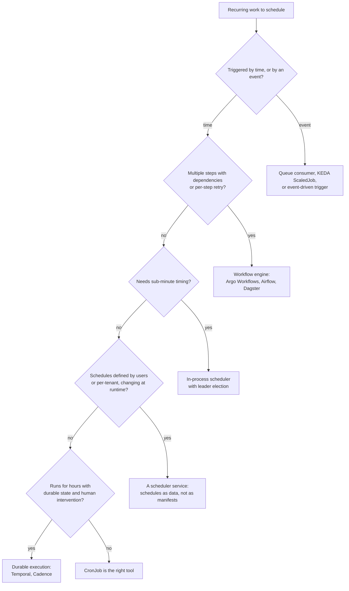

# Fleet Scale, Consolidation, and When to Use Something Else

Riverbend has 412 CronJobs. That number changes the nature of the problem in two ways this
collection has not yet addressed: the fleet has a **cost to the control plane and the monitoring
system** that no individual job is responsible for, and at some point the fleet contains jobs that
should not be CronJobs at all. This doc quantifies the first and gives criteria for the second.

## What a fleet of CronJobs costs

Start by counting firings. Riverbend's distribution, which is fairly typical of a mature cluster —
a long tail of daily jobs and a small number of frequent ones doing most of the work:

| Schedule class | CronJobs | Firings per job per day | Firings per day |
|---|---|---|---|
| `*/5` (every 5 min) | 40 | 288 | 11,520 |
| `*/15` | 60 | 96 | 5,760 |
| hourly | 110 | 24 | 2,640 |
| daily | 180 | 1 | 180 |
| weekly | 22 | 0.14 | 3 |
| **Total** | **412** | | **≈ 20,100** |

Note where the work is. **The 40 five-minute jobs — under 10% of the fleet — produce 57% of all
firings.** The 180 daily jobs, which is where most of the review attention goes because that is
where the important work lives, produce under 1%. Any fleet-level optimisation should start with
the frequency distribution, not with the job list.

Now the objects. Each firing writes, roughly:

| Write | Count |
|---|---|
| Job object created | 1 |
| Job status updates (started, completed) | ~2 |
| Pod created | 1 |
| Pod status updates (scheduled, pulling, running, succeeded) | ~4 |
| Events (`SuccessfulCreate`, scheduling, pulled, created, started) | ~4 |
| Deletions at cleanup (Job + Pod) | 2 |
| **Per firing** | **≈ 14** |

So 20,100 firings × 14 ≈ **280,000 API writes per day**, or about **3.2 writes per second on
average** — before a single one of those jobs does any application work. That average is
misleading in the usual way: doc 01's midnight herd concentrates hundreds of those writes into one
second, and the peak is what breaks things.

Three costs follow, in increasing order of how often they actually bite:

**1. etcd write bandwidth and revision churn.** Every write creates a new etcd revision. Revisions
are compacted (by default every five minutes), so this mostly costs bandwidth and disk I/O rather
than permanent growth — but it also consumes the same write path your Deployments, leases, and
custom resources use. On a small or under-provisioned control plane, batch churn is a real
contributor to apiserver p99 latency.

**2. Watch amplification, which is the bigger effect.** Every Job and Pod write is fanned out to
every watcher of those resources: the Job controller, the scheduler, kube-state-metrics, the GitOps
controller, any operator watching pods, and your logging agent. With eight watchers, 280,000 writes
become **2.2 million watch events a day**. This is why heavy job churn shows up as CPU on
kube-apiserver and on kube-state-metrics rather than in etcd graphs.

**3. Prometheus series churn, which is the one people never predict.** Every Job gets a unique name
containing the scheduled timestamp, so `job_name` is a label whose value **rotates on every
firing**. With roughly 20 kube-state-metrics series per Job:

```
20,100 firings/day × 20 series = 402,000 new series per day
```

Those series are short-lived, but each one is indexed, occupies memory for the retention of its
chunk, and inflates every query that touches job metrics. A fleet like this can easily cost more in
Prometheus memory than the jobs cost in compute. Two mitigations, and you want both:

```yaml
# 1. Drop the per-run identity from metrics you only ever aggregate.
metric_relabel_configs:
  - source_labels: [__name__]
    regex: 'kube_job_status_(succeeded|failed|active)'
    target_label: job_name
    replacement: ''
```

```promql
# 2. Record per-CronJob aggregates and alert on those, so dashboards never touch per-run series.
- record: riverbend:cronjob_run_failures:rate1h
  expr: |
    sum by (namespace, owner_name) (
      rate(kube_job_status_failed[1h])
      * on(job_name, namespace) group_left(owner_name)
        kube_job_owner{owner_kind="CronJob"}
    )
```

⚠️ Dropping `job_name` costs you the ability to point at a specific run in a metric, which you do
occasionally want during an investigation. Keep it for the Job *duration* series (low volume, high
diagnostic value) and drop it from the high-cardinality counters. The run ledger from doc 05 is the
better place for per-run history anyway, because it is not subject to retention or cleanup.

## Consolidation: getting the fleet smaller

Four strategies, ordered by return on effort.

**1. Question the frequency.** This is where the leverage is, because of the distribution above.
For each `*/5` job ask what actually breaks if it runs every 15 minutes. Very often the answer is
nothing — the interval was chosen when the job was written and never revisited.

Moving 20 of the 40 five-minute jobs to `*/15` removes 20 × (288 − 96) = **3,840 firings a day**,
which is a 19% cut in total fleet churn from editing 20 lines. Compare that with any amount of
per-job tuning.

**2. Replace a job-per-entity with one job that iterates.** The pattern to look for is a CronJob
per tenant, per region, per customer, or per table:

```
tenant-sync-acme, tenant-sync-globex, tenant-sync-initech, ... × 240
```

240 CronJobs, 240 schedules to keep aligned, 240 sets of alerts, and 240 × 24 firings a day. One
CronJob that loops over the tenant list does the same work with 24 firings, one alert, and one
runbook:

```python
for tenant in active_tenants():          # the list comes from the database, not from manifests
    with span("sync", tenant=tenant.id):
        try:
            sync(tenant)
            metrics.inc("tenant_sync_ok", tenant=tenant.id)
        except Exception as e:
            # One tenant's failure must not abort the other 239.
            metrics.inc("tenant_sync_failed", tenant=tenant.id)
            log.exception("tenant sync failed", tenant=tenant.id)
failed = metrics.get("tenant_sync_failed")
sys.exit(1 if failed > len(active_tenants()) * 0.05 else 0)   # fail the run past a 5% threshold
```

Two details make or break this. **Per-entity failure isolation** — one bad tenant must not stop the
loop, which the `try` handles — and a **deliberate run-level verdict**: exiting 0 when 30% of
tenants failed recreates F-13, and exiting 1 on a single tenant failure makes the alert useless.
The 5% threshold above is the kind of decision that should be explicit and written down.

⚠️ The thing you lose is per-entity scheduling and per-entity retry. If tenants genuinely need
different schedules, or a failing tenant needs its own retry budget, an indexed Job (doc 03) or a
queue with workers is the better shape — not 240 CronJobs.

**3. Merge co-scheduled trivia, carefully.** Fourteen tiny nightly jobs that each take ten seconds
can become one `nightly-housekeeping` job that runs fourteen steps. You go from 14 firings, 14
alerts, and 14 cold starts to one of each.

The cost is coupling: step 3 failing now affects steps 4–14, and one alert covers fourteen
concerns, so the alert becomes "something in housekeeping broke" — which is materially less useful
at 03:00. Do this only when the steps are genuinely independent and you make the job continue past
a failed step while reporting per-step outcomes (the same shape as the tenant loop). If the steps
have real ordering dependencies, you have a workflow, and the next section applies.

**4. Do not let TTL confusion mislead you.** Shortening `ttlSecondsAfterFinished` reduces the
*standing* object count — which helps quota (doc 06) and kube-state-metrics memory — but it does
**not** reduce the write rate. In fact it adds the delete writes sooner. Tune TTL for quota and
debuggability, and tune frequency for churn; they are different problems.

## When a CronJob is the wrong tool

Doc 00 listed this briefly. Here is the decision with criteria.



Each branch, with the reasoning:

**Event-driven work disguised as a schedule.** The tell is a job that starts by asking "is there
anything to do?" — polling a bucket, a queue, or a table for new rows. `*/1 * * * *` polling means
1,440 firings a day, nearly all of which find nothing, plus up to 60 seconds of latency on work
that could have started immediately. A queue consumer, or KEDA's `ScaledJob` scaling on queue
depth, gives you lower latency and less churn at once. (KEDA also has a cron *scaler*, which is a
different thing: it scales a Deployment's replica count on a schedule. That is the right tool for
"run 20 replicas during business hours", not for "do this task once".)

**Multi-step work with dependencies.** `catalog-reindex` after `invoice-rollup` after
`partner-import`, where step 2 must not start until step 1 succeeds and a failed step 3 should be
retryable on its own. Expressing this with CronJobs means encoding the dependency as a clock
offset — "reindex at 03:00 because rollup is usually done by 02:50" — which is invisible,
undocumented, and breaks silently the first time the rollup gets slower. Argo Workflows'
`CronWorkflow` is the smallest step up: it keeps the Kubernetes-native model and adds a DAG, retry
per step, artifact passing, and a UI that shows which step failed. Airflow or Dagster make sense
when the work is data-pipeline shaped and you want backfills, lineage, and a catalogue as
first-class features.

**Sub-minute timing.** No seconds field, and no latency guarantee on firing (doc 00). "Every 10
seconds" belongs in a process with a ticker and leader election. Do not be tempted by a CronJob
whose container loops with `sleep 10` for a minute — that is a sleeping Deployment with extra
steps, and doc 00 covered why that is worse than either option.

**Schedules that are data.** If your product lets customers choose when their report runs, you
cannot represent that as manifests: 10,000 customers is 10,000 CronJobs, which breaks the control
plane, your GitOps repo, and every dashboard. The schedules belong in a database, with one
service (or one frequent CronJob) that reads due schedules and enqueues work. The test is whether a
schedule changes through your deployment pipeline or through a user clicking a button — the second
one means schedules are data.

**Long-running, stateful, resumable work.** A three-hour migration with per-step compensation, or a
process that waits for a human approval in the middle, is a durable execution problem. Temporal
gives you retries, timers, state persistence, and resumability as language-level constructs,
which is a much better fit than a job that has to reconstruct "where was I" from a checkpoint
table on every restart.

### The comparison, side by side

| | Kubernetes CronJob | Argo CronWorkflow | Airflow / Dagster | Temporal | KEDA ScaledJob | In-process scheduler |
|---|---|---|---|---|---|---|
| Multi-step DAG | no | yes | yes | yes (as code) | no | as code |
| Per-step retry | no | yes | yes | yes | no | as code |
| Backfill built in | no | partial | **yes** | as code | n/a | no |
| Sub-minute | no | no | no | yes | yes | **yes** |
| Event triggers | no | yes | yes | yes | **yes** | as code |
| Schedules as runtime data | no | no | partial | yes | no | yes |
| Run history UI | no | yes | yes | yes | no | no |
| Operational burden | **lowest** | medium | highest | high | low | low, but you own correctness |
| New infrastructure needed | none | controller | scheduler, DB, workers | cluster, workers | operator | none |

The rightmost columns are not better, they are heavier. **A CronJob's decisive advantage is that it
needs nothing** — no extra control plane, no database, no operator, no on-call rotation for the
scheduler itself. For 380 of Riverbend's 412 jobs that is the correct trade. The point of the table
is to identify the 30 or so where it is not.

## Migrating in, and migrating out

**From legacy crontab or a Jenkins server.** The mistake is porting mechanically; the work is
mostly classification, and the migration is the best chance you will get to fix a decade of
accumulated assumptions.

1. **Inventory.** `crontab -l` on every host plus the Jenkins job list. Expect to find jobs nobody
   owns, jobs that have failed silently for a year, and two copies of the same job on different
   hosts.
2. **Classify before porting.** For each: is it still needed? Is it idempotent? What is its tier
   (doc 10)? Does it belong in the decision tree above? Riverbend deleted 18% of its legacy cron
   entries at this step, which is the single highest-value outcome of the whole exercise.
3. **Port with the golden template**, not with a literal translation. A crontab line carries no
   deadline, no concurrency policy, and no identity, and every one of those gaps is a failure mode
   from doc 04.
4. **Run both in parallel briefly** with the new job in dry-run mode, and compare outputs before
   turning the old one off. For anything money-related, this step is not optional.
5. **Delete the old one and remove the host.** An un-migrated crontab on a host you forgot about is
   how you get a duplicate execution nine months later (F-15).

**From CronJob to a workflow engine.** Do it incrementally. Keep the CronJob as the *trigger* and
move the orchestration:

```yaml
# The CronJob's only job becomes "start the workflow and wait for it".
args: ["submit", "--wait", "--from=workflowtemplate/nightly-close"]
```

This keeps the schedule, the alerting, and the runbook you already have, while the DAG, per-step
retries, and history move to the engine. You migrate the hard part without migrating everything at
once — and if the engine turns out to be the wrong choice, the rollback is one manifest.

## Multi-cluster and disaster recovery

Two clusters with the same GitOps repo means two CronJob controllers firing the same schedules,
neither aware of the other (F-15). This is the fleet-scale version of the duplicate-execution
problem and it needs an explicit answer, not an assumption.

**Option 1: a single active cluster, schedules suspended in standby.** The simplest correct answer.
It requires the suspension to be *reliable*, which means it lives in cluster-specific configuration
(a Kustomize overlay, a Helm value, an Argo CD cluster label) rather than in a manual patch someone
applied once:

```yaml
# overlays/dr/cronjob-patch.yaml — every CronJob in the DR cluster is suspended by construction.
- op: replace
  path: /spec/suspend
  value: true
```

The failover procedure then has "unsuspend scheduled work" as an explicit, rehearsed step — and
doc 01's missed-schedule wall is waiting for you there, because the standby's CronJobs have a
`lastScheduleTime` from whenever they last ran. Expect to need `startingDeadlineSeconds` and a
verification pass. **Rehearse the failover including the CronJobs**, because a DR test that only
checks serving traffic will report success while every scheduled job stays dark.

**Option 2: let both fire, and make the work safe.** If the jobs are idempotent and coordinate
through a shared database (doc 05's claim-the-run pattern), both clusters can fire and the first
one to claim each run wins. This is more robust — no failover step to forget — and it requires the
data-level exclusion to be genuinely correct, since it is now load-bearing rather than a backstop.

**Option 3: schedule from outside the cluster.** A cloud scheduler (EventBridge Scheduler, Cloud
Scheduler) or a single global scheduler service triggers work through an API, and the clusters host
only workers. This removes the duplication question entirely and adds an external dependency plus
a second place where schedules live. It is the right answer when schedules must be global across
regions, and overkill otherwise.

Pick one deliberately and write it in the runbook. The default — nobody decided, and the DR cluster
happens to have everything suspended because someone did it by hand in 2025 — is the one that
fails during the next real failover.

## What to take away

1. Count firings, not CronJobs. Riverbend's 40 five-minute jobs are 10% of the fleet and 57% of the
   churn; that distribution tells you where to optimise.
2. A 412-job fleet costs roughly 280,000 API writes a day before doing any work, and watch
   amplification multiplies that across every controller watching Jobs and Pods.
3. The unexpected cost is Prometheus series churn — about 400,000 new series a day, because
   `job_name` rotates every firing. Drop it from high-volume counters and keep per-run history in
   the run ledger.
4. The highest-leverage consolidation is asking why a job runs every five minutes. Moving 20 jobs
   from `*/5` to `*/15` cut total fleet churn by 19%.
5. Replace job-per-tenant with one job that iterates — with per-entity failure isolation and an
   explicit run-level verdict, or you have traded 240 alerts for one useless one.
6. A CronJob's decisive advantage is that it requires no additional infrastructure. Move off it only
   for a specific reason: step dependencies, sub-minute timing, event triggers, schedules as runtime
   data, or durable long-running state.
7. Encoding a step dependency as a clock offset — "reindex at 03:00 because rollup finishes by
   02:50" — is the clearest sign you need a workflow engine.
8. Migrate in by classifying, not translating. Expect to delete a fifth of what you find.
9. Decide explicitly how scheduled work behaves in a second cluster, make the answer structural
   rather than manual, and rehearse the failover with the CronJobs included.
