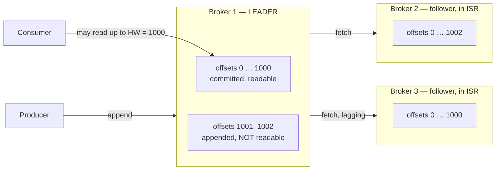

# The Mental Model, and the Six Ways Kafka Fails You

Everything in this collection depends on a small number of ideas that Kafka's documentation
states correctly but rarely explains: what a partition physically is, what "in-sync" means,
which offset a consumer is allowed to read, and who decides. This doc builds those ideas from
scratch, then sets out the taxonomy that the rest of the collection is organised around.

It is worth reading even if you have operated Kafka for years, for one reason: most people
carry a model of Kafka as "a queue with a log underneath." That model predicts the wrong thing
in exactly the situations where you need it most — during a leader election, during a
rebalance, and when a replica falls behind. The model that predicts correctly is "a replicated
log with a *committed prefix*, and several independent cursors over it."

## A partition is a file, and an offset is a position in it

Start with one partition and no replication, because every later complication is a variation on
this.

A partition is an append-only sequence of records stored on one broker's disk. Producers append
to the end. Each appended record gets the next integer in sequence — its **offset**. Offsets are
assigned by the broker, not by the producer, and they are unique and monotonic *within one
partition only*. There is no cluster-wide ordering and no topic-wide ordering. When someone says
"Kafka preserves order," the complete sentence is "Kafka preserves order within a partition."

On disk, a partition is a directory. `orders.created` partition 7 lives in a directory called
`orders.created-7`, containing **segments**: pairs of a `.log` file holding records and index
files (`.index`, `.timeindex`) that let the broker jump to an offset or a timestamp without
scanning. One segment is **active** — the one currently being appended to. The rest are closed.
This matters more than it sounds like it should, and doc 07 is largely about consequences of it:
retention and compaction only ever act on closed segments, so the newest data on a topic is
always exempt from both.

Reads are also positional. A consumer says "give me records from offset 41,209 of partition 7"
and the broker uses the index to seek. Because the broker is reading a file sequentially and
writing it sequentially, and because the operating system keeps recently-touched file pages in
memory (the **page cache**), a healthy Kafka cluster does very little actual disk I/O. Producers
write into page cache; consumers read from page cache; the pages are flushed to disk in the
background. Keep this in mind — it is the single mechanism behind the most confusing
cluster-wide slowdowns, and doc 08 derives exactly when it stops working for Riverbend.

### Kafka does not know what you have processed

Here is the first place the "queue" model misleads people. In a traditional message queue, the
broker holds a message until a consumer acknowledges it, then deletes it. The broker knows what
is outstanding.

Kafka does none of that. Records are deleted on a **timer** (or by compaction), entirely
independently of whether anyone read them. What a consumer group stores is a single number per
partition — the **committed offset**, meaning "the next offset this group should read." That
number lives in an ordinary Kafka topic called `__consumer_offsets`.

Two consequences follow immediately, and both are responsible for entire classes of incidents:

1. **Committing an offset is a claim, not a proof.** Nothing verifies that you processed
  anything. If your code commits offset 500 and then crashes before writing record 499 to the
   database, record 499 is gone from your pipeline's point of view. This is why
   `enable.auto.commit=true` — still the default — is the wrong setting for most consumers, and
   doc 04 covers exactly what it commits and when.
2. **Retention and consumption are in a race.** If a consumer group falls further behind than
  the retention period, the records it has not read yet are deleted while it is still behind.
   Kafka will not warn you; it will throw `OffsetOutOfRangeException` at the consumer, and the
   consumer's `auto.offset.reset` setting decides whether you silently skip the gap or silently
   reprocess from the beginning. Doc 07, `T-01`.


## Replication: leaders, followers, and the in-sync replica set

Now add replication, which is what makes a partition survive a broker dying.

A partition with **replication factor 3** exists as three copies on three different brokers. One
copy is the **leader**; the other two are **followers**. All reads and writes go through the
leader. (There is one exception — followers can serve reads to rack-local consumers, covered in
doc 08 as a cost-reduction technique — but the durability model is unchanged by it.)

Followers stay current by doing exactly what a consumer does: they issue fetch requests to the
leader and append what comes back. A follower is nothing more than a specialised consumer of the
leader's log.

Each replica tracks its **log end offset (LEO)**: the offset that will be assigned to the next
record it appends. If the leader has appended records up to offset 1,000, its LEO is 1,001. A
follower that has fetched everything has the same LEO. A follower that is three records behind
has LEO 998.

The **in-sync replica set (ISR)** is the set of replicas the leader considers current. A replica
is in the ISR if it has fetched up to the leader's LEO within the last
`replica.lag.time.max.ms` — **30 seconds by default**. Note carefully what that threshold is
measured in: *time since the follower last caught up*, not number of records behind. A follower
can be 4 million records behind and still be in the ISR, provided it was fully caught up 29
seconds ago and has been fetching continuously since. This surprises people, and doc 02 (`R-03`)
explains why the time-based definition is the right one anyway.

### The high watermark is the line between "written" and "readable"

The leader computes one more number: the **high watermark (HW)**, defined as the *minimum LEO
across all replicas currently in the ISR*.

Consumers are only allowed to read up to the high watermark. Records above it exist on the
leader's disk but are invisible.

This one rule is the entire consistency model, so it is worth making concrete. Take
`orders.created` partition 7, replication factor 3, with replicas on brokers 1 (leader), 2, and
3. The producer has appended three records:


| Replica  | Role             | Has records through | LEO   |
| -------- | ---------------- | ------------------- | ----- |
| broker 1 | leader           | 1,002               | 1,003 |
| broker 2 | follower, in ISR | 1,002               | 1,003 |
| broker 3 | follower, in ISR | 1,000               | 1,001 |


The high watermark is `min(1003, 1003, 1001) = 1001`. So consumers can read records up to and
including offset 1,000. Records 1,001 and 1,002 are on two brokers' disks and are still
invisible, because broker 3 has not confirmed them yet.

Why hide them? Because if broker 1 dies right now and broker 3 becomes leader, offsets 1,001 and
1,002 do not exist on broker 3 and never will. Had consumers been allowed to read them, they
would have read records that subsequently ceased to exist — a record that un-happens. By
withholding everything above the high watermark, Kafka guarantees that **anything a consumer can
see will survive any leader election among in-sync replicas**. That is the guarantee. It is
strong and it is narrow, and doc 02 is about the two configuration settings that quietly widen
or destroy it.




### Leader epochs exist because the high watermark is not instantaneous

One refinement, because it explains a class of "impossible" bugs.

The high watermark is computed on the leader and propagated to followers in fetch responses,
which means a follower's idea of the high watermark is always slightly stale. In early Kafka
versions, a follower recovering after a restart truncated its log to *its own last known* high
watermark and then re-fetched. If leadership had changed in the meantime, two replicas could
each truncate to a different point and then diverge — the same offset holding different records
on different brokers.

The fix (Kafka 0.11, KIP-101) was the **leader epoch**: a counter incremented on every leader
election, stamped into the log. A recovering follower now asks the current leader "what was the
end offset of epoch 7?" and truncates to that, which is unambiguous. You will encounter epochs
in three places: in `kafka-dump-log.sh` output, in the `leader-epoch-checkpoint` file in each
partition directory, and in `OutOfOrderSequenceException` investigations (doc 03, `P-08`). You
do not configure them. You just need to know they are why a modern cluster cannot silently
diverge the way a 2016 cluster could.

## Who decides: the controller

Something has to notice broker 1 died and appoint a new leader for every partition it led. That
is the **controller**.

For most of Kafka's history the controller was an elected broker that kept cluster metadata in
ZooKeeper. This worked, with one structural weakness: when the controller itself failed, the
newly elected controller had to load the entire cluster's metadata out of ZooKeeper before it
could do anything. On a cluster with 200,000 partitions that could take minutes, during which no
leader elections happened at all — so an unrelated broker failure during controller failover
meant an extended partial outage.

**KRaft** (Kafka 3.3+ for production use, mandatory from 4.0) replaces this. Metadata is itself a
replicated Kafka log, `__cluster_metadata`, maintained by a quorum of three or five controllers
using Raft. Every controller already has the metadata in memory, so failover is a leader
election on one log rather than a bulk load, and it completes in well under a second regardless
of cluster size. Riverbend runs three dedicated controllers.

What you should take from this operationally:

- On KRaft, the **controller quorum** is a distinct availability domain. Three controllers
tolerate one failure; five tolerate two. Losing quorum does not stop existing leaders from
serving traffic, but it freezes all metadata change — no leader elections, no topic creation,
no ISR updates. Doc 01, `B-09`.
- The old ZooKeeper-mode advice "keep partition count below about 200,000 per cluster" was
mostly a controller-failover constraint. KRaft raises that ceiling by more than an order of
magnitude, but it does not remove the *per-broker* constraints, which are about file handles,
memory, and replication fan-out. Doc 08, `S-01`, separates the two.


## Consumer groups: several independent cursors

A **consumer group** is a set of consumer instances that share a `group.id` and between them
read every partition of the subscribed topics exactly once. Each partition is assigned to
exactly one member. If there are more members than partitions, the surplus members sit idle —
which is the reason `clickstream-rollup-group` has 40 members against 200 partitions and not 400.

Two groups reading the same topic are completely independent. `order-processor-group` and
`fraud-scorer-group` both read all 24 partitions of `orders.created`, each with its own
committed offsets, each unaware of the other. This is why Kafka is a good integration
substrate — adding a consumer costs the cluster read bandwidth and nothing else.

The assignment of partitions to members is recomputed by a process called a **rebalance**, which
runs whenever membership changes. A rebalance is the single largest source of operational pain
in Kafka consumer fleets, it gets worse superlinearly with group size, and doc 04 is devoted to
it.

## Putting numbers on Riverbend

The README states Riverbend's traffic figures. They are derived here once so that every later
claim can be checked, and so you can see which assumptions each number depends on.

**Ingress from producers.** Multiply each topic's record rate by its average record size:


| Topic                   | Average           | Calculation | MB/s     | Peak calculation  | MB/s      |
| ----------------------- | ----------------- | ----------- | -------- | ----------------- | --------- |
| `orders.created`        | 640/s × 1.8 KB    | 1,152 KB/s  | 1.15     | 3,400/s × 1.8 KB  | 6.12      |
| `payments.settled`      | 180/s × 2.4 KB    | 432 KB/s    | 0.43     | 900/s × 2.4 KB    | 2.16      |
| `inventory.adjustments` | 1,200/s × 0.4 KB  | 480 KB/s    | 0.48     | 6,000/s × 0.4 KB  | 2.40      |
| `catalog.changes`       | 40/s × 12 KB      | 480 KB/s    | 0.48     | 200/s × 12 KB     | 2.40      |
| `clickstream.events`    | 34,000/s × 1.2 KB | 40,800 KB/s | 40.80    | 85,000/s × 1.2 KB | 102.00    |
| **Total**               |                   |             | **43.3** |                   | **115.1** |


So `clickstream.events` is 94% of the bytes entering the cluster and about 0.1% of the business
value. That ratio is not unusual, and it drives most of the design tension in this collection:
the topic you care least about dominates every capacity decision you make about the topics you
care most about.

**Bytes written to disk per broker.** Every record is written once per replica, so cluster-wide
disk writes are the ingress weighted by replication factor:

```
RF=3 topics:  (1.15 + 0.43 + 0.48 + 0.48) MB/s × 3 =  7.6 MB/s
RF=2 topic:                        40.8 MB/s × 2 = 81.6 MB/s
                                            total = 89.2 MB/s cluster-wide
                                        ÷ 6 brokers = 14.9 MB/s per broker (average)
```

At peak the same arithmetic gives `(13.1 × 3 + 102 × 2) ÷ 6 = 40.5 MB/s` per broker.

**Page-cache residency.** Each broker has 32 GiB of RAM, of which 6 GiB is the JVM heap and
roughly 2 GiB goes to the operating system and the JVM's off-heap overhead, leaving about
24 GiB — call it 25,770 MB — for page cache. Dividing by the write rate gives how far back in
time a consumer can read and still be served from memory:

```
average load:  25,770 MB ÷ 14.9 MB/s = 1,729 s ≈ 29 minutes
peak load:     25,770 MB ÷ 40.5 MB/s =   636 s ≈ 11 minutes
```

⚠️ **This is the most important derived number in the collection.** A consumer group lagging by
less than eleven minutes costs the cluster almost nothing. A consumer group lagging by more than
that forces the broker to read from disk, and those disk reads pull old pages into the cache,
evicting the recent pages that producers and healthy consumers depend on. The cost of lag is not
linear; it has a cliff, and the cliff moves closer as traffic grows. Case study CS-4 in doc 11 is
this exact failure, and doc 06 is about staying on the right side of it.

**Disk consumption.** Retention times multiplied by rates and replication factor:


| Topic                   | Raw bytes retained              | × RF | Cluster GB   |
| ----------------------- | ------------------------------- | ---- | ------------ |
| `orders.created`        | 1.15 MB/s × 72 h = 298 GB       | ×3   | 894          |
| `payments.settled`      | 0.43 MB/s × 7 d = 260 GB        | ×3   | 780          |
| `inventory.adjustments` | compacted, ~140 GB steady state | ×3   | 420          |
| `catalog.changes`       | compacted, ~50 GB steady state  | ×3   | 150          |
| `clickstream.events`    | 40.8 MB/s × 24 h = 3,525 GB     | ×2   | 7,050        |
| **Total**               |                                 |      | **9,294 GB** |


Across 6 brokers that is **1.55 TB per broker of a 2 TB disk — 78% full at steady state.**

⚠️ Seventy-eight percent is a number worth staring at, because it means Riverbend has no room
for any of the following: a broker failing and its partitions being reassigned onto the
survivors, someone raising `clickstream.events` retention from 24 h to 48 h, a compaction
backlog, or a lagging consumer preventing segment deletion. Doc 01 (`B-02`, `B-03`) covers what
each of those actually does, and every one of them has taken down a real cluster.

## The six-way failure taxonomy

With the model in place, here is the organising question for the rest of the collection. A
record enters at a producer and should arrive, once, in order, promptly, at every consumer
group. There are exactly six ways that can go wrong, and every scenario in docs 01–09 is one of
them.


| #   | Failure        | What it means                                                               | Primarily covered in                                                     |
| --- | -------------- | --------------------------------------------------------------------------- | ------------------------------------------------------------------------ |
| 1   | **Lost**       | A record was acknowledged to the producer and is not readable by a consumer | 02 (durability), 01 (storage), 07 (retention)                            |
| 2   | **Duplicated** | A record is delivered or written more than once                             | 03 (producer retries), 04 (rebalance + commit), 05 (semantics)           |
| 3   | **Reordered**  | Records for one key become readable in a different order than produced      | 03 (in-flight requests), 05 (partition remap), 06 (parallel consumption) |
| 4   | **Stalled**    | Records are durable and correct, but nobody is consuming them               | 04 (rebalance), 05 (hanging transactions), 06 (lag, poison messages)     |
| 5   | **Rejected**   | The producer cannot write at all                                            | 02 (below min ISR), 01 (broker/disk), 03 (buffer full)                   |
| 6   | **Unreadable** | The bytes are present but cannot be interpreted or located                  | 07 (schema, compaction), 02 (truncation)                                 |


Two things are worth noticing about this table.

**The same root cause appears under different failures depending on configuration.** An
availability-zone outage on `orders.created` is failure 5 (rejected — the producer gets
`NotEnoughReplicasException` and blocks) if `min.insync.replicas=2`, and failure 1 (lost — the
write is acknowledged by a single replica which then dies) if `min.insync.replicas=1`. Same
event, same cluster, different outcome, and the only difference is one integer set years ago by
someone who is no longer on the team. That is the thesis of doc 02.

**Failures 4 and 5 are the ones you want.** Stalling and rejecting are loud, recoverable, and
bounded. Losing, duplicating, and reordering are silent and often unbounded — you find out from a
finance reconciliation three weeks later. A recurring recommendation in this collection is to
deliberately convert silent failures into loud ones: prefer a wedged partition over a dropped
record, prefer a blocked producer over an unreplicated acknowledgement. You will be paged more
often and you will lose less data, and the second is worth considerably more than the first is
worth avoiding.

## What to take away

1. **A partition is an append-only file; an offset is a position in it.** Ordering exists within
  a partition and nowhere else.
2. **Kafka does not track what you processed.** It stores one integer per group per partition,
  and that integer is a claim your code makes, not a fact the broker verifies.
3. **The ISR is defined by time, not by record count.** A replica is in-sync if it caught up
  within `replica.lag.time.max.ms` (30 s default), regardless of how far behind it is right now.
4. **The high watermark — the minimum LEO across the ISR — is the line between written and
  readable.** Everything a consumer can see survives any election among in-sync replicas. That
   is the whole consistency guarantee, and configuration can narrow it.
5. **Leader epochs prevent log divergence** during elections. You do not configure them, but
  they are the reason modern clusters cannot silently disagree about what offset 1,001 contains.
6. **The controller is a separate availability domain.** On KRaft, losing controller quorum
  freezes metadata change — including leader elections — without stopping current traffic.
7. **Page cache is the performance model.** For Riverbend, a consumer lagging under about eleven
  minutes at peak is free; beyond that it converts into disk reads that degrade everyone else.
8. **The topic you care least about sets your capacity limits.** `clickstream.events` is 94% of
  Riverbend's bytes and dominates every decision about the 6% that matters.
9. **Six failures, and you should engineer toward two of them.** Stalled and rejected are loud
  and bounded; lost, duplicated, reordered and unreadable are silent. Configure for the loud
   ones deliberately.

Next: [01-broker-storage-and-cluster-failures.md](01-broker-storage-and-cluster-failures.md) for
what happens when the machines underneath this model fail, or jump to
[02-replication-isr-and-durability.md](02-replication-isr-and-durability.md) for the durability
contract, which is where the highest-consequence misconfigurations live.